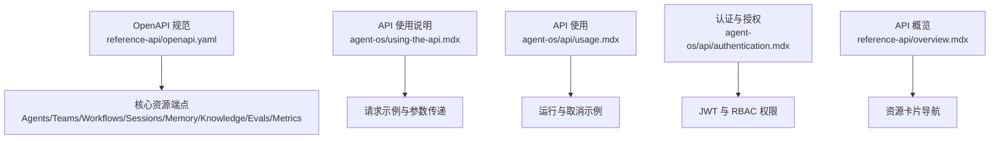
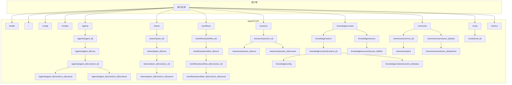
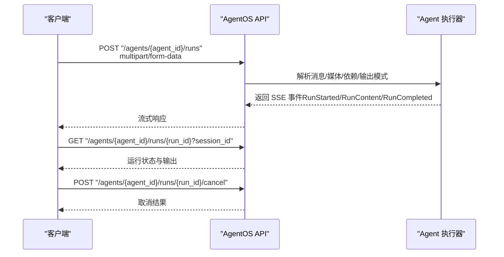
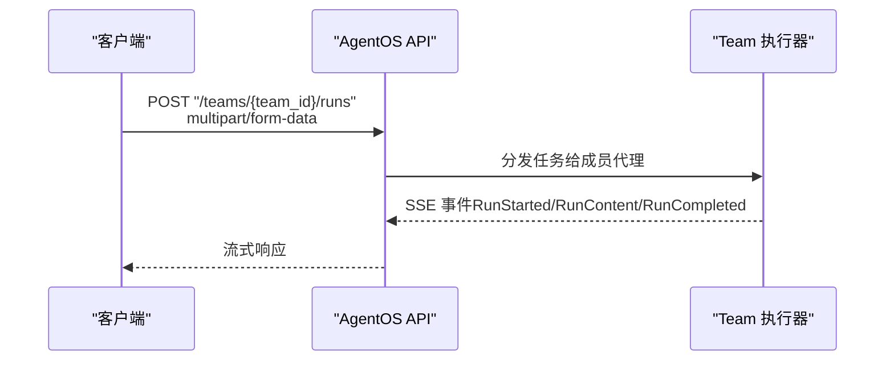
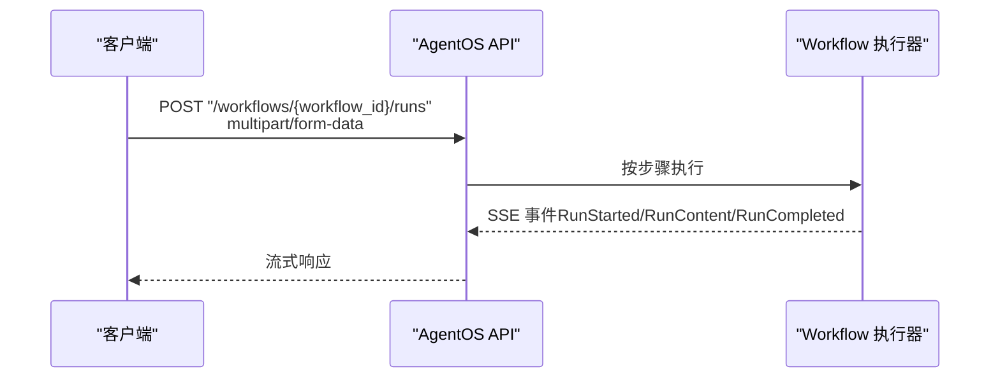
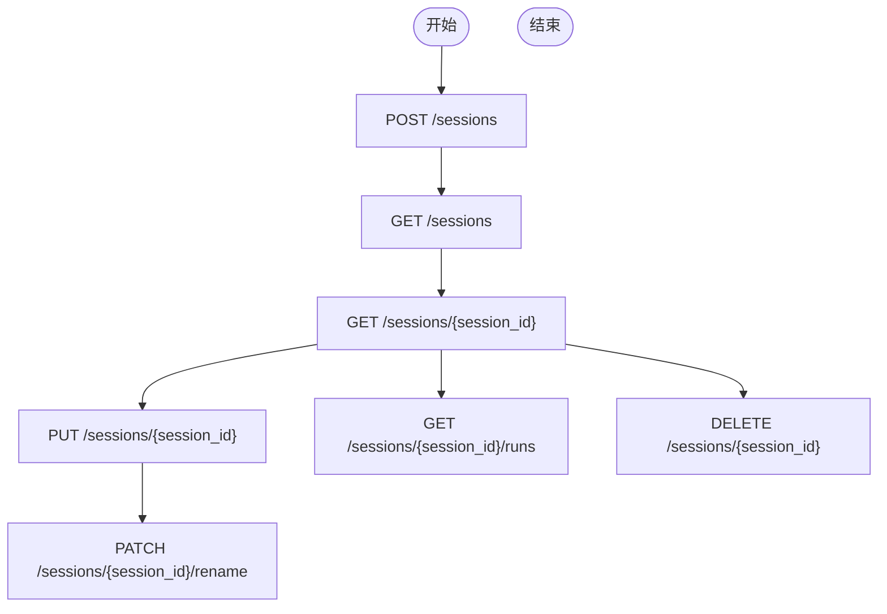
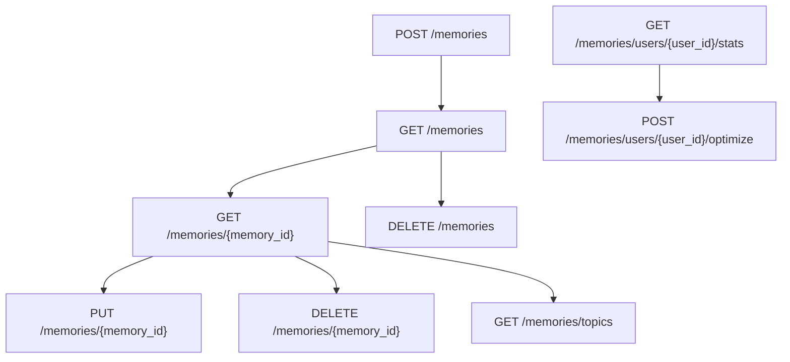
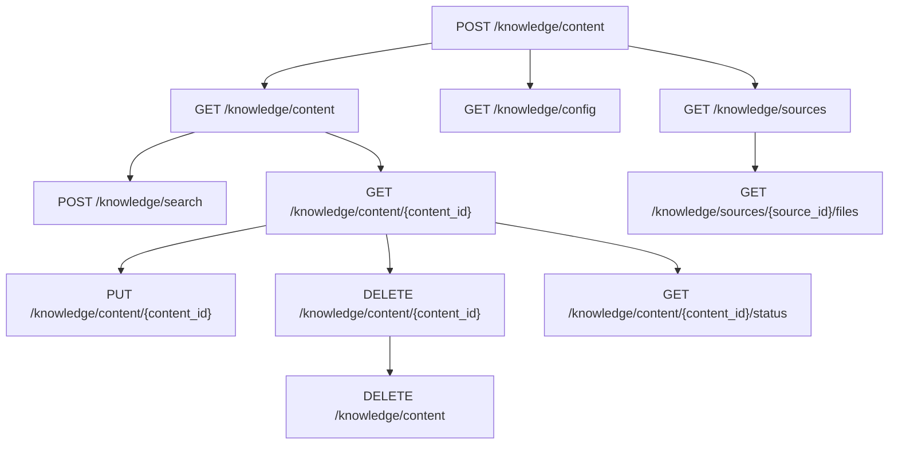
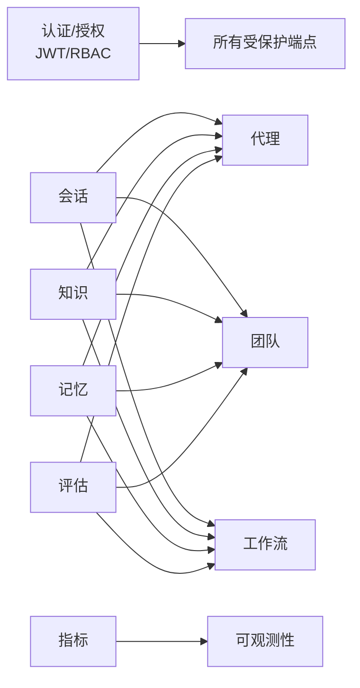

# API 参考

<cite>
**本文引用的文件**
- [openapi.yaml](file://reference-api/openapi.yaml)
- [API 使用说明](file://agent-os/using-the-api.mdx)
- [API 使用](file://agent-os/api/usage.mdx)
- [认证与授权](file://agent-os/api/authentication.mdx)
- [API 概览](file://reference-api/overview.mdx)
- [agents/create-agent-run](file://reference-api/schema/agents/create-agent-run.mdx)
- [teams/create-team-run](file://reference-api/schema/teams/create-team-run.mdx)
- [workflows/execute-workflow](file://reference-api/schema/workflows/execute-workflow.mdx)
- [knowledge/upload-content](file://reference-api/schema/knowledge/upload-content.mdx)
- [memory/create-memory](file://reference-api/schema/memory/create-memory.mdx)
</cite>

## 目录
1. [简介](#简介)
2. [项目结构](#项目结构)
3. [核心组件](#核心组件)
4. [架构总览](#架构总览)
5. [详细组件分析](#详细组件分析)
6. [依赖关系分析](#依赖关系分析)
7. [性能考量](#性能考量)
8. [故障排查指南](#故障排查指南)
9. [结论](#结论)
10. [附录](#附录)

## 简介
本文件为 AgentOS 的完整 API 参考，覆盖代理（Agent）、团队（Team）、工作流（Workflow）、会话（Session）、记忆（Memory）、知识（Knowledge）、评估（Eval）、指标（Metrics）等核心资源的 RESTful 接口。内容基于仓库中的 OpenAPI 规范与各模块参考文档，提供端点、参数、响应格式、错误码及典型请求示例，并对认证与授权进行说明。

## 项目结构
AgentOS 的 API 文档由两部分组成：
- OpenAPI 规范：集中描述所有端点、参数、响应与错误码
- 参考页面：按资源分组的详细说明与示例

图表来源
- [openapi.yaml](file://reference-api/openapi.yaml)
- [API 使用说明](file://agent-os/using-the-api.mdx)
- [API 使用](file://agent-os/api/usage.mdx)
- [认证与授权](file://agent-os/api/authentication.mdx)
- [API 概览](file://reference-api/overview.mdx)

章节来源
- [openapi.yaml](file://reference-api/openapi.yaml)
- [API 使用说明](file://agent-os/using-the-api.mdx)
- [API 使用](file://agent-os/api/usage.mdx)
- [认证与授权](file://agent-os/api/authentication.mdx)
- [API 概览](file://reference-api/overview.mdx)

## 核心组件
- 代理（Agent）
  - 运行：POST /agents/{agent_id}/runs
  - 列表：GET /agents
  - 获取详情：GET /agents/{agent_id}
  - 运行列表：GET /agents/{agent_id}/runs
  - 获取单次运行：GET /agents/{agent_id}/runs/{run_id}
  - 取消运行：POST /agents/{agent_id}/runs/{run_id}/cancel
  - 继续运行：POST /agents/{agent_id}/runs/{run_id}/continue
- 团队（Team）
  - 运行：POST /teams/{team_id}/runs
  - 列表：GET /teams
  - 获取详情：GET /teams/{team_id}
  - 运行列表：GET /teams/{team_id}/runs
  - 获取单次运行：GET /teams/{team_id}/runs/{run_id}
  - 取消运行：POST /teams/{team_id}/runs/{run_id}/cancel
- 工作流（Workflow）
  - 执行：POST /workflows/{workflow_id}/runs
  - 列表：GET /workflows
  - 获取详情：GET /workflows/{workflow_id}
  - 运行列表：GET /workflows/{workflow_id}/runs
  - 获取单次运行：GET /workflows/{workflow_id}/runs/{run_id}
  - 取消运行：POST /workflows/{workflow_id}/runs/{run_id}/cancel
- 会话（Session）
  - 创建：POST /sessions
  - 列表：GET /sessions
  - 获取：GET /sessions/{session_id}
  - 更新：PUT /sessions/{session_id}
  - 删除：DELETE /sessions/{session_id}
  - 获取运行：GET /sessions/{session_id}/runs
  - 重命名：PATCH /sessions/{session_id}/rename
- 记忆（Memory）
  - 创建：POST /memories
  - 列表：GET /memories
  - 获取：GET /memories/{memory_id}
  - 更新：PUT /memories/{memory_id}
  - 删除：DELETE /memories/{memory_id}
  - 批量删除：DELETE /memories
  - 主题：GET /memories/topics
  - 用户统计：GET /memories/users/{user_id}/stats
  - 优化：POST /memories/users/{user_id}/optimize
- 知识（Knowledge）
  - 上传：POST /knowledge/content
  - 搜索：POST /knowledge/search
  - 列表：GET /knowledge/content
  - 获取：GET /knowledge/content/{content_id}
  - 更新：PUT /knowledge/content/{content_id}
  - 删除：DELETE /knowledge/content/{content_id}
  - 清空：DELETE /knowledge/content
  - 配置：GET /knowledge/config
  - 内容源：GET /knowledge/sources
  - 源内文件：GET /knowledge/sources/{source_id}/files
  - 状态：GET /knowledge/content/{content_id}/status
- 评估（Eval）
  - 执行：POST /evals
  - 列表：GET /evals
  - 获取：GET /evals/{eval_id}
  - 更新：PUT /evals/{eval_id}
  - 删除：DELETE /evals/{eval_id}
- 指标（Metrics）
  - 获取：GET /metrics
  - 刷新：POST /metrics/refresh
- 健康检查（Health）
  - 检查：GET /health
- 根信息（Home）
  - 信息：GET /
- 配置（Config）
  - 获取：GET /config
- 模型（Models）
  - 获取：GET /models

章节来源
- [openapi.yaml](file://reference-api/openapi.yaml)
- [API 使用说明](file://agent-os/using-the-api.mdx)
- [API 使用](file://agent-os/api/usage.mdx)

## 架构总览
AgentOS API 采用统一的 RESTful 设计，围绕“资源 + 动作”的模式组织端点。认证通过 Bearer Token（JWT）实现，支持 RBAC 权限控制；健康检查与根信息端点用于快速验证实例状态与能力概览。

图表来源
- [openapi.yaml](file://reference-api/openapi.yaml)

## 详细组件分析

### 代理（Agent）API
- 运行代理
  - 方法与路径：POST /agents/{agent_id}/runs
  - 请求体：multipart/form-data，支持消息、媒体文件、依赖、输出模式等
  - 响应：JSON 或 Server-Sent Events（SSE）流
  - 典型用途：文本/多媒体输入、实时流式输出、会话上下文保持
- 列出代理
  - 方法与路径：GET /agents
  - 响应：代理元数据数组
- 获取代理详情
  - 方法与路径：GET /agents/{agent_id}
  - 响应：代理完整配置
- 代理运行管理
  - 列出运行：GET /agents/{agent_id}/runs?session_id&status
  - 获取运行：GET /agents/{agent_id}/runs/{run_id}?session_id
  - 取消运行：POST /agents/{agent_id}/runs/{run_id}/cancel
  - 继续运行：POST /agents/{agent_id}/runs/{run_id}/continue（支持工具结果或管理员审批）

图表来源
- [openapi.yaml](file://reference-api/openapi.yaml)
- [API 使用](file://agent-os/api/usage.mdx)

章节来源
- [openapi.yaml](file://reference-api/openapi.yaml)
- [API 使用](file://agent-os/api/usage.mdx)
- [agents/create-agent-run](file://reference-api/schema/agents/create-agent-run.mdx)

### 团队（Team）API
- 运行团队
  - 方法与路径：POST /teams/{team_id}/runs
  - 请求体：multipart/form-data，支持消息、媒体文件、依赖等
  - 响应：JSON 或 SSE 流
- 团队运行管理
  - 列出运行：GET /teams/{team_id}/runs?session_id&status
  - 获取运行：GET /teams/{team_id}/runs/{run_id}?session_id
  - 取消运行：POST /teams/{team_id}/runs/{run_id}/cancel

图表来源
- [openapi.yaml](file://reference-api/openapi.yaml)
- [teams/create-team-run](file://reference-api/schema/teams/create-team-run.mdx)

章节来源
- [openapi.yaml](file://reference-api/openapi.yaml)
- [teams/create-team-run](file://reference-api/schema/teams/create-team-run.mdx)

### 工作流（Workflow）API
- 执行工作流
  - 方法与路径：POST /workflows/{workflow_id}/runs
  - 请求体：multipart/form-data，支持消息、媒体文件、依赖等
  - 响应：JSON 或 SSE 流
- 工作流运行管理
  - 列出运行：GET /workflows/{workflow_id}/runs?session_id&status
  - 获取运行：GET /workflows/{workflow_id}/runs/{run_id}?session_id
  - 取消运行：POST /workflows/{workflow_id}/runs/{run_id}/cancel

图表来源
- [openapi.yaml](file://reference-api/openapi.yaml)
- [workflows/execute-workflow](file://reference-api/schema/workflows/execute-workflow.mdx)

章节来源
- [openapi.yaml](file://reference-api/openapi.yaml)
- [workflows/execute-workflow](file://reference-api/schema/workflows/execute-workflow.mdx)

### 会话（Session）API
- 创建会话：POST /sessions
- 列出会话：GET /sessions
- 获取会话：GET /sessions/{session_id}
- 更新会话：PUT /sessions/{session_id}
- 删除会话：DELETE /sessions/{session_id}
- 获取会话运行：GET /sessions/{session_id}/runs
- 重命名会话：PATCH /sessions/{session_id}/rename

图表来源
- [openapi.yaml](file://reference-api/openapi.yaml)

章节来源
- [openapi.yaml](file://reference-api/openapi.yaml)

### 记忆（Memory）API
- 创建记忆：POST /memories
- 列出记忆：GET /memories
- 获取记忆：GET /memories/{memory_id}
- 更新记忆：PUT /memories/{memory_id}
- 删除记忆：DELETE /memories/{memory_id}
- 批量删除：DELETE /memories
- 获取主题：GET /memories/topics
- 用户统计：GET /memories/users/{user_id}/stats
- 优化用户记忆：POST /memories/users/{user_id}/optimize

图表来源
- [openapi.yaml](file://reference-api/openapi.yaml)
- [memory/create-memory](file://reference-api/schema/memory/create-memory.mdx)

章节来源
- [openapi.yaml](file://reference-api/openapi.yaml)
- [memory/create-memory](file://reference-api/schema/memory/create-memory.mdx)

### 知识（Knowledge）API
- 上传内容：POST /knowledge/content
- 搜索：POST /knowledge/search
- 列出内容：GET /knowledge/content
- 获取内容：GET /knowledge/content/{content_id}
- 更新内容：PUT /knowledge/content/{content_id}
- 删除内容：DELETE /knowledge/content/{content_id}
- 清空内容：DELETE /knowledge/content
- 获取配置：GET /knowledge/config
- 内容源：GET /knowledge/sources
- 源内文件：GET /knowledge/sources/{source_id}/files
- 内容状态：GET /knowledge/content/{content_id}/status

图表来源
- [openapi.yaml](file://reference-api/openapi.yaml)
- [knowledge/upload-content](file://reference-api/schema/knowledge/upload-content.mdx)

章节来源
- [openapi.yaml](file://reference-api/openapi.yaml)
- [knowledge/upload-content](file://reference-api/schema/knowledge/upload-content.mdx)

### 评估（Eval）API
- 执行评估：POST /evals
- 列出评估：GET /evals
- 获取评估：GET /evals/{eval_id}
- 更新评估：PUT /evals/{eval_id}
- 删除评估：DELETE /evals/{eval_id}

章节来源
- [openapi.yaml](file://reference-api/openapi.yaml)

### 指标（Metrics）API
- 获取指标：GET /metrics
- 刷新指标：POST /metrics/refresh

章节来源
- [openapi.yaml](file://reference-api/openapi.yaml)

### 健康检查与根信息
- 健康检查：GET /health
- 根信息：GET /

章节来源
- [openapi.yaml](file://reference-api/openapi.yaml)

### 配置与模型
- 获取 OS 配置：GET /config
- 获取可用模型：GET /models

章节来源
- [openapi.yaml](file://reference-api/openapi.yaml)

## 依赖关系分析
- 资源耦合
  - 代理/团队/工作流均依赖会话进行上下文维护
  - 知识与记忆为代理/团队/工作流提供外部增强能力
  - 评估与指标用于质量与性能观测
- 认证与授权
  - 所有受保护端点需携带 Bearer Token（JWT），RBAC 控制细粒度权限
- 错误码
  - 通用错误：400（请求无效/校验失败）、401（未认证/无效令牌）、403（权限不足）、404（资源不存在）、409（冲突状态）、422（验证错误）、500（服务器内部错误）

图表来源
- [openapi.yaml](file://reference-api/openapi.yaml)
- [认证与授权](file://agent-os/api/authentication.mdx)

章节来源
- [openapi.yaml](file://reference-api/openapi.yaml)
- [认证与授权](file://agent-os/api/authentication.mdx)

## 性能考量
- 流式响应（SSE）适合长时任务与实时反馈，建议在需要低延迟输出时启用
- 合理使用分页与过滤参数（如按状态筛选运行）以降低响应体积
- 大文件上传建议使用分块策略与合适的超时设置
- 对高频查询可结合缓存与指标监控进行优化

## 故障排查指南
- 401 未认证
  - 检查是否正确设置 Authorization: Bearer <token>
  - 确认 aud 与 AgentOS 实例 id 匹配
- 403 权限不足
  - 核对 JWT 中 scopes 是否包含所需权限
- 404 资源不存在
  - 确认 agent_id/team_id/workflow_id/session_id 是否正确
- 409 运行状态冲突
  - 仅 PAUSED 状态可继续；RUNNING/PENDING/ERROR 不可继续
- 422 校验错误
  - 检查请求体字段类型与必填项
- 500 服务器错误
  - 查看服务日志与健康检查端点确认实例状态

章节来源
- [openapi.yaml](file://reference-api/openapi.yaml)
- [认证与授权](file://agent-os/api/authentication.mdx)

## 结论
AgentOS 提供了面向企业级场景的完整 API 生态，涵盖从单智能体到多智能体协作、从知识管理到记忆增强、从会话上下文到可观测性的全链路能力。通过 RBAC 与 JWT 的安全机制，以及清晰的 RESTful 设计，开发者可以快速集成并扩展 AgentOS 的能力。

## 附录
- 认证与授权
  - JWT 结构与必要声明（aud、scopes）
  - 常用权限范围（agents:read、agents:run、sessions:write 等）
- 请求示例
  - 运行代理/团队/工作流
  - 传入依赖与输出模式
  - 取消运行
- 错误码对照
  - 400/401/403/404/409/422/500

章节来源
- [认证与授权](file://agent-os/api/authentication.mdx)
- [API 使用](file://agent-os/api/usage.mdx)
- [API 使用说明](file://agent-os/using-the-api.mdx)
- [API 概览](file://reference-api/overview.mdx)