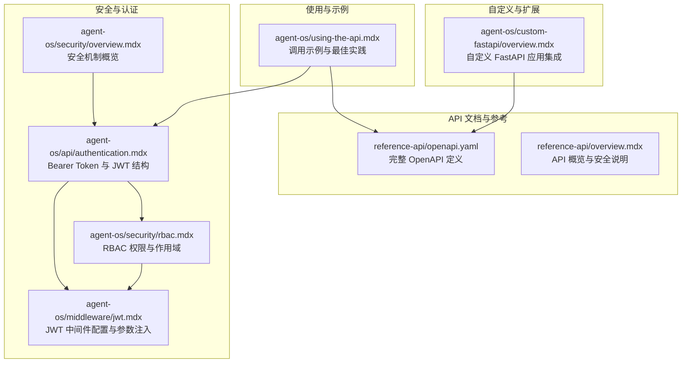
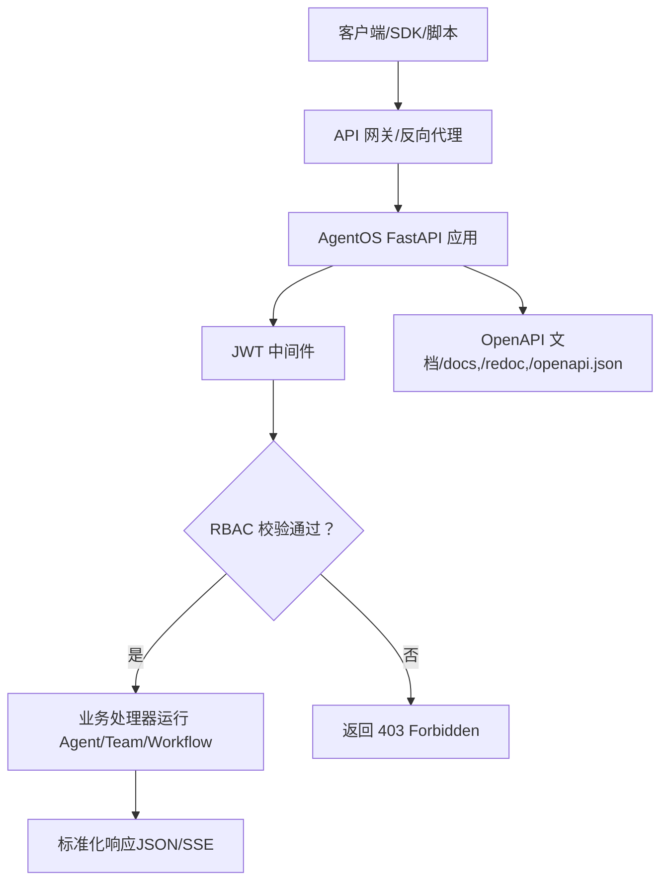
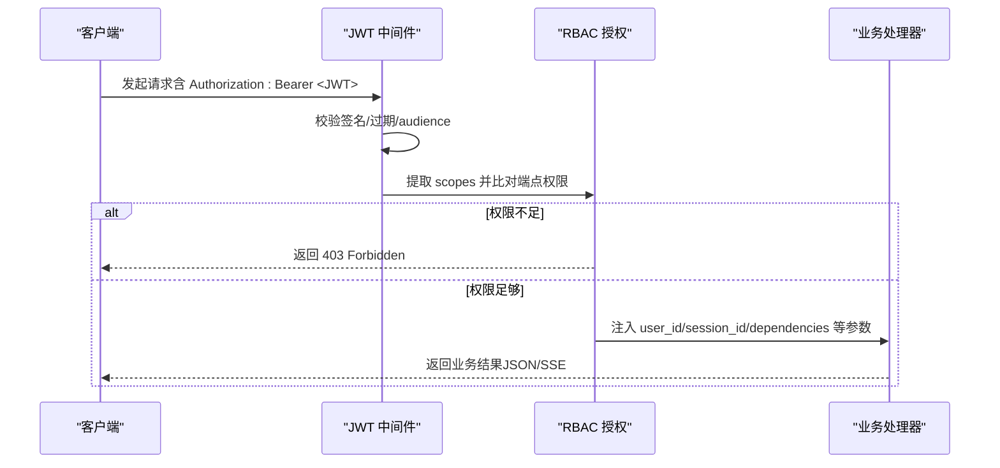
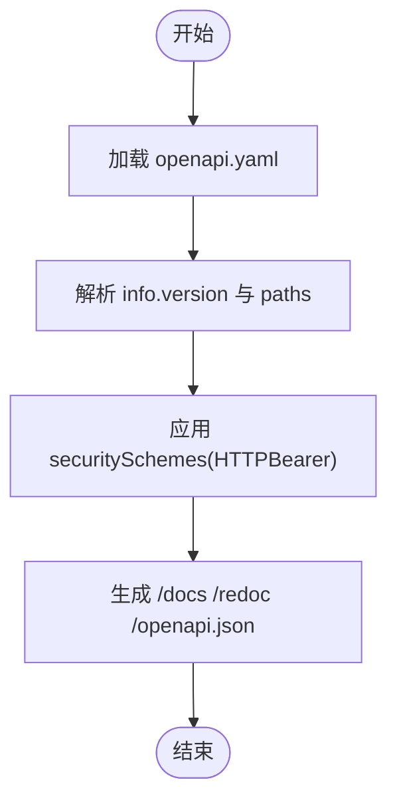
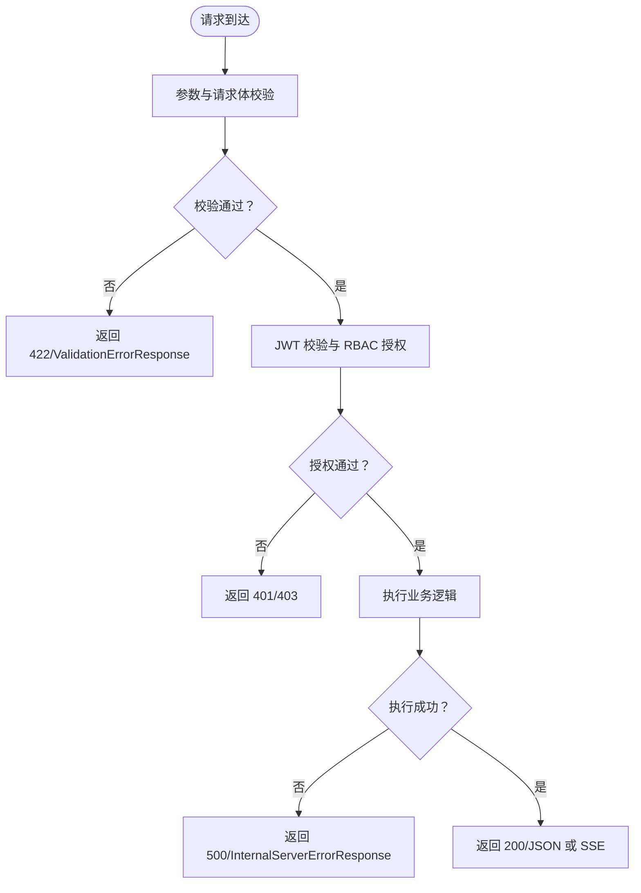
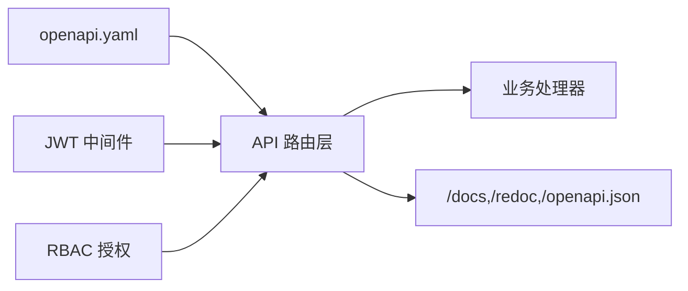

# API 基础

<cite>
**本文引用的文件**
- [reference-api/openapi.yaml](file://reference-api/openapi.yaml)
- [agent-os/using-the-api.mdx](file://agent-os/using-the-api.mdx)
- [agent-os/api/authentication.mdx](file://agent-os/api/authentication.mdx)
- [agent-os/middleware/jwt.mdx](file://agent-os/middleware/jwt.mdx)
- [agent-os/custom-fastapi/overview.mdx](file://agent-os/custom-fastapi/overview.mdx)
- [reference-api/overview.mdx](file://reference-api/overview.mdx)
- [agent-os/security/overview.mdx](file://agent-os/security/overview.mdx)
- [agent-os/security/rbac.mdx](file://agent-os/security/rbac.mdx)
</cite>

## 目录
1. [简介](#简介)
2. [项目结构](#项目结构)
3. [核心组件](#核心组件)
4. [架构总览](#架构总览)
5. [详细组件分析](#详细组件分析)
6. [依赖关系分析](#依赖关系分析)
7. [性能考虑](#性能考虑)
8. [故障排查指南](#故障排查指南)
9. [结论](#结论)
10. [附录](#附录)

## 简介
本章节面向希望快速理解并集成 AgentOS RESTful API 的开发者与产品团队。内容涵盖：
- API 的整体架构与设计理念（基于 FastAPI 的 RESTful 接口）
- 认证与授权机制（Bearer Token、JWT、RBAC）
- 版本管理与 OpenAPI 规范
- 错误处理与响应格式
- 常用示例与最佳实践
- 常见 HTTP 状态码与错误处理策略

## 项目结构
AgentOS 的 API 文档与参考信息主要分布在以下位置：
- 参考与规范：reference-api/openapi.yaml（完整 OpenAPI 3.1 定义）、reference-api/overview.mdx（概览）
- 使用指南：agent-os/using-the-api.mdx（调用示例、参数说明）
- 安全与认证：agent-os/api/authentication.mdx、agent-os/security/overview.mdx、agent-os/security/rbac.mdx、agent-os/middleware/jwt.mdx
- 自定义与扩展：agent-os/custom-fastapi/overview.mdx

**图表来源**
- [reference-api/openapi.yaml](file://reference-api/openapi.yaml)
- [reference-api/overview.mdx](file://reference-api/overview.mdx)
- [agent-os/using-the-api.mdx](file://agent-os/using-the-api.mdx)
- [agent-os/api/authentication.mdx](file://agent-os/api/authentication.mdx)
- [agent-os/security/overview.mdx](file://agent-os/security/overview.mdx)
- [agent-os/security/rbac.mdx](file://agent-os/security/rbac.mdx)
- [agent-os/middleware/jwt.mdx](file://agent-os/middleware/jwt.mdx)
- [agent-os/custom-fastapi/overview.mdx](file://agent-os/custom-fastapi/overview.mdx)

**章节来源**
- [reference-api/openapi.yaml](file://reference-api/openapi.yaml)
- [reference-api/overview.mdx](file://reference-api/overview.mdx)
- [agent-os/using-the-api.mdx](file://agent-os/using-the-api.mdx)
- [agent-os/api/authentication.mdx](file://agent-os/api/authentication.mdx)
- [agent-os/security/overview.mdx](file://agent-os/security/overview.mdx)
- [agent-os/security/rbac.mdx](file://agent-os/security/rbac.mdx)
- [agent-os/middleware/jwt.mdx](file://agent-os/middleware/jwt.mdx)
- [agent-os/custom-fastapi/overview.mdx](file://agent-os/custom-fastapi/overview.mdx)

## 核心组件
- RESTful API 层：基于 FastAPI 提供的路由、中间件与依赖注入能力，统一暴露资源操作接口。
- 认证与授权层：支持 Basic Bearer Key（开发场景）与 RBAC（生产推荐），通过 JWT 中间件实现令牌校验、受众验证与权限检查。
- OpenAPI 规范层：以 openapi.yaml 描述所有端点、请求/响应模式、安全方案与错误模型，便于生成 SDK 与文档。
- 自定义扩展层：允许在现有 AgentOS 路由基础上添加自定义 FastAPI 应用，并可选择保留自定义或 AgentOS 路由。

**章节来源**
- [reference-api/openapi.yaml](file://reference-api/openapi.yaml)
- [agent-os/security/overview.mdx](file://agent-os/security/overview.mdx)
- [agent-os/middleware/jwt.mdx](file://agent-os/middleware/jwt.mdx)
- [agent-os/custom-fastapi/overview.mdx](file://agent-os/custom-fastapi/overview.mdx)

## 架构总览
AgentOS 的 API 架构围绕“资源 + 行为”的 REST 设计展开，所有受保护端点默认要求 Bearer Token（HTTPBearer）。当启用 RBAC 时，中间件会进一步校验 JWT 的 audiences 与 scopes，并将用户标识、会话标识等声明自动注入到端点参数中，简化业务逻辑。

**图表来源**
- [agent-os/middleware/jwt.mdx](file://agent-os/middleware/jwt.mdx)
- [agent-os/security/rbac.mdx](file://agent-os/security/rbac.mdx)
- [reference-api/openapi.yaml](file://reference-api/openapi.yaml)

## 详细组件分析

### 认证与授权（Bearer Token 与 RBAC）
- Bearer Token（开发/简单场景）
  - 当服务器未设置专用安全密钥时，API 不强制认证；若启用，则需在请求头携带 Authorization: Bearer <token>。
  - 该模式适合本地开发或内部测试，不建议用于生产。
- RBAC（生产推荐）
  - 使用 JWT 令牌，包含 scopes 与 aud（受众）等声明。
  - 中间件负责：
    - 验证签名与过期时间
    - 校验 aud 是否匹配 AgentOS 实例 ID
    - 将 scopes 与端点所需权限进行比对
    - 将 user_id、session_id、dependencies 等声明注入到端点参数
  - 支持从环境变量或 JWKS 文件加载公钥，适配不同算法（如 RS256、HS256）。

**图表来源**
- [agent-os/middleware/jwt.mdx](file://agent-os/middleware/jwt.mdx)
- [agent-os/security/rbac.mdx](file://agent-os/security/rbac.mdx)
- [agent-os/api/authentication.mdx](file://agent-os/api/authentication.mdx)

**章节来源**
- [agent-os/api/authentication.mdx](file://agent-os/api/authentication.mdx)
- [agent-os/security/overview.mdx](file://agent-os/security/overview.mdx)
- [agent-os/security/rbac.mdx](file://agent-os/security/rbac.mdx)
- [agent-os/middleware/jwt.mdx](file://agent-os/middleware/jwt.mdx)

### OpenAPI 规范与版本管理
- 规范结构
  - openapi.yaml 定义了 API 的路径、参数、请求体、响应体、错误模型与安全方案（HTTPBearer）。
  - 所有受保护端点均声明 security: - HTTPBearer: []。
- 版本管理
  - info.version 字段给出当前 API 版本号；各资源端点描述中包含语义化版本与变更说明。
  - 组件与配置类资源支持按版本查询（例如获取特定版本的组件配置）。
- 文档访问
  - /docs、/redoc、/openapi.json 自动生成与公开。

**图表来源**
- [reference-api/openapi.yaml](file://reference-api/openapi.yaml)

**章节来源**
- [reference-api/openapi.yaml](file://reference-api/openapi.yaml)
- [reference-api/overview.mdx](file://reference-api/overview.mdx)

### 错误处理与响应格式
- 统一错误模型
  - 多数端点在 4xx/5xx 场景下返回标准化错误响应（如 BadRequestResponse、UnauthenticatedResponse、NotFoundResponse、ValidationErrorResponse、InternalServerErrorResponse）。
- 常见状态码
  - 400 Bad Request：请求参数无效或类型错误
  - 401 Unauthorized：缺少或无效令牌、audience 不匹配
  - 403 Forbidden：权限不足（RBAC scopes 不满足）
  - 404 Not Found：资源不存在
  - 422 Unprocessable Entity：数据校验失败
  - 500 Internal Server Error：服务端异常
- 响应格式
  - 默认 application/json；部分端点支持 text/event-stream（SSE）用于流式输出。

**图表来源**
- [reference-api/openapi.yaml](file://reference-api/openapi.yaml)

**章节来源**
- [reference-api/openapi.yaml](file://reference-api/openapi.yaml)
- [agent-os/security/rbac.mdx](file://agent-os/security/rbac.mdx)

### API 使用示例与最佳实践
- 基本调用
  - 运行 Agent/Team/Workflow 的通用模式：POST /agents/{agent_id}/runs、POST /teams/{team_id}/runs、POST /workflows/{workflow_id}/runs。
  - 示例使用 curl 展示如何传递消息、是否流式、用户与会话上下文等。
- 参数与依赖
  - 通过表单字段传递 dependencies、session_state、metadata、output_schema 等运行时参数。
- 取消与继续
  - 支持取消运行与继续暂停的运行（需要满足状态约束与权限）。
- 最佳实践
  - 生产环境务必启用 RBAC 与 JWT 中间件，避免使用已弃用的安全密钥方式。
  - 利用 SSE 流式输出提升用户体验；对大文件上传采用 multipart/form-data。
  - 对外暴露的 API 文档通过 /docs 与 /redoc 提供，便于联调与自助调试。

**章节来源**
- [agent-os/using-the-api.mdx](file://agent-os/using-the-api.mdx)
- [reference-api/openapi.yaml](file://reference-api/openapi.yaml)

### 自定义 FastAPI 应用与路由冲突处理
- 可将自定义 FastAPI 应用作为 base_app 传入 AgentOS，合并路由后统一对外提供服务。
- 当自定义路由与 AgentOS 路由发生冲突时，可通过 on_route_conflict 控制保留顺序（保留自定义或保留 AgentOS 路由）。
- 支持在自定义应用中添加 CORS、HTTPBearer 等中间件，确保与 AgentOS 的控制平面兼容。

**章节来源**
- [agent-os/custom-fastapi/overview.mdx](file://agent-os/custom-fastapi/overview.mdx)

## 依赖关系分析
- 组件耦合
  - API 层依赖中间件层完成认证与授权；业务处理器依赖配置与数据库层。
  - OpenAPI 规范作为契约，约束请求/响应与错误模型，降低前后端耦合。
- 外部依赖
  - JWT 验证依赖公钥或 JWKS 文件；RBAC 依赖端点与作用域映射。
  - 文档生成依赖 FastAPI 内置的 /docs、/redoc、/openapi.json。

**图表来源**
- [reference-api/openapi.yaml](file://reference-api/openapi.yaml)
- [agent-os/middleware/jwt.mdx](file://agent-os/middleware/jwt.mdx)
- [agent-os/security/rbac.mdx](file://agent-os/security/rbac.mdx)

**章节来源**
- [reference-api/openapi.yaml](file://reference-api/openapi.yaml)
- [agent-os/middleware/jwt.mdx](file://agent-os/middleware/jwt.mdx)
- [agent-os/security/rbac.mdx](file://agent-os/security/rbac.mdx)

## 性能考虑
- 流式输出：对长耗时任务建议使用 SSE，减少连接占用并提升交互体验。
- 并发与超时：合理设置 ASGI 服务器工作进程与连接池大小，避免阻塞 IO。
- 缓存与鉴权：对只读端点（如 /config、/models）可结合缓存策略降低重复计算。
- 日志与追踪：开启必要的日志与追踪，便于定位性能瓶颈与错误根因。

## 故障排查指南
- 401 Unauthorized
  - 检查 Authorization 头是否正确、令牌是否过期、audience 是否匹配实例 ID。
- 403 Forbidden
  - 检查 JWT 的 scopes 是否覆盖端点所需权限；确认是否启用了 authorization。
- 404 Not Found
  - 确认资源 ID 与端点路径是否正确；检查是否被路由冲突覆盖。
- 422 Unprocessable Entity
  - 检查请求体字段类型与必填项；关注 OpenAPI 中的 schema 定义。
- 500 Internal Server Error
  - 查看服务端日志与追踪信息；确认数据库、外部模型服务可用性。

**章节来源**
- [agent-os/security/rbac.mdx](file://agent-os/security/rbac.mdx)
- [reference-api/openapi.yaml](file://reference-api/openapi.yaml)

## 结论
AgentOS 的 API 以 OpenAPI 为核心契约，结合 FastAPI 的中间件体系实现了高内聚、低耦合的认证与授权能力。生产环境建议采用 RBAC 与 JWT 中间件，配合清晰的错误模型与文档，能够高效支撑多 Agent、多 Team、多 Workflow 的复杂场景。

## 附录
- 快速入口
  - API 概览与安全：[reference-api/overview.mdx](file://reference-api/overview.mdx)
  - 使用示例与最佳实践：[agent-os/using-the-api.mdx](file://agent-os/using-the-api.mdx)
  - 认证与 RBAC：[agent-os/api/authentication.mdx](file://agent-os/api/authentication.mdx)、[agent-os/security/rbac.mdx](file://agent-os/security/rbac.mdx)
  - JWT 中间件：[agent-os/middleware/jwt.mdx](file://agent-os/middleware/jwt.mdx)
  - 自定义 FastAPI 应用：[agent-os/custom-fastapi/overview.mdx](file://agent-os/custom-fastapi/overview.mdx)