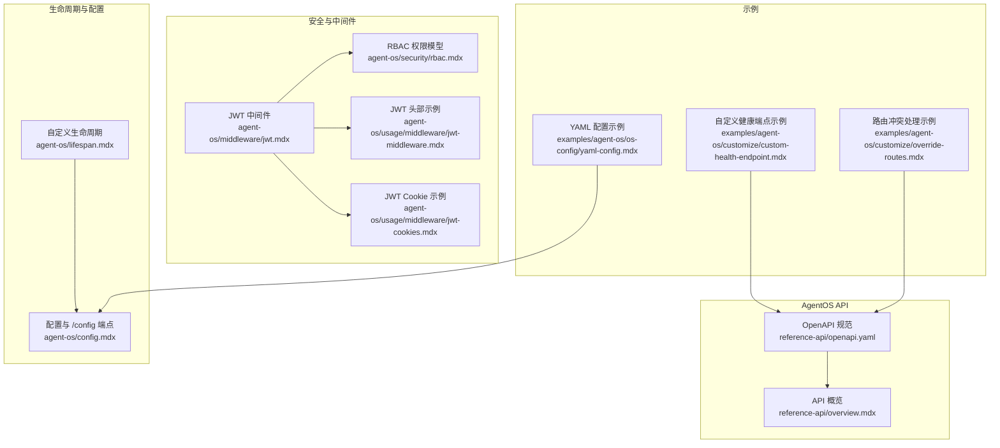
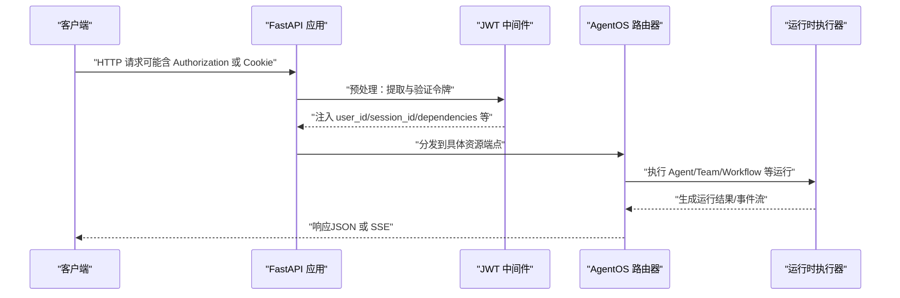
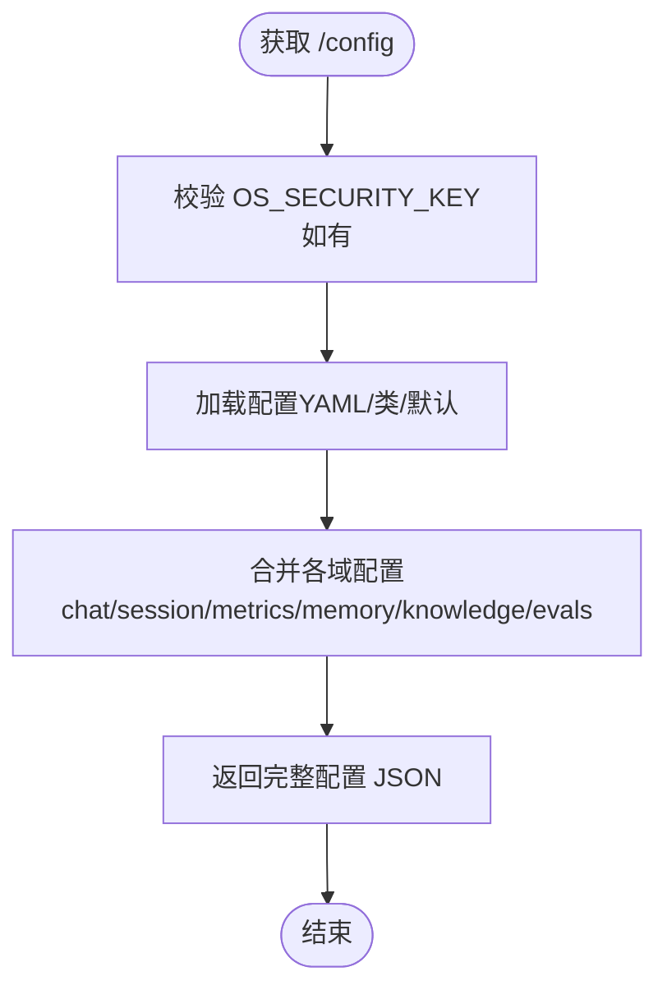
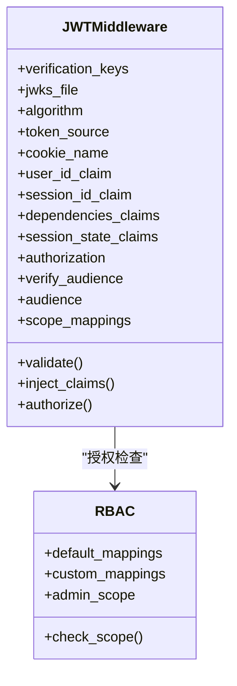
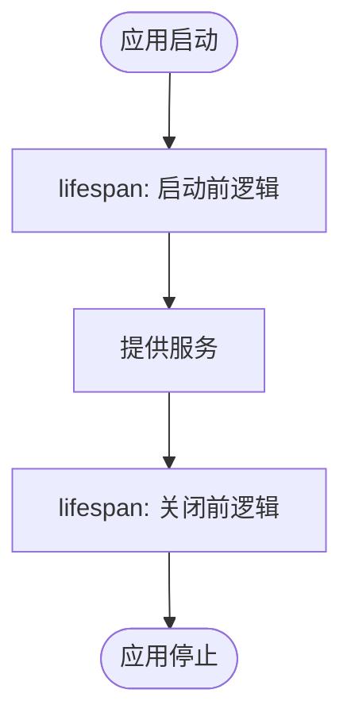
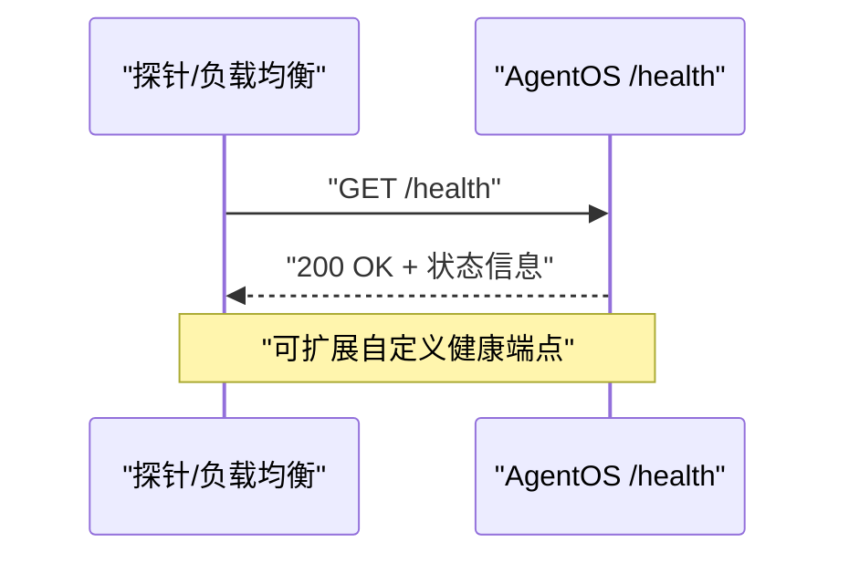
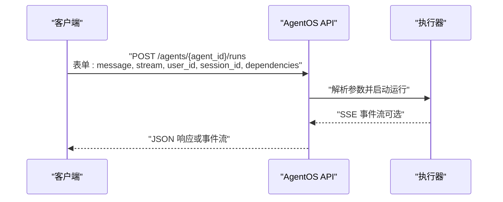
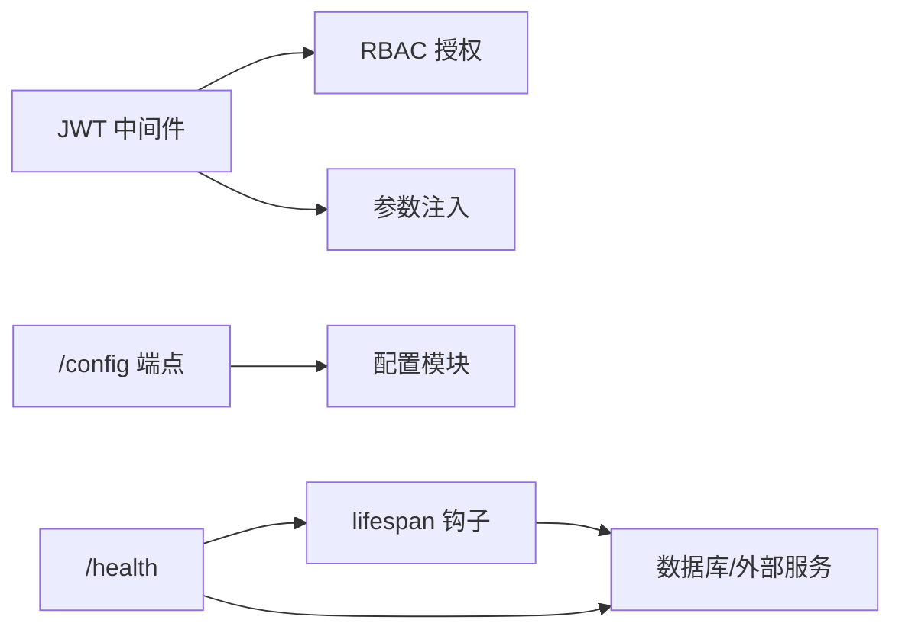

# AgentOS API

<cite>
**本文引用的文件**
- [openapi.yaml](file://reference-api/openapi.yaml)
- [overview.mdx](file://reference-api/overview.mdx)
- [jwt.mdx](file://agent-os/middleware/jwt.mdx)
- [rbac.mdx](file://agent-os/security/rbac.mdx)
- [lifespan.mdx](file://agent-os/lifespan.mdx)
- [config.mdx](file://agent-os/config.mdx)
- [using-the-api.mdx](file://agent-os/using-the-api.mdx)
- [jwt-middleware.mdx](file://agent-os/usage/middleware/jwt-middleware.mdx)
- [jwt-cookies.mdx](file://agent-os/usage/middleware/jwt-cookies.mdx)
- [custom-health-endpoint.mdx](file://examples/agent-os/customize/custom-health-endpoint.mdx)
- [yaml-config.mdx](file://examples/agent-os/os-config/yaml-config.mdx)
- [override-routes.mdx](file://examples/agent-os/customize/override-routes.mdx)
</cite>

## 目录
1. [简介](#简介)
2. [项目结构](#项目结构)
3. [核心组件](#核心组件)
4. [架构总览](#架构总览)
5. [详细组件分析](#详细组件分析)
6. [依赖关系分析](#依赖关系分析)
7. [性能考量](#性能考量)
8. [故障排查指南](#故障排查指南)
9. [结论](#结论)
10. [附录](#附录)

## 简介
本文件面向需要在生产环境中集成与运维 AgentOS 的工程师与平台开发者，系统性梳理 AgentOS 运行时的管理接口与能力边界，覆盖以下主题：
- 实例配置与生命周期管理：通过配置 API 获取完整运行时配置；通过自定义 lifespan 钩子实现启动/关闭逻辑。
- 安全与鉴权：基于 JWT 的认证与授权（RBAC），支持多种令牌来源与参数注入。
- 健康检查与监控：内置 /health 与可扩展的自定义健康端点。
- API 使用范式：请求/响应示例、常见使用场景与最佳实践。

## 项目结构
AgentOS 的 API 参考与用法文档主要分布在以下位置：
- 参考 API：OpenAPI 描述文件与各资源的模式说明
- 安全与中间件：JWT 中间件与 RBAC 文档
- 生命周期与配置：lifespan 与配置文档
- 使用示例：JWT 头部/Cookie 模式、自定义健康端点、路由冲突处理、YAML 配置等

**图表来源**
- [openapi.yaml](file://reference-api/openapi.yaml)
- [overview.mdx](file://reference-api/overview.mdx)
- [jwt.mdx](file://agent-os/middleware/jwt.mdx)
- [rbac.mdx](file://agent-os/security/rbac.mdx)
- [lifespan.mdx](file://agent-os/lifespan.mdx)
- [config.mdx](file://agent-os/config.mdx)
- [jwt-middleware.mdx](file://agent-os/usage/middleware/jwt-middleware.mdx)
- [jwt-cookies.mdx](file://agent-os/usage/middleware/jwt-cookies.mdx)
- [custom-health-endpoint.mdx](file://examples/agent-os/customize/custom-health-endpoint.mdx)
- [yaml-config.mdx](file://examples/agent-os/os-config/yaml-config.mdx)
- [override-routes.mdx](file://examples/agent-os/customize/override-routes.mdx)

**章节来源**
- [openapi.yaml:1-14043](file://reference-api/openapi.yaml#L1-L14043)
- [overview.mdx:1-74](file://reference-api/overview.mdx#L1-L74)

## 核心组件
- API 参考与认证
  - OpenAPI 描述了核心资源与端点，如 /health、/config、/models、/agents、/teams、/workflows、/sessions、/memories、/knowledge、/evals、/metrics 等。
  - 认证策略：当设置 OS_SECURITY_KEY 时，所有路由需携带 Bearer 令牌；未设置则禁用认证。
- 安全与中间件
  - JWT 中间件支持从 Authorization 头或 Cookie 提取令牌，进行签名验证、audience 校验，并自动注入 user_id、session_id、dependencies、session_state 等参数到端点。
  - RBAC 将端点映射到权限作用域，支持自定义映射与管理员通配符。
- 生命周期与配置
  - 自定义 lifespan 钩子用于启动/关闭逻辑与资源初始化/清理。
  - /config 端点返回当前实例的完整配置，便于控制平面与外部系统集成。
- 健康检查与监控
  - 内置 /health 健康检查；可通过自定义路由添加额外健康端点。
  - 结合外部监控系统，可对 /health 与业务端点进行探活与指标采集。

**章节来源**
- [openapi.yaml:32-138](file://reference-api/openapi.yaml#L32-L138)
- [overview.mdx:9-22](file://reference-api/overview.mdx#L9-L22)
- [jwt.mdx:145-176](file://agent-os/middleware/jwt.mdx#L145-L176)
- [rbac.mdx:149-255](file://agent-os/security/rbac.mdx#L149-L255)
- [lifespan.mdx:37-45](file://agent-os/lifespan.mdx#L37-L45)
- [config.mdx:146-213](file://agent-os/config.mdx#L146-L213)

## 架构总览
下图展示 AgentOS API 的关键交互路径：客户端通过认证中间件访问受保护端点，中间件注入上下文参数，最终由 AgentOS 路由器与运行时执行器完成请求处理。

**图表来源**
- [jwt.mdx:20-35](file://agent-os/middleware/jwt.mdx#L20-L35)
- [openapi.yaml:193-484](file://reference-api/openapi.yaml#L193-L484)

## 详细组件分析

### 配置 API 与动态配置更新
- /config 端点
  - 功能：返回当前 AgentOS 实例的完整配置，包括可用模型、数据库、注册的 agents/teams/workflows/interfaces，以及各域（chat、session、metrics、memory、knowledge、evals）的配置。
  - 访问控制：默认受保护（需 Bearer 令牌），具体取决于 OS_SECURITY_KEY 设置。
  - 返回内容：包含 OS ID、描述、数据库列表、资源清单与各域配置。
- 配置来源
  - YAML 文件：通过 config 参数传入配置文件路径。
  - AgentOSConfig 类：以编程方式构建配置对象。
- 动态配置更新
  - AgentOS 支持在运行时通过配置文件或类配置进行实例级调整；建议结合生命周期钩子在重启或热重载时应用变更。

**图表来源**
- [config.mdx:146-213](file://agent-os/config.mdx#L146-L213)
- [openapi.yaml:49-138](file://reference-api/openapi.yaml#L49-L138)

**章节来源**
- [config.mdx:18-213](file://agent-os/config.mdx#L18-L213)
- [yaml-config.mdx:1-108](file://examples/agent-os/os-config/yaml-config.mdx#L1-L108)

### JWT 中间件与安全配置
- 令牌来源
  - Authorization 头（Bearer）、Cookie、或两者（优先头）。
- 验证与参数注入
  - 支持 JWKS 文件与对称/非对称密钥；可启用 audience 校验。
  - 自动注入 user_id、session_id、dependencies、session_state 到端点参数。
- RBAC 授权
  - 将端点映射到作用域；支持自定义映射与管理员通配符。
- Cookie 安全特性
  - httponly、secure、samesite 等安全标志，配合登录/登出端点管理令牌。

**图表来源**
- [jwt.mdx:20-35](file://agent-os/middleware/jwt.mdx#L20-L35)
- [rbac.mdx:149-255](file://agent-os/security/rbac.mdx#L149-L255)

**章节来源**
- [jwt.mdx:38-176](file://agent-os/middleware/jwt.mdx#L38-L176)
- [rbac.mdx:21-410](file://agent-os/security/rbac.mdx#L21-L410)
- [jwt-middleware.mdx:11-93](file://agent-os/usage/middleware/jwt-middleware.mdx#L11-L93)
- [jwt-cookies.mdx:11-147](file://agent-os/usage/middleware/jwt-cookies.mdx#L11-L147)

### 生命周期管理与资源初始化
- 自定义 lifespan
  - 在应用启动前/关闭后执行初始化/清理逻辑，如连接数据库、第三方服务、缓存，或后台任务的启停。
  - 若已有自定义 FastAPI 应用，lifespan 将与其生命周期上下文组合，避免覆盖。
- 典型用例
  - 资源初始化、健康检查、后台任务、清理与释放。

**图表来源**
- [lifespan.mdx:13-23](file://agent-os/lifespan.mdx#L13-L23)

**章节来源**
- [lifespan.mdx:1-142](file://agent-os/lifespan.mdx#L1-L142)

### 健康检查与系统监控
- 内置 /health
  - 返回简单状态指示，便于探活与负载均衡。
- 自定义健康端点
  - 通过自定义路由添加额外健康检查（如依赖服务连通性），并与 /health 并存。
- 监控建议
  - 对 /health 与关键业务端点进行周期性探测；
  - 结合外部可观测性平台采集指标与日志。

**图表来源**
- [openapi.yaml:32-48](file://reference-api/openapi.yaml#L32-L48)
- [custom-health-endpoint.mdx:46-70](file://examples/agent-os/customize/custom-health-endpoint.mdx#L46-L70)

**章节来源**
- [openapi.yaml:32-48](file://reference-api/openapi.yaml#L32-L48)
- [custom-health-endpoint.mdx:1-85](file://examples/agent-os/customize/custom-health-endpoint.mdx#L1-L85)

### API 使用范式与请求响应示例
- 基本调用
  - 运行 Agent/Team/Workflow 的端点遵循统一模式，支持表单上传与多模态输入，支持 SSE 流式输出。
- 认证
  - 当启用 OS_SECURITY_KEY 时，需在请求头中携带 Bearer 令牌。
- 依赖传递
  - 通过表单字段传递 dependencies、session_state、metadata 等运行时参数。
- 输出结构化
  - 通过 output_schema 对响应进行结构化约束。
- 取消运行
  - 对正在执行的运行发起取消请求。

**图表来源**
- [openapi.yaml:193-484](file://reference-api/openapi.yaml#L193-L484)
- [using-the-api.mdx:24-74](file://agent-os/using-the-api.mdx#L24-L74)

**章节来源**
- [using-the-api.mdx:1-74](file://agent-os/using-the-api.mdx#L1-L74)
- [openapi.yaml:193-484](file://reference-api/openapi.yaml#L193-L484)

### 路由冲突与自定义 FastAPI 集成
- 冲突处理策略
  - on_route_conflict="preserve_base_app"：保留自定义应用路由，跳过与 AgentOS 冲突的路由。
  - 默认 preserve_agentos：AgentOS 路由覆盖自定义路由。
- 适用场景
  - 在已有 FastAPI 应用中集成 AgentOS，同时保留原有路由与文档。

**章节来源**
- [override-routes.mdx:81-112](file://examples/agent-os/customize/override-routes.mdx#L81-L112)

## 依赖关系分析
- 组件耦合
  - JWT 中间件与 RBAC 紧密耦合，前者负责令牌解析与注入，后者负责权限判定。
  - /config 端点依赖配置模块，返回全局与域级配置。
  - 自定义 lifespan 与应用生命周期耦合，影响资源可用性与健康状态。
- 外部依赖
  - JWT 验证依赖密钥或 JWKS 文件；RBAC 依赖令牌中的 scopes。
  - 健康检查依赖内部状态与外部依赖（如数据库、第三方服务）。

**图表来源**
- [jwt.mdx:176-227](file://agent-os/middleware/jwt.mdx#L176-L227)
- [rbac.mdx:149-255](file://agent-os/security/rbac.mdx#L149-L255)
- [config.mdx:146-213](file://agent-os/config.mdx#L146-L213)
- [lifespan.mdx:39-45](file://agent-os/lifespan.mdx#L39-L45)
- [openapi.yaml:32-48](file://reference-api/openapi.yaml#L32-L48)

**章节来源**
- [jwt.mdx:176-227](file://agent-os/middleware/jwt.mdx#L176-L227)
- [rbac.mdx:149-255](file://agent-os/security/rbac.mdx#L149-L255)
- [config.mdx:146-213](file://agent-os/config.mdx#L146-L213)
- [lifespan.mdx:39-45](file://agent-os/lifespan.mdx#L39-L45)
- [openapi.yaml:32-48](file://reference-api/openapi.yaml#L32-L48)

## 性能考量
- 流式响应
  - SSE 流式输出适用于长耗时运行，建议客户端按事件类型处理，避免阻塞。
- 令牌验证开销
  - 对称算法（HS256）验证更快；非对称算法（RS256）需加载 JWKS，首次启动有额外开销。
- 路由与中间件
  - 合理设置 excluded_route_paths，减少不必要的中间件处理。
- 健康检查
  - 健康端点应尽量轻量，避免触发重计算或外部依赖。

## 故障排查指南
- 401 未授权
  - 检查是否正确设置 OS_SECURITY_KEY 或 JWT 验证密钥；确认令牌格式与有效期。
- 403 权限不足
  - 核对令牌中的 scopes 是否满足端点所需；必要时调整自定义 scope 映射。
- 令牌 audience 不匹配
  - 当开启 verify_audience 时，确保令牌 aud 与 AgentOS ID 匹配。
- 生命周期异常
  - 检查 lifespan 中的资源初始化/清理逻辑，避免在 reload 场景重复初始化。
- 健康检查失败
  - 确认依赖服务可用；必要时增加自定义健康端点以细化诊断。

**章节来源**
- [rbac.mdx:367-373](file://agent-os/security/rbac.mdx#L367-L373)
- [jwt.mdx:158-167](file://agent-os/middleware/jwt.mdx#L158-L167)
- [lifespan.mdx:39-45](file://agent-os/lifespan.mdx#L39-L45)

## 结论
AgentOS 提供了以 OpenAPI 为核心的统一运行时接口，结合 JWT 中间件与 RBAC 实现细粒度的安全控制；通过 /config 与 lifespan 钩子实现灵活的实例配置与生命周期管理；内置 /health 与可扩展的健康端点满足生产监控需求。建议在生产中启用令牌验证与 audience 校验，合理配置 scope 映射，并通过自定义健康端点与外部监控体系保障系统稳定性。

## 附录
- 常用端点速览
  - /health：健康检查
  - /config：获取 OS 配置
  - /models：获取可用模型列表
  - /agents、/teams、/workflows：资源管理与运行
  - /sessions、/memories、/knowledge、/evals、/metrics：领域数据与指标
- 环境变量参考
  - OS_SECURITY_KEY：启用 Bearer 令牌认证
  - JWT_VERIFICATION_KEY/JWT_JWKS_FILE：JWT 验证密钥或 JWKS 文件路径
  - 数据库连接字符串：根据所选存储提供