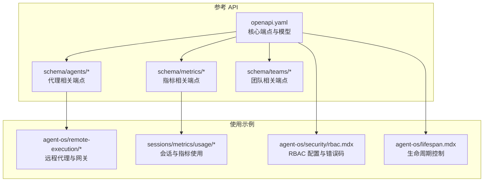
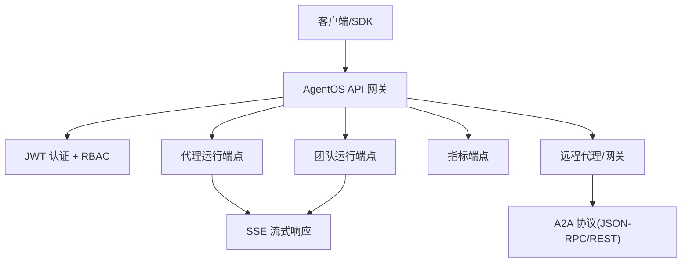
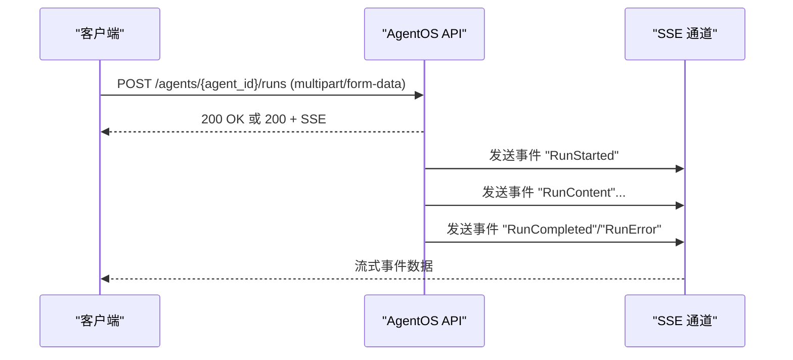
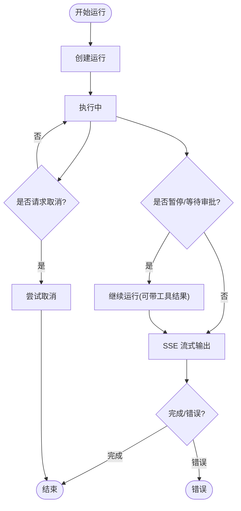
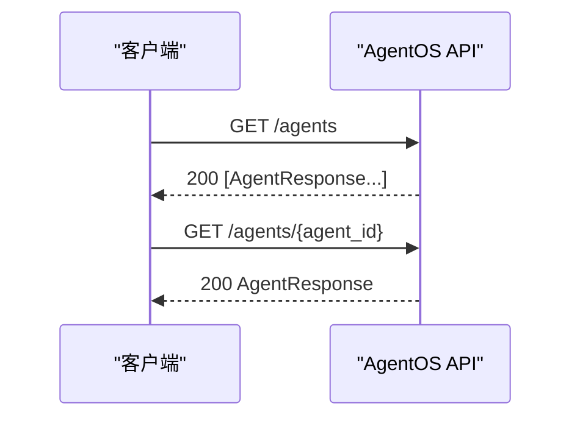
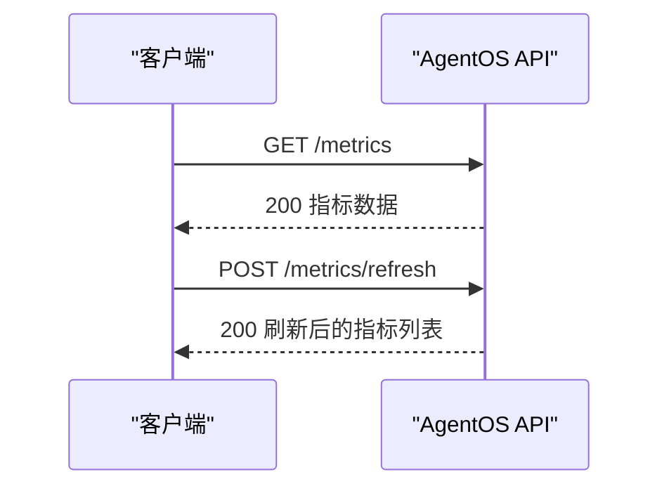
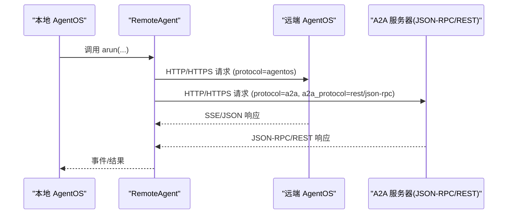
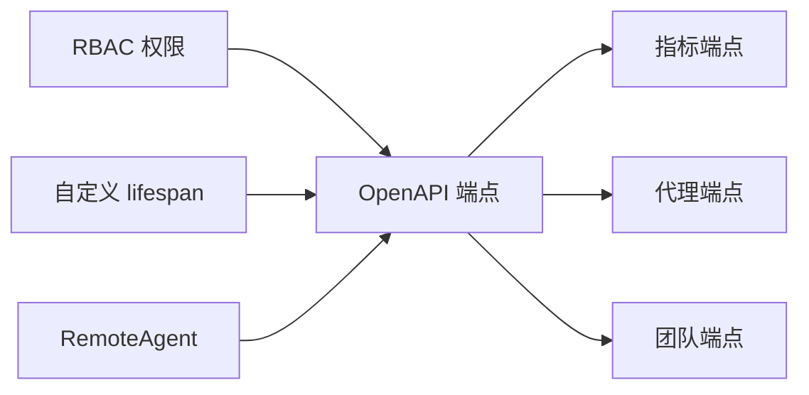

# 代理 API

<cite>
**本文引用的文件**
- [reference-api/openapi.yaml](file://reference-api/openapi.yaml)
- [reference-api/schema/agents/create-agent-run.mdx](file://reference-api/schema/agents/create-agent-run.mdx)
- [reference-api/schema/agents/get-agent-details.mdx](file://reference-api/schema/agents/get-agent-details.mdx)
- [reference-api/schema/agents/list-all-agents.mdx](file://reference-api/schema/agents/list-all-agents.mdx)
- [reference-api/schema/agents/get-agent-run.mdx](file://reference-api/schema/agents/get-agent-run.mdx)
- [reference-api/schema/agents/cancel-agent-run.mdx](file://reference-api/schema/agents/cancel-agent-run.mdx)
- [reference-api/schema/agents/continue-agent-run.mdx](file://reference-api/schema/agents/continue-agent-run.mdx)
- [reference-api/schema/agents/list-agent-runs.mdx](file://reference-api/schema/agents/list-agent-runs.mdx)
- [reference-api/schema/metrics/get-agentos-metrics.mdx](file://reference-api/schema/metrics/get-agentos-metrics.mdx)
- [reference-api/schema/metrics/refresh-metrics.mdx](file://reference-api/schema/metrics/refresh-metrics.mdx)
- [reference-api/schema/teams/create-team-run.mdx](file://reference-api/schema/teams/create-team-run.mdx)
- [agent-os/remote-execution/overview.mdx](file://agent-os/remote-execution/overview.mdx)
- [agent-os/remote-execution/remote-agent.mdx](file://agent-os/remote-execution/remote-agent.mdx)
- [reference/agents/remote-agent.mdx](file://reference/agents/remote-agent.mdx)
- [reference/clients/agentos-client.mdx](file://reference/clients/agentos-client.mdx)
- [sessions/metrics/usage/agent-metrics.mdx](file://sessions/metrics/usage/agent-metrics.mdx)
- [examples/models/meta/llama-openai/metrics.mdx](file://examples/models/meta/llama-openai/metrics.mdx)
- [agent-os/security/rbac.mdx](file://agent-os/security/rbac.mdx)
- [agent-os/lifespan.mdx](file://agent-os/lifespan.mdx)
- [agent-os/using-the-api.mdx](file://agent-os/using-the-api.mdx)
</cite>

## 目录
1. [简介](#简介)
2. [项目结构](#项目结构)
3. [核心组件](#核心组件)
4. [架构总览](#架构总览)
5. [详细组件分析](#详细组件分析)
6. [依赖关系分析](#依赖关系分析)
7. [性能考量](#性能考量)
8. [故障排查指南](#故障排查指南)
9. [结论](#结论)
10. [附录](#附录)

## 简介
本文件为代理 API 的完整接口文档，覆盖代理的创建、管理与运行接口，包括代理定义、参数配置与生命周期管理；详细说明代理运行 API（同步与异步）、状态查询与结果获取；解释代理指标 API 的使用方法（性能监控、使用统计与调试信息）；文档化远程代理 API 的集成方式与分布式运行支持；并提供代理工具集成、知识访问与记忆管理的 API 接口说明，以及完整的错误处理指南。

## 项目结构
本仓库以“参考文档 + 示例 + 概念说明”的方式组织代理 API 相关内容：
- 参考 API：通过 OpenAPI 描述核心端点与数据模型
- Schema 文档：每个端点的简要描述与路径声明
- 使用示例：远程执行、指标采集、RBAC 安全等
- 架构概念：生命周期、安全、网关与 A2A 协议

图表来源
- [reference-api/openapi.yaml](file://reference-api/openapi.yaml)
- [reference-api/schema/agents/create-agent-run.mdx](file://reference-api/schema/agents/create-agent-run.mdx)
- [reference-api/schema/metrics/get-agentos-metrics.mdx](file://reference-api/schema/metrics/get-agentos-metrics.mdx)
- [reference-api/schema/teams/create-team-run.mdx](file://reference-api/schema/teams/create-team-run.mdx)
- [agent-os/remote-execution/overview.mdx](file://agent-os/remote-execution/overview.mdx)
- [sessions/metrics/usage/agent-metrics.mdx](file://sessions/metrics/usage/agent-metrics.mdx)
- [agent-os/security/rbac.mdx](file://agent-os/security/rbac.mdx)
- [agent-os/lifespan.mdx](file://agent-os/lifespan.mdx)

章节来源
- [reference-api/openapi.yaml](file://reference-api/openapi.yaml)
- [agent-os/using-the-api.mdx](file://agent-os/using-the-api.mdx)

## 核心组件
- 代理运行 API：支持同步与异步（SSE）运行、取消、继续、查询与列表
- 代理管理 API：列出所有代理、获取代理详情
- 指标 API：获取系统级指标与手动刷新
- 远程代理与网关：在本地注册远程代理，实现跨实例协作
- 安全与认证：基于 Bearer Token 的 JWT 认证与 RBAC 权限控制
- 生命周期：应用启动/关闭时的资源初始化与清理

章节来源
- [reference-api/openapi.yaml](file://reference-api/openapi.yaml)
- [reference-api/schema/agents/create-agent-run.mdx](file://reference-api/schema/agents/create-agent-run.mdx)
- [reference-api/schema/agents/get-agent-details.mdx](file://reference-api/schema/agents/get-agent-details.mdx)
- [reference-api/schema/agents/list-all-agents.mdx](file://reference-api/schema/agents/list-all-agents.mdx)
- [reference-api/schema/agents/get-agent-run.mdx](file://reference-api/schema/agents/get-agent-run.mdx)
- [reference-api/schema/agents/cancel-agent-run.mdx](file://reference-api/schema/agents/cancel-agent-run.mdx)
- [reference-api/schema/agents/continue-agent-run.mdx](file://reference-api/schema/agents/continue-agent-run.mdx)
- [reference-api/schema/agents/list-agent-runs.mdx](file://reference-api/schema/agents/list-agent-runs.mdx)
- [reference-api/schema/metrics/get-agentos-metrics.mdx](file://reference-api/schema/metrics/get-agentos-metrics.mdx)
- [reference-api/schema/metrics/refresh-metrics.mdx](file://reference-api/schema/metrics/refresh-metrics.mdx)
- [reference/agents/remote-agent.mdx](file://reference/agents/remote-agent.mdx)
- [agent-os/security/rbac.mdx](file://agent-os/security/rbac.mdx)
- [agent-os/lifespan.mdx](file://agent-os/lifespan.mdx)

## 架构总览
下图展示代理 API 的端到端调用链，从客户端到 AgentOS 核心服务，再到可选的远程代理与 A2A 协议层：

图表来源
- [reference-api/openapi.yaml](file://reference-api/openapi.yaml)
- [agent-os/remote-execution/overview.mdx](file://agent-os/remote-execution/overview.mdx)
- [reference/agents/remote-agent.mdx](file://reference/agents/remote-agent.mdx)

## 详细组件分析

### 代理运行 API（同步与异步）
- 端点：POST /agents/{agent_id}/runs
- 功能：执行代理，支持多模态输入（图片、音频、视频、文档），支持 SSE 实时流式输出
- 请求体：multipart/form-data，包含消息文本与可选媒体文件
- 响应：非流式返回 JSON；流式返回 text/event-stream，事件类型包含 RunStarted 等
- 参数：agent_id 必填；支持 session_id、user_id 等上下文参数
- 安全：需要 Bearer Token

图表来源
- [reference-api/openapi.yaml](file://reference-api/openapi.yaml)
- [reference-api/schema/agents/create-agent-run.mdx](file://reference-api/schema/agents/create-agent-run.mdx)

章节来源
- [reference-api/openapi.yaml](file://reference-api/openapi.yaml)
- [reference-api/schema/agents/create-agent-run.mdx](file://reference-api/schema/agents/create-agent-run.mdx)

### 代理运行生命周期（取消、继续、查询）
- 取消运行：POST /agents/{agent_id}/runs/{run_id}/cancel
- 继续运行：POST /agents/{agent_id}/runs/{run_id}/continue（用于人工审批后继续）
- 查询运行：GET /agents/{agent_id}/runs/{run_id}?session_id=...
- 列出运行：GET /agents/{agent_id}/runs?session_id=...&status=...

图表来源
- [reference-api/openapi.yaml](file://reference-api/openapi.yaml)
- [reference-api/schema/agents/cancel-agent-run.mdx](file://reference-api/schema/agents/cancel-agent-run.mdx)
- [reference-api/schema/agents/continue-agent-run.mdx](file://reference-api/schema/agents/continue-agent-run.mdx)
- [reference-api/schema/agents/get-agent-run.mdx](file://reference-api/schema/agents/get-agent-run.mdx)
- [reference-api/schema/agents/list-agent-runs.mdx](file://reference-api/schema/agents/list-agent-runs.mdx)

章节来源
- [reference-api/openapi.yaml](file://reference-api/openapi.yaml)
- [reference-api/schema/agents/cancel-agent-run.mdx](file://reference-api/schema/agents/cancel-agent-run.mdx)
- [reference-api/schema/agents/continue-agent-run.mdx](file://reference-api/schema/agents/continue-agent-run.mdx)
- [reference-api/schema/agents/get-agent-run.mdx](file://reference-api/schema/agents/get-agent-run.mdx)
- [reference-api/schema/agents/list-agent-runs.mdx](file://reference-api/schema/agents/list-agent-runs.mdx)

### 代理管理 API（定义与配置）
- 列出所有代理：GET /agents
- 获取代理详情：GET /agents/{agent_id}

图表来源
- [reference-api/openapi.yaml](file://reference-api/openapi.yaml)
- [reference-api/schema/agents/list-all-agents.mdx](file://reference-api/schema/agents/list-all-agents.mdx)
- [reference-api/schema/agents/get-agent-details.mdx](file://reference-api/schema/agents/get-agent-details.mdx)

章节来源
- [reference-api/openapi.yaml](file://reference-api/openapi.yaml)
- [reference-api/schema/agents/list-all-agents.mdx](file://reference-api/schema/agents/list-all-agents.mdx)
- [reference-api/schema/agents/get-agent-details.mdx](file://reference-api/schema/agents/get-agent-details.mdx)

### 指标 API（性能监控、使用统计与调试）
- 获取系统指标：GET /metrics
- 手动刷新指标：POST /metrics/refresh

图表来源
- [reference-api/openapi.yaml](file://reference-api/openapi.yaml)
- [reference-api/schema/metrics/get-agentos-metrics.mdx](file://reference-api/schema/metrics/get-agentos-metrics.mdx)
- [reference-api/schema/metrics/refresh-metrics.mdx](file://reference-api/schema/metrics/refresh-metrics.mdx)

章节来源
- [reference-api/openapi.yaml](file://reference-api/openapi.yaml)
- [reference-api/schema/metrics/get-agentos-metrics.mdx](file://reference-api/schema/metrics/get-agentos-metrics.mdx)
- [reference-api/schema/metrics/refresh-metrics.mdx](file://reference-api/schema/metrics/refresh-metrics.mdx)
- [sessions/metrics/usage/agent-metrics.mdx](file://sessions/metrics/usage/agent-metrics.mdx)
- [examples/models/meta/llama-openai/metrics.mdx](file://examples/models/meta/llama-openai/metrics.mdx)

### 团队运行 API（扩展）
- 创建团队运行：POST /teams/{team_id}/runs
- 特性：与代理运行类似，支持多模态输入与 SSE 流式输出

章节来源
- [reference-api/openapi.yaml](file://reference-api/openapi.yaml)
- [reference-api/schema/teams/create-team-run.mdx](file://reference-api/schema/teams/create-team-run.mdx)

### 远程代理 API 与分布式运行
- RemoteAgent：在本地注册远程代理，实现跨实例调用
- 支持协议：
  - agentos：默认，连接到 Agno AgentOS REST API
  - a2a：连接到 A2A 服务器，支持 rest 与 json-rpc
- 网关模式：在本地 AgentOS 中注册多个 RemoteAgent，形成统一入口

图表来源
- [agent-os/remote-execution/overview.mdx](file://agent-os/remote-execution/overview.mdx)
- [agent-os/remote-execution/remote-agent.mdx](file://agent-os/remote-execution/remote-agent.mdx)
- [reference/agents/remote-agent.mdx](file://reference/agents/remote-agent.mdx)

章节来源
- [agent-os/remote-execution/overview.mdx](file://agent-os/remote-execution/overview.mdx)
- [agent-os/remote-execution/remote-agent.mdx](file://agent-os/remote-execution/remote-agent.mdx)
- [reference/agents/remote-agent.mdx](file://reference/agents/remote-agent.mdx)

### 工具集成、知识访问与记忆管理（概览）
- 工具集成：代理运行请求体支持多模态文件上传，便于工具处理
- 知识访问：通过知识模块的上传、检索、状态查询等端点进行知识管理
- 记忆管理：通过记忆模块的增删改查与统计接口进行记忆维护
- 注意：具体端点请参见对应 schema 目录下的文档与 OpenAPI 描述

章节来源
- [reference-api/openapi.yaml](file://reference-api/openapi.yaml)

## 依赖关系分析
- 安全依赖：所有受保护端点均需 Bearer Token；RBAC 控制细粒度权限
- 生命周期依赖：应用启动时可注入自定义 lifespan，用于数据库连接、缓存、健康检查与后台任务
- 远程依赖：RemoteAgent 依赖目标 AgentOS 或 A2A 服务器可达性与协议一致性

图表来源
- [agent-os/security/rbac.mdx](file://agent-os/security/rbac.mdx)
- [agent-os/lifespan.mdx](file://agent-os/lifespan.mdx)
- [reference-api/openapi.yaml](file://reference-api/openapi.yaml)

章节来源
- [agent-os/security/rbac.mdx](file://agent-os/security/rbac.mdx)
- [agent-os/lifespan.mdx](file://agent-os/lifespan.mdx)
- [reference-api/openapi.yaml](file://reference-api/openapi.yaml)

## 性能考量
- 流式传输：SSE 提供低延迟实时反馈，适合长耗时任务
- 并发运行：同一 AgentOS 可同时运行多个代理或团队任务，注意资源配额与并发限制
- 指标监控：定期刷新指标，结合会话维度统计评估吞吐与延迟
- 远程调用：跨实例调用存在网络抖动与超时风险，建议设置合理的重试与超时策略

## 故障排查指南
- 认证失败（401）：检查 Bearer Token 是否正确传递
- 权限不足（403）：确认 JWT scopes 是否包含所需操作权限
- 运行异常（4xx/5xx）：查看请求体格式、文件类型与必填字段
- 远程不可达：检查远端 AgentOS 或 A2A 服务器连通性与协议配置
- 取消/继续失败：确保 run 处于可取消/可继续的状态

章节来源
- [agent-os/security/rbac.mdx](file://agent-os/security/rbac.mdx)
- [reference/clients/agentos-client.mdx](file://reference/clients/agentos-client.mdx)
- [reference/agents/remote-agent.mdx](file://reference/agents/remote-agent.mdx)

## 结论
本文档系统梳理了代理 API 的核心能力：运行（同步/异步）、管理（列表/详情）、生命周期（取消/继续/查询/列表）、指标（获取/刷新）、远程执行（网关与 A2A 协议），并结合安全与生命周期最佳实践，帮助开发者构建稳定、可观测、可扩展的代理系统。

## 附录
- 快速参考
  - 代理运行：POST /agents/{agent_id}/runs
  - 取消运行：POST /agents/{agent_id}/runs/{run_id}/cancel
  - 继续运行：POST /agents/{agent_id}/runs/{run_id}/continue
  - 查询运行：GET /agents/{agent_id}/runs/{run_id}?session_id=...
  - 列出运行：GET /agents/{agent_id}/runs?session_id=...&status=...
  - 代理管理：GET /agents, GET /agents/{agent_id}
  - 指标：GET /metrics, POST /metrics/refresh
  - 团队运行：POST /teams/{team_id}/runs