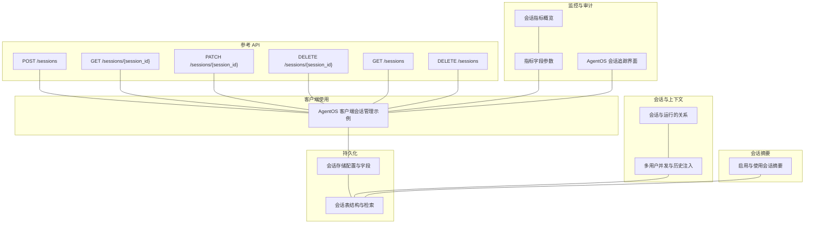
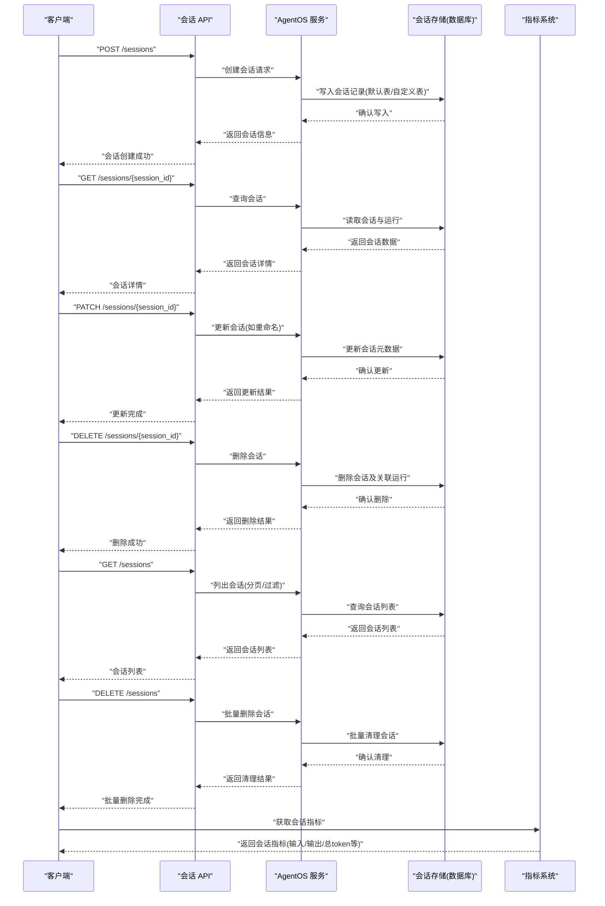
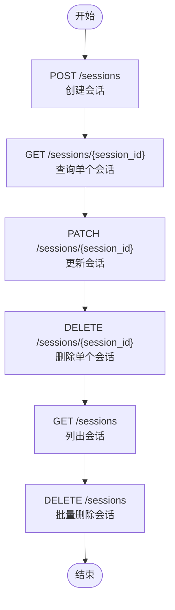
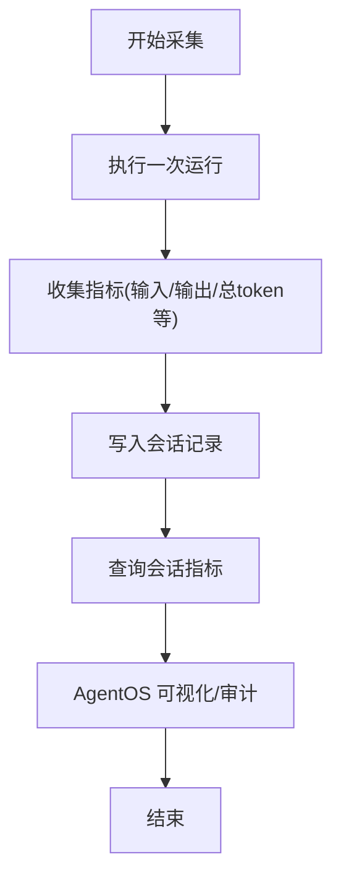
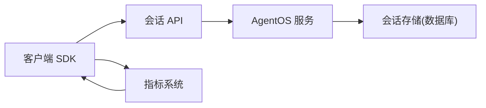

# 会话 API

<cite>
**本文引用的文件**
- [sessions/create-new-session.mdx](file://reference-api/schema/sessions/create-new-session.mdx)
- [sessions/get-session-by-id.mdx](file://reference-api/schema/sessions/get-session-by-id.mdx)
- [sessions/update-session.mdx](file://reference-api/schema/sessions/update-session.mdx)
- [sessions/delete-session.mdx](file://reference-api/schema/sessions/delete-session.mdx)
- [sessions/list-sessions.mdx](file://reference-api/schema/sessions/list-sessions.mdx)
- [sessions/delete-multiple-sessions.mdx](file://reference-api/schema/sessions/delete-multiple-sessions.mdx)
- [agent-os/usage/client/session-management.mdx](file://agent-os/usage/client/session-management.mdx)
- [database/session-storage.mdx](file://database/session-storage.mdx)
- [sessions/overview.mdx](file://sessions/overview.mdx)
- [sessions/session-summary.mdx](file://examples/agents/state-and-session/session-summary.mdx)
- [sessions/metrics/overview.mdx](file://sessions/metrics/overview.mdx)
- [TBD/snippets/session_metrics_params.mdx](file://TBD/snippets/session_metrics_params.mdx)
- [TBD/pages/agent-os/features/session-tracking.mdx](file://TBD/pages/agent-os/features/session-tracking.mdx)
</cite>

## 目录
1. [简介](#简介)
2. [项目结构](#项目结构)
3. [核心组件](#核心组件)
4. [架构总览](#架构总览)
5. [详细组件分析](#详细组件分析)
6. [依赖关系分析](#依赖关系分析)
7. [性能考虑](#性能考虑)
8. [故障排查指南](#故障排查指南)
9. [结论](#结论)
10. [附录](#附录)

## 简介
本文件系统性地记录会话 API 的技术规范与实现要点，覆盖会话的创建、查询、更新、删除与列表管理；会话状态与上下文信息的组织方式；会话摘要（会话压缩）的生成与查询；运行上下文在多用户并发场景下的传递与隔离；会话持久化策略（数据库存储、恢复与一致性）；以及会话监控与审计（指标采集、活动跟踪与访问日志）。同时提供性能优化与资源管理建议，帮助开发者在生产环境中稳定、高效地使用会话能力。

## 项目结构
围绕会话 API 的文档分布在以下区域：
- 参考 API：定义了会话的 REST 接口（创建、查询、更新、删除、列表、批量删除）
- 客户端使用示例：展示如何通过客户端 SDK 进行会话管理
- 数据库与持久化：说明会话数据如何存储到数据库表中
- 会话概览与上下文：解释会话与运行的关系、多用户并发与历史注入
- 会话摘要：演示如何启用并使用会话摘要以降低 token 消耗
- 指标与监控：介绍会话级指标字段与采集方式
- AgentOS 界面：提供会话可视化与审计入口

**图表来源**
- [sessions/create-new-session.mdx:1-3](file://reference-api/schema/sessions/create-new-session.mdx#L1-L3)
- [sessions/get-session-by-id.mdx:1-3](file://reference-api/schema/sessions/get-session-by-id.mdx#L1-L3)
- [sessions/update-session.mdx:1-3](file://reference-api/schema/sessions/update-session.mdx#L1-L3)
- [sessions/delete-session.mdx:1-3](file://reference-api/schema/sessions/delete-session.mdx#L1-L3)
- [sessions/list-sessions.mdx:1-3](file://reference-api/schema/sessions/list-sessions.mdx#L1-L3)
- [sessions/delete-multiple-sessions.mdx:1-3](file://reference-api/schema/sessions/delete-multiple-sessions.mdx#L1-L3)
- [agent-os/usage/client/session-management.mdx:1-131](file://agent-os/usage/client/session-management.mdx#L1-L131)
- [database/session-storage.mdx:1-119](file://database/session-storage.mdx#L1-L119)
- [sessions/overview.mdx:1-87](file://sessions/overview.mdx#L1-L87)
- [sessions/session-summary.mdx:1-70](file://examples/agents/state-and-session/session-summary.mdx#L1-L70)
- [sessions/metrics/overview.mdx:1-39](file://sessions/metrics/overview.mdx#L1-L39)
- [TBD/snippets/session_metrics_params.mdx:1-19](file://TBD/snippets/session_metrics_params.mdx#L1-L19)
- [TBD/pages/agent-os/features/session-tracking.mdx:1-35](file://TBD/pages/agent-os/features/session-tracking.mdx#L1-L35)

**章节来源**
- [sessions/create-new-session.mdx:1-3](file://reference-api/schema/sessions/create-new-session.mdx#L1-L3)
- [sessions/get-session-by-id.mdx:1-3](file://reference-api/schema/sessions/get-session-by-id.mdx#L1-L3)
- [sessions/update-session.mdx:1-3](file://reference-api/schema/sessions/update-session.mdx#L1-L3)
- [sessions/delete-session.mdx:1-3](file://reference-api/schema/sessions/delete-session.mdx#L1-L3)
- [sessions/list-sessions.mdx:1-3](file://reference-api/schema/sessions/list-sessions.mdx#L1-L3)
- [sessions/delete-multiple-sessions.mdx:1-3](file://reference-api/schema/sessions/delete-multiple-sessions.mdx#L1-L3)
- [agent-os/usage/client/session-management.mdx:1-131](file://agent-os/usage/client/session-management.mdx#L1-L131)
- [database/session-storage.mdx:1-119](file://database/session-storage.mdx#L1-L119)
- [sessions/overview.mdx:1-87](file://sessions/overview.mdx#L1-L87)
- [sessions/session-summary.mdx:1-70](file://examples/agents/state-and-session/session-summary.mdx#L1-L70)
- [sessions/metrics/overview.mdx:1-39](file://sessions/metrics/overview.mdx#L1-L39)
- [TBD/snippets/session_metrics_params.mdx:1-19](file://TBD/snippets/session_metrics_params.mdx#L1-L19)
- [TBD/pages/agent-os/features/session-tracking.mdx:1-35](file://TBD/pages/agent-os/features/session-tracking.mdx#L1-L35)

## 核心组件
- 会话 API（REST 接口）
  - 创建会话：POST /sessions
  - 查询单个会话：GET /sessions/{session_id}
  - 更新会话：PATCH /sessions/{session_id}
  - 删除单个会话：DELETE /sessions/{session_id}
  - 列出会话：GET /sessions
  - 批量删除会话：DELETE /sessions
- 客户端 SDK 使用
  - 展示如何创建会话、列出会话、重命名会话、删除会话、获取会话运行记录等
- 会话持久化
  - 默认表名与自定义表名配置
  - 存储字段清单（会话标识、类型、关联对象、用户、数据、元数据、运行列表、摘要、时间戳）
  - 支持 Agent/Team/Workflow 三类会话
- 会话摘要
  - 两种启用方式：全局开关或自定义摘要管理器
  - 自动生成摘要并可查询
- 会话指标与监控
  - 会话级指标字段（输入/输出/总 token、音频 token、缓存 token、推理 token、时延、首次 token 时间等）
  - 通过客户端方法获取会话指标
- AgentOS 会话追踪
  - 提供会话可视化、审计与分析入口

**章节来源**
- [sessions/create-new-session.mdx:1-3](file://reference-api/schema/sessions/create-new-session.mdx#L1-L3)
- [sessions/get-session-by-id.mdx:1-3](file://reference-api/schema/sessions/get-session-by-id.mdx#L1-L3)
- [sessions/update-session.mdx:1-3](file://reference-api/schema/sessions/update-session.mdx#L1-L3)
- [sessions/delete-session.mdx:1-3](file://reference-api/schema/sessions/delete-session.mdx#L1-L3)
- [sessions/list-sessions.mdx:1-3](file://reference-api/schema/sessions/list-sessions.mdx#L1-L3)
- [sessions/delete-multiple-sessions.mdx:1-3](file://reference-api/schema/sessions/delete-multiple-sessions.mdx#L1-L3)
- [agent-os/usage/client/session-management.mdx:1-131](file://agent-os/usage/client/session-management.mdx#L1-L131)
- [database/session-storage.mdx:1-119](file://database/session-storage.mdx#L1-L119)
- [sessions/session-summary.mdx:1-70](file://examples/agents/state-and-session/session-summary.mdx#L1-L70)
- [sessions/metrics/overview.mdx:1-39](file://sessions/metrics/overview.mdx#L1-L39)
- [TBD/snippets/session_metrics_params.mdx:1-19](file://TBD/snippets/session_metrics_params.mdx#L1-L19)
- [TBD/pages/agent-os/features/session-tracking.mdx:1-35](file://TBD/pages/agent-os/features/session-tracking.mdx#L1-L35)

## 架构总览
下图展示了从客户端调用到后端处理、数据库持久化与监控审计的整体流程。

**图表来源**
- [sessions/create-new-session.mdx:1-3](file://reference-api/schema/sessions/create-new-session.mdx#L1-L3)
- [sessions/get-session-by-id.mdx:1-3](file://reference-api/schema/sessions/get-session-by-id.mdx#L1-L3)
- [sessions/update-session.mdx:1-3](file://reference-api/schema/sessions/update-session.mdx#L1-L3)
- [sessions/delete-session.mdx:1-3](file://reference-api/schema/sessions/delete-session.mdx#L1-L3)
- [sessions/list-sessions.mdx:1-3](file://reference-api/schema/sessions/list-sessions.mdx#L1-L3)
- [sessions/delete-multiple-sessions.mdx:1-3](file://reference-api/schema/sessions/delete-multiple-sessions.mdx#L1-L3)
- [agent-os/usage/client/session-management.mdx:1-131](file://agent-os/usage/client/session-management.mdx#L1-L131)
- [database/session-storage.mdx:1-119](file://database/session-storage.mdx#L1-L119)
- [sessions/metrics/overview.mdx:1-39](file://sessions/metrics/overview.mdx#L1-L39)
- [TBD/snippets/session_metrics_params.mdx:1-19](file://TBD/snippets/session_metrics_params.mdx#L1-L19)

## 详细组件分析

### 会话 API 接口规范
- 创建会话
  - 方法与路径：POST /sessions
  - 典型用途：初始化新的对话线程，指定关联对象（Agent/Team/Workflow）、用户标识与会话名称
- 查询单个会话
  - 方法与路径：GET /sessions/{session_id}
  - 典型用途：按会话 ID 获取完整会话信息（含运行列表、摘要、元数据）
- 更新会话
  - 方法与路径：PATCH /sessions/{session_id}
  - 典型用途：重命名会话、更新元数据
- 删除单个会话
  - 方法与路径：DELETE /sessions/{session_id}
  - 典型用途：清理不再需要的会话及其运行
- 列出会话
  - 方法与路径：GET /sessions
  - 典型用途：分页/过滤列出会话，支持按用户、类型、时间范围筛选
- 批量删除会话
  - 方法与路径：DELETE /sessions
  - 典型用途：按条件批量清理会话（谨慎使用）

**图表来源**
- [sessions/create-new-session.mdx:1-3](file://reference-api/schema/sessions/create-new-session.mdx#L1-L3)
- [sessions/get-session-by-id.mdx:1-3](file://reference-api/schema/sessions/get-session-by-id.mdx#L1-L3)
- [sessions/update-session.mdx:1-3](file://reference-api/schema/sessions/update-session.mdx#L1-L3)
- [sessions/delete-session.mdx:1-3](file://reference-api/schema/sessions/delete-session.mdx#L1-L3)
- [sessions/list-sessions.mdx:1-3](file://reference-api/schema/sessions/list-sessions.mdx#L1-L3)
- [sessions/delete-multiple-sessions.mdx:1-3](file://reference-api/schema/sessions/delete-multiple-sessions.mdx#L1-L3)

**章节来源**
- [sessions/create-new-session.mdx:1-3](file://reference-api/schema/sessions/create-new-session.mdx#L1-L3)
- [sessions/get-session-by-id.mdx:1-3](file://reference-api/schema/sessions/get-session-by-id.mdx#L1-L3)
- [sessions/update-session.mdx:1-3](file://reference-api/schema/sessions/update-session.mdx#L1-L3)
- [sessions/delete-session.mdx:1-3](file://reference-api/schema/sessions/delete-session.mdx#L1-L3)
- [sessions/list-sessions.mdx:1-3](file://reference-api/schema/sessions/list-sessions.mdx#L1-L3)
- [sessions/delete-multiple-sessions.mdx:1-3](file://reference-api/schema/sessions/delete-multiple-sessions.mdx#L1-L3)

### 客户端会话管理
- 功能清单
  - 创建会话：传入 agent_id、user_id、session_name
  - 列出会话：按 user_id 过滤
  - 运行消息：在指定 session_id 下进行交互
  - 获取会话运行：查看该会话内的所有 run
  - 重命名会话：更新会话名称
  - 删除会话：清理会话
- 使用建议
  - 在多用户场景下，确保 user_id 与 session_id 正确绑定，避免历史串扰
  - 结合“将历史注入上下文”的配置，控制上下文长度与质量

**章节来源**
- [agent-os/usage/client/session-management.mdx:1-131](file://agent-os/usage/client/session-management.mdx#L1-L131)

### 会话状态、上下文与生命周期
- 会话与运行
  - 会话是多轮对话线程，运行是其中的一次交互（消息-响应对），每个运行有独立 run_id
  - 会话生命周期：创建 → 多次运行 → 可选重命名/更新元数据 → 删除
- 上下文与历史
  - 会话本身不自动携带历史，需通过“将历史注入上下文”选项显式开启
  - 多用户并发：user_id 区分不同用户，session_id 区分同一用户的多个会话线程
- 生命周期控制
  - 通过 API 控制创建、查询、更新、删除
  - 通过客户端方法获取运行与会话指标，辅助生命周期管理

**章节来源**
- [sessions/overview.mdx:1-87](file://sessions/overview.mdx#L1-L87)

### 会话摘要管理 API
- 启用方式
  - 方式一：在 Agent 初始化时设置启用开关，自动启用摘要管理
  - 方式二：传入自定义的会话摘要管理器实例
- 摘要生成与查询
  - 自动生成摘要，用于压缩长对话，降低 token 消耗
  - 可查询指定会话的摘要内容
- 使用建议
  - 针对长对话与高成本模型，优先启用摘要
  - 结合数据库持久化，确保摘要可被后续会话复用

**章节来源**
- [sessions/session-summary.mdx:1-70](file://examples/agents/state-and-session/session-summary.mdx#L1-L70)

### 运行上下文 API 规范
- 上下文传递
  - 通过客户端调用时传入 session_id，使运行与会话绑定
  - 历史是否进入上下文由“将历史注入上下文”配置决定
- 状态共享
  - 会话内共享状态（如 session_data、agent_data、team_data、workflow_data）
  - 多用户场景下，user_id 与 session_id 组合确保状态隔离
- 数据绑定
  - 会话表字段涵盖会话标识、类型、关联对象、用户、数据、元数据、运行列表、摘要、时间戳等

**章节来源**
- [database/session-storage.mdx:1-119](file://database/session-storage.mdx#L1-L119)
- [sessions/overview.mdx:1-87](file://sessions/overview.mdx#L1-L87)

### 会话持久化 API 支持
- 表结构与字段
  - 默认表名：agno_sessions
  - 自定义表名：通过配置项指定
  - 字段清单：会话 ID、类型、关联对象 ID、用户 ID、会话数据、配置与元数据、运行列表、摘要、时间戳等
- 存储与检索
  - 创建/更新/删除会话时同步写入/更新/删除数据库
  - 支持 Agent/Team/Workflow 三类会话
- 一致性与隔离
  - 通过 user_id 与 session_id 实现强隔离
  - 建议为不同环境/代理使用独立表，便于维护与迁移

**章节来源**
- [database/session-storage.mdx:1-119](file://database/session-storage.mdx#L1-L119)

### 会话监控与审计 API
- 指标采集
  - 会话级指标字段：输入/输出/总 token、音频 token、缓存 token、推理 token、时延、首次 token 时间等
  - 通过客户端方法获取会话指标，辅助成本与性能分析
- 可视化与审计
  - AgentOS 提供会话追踪界面，支持查看会话详情、运行列表、指标与摘要
  - 支持切换数据库源、按类型筛选、刷新列表

**图表来源**
- [sessions/metrics/overview.mdx:1-39](file://sessions/metrics/overview.mdx#L1-L39)
- [TBD/snippets/session_metrics_params.mdx:1-19](file://TBD/snippets/session_metrics_params.mdx#L1-L19)
- [TBD/pages/agent-os/features/session-tracking.mdx:1-35](file://TBD/pages/agent-os/features/session-tracking.mdx#L1-L35)

**章节来源**
- [sessions/metrics/overview.mdx:1-39](file://sessions/metrics/overview.mdx#L1-L39)
- [TBD/snippets/session_metrics_params.mdx:1-19](file://TBD/snippets/session_metrics_params.mdx#L1-L19)
- [TBD/pages/agent-os/features/session-tracking.mdx:1-35](file://TBD/pages/agent-os/features/session-tracking.mdx#L1-L35)

## 依赖关系分析
- 组件耦合
  - 客户端 SDK 依赖会话 API；API 调用最终落到 AgentOS 服务
  - AgentOS 服务依赖数据库进行会话持久化
  - 指标系统与会话 API 解耦，通过客户端方法获取
- 外部依赖
  - 数据库：PostgreSQL/SQLite/Redis/MongoDB 等（取决于具体实现）
  - 模型提供商：OpenAI/Groq/Litellm 等（影响指标字段）
- 潜在循环依赖
  - 无直接循环依赖；会话 API 仅作为入口，不反向依赖业务逻辑

**图表来源**
- [agent-os/usage/client/session-management.mdx:1-131](file://agent-os/usage/client/session-management.mdx#L1-L131)
- [database/session-storage.mdx:1-119](file://database/session-storage.mdx#L1-L119)
- [sessions/metrics/overview.mdx:1-39](file://sessions/metrics/overview.mdx#L1-L39)

**章节来源**
- [agent-os/usage/client/session-management.mdx:1-131](file://agent-os/usage/client/session-management.mdx#L1-L131)
- [database/session-storage.mdx:1-119](file://database/session-storage.mdx#L1-L119)
- [sessions/metrics/overview.mdx:1-39](file://sessions/metrics/overview.mdx#L1-L39)

## 性能考虑
- 会话摘要
  - 对长对话启用摘要，显著降低 token 消耗与上下文长度
  - 选择合适的摘要模型与阈值，平衡成本与效果
- 历史注入策略
  - 仅在必要时将历史注入上下文，避免上下文过长导致延迟与成本上升
- 数据库存储
  - 为不同环境/代理使用独立表，减少锁竞争与扫描范围
  - 定期清理过期会话，保持表规模可控
- 指标监控
  - 关注输入/输出/总 token、时延、首次 token 时间等关键指标，及时发现异常

[本节为通用指导，无需特定文件来源]

## 故障排查指南
- 无法查询会话
  - 确认 session_id 是否正确
  - 检查数据库连接与表是否存在
- 会话历史未生效
  - 确认已开启“将历史注入上下文”选项
  - 检查 user_id 与 session_id 绑定是否一致
- 指标缺失
  - 某些字段可能因模型/工具差异而不存在，属于正常现象
  - 确认客户端已正确调用获取会话指标的方法
- AgentOS 会话列表为空
  - 刷新页面或切换数据库源
  - 检查是否有会话被批量删除

**章节来源**
- [TBD/pages/agent-os/features/session-tracking.mdx:1-35](file://TBD/pages/agent-os/features/session-tracking.mdx#L1-L35)
- [TBD/snippets/session_metrics_params.mdx:1-19](file://TBD/snippets/session_metrics_params.mdx#L1-L19)

## 结论
会话 API 提供了完整的会话生命周期管理能力，结合数据库持久化、会话摘要与指标监控，能够满足多用户并发、长对话与高成本模型场景下的需求。通过合理的上下文注入策略与资源管理，可在保证功能完整性的同时提升性能与可观测性。

[本节为总结性内容，无需特定文件来源]

## 附录
- 快速参考
  - 创建会话：POST /sessions
  - 查询会话：GET /sessions/{session_id}
  - 更新会话：PATCH /sessions/{session_id}
  - 删除会话：DELETE /sessions/{session_id}
  - 列出会话：GET /sessions
  - 批量删除：DELETE /sessions
- 相关文档
  - 会话存储与字段说明
  - 会话摘要启用与查询
  - 会话指标字段与采集
  - AgentOS 会话追踪界面

[本节为概览性内容，无需特定文件来源]