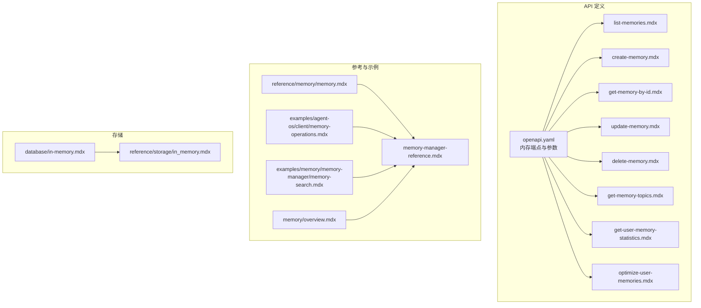
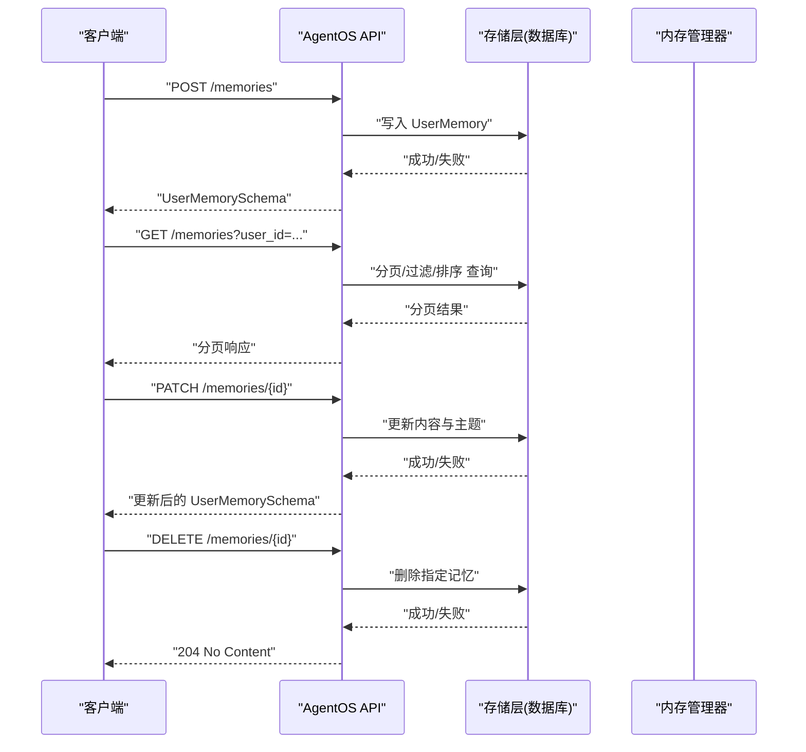
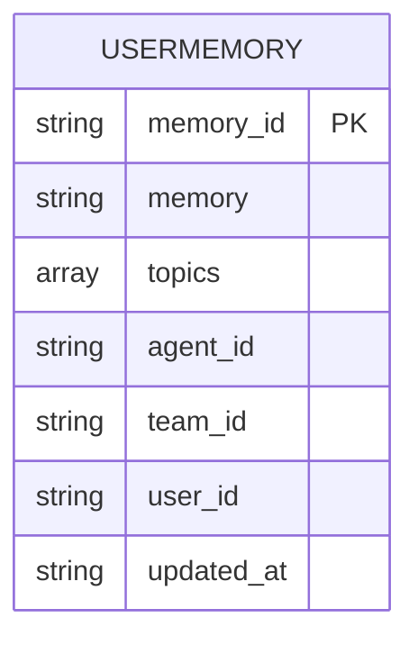
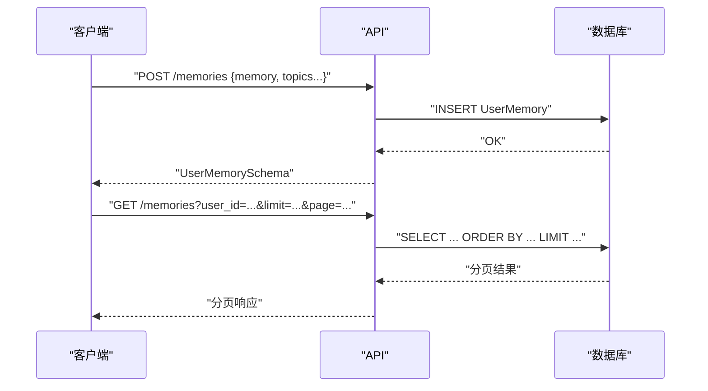
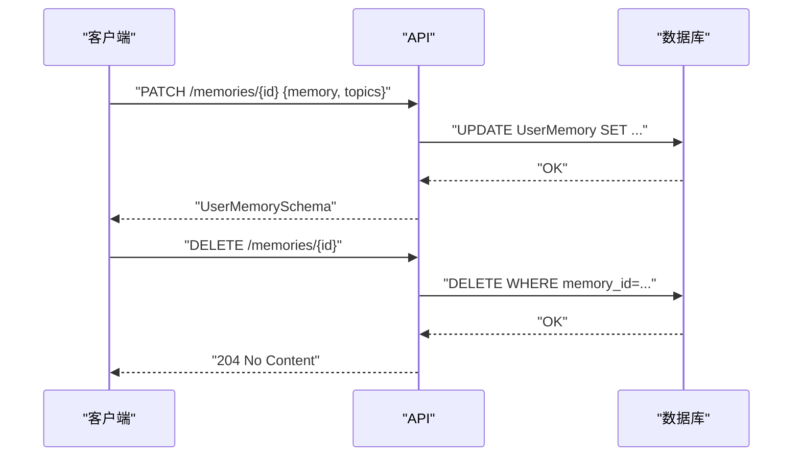
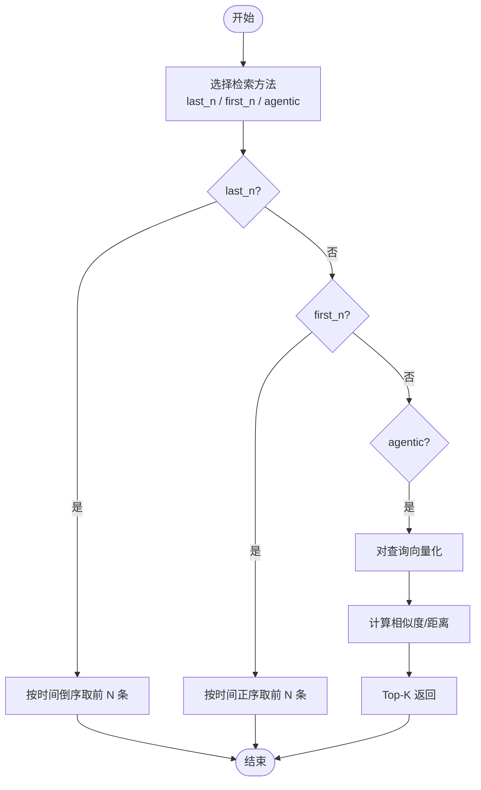
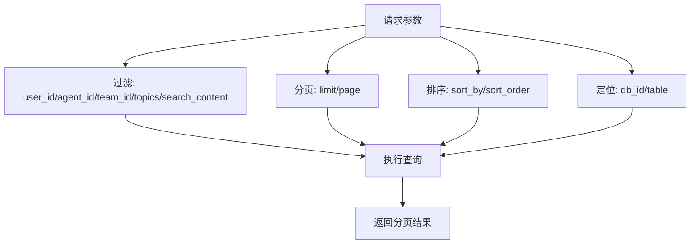
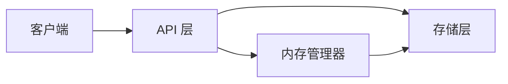

# 内存 API

<cite>
**本文引用的文件**
- [reference-api/schema/memory/list-memories.mdx](file://reference-api/schema/memory/list-memories.mdx)
- [reference-api/schema/memory/create-memory.mdx](file://reference-api/schema/memory/create-memory.mdx)
- [reference-api/schema/memory/get-memory-by-id.mdx](file://reference-api/schema/memory/get-memory-by-id.mdx)
- [reference-api/schema/memory/update-memory.mdx](file://reference-api/schema/memory/update-memory.mdx)
- [reference-api/schema/memory/delete-memory.mdx](file://reference-api/schema/memory/delete-memory.mdx)
- [reference-api/schema/memory/get-memory-topics.mdx](file://reference-api/schema/memory/get-memory-topics.mdx)
- [reference-api/schema/memory/get-user-memory-statistics.mdx](file://reference-api/schema/memory/get-user-memory-statistics.mdx)
- [reference-api/schema/memory/optimize-user-memories.mdx](file://reference-api/schema/memory/optimize-user-memories.mdx)
- [reference-api/openapi.yaml](file://reference-api/openapi.yaml)
- [reference/memory/memory.mdx](file://reference/memory/memory.mdx)
- [_snippets/memory-manager-reference.mdx](file://_snippets/memory-manager-reference.mdx)
- [examples/agent-os/client/memory-operations.mdx](file://examples/agent-os/client/memory-operations.mdx)
- [examples/memory/memory-manager/memory-search.mdx](file://examples/memory/memory-manager/memory-search.mdx)
- [memory/overview.mdx](file://memory/overview.mdx)
- [database/in-memory.mdx](file://database/in-memory.mdx)
- [reference/storage/in_memory.mdx](file://reference/storage/in_memory.mdx)
</cite>

## 目录
1. [简介](#简介)
2. [项目结构](#项目结构)
3. [核心组件](#核心组件)
4. [架构总览](#架构总览)
5. [详细组件分析](#详细组件分析)
6. [依赖分析](#依赖分析)
7. [性能考虑](#性能考虑)
8. [故障排查指南](#故障排查指南)
9. [结论](#结论)
10. [附录](#附录)

## 简介
本技术文档系统化梳理“内存 API”的设计与实现，覆盖内存的创建、查询、更新、删除、统计、话题检索以及优化等能力；同时阐述内存数据模型、检索策略（语义检索、关键词匹配、上下文相关性）、过滤与排序配置、批量操作（导入/导出/迁移/清理）及性能优化与缓存策略。文档面向不同层次读者，既提供高层概览，也给出代码级映射与可视化图示。

## 项目结构
围绕内存 API 的知识分布在以下区域：
- OpenAPI 定义：在 reference-api/openapi.yaml 中定义了内存相关端点、参数、响应与错误码。
- Schema 文档：在 reference-api/schema/memory 下以独立 mdx 文件描述各端点的 OpenAPI 元信息。
- 参考与示例：reference/memory/memory.mdx、_snippets/memory-manager-reference.mdx 提供 MemoryManager 的职责与方法；examples 展示客户端与内存管理器的使用。
- 存储与数据库：database/in-memory.mdx 与 reference/storage/in_memory.mdx 介绍内存数据库与参数。

**图表来源**
- [reference-api/openapi.yaml](file://reference-api/openapi.yaml)
- [reference-api/schema/memory/list-memories.mdx](file://reference-api/schema/memory/list-memories.mdx)
- [reference-api/schema/memory/create-memory.mdx](file://reference-api/schema/memory/create-memory.mdx)
- [reference-api/schema/memory/get-memory-by-id.mdx](file://reference-api/schema/memory/get-memory-by-id.mdx)
- [reference-api/schema/memory/update-memory.mdx](file://reference-api/schema/memory/update-memory.mdx)
- [reference-api/schema/memory/delete-memory.mdx](file://reference-api/schema/memory/delete-memory.mdx)
- [reference-api/schema/memory/get-memory-topics.mdx](file://reference-api/schema/memory/get-memory-topics.mdx)
- [reference-api/schema/memory/get-user-memory-statistics.mdx](file://reference-api/schema/memory/get-user-memory-statistics.mdx)
- [reference-api/schema/memory/optimize-user-memories.mdx](file://reference-api/schema/memory/optimize-user-memories.mdx)
- [reference/memory/memory.mdx](file://reference/memory/memory.mdx)
- [_snippets/memory-manager-reference.mdx](file://_snippets/memory-manager-reference.mdx)
- [examples/agent-os/client/memory-operations.mdx](file://examples/agent-os/client/memory-operations.mdx)
- [examples/memory/memory-manager/memory-search.mdx](file://examples/memory/memory-manager/memory-search.mdx)
- [memory/overview.mdx](file://memory/overview.mdx)
- [database/in-memory.mdx](file://database/in-memory.mdx)
- [reference/storage/in_memory.mdx](file://reference/storage/in_memory.mdx)

**章节来源**
- [reference-api/openapi.yaml](file://reference-api/openapi.yaml)
- [reference-api/schema/memory/list-memories.mdx](file://reference-api/schema/memory/list-memories.mdx)
- [reference/memory/memory.mdx](file://reference/memory/memory.mdx)
- [_snippets/memory-manager-reference.mdx](file://_snippets/memory-manager-reference.mdx)
- [examples/agent-os/client/memory-operations.mdx](file://examples/agent-os/client/memory-operations.mdx)
- [examples/memory/memory-manager/memory-search.mdx](file://examples/memory/memory-manager/memory-search.mdx)
- [memory/overview.mdx](file://memory/overview.mdx)
- [database/in-memory.mdx](file://database/in-memory.mdx)
- [reference/storage/in_memory.mdx](file://reference/storage/in_memory.mdx)

## 核心组件
- 内存管理器（MemoryManager）
  - 职责：负责用户记忆的创建、检索、更新、删除、清空，以及基于检索方法的搜索（last_n、first_n、agentic）。
  - 关键方法：get_user_memories、get_user_memory、add_user_memory、replace_user_memory、delete_user_memory、clear、search_user_memories。
- 数据模型（UserMemory）
  - 字段：memory_id、memory、topics、agent_id、team_id、user_id、updated_at。
- API 端点
  - 列表/创建/按ID查询/更新/删除/话题/统计/优化等端点均在 openapi.yaml 中定义，支持分页、过滤、排序与多数据库/表选择。

**章节来源**
- [_snippets/memory-manager-reference.mdx](file://_snippets/memory-manager-reference.mdx)
- [reference/memory/memory.mdx](file://reference/memory/memory.mdx)
- [reference-api/openapi.yaml](file://reference-api/openapi.yaml)

## 架构总览
内存 API 的调用链路通常如下：客户端通过 AgentOSClient 或直接调用 REST 接口访问后端；后端根据请求参数定位数据库与表，执行 CRUD、检索、统计或优化操作，并返回标准化响应。

**图表来源**
- [reference-api/openapi.yaml](file://reference-api/openapi.yaml)
- [reference-api/schema/memory/create-memory.mdx](file://reference-api/schema/memory/create-memory.mdx)
- [reference-api/schema/memory/list-memories.mdx](file://reference-api/schema/memory/list-memories.mdx)
- [reference-api/schema/memory/update-memory.mdx](file://reference-api/schema/memory/update-memory.mdx)
- [reference-api/schema/memory/delete-memory.mdx](file://reference-api/schema/memory/delete-memory.mdx)

## 详细组件分析

### 数据模型与序列化
- UserMemory 字段
  - memory_id：唯一标识符
  - memory：记忆文本内容
  - topics：主题数组或 null
  - agent_id、team_id、user_id：关联实体标识
  - updated_at：最后更新时间戳
- 序列化
  - 响应体遵循 UserMemorySchema；请求体在创建时要求提供 memory 字段，其他字段可选。

**图表来源**
- [reference-api/openapi.yaml](file://reference-api/openapi.yaml)

**章节来源**
- [reference-api/openapi.yaml](file://reference-api/openapi.yaml)
- [memory/overview.mdx](file://memory/overview.mdx)

### 内存创建与查询
- 创建
  - 端点：POST /memories
  - 请求体：UserMemoryCreateSchema（至少包含 memory）
  - 响应：UserMemorySchema
- 按 ID 查询
  - 端点：GET /memories/{memory_id}
  - 响应：UserMemorySchema
- 列表查询
  - 端点：GET /memories
  - 支持过滤：user_id、agent_id、team_id、topics、search_content
  - 支持分页与排序：limit、page、sort_by、sort_order
  - 支持数据库/表选择：db_id、table

**图表来源**
- [reference-api/schema/memory/create-memory.mdx](file://reference-api/schema/memory/create-memory.mdx)
- [reference-api/schema/memory/get-memory-by-id.mdx](file://reference-api/schema/memory/get-memory-by-id.mdx)
- [reference-api/schema/memory/list-memories.mdx](file://reference-api/schema/memory/list-memories.mdx)
- [reference-api/openapi.yaml](file://reference-api/openapi.yaml)

**章节来源**
- [reference-api/schema/memory/create-memory.mdx](file://reference-api/schema/memory/create-memory.mdx)
- [reference-api/schema/memory/get-memory-by-id.mdx](file://reference-api/schema/memory/get-memory-by-id.mdx)
- [reference-api/schema/memory/list-memories.mdx](file://reference-api/schema/memory/list-memories.mdx)
- [reference-api/openapi.yaml](file://reference-api/openapi.yaml)

### 内存更新与删除
- 更新
  - 端点：PATCH /memories/{memory_id}
  - 行为：替换整条记忆内容与主题列表
- 删除
  - 端点：DELETE /memories/{memory_id}
  - 行为：永久删除，不可恢复

**图表来源**
- [reference-api/schema/memory/update-memory.mdx](file://reference-api/schema/memory/update-memory.mdx)
- [reference-api/schema/memory/delete-memory.mdx](file://reference-api/schema/memory/delete-memory.mdx)
- [reference-api/openapi.yaml](file://reference-api/openapi.yaml)

**章节来源**
- [reference-api/schema/memory/update-memory.mdx](file://reference-api/schema/memory/update-memory.mdx)
- [reference-api/schema/memory/delete-memory.mdx](file://reference-api/schema/memory/delete-memory.mdx)
- [reference-api/openapi.yaml](file://reference-api/openapi.yaml)

### 内存搜索 API
- 检索方法
  - last_n：最近 N 条记忆
  - first_n：最早 N 条记忆
  - agentic：基于语义相似度的 AI 检索
- 示例流程（概念性）

**图表来源**
- [_snippets/memory-manager-reference.mdx](file://_snippets/memory-manager-reference.mdx)
- [examples/memory/memory-manager/memory-search.mdx](file://examples/memory/memory-manager/memory-search.mdx)

**章节来源**
- [_snippets/memory-manager-reference.mdx](file://_snippets/memory-manager-reference.mdx)
- [examples/memory/memory-manager/memory-search.mdx](file://examples/memory/memory-manager/memory-search.mdx)

### 过滤与排序 API 配置
- 过滤
  - user_id、agent_id、team_id、topics（逗号分隔字符串）、search_content（模糊搜索）
- 分页
  - limit（每页数量，默认 20，最小 1）、page（页码，默认 1，最小 0）
- 排序
  - sort_by（默认 updated_at）、sort_order（默认 desc，asc/desc）
- 数据库/表选择
  - db_id、table（用于跨库/跨表查询）

**图表来源**
- [reference-api/openapi.yaml](file://reference-api/openapi.yaml)

**章节来源**
- [reference-api/openapi.yaml](file://reference-api/openapi.yaml)

### 内存话题与统计
- 获取所有话题
  - 端点：GET /memory_topics
- 用户记忆统计
  - 端点：GET /user_memory_stats
  - 用途：了解用户记忆规模、增长趋势等（部分环境可能不支持）

**章节来源**
- [reference-api/schema/memory/get-memory-topics.mdx](file://reference-api/schema/memory/get-memory-topics.mdx)
- [reference-api/schema/memory/get-user-memory-statistics.mdx](file://reference-api/schema/memory/get-user-memory-statistics.mdx)

### 内存优化 API
- 端点：POST /optimize-memories
- 作用：对用户记忆进行去重、压缩、归一化等优化处理，提升检索效率与存储利用率

**章节来源**
- [reference-api/schema/memory/optimize-user-memories.mdx](file://reference-api/schema/memory/optimize-user-memories.mdx)

### 批量操作 API
- 导入/导出
  - 建议通过批量写入/读取接口完成；具体端点需依据实际 openapi.yaml 定义
- 迁移
  - 使用 db_id/table 参数在不同数据库/表之间迁移
- 清理
  - 通过删除接口或优化接口清理冗余记忆

**章节来源**
- [reference-api/openapi.yaml](file://reference-api/openapi.yaml)

### 客户端与示例
- AgentOSClient 使用示例
  - 包含创建、列出、查询、更新、获取话题、获取统计、删除等完整流程
- 内存管理器示例
  - 展示不同检索方法（last_n、first_n、agentic）的使用

**章节来源**
- [examples/agent-os/client/memory-operations.mdx](file://examples/agent-os/client/memory-operations.mdx)
- [examples/memory/memory-manager/memory-search.mdx](file://examples/memory/memory-manager/memory-search.mdx)

## 依赖分析
- 组件耦合
  - API 层依赖存储层（数据库），通过 db_id、table 参数解耦多存储后端
  - MemoryManager 作为业务层，封装检索与管理逻辑，向上提供统一接口
- 外部依赖
  - 向量化/嵌入服务（用于 agentic 检索）
  - 认证中间件（HTTPBearer）

**图表来源**
- [reference-api/openapi.yaml](file://reference-api/openapi.yaml)
- [_snippets/memory-manager-reference.mdx](file://_snippets/memory-manager-reference.mdx)

**章节来源**
- [reference-api/openapi.yaml](file://reference-api/openapi.yaml)
- [_snippets/memory-manager-reference.mdx](file://_snippets/memory-manager-reference.mdx)

## 性能考虑
- 检索性能
  - 对于 agentic 检索，建议预建向量索引并启用近似最近邻算法（ANN）
  - 控制返回 top_k 数量，避免过大的候选集
- 存储与索引
  - 为 topics、user_id、updated_at 等常用过滤/排序字段建立索引
  - 对 memory 文本进行分词与向量化，减少重复存储
- 缓存策略
  - 对热点用户的近期记忆进行缓存，降低数据库压力
  - 结合 LRU/LFU 策略，设定 TTL
- 分页与排序
  - 限制 limit 上限，避免一次性返回过多数据
  - 对排序字段建立索引，避免全表排序
- 批量操作
  - 使用批量写入/删除接口，减少往返次数
  - 在迁移场景中采用分批处理与断点续传

[本节为通用性能指导，无需特定文件来源]

## 故障排查指南
- 常见错误码
  - 400：请求参数无效（如空的记忆 ID 列表）
  - 401：未认证
  - 404：资源不存在（如记忆 ID 不存在）
  - 422：验证错误（如必填字段缺失）
  - 500：服务器内部错误
- 定位步骤
  - 检查认证头是否正确（HTTPBearer）
  - 核对路径参数与查询参数类型与范围
  - 确认 db_id、table 是否指向正确的存储实例与表
  - 对 agentic 检索，确认嵌入服务可用且索引已构建
- 客户端示例中的容错
  - 获取话题与统计接口可能不可用，需捕获异常并降级处理

**章节来源**
- [reference-api/openapi.yaml](file://reference-api/openapi.yaml)
- [examples/agent-os/client/memory-operations.mdx](file://examples/agent-os/client/memory-operations.mdx)

## 结论
内存 API 提供了从创建到优化的完整生命周期管理能力，结合灵活的过滤、分页与排序机制，能够满足多样化的记忆检索与治理需求。通过合理的存储索引、缓存与批量操作策略，可在保证体验的同时提升整体性能与可靠性。

[本节为总结性内容，无需特定文件来源]

## 附录

### API 端点一览（摘要）
- GET /memories：分页列出记忆，支持过滤、搜索、排序与数据库/表选择
- POST /memories：创建新记忆
- GET /memories/{memory_id}：按 ID 获取记忆
- PATCH /memories/{memory_id}：更新记忆内容与主题
- DELETE /memories/{memory_id}：删除记忆
- GET /memory_topics：获取所有话题
- GET /user_memory_stats：获取用户记忆统计
- POST /optimize-memories：优化用户记忆

**章节来源**
- [reference-api/schema/memory/list-memories.mdx](file://reference-api/schema/memory/list-memories.mdx)
- [reference-api/schema/memory/create-memory.mdx](file://reference-api/schema/memory/create-memory.mdx)
- [reference-api/schema/memory/get-memory-by-id.mdx](file://reference-api/schema/memory/get-memory-by-id.mdx)
- [reference-api/schema/memory/update-memory.mdx](file://reference-api/schema/memory/update-memory.mdx)
- [reference-api/schema/memory/delete-memory.mdx](file://reference-api/schema/memory/delete-memory.mdx)
- [reference-api/schema/memory/get-memory-topics.mdx](file://reference-api/schema/memory/get-memory-topics.mdx)
- [reference-api/schema/memory/get-user-memory-statistics.mdx](file://reference-api/schema/memory/get-user-memory-statistics.mdx)
- [reference-api/schema/memory/optimize-user-memories.mdx](file://reference-api/schema/memory/optimize-user-memories.mdx)

### 存储与配置
- 内存数据库（InMemoryDb）
  - 轻量级内存存储，适合演示与开发环境
  - 支持批量方法扩展
- 自定义表名与存储位置
  - 可通过数据库连接参数指定记忆表名，便于隔离与迁移

**章节来源**
- [database/in-memory.mdx](file://database/in-memory.mdx)
- [reference/storage/in_memory.mdx](file://reference/storage/in_memory.mdx)
- [memory/overview.mdx](file://memory/overview.mdx)