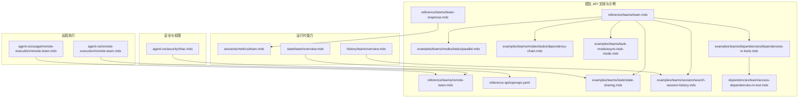
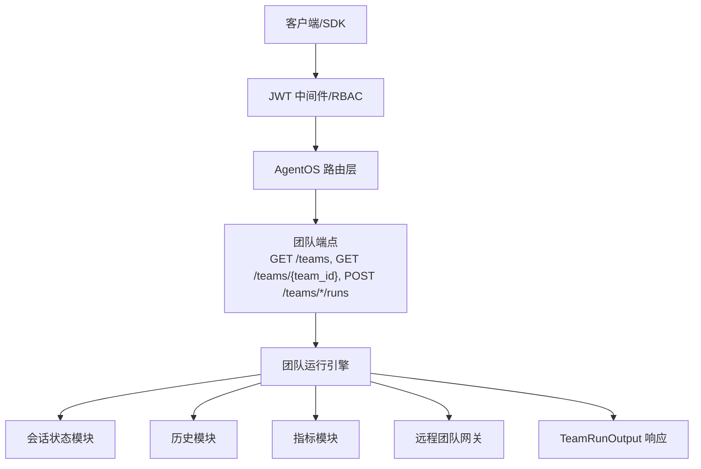
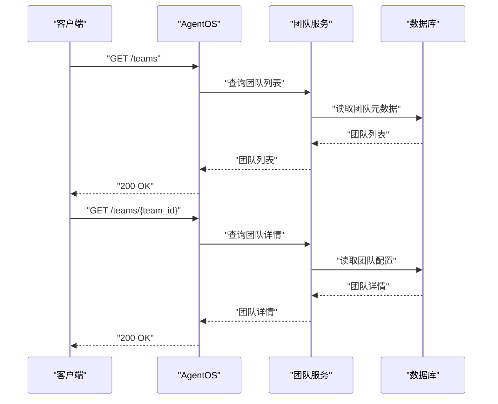
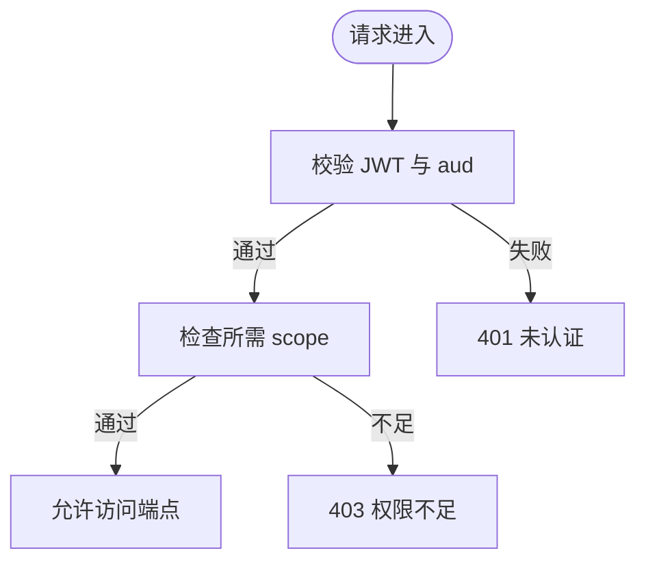
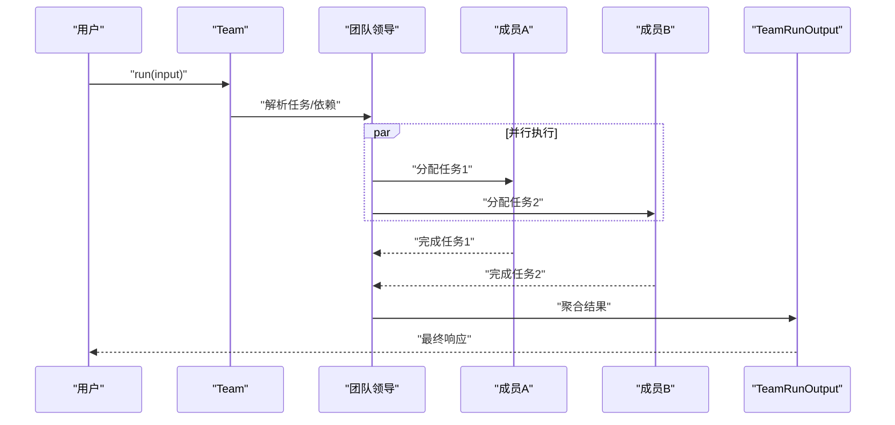
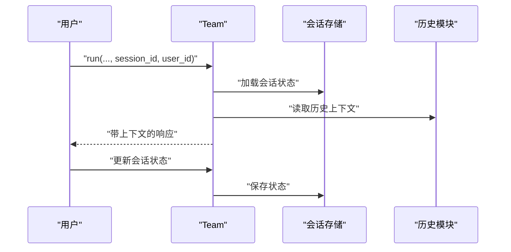
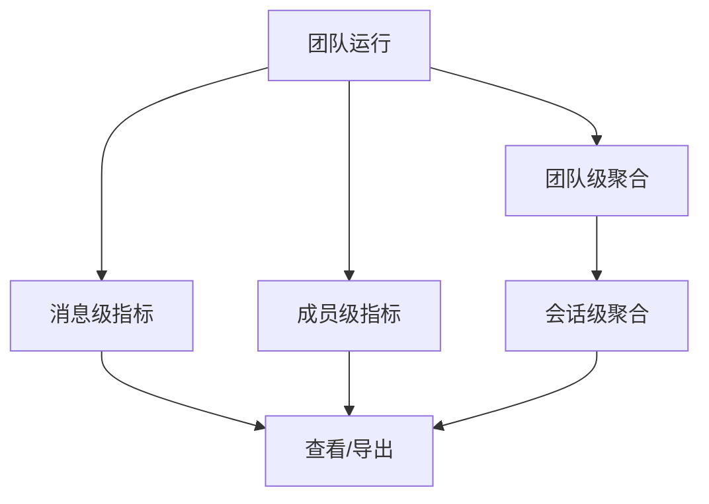
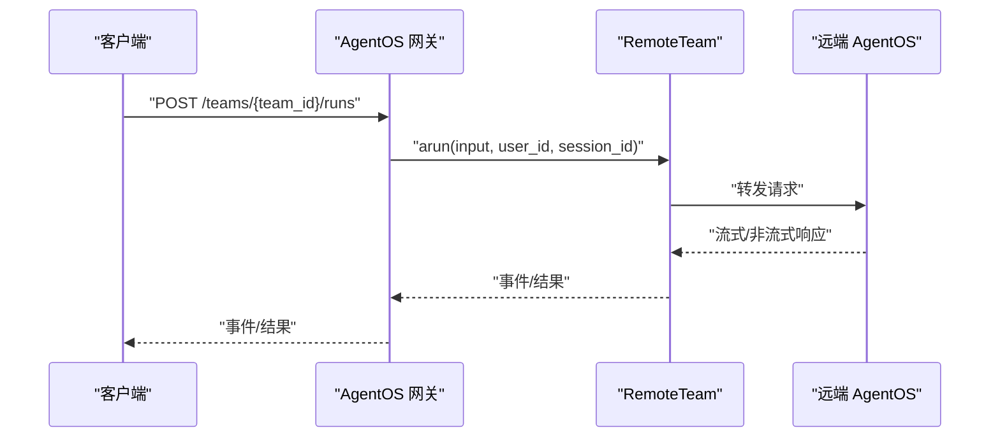
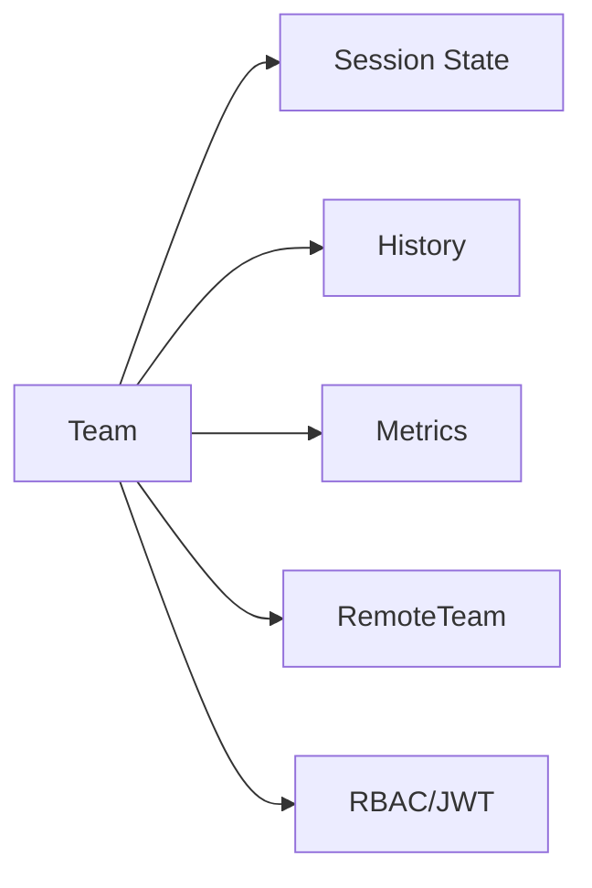

# 团队 API

<cite>
**本文引用的文件**
- [reference-api/openapi.yaml](file://reference-api/openapi.yaml)
- [reference/teams/team.mdx](file://reference/teams/team.mdx)
- [reference/teams/team-response.mdx](file://reference/teams/team-response.mdx)
- [reference/teams/remote-team.mdx](file://reference/teams/remote-team.mdx)
- [agent-os/remote-execution/remote-team.mdx](file://agent-os/remote-execution/remote-team.mdx)
- [agent-os/usage/remote-execution/remote-team.mdx](file://agent-os/usage/remote-execution/remote-team.mdx)
- [sessions/metrics/team.mdx](file://sessions/metrics/team.mdx)
- [sessions/metrics/usage/team-metrics.mdx](file://sessions/metrics/usage/team-metrics.mdx)
- [state/team/overview.mdx](file://state/team/overview.mdx)
- [history/team/overview.mdx](file://history/team/overview.mdx)
- [history/team/team-history.mdx](file://history/team/team-history.mdx)
- [examples/teams/modes/tasks/parallel.mdx](file://examples/teams/modes/tasks/parallel.mdx)
- [examples/teams/modes/tasks/dependency-chain.mdx](file://examples/teams/modes/tasks/dependency-chain.mdx)
- [examples/teams/basics/task-mode.mdx](file://examples/teams/basics/task-mode.mdx)
- [examples/teams/task-mode/async-task-mode.mdx](file://examples/teams/task-mode/async-task-mode.mdx)
- [examples/teams/state/state-sharing.mdx](file://examples/teams/state/state-sharing.mdx)
- [examples/teams/session/search-session-history.mdx](file://examples/teams/session/search-session-history.mdx)
- [examples/teams/dependencies/dependencies-in-tools.mdx](file://examples/teams/dependencies/dependencies-in-tools.mdx)
- [dependencies/team/access-dependencies-in-tool.mdx](file://dependencies/team/access-dependencies-in-tool.mdx)
- [agent-os/security/rbac.mdx](file://agent-os/security/rbac.mdx)
- [agent-os/security/overview.mdx](file://agent-os/security/overview.mdx)
- [tools/team.mdx](file://tools/team.mdx)
- [reference-api/schema/teams/list-all-teams.mdx](file://reference-api/schema/teams/list-all-teams.mdx)
- [reference-api/schema/teams/get-team-details.mdx](file://reference-api/schema/teams/get-team-details.mdx)
</cite>

## 目录
1. [简介](#简介)
2. [项目结构](#项目结构)
3. [核心组件](#核心组件)
4. [架构总览](#架构总览)
5. [详细组件分析](#详细组件分析)
6. [依赖关系分析](#依赖关系分析)
7. [性能考量](#性能考量)
8. [故障排查指南](#故障排查指南)
9. [结论](#结论)
10. [附录](#附录)

## 简介
本文件面向团队 API 的使用者与维护者，系统性梳理团队的创建、配置、运行与管理接口，覆盖团队成员管理、角色分配、权限控制、并发执行、任务分配与结果聚合、会话状态与历史、指标度量、远程团队集成与分布式协作，以及团队工具集成、知识共享与记忆同步等能力。文档以仓库中的参考文档与示例为依据，提供可操作的接口说明、流程图与时序图，并给出最佳实践与排障建议。

## 项目结构
围绕团队 API 的相关资料主要分布在以下区域：
- 参考与规范：reference 与 reference-api 目录下的团队参数、响应、远程团队与 OpenAPI 规范
- 使用示例：examples 下的团队模式（并行、依赖链、异步）、状态共享、会话历史检索、工具依赖访问等
- 运行时能力：sessions/metrics（指标）、state/team（会话状态）、history/team（历史）
- 安全与权限：agent-os/security（RBAC 范围映射）
- 远程执行：agent-os/remote-execution 与 agent-os/usage 下的远程团队用法

**图表来源**
- [reference/teams/team.mdx](file://reference/teams/team.mdx)
- [reference/teams/team-response.mdx](file://reference/teams/team-response.mdx)
- [reference/teams/remote-team.mdx](file://reference/teams/remote-team.mdx)
- [reference-api/openapi.yaml](file://reference-api/openapi.yaml)
- [sessions/metrics/team.mdx](file://sessions/metrics/team.mdx)
- [state/team/overview.mdx](file://state/team/overview.mdx)
- [history/team/overview.mdx](file://history/team/overview.mdx)
- [agent-os/remote-execution/remote-team.mdx](file://agent-os/remote-execution/remote-team.mdx)
- [agent-os/usage/remote-execution/remote-team.mdx](file://agent-os/usage/remote-execution/remote-team.mdx)
- [examples/teams/modes/tasks/parallel.mdx](file://examples/teams/modes/tasks/parallel.mdx)
- [examples/teams/modes/tasks/dependency-chain.mdx](file://examples/teams/modes/tasks/dependency-chain.mdx)
- [examples/teams/task-mode/async-task-mode.mdx](file://examples/teams/task-mode/async-task-mode.mdx)
- [examples/teams/state/state-sharing.mdx](file://examples/teams/state/state-sharing.mdx)
- [examples/teams/session/search-session-history.mdx](file://examples/teams/session/search-session-history.mdx)
- [examples/teams/dependencies/dependencies-in-tools.mdx](file://examples/teams/dependencies/dependencies-in-tools.mdx)
- [dependencies/team/access-dependencies-in-tool.mdx](file://dependencies/team/access-dependencies-in-tool.mdx)

**章节来源**
- [reference/teams/team.mdx](file://reference/teams/team.mdx)
- [reference-api/openapi.yaml](file://reference-api/openapi.yaml)

## 核心组件
- 团队对象与参数：团队由成员（Agent 或 Team）组成，支持模式（如任务模式）、输入分发策略、是否直接返回成员输出、最大迭代次数等关键参数
- 运行与响应：团队运行后返回 TeamRunOutput，包含消息、成员响应、会话级指标等
- 并发与任务：任务模式支持并行执行与依赖链式执行，便于流水线式处理
- 会话与状态：支持会话状态共享、历史记录与上下文维护
- 指标与度量：提供消息级、成员级、团队级与会话级指标，便于资源与性能分析
- 权限与安全：基于 RBAC 的细粒度权限控制，涵盖团队读写与运行
- 远程团队：支持跨实例调用与网关注册，实现分布式协作

**章节来源**
- [reference/teams/team.mdx](file://reference/teams/team.mdx)
- [reference/teams/team-response.mdx](file://reference/teams/team-response.mdx)
- [sessions/metrics/team.mdx](file://sessions/metrics/team.mdx)
- [agent-os/security/rbac.mdx](file://agent-os/security/rbac.mdx)

## 架构总览
下图展示团队 API 在系统中的位置与交互关系：客户端通过授权中间件访问 AgentOS，经由路由映射到团队端点；团队运行时结合会话状态、历史与指标模块，最终返回统一的运行输出。

**图表来源**
- [reference-api/openapi.yaml](file://reference-api/openapi.yaml)
- [agent-os/security/rbac.mdx](file://agent-os/security/rbac.mdx)
- [sessions/metrics/team.mdx](file://sessions/metrics/team.mdx)
- [state/team/overview.mdx](file://state/team/overview.mdx)
- [history/team/overview.mdx](file://history/team/overview.mdx)
- [agent-os/remote-execution/remote-team.mdx](file://agent-os/remote-execution/remote-team.mdx)

## 详细组件分析

### 团队创建与配置接口
- 列表与详情
  - 获取团队列表：GET /teams
  - 获取团队详情：GET /teams/{team_id}
- 团队参数要点
  - 成员列表（members）、模型（model）、名称（name）、角色（role）、是否直接返回成员输出（respond_directly）、是否向成员分发输入（determine_input_for_members）、是否委托给所有成员（delegate_to_all_members）、最大迭代次数（max_iterations）等
- 版本与持久化
  - 团队保存与版本管理在示例中体现，支持软删除与硬删除

**图表来源**
- [reference-api/schema/teams/list-all-teams.mdx](file://reference-api/schema/teams/list-all-teams.mdx)
- [reference-api/schema/teams/get-team-details.mdx](file://reference-api/schema/teams/get-team-details.mdx)
- [reference-api/openapi.yaml](file://reference-api/openapi.yaml)

**章节来源**
- [reference-api/schema/teams/list-all-teams.mdx](file://reference-api/schema/teams/list-all-teams.mdx)
- [reference-api/schema/teams/get-team-details.mdx](file://reference-api/schema/teams/get-team-details.mdx)
- [reference/teams/team.mdx](file://reference/teams/team.mdx)

### 团队成员管理、角色分配与权限控制
- 角色与职责
  - 通过 role 与成员描述定义团队角色；respond_directly 控制是否绕过团队领导直接返回成员输出
  - determine_input_for_members 决定是否将统一输入分发给成员
- 权限范围
  - 团队读写与运行权限：teams:read、teams:write、teams:delete、teams:run
  - 具体团队运行：teams:{team_id}:run
  - 默认端点映射覆盖 GET /teams、GET /teams/*、POST /teams/*/runs 等
- 访问控制
  - JWT 验证失败返回 401，权限不足返回 403
  - 支持自定义 scope 映射与 JWKS 配置

**图表来源**
- [agent-os/security/rbac.mdx](file://agent-os/security/rbac.mdx)
- [agent-os/security/overview.mdx](file://agent-os/security/overview.mdx)

**章节来源**
- [agent-os/security/rbac.mdx](file://agent-os/security/rbac.mdx)
- [agent-os/security/overview.mdx](file://agent-os/security/overview.mdx)

### 团队运行 API：并发执行、任务分配与结果聚合
- 任务模式
  - 并行执行：独立任务并发运行，完成后聚合结果
  - 依赖链：按依赖顺序串行执行，确保上游完成再启动下游
  - 异步运行：支持异步调用与流式事件
- 结果聚合
  - TeamRunOutput 包含团队与成员的消息、工具调用与指标，支持成员响应开关

**图表来源**
- [examples/teams/modes/tasks/parallel.mdx](file://examples/teams/modes/tasks/parallel.mdx)
- [examples/teams/modes/tasks/dependency-chain.mdx](file://examples/teams/modes/tasks/dependency-chain.mdx)
- [examples/teams/basics/task-mode.mdx](file://examples/teams/basics/task-mode.mdx)
- [examples/teams/task-mode/async-task-mode.mdx](file://examples/teams/task-mode/async-task-mode.mdx)
- [reference/teams/team-response.mdx](file://reference/teams/team-response.mdx)

**章节来源**
- [examples/teams/modes/tasks/parallel.mdx](file://examples/teams/modes/tasks/parallel.mdx)
- [examples/teams/modes/tasks/dependency-chain.mdx](file://examples/teams/modes/tasks/dependency-chain.mdx)
- [examples/teams/basics/task-mode.mdx](file://examples/teams/basics/task-mode.mdx)
- [examples/teams/task-mode/async-task-mode.mdx](file://examples/teams/task-mode/async-task-mode.mdx)
- [reference/teams/team-response.mdx](file://reference/teams/team-response.mdx)

### 团队会话 API：状态管理、历史与上下文
- 会话状态
  - 初始化 session_state，成员可通过 run_context.session_state 访问与更新
- 历史与上下文
  - 支持将团队历史注入上下文、将团队历史共享给成员、限制历史轮数等
  - 示例演示多用户多会话的历史检索与上下文隔离
- 会话生命周期
  - 提供获取/设置会话名、保存/删除会话、获取/更新会话状态等方法

**图表来源**
- [state/team/overview.mdx](file://state/team/overview.mdx)
- [history/team/overview.mdx](file://history/team/overview.mdx)
- [history/team/team-history.mdx](file://history/team/team-history.mdx)
- [examples/teams/state/state-sharing.mdx](file://examples/teams/state/state-sharing.mdx)
- [examples/teams/session/search-session-history.mdx](file://examples/teams/session/search-session-history.mdx)
- [reference/teams/team.mdx](file://reference/teams/team.mdx)

**章节来源**
- [state/team/overview.mdx](file://state/team/overview.mdx)
- [history/team/overview.mdx](file://history/team/overview.mdx)
- [history/team/team-history.mdx](file://history/team/team-history.mdx)
- [examples/teams/state/state-sharing.mdx](file://examples/teams/state/state-sharing.mdx)
- [examples/teams/session/search-session-history.mdx](file://examples/teams/session/search-session-history.mdx)
- [reference/teams/team.mdx](file://reference/teams/team.mdx)

### 团队指标 API：性能统计、资源使用与效率分析
- 指标层级
  - 消息级：单条消息的 token、时延、推理耗时等
  - 成员级：每个成员运行的指标，可通过开关收集
  - 团队级：对团队领导与成员消息的聚合
  - 会话级：跨多次运行的聚合指标
- 关键字段
  - 输入/输出/音频 token、缓存命中、推理 token、总 token、时延、首 token 时间、提供商指标等
- 使用方式
  - 运行后从 TeamRunOutput 与会话指标接口读取

**图表来源**
- [sessions/metrics/team.mdx](file://sessions/metrics/team.mdx)
- [sessions/metrics/usage/team-metrics.mdx](file://sessions/metrics/usage/team-metrics.mdx)
- [reference/teams/team-response.mdx](file://reference/teams/team-response.mdx)

**章节来源**
- [sessions/metrics/team.mdx](file://sessions/metrics/team.mdx)
- [sessions/metrics/usage/team-metrics.mdx](file://sessions/metrics/usage/team-metrics.mdx)
- [reference/teams/team-response.mdx](file://reference/teams/team-response.mdx)

### 远程团队 API：集成与分布式协作
- 远程团队
  - RemoteTeam 支持异步运行、流式事件、鉴权令牌传递、配置缓存与强制刷新
  - 支持在网关中注册多个远程团队并统一对外提供服务
- 端点映射
  - 默认包含团队读取、创建、更新、删除与运行端点，配合 RBAC 控制访问
- 最佳实践
  - 在网关侧集中鉴权与路由，避免重复鉴权逻辑
  - 合理设置超时与重试，保障跨实例调用稳定性

**图表来源**
- [reference/teams/remote-team.mdx](file://reference/teams/remote-team.mdx)
- [agent-os/remote-execution/remote-team.mdx](file://agent-os/remote-execution/remote-team.mdx)
- [agent-os/usage/remote-execution/remote-team.mdx](file://agent-os/usage/remote-execution/remote-team.mdx)
- [reference-api/openapi.yaml](file://reference-api/openapi.yaml)

**章节来源**
- [reference/teams/remote-team.mdx](file://reference/teams/remote-team.mdx)
- [agent-os/remote-execution/remote-team.mdx](file://agent-os/remote-execution/remote-team.mdx)
- [agent-os/usage/remote-execution/remote-team.mdx](file://agent-os/usage/remote-execution/remote-team.mdx)
- [reference-api/openapi.yaml](file://reference-api/openapi.yaml)

### 团队工具集成、知识共享与记忆同步
- 工具依赖
  - 团队工具可通过 dependencies 参数访问团队指标与当前上下文，实现跨模块协同
- 知识与记忆
  - 团队可启用知识与记忆能力（具体启用方式见团队参数与示例）
  - 支持在工具中读取/写入记忆，实现跨轮次的知识沉淀与复用

**章节来源**
- [examples/teams/dependencies/dependencies-in-tools.mdx](file://examples/teams/dependencies/dependencies-in-tools.mdx)
- [dependencies/team/access-dependencies-in-tool.mdx](file://dependencies/team/access-dependencies-in-tool.mdx)
- [tools/team.mdx](file://tools/team.mdx)

## 依赖关系分析
- 组件耦合
  - 团队运行引擎与会话状态、历史、指标模块松耦合，通过统一接口交互
  - 远程团队通过网关与鉴权中间件接入，保持端点一致性
- 外部依赖
  - JWT 验证与 JWKS 配置用于权限控制
  - 数据库/存储用于持久化会话、历史与指标

**图表来源**
- [state/team/overview.mdx](file://state/team/overview.mdx)
- [history/team/overview.mdx](file://history/team/overview.mdx)
- [sessions/metrics/team.mdx](file://sessions/metrics/team.mdx)
- [agent-os/remote-execution/remote-team.mdx](file://agent-os/remote-execution/remote-team.mdx)
- [agent-os/security/rbac.mdx](file://agent-os/security/rbac.mdx)

**章节来源**
- [state/team/overview.mdx](file://state/team/overview.mdx)
- [history/team/overview.mdx](file://history/team/overview.mdx)
- [sessions/metrics/team.mdx](file://sessions/metrics/team.mdx)
- [agent-os/remote-execution/remote-team.mdx](file://agent-os/remote-execution/remote-team.mdx)
- [agent-os/security/rbac.mdx](file://agent-os/security/rbac.mdx)

## 性能考量
- 并行与依赖
  - 并行执行提升吞吐，但需关注资源竞争与依赖约束
- 指标监控
  - 通过消息级与会话级指标识别热点与瓶颈，优化任务拆分与成员分工
- 会话与历史
  - 合理设置历史轮数与上下文注入范围，避免上下文膨胀导致延迟上升
- 远程调用
  - 设置合理的超时与重试策略，避免跨实例调用成为性能瓶颈

## 故障排查指南
- 权限问题
  - 401：检查 JWT 是否有效、aud 是否匹配 AgentOS id
  - 403：确认 scopes 是否包含 teams:{team_id}:run 或 teams:run
- 运行异常
  - 检查任务依赖是否成环或缺失前置
  - 确认成员工具可用性与网络连通性
- 指标缺失
  - 确认已开启成员响应收集与会话指标刷新
- 远程团队
  - 校验 base_url 与鉴权令牌，确认网关路由正确

**章节来源**
- [agent-os/security/overview.mdx](file://agent-os/security/overview.mdx)
- [agent-os/security/rbac.mdx](file://agent-os/security/rbac.mdx)
- [sessions/metrics/team.mdx](file://sessions/metrics/team.mdx)
- [agent-os/remote-execution/remote-team.mdx](file://agent-os/remote-execution/remote-team.mdx)

## 结论
团队 API 提供了从创建、配置、运行到管理的完整能力闭环：通过任务模式实现高效并发与有序协作，借助会话状态与历史维持上下文连续性，利用指标体系进行性能与资源分析，结合 RBAC 实现细粒度权限控制，并通过远程团队与网关支持分布式协作。建议在实际落地中优先明确角色与权限边界，合理设计任务依赖与并行策略，持续观测指标并优化会话上下文规模。

## 附录
- 团队参数与方法参考：见团队参数与响应文档
- 运行示例：并行任务、依赖链、异步运行、状态共享、历史检索、工具依赖访问
- 安全配置：RBAC 范围映射与 JWT 中间件配置

**章节来源**
- [reference/teams/team.mdx](file://reference/teams/team.mdx)
- [reference/teams/team-response.mdx](file://reference/teams/team-response.mdx)
- [examples/teams/modes/tasks/parallel.mdx](file://examples/teams/modes/tasks/parallel.mdx)
- [examples/teams/modes/tasks/dependency-chain.mdx](file://examples/teams/modes/tasks/dependency-chain.mdx)
- [examples/teams/task-mode/async-task-mode.mdx](file://examples/teams/task-mode/async-task-mode.mdx)
- [examples/teams/state/state-sharing.mdx](file://examples/teams/state/state-sharing.mdx)
- [examples/teams/session/search-session-history.mdx](file://examples/teams/session/search-session-history.mdx)
- [examples/teams/dependencies/dependencies-in-tools.mdx](file://examples/teams/dependencies/dependencies-in-tools.mdx)
- [dependencies/team/access-dependencies-in-tool.mdx](file://dependencies/team/access-dependencies-in-tool.mdx)
- [agent-os/security/rbac.mdx](file://agent-os/security/rbac.mdx)