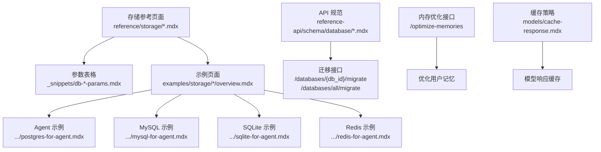
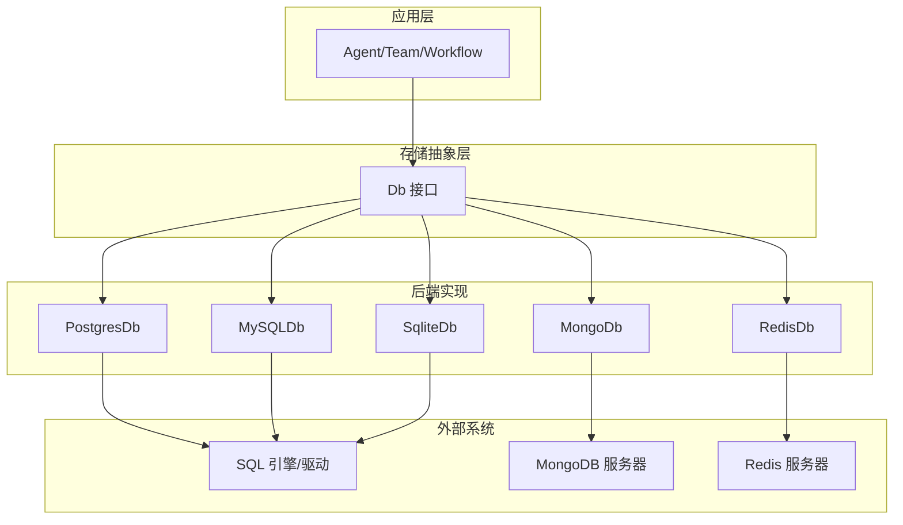
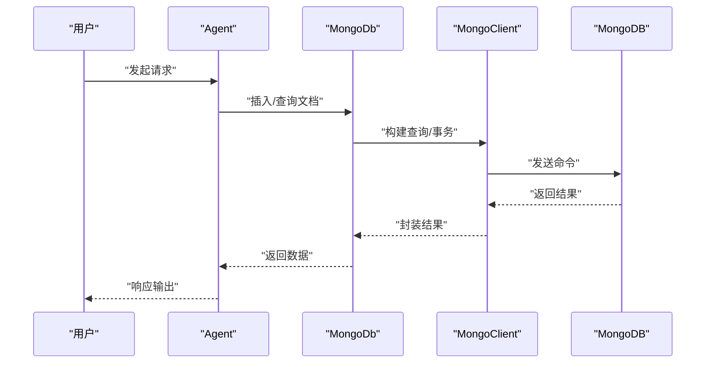
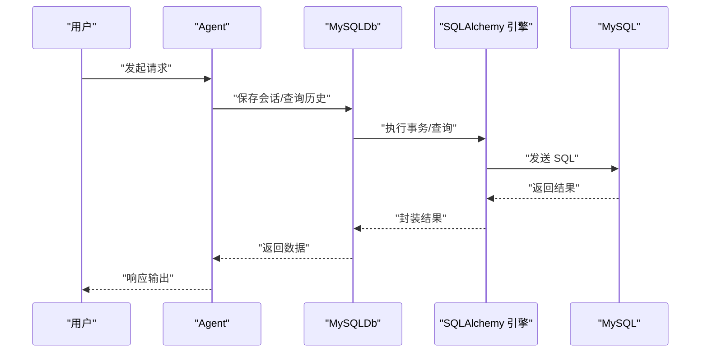
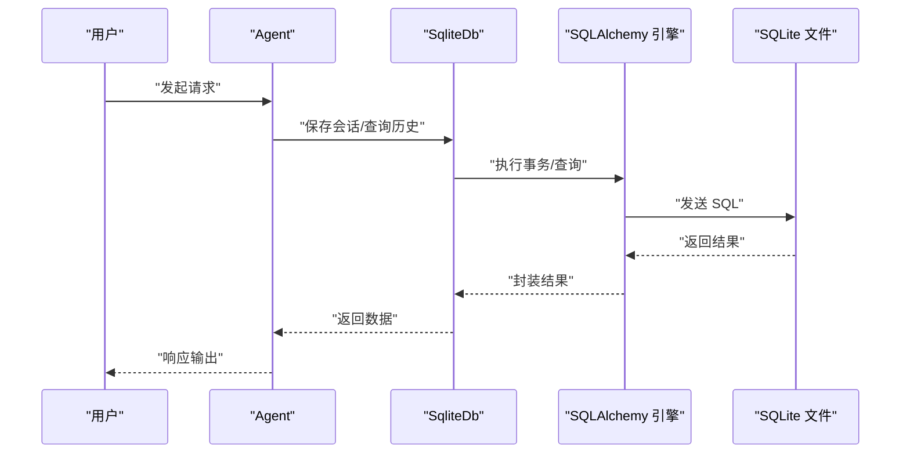
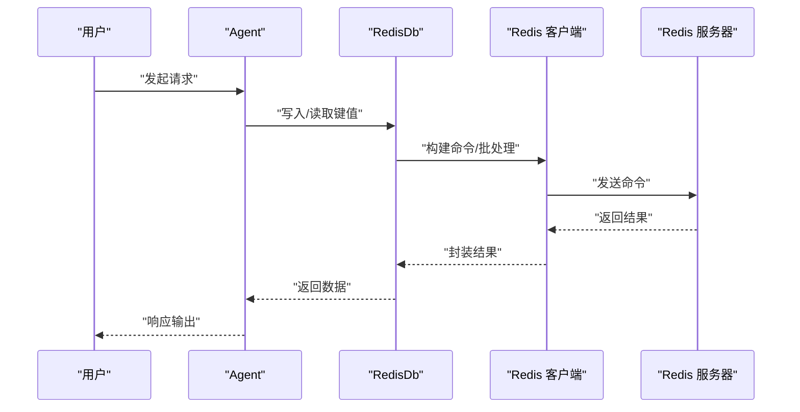
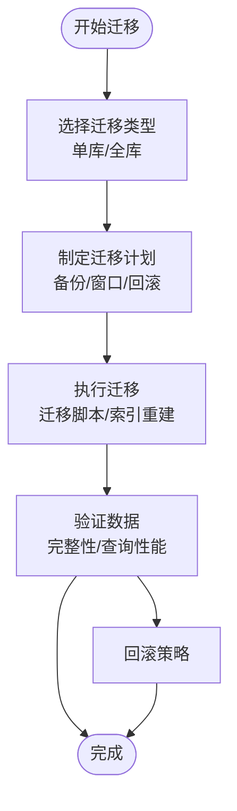
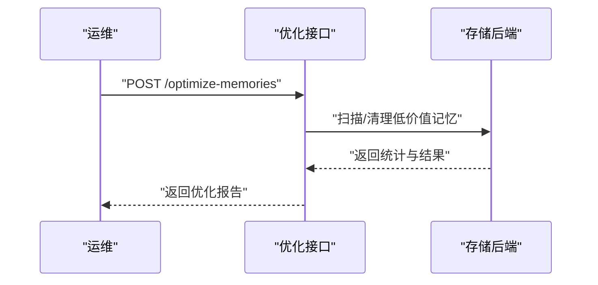
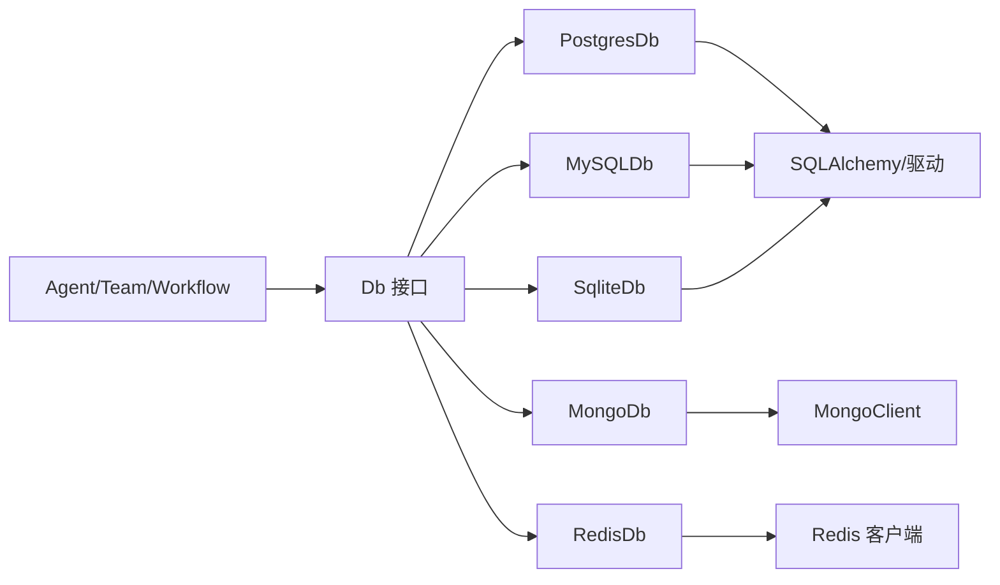

# 存储 API

<cite>
**本文引用的文件**
- [reference/storage/postgres.mdx](file://reference/storage/postgres.mdx)
- [reference/storage/mongodb.mdx](file://reference/storage/mongodb.mdx)
- [reference/storage/mysql.mdx](file://reference/storage/mysql.mdx)
- [reference/storage/sqlite.mdx](file://reference/storage/sqlite.mdx)
- [reference/storage/redis.mdx](file://reference/storage/redis.mdx)
- [cookbook/storage/overview.mdx](file://cookbook/storage/overview.mdx)
- [_snippets/db-postgres-params.mdx](file://_snippets/db-postgres-params.mdx)
- [_snippets/db-mongodb-params.mdx](file://_snippets/db-mongodb-params.mdx)
- [_snippets/db-mysql-params.mdx](file://_snippets/db-mysql-params.mdx)
- [_snippets/db-sqlite-params.mdx](file://_snippets/db-sqlite-params.mdx)
- [_snippets/db-redis-params.mdx](file://_snippets/db-redis-params.mdx)
- [examples/storage/postgres/postgres-for-agent.mdx](file://examples/storage/postgres/postgres-for-agent.mdx)
- [examples/storage/mysql/mysql-for-agent.mdx](file://examples/storage/mysql/mysql-for-agent.mdx)
- [examples/storage/sqlite/sqlite-for-agent.mdx](file://examples/storage/sqlite/sqlite-for-agent.mdx)
- [examples/storage/redis/redis-for-agent.mdx](file://examples/storage/redis/redis-for-agent.mdx)
- [reference-api/schema/database/migrate-database.mdx](file://reference-api/schema/database/migrate-database.mdx)
- [reference-api/schema/database/migrate-all-databases.mdx](file://reference-api/schema/database/migrate-all-databases.mdx)
- [reference-api/schema/memory/optimize-user-memories.mdx](file://reference-api/schema/memory/optimize-user-memories.mdx)
- [TBD/pages/reference-api/schema/memory/optimize-user-memories.mdx](file://TBD/pages/reference-api/schema/memory/optimize-user-memories.mdx)
- [models/cache-response.mdx](file://models/cache-response.mdx)
- [models/providers/native/openai/completion/usage/cache-response.mdx](file://models/providers/native/openai/completion/usage/cache-response.mdx)
</cite>

## 目录
1. [简介](#简介)
2. [项目结构](#项目结构)
3. [核心组件](#核心组件)
4. [架构总览](#架构总览)
5. [详细组件分析](#详细组件分析)
6. [依赖关系分析](#依赖关系分析)
7. [性能考虑](#性能考虑)
8. [故障排除指南](#故障排除指南)
9. [结论](#结论)
10. [附录](#附录)

## 简介
本文件系统性梳理了统一存储接口与多数据库后端（PostgreSQL、MongoDB、MySQL、SQLite、Redis 等）的集成规范，覆盖连接管理、事务处理、查询优化、CRUD 与索引约束、批量操作、迁移与备份、监控与故障排除等主题。目标是帮助开发者在不同运行环境中快速、安全地选择与配置合适的存储后端，并通过一致的 API 实现稳定的数据持久化。

## 项目结构
围绕存储 API 的知识分布在以下区域：
- 参考页面：各数据库后端的类定义与能力说明
- 参数表格：各后端的关键配置项与默认值
- 示例页面：针对 Agent/Team/Workflow 的具体用法
- API 规范：数据库迁移与内存优化等接口
- 缓存策略：模型响应缓存与开发测试优化

**图表来源**
- [reference/storage/postgres.mdx:1-9](file://reference/storage/postgres.mdx#L1-L9)
- [reference/storage/mongodb.mdx:1-9](file://reference/storage/mongodb.mdx#L1-L9)
- [reference/storage/mysql.mdx:1-10](file://reference/storage/mysql.mdx#L1-L10)
- [reference/storage/sqlite.mdx:1-9](file://reference/storage/sqlite.mdx#L1-L9)
- [reference/storage/redis.mdx:1-9](file://reference/storage/redis.mdx#L1-L9)
- [_snippets/db-postgres-params.mdx:1-14](file://_snippets/db-postgres-params.mdx#L1-L14)
- [_snippets/db-mongodb-params.mdx:1-13](file://_snippets/db-mongodb-params.mdx#L1-L13)
- [_snippets/db-mysql-params.mdx:1-13](file://_snippets/db-mysql-params.mdx#L1-L13)
- [_snippets/db-sqlite-params.mdx:1-14](file://_snippets/db-sqlite-params.mdx#L1-L14)
- [_snippets/db-redis-params.mdx:1-14](file://_snippets/db-redis-params.mdx#L1-L14)
- [examples/storage/postgres/postgres-for-agent.mdx:1-51](file://examples/storage/postgres/postgres-for-agent.mdx#L1-L51)
- [examples/storage/mysql/mysql-for-agent.mdx:1-49](file://examples/storage/mysql/mysql-for-agent.mdx#L1-L49)
- [examples/storage/sqlite/sqlite-for-agent.mdx:1-54](file://examples/storage/sqlite/sqlite-for-agent.mdx#L1-L54)
- [examples/storage/redis/redis-for-agent.mdx:1-66](file://examples/storage/redis/redis-for-agent.mdx#L1-L66)
- [reference-api/schema/database/migrate-database.mdx:1-3](file://reference-api/schema/database/migrate-database.mdx#L1-L3)
- [reference-api/schema/database/migrate-all-databases.mdx:1-3](file://reference-api/schema/database/migrate-all-databases.mdx#L1-L3)
- [reference-api/schema/memory/optimize-user-memories.mdx:1-3](file://reference-api/schema/memory/optimize-user-memories.mdx#L1-L3)
- [TBD/pages/reference-api/schema/memory/optimize-user-memories.mdx:1-3](file://TBD/pages/reference-api/schema/memory/optimize-user-memories.mdx#L1-L3)
- [models/cache-response.mdx:20-53](file://models/cache-response.mdx#L20-L53)
- [models/providers/native/openai/completion/usage/cache-response.mdx:1-52](file://models/providers/native/openai/completion/usage/cache-response.mdx#L1-L52)

**章节来源**
- [cookbook/storage/overview.mdx:1-38](file://cookbook/storage/overview.mdx#L1-L38)
- [reference/storage/postgres.mdx:1-9](file://reference/storage/postgres.mdx#L1-L9)
- [reference/storage/mongodb.mdx:1-9](file://reference/storage/mongodb.mdx#L1-L9)
- [reference/storage/mysql.mdx:1-10](file://reference/storage/mysql.mdx#L1-L10)
- [reference/storage/sqlite.mdx:1-9](file://reference/storage/sqlite.mdx#L1-L9)
- [reference/storage/redis.mdx:1-9](file://reference/storage/redis.mdx#L1-L9)

## 核心组件
- 统一接口与实现
  - 各数据库后端均实现统一的 Db 接口，面向 Agent/Team/Workflow 提供会话、记忆、指标、评估、知识、追踪与跨度等数据的持久化能力。
  - 典型实现类：
    - PostgresDb（关系型，支持 JSONB、模式版本化）
    - MongoDb（文档型，支持集合与索引）
    - MySQLDb（关系型，支持 JSONB、模式版本化）
    - SqliteDb（轻量文件型，支持 JSON、模式版本化）
    - RedisDb（高性能键值/JSON，支持 TTL）

- 通用 API 能力
  - 连接管理：支持传入已有的引擎/客户端或通过连接字符串自动建立连接；可配置表名/集合前缀、TTL 等。
  - 事务处理：关系型后端（PostgreSQL、MySQL、SQLite）通过 SQLAlchemy 引擎支持事务；文档型后端（MongoDB）通过驱动事务能力；Redis 通过单命令原子性与 Lua 脚本实现复合操作。
  - 查询优化：关系型后端建议按会话/实体主键与时间戳建立索引；文档型后端建议对常用过滤字段建立索引；Redis 建议合理设置 TTL 与键命名空间。
  - 批量操作：统一的批量写入/更新/删除接口，减少网络往返与提升吞吐。
  - 索引与约束：关系型后端支持外键、唯一约束、JSONB 查询；文档型后端支持复合索引与地理空间索引；Redis 建议使用有序集合进行带分数的排序与范围查询。

**章节来源**
- [reference/storage/postgres.mdx:5-9](file://reference/storage/postgres.mdx#L5-L9)
- [reference/storage/mongodb.mdx:5-9](file://reference/storage/mongodb.mdx#L5-L9)
- [reference/storage/mysql.mdx:5-10](file://reference/storage/mysql.mdx#L5-L10)
- [reference/storage/sqlite.mdx:5-9](file://reference/storage/sqlite.mdx#L5-L9)
- [reference/storage/redis.mdx:5-9](file://reference/storage/redis.mdx#L5-L9)
- [cookbook/storage/overview.mdx:23-38](file://cookbook/storage/overview.mdx#L23-L38)

## 架构总览
下图展示了统一存储接口与多后端的交互关系，以及典型调用链路。

**图表来源**
- [reference/storage/postgres.mdx:5-9](file://reference/storage/postgres.mdx#L5-L9)
- [reference/storage/mysql.mdx:5-10](file://reference/storage/mysql.mdx#L5-L10)
- [reference/storage/sqlite.mdx:5-9](file://reference/storage/sqlite.mdx#L5-L9)
- [reference/storage/mongodb.mdx:5-9](file://reference/storage/mongodb.mdx#L5-L9)
- [reference/storage/redis.mdx:5-9](file://reference/storage/redis.mdx#L5-L9)

## 详细组件分析

### PostgreSQL 集成
- 类与能力
  - PostgresDb 实现关系型存储，支持 JSONB 字段、模式版本化与高效查询。
- 关键配置
  - 连接参数：db_url、db_engine、db_schema
  - 表名映射：session_table、memory_table、metrics_table、eval_table、knowledge_table、traces_table、spans_table
- 使用示例
  - 在 Agent 中注入 PostgresDb 并开启历史上下文，实现跨会话持久化。
- 性能与优化
  - 建议对会话主键、时间戳、标签字段建立索引；使用 JSONB 查询函数加速过滤；合理分表/分区以支撑大规模数据。

**图表来源**
- [examples/storage/postgres/postgres-for-agent.mdx:12-37](file://examples/storage/postgres/postgres-for-agent.mdx#L12-L37)
- [reference/storage/postgres.mdx:5-9](file://reference/storage/postgres.mdx#L5-L9)
- [_snippets/db-postgres-params.mdx:1-14](file://_snippets/db-postgres-params.mdx#L1-L14)

**章节来源**
- [reference/storage/postgres.mdx:1-9](file://reference/storage/postgres.mdx#L1-L9)
- [_snippets/db-postgres-params.mdx:1-14](file://_snippets/db-postgres-params.mdx#L1-L14)
- [examples/storage/postgres/postgres-for-agent.mdx:1-51](file://examples/storage/postgres/postgres-for-agent.mdx#L1-L51)

### MongoDB 集成
- 类与能力
  - MongoDb 实现文档型存储，支持集合、索引与高效查询。
- 关键配置
  - 客户端/连接：db_client、db_name、db_url
  - 集合映射：session_collection、memory_collection、metrics_collection、eval_collection、knowledge_collection、traces_collection、spans_collection
- 使用示例
  - 在 Agent 中注入 MongoDb，实现灵活的文档存储与检索。
- 性能与优化
  - 建议对常用过滤字段建立复合索引；使用聚合管道优化复杂查询；合理拆分集合以降低单集合膨胀。

**图表来源**
- [reference/storage/mongodb.mdx:5-9](file://reference/storage/mongodb.mdx#L5-L9)
- [_snippets/db-mongodb-params.mdx:1-13](file://_snippets/db-mongodb-params.mdx#L1-L13)

**章节来源**
- [reference/storage/mongodb.mdx:1-9](file://reference/storage/mongodb.mdx#L1-L9)
- [_snippets/db-mongodb-params.mdx:1-13](file://_snippets/db-mongodb-params.mdx#L1-L13)

### MySQL 集成
- 类与能力
  - MySQLDb 实现关系型存储，支持 JSONB、模式版本化与高效查询。
- 关键配置
  - 连接参数：db_engine、db_schema、db_url
  - 表名映射：与 PostgreSQL 类似
- 使用示例
  - 在 Agent 中注入 MySQLDb，实现稳定的会话与历史持久化。
- 性能与优化
  - 建议使用合适的字符集与索引策略；避免大字段频繁参与排序/JOIN；必要时启用分区表。

**图表来源**
- [examples/storage/mysql/mysql-for-agent.mdx:12-35](file://examples/storage/mysql/mysql-for-agent.mdx#L12-L35)
- [reference/storage/mysql.mdx:5-10](file://reference/storage/mysql.mdx#L5-L10)
- [_snippets/db-mysql-params.mdx:1-13](file://_snippets/db-mysql-params.mdx#L1-L13)

**章节来源**
- [reference/storage/mysql.mdx:1-10](file://reference/storage/mysql.mdx#L1-L10)
- [_snippets/db-mysql-params.mdx:1-13](file://_snippets/db-mysql-params.mdx#L1-L13)
- [examples/storage/mysql/mysql-for-agent.mdx:1-49](file://examples/storage/mysql/mysql-for-agent.mdx#L1-L49)

### SQLite 集成
- 类与能力
  - SqliteDb 实现文件型存储，适合本地开发与轻量部署。
- 关键配置
  - 连接参数：db_engine、db_url、db_file
  - 表名映射：与关系型后端类似
- 使用示例
  - 在 Agent 中注入 SqliteDb，实现本地持久化与演示部署。
- 性能与优化
  - 建议使用 WAL 模式提升并发；合理设置页大小与缓存；避免长事务与大事务日志。

**图表来源**
- [examples/storage/sqlite/sqlite-for-agent.mdx:12-40](file://examples/storage/sqlite/sqlite-for-agent.mdx#L12-L40)
- [reference/storage/sqlite.mdx:5-9](file://reference/storage/sqlite.mdx#L5-L9)
- [_snippets/db-sqlite-params.mdx:1-14](file://_snippets/db-sqlite-params.mdx#L1-L14)

**章节来源**
- [reference/storage/sqlite.mdx:1-9](file://reference/storage/sqlite.mdx#L1-L9)
- [_snippets/db-sqlite-params.mdx:1-14](file://_snippets/db-sqlite-params.mdx#L1-L14)
- [examples/storage/sqlite/sqlite-for-agent.mdx:1-54](file://examples/storage/sqlite/sqlite-for-agent.mdx#L1-L54)

### Redis 集成
- 类与能力
  - RedisDb 实现高性能键值/JSON 存储，适合缓存、会话与短期数据。
- 关键配置
  - 客户端/连接：redis_client、db_url、db_prefix、expire
  - 表名映射：与关系型后端类似（键命名空间）
- 使用示例
  - 在 Agent 中注入 RedisDb，实现高吞吐的会话与记忆存储。
- 性能与优化
  - 合理设置 TTL 与键前缀；使用流水线与批处理；避免大对象与过期风暴。

**图表来源**
- [examples/storage/redis/redis-for-agent.mdx:22-52](file://examples/storage/redis/redis-for-agent.mdx#L22-L52)
- [reference/storage/redis.mdx:5-9](file://reference/storage/redis.mdx#L5-L9)
- [_snippets/db-redis-params.mdx:1-14](file://_snippets/db-redis-params.mdx#L1-L14)

**章节来源**
- [reference/storage/redis.mdx:1-9](file://reference/storage/redis.mdx#L1-L9)
- [_snippets/db-redis-params.mdx:1-14](file://_snippets/db-redis-params.mdx#L1-L14)
- [examples/storage/redis/redis-for-agent.mdx:1-66](file://examples/storage/redis/redis-for-agent.mdx#L1-L66)

### 通用 API 规范（CRUD、索引与约束）
- CRUD 操作
  - 写入：支持单条/批量插入，确保幂等性与去重策略。
  - 读取：支持主键查询、范围查询、条件过滤与投影。
  - 更新：支持部分更新与条件更新，文档型后端建议使用 $set/$unset 等原子操作。
  - 删除：支持软删除标记与硬删除，结合审计与回收站策略。
- 索引与约束
  - 关系型：主键、唯一索引、复合索引、GIN/SP-GiST 索引用于 JSONB 查询。
  - 文档型：文本/数值/地理空间索引，TTL 索引用于过期数据清理。
  - 键值型：有序集合/集合用于排序与去重。
- 事务与一致性
  - 关系型：显式事务包裹批量写入，失败回滚。
  - 文档型：驱动级事务或幂等写入策略。
  - 键值型：单命令原子性与 Lua 脚本组合操作。

**章节来源**
- [cookbook/storage/overview.mdx:23-38](file://cookbook/storage/overview.mdx#L23-L38)

### 迁移与备份（API 与实践）
- 数据库迁移
  - 单库迁移：POST /databases/{db_id}/migrate
  - 全库迁移：POST /databases/all/migrate
  - 建议在迁移前备份目标库，迁移后验证数据完整性与索引状态。
- 备份与恢复
  - 关系型：逻辑备份（如 SQL dump）与物理备份（如快照）结合。
  - 文档型：集合级别导出/导入；增量备份结合变更流。
  - 键值型：RDB/AOF 持久化策略与定期快照。
- 版本升级
  - 采用灰度发布与回滚策略；先在测试环境验证迁移脚本与查询兼容性。

**图表来源**
- [reference-api/schema/database/migrate-database.mdx:1-3](file://reference-api/schema/database/migrate-database.mdx#L1-L3)
- [reference-api/schema/database/migrate-all-databases.mdx:1-3](file://reference-api/schema/database/migrate-all-databases.mdx#L1-L3)

**章节来源**
- [reference-api/schema/database/migrate-database.mdx:1-3](file://reference-api/schema/database/migrate-database.mdx#L1-L3)
- [reference-api/schema/database/migrate-all-databases.mdx:1-3](file://reference-api/schema/database/migrate-all-databases.mdx#L1-L3)

### 监控与故障排除（API 与策略）
- 监控指标
  - 连接数、QPS、慢查询、错误率、缓存命中率、磁盘/内存占用。
- 故障排除
  - 连接异常：检查连接字符串、认证信息、网络连通性。
  - 性能问题：分析慢查询、索引缺失、锁等待；必要时降级到只读副本。
  - 数据不一致：核对事务边界、幂等写入、补偿机制。
- 内存优化接口
  - POST /optimize-memories：触发用户记忆优化流程，清理冗余与低价值内容。

**图表来源**
- [reference-api/schema/memory/optimize-user-memories.mdx:1-3](file://reference-api/schema/memory/optimize-user-memories.mdx#L1-L3)
- [TBD/pages/reference-api/schema/memory/optimize-user-memories.mdx:1-3](file://TBD/pages/reference-api/schema/memory/optimize-user-memories.mdx#L1-L3)

**章节来源**
- [reference-api/schema/memory/optimize-user-memories.mdx:1-3](file://reference-api/schema/memory/optimize-user-memories.mdx#L1-L3)
- [TBD/pages/reference-api/schema/memory/optimize-user-memories.mdx:1-3](file://TBD/pages/reference-api/schema/memory/optimize-user-memories.mdx#L1-L3)

## 依赖关系分析
- 组件耦合
  - 应用层仅依赖 Db 接口，后端实现解耦，便于替换与扩展。
  - 关系型后端共享相同的表结构约定，降低跨后端迁移成本。
- 外部依赖
  - 关系型：SQLAlchemy 引擎与驱动
  - 文档型：MongoDB 客户端
  - 键值型：Redis 客户端
- 潜在风险
  - 不同后端的事务语义差异导致业务逻辑需要适配。
  - 文档型与键值型的查询能力有限，复杂查询需借助应用层聚合。

**图表来源**
- [reference/storage/postgres.mdx:5-9](file://reference/storage/postgres.mdx#L5-L9)
- [reference/storage/mysql.mdx:5-10](file://reference/storage/mysql.mdx#L5-L10)
- [reference/storage/sqlite.mdx:5-9](file://reference/storage/sqlite.mdx#L5-L9)
- [reference/storage/mongodb.mdx:5-9](file://reference/storage/mongodb.mdx#L5-L9)
- [reference/storage/redis.mdx:5-9](file://reference/storage/redis.mdx#L5-L9)

**章节来源**
- [cookbook/storage/overview.mdx:23-38](file://cookbook/storage/overview.mdx#L23-L38)

## 性能考虑
- 连接池
  - 关系型：配置引擎连接池大小与超时；启用连接复用与健康检查。
  - 文档型：客户端连接池与重试策略。
  - 键值型：连接池与命令流水线。
- 缓存策略
  - 开发测试阶段可使用模型响应缓存降低 API 成本与延迟。
  - 生产环境谨慎使用缓存，避免陈旧数据影响业务。
- 批量操作
  - 统一提供批量写入/更新/删除接口，减少网络往返。
- 索引与查询
  - 按查询模式设计索引；避免全表扫描；使用 EXPLAIN 分析慢查询。
- TTL 与淘汰
  - 键值型设置合理的 TTL；定期清理过期数据；避免内存压力。

**章节来源**
- [models/cache-response.mdx:20-53](file://models/cache-response.mdx#L20-L53)
- [models/providers/native/openai/completion/usage/cache-response.mdx:1-52](file://models/providers/native/openai/completion/usage/cache-response.mdx#L1-L52)

## 故障排除指南
- 常见问题
  - 连接失败：检查连接字符串、认证凭据、防火墙与 TLS 设置。
  - 权限不足：确认用户权限与数据库/集合授权。
  - 查询缓慢：检查索引、统计信息、锁竞争与资源瓶颈。
  - 数据不一致：排查事务未提交、并发写入冲突、幂等性问题。
- 工具与手段
  - 日志与追踪：开启 SQL/驱动日志与应用追踪。
  - 监控告警：设置阈值告警与自动恢复策略。
  - 回滚与修复：基于备份快速恢复；使用迁移脚本修复结构问题。

[本节为通用指导，无需列出具体文件来源]

## 结论
通过统一的存储接口与多后端实现，系统能够在不同场景下灵活选择最适合的存储方案。关系型后端适合强一致与复杂查询，文档型后端适合灵活结构与高扩展，键值型后端适合高性能与短期数据。配合完善的迁移、监控与故障排除机制，可保障生产环境的稳定性与可维护性。

## 附录
- 快速选型建议
  - 生产团队：PostgreSQL 或 MySQL
  - 文档型：MongoDB
  - 本地开发：SQLite
  - 缓存加速：Redis
- 最佳实践清单
  - 明确数据生命周期与保留策略
  - 设计合理的索引与查询路径
  - 使用连接池与批量操作
  - 制定迁移与备份策略
  - 建立监控与告警体系

[本节为概念性总结，无需列出具体文件来源]