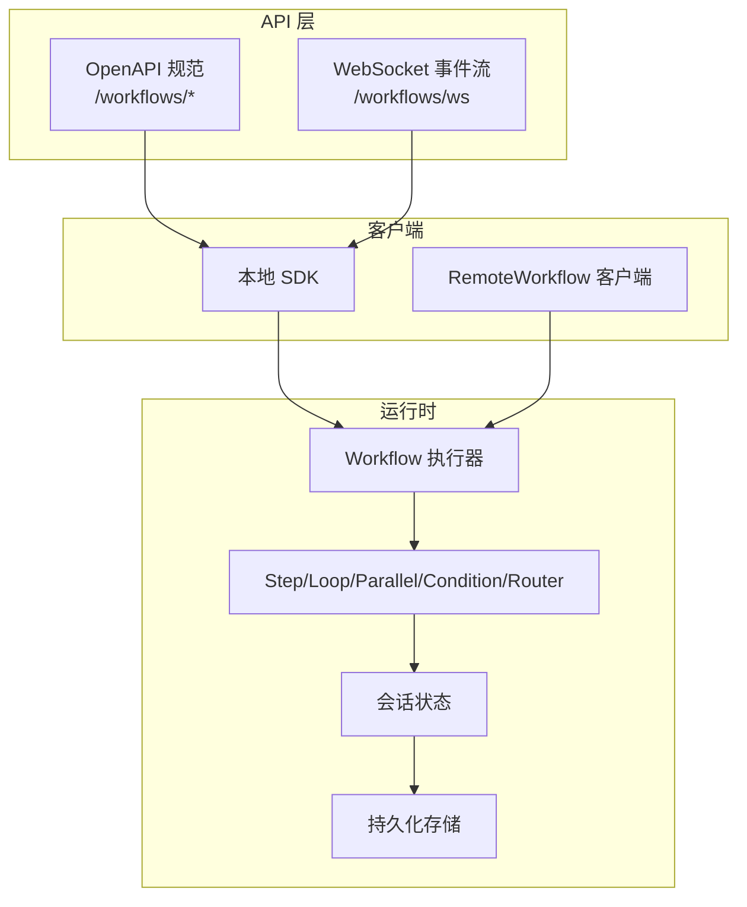
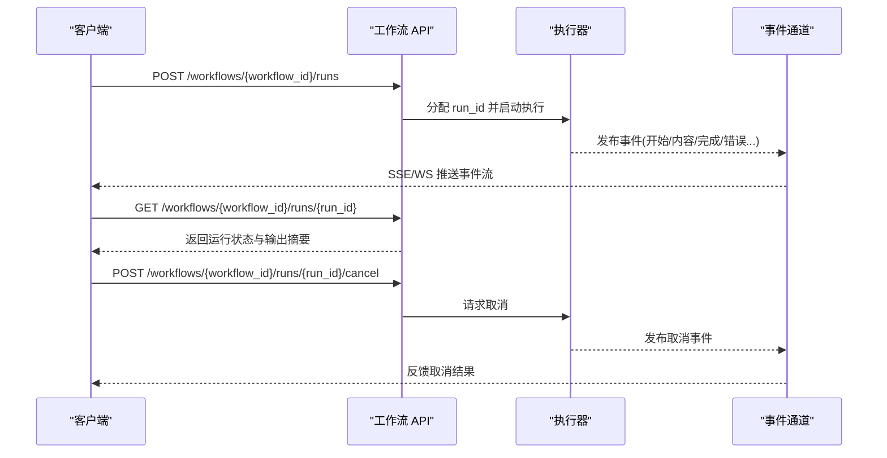
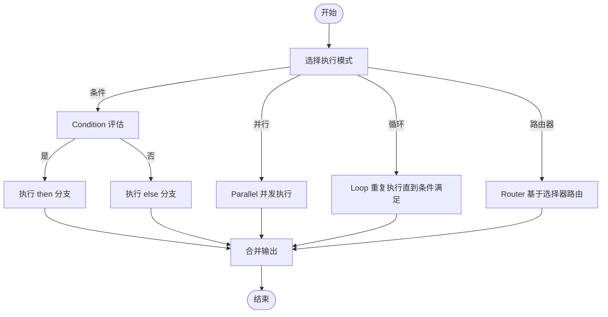
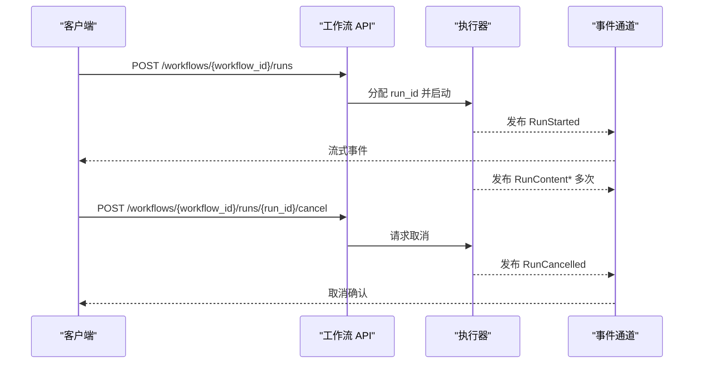
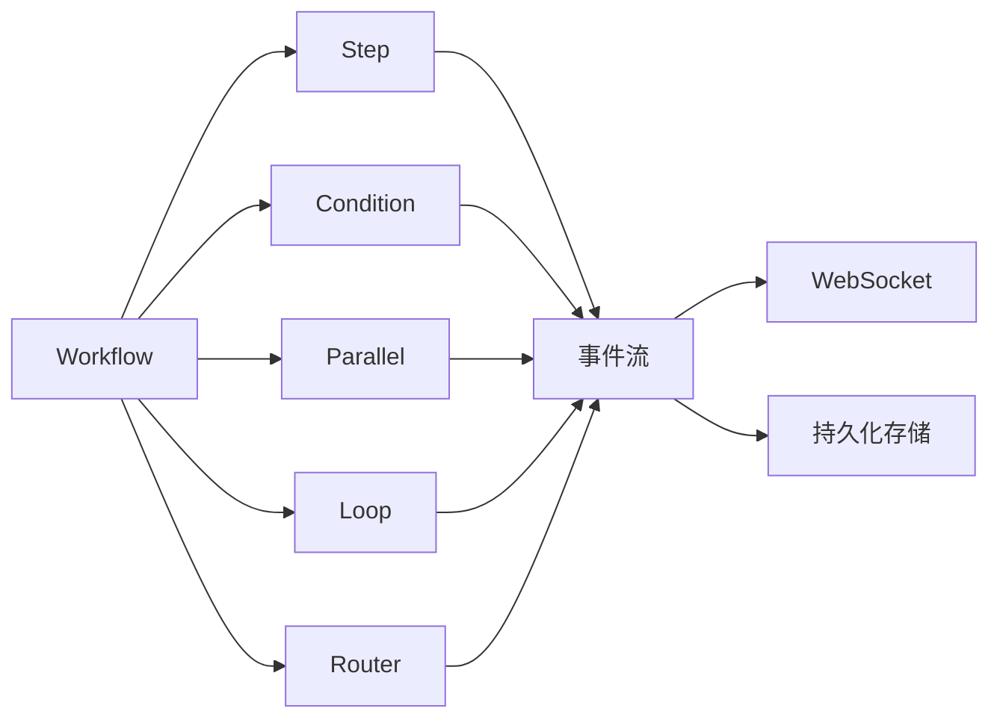

# 工作流 API

<cite>
**本文引用的文件**
- [reference-api/openapi.yaml](file://reference-api/openapi.yaml)
- [reference-api/schema/workflows/execute-workflow.mdx](file://reference-api/schema/workflows/execute-workflow.mdx)
- [reference-api/schema/workflows/get-workflow-run.mdx](file://reference-api/schema/workflows/get-workflow-run.mdx)
- [reference-api/schema/workflows/cancel-workflow-run.mdx](file://reference-api/schema/workflows/cancel-workflow-run.mdx)
- [reference-api/schema/workflows/list-all-workflows.mdx](file://reference-api/schema/workflows/list-all-workflows.mdx)
- [reference-api/schema/workflows/get-workflow-details.mdx](file://reference-api/schema/workflows/get-workflow-details.mdx)
- [workflows/building-workflows.mdx](file://workflows/building-workflows.mdx)
- [workflows/running-workflows.mdx](file://workflows/running-workflows.mdx)
- [workflows/hitl/error-handling.mdx](file://workflows/hitl/error-handling.mdx)
- [state/workflows/overview.mdx](file://state/workflows/overview.mdx)
- [sessions/workflow-sessions.mdx](file://sessions/workflow-sessions.mdx)
- [agent-os/remote-execution/remote-workflow.mdx](file://agent-os/remote-execution/remote-workflow.mdx)
- [reference/workflows/remote-workflow.mdx](file://reference/workflows/remote-workflow.mdx)
- [examples/workflows/advanced-concepts/run-control/cancel-run.mdx](file://examples/workflows/advanced-concepts/run-control/cancel-run.mdx)
- [workflows/usage/workflow-cancellation.mdx](file://workflows/usage/workflow-cancellation.mdx)
- [run-cancellation/workflow-cancel-run.mdx](file://run-cancellation/workflow-cancel-run.mdx)
- [examples/workflows/advanced-concepts/long-running/websocket-reconnect.mdx](file://examples/workflows/advanced-concepts/long-running/websocket-reconnect.mdx)
- [examples/workflows/advanced-concepts/long-running/events-replay.mdx](file://examples/workflows/advanced-concepts/long-running/events-replay.mdx)
- [examples/workflows/advanced-concepts/run-control/metrics.mdx](file://examples/workflows/advanced-concepts/run-control/metrics.mdx)
- [workflows/workflow-patterns/advanced-workflow-patterns.mdx](file://workflows/workflow-patterns/advanced-workflow-patterns.mdx)
</cite>

## 目录
1. [简介](#简介)
2. [项目结构](#项目结构)
3. [核心组件](#核心组件)
4. [架构总览](#架构总览)
5. [详细组件分析](#详细组件分析)
6. [依赖分析](#依赖分析)
7. [性能考虑](#性能考虑)
8. [故障排查指南](#故障排查指南)
9. [结论](#结论)
10. [附录](#附录)

## 简介
本文件系统性梳理工作流 API 的定义、创建与管理接口，覆盖步骤配置（条件、并行、循环、路由器）、依赖关系与执行计划；详述运行期 API（启动、暂停、恢复、取消）；解释步骤 API 的使用方法与事件模型；文档化输出 API（结果获取、状态查询、错误处理）；提供会话 API 的状态跟踪与历史记录能力；解释远程工作流 API 的集成与分布式执行支持；并给出调试、监控与性能优化建议。

## 项目结构
围绕工作流 API 的文档分布在以下区域：
- OpenAPI 规范：统一的 REST API 描述，包含工作流相关端点与通用响应模型
- 工作流构建与运行：概念与模式说明，事件类型与运行控制
- 运行控制与取消：示例与参考，涵盖取消、重连与事件回放
- 会话与状态：工作流会话状态共享与持久化
- 远程执行：远程工作流客户端与协议支持
- 调试与监控：指标采集与事件存储

图示来源
- [reference-api/openapi.yaml](file://reference-api/openapi.yaml)
- [workflows/building-workflows.mdx](file://workflows/building-workflows.mdx)
- [state/workflows/overview.mdx](file://state/workflows/overview.mdx)

章节来源
- [reference-api/openapi.yaml](file://reference-api/openapi.yaml)
- [workflows/building-workflows.mdx](file://workflows/building-workflows.mdx)
- [state/workflows/overview.mdx](file://state/workflows/overview.mdx)

## 核心组件
- 工作流（Workflow）：顶层编排器，负责管理执行流程与步骤拓扑
- 步骤（Step）：最小可执行单元，封装一个执行器（Agent/Team/函数）
- 条件（Condition）：基于评估器选择性执行分支
- 并行（Parallel）：并发执行多个子步骤并将输出合并
- 循环（Loop）：在满足条件前重复执行一组步骤
- 路由器（Router）：根据选择器动态决定下一步骤集合
- 会话状态（Session State）：跨步骤、跨组件共享与持久化的数据容器
- 运行（Run）：一次工作流实例的执行，包含事件流与指标
- 取消/重连/事件回放：运行期控制与长连接事件订阅

章节来源
- [workflows/building-workflows.mdx](file://workflows/building-workflows.mdx)
- [state/workflows/overview.mdx](file://state/workflows/overview.mdx)

## 架构总览
工作流 API 的关键交互路径：
- 定义与注册：通过 SDK 或远程客户端注册工作流与步骤
- 启动运行：POST /workflows/{workflow_id}/runs 创建运行，支持流式返回
- 查询状态：GET /workflows/{workflow_id}/runs/{run_id} 获取运行详情
- 取消运行：POST /workflows/{workflow_id}/runs/{run_id}/cancel 触发取消
- 列举工作流：GET /workflows 获取可用工作流列表
- 获取详情：GET /workflows/{workflow_id} 获取工作流配置
- 长连接事件：WebSocket /workflows/ws 订阅事件回放与重连
- 会话与历史：通过会话状态与历史开关实现状态跟踪与历史记录

图示来源
- [reference-api/schema/workflows/execute-workflow.mdx](file://reference-api/schema/workflows/execute-workflow.mdx)
- [reference-api/schema/workflows/get-workflow-run.mdx](file://reference-api/schema/workflows/get-workflow-run.mdx)
- [reference-api/schema/workflows/cancel-workflow-run.mdx](file://reference-api/schema/workflows/cancel-workflow-run.mdx)
- [examples/workflows/advanced-concepts/long-running/websocket-reconnect.mdx](file://examples/workflows/advanced-concepts/long-running/websocket-reconnect.mdx)

## 详细组件分析

### 工作流定义与管理 API
- 列举工作流
  - 方法与路径：GET /workflows
  - 用途：获取当前 OS 实例中已注册的工作流清单
- 获取工作流详情
  - 方法与路径：GET /workflows/{workflow_id}
  - 用途：获取工作流配置（名称、描述、步骤拓扑等）
- 启动工作流运行
  - 方法与路径：POST /workflows/{workflow_id}/runs
  - 用途：创建并启动一次运行，支持流式事件推送
- 获取运行详情
  - 方法与路径：GET /workflows/{workflow_id}/runs/{run_id}
  - 用途：轮询或查询运行状态与最终输出
- 取消运行
  - 方法与路径：POST /workflows/{workflow_id}/runs/{run_id}/cancel
  - 用途：请求取消正在执行的运行

章节来源
- [reference-api/schema/workflows/list-all-workflows.mdx](file://reference-api/schema/workflows/list-all-workflows.mdx)
- [reference-api/schema/workflows/get-workflow-details.mdx](file://reference-api/schema/workflows/get-workflow-details.mdx)
- [reference-api/schema/workflows/execute-workflow.mdx](file://reference-api/schema/workflows/execute-workflow.mdx)
- [reference-api/schema/workflows/get-workflow-run.mdx](file://reference-api/schema/workflows/get-workflow-run.mdx)
- [reference-api/schema/workflows/cancel-workflow-run.mdx](file://reference-api/schema/workflows/cancel-workflow-run.mdx)

### 步骤配置与执行计划
- 步骤（Step）：封装单个执行器（Agent/Team/函数），作为最小执行单元
- 条件（Condition）：基于评估器选择性执行
- 并行（Parallel）：并发执行多个子步骤，合并输出
- 循环（Loop）：在满足结束条件前重复执行一组步骤
- 路由器（Router）：根据选择器动态路由到下一步骤集合
- 依赖关系：通过步骤顺序与条件/路由器表达依赖；并行内部步骤间无强依赖但需注意输出合并策略
- 执行计划：由步骤拓扑决定，支持复杂组合（条件+并行、循环+路由器等）

图示来源
- [workflows/building-workflows.mdx](file://workflows/building-workflows.mdx)
- [workflows/workflow-patterns/advanced-workflow-patterns.mdx](file://workflows/workflow-patterns/advanced-workflow-patterns.mdx)

章节来源
- [workflows/building-workflows.mdx](file://workflows/building-workflows.mdx)
- [workflows/workflow-patterns/advanced-workflow-patterns.mdx](file://workflows/workflow-patterns/advanced-workflow-patterns.mdx)

### 运行 API：启动、暂停、恢复、取消
- 启动运行
  - 流式启动：POST /workflows/{workflow_id}/runs 支持流式事件
  - 非流式启动：返回运行摘要，后续轮询
- 暂停与恢复
  - 暂停：当出现需要人工干预的错误或等待外部输入时，运行进入暂停
  - 恢复：提供工具结果或管理员审批后继续运行
- 取消
  - 异步取消：POST /workflows/{workflow_id}/runs/{run_id}/cancel
  - 取消事件：通过事件流反馈取消状态
  - 示例参考：取消运行示例、取消运行用法、远程工作流取消

图示来源
- [reference-api/schema/workflows/execute-workflow.mdx](file://reference-api/schema/workflows/execute-workflow.mdx)
- [reference-api/schema/workflows/cancel-workflow-run.mdx](file://reference-api/schema/workflows/cancel-workflow-run.mdx)
- [examples/workflows/advanced-concepts/run-control/cancel-run.mdx](file://examples/workflows/advanced-concepts/run-control/cancel-run.mdx)
- [workflows/usage/workflow-cancellation.mdx](file://workflows/usage/workflow-cancellation.mdx)
- [run-cancellation/workflow-cancel-run.mdx](file://run-cancellation/workflow-cancel-run.mdx)

章节来源
- [workflows/running-workflows.mdx](file://workflows/running-workflows.mdx)
- [workflows/hitl/error-handling.mdx](file://workflows/hitl/error-handling.mdx)
- [examples/workflows/advanced-concepts/run-control/cancel-run.mdx](file://examples/workflows/advanced-concepts/run-control/cancel-run.mdx)
- [workflows/usage/workflow-cancellation.mdx](file://workflows/usage/workflow-cancellation.mdx)
- [run-cancellation/workflow-cancel-run.mdx](file://run-cancellation/workflow-cancel-run.mdx)

### 步骤 API 使用方法
- 条件步骤（Condition）
  - 通过评估器决定是否执行某一分支
  - 适合按输入特征或中间结果进行分流
- 并行步骤（Parallel）
  - 并发执行多个子步骤，合并输出
  - 注意输出合并策略与资源竞争
- 循环步骤（Loop）
  - 在满足结束条件前重复执行
  - 可设置最大迭代次数与质量检查
- 路由器步骤（Router）
  - 基于选择器动态路由到不同步骤集合
  - 适合复杂分支与自适应路径

章节来源
- [workflows/building-workflows.mdx](file://workflows/building-workflows.mdx)
- [workflows/running-workflows.mdx](file://workflows/running-workflows.mdx)

### 输出 API：结果获取、状态查询与错误处理
- 结果获取
  - 流式：通过 SSE/WS 事件逐步接收 RunContent
  - 非流式：GET /workflows/{workflow_id}/runs/{run_id} 获取最终输出
- 状态查询
  - 轮询运行状态，结合事件流判断完成/错误/取消
- 错误处理
  - OnError 选项：fail/skip/pause
  - ErrorRequirement：失败步骤的错误信息与重试计数
  - 提供 retry()/skip() 方法进行交互式处理

章节来源
- [workflows/running-workflows.mdx](file://workflows/running-workflows.mdx)
- [workflows/hitl/error-handling.mdx](file://workflows/hitl/error-handling.mdx)

### 会话 API：状态跟踪与历史记录
- 会话状态
  - 初始化：在创建工作流时注入初始状态
  - 共享：所有步骤、Agent、Team、自定义函数均可读写
  - 持久化：数据库可用时自动持久化并在后续运行加载
- 历史记录
  - 可为单步启用历史，或为全工作流启用
  - 在自定义函数中访问历史以进行分析与上下文增强

章节来源
- [state/workflows/overview.mdx](file://state/workflows/overview.mdx)
- [sessions/workflow-sessions.mdx](file://sessions/workflow-sessions.mdx)

### 远程工作流 API：集成与分布式执行
- 远程客户端
  - RemoteWorkflow：连接远端 AgentOS 实例上的工作流
  - 支持非流式与流式调用
  - 支持取消运行
- 协议支持
  - 默认 HTTP 接口
  - A2A 协议：兼容其他框架的 A2A 服务器
- 示例
  - 远程工作流示例：展示如何连接与运行远端工作流
  - 参考文档：参数、返回值与协议选项

章节来源
- [agent-os/remote-execution/remote-workflow.mdx](file://agent-os/remote-execution/remote-workflow.mdx)
- [reference/workflows/remote-workflow.mdx](file://reference/workflows/remote-workflow.mdx)
- [examples/workflows/advanced-concepts/run-control/remote-workflow.mdx](file://examples/workflows/advanced-concepts/run-control/remote-workflow.mdx)

### 调试、监控与性能优化 API
- 事件回放与重连
  - WebSocket /workflows/ws：支持断线重连与事件索引续传
  - 事件回放：测试与验证事件完整性
- 指标与度量
  - 运行级指标：总耗时、Token 数等
  - 步骤级指标：每个步骤的耗时与 Token 统计
- 事件存储
  - 本地保存最近一次运行的事件，便于离线分析

章节来源
- [examples/workflows/advanced-concepts/long-running/websocket-reconnect.mdx](file://examples/workflows/advanced-concepts/long-running/websocket-reconnect.mdx)
- [examples/workflows/advanced-concepts/long-running/events-replay.mdx](file://examples/workflows/advanced-concepts/long-running/events-replay.mdx)
- [examples/workflows/advanced-concepts/run-control/metrics.mdx](file://examples/workflows/advanced-concepts/run-control/metrics.mdx)

## 依赖分析
- 组件耦合
  - Workflow 对 Step/Condition/Parallel/Loop/Router 的组合依赖
  - 运行期对事件通道与存储的依赖
- 外部依赖
  - 远端 AgentOS 或 A2A 服务
  - WebSocket 事件通道
- 运行事件类型
  - 并行/条件/循环/路由器均有对应的开始与完成事件，便于可观测性

图示来源
- [workflows/running-workflows.mdx](file://workflows/running-workflows.mdx)
- [reference-api/openapi.yaml](file://reference-api/openapi.yaml)

章节来源
- [workflows/running-workflows.mdx](file://workflows/running-workflows.mdx)
- [reference-api/openapi.yaml](file://reference-api/openapi.yaml)

## 性能考虑
- 并行执行提升吞吐，但需关注资源竞争与输出合并成本
- 循环执行应设置合理的结束条件与最大迭代次数，避免无限循环
- 使用事件回放与指标采集定位热点步骤，优化耗时较长的步骤
- 远程工作流建议使用流式接口与断线重连，减少网络抖动影响

## 故障排查指南
- 取消无效或延迟
  - 检查运行状态是否仍在处理不可中断的操作
  - 确认取消事件是否正确发布与消费
- 事件丢失或断连
  - 使用 WebSocket 重连与事件索引续传
  - 启用事件回放验证完整性
- 错误处理
  - 使用 OnError.pause 获取 ErrorRequirement，手动 retry()/skip()
  - 查看错误类型与重试计数，定位根因

章节来源
- [examples/workflows/advanced-concepts/long-running/websocket-reconnect.mdx](file://examples/workflows/advanced-concepts/long-running/websocket-reconnect.mdx)
- [workflows/hitl/error-handling.mdx](file://workflows/hitl/error-handling.mdx)
- [run-cancellation/workflow-cancel-run.mdx](file://run-cancellation/workflow-cancel-run.mdx)

## 结论
工作流 API 提供了从定义、执行到监控与取消的完整闭环。通过条件、并行、循环与路由器等构建块，可以灵活表达复杂的业务流程；配合会话状态与历史记录，实现跨步骤的状态共享与审计；借助远程执行与事件通道，支持分布式与长连接场景；结合指标与事件回放，实现可观测与性能优化。

## 附录
- OpenAPI 规范：参考完整端点与响应模型
- 示例与参考：取消运行、远程工作流、事件回放与指标采集

章节来源
- [reference-api/openapi.yaml](file://reference-api/openapi.yaml)
- [examples/workflows/advanced-concepts/run-control/cancel-run.mdx](file://examples/workflows/advanced-concepts/run-control/cancel-run.mdx)
- [examples/workflows/advanced-concepts/long-running/events-replay.mdx](file://examples/workflows/advanced-concepts/long-running/events-replay.mdx)
- [examples/workflows/advanced-concepts/run-control/metrics.mdx](file://examples/workflows/advanced-concepts/run-control/metrics.mdx)