# 工具 API

<cite>
**本文引用的文件**
- [decorator.mdx](file://reference/tools/decorator.mdx)
- [toolkit.mdx](file://reference/tools/toolkit.mdx)
- [hooks.mdx](file://tools/hooks.mdx)
- [retry-agent-run.mdx](file://reference/tools/retry-agent-run.mdx)
- [stop-agent-run.mdx](file://reference/tools/stop-agent-run.mdx)
- [tool-hooks.mdx](file://cookbook/tools/tool-hooks.mdx)
- [tool-hook-in-toolkit.mdx](file://examples/tools/tool-hooks/tool-hook-in-toolkit.mdx)
- [retry-tool-call.mdx](file://examples/tools/exceptions/retry-tool-call.mdx)
- [retry-tool-call-from-post-hook.mdx](file://examples/tools/exceptions/retry-tool-call-from-post-hook.mdx)
- [cancel-run.mdx](file://examples/workflows/advanced-concepts/run-control/cancel-run.mdx)
- [cel-session-state.mdx](file://examples/workflows/cel-expressions/condition/cel-session-state.mdx)
- [user-confirmation.mdx](file://hitl/user-confirmation.mdx)
</cite>

## 目录
1. [简介](#简介)
2. [项目结构](#项目结构)
3. [核心组件](#核心组件)
4. [架构总览](#架构总览)
5. [详细组件分析](#详细组件分析)
6. [依赖关系分析](#依赖关系分析)
7. [性能考量](#性能考量)
8. [故障排查指南](#故障排查指南)
9. [结论](#结论)
10. [附录](#附录)

## 简介
本文件系统性梳理工具 API 的设计与实现，覆盖以下主题：
- 工具注册与管理：函数式工具、类式工具包（Toolkit）及其过滤、缓存与执行控制
- 工具装饰器 API：工具包装、元数据配置（名称、描述、确认、用户输入）、生命周期钩子（pre/post）、缓存与外部执行
- 重试与停止 API：在工具执行中触发模型迭代重试（RetryAgentRun）与退出工具循环（StopAgentRun）
- 停止与取消：异步运行控制、会话状态与资源清理
- 工具包 API：批量工具管理、工具组合与嵌套工具包的钩子传播
- 钩子与中间件：全局与局部工具钩子、工具包级钩子、状态化钩子
- 性能监控与统计：日志钩子、耗时统计、会话状态驱动的重试策略

## 项目结构
围绕工具 API 的文档分布在多个区域：
- 参考与规范：decorator、toolkit、hooks、retry/stop 异常
- 示例与食谱：工具钩子、重试与停止、取消运行、会话状态驱动的重试
- 人机交互（HITL）：工具确认与用户输入

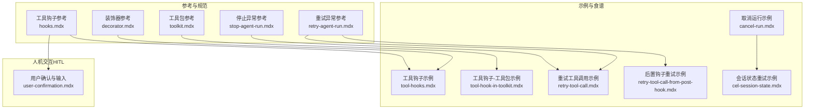

**图表来源**
- [decorator.mdx](file://reference/tools/decorator.mdx)
- [toolkit.mdx](file://reference/tools/toolkit.mdx)
- [hooks.mdx](file://tools/hooks.mdx)
- [retry-agent-run.mdx](file://reference/tools/retry-agent-run.mdx)
- [stop-agent-run.mdx](file://reference/tools/stop-agent-run.mdx)
- [tool-hooks.mdx](file://cookbook/tools/tool-hooks.mdx)
- [tool-hook-in-toolkit.mdx](file://examples/tools/tool-hooks/tool-hook-in-toolkit.mdx)
- [retry-tool-call.mdx](file://examples/tools/exceptions/retry-tool-call.mdx)
- [retry-tool-call-from-post-hook.mdx](file://examples/tools/exceptions/retry-tool-call-from-post-hook.mdx)
- [cancel-run.mdx](file://examples/workflows/advanced-concepts/run-control/cancel-run.mdx)
- [cel-session-state.mdx](file://examples/workflows/cel-expressions/condition/cel-session-state.mdx)
- [user-confirmation.mdx](file://hitl/user-confirmation.mdx)

**章节来源**
- [decorator.mdx](file://reference/tools/decorator.mdx)
- [toolkit.mdx](file://reference/tools/toolkit.mdx)
- [hooks.mdx](file://tools/hooks.mdx)
- [tool-hooks.mdx](file://cookbook/tools/tool-hooks.mdx)
- [tool-hook-in-toolkit.mdx](file://examples/tools/tool-hooks/tool-hook-in-toolkit.mdx)
- [retry-tool-call.mdx](file://examples/tools/exceptions/retry-tool-call.mdx)
- [retry-tool-call-from-post-hook.mdx](file://examples/tools/exceptions/retry-tool-call-from-post-hook.mdx)
- [cancel-run.mdx](file://examples/workflows/advanced-concepts/run-control/cancel-run.mdx)
- [cel-session-state.mdx](file://examples/workflows/cel-expressions/condition/cel-session-state.mdx)
- [user-confirmation.mdx](file://hitl/user-confirmation.mdx)

## 核心组件
- 工具装饰器（@tool）：为函数提供元数据、确认、用户输入、钩子、缓存、外部执行等能力
- 工具包（Toolkit）：对一组工具进行分组、筛选、指令注入、缓存与批量控制
- 工具钩子（pre/post）：在工具调用前后执行自定义逻辑（日志、校验、转换、限流、审计）
- 重试与停止异常：在工具执行中向模型反馈并引导其重试（RetryAgentRun），或退出工具循环（StopAgentRun）
- 运行控制与取消：工作流/团队/代理的运行取消、状态保存与资源清理
- 会话状态与重试策略：通过会话状态驱动的条件表达式实现可控重试

**章节来源**
- [decorator.mdx](file://reference/tools/decorator.mdx)
- [toolkit.mdx](file://reference/tools/toolkit.mdx)
- [hooks.mdx](file://tools/hooks.mdx)
- [retry-agent-run.mdx](file://reference/tools/retry-agent-run.mdx)
- [stop-agent-run.mdx](file://reference/tools/stop-agent-run.mdx)

## 架构总览
工具 API 的执行链路从“代理/团队”发起，经“工具选择与过滤”，进入“钩子与装饰器”的预处理，再执行“工具函数”，最后由“重试/停止异常”与“运行控制”决定流程走向。

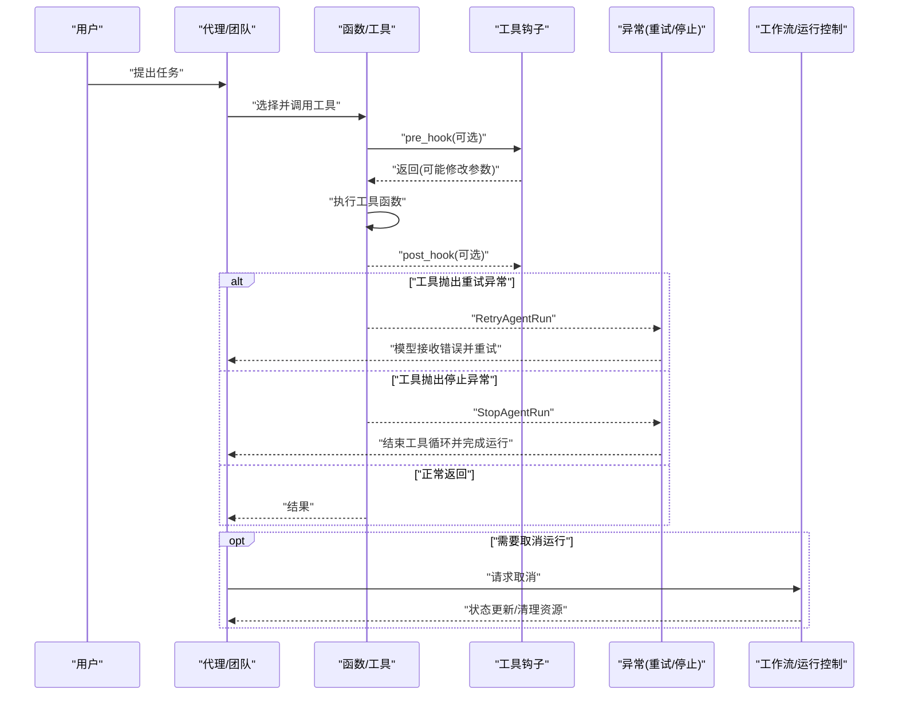

**图表来源**
- [hooks.mdx](file://tools/hooks.mdx)
- [retry-agent-run.mdx](file://reference/tools/retry-agent-run.mdx)
- [stop-agent-run.mdx](file://reference/tools/stop-agent-run.mdx)
- [cancel-run.mdx](file://examples/workflows/advanced-concepts/run-control/cancel-run.mdx)

## 详细组件分析

### 工具装饰器 API
- 元数据与行为控制
  - 名称与描述覆盖、是否在工具调用后停止、是否需要用户确认/输入、是否外部执行
  - 钩子集成：支持 pre_hook、post_hook 以及工具级 tool_hooks 列表
  - 缓存：启用内存/文件缓存及 TTL
- 使用方式
  - 函数级装饰：直接修饰函数
  - 类方法级装饰：对类方法生效
  - 与 Agent/Team 注入：作为工具列表的一部分参与执行

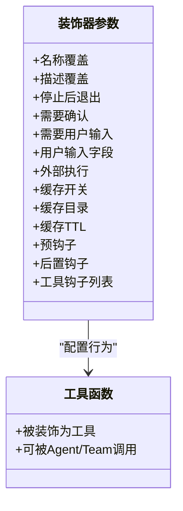

**图表来源**
- [decorator.mdx](file://reference/tools/decorator.mdx)

**章节来源**
- [decorator.mdx](file://reference/tools/decorator.mdx)

### 工具包 API（Toolkit）
- 组织与管理
  - 将多个工具函数封装为一个集合，支持自动/手动注册
  - 指令注入：将工具包说明注入到代理上下文
  - 包含/排除工具：按名称白名单/黑名单过滤
  - 控制属性：为工具设置“需要确认”“外部执行”“调用后停止”“显示结果”等
- 缓存与 TTL：支持内存缓存与文件缓存
- 钩子传播：父工具包的钩子可传播至子工具包

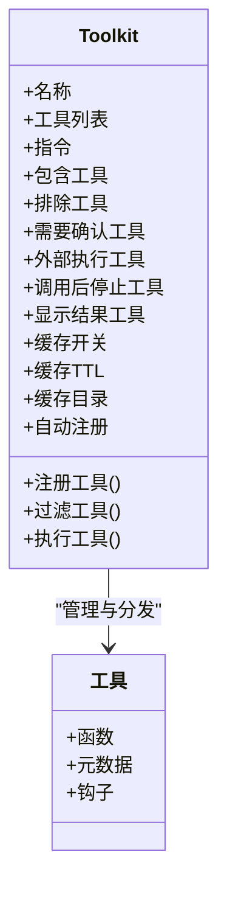

**图表来源**
- [toolkit.mdx](file://reference/tools/toolkit.mdx)

**章节来源**
- [toolkit.mdx](file://reference/tools/toolkit.mdx)
- [tool-hooks.mdx](file://cookbook/tools/tool-hooks.mdx)

### 工具钩子与中间件支持
- 钩子类型
  - 预钩子（pre_hook）：执行前校验、限流、审计、参数转换
  - 后置钩子（post_hook）：结果转换、二次校验、错误处理、重试触发
  - 工具钩子（tool_hooks）：全局/局部钩子链，按顺序执行
- 状态化钩子：访问 RunContext 获取会话状态、依赖与元数据
- 工具包钩子：父工具包钩子可传播到子工具包，形成“中间件”式控制

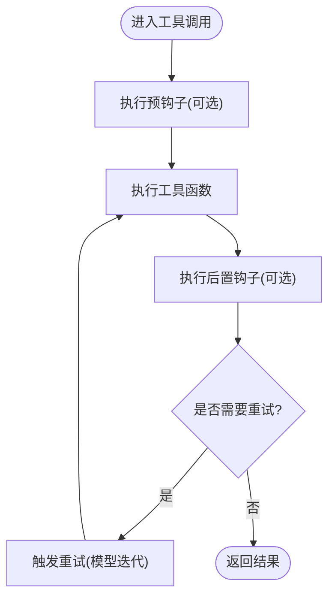

**图表来源**
- [hooks.mdx](file://tools/hooks.mdx)
- [tool-hooks.mdx](file://cookbook/tools/tool-hooks.mdx)
- [tool-hook-in-toolkit.mdx](file://examples/tools/tool-hooks/tool-hook-in-toolkit.mdx)

**章节来源**
- [hooks.mdx](file://tools/hooks.mdx)
- [tool-hooks.mdx](file://cookbook/tools/tool-hooks.mdx)
- [tool-hook-in-toolkit.mdx](file://examples/tools/tool-hooks/tool-hook-in-toolkit.mdx)

### 工具重试机制 API
- RetryAgentRun：在工具调用循环内向模型提供反馈并引导其重试，不中断整次运行
  - 参数：错误消息、用户消息、代理消息、历史消息
  - 行为：将错误注入工具调用结果，模型在下一次调用中调整策略
- 适用场景：输入校验失败、状态未满足、业务条件不满足、迭代优化
- 示例：在工具中根据会话状态不足抛出异常，提示模型继续添加所需内容

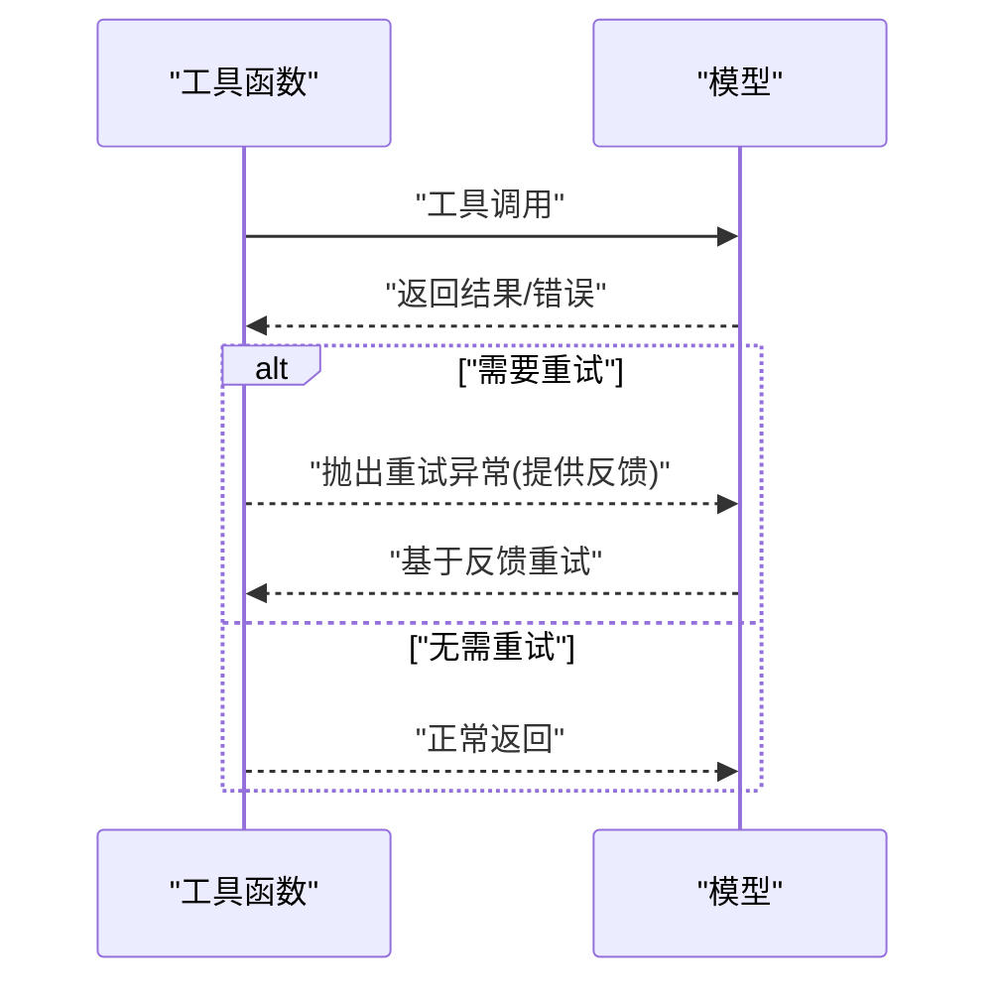

**图表来源**
- [retry-agent-run.mdx](file://reference/tools/retry-agent-run.mdx)
- [retry-tool-call.mdx](file://examples/tools/exceptions/retry-tool-call.mdx)
- [retry-tool-call-from-post-hook.mdx](file://examples/tools/exceptions/retry-tool-call-from-post-hook.mdx)

**章节来源**
- [retry-agent-run.mdx](file://reference/tools/retry-agent-run.mdx)
- [retry-tool-call.mdx](file://examples/tools/exceptions/retry-tool-call.mdx)
- [retry-tool-call-from-post-hook.mdx](file://examples/tools/exceptions/retry-tool-call-from-post-hook.mdx)

### 工具停止与取消 API
- StopAgentRun：退出工具调用循环并完成运行，不取消整次运行
  - 参数：原因、用户消息、代理消息、历史消息
  - 行为：保存会话状态、消息与工具调用历史，设置运行状态为完成
- 取消运行：工作流/团队/代理支持取消，取消后状态更新、资源清理
  - 示例：延时取消、取消后的状态检查与结果输出

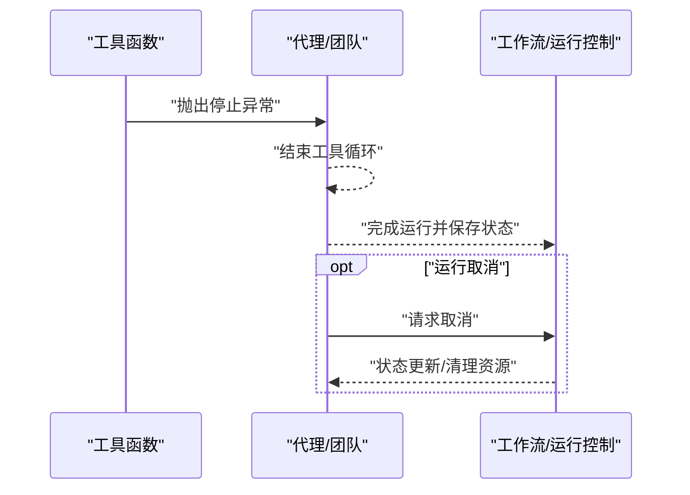

**图表来源**
- [stop-agent-run.mdx](file://reference/tools/stop-agent-run.mdx)
- [cancel-run.mdx](file://examples/workflows/advanced-concepts/run-control/cancel-run.mdx)

**章节来源**
- [stop-agent-run.mdx](file://reference/tools/stop-agent-run.mdx)
- [cancel-run.mdx](file://examples/workflows/advanced-concepts/run-control/cancel-run.mdx)

### 工具包组合与批量管理
- 工具包组合：父工具包可将钩子传播给子工具包，形成“中间件”式控制
- 批量工具管理：通过包含/排除列表、控制属性批量设置工具行为
- 示例：嵌套工具包结构中，父工具包钩子作用于所有子工具包

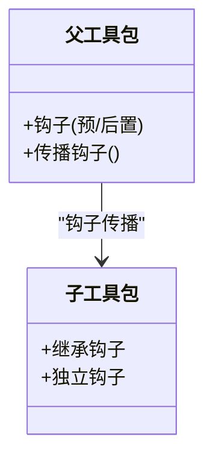

**图表来源**
- [toolkit.mdx](file://reference/tools/toolkit.mdx)
- [tool-hooks.mdx](file://cookbook/tools/tool-hooks.mdx)

**章节来源**
- [toolkit.mdx](file://reference/tools/toolkit.mdx)
- [tool-hooks.mdx](file://cookbook/tools/tool-hooks.mdx)

### 人机交互（HITL）与工具确认
- 工具确认：标记工具需要用户确认后才执行
- 用户输入：标记工具需要用户提供特定字段
- 示例：混合安全与非安全工具，仅对需要确认的工具暂停等待

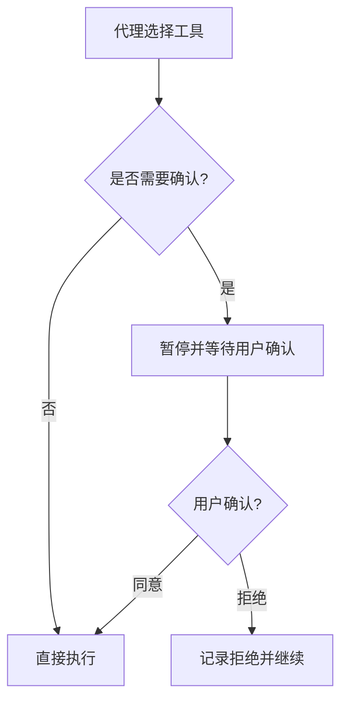

**图表来源**
- [user-confirmation.mdx](file://hitl/user-confirmation.mdx)

**章节来源**
- [user-confirmation.mdx](file://hitl/user-confirmation.mdx)

### 性能监控、使用统计与调试
- 日志钩子：记录工具执行耗时、参数与结果，便于性能分析与调试
- 会话状态驱动的重试：通过会话状态计数器实现可控重试，避免无限循环
- 示例：在后置钩子中触发重试、在工作流中使用条件表达式控制重试上限

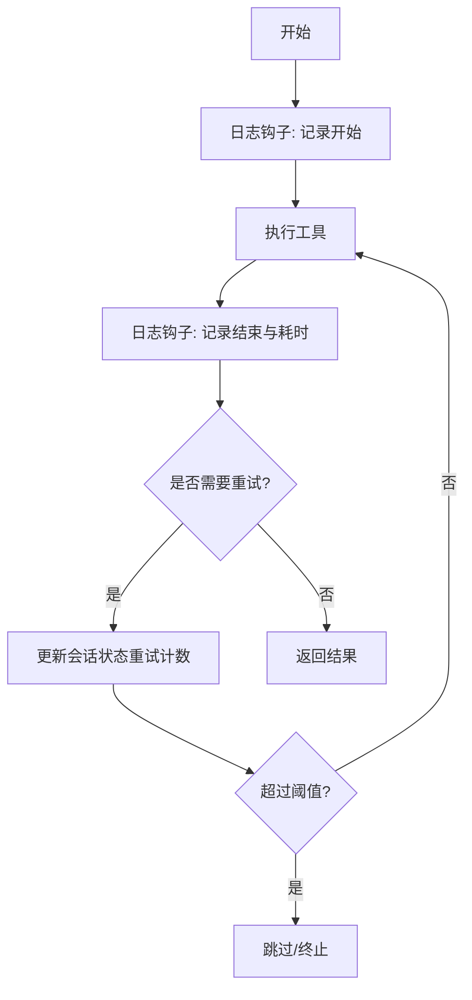

**图表来源**
- [hooks.mdx](file://tools/hooks.mdx)
- [retry-tool-call-from-post-hook.mdx](file://examples/tools/exceptions/retry-tool-call-from-post-hook.mdx)
- [cel-session-state.mdx](file://examples/workflows/cel-expressions/condition/cel-session-state.mdx)

**章节来源**
- [hooks.mdx](file://tools/hooks.mdx)
- [retry-tool-call-from-post-hook.mdx](file://examples/tools/exceptions/retry-tool-call-from-post-hook.mdx)
- [cel-session-state.mdx](file://examples/workflows/cel-expressions/condition/cel-session-state.mdx)

## 依赖关系分析
- 工具装饰器依赖钩子系统以实现预/后置处理与缓存
- 工具包依赖装饰器的元数据与钩子能力，并提供批量控制
- 重试与停止异常依赖运行上下文与会话状态，确保状态持久化
- 取消运行与 HITL 依赖工作流/团队/代理的运行控制接口

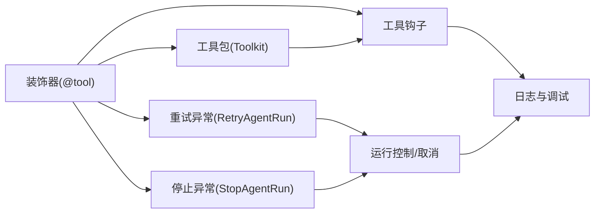

**图表来源**
- [decorator.mdx](file://reference/tools/decorator.mdx)
- [toolkit.mdx](file://reference/tools/toolkit.mdx)
- [hooks.mdx](file://tools/hooks.mdx)
- [retry-agent-run.mdx](file://reference/tools/retry-agent-run.mdx)
- [stop-agent-run.mdx](file://reference/tools/stop-agent-run.mdx)
- [cancel-run.mdx](file://examples/workflows/advanced-concepts/run-control/cancel-run.mdx)

**章节来源**
- [decorator.mdx](file://reference/tools/decorator.mdx)
- [toolkit.mdx](file://reference/tools/toolkit.mdx)
- [hooks.mdx](file://tools/hooks.mdx)
- [retry-agent-run.mdx](file://reference/tools/retry-agent-run.mdx)
- [stop-agent-run.mdx](file://reference/tools/stop-agent-run.mdx)
- [cancel-run.mdx](file://examples/workflows/advanced-concepts/run-control/cancel-run.mdx)

## 性能考量
- 钩子开销：预/后置钩子应尽量轻量，避免阻塞工具执行
- 缓存策略：合理设置 TTL 与缓存目录，平衡一致性与性能
- 重试上限：通过会话状态或条件表达式限制重试次数，防止无限循环
- 异步执行：对于 IO 密集型工具，结合异步支持提升吞吐

## 故障排查指南
- 工具未执行
  - 检查工具是否被包含/排除列表正确配置
  - 确认是否需要用户确认且未提供确认
- 重试无效
  - 确认抛出了正确的重试异常并提供了清晰的反馈消息
  - 检查会话状态是否正确更新
- 停止异常未生效
  - 确认异常抛出位置在工具循环内
  - 检查运行状态是否已保存
- 取消运行无响应
  - 确认运行处于可取消状态，检查取消后的状态与资源清理

**章节来源**
- [retry-tool-call.mdx](file://examples/tools/exceptions/retry-tool-call.mdx)
- [retry-tool-call-from-post-hook.mdx](file://examples/tools/exceptions/retry-tool-call-from-post-hook.mdx)
- [stop-agent-run.mdx](file://reference/tools/stop-agent-run.mdx)
- [cancel-run.mdx](file://examples/workflows/advanced-concepts/run-control/cancel-run.mdx)

## 结论
工具 API 提供了从“工具定义与注册”到“执行控制与生命周期管理”的完整能力：
- 装饰器与工具包统一了工具的元数据、行为与组织方式
- 钩子系统实现了灵活的预/后置处理与中间件式控制
- 重试与停止异常为工具执行提供了可控的反馈与退出机制
- 运行控制与 HITL 支持异步与人机协作场景
- 通过日志钩子与会话状态，实现性能监控与可观察性

## 附录
- 快速参考
  - 装饰器参数：名称、描述、停止后退出、确认/输入、钩子、缓存、外部执行
  - 工具包参数：名称、工具列表、指令、包含/排除、控制属性、缓存
  - 重试异常：提供反馈消息，引导模型在当前运行中重试
  - 停止异常：结束工具循环并完成运行，保存状态与历史
  - 取消运行：延时取消、状态更新与资源清理