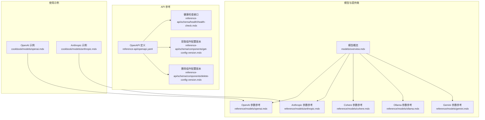
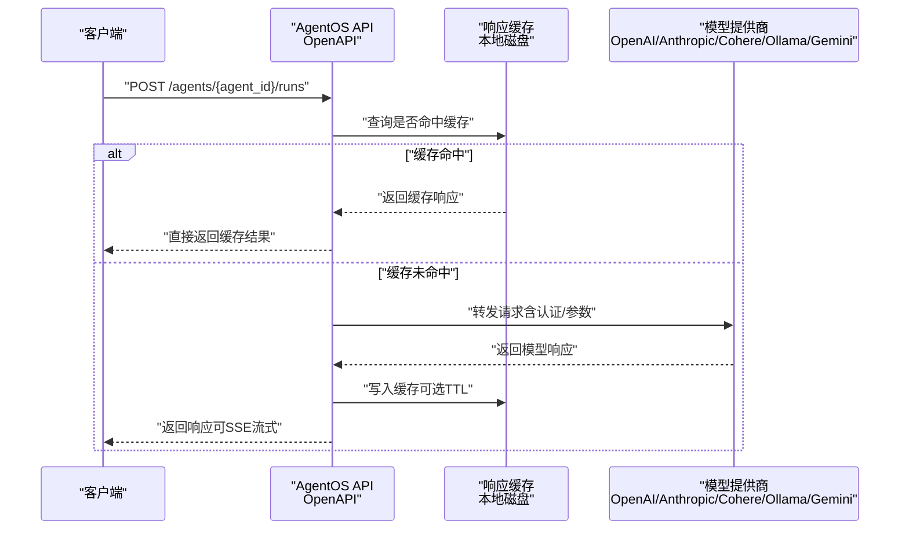
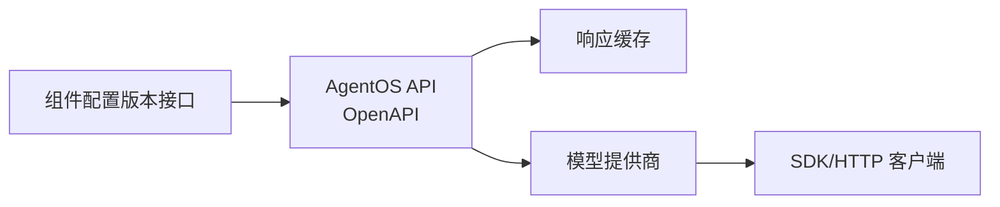

# 模型 API

<cite>
**本文引用的文件**
- [models/overview.mdx](file://models/overview.mdx)
- [models/cache-response.mdx](file://models/cache-response.mdx)
- [models/providers/native/openai/completion/usage/cache-response.mdx](file://models/providers/native/openai/completion/usage/cache-response.mdx)
- [models/providers/native/anthropic/usage/cache-response.mdx](file://models/providers/native/anthropic/usage/cache-response.mdx)
- [reference/models/openai.mdx](file://reference/models/openai.mdx)
- [reference/models/anthropic.mdx](file://reference/models/anthropic.mdx)
- [reference/models/cohere.mdx](file://reference/models/cohere.mdx)
- [reference/models/ollama.mdx](file://reference/models/ollama.mdx)
- [reference/models/gemini.mdx](file://reference/models/gemini.mdx)
- [reference-api/openapi.yaml](file://reference-api/openapi.yaml)
- [reference-api/schema/health/health-check.mdx](file://reference-api/schema/health/health-check.mdx)
- [reference-api/schema/components/get-config-version.mdx](file://reference-api/schema/components/get-config-version.mdx)
- [reference-api/schema/components/delete-config-version.mdx](file://reference-api/schema/components/delete-config-version.mdx)
- [cookbook/models/openai.mdx](file://cookbook/models/openai.mdx)
- [cookbook/models/anthropic.mdx](file://cookbook/models/anthropic.mdx)
</cite>

## 目录
1. [简介](#简介)
2. [项目结构](#项目结构)
3. [核心组件](#核心组件)
4. [架构总览](#架构总览)
5. [详细组件分析](#详细组件分析)
6. [依赖关系分析](#依赖关系分析)
7. [性能考量](#性能考量)
8. [故障排查指南](#故障排查指南)
9. [结论](#结论)
10. [附录](#附录)

## 简介
本文件面向“模型 API”的统一接口设计与使用，覆盖以下目标：
- 统一的模型调用接口：请求格式、参数配置与响应处理
- 多模型提供商集成：认证、速率限制与错误处理策略
- 参数标准化：温度、最大长度、top-p 等超参数的跨提供商标准
- 响应统一格式：文本输出、函数调用与工具使用结果
- 缓存与性能优化：本地响应缓存、提示缓存与 TTL 策略
- 模型切换、版本管理与成本控制：配置版本化与按需降本

## 项目结构
围绕模型 API 的知识分布在以下区域：
- 模型概览与通用能力（错误重试、缓存）
- 各模型提供商参数参考（OpenAI、Anthropic、Cohere、Ollama、Gemini）
- API 参考（OpenAPI）与健康检查、组件配置版本接口
- 使用示例（Cookbook）

图表来源
- [models/overview.mdx:1-62](file://models/overview.mdx#L1-L62)
- [reference/models/openai.mdx:1-53](file://reference/models/openai.mdx#L1-L53)
- [reference/models/anthropic.mdx:1-32](file://reference/models/anthropic.mdx#L1-L32)
- [reference/models/cohere.mdx:1-30](file://reference/models/cohere.mdx#L1-L30)
- [reference/models/ollama.mdx:1-37](file://reference/models/ollama.mdx#L1-L37)
- [reference/models/gemini.mdx:1-27](file://reference/models/gemini.mdx#L1-L27)
- [reference-api/openapi.yaml:1-800](file://reference-api/openapi.yaml#L1-L800)
- [reference-api/schema/health/health-check.mdx:1-3](file://reference-api/schema/health/health-check.mdx#L1-L3)
- [reference-api/schema/components/get-config-version.mdx:1-3](file://reference-api/schema/components/get-config-version.mdx#L1-L3)
- [reference-api/schema/components/delete-config-version.mdx:1-3](file://reference-api/schema/components/delete-config-version.mdx#L1-L3)
- [cookbook/models/openai.mdx:1-107](file://cookbook/models/openai.mdx#L1-L107)
- [cookbook/models/anthropic.mdx:1-112](file://cookbook/models/anthropic.mdx#L1-L112)

章节来源
- [models/overview.mdx:1-62](file://models/overview.mdx#L1-L62)
- [reference/models/openai.mdx:1-53](file://reference/models/openai.mdx#L1-L53)
- [reference/models/anthropic.mdx:1-32](file://reference/models/anthropic.mdx#L1-L32)
- [reference/models/cohere.mdx:1-30](file://reference/models/cohere.mdx#L1-L30)
- [reference/models/ollama.mdx:1-37](file://reference/models/ollama.mdx#L1-L37)
- [reference/models/gemini.mdx:1-27](file://reference/models/gemini.mdx#L1-L27)
- [reference-api/openapi.yaml:1-800](file://reference-api/openapi.yaml#L1-L800)
- [reference-api/schema/health/health-check.mdx:1-3](file://reference-api/schema/health/health-check.mdx#L1-L3)
- [reference-api/schema/components/get-config-version.mdx:1-3](file://reference-api/schema/components/get-config-version.mdx#L1-L3)
- [reference-api/schema/components/delete-config-version.mdx:1-3](file://reference-api/schema/components/delete-config-version.mdx#L1-L3)
- [cookbook/models/openai.mdx:1-107](file://cookbook/models/openai.mdx#L1-L107)
- [cookbook/models/anthropic.mdx:1-112](file://cookbook/models/anthropic.mdx#L1-L112)

## 核心组件
- 统一模型接口
  - 请求参数：消息列表、系统提示、工具、响应格式、流式开关等
  - 超参数：温度、最大生成长度、top-p、top-k、频率/存在惩罚、停止序列等
  - 认证：各提供商的 API Key 或基础 URL 配置
  - 错误处理：重试次数、重试间隔、指数退避
- 响应处理
  - 文本内容、工具调用对象、分片事件（SSE）、元数据与指标
- 缓存与成本优化
  - 本地响应缓存（磁盘持久化、TTL）
  - 提示缓存（由提供商侧支持）
- 版本与切换
  - 组件配置版本化管理（获取/删除）
  - 模型字符串与类实例两种配置方式

章节来源
- [models/overview.mdx:29-44](file://models/overview.mdx#L29-L44)
- [models/cache-response.mdx:16-45](file://models/cache-response.mdx#L16-L45)
- [reference/models/openai.mdx:10-53](file://reference/models/openai.mdx#L10-L53)
- [reference/models/anthropic.mdx:10-32](file://reference/models/anthropic.mdx#L10-L32)
- [reference/models/cohere.mdx:10-30](file://reference/models/cohere.mdx#L10-L30)
- [reference/models/ollama.mdx:21-37](file://reference/models/ollama.mdx#L21-L37)
- [reference/models/gemini.mdx:10-27](file://reference/models/gemini.mdx#L10-L27)
- [reference-api/schema/components/get-config-version.mdx:1-3](file://reference-api/schema/components/get-config-version.mdx#L1-L3)
- [reference-api/schema/components/delete-config-version.mdx:1-3](file://reference-api/schema/components/delete-config-version.mdx#L1-L3)

## 架构总览
下图展示从客户端到模型提供商的整体调用链路，以及缓存与版本管理的集成点。

图表来源
- [reference-api/openapi.yaml:193-270](file://reference-api/openapi.yaml#L193-L270)
- [models/cache-response.mdx:35-45](file://models/cache-response.mdx#L35-L45)

章节来源
- [reference-api/openapi.yaml:193-270](file://reference-api/openapi.yaml#L193-L270)
- [models/cache-response.mdx:16-45](file://models/cache-response.mdx#L16-L45)

## 详细组件分析

### 统一请求与响应接口
- 请求体字段
  - 消息数组（含角色、内容、附件等）
  - 工具清单与工具调用策略
  - 流式开关与事件类型
  - 响应格式（纯文本/JSON/严格模式）
  - 元数据与用户标识
- 响应体字段
  - 内容文本、工具调用对象、分片事件
  - 指标（耗时、Token 使用量等）
  - 状态码与错误信息（认证失败、参数校验失败、服务端错误）

章节来源
- [reference-api/openapi.yaml:220-270](file://reference-api/openapi.yaml#L220-L270)
- [reference-api/openapi.yaml:485-555](file://reference-api/openapi.yaml#L485-L555)

### 超参数标准化接口
- 温度（temperature）：控制随机性，范围因提供商而异
- 最大长度（max_tokens / max_completion_tokens）：生成上限
- 采样核（top_p）：核采样概率质量
- Top-k：保留最高概率词汇数量
- 频率/存在惩罚（frequency_penalty / presence_penalty）：抑制重复
- 停止序列（stop / stop_sequences）：生成终止条件
- 随机种子（seed）：确定性采样
- 结构化输出（strict_output / response_format）：JSON/Schema 约束
- 角色映射（role_map）：消息角色转换

章节来源
- [reference/models/openai.mdx:10-53](file://reference/models/openai.mdx#L10-L53)
- [reference/models/anthropic.mdx:10-32](file://reference/models/anthropic.mdx#L10-L32)
- [reference/models/cohere.mdx:10-30](file://reference/models/cohere.mdx#L10-L30)
- [reference/models/ollama.mdx:21-37](file://reference/models/ollama.mdx#L21-L37)
- [reference/models/gemini.mdx:10-27](file://reference/models/gemini.mdx#L10-L27)

### 认证与速率限制
- 认证方式
  - 环境变量默认值（如 OPENAI_API_KEY、ANTHROPIC_API_KEY、COHERE_API_KEY、GOOGLE_API_KEY）
  - 显式传入或通过客户端参数注入
- 速率限制与退避
  - 重试次数、重试间隔、指数退避
  - 临时失败与限流场景下的自动恢复
- 健康检查
  - GET /health 返回运行状态与实例时间戳

章节来源
- [models/overview.mdx:29-44](file://models/overview.mdx#L29-L44)
- [reference-api/schema/health/health-check.mdx:1-3](file://reference-api/schema/health/health-check.mdx#L1-L3)

### 错误处理与重试
- 重试策略
  - 次数、间隔、指数退避
  - 可在模型层或运行层（Agent/Team）统一配置
- 常见错误
  - 400 参数校验失败
  - 401 未认证
  - 404 资源不存在
  - 422 数据验证失败
  - 5xx 服务器内部错误

章节来源
- [models/overview.mdx:29-44](file://models/overview.mdx#L29-L44)
- [reference-api/openapi.yaml:107-136](file://reference-api/openapi.yaml#L107-L136)

### 响应缓存与性能优化
- 本地响应缓存
  - 启用后首次请求命中 API 并缓存，后续相同请求命中缓存
  - 缓存键基于请求参数（消息、格式、工具等）
  - 默认磁盘存储，跨会话持久化
- 提示缓存
  - 由提供商侧实现（如 Anthropic 提示缓存），与响应缓存互补
- TTL 与成本控制
  - TTL 到期自动失效，避免过期数据影响一致性
  - 开发测试阶段显著降低 API 调用与成本

章节来源
- [models/cache-response.mdx:16-45](file://models/cache-response.mdx#L16-L45)
- [models/providers/native/openai/completion/usage/cache-response.mdx:1-52](file://models/providers/native/openai/completion/usage/cache-response.mdx#L1-L52)
- [models/providers/native/anthropic/usage/cache-response.mdx:1-40](file://models/providers/native/anthropic/usage/cache-response.mdx#L1-L40)

### 模型切换、版本管理与成本控制
- 模型字符串与类实例
  - 字符串形式（provider:model_id）简化配置
  - 类实例形式用于高级参数（温度、最大长度、top-p 等）
- 组件配置版本化
  - 获取指定版本：GET /components/{component_id}/configs/{version}
  - 删除指定版本：DELETE /components/{component_id}/configs/{version}
- 成本控制
  - 通过缓存减少重复调用
  - 选择合适模型与参数，避免过度生成
  - 在开发环境启用缓存，在生产环境谨慎使用

章节来源
- [models/overview.mdx:25-27](file://models/overview.mdx#L25-L27)
- [reference-api/schema/components/get-config-version.mdx:1-3](file://reference-api/schema/components/get-config-version.mdx#L1-L3)
- [reference-api/schema/components/delete-config-version.mdx:1-3](file://reference-api/schema/components/delete-config-version.mdx#L1-L3)

### 各提供商参数与特性
- OpenAI
  - 支持音频模态、服务等级、严格输出、用户标识、超参齐全
- Anthropic
  - 思维配置（thinking）、系统提示缓存、扩展缓存时间
- Cohere
  - p/k 种子、停用词、响应格式、引用选项
- Ollama
  - 本地/云端双部署、自动主机推断、模型选项（options）
- Gemini
  - 生成配置、安全设置、工具与工具配置、系统指令、缓存内容

章节来源
- [reference/models/openai.mdx:10-53](file://reference/models/openai.mdx#L10-L53)
- [reference/models/anthropic.mdx:10-32](file://reference/models/anthropic.mdx#L10-L32)
- [reference/models/cohere.mdx:10-30](file://reference/models/cohere.mdx#L10-L30)
- [reference/models/ollama.mdx:21-37](file://reference/models/ollama.mdx#L21-L37)
- [reference/models/gemini.mdx:10-27](file://reference/models/gemini.mdx#L10-L27)

### 使用示例与最佳实践
- OpenAI：基础对话、工具调用、视觉理解、结构化输出、推理模型
- Anthropic：基础对话、工具调用、视觉理解、思维模式、结构化输出
- 建议
  - 在开发阶段开启响应缓存以降低成本
  - 对需要一致性的测试用例使用确定性种子
  - 合理设置温度与 top-p，平衡创造性与稳定性

章节来源
- [cookbook/models/openai.mdx:1-107](file://cookbook/models/openai.mdx#L1-L107)
- [cookbook/models/anthropic.mdx:1-112](file://cookbook/models/anthropic.mdx#L1-L112)

## 依赖关系分析
- 组件耦合
  - API 层仅负责路由与协议，不直接处理模型细节
  - 缓存层与提供商层解耦，便于替换与扩展
- 外部依赖
  - 各提供商 SDK/HTTP 客户端
  - 环境变量与密钥管理
- 版本管理
  - 组件配置版本化接口独立于模型层，便于灰度与回滚

图表来源
- [reference-api/openapi.yaml:193-270](file://reference-api/openapi.yaml#L193-L270)
- [reference-api/schema/components/get-config-version.mdx:1-3](file://reference-api/schema/components/get-config-version.mdx#L1-L3)
- [reference-api/schema/components/delete-config-version.mdx:1-3](file://reference-api/schema/components/delete-config-version.mdx#L1-L3)

章节来源
- [reference-api/openapi.yaml:193-270](file://reference-api/openapi.yaml#L193-L270)
- [reference-api/schema/components/get-config-version.mdx:1-3](file://reference-api/schema/components/get-config-version.mdx#L1-L3)
- [reference-api/schema/components/delete-config-version.mdx:1-3](file://reference-api/schema/components/delete-config-version.mdx#L1-L3)

## 性能考量
- 缓存优先：在开发与测试中启用响应缓存，显著降低延迟与成本
- 参数调优：合理设置温度、top-p、最大长度，避免无效长输出
- 流式传输：对长输出启用 SSE 流式返回，改善用户体验
- 限流与退避：在高并发场景下配置合理的重试策略，避免雪崩
- 提示缓存：利用提供商侧提示缓存（如 Anthropic）进一步降低开销

## 故障排查指南
- 认证失败（401）
  - 检查环境变量或显式 API Key 是否正确
  - 确认组织 ID 与基础 URL 配置
- 参数校验失败（422）
  - 核对消息格式、工具定义与结构化输出 Schema
- 速率限制（429/5xx）
  - 启用重试与指数退避
  - 降低并发或调整模型参数
- 缓存异常
  - 检查缓存目录权限与磁盘空间
  - 确认 TTL 设置与缓存键生成逻辑

章节来源
- [models/overview.mdx:29-44](file://models/overview.mdx#L29-L44)
- [reference-api/openapi.yaml:107-136](file://reference-api/openapi.yaml#L107-L136)

## 结论
通过统一的模型调用接口、标准化的超参数与完善的缓存/版本管理机制，本系统实现了多提供商模型的即插即用与高效运维。建议在开发阶段充分利用响应缓存与提示缓存，在生产阶段结合重试与限流策略，确保稳定与可控的成本。

## 附录
- 快速对照表
  - 温度：OpenAI/Anthropic/Cohere/Ollama/Gemini
  - 最大长度：OpenAI/Anthropic/Cohere/Gemini
  - top-p/top-k：OpenAI/Anthropic/Cohere
  - 停止序列：OpenAI/Anthropic/Cohere/Ollama
  - 种子：OpenAI/Cohere/Ollama
  - 结构化输出：OpenAI/Cohere/Gemini
  - 思维模式：Anthropic
  - 本地/云端：Ollama
  - 健康检查：GET /health
  - 组件配置版本：GET/DELETE /components/{component_id}/configs/{version}