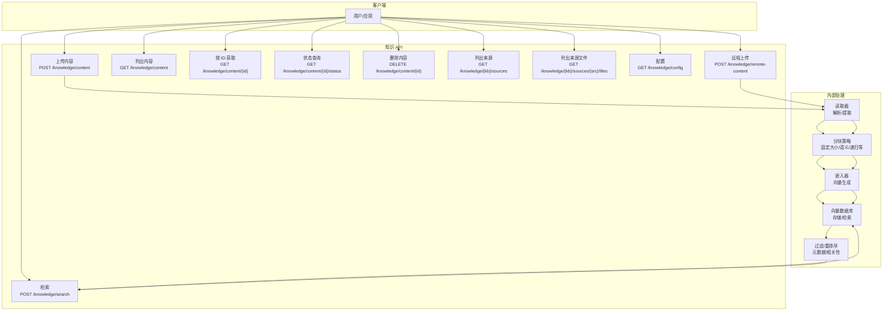
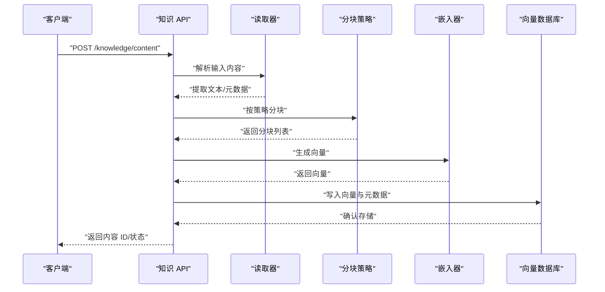
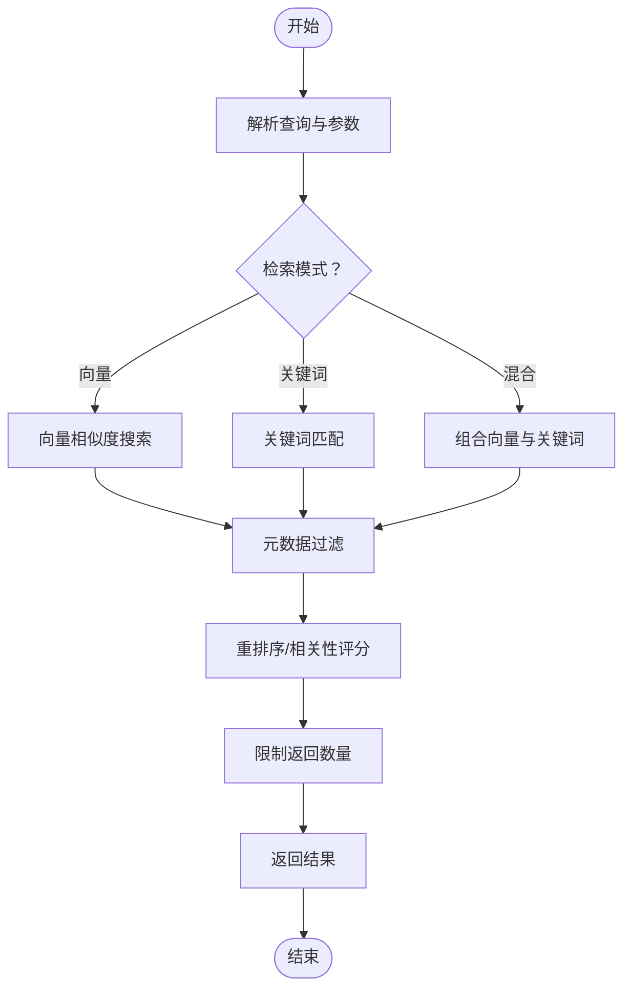
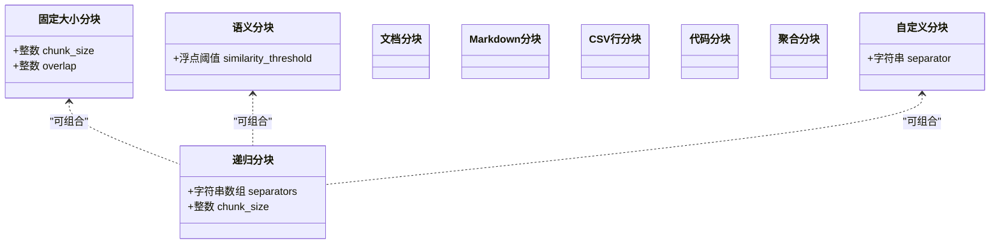
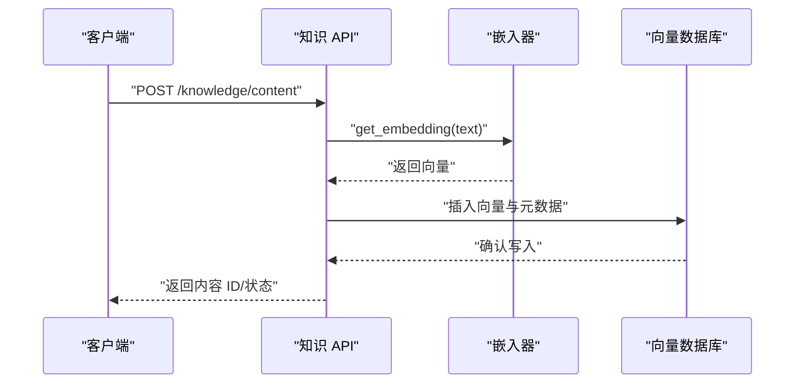
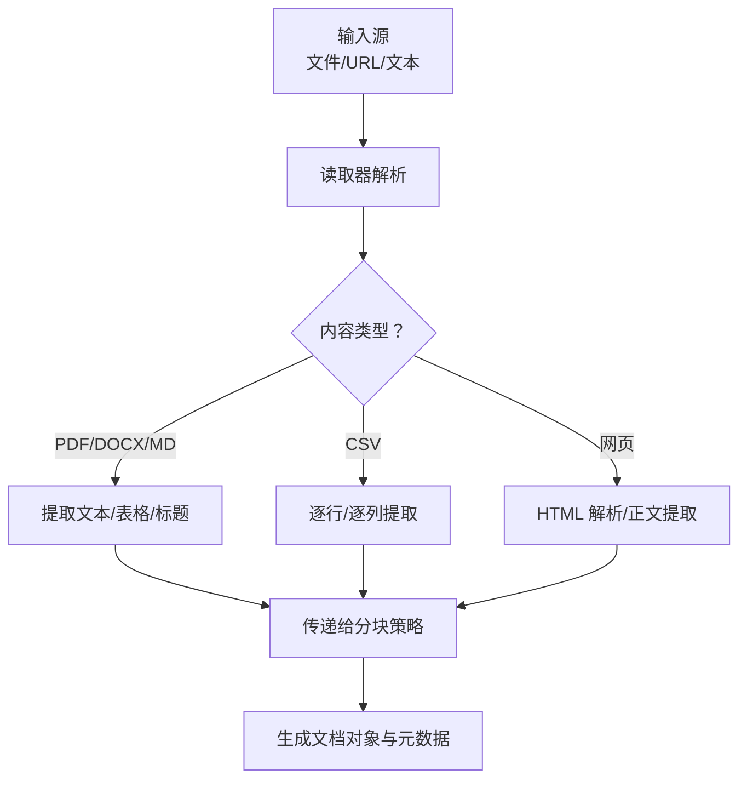
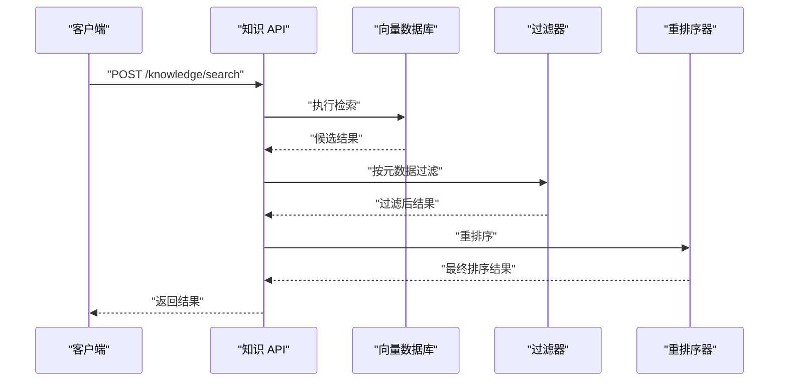
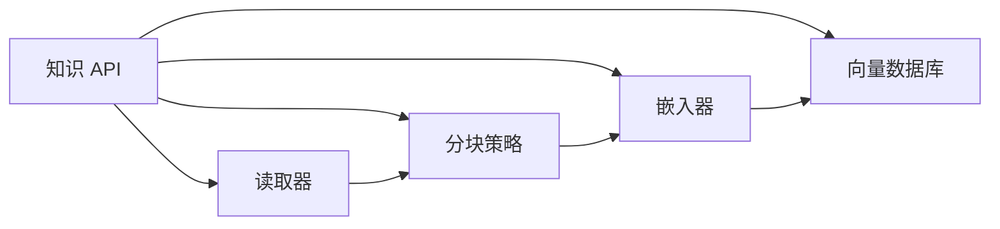

# 知识 API

<cite>
**本文引用的文件**   
- [reference-api/openapi.yaml](file://reference-api/openapi.yaml)
- [reference-api/schema/knowledge/upload-content.mdx](file://reference-api/schema/knowledge/upload-content.mdx)
- [reference-api/schema/knowledge/upload-remote-content.mdx](file://reference-api/schema/knowledge/upload-remote-content.mdx)
- [reference-api/schema/knowledge/list-content.mdx](file://reference-api/schema/knowledge/list-content.mdx)
- [reference-api/schema/knowledge/get-content-by-id.mdx](file://reference-api/schema/knowledge/get-content-by-id.mdx)
- [reference-api/schema/knowledge/get-content-status.mdx](file://reference-api/schema/knowledge/get-content-status.mdx)
- [reference-api/schema/knowledge/delete-all-content.mdx](file://reference-api/schema/knowledge/delete-all-content.mdx)
- [reference-api/schema/knowledge/delete-content-by-id.mdx](file://reference-api/schema/knowledge/delete-content-by-id.mdx)
- [reference-api/schema/knowledge/list-content-sources.mdx](file://reference-api/schema/knowledge/list-content-sources.mdx)
- [reference-api/schema/knowledge/list-files-in-source.mdx](file://reference-api/schema/knowledge/list-files-in-source.mdx)
- [reference-api/schema/knowledge/get-config.mdx](file://reference-api/schema/knowledge/get-config.mdx)
- [reference-api/schema/knowledge/search-knowledge.mdx](file://reference-api/schema/knowledge/search-knowledge.mdx)
- [knowledge/concepts/chunking/overview.mdx](file://knowledge/concepts/chunking/overview.mdx)
- [knowledge/concepts/chunking/semantic.mdx](file://knowledge/concepts/chunking/semantic.mdx)
- [knowledge/concepts/chunking/recursive.mdx](file://knowledge/concepts/chunking/recursive.mdx)
- [knowledge/concepts/chunking/fixed-size.mdx](file://knowledge/concepts/chunking/fixed-size.mdx)
- [knowledge/concepts/chunking/custom-chunking.mdx](file://knowledge/concepts/chunking/custom-chunking.mdx)
- [_snippets/chunking-semantic.mdx](file://_snippets/chunking-semantic.mdx)
- [_snippets/chunking-recursive.mdx](file://_snippets/chunking-recursive.mdx)
- [_snippets/chunking-fixed-size.mdx](file://_snippets/chunking-fixed-size.mdx)
- [_snippets/chunking-custom.mdx](file://_snippets/chunking-custom.mdx)
- [knowledge/concepts/readers/overview.mdx](file://knowledge/concepts/readers/overview.mdx)
- [knowledge/concepts/search-and-retrieval/overview.mdx](file://knowledge/concepts/search-and-retrieval/overview.mdx)
- [knowledge/concepts/search-and-retrieval/custom-retriever.mdx](file://knowledge/concepts/search-and-retrieval/custom-retriever.mdx)
- [knowledge/concepts/filters/overview.mdx](file://knowledge/concepts/filters/overview.mdx)
- [knowledge/concepts/embedder/overview.mdx](file://knowledge/concepts/embedder/overview.mdx)
- [knowledge/teams/distributed-rag-with-reranking.mdx](file://knowledge/teams/distributed-rag-with-reranking.mdx)
- [examples/knowledge/filters/vector-dbs/filtering-chroma-db.mdx](file://examples/knowledge/filters/vector-dbs/filtering-chroma-db.mdx)
- [examples/knowledge/filters/vector-dbs/filtering-milvus.mdx](file://examples/knowledge/filters/vector-dbs/filtering-milvus.mdx)
- [cookbook/knowledge/chunking.mdx](file://cookbook/knowledge/chunking.mdx)
- [cookbook/knowledge/readers.mdx](file://cookbook/knowledge/readers.mdx)
- [cookbook/knowledge/embedders.mdx](file://cookbook/knowledge/embedders.mdx)
- [agent-os/features/knowledge-management.mdx](file://agent-os/features/knowledge-management.mdx)
- [reference/knowledge/knowledge.mdx](file://reference/knowledge/knowledge.mdx)
</cite>

## 目录
1. [简介](#简介)
2. [项目结构](#项目结构)
3. [核心组件](#核心组件)
4. [架构总览](#架构总览)
5. [详细组件分析](#详细组件分析)
6. [依赖关系分析](#依赖关系分析)
7. [性能考量](#性能考量)
8. [故障排查指南](#故障排查指南)
9. [结论](#结论)
10. [附录](#附录)

## 简介
本文件为“知识 API”的全面接口文档，覆盖知识库的创建、管理与维护，包括内容上传、索引与状态管理、元数据处理；知识检索 API 的使用方法（向量搜索、关键词搜索与混合检索）；知识分块 API 的配置选项（多种分块策略与参数）；知识嵌入 API 的接口规范（文本编码、向量生成与存储管理）；知识读取器 API 的使用方法（文件解析、内容提取与格式转换）；以及知识过滤、重排序与结果处理的 API 接口说明，并提供知识库性能优化与批量操作的 API 支持建议。

## 项目结构
知识 API 的端点在统一的 OpenAPI 规范中定义，位于 reference-api/openapi.yaml 中，同时各端点的简要描述与示例由对应 schema 文件补充。知识概念与用法分布在 knowledge/concepts 与 cookbook 下，AgentOS 层面的知识管理界面与能力在 agent-os/features 下有说明。

```mermaid
graph TB
A["OpenAPI 规范<br/>reference-api/openapi.yaml"] --> B["知识内容上传<br/>POST /knowledge/content"]
A --> C["远程内容上传<br/>POST /knowledge/remote-content"]
A --> D["列出内容<br/>GET /knowledge/content"]
A --> E["按 ID 获取内容<br/>GET /knowledge/content/{content_id}"]
A --> F["获取内容状态<br/>GET /knowledge/content/{content_id}/status"]
A --> G["删除全部内容<br/>DELETE /knowledge/content"]
A --> H["按 ID 删除内容<br/>DELETE /knowledge/content/{content_id}"]
A --> I["列出内容来源<br/>GET /knowledge/{knowledge_id}/sources"]
A --> J["列出来源文件<br/>GET /knowledge/{knowledge_id}/sources/{source_id}/files"]
A --> K["获取知识配置<br/>GET /knowledge/config"]
A --> L["知识检索<br/>POST /knowledge/search"]
M["知识概念与用法"] --> N["分块策略<br/>knowledge/concepts/chunking/*"]
M --> O["读取器<br/>knowledge/concepts/readers/*"]
M --> P["检索与过滤<br/>knowledge/concepts/search-and-retrieval/*"]
M --> Q["嵌入器<br/>knowledge/concepts/embedder/*"]
M --> R["AgentOS 界面与流程<br/>agent-os/features/knowledge-management.mdx"]
```

图表来源
- [reference-api/openapi.yaml](file://reference-api/openapi.yaml)
- [reference-api/schema/knowledge/upload-content.mdx](file://reference-api/schema/knowledge/upload-content.mdx)
- [reference-api/schema/knowledge/upload-remote-content.mdx](file://reference-api/schema/knowledge/upload-remote-content.mdx)
- [reference-api/schema/knowledge/list-content.mdx](file://reference-api/schema/knowledge/list-content.mdx)
- [reference-api/schema/knowledge/get-content-by-id.mdx](file://reference-api/schema/knowledge/get-content-by-id.mdx)
- [reference-api/schema/knowledge/get-content-status.mdx](file://reference-api/schema/knowledge/get-content-status.mdx)
- [reference-api/schema/knowledge/delete-all-content.mdx](file://reference-api/schema/knowledge/delete-all-content.mdx)
- [reference-api/schema/knowledge/delete-content-by-id.mdx](file://reference-api/schema/knowledge/delete-content-by-id.mdx)
- [reference-api/schema/knowledge/list-content-sources.mdx](file://reference-api/schema/knowledge/list-content-sources.mdx)
- [reference-api/schema/knowledge/list-files-in-source.mdx](file://reference-api/schema/knowledge/list-files-in-source.mdx)
- [reference-api/schema/knowledge/get-config.mdx](file://reference-api/schema/knowledge/get-config.mdx)
- [reference-api/schema/knowledge/search-knowledge.mdx](file://reference-api/schema/knowledge/search-knowledge.mdx)

章节来源
- [reference-api/openapi.yaml](file://reference-api/openapi.yaml)
- [reference-api/schema/knowledge/upload-content.mdx](file://reference-api/schema/knowledge/upload-content.mdx)
- [reference-api/schema/knowledge/upload-remote-content.mdx](file://reference-api/schema/knowledge/upload-remote-content.mdx)
- [reference-api/schema/knowledge/list-content.mdx](file://reference-api/schema/knowledge/list-content.mdx)
- [reference-api/schema/knowledge/get-content-by-id.mdx](file://reference-api/schema/knowledge/get-content-by-id.mdx)
- [reference-api/schema/knowledge/get-content-status.mdx](file://reference-api/schema/knowledge/get-content-status.mdx)
- [reference-api/schema/knowledge/delete-all-content.mdx](file://reference-api/schema/knowledge/delete-all-content.mdx)
- [reference-api/schema/knowledge/delete-content-by-id.mdx](file://reference-api/schema/knowledge/delete-content-by-id.mdx)
- [reference-api/schema/knowledge/list-content-sources.mdx](file://reference-api/schema/knowledge/list-content-sources.mdx)
- [reference-api/schema/knowledge/list-files-in-source.mdx](file://reference-api/schema/knowledge/list-files-in-source.mdx)
- [reference-api/schema/knowledge/get-config.mdx](file://reference-api/schema/knowledge/get-config.mdx)
- [reference-api/schema/knowledge/search-knowledge.mdx](file://reference-api/schema/knowledge/search-knowledge.mdx)

## 核心组件
- 内容管理：上传本地或远程内容、列出内容、按 ID 获取内容、获取内容状态、删除内容（单个与全部）、列出内容来源与来源下的文件。
- 检索服务：对知识库进行向量搜索、关键词搜索与混合检索。
- 配置查询：获取知识库配置信息。
- 分块与读取：通过读取器与分块策略将内容切分为适合嵌入与检索的小块。
- 过滤与重排序：基于元数据过滤与重排序提升检索质量。
- 嵌入与存储：文本编码、向量生成与存储到向量数据库。

章节来源
- [reference-api/schema/knowledge/upload-content.mdx](file://reference-api/schema/knowledge/upload-content.mdx)
- [reference-api/schema/knowledge/upload-remote-content.mdx](file://reference-api/schema/knowledge/upload-remote-content.mdx)
- [reference-api/schema/knowledge/list-content.mdx](file://reference-api/schema/knowledge/list-content.mdx)
- [reference-api/schema/knowledge/get-content-by-id.mdx](file://reference-api/schema/knowledge/get-content-by-id.mdx)
- [reference-api/schema/knowledge/get-content-status.mdx](file://reference-api/schema/knowledge/get-content-status.mdx)
- [reference-api/schema/knowledge/delete-all-content.mdx](file://reference-api/schema/knowledge/delete-all-content.mdx)
- [reference-api/schema/knowledge/delete-content-by-id.mdx](file://reference-api/schema/knowledge/delete-content-by-id.mdx)
- [reference-api/schema/knowledge/list-content-sources.mdx](file://reference-api/schema/knowledge/list-content-sources.mdx)
- [reference-api/schema/knowledge/list-files-in-source.mdx](file://reference-api/schema/knowledge/list-files-in-source.mdx)
- [reference-api/schema/knowledge/get-config.mdx](file://reference-api/schema/knowledge/get-config.mdx)
- [reference-api/schema/knowledge/search-knowledge.mdx](file://reference-api/schema/knowledge/search-knowledge.mdx)

## 架构总览
下图展示了知识 API 的端到端工作流：客户端调用上传与检索端点，系统内部通过读取器解析内容、分块策略切分、嵌入器生成向量，并写入向量数据库；检索时支持向量相似度搜索、关键词匹配与混合模式；同时支持基于元数据的过滤与重排序。

图表来源
- [reference-api/openapi.yaml](file://reference-api/openapi.yaml)
- [reference-api/schema/knowledge/upload-content.mdx](file://reference-api/schema/knowledge/upload-content.mdx)
- [reference-api/schema/knowledge/upload-remote-content.mdx](file://reference-api/schema/knowledge/upload-remote-content.mdx)
- [reference-api/schema/knowledge/list-content.mdx](file://reference-api/schema/knowledge/list-content.mdx)
- [reference-api/schema/knowledge/get-content-by-id.mdx](file://reference-api/schema/knowledge/get-content-by-id.mdx)
- [reference-api/schema/knowledge/get-content-status.mdx](file://reference-api/schema/knowledge/get-content-status.mdx)
- [reference-api/schema/knowledge/delete-all-content.mdx](file://reference-api/schema/knowledge/delete-all-content.mdx)
- [reference-api/schema/knowledge/delete-content-by-id.mdx](file://reference-api/schema/knowledge/delete-content-by-id.mdx)
- [reference-api/schema/knowledge/list-content-sources.mdx](file://reference-api/schema/knowledge/list-content-sources.mdx)
- [reference-api/schema/knowledge/list-files-in-source.mdx](file://reference-api/schema/knowledge/list-files-in-source.mdx)
- [reference-api/schema/knowledge/get-config.mdx](file://reference-api/schema/knowledge/get-config.mdx)
- [reference-api/schema/knowledge/search-knowledge.mdx](file://reference-api/schema/knowledge/search-knowledge.mdx)

## 详细组件分析

### 内容上传与管理
- 上传本地内容：POST /knowledge/content
- 上传远程内容：POST /knowledge/remote-content
- 列出内容：GET /knowledge/content
- 按 ID 获取内容：GET /knowledge/content/{content_id}
- 获取内容状态：GET /knowledge/content/{content_id}/status
- 删除全部内容：DELETE /knowledge/content
- 按 ID 删除内容：DELETE /knowledge/content/{content_id}
- 列出内容来源：GET /knowledge/{knowledge_id}/sources
- 列出来源文件：GET /knowledge/{knowledge_id}/sources/{source_id}/files
- 获取知识配置：GET /knowledge/config

图表来源
- [reference-api/schema/knowledge/upload-content.mdx](file://reference-api/schema/knowledge/upload-content.mdx)
- [reference-api/schema/knowledge/upload-remote-content.mdx](file://reference-api/schema/knowledge/upload-remote-content.mdx)
- [reference-api/schema/knowledge/list-content.mdx](file://reference-api/schema/knowledge/list-content.mdx)
- [reference-api/schema/knowledge/get-content-by-id.mdx](file://reference-api/schema/knowledge/get-content-by-id.mdx)
- [reference-api/schema/knowledge/get-content-status.mdx](file://reference-api/schema/knowledge/get-content-status.mdx)
- [reference-api/schema/knowledge/delete-all-content.mdx](file://reference-api/schema/knowledge/delete-all-content.mdx)
- [reference-api/schema/knowledge/delete-content-by-id.mdx](file://reference-api/schema/knowledge/delete-content-by-id.mdx)
- [reference-api/schema/knowledge/list-content-sources.mdx](file://reference-api/schema/knowledge/list-content-sources.mdx)
- [reference-api/schema/knowledge/list-files-in-source.mdx](file://reference-api/schema/knowledge/list-files-in-source.mdx)
- [reference-api/schema/knowledge/get-config.mdx](file://reference-api/schema/knowledge/get-config.mdx)

章节来源
- [reference-api/schema/knowledge/upload-content.mdx](file://reference-api/schema/knowledge/upload-content.mdx)
- [reference-api/schema/knowledge/upload-remote-content.mdx](file://reference-api/schema/knowledge/upload-remote-content.mdx)
- [reference-api/schema/knowledge/list-content.mdx](file://reference-api/schema/knowledge/list-content.mdx)
- [reference-api/schema/knowledge/get-content-by-id.mdx](file://reference-api/schema/knowledge/get-content-by-id.mdx)
- [reference-api/schema/knowledge/get-content-status.mdx](file://reference-api/schema/knowledge/get-content-status.mdx)
- [reference-api/schema/knowledge/delete-all-content.mdx](file://reference-api/schema/knowledge/delete-all-content.mdx)
- [reference-api/schema/knowledge/delete-content-by-id.mdx](file://reference-api/schema/knowledge/delete-content-by-id.mdx)
- [reference-api/schema/knowledge/list-content-sources.mdx](file://reference-api/schema/knowledge/list-content-sources.mdx)
- [reference-api/schema/knowledge/list-files-in-source.mdx](file://reference-api/schema/knowledge/list-files-in-source.mdx)
- [reference-api/schema/knowledge/get-config.mdx](file://reference-api/schema/knowledge/get-config.mdx)

### 知识检索 API
- 检索入口：POST /knowledge/search
- 支持模式：向量搜索、关键词搜索、混合检索
- 结果处理：过滤、重排序、去重与上下文拼接

图表来源
- [reference-api/schema/knowledge/search-knowledge.mdx](file://reference-api/schema/knowledge/search-knowledge.mdx)
- [knowledge/concepts/search-and-retrieval/overview.mdx](file://knowledge/concepts/search-and-retrieval/overview.mdx)
- [knowledge/concepts/search-and-retrieval/custom-retriever.mdx](file://knowledge/concepts/search-and-retrieval/custom-retriever.mdx)

章节来源
- [reference-api/schema/knowledge/search-knowledge.mdx](file://reference-api/schema/knowledge/search-knowledge.mdx)
- [knowledge/concepts/search-and-retrieval/overview.mdx](file://knowledge/concepts/search-and-retrieval/overview.mdx)
- [knowledge/concepts/search-and-retrieval/custom-retriever.mdx](file://knowledge/concepts/search-and-retrieval/custom-retriever.mdx)

### 知识分块 API 配置
- 可用策略：固定大小、语义分块、递归分块、文档分块、Markdown 分块、CSV 行分块、代码分块、聚合分块、自定义分块
- 关键参数：chunk_size、overlap、相似度阈值、分隔符、自定义分隔符列表等
- 使用建议：根据内容类型选择策略；小块更利于精确检索，大块更利于上下文保留

图表来源
- [knowledge/concepts/chunking/overview.mdx](file://knowledge/concepts/chunking/overview.mdx)
- [knowledge/concepts/chunking/semantic.mdx](file://knowledge/concepts/chunking/semantic.mdx)
- [knowledge/concepts/chunking/recursive.mdx](file://knowledge/concepts/chunking/recursive.mdx)
- [knowledge/concepts/chunking/fixed-size.mdx](file://knowledge/concepts/chunking/fixed-size.mdx)
- [knowledge/concepts/chunking/custom-chunking.mdx](file://knowledge/concepts/chunking/custom-chunking.mdx)
- [_snippets/chunking-semantic.mdx](file://_snippets/chunking-semantic.mdx)
- [_snippets/chunking-recursive.mdx](file://_snippets/chunking-recursive.mdx)
- [_snippets/chunking-fixed-size.mdx](file://_snippets/chunking-fixed-size.mdx)
- [_snippets/chunking-custom.mdx](file://_snippets/chunking-custom.mdx)

章节来源
- [knowledge/concepts/chunking/overview.mdx](file://knowledge/concepts/chunking/overview.mdx)
- [knowledge/concepts/chunking/semantic.mdx](file://knowledge/concepts/chunking/semantic.mdx)
- [knowledge/concepts/chunking/recursive.mdx](file://knowledge/concepts/chunking/recursive.mdx)
- [knowledge/concepts/chunking/fixed-size.mdx](file://knowledge/concepts/chunking/fixed-size.mdx)
- [knowledge/concepts/chunking/custom-chunking.mdx](file://knowledge/concepts/chunking/custom-chunking.mdx)
- [_snippets/chunking-semantic.mdx](file://_snippets/chunking-semantic.mdx)
- [_snippets/chunking-recursive.mdx](file://_snippets/chunking-recursive.mdx)
- [_snippets/chunking-fixed-size.mdx](file://_snippets/chunking-fixed-size.mdx)
- [_snippets/chunking-custom.mdx](file://_snippets/chunking-custom.mdx)

### 知识嵌入 API
- 功能：文本编码、向量生成、写入向量数据库
- 支持的嵌入器：OpenAI、Gemini、Cohere、SentenceTransformer、VoyageAI、LangDB 等
- 参数：维度、模型名称、提供商、批处理大小、并发度等
- 存储：与向量数据库集成，支持索引与查询加速

图表来源
- [reference-api/schema/knowledge/upload-content.mdx](file://reference-api/schema/knowledge/upload-content.mdx)
- [knowledge/concepts/embedder/overview.mdx](file://knowledge/concepts/embedder/overview.mdx)

章节来源
- [knowledge/concepts/embedder/overview.mdx](file://knowledge/concepts/embedder/overview.mdx)

### 知识读取器 API
- 功能：解析文件、提取内容、格式转换
- 支持类型：PDF、CSV、JSON、TXT、DOC/DOCX、MD、XLS/XLSX、PPTX、网页、文本粘贴等
- 与分块策略结合：读取器可配置分块策略以适配不同内容结构

图表来源
- [knowledge/concepts/readers/overview.mdx](file://knowledge/concepts/readers/overview.mdx)

章节来源
- [knowledge/concepts/readers/overview.mdx](file://knowledge/concepts/readers/overview.mdx)

### 知识过滤、重排序与结果处理
- 元数据过滤：按字段值过滤，如用户 ID、文档类型、年份等
- 重排序：基于相关性、时间、评分等进行二次排序
- 结果处理：去重、上下文拼接、引用格式化

图表来源
- [knowledge/concepts/filters/overview.mdx](file://knowledge/concepts/filters/overview.mdx)
- [knowledge/teams/distributed-rag-with-reranking.mdx](file://knowledge/teams/distributed-rag-with-reranking.mdx)
- [examples/knowledge/filters/vector-dbs/filtering-chroma-db.mdx](file://examples/knowledge/filters/vector-dbs/filtering-chroma-db.mdx)
- [examples/knowledge/filters/vector-dbs/filtering-milvus.mdx](file://examples/knowledge/filters/vector-dbs/filtering-milvus.mdx)

章节来源
- [knowledge/concepts/filters/overview.mdx](file://knowledge/concepts/filters/overview.mdx)
- [knowledge/teams/distributed-rag-with-reranking.mdx](file://knowledge/teams/distributed-rag-with-reranking.mdx)
- [examples/knowledge/filters/vector-dbs/filtering-chroma-db.mdx](file://examples/knowledge/filters/vector-dbs/filtering-chroma-db.mdx)
- [examples/knowledge/filters/vector-dbs/filtering-milvus.mdx](file://examples/knowledge/filters/vector-dbs/filtering-milvus.mdx)

### 性能优化与批量操作
- 批量上传：insert_many 提升吞吐量
- 并发与批处理：嵌入器与向量数据库支持并发写入
- 索引优化：选择合适的向量数据库与索引参数
- 分块策略：根据查询目标调整 chunk_size 与 overlap
- 过滤与重排序：减少候选集规模，提高检索效率

章节来源
- [cookbook/knowledge/chunking.mdx](file://cookbook/knowledge/chunking.mdx)
- [cookbook/knowledge/embedders.mdx](file://cookbook/knowledge/embedders.mdx)
- [cookbook/knowledge/readers.mdx](file://cookbook/knowledge/readers.mdx)

## 依赖关系分析
- 端点依赖：所有内容管理与检索端点均依赖于读取器、分块策略、嵌入器与向量数据库
- 组件耦合：读取器与分块策略解耦，便于替换与组合
- 外部依赖：向量数据库（PgVector、Chroma、Milvus 等）与嵌入器提供商

图表来源
- [reference-api/openapi.yaml](file://reference-api/openapi.yaml)
- [knowledge/concepts/readers/overview.mdx](file://knowledge/concepts/readers/overview.mdx)
- [knowledge/concepts/chunking/overview.mdx](file://knowledge/concepts/chunking/overview.mdx)
- [knowledge/concepts/embedder/overview.mdx](file://knowledge/concepts/embedder/overview.mdx)

章节来源
- [reference-api/openapi.yaml](file://reference-api/openapi.yaml)
- [knowledge/concepts/readers/overview.mdx](file://knowledge/concepts/readers/overview.mdx)
- [knowledge/concepts/chunking/overview.mdx](file://knowledge/concepts/chunking/overview.mdx)
- [knowledge/concepts/embedder/overview.mdx](file://knowledge/concepts/embedder/overview.mdx)

## 性能考量
- 向量维度与索引：选择合适维度与索引类型，平衡精度与速度
- 分块大小：小块提升召回与定位精度，大块增强上下文完整性
- 并发写入：批量插入与并发嵌入提升吞吐
- 过滤前置：优先缩小候选集，降低后续重排序成本
- 缓存与预热：热点内容与常用查询结果缓存

## 故障排查指南
- 上传失败：检查文件类型、大小限制与网络连接；查看状态端点获取错误信息
- 检索无结果：调整检索模式（向量/关键词/混合），优化分块策略与嵌入器
- 过滤无效：确认元数据字段名与值类型一致
- 重排序异常：检查重排序器配置与评分逻辑
- 权限问题：确保访问令牌有效且具备相应权限

章节来源
- [reference-api/schema/knowledge/get-content-status.mdx](file://reference-api/schema/knowledge/get-content-status.mdx)
- [reference-api/schema/knowledge/get-config.mdx](file://reference-api/schema/knowledge/get-config.mdx)

## 结论
知识 API 提供了从内容上传、解析、分块、嵌入到检索与结果处理的完整链路。通过灵活的分块策略、多样的嵌入器与向量数据库、强大的过滤与重排序能力，能够满足多样化的知识管理与检索需求。建议结合业务场景选择合适的策略与参数，并利用批量与并发能力提升整体性能。

## 附录
- AgentOS 界面与流程参考：了解如何在前端添加、编辑、删除与刷新知识内容
- 端点与参数参考：在 reference-api/openapi.yaml 与各 schema 文件中查看详细定义

章节来源
- [agent-os/features/knowledge-management.mdx](file://agent-os/features/knowledge-management.mdx)
- [reference/knowledge/knowledge.mdx](file://reference/knowledge/knowledge.mdx)