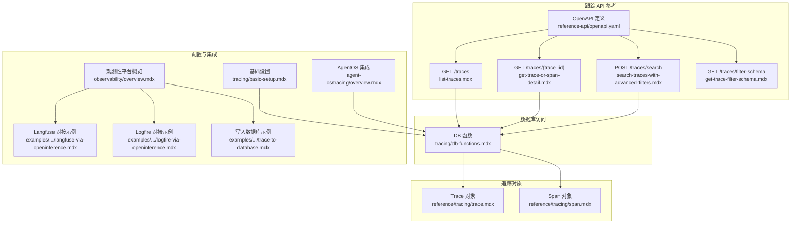
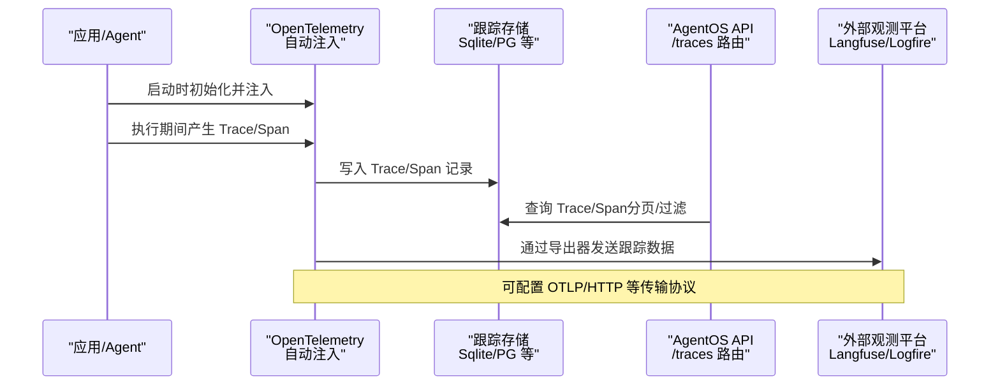
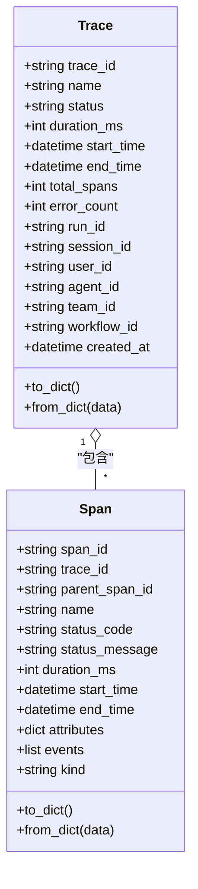
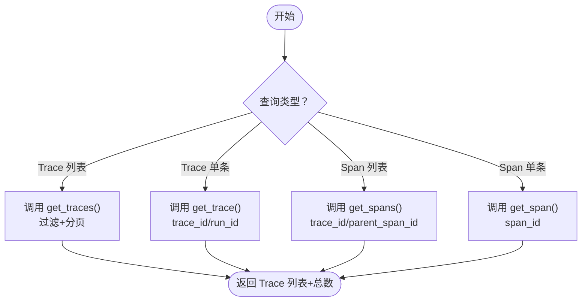
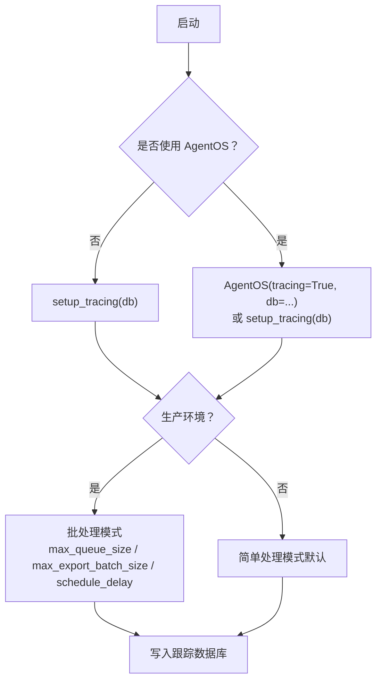
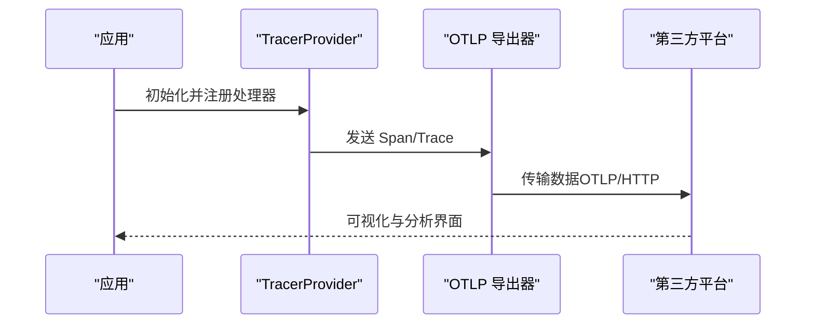
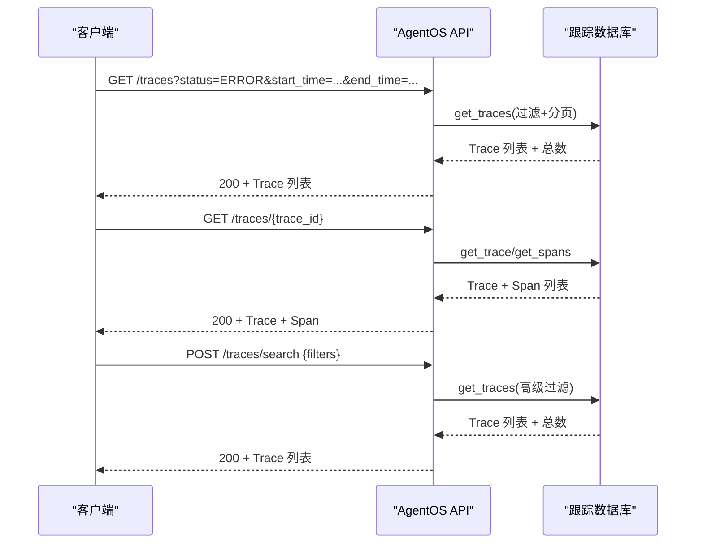
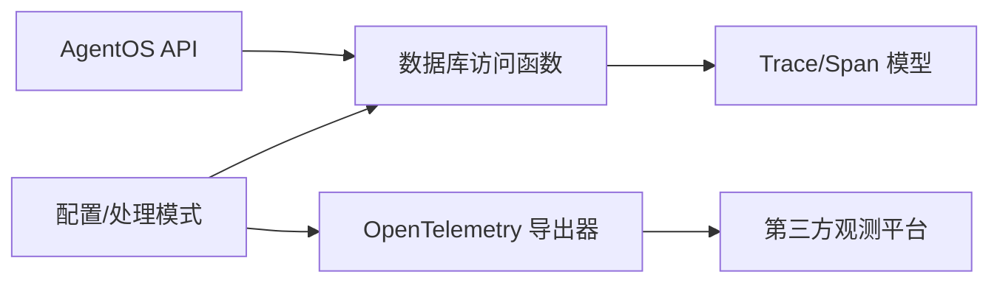

# 跟踪 API

<cite>
**本文引用的文件**
- [reference-api/openapi.yaml](file://reference-api/openapi.yaml)
- [reference-api/schema/traces/list-traces.mdx](file://reference-api/schema/traces/list-traces.mdx)
- [reference-api/schema/traces/get-trace-or-span-detail.mdx](file://reference-api/schema/traces/get-trace-or-span-detail.mdx)
- [reference-api/schema/traces/search-traces-with-advanced-filters.mdx](file://reference-api/schema/traces/search-traces-with-advanced-filters.mdx)
- [reference-api/schema/traces/get-trace-filter-schema.mdx](file://reference-api/schema/traces/get-trace-filter-schema.mdx)
- [reference/tracing/trace.mdx](file://reference/tracing/trace.mdx)
- [reference/tracing/span.mdx](file://reference/tracing/span.mdx)
- [tracing/db-functions.mdx](file://tracing/db-functions.mdx)
- [tracing/basic-setup.mdx](file://tracing/basic-setup.mdx)
- [agent-os/tracing/overview.mdx](file://agent-os/tracing/overview.mdx)
- [observability/overview.mdx](file://observability/overview.mdx)
- [examples/integrations/observability/langfuse-via-openinference.mdx](file://examples/integrations/observability/langfuse-via-openinference.mdx)
- [examples/integrations/observability/logfire-via-openinference.mdx](file://examples/integrations/observability/logfire-via-openinference.mdx)
- [examples/integrations/observability/trace-to-database.mdx](file://examples/integrations/observability/trace-to-database.mdx)
</cite>

## 目录
1. [简介](#简介)
2. [项目结构](#项目结构)
3. [核心组件](#核心组件)
4. [架构总览](#架构总览)
5. [详细组件分析](#详细组件分析)
6. [依赖分析](#依赖分析)
7. [性能考虑](#性能考虑)
8. [故障排查指南](#故障排查指南)
9. [结论](#结论)
10. [附录](#附录)

## 简介
本文件为分布式跟踪 API 的全面接口文档，覆盖跟踪创建、管理与查询接口，跟踪上下文（Trace）、跨度（Span）与链路关系，跟踪数据采集与存储 API（性能指标、错误信息、调试数据），跟踪配置 API（采样策略、存储后端、传输协议），以及跟踪查询与分析 API（时间范围查询、聚合统计、可视化数据）。同时说明跟踪数据导出与第三方观测平台对接方式，并提供性能优化与成本控制建议。

## 项目结构
围绕跟踪 API 的文档与实现分布在以下区域：
- OpenAPI 定义：在参考 API 中集中描述路径与模型
- 追踪对象定义：Trace 与 Span 的字段与用法
- 数据库访问函数：统一查询 Trace 与 Span 的便捷方法
- 基础设置与 AgentOS 集成：启用跟踪、批处理模式、数据库选择
- 观测性平台对接：通过 OpenTelemetry 导出到第三方平台
- 示例：将跟踪写入数据库、Langfuse/Logfire 对接示例

图表来源
- [reference-api/openapi.yaml](file://reference-api/openapi.yaml)
- [reference-api/schema/traces/list-traces.mdx](file://reference-api/schema/traces/list-traces.mdx)
- [reference-api/schema/traces/get-trace-or-span-detail.mdx](file://reference-api/schema/traces/get-trace-or-span-detail.mdx)
- [reference-api/schema/traces/search-traces-with-advanced-filters.mdx](file://reference-api/schema/traces/search-traces-with-advanced-filters.mdx)
- [reference-api/schema/traces/get-trace-filter-schema.mdx](file://reference-api/schema/traces/get-trace-filter-schema.mdx)
- [reference/tracing/trace.mdx](file://reference/tracing/trace.mdx)
- [reference/tracing/span.mdx](file://reference/tracing/span.mdx)
- [tracing/db-functions.mdx](file://tracing/db-functions.mdx)
- [tracing/basic-setup.mdx](file://tracing/basic-setup.mdx)
- [agent-os/tracing/overview.mdx](file://agent-os/tracing/overview.mdx)
- [observability/overview.mdx](file://observability/overview.mdx)
- [examples/integrations/observability/langfuse-via-openinference.mdx](file://examples/integrations/observability/langfuse-via-openinference.mdx)
- [examples/integrations/observability/logfire-via-openinference.mdx](file://examples/integrations/observability/logfire-via-openinference.mdx)
- [examples/integrations/observability/trace-to-database.mdx](file://examples/integrations/observability/trace-to-database.mdx)

章节来源
- [reference-api/openapi.yaml](file://reference-api/openapi.yaml)
- [reference/tracing/trace.mdx](file://reference/tracing/trace.mdx)
- [reference/tracing/span.mdx](file://reference/tracing/span.mdx)
- [tracing/db-functions.mdx](file://tracing/db-functions.mdx)
- [tracing/basic-setup.mdx](file://tracing/basic-setup.mdx)
- [agent-os/tracing/overview.mdx](file://agent-os/tracing/overview.mdx)
- [observability/overview.mdx](file://observability/overview.mdx)

## 核心组件
- Trace（跟踪）
  - 表征一次完整的执行，从开始到结束，具有唯一 trace_id，聚合状态、时长、错误数等信息，并可关联 run_id、session_id、user_id、agent_id、team_id、workflow_id 等上下文。
- Span（跨度）
  - 表示执行中的单个操作，形成父子层级关系；包含名称、状态、时长、起止时间、属性（如 LLM token 数、工具参数）、事件、种类等。
- 数据库访问函数
  - 提供按 trace_id、run_id、session_id、user_id、agent_id、team_id、workflow_id、状态、时间范围等条件查询 Trace 与 Span 的能力；支持分页与计数。
- 配置与处理模式
  - 支持简单处理（即时写入）与批处理（内存队列+定时批量写入），并可配置队列大小、批次大小与调度延迟。
- 观测性平台对接
  - 通过 OpenTelemetry 自动注入与导出器，将跟踪数据发送至第三方平台（如 Langfuse、Logfire 等）。

章节来源
- [reference/tracing/trace.mdx](file://reference/tracing/trace.mdx)
- [reference/tracing/span.mdx](file://reference/tracing/span.mdx)
- [tracing/db-functions.mdx](file://tracing/db-functions.mdx)
- [tracing/basic-setup.mdx](file://tracing/basic-setup.mdx)
- [observability/overview.mdx](file://observability/overview.mdx)

## 架构总览
下图展示跟踪数据从生成、存储到查询与导出的整体流程：

图表来源
- [tracing/basic-setup.mdx](file://tracing/basic-setup.mdx)
- [reference-api/openapi.yaml](file://reference-api/openapi.yaml)
- [observability/overview.mdx](file://observability/overview.mdx)

## 详细组件分析

### 跟踪与跨度对象模型
- Trace 字段与语义
  - 关键字段：trace_id、name、status、duration_ms、start_time、end_time、total_spans、error_count、run_id、session_id、user_id、agent_id、team_id、workflow_id、created_at。
  - 方法：to_dict/from_dict。
- Span 字段与语义
  - 关键字段：span_id、trace_id、parent_span_id、name、status_code、status_message、duration_ms、start_time、end_time、attributes、events、kind。
  - 常见命名模式：Agent.run、Team.run、Model.invoke、Tool 名称。
  - 属性示例：LLM token 数、模型名、工具名称与参数等。

图表来源
- [reference/tracing/trace.mdx](file://reference/tracing/trace.mdx)
- [reference/tracing/span.mdx](file://reference/tracing/span.mdx)

章节来源
- [reference/tracing/trace.mdx](file://reference/tracing/trace.mdx)
- [reference/tracing/span.mdx](file://reference/tracing/span.mdx)

### 数据库访问与查询函数
- Trace 查询
  - 单条：按 trace_id 或 run_id 获取。
  - 列表：支持按 run_id、session_id、user_id、agent_id、team_id、workflow_id、status、start_time、end_time、limit、page 过滤与分页。
- Span 查询
  - 单条：按 span_id 获取。
  - 列表：按 trace_id 或 parent_span_id 获取子树。
- 使用建议
  - 统一使用数据库实例提供的便捷函数进行跨数据库（SQLite/PostgreSQL 等）查询。
  - 分页与计数配合前端分页组件使用。

图表来源
- [tracing/db-functions.mdx](file://tracing/db-functions.mdx)

章节来源
- [tracing/db-functions.mdx](file://tracing/db-functions.mdx)

### 跟踪配置与处理模式
- 启用方式
  - 独立脚本/笔记本：调用 setup_tracing(db=...)，确保在创建 Agent 之前完成。
  - AgentOS：通过 tracing=True 或在 AgentOS 中传入 db 参数。
- 处理模式
  - 批处理：适合生产，降低数据库负载，减少对执行性能的影响；可配置队列大小、批次大小与调度延迟。
  - 简单处理：默认模式，立即落库，适合开发调试。
- 存储后端
  - 建议使用独立的跟踪数据库，避免多数据库场景下跟踪分散；AgentOS 支持在多数据库环境下指定专用 db。

图表来源
- [tracing/basic-setup.mdx](file://tracing/basic-setup.mdx)
- [agent-os/tracing/overview.mdx](file://agent-os/tracing/overview.mdx)

章节来源
- [tracing/basic-setup.mdx](file://tracing/basic-setup.mdx)
- [agent-os/tracing/overview.mdx](file://agent-os/tracing/overview.mdx)

### 观测性平台对接与导出
- 平台支持
  - 支持 Arize Phoenix、Langfuse、Langsmith、Langtrace、Logfire、Maxim、MLflow、OpenLIT、Traceloop、Weave 等 OpenTelemetry 兼容平台。
- 导出方式
  - 通过 OpenTelemetry SDK 与导出器（如 OTLP/HTTP）将跟踪数据发送至目标平台。
- 示例
  - Langfuse、Logfire 的 OpenInference 注入与导出示例。

图表来源
- [observability/overview.mdx](file://observability/overview.mdx)
- [examples/integrations/observability/langfuse-via-openinference.mdx](file://examples/integrations/observability/langfuse-via-openinference.mdx)
- [examples/integrations/observability/logfire-via-openinference.mdx](file://examples/integrations/observability/logfire-via-openinference.mdx)

章节来源
- [observability/overview.mdx](file://observability/overview.mdx)
- [examples/integrations/observability/langfuse-via-openinference.mdx](file://examples/integrations/observability/langfuse-via-openinference.mdx)
- [examples/integrations/observability/logfire-via-openinference.mdx](file://examples/integrations/observability/logfire-via-openinference.mdx)

### 查询与分析 API（基于 OpenAPI）
- GET /traces
  - 功能：列出 Trace，支持分页与多维过滤（run_id、session_id、user_id、agent_id、team_id、workflow_id、status、start_time、end_time）。
  - 返回：Trace 列表与总数。
- GET /traces/{trace_id}
  - 功能：获取单个 Trace 详情及关联的 Span 列表。
  - 返回：Trace 与 Span。
- POST /traces/search
  - 功能：高级过滤搜索 Trace，支持复杂条件组合。
  - 返回：匹配的 Trace 列表与总数。
- GET /traces/filter-schema
  - 功能：返回可用的过滤字段与类型，便于前端构建查询界面。
  - 返回：过滤字段定义。

图表来源
- [reference-api/openapi.yaml](file://reference-api/openapi.yaml)
- [reference-api/schema/traces/list-traces.mdx](file://reference-api/schema/traces/list-traces.mdx)
- [reference-api/schema/traces/get-trace-or-span-detail.mdx](file://reference-api/schema/traces/get-trace-or-span-detail.mdx)
- [reference-api/schema/traces/search-traces-with-advanced-filters.mdx](file://reference-api/schema/traces/search-traces-with-advanced-filters.mdx)
- [reference-api/schema/traces/get-trace-filter-schema.mdx](file://reference-api/schema/traces/get-trace-filter-schema.mdx)
- [tracing/db-functions.mdx](file://tracing/db-functions.mdx)

章节来源
- [reference-api/openapi.yaml](file://reference-api/openapi.yaml)
- [reference-api/schema/traces/list-traces.mdx](file://reference-api/schema/traces/list-traces.mdx)
- [reference-api/schema/traces/get-trace-or-span-detail.mdx](file://reference-api/schema/traces/get-trace-or-span-detail.mdx)
- [reference-api/schema/traces/search-traces-with-advanced-filters.mdx](file://reference-api/schema/traces/search-traces-with-advanced-filters.mdx)
- [reference-api/schema/traces/get-trace-filter-schema.mdx](file://reference-api/schema/traces/get-trace-filter-schema.mdx)
- [tracing/db-functions.mdx](file://tracing/db-functions.mdx)

## 依赖分析
- 组件耦合
  - API 层依赖数据库访问函数；数据库访问函数依赖 Trace/Span 模型；配置层决定数据写入策略与导出路径。
- 外部依赖
  - OpenTelemetry SDK 与导出器用于跟踪数据的自动注入与传输。
- 平台集成
  - 通过 OTLP 协议与第三方观测平台对接，实现跨平台统一分析。

图表来源
- [reference-api/openapi.yaml](file://reference-api/openapi.yaml)
- [tracing/db-functions.mdx](file://tracing/db-functions.mdx)
- [tracing/basic-setup.mdx](file://tracing/basic-setup.mdx)
- [observability/overview.mdx](file://observability/overview.mdx)

章节来源
- [reference-api/openapi.yaml](file://reference-api/openapi.yaml)
- [tracing/db-functions.mdx](file://tracing/db-functions.mdx)
- [tracing/basic-setup.mdx](file://tracing/basic-setup.mdx)
- [observability/overview.mdx](file://observability/overview.mdx)

## 性能考虑
- 处理模式选择
  - 生产推荐批处理：降低数据库写入压力，减少对执行时延的影响；合理设置队列大小、批次大小与调度间隔。
  - 开发调试推荐简单处理：立即可见，便于快速定位问题。
- 存储后端
  - 使用独立跟踪数据库，避免与业务数据争抢资源；必要时对跟踪表建立索引以提升查询性能。
- 导出开销
  - 控制导出频率与批量大小，避免在高峰期造成网络与平台端压力。
- 成本控制
  - 通过过滤字段与时间范围缩小查询规模；对历史数据进行归档或清理策略。

## 故障排查指南
- 无法查询到 Trace
  - 确认已正确启用 tracing（setup_tracing 或 AgentOS tracing=True），并传入了 db。
  - 检查过滤条件是否过严（如时间范围、状态、ID 精确度）。
- 查询性能差
  - 使用分页与限制数量；为常用过滤字段建立索引；避免全表扫描。
- 导出失败
  - 检查 OTLP 端点与认证头配置；确认网络连通性；查看导出器日志。
- 数据库写入异常
  - 检查批处理配置是否合理；关注队列溢出与导出失败重试机制。

章节来源
- [tracing/basic-setup.mdx](file://tracing/basic-setup.mdx)
- [agent-os/tracing/overview.mdx](file://agent-os/tracing/overview.mdx)
- [examples/integrations/observability/trace-to-database.mdx](file://examples/integrations/observability/trace-to-database.mdx)

## 结论
本文档系统化梳理了跟踪 API 的创建、管理与查询接口，明确了 Trace/Span 的数据模型与链路关系，给出了数据库访问函数与配置实践，并展示了与第三方观测平台的对接方式。结合批处理与过滤策略，可在保证可观测性的同时兼顾性能与成本控制。

## 附录
- 快速参考
  - 列表查询：GET /traces（支持分页与多维过滤）
  - 详情查询：GET /traces/{trace_id}
  - 高级搜索：POST /traces/search
  - 过滤定义：GET /traces/filter-schema
- 最佳实践
  - 生产使用批处理与独立跟踪数据库
  - 明确过滤边界，避免无界查询
  - 通过导出器对接主流观测平台，统一分析体验