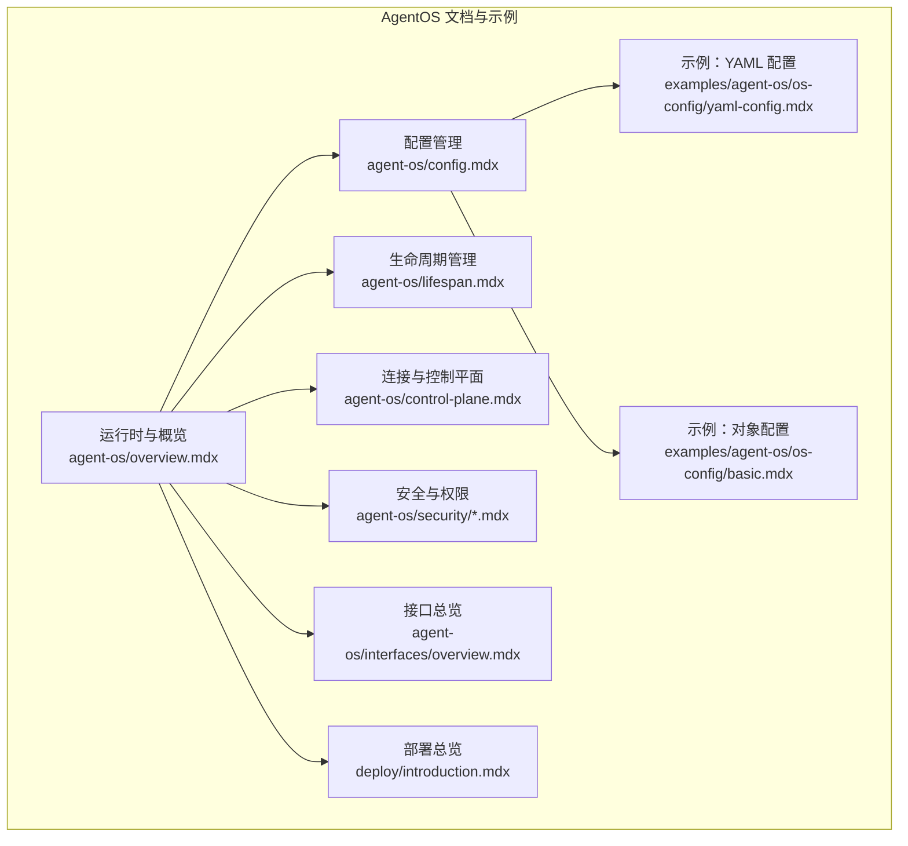
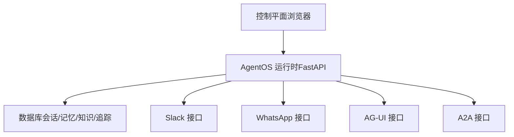
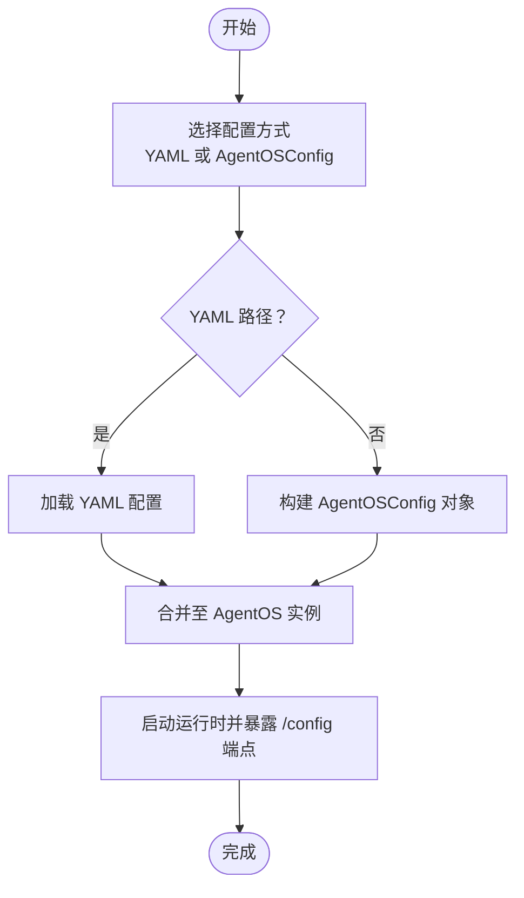
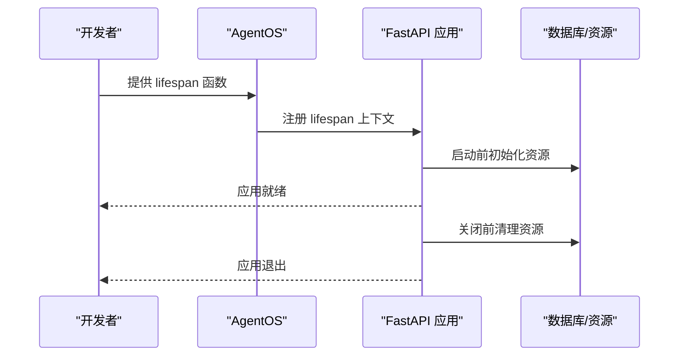
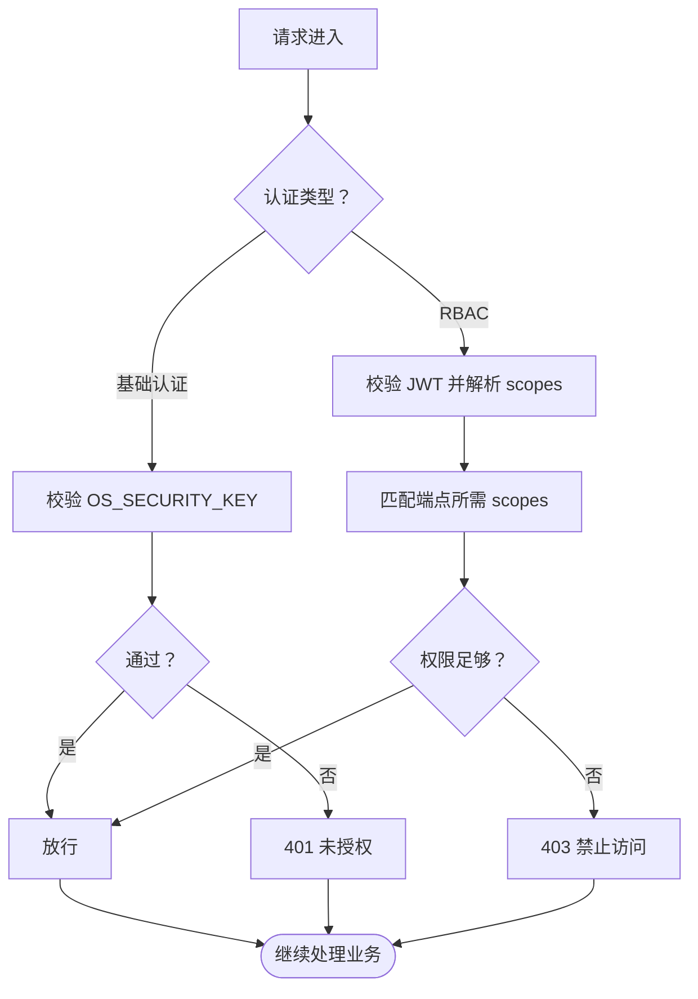
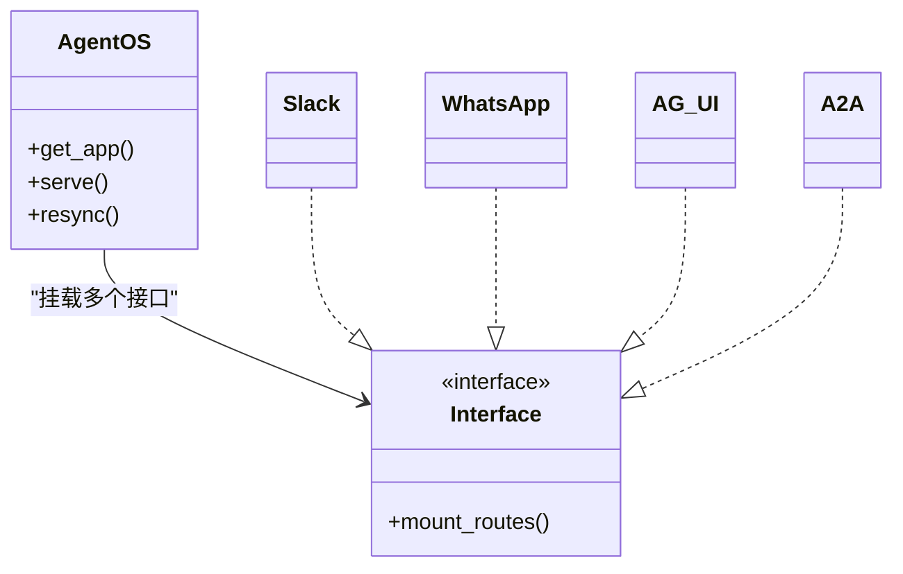
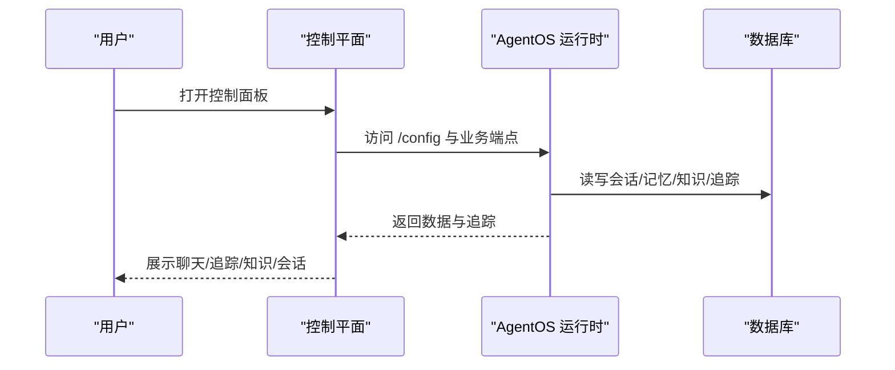
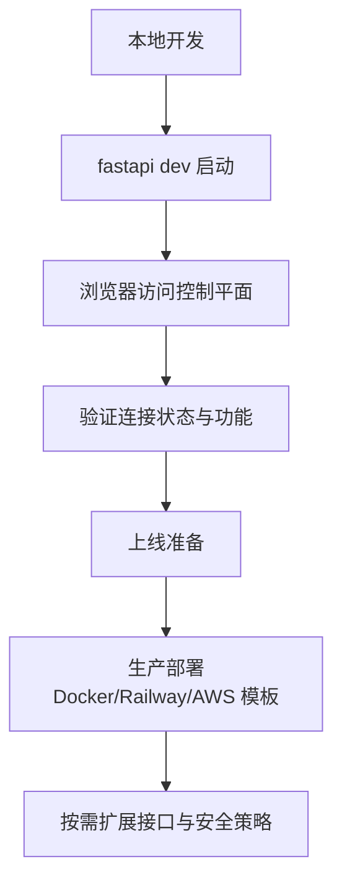
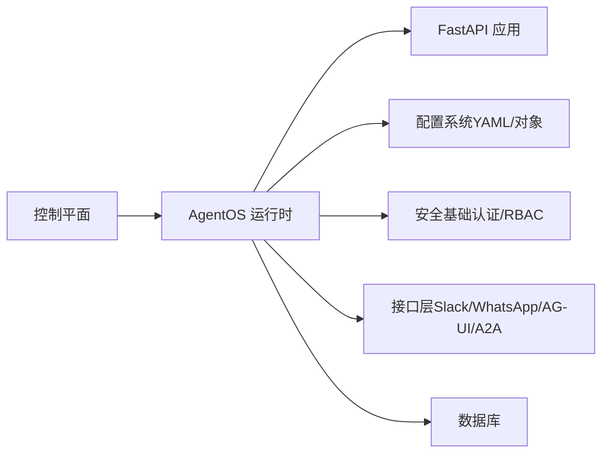

# AgentOS 运行时系统

<cite>
**本文引用的文件**
- [agent-os/introduction.mdx](file://agent-os/introduction.mdx)
- [agent-os/overview.mdx](file://agent-os/overview.mdx)
- [agent-os/config.mdx](file://agent-os/config.mdx)
- [agent-os/lifespan.mdx](file://agent-os/lifespan.mdx)
- [agent-os/connect-your-os.mdx](file://agent-os/connect-your-os.mdx)
- [agent-os/run-your-os.mdx](file://agent-os/run-your-os.mdx)
- [agent-os/studio/introduction.mdx](file://agent-os/studio/introduction.mdx)
- [agent-os/control-plane.mdx](file://agent-os/control-plane.mdx)
- [agent-os/security/overview.mdx](file://agent-os/security/overview.mdx)
- [agent-os/security/rbac.mdx](file://agent-os/security/rbac.mdx)
- [agent-os/interfaces/overview.mdx](file://agent-os/interfaces/overview.mdx)
- [examples/agent-os/os-config/yaml-config.mdx](file://examples/agent-os/os-config/yaml-config.mdx)
- [examples/agent-os/os-config/basic.mdx](file://examples/agent-os/os-config/basic.mdx)
- [deploy/introduction.mdx](file://deploy/introduction.mdx)
</cite>

## 目录
1. [简介](#简介)
2. [项目结构](#项目结构)
3. [核心组件](#核心组件)
4. [架构总览](#架构总览)
5. [详细组件分析](#详细组件分析)
6. [依赖关系分析](#依赖关系分析)
7. [性能考虑](#性能考虑)
8. [故障排查指南](#故障排查指南)
9. [结论](#结论)
10. [附录](#附录)

## 简介
AgentOS 是面向多智能体系统的生产运行时与控制平面，将智能体、团队与工作流统一纳入一个可部署的 API 服务中。其核心特性包括：
- 生产级 API：提供 50+ 就绪端点，支持兼容 SSE 的流式输出
- 数据主权：会话、记忆、知识与追踪均存储于用户数据库
- 请求隔离：避免用户、智能体与会话之间的状态泄露
- 安全治理：基于 JWT 的 RBAC 权限模型，支持守卫线、人工介入与审批流程
- 可观测性：追踪数据存于自有数据库，无第三方传输或供应商锁定
- 控制平面：可视化编辑器与调试界面，便于测试、监控与管理

## 项目结构
本仓库围绕 AgentOS 的“运行时 + 控制平面”双层架构组织内容，涵盖：
- 运行时与控制平面说明
- 配置管理（YAML 与对象配置）
- 生命周期管理（启动、运行与优雅关闭）
- 接口集成（Slack、WhatsApp、AG-UI、A2A 等）
- 安全与权限（基础认证与 RBAC）
- 部署模板与生产应用
- 示例与最佳实践

图表来源
- [agent-os/overview.mdx:1-86](file://agent-os/overview.mdx#L1-L86)
- [agent-os/config.mdx:1-213](file://agent-os/config.mdx#L1-L213)
- [agent-os/lifespan.mdx:1-142](file://agent-os/lifespan.mdx#L1-L142)
- [agent-os/control-plane.mdx:1-212](file://agent-os/control-plane.mdx#L1-L212)
- [agent-os/security/overview.mdx:1-70](file://agent-os/security/overview.mdx#L1-L70)
- [agent-os/security/rbac.mdx:1-410](file://agent-os/security/rbac.mdx#L1-L410)
- [agent-os/interfaces/overview.mdx:1-68](file://agent-os/interfaces/overview.mdx#L1-L68)
- [examples/agent-os/os-config/yaml-config.mdx:1-108](file://examples/agent-os/os-config/yaml-config.mdx#L1-L108)
- [examples/agent-os/os-config/basic.mdx:1-125](file://examples/agent-os/os-config/basic.mdx#L1-L125)
- [deploy/introduction.mdx:1-102](file://deploy/introduction.mdx#L1-L102)

章节来源
- [agent-os/introduction.mdx:1-113](file://agent-os/introduction.mdx#L1-L113)
- [agent-os/overview.mdx:1-86](file://agent-os/overview.mdx#L1-L86)

## 核心组件
- AgentOS 运行时：以 FastAPI 应用形式承载，暴露统一 API，支撑控制平面与外部产品调用
- 控制平面：浏览器直连运行时的 Web 界面，用于聊天、追踪、知识、会话与性能监控
- 配置系统：支持 YAML 文件与 AgentOSConfig 对象两种方式，覆盖提示词、显示名、数据库与评估模型等
- 生命周期钩子：通过 lifespan 参数注入自定义启动/关闭逻辑
- 安全与权限：基础认证与 RBAC（JWT）二选一或组合使用
- 接口层：Slack、WhatsApp、AG-UI、A2A 等协议适配器，统一挂载到运行时
- 部署模板：Docker、Railway、AWS 等平台模板，支持从零安装或预置应用

章节来源
- [agent-os/overview.mdx:27-86](file://agent-os/overview.mdx#L27-L86)
- [agent-os/config.mdx:18-213](file://agent-os/config.mdx#L18-L213)
- [agent-os/lifespan.mdx:7-142](file://agent-os/lifespan.mdx#L7-L142)
- [agent-os/security/overview.mdx:7-70](file://agent-os/security/overview.mdx#L7-L70)
- [agent-os/security/rbac.mdx:21-410](file://agent-os/security/rbac.mdx#L21-L410)
- [agent-os/interfaces/overview.mdx:1-68](file://agent-os/interfaces/overview.mdx#L1-L68)
- [deploy/introduction.mdx:1-102](file://deploy/introduction.mdx#L1-L102)

## 架构总览
AgentOS 采用“运行时 + 控制平面”的分层设计：
- 运行时：基于 FastAPI，提供统一 API；支持 tracing、RBAC、CORS、MCP 服务器等扩展
- 控制平面：浏览器直连运行时，无需代理或第三方数据中转
- 组件编排：Agent、Team、Workflow 在运行时统一注册与路由，接口层将协议转换为标准 API 调用

图表来源
- [agent-os/introduction.mdx:40-91](file://agent-os/introduction.mdx#L40-L91)
- [agent-os/control-plane.mdx:1-212](file://agent-os/control-plane.mdx#L1-L212)
- [agent-os/interfaces/overview.mdx:43-68](file://agent-os/interfaces/overview.mdx#L43-L68)

## 详细组件分析

### 配置管理（YAML 与对象配置）
- YAML 配置：通过 config 参数传入路径，支持快速提示词、页面显示名、数据库域配置与评估模型列表
- 对象配置：使用 AgentOSConfig 及其子配置类（ChatConfig、MemoryConfig、KnowledgeConfig、EvalsConfig 等），适合程序化构建与多环境管理
- /config 端点：返回完整配置（含 OS ID、描述、数据库列表、组件清单与各页面配置）

图表来源
- [agent-os/config.mdx:18-213](file://agent-os/config.mdx#L18-L213)
- [examples/agent-os/os-config/yaml-config.mdx:1-108](file://examples/agent-os/os-config/yaml-config.mdx#L1-L108)
- [examples/agent-os/os-config/basic.mdx:1-125](file://examples/agent-os/os-config/basic.mdx#L1-L125)

章节来源
- [agent-os/config.mdx:18-213](file://agent-os/config.mdx#L18-L213)
- [examples/agent-os/os-config/yaml-config.mdx:1-108](file://examples/agent-os/os-config/yaml-config.mdx#L1-L108)
- [examples/agent-os/os-config/basic.mdx:1-125](file://examples/agent-os/os-config/basic.mdx#L1-L125)

### 生命周期管理（启动、运行与优雅关闭）
- 自定义 lifespan：通过 lifespan 参数注入异步上下文管理器，在应用启动前与关闭后执行初始化与清理
- 常见用途：资源初始化（数据库、第三方服务、缓存）、健康检查、后台任务启停、优雅关闭
- 与自定义 FastAPI 应用配合：若提供 base_app，lifespan 将与其生命周期协同

图表来源
- [agent-os/lifespan.mdx:7-142](file://agent-os/lifespan.mdx#L7-L142)

章节来源
- [agent-os/lifespan.mdx:7-142](file://agent-os/lifespan.mdx#L7-L142)

### 安全与权限（RBAC 与 JWT）
- 基础认证：通过 OS_SECURITY_KEY 环境变量启用，请求需携带 Bearer Token
- RBAC（推荐生产）：启用 authorization=True，验证 JWT 并按端点映射校验 scopes
- 默认范围映射：系统、Agent、Team、Workflow、Session、Memory、Knowledge、Metrics、Evals 等均有默认所需范围
- JWT 结构：包含 sub、scopes、exp、iat 等声明；可通过 AuthorizationConfig 或 JWKS 文件配置验证

图表来源
- [agent-os/security/overview.mdx:14-70](file://agent-os/security/overview.mdx#L14-L70)
- [agent-os/security/rbac.mdx:21-410](file://agent-os/security/rbac.mdx#L21-L410)

章节来源
- [agent-os/security/overview.mdx:14-70](file://agent-os/security/overview.mdx#L14-L70)
- [agent-os/security/rbac.mdx:21-410](file://agent-os/security/rbac.mdx#L21-L410)

### 接口层（Slack、WhatsApp、AG-UI、A2A）
- 接口本质：FastAPI 路由器，将 Agent/Team/Workflow 包装为协议兼容的端点
- 使用方式：通过 interfaces 参数传入具体接口实例，即可同时暴露多种协议
- 典型场景：Slack 团队协作、WhatsApp 直接消息、AG-UI 前端交互、A2A 多智能体通信

图表来源
- [agent-os/interfaces/overview.mdx:43-68](file://agent-os/interfaces/overview.mdx#L43-L68)

章节来源
- [agent-os/interfaces/overview.mdx:1-68](file://agent-os/interfaces/overview.mdx#L1-L68)

### 控制平面与 Studio
- 控制平面：聊天、追踪（树形/瀑布图）、会话跟踪、知识库、内存、调度、成员管理等
- Studio：可视化构建 Agent、Team、Workflow，支持草稿保存、测试、发布与版本管理
- 与运行时的关系：控制平面直接连接运行时，无第三方数据中转

图表来源
- [agent-os/control-plane.mdx:1-212](file://agent-os/control-plane.mdx#L1-L212)
- [agent-os/studio/introduction.mdx:1-103](file://agent-os/studio/introduction.mdx#L1-L103)

章节来源
- [agent-os/control-plane.mdx:1-212](file://agent-os/control-plane.mdx#L1-L212)
- [agent-os/studio/introduction.mdx:1-103](file://agent-os/studio/introduction.mdx#L1-L103)

### 连接与运行（本地与生产）
- 本地运行：最小示例仅约 20 行代码，使用 SQLite/PostgreSQL 等数据库，通过 fastapi dev 启动
- 控制平面连接：在 os.agno.com 添加新 OS，填写环境、端点 URL、名称与标签，验证状态与功能
- 生产部署：提供 Docker、Railway、AWS 等模板，支持从零安装或预置应用，按需扩展接口与安全策略

图表来源
- [agent-os/run-your-os.mdx:1-83](file://agent-os/run-your-os.mdx#L1-L83)
- [agent-os/connect-your-os.mdx:1-41](file://agent-os/connect-your-os.mdx#L1-L41)
- [deploy/introduction.mdx:1-102](file://deploy/introduction.mdx#L1-L102)

章节来源
- [agent-os/run-your-os.mdx:1-83](file://agent-os/run-your-os.mdx#L1-L83)
- [agent-os/connect-your-os.mdx:1-41](file://agent-os/connect-your-os.mdx#L1-L41)
- [deploy/introduction.mdx:1-102](file://deploy/introduction.mdx#L1-L102)

## 依赖关系分析
- AgentOS 运行时依赖 FastAPI，通过 get_app() 生成应用实例，并可注入 lifespan、中间件、CORS、MCP 服务器等
- 配置系统与运行时解耦：既支持 YAML 文件也支持对象配置，最终统一注入 AgentOS 实例
- 安全模块独立但可组合：基础认证与 RBAC 可单独启用或共同使用
- 接口层与运行时松耦合：通过 interfaces 参数动态挂载，互不影响核心业务路由
- 控制平面与运行时强关联：直接浏览器直连，确保数据私有与可观测性

图表来源
- [agent-os/overview.mdx:51-86](file://agent-os/overview.mdx#L51-L86)
- [agent-os/config.mdx:18-213](file://agent-os/config.mdx#L18-L213)
- [agent-os/security/overview.mdx:7-70](file://agent-os/security/overview.mdx#L7-L70)
- [agent-os/interfaces/overview.mdx:43-68](file://agent-os/interfaces/overview.mdx#L43-L68)

章节来源
- [agent-os/overview.mdx:51-86](file://agent-os/overview.mdx#L51-L86)

## 性能考虑
- 追踪与可观测性：开启 tracing 可提升问题定位效率，但需关注数据库写入开销
- 数据库选择：根据并发与数据量选择合适数据库（SQLite 适合本地，PostgreSQL/PGVector 等适合生产）
- CORS 与中间件：合理设置允许源与中间件数量，避免额外延迟
- 生命周期钩子：在启动阶段进行必要的资源预热，减少首次请求延迟
- 接口层：协议适配器应尽量轻量化，避免阻塞主线程

## 故障排查指南
- 连接控制平面失败
  - 检查 AgentOS 端点可达性与证书配置
  - 确认 /config 端点返回正常配置
- RBAC 权限错误
  - 401：缺少或无效 JWT
  - 403：令牌有效但 scopes 不足
  - 核对 scopes 映射与端点要求
- 启动/关闭异常
  - 检查 lifespan 中资源初始化与清理逻辑
  - 确保数据库连接、第三方服务可用性
- 接口无法访问
  - 确认接口已正确挂载到 AgentOS
  - 检查平台凭证与回调地址配置

章节来源
- [agent-os/security/rbac.mdx:361-373](file://agent-os/security/rbac.mdx#L361-L373)
- [agent-os/lifespan.mdx:37-45](file://agent-os/lifespan.mdx#L37-L45)
- [agent-os/interfaces/overview.mdx:52-68](file://agent-os/interfaces/overview.mdx#L52-L68)

## 结论
AgentOS 将智能体、团队与工作流统一到一个可部署、可观测、可治理的运行时系统中。通过灵活的配置管理、完善的生命周期钩子、可插拔的接口层与强大的安全体系，开发者可在本地快速验证并在生产环境中稳定运行复杂的多智能体系统。

## 附录
- 快速开始
  - 本地运行：参考最小示例与步骤命令
  - 控制平面连接：在 os.agno.com 添加 OS 并验证
- 配置最佳实践
  - 开发环境使用 YAML，生产环境结合对象配置与环境变量
  - 为不同域配置独立数据库与显示名，便于多租户管理
- 安全最佳实践
  - 生产环境启用 RBAC，并定期轮换密钥
  - 限制 CORS 源，避免跨域风险
- 部署建议
  - 优先选择 Docker/Railway/AWS 模板，按需定制接口与数据库
  - 使用控制平面进行版本管理与灰度发布

章节来源
- [agent-os/run-your-os.mdx:1-83](file://agent-os/run-your-os.mdx#L1-L83)
- [agent-os/connect-your-os.mdx:1-41](file://agent-os/connect-your-os.mdx#L1-L41)
- [agent-os/config.mdx:18-213](file://agent-os/config.mdx#L18-L213)
- [agent-os/security/overview.mdx:23-54](file://agent-os/security/overview.mdx#L23-L54)
- [deploy/introduction.mdx:1-102](file://deploy/introduction.mdx#L1-L102)