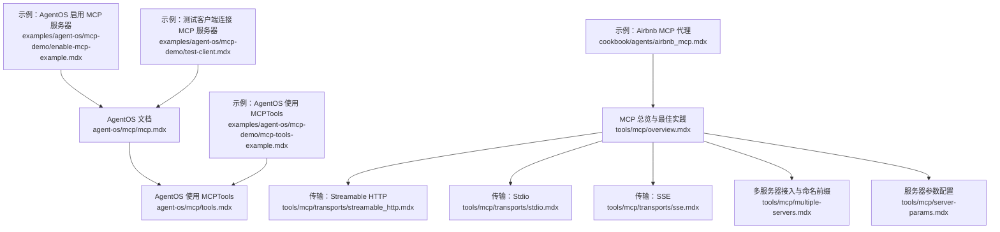
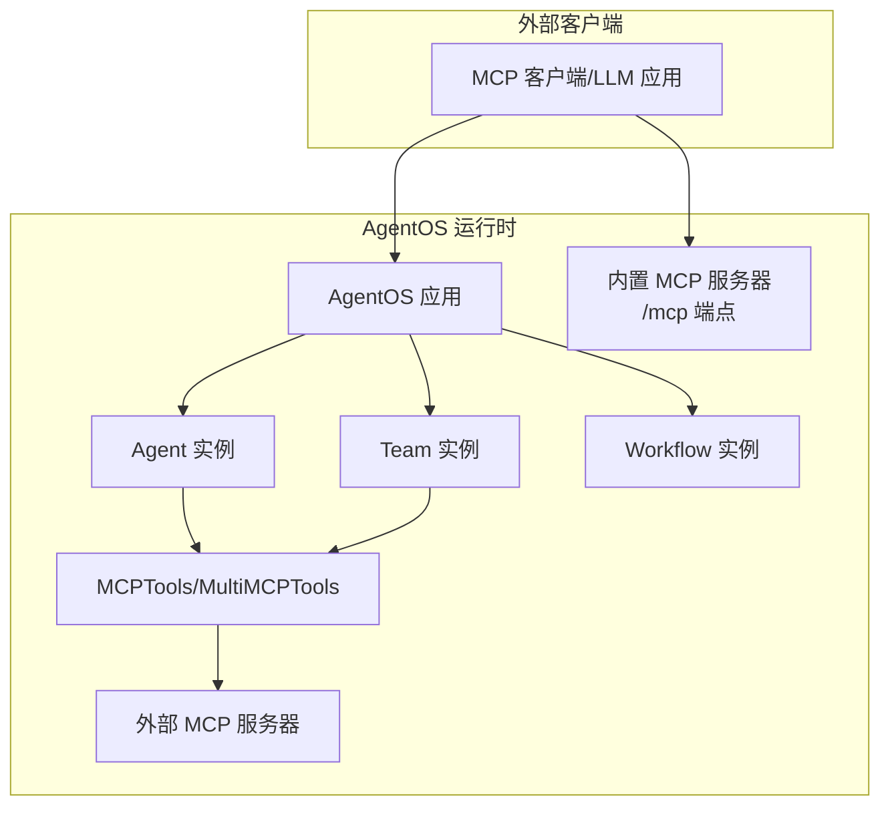
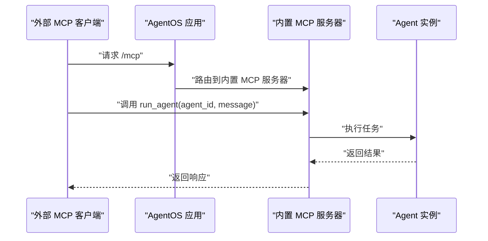
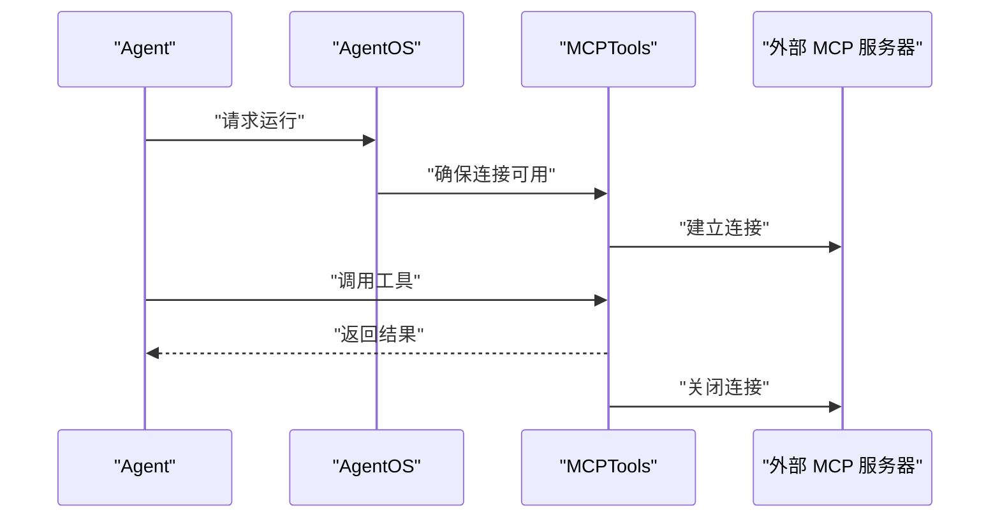
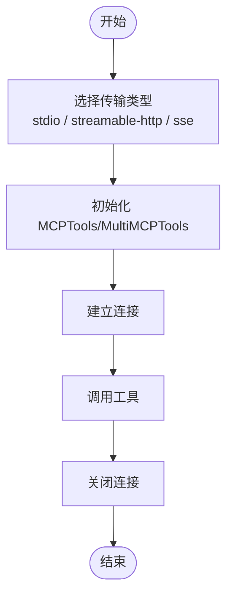
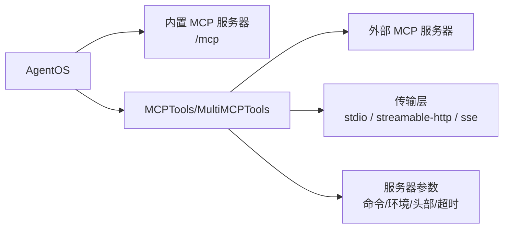

# MCP 协议支持

<cite>
**本文引用的文件**
- [agent-os/mcp/mcp.mdx](file://agent-os/mcp/mcp.mdx)
- [agent-os/mcp/tools.mdx](file://agent-os/mcp/tools.mdx)
- [tools/mcp/overview.mdx](file://tools/mcp/overview.mdx)
- [tools/mcp/transports/streamable_http.mdx](file://tools/mcp/transports/streamable_http.mdx)
- [tools/mcp/transports/stdio.mdx](file://tools/mcp/transports/stdio.mdx)
- [tools/mcp/transports/sse.mdx](file://tools/mcp/transports/sse.mdx)
- [tools/mcp/server-params.mdx](file://tools/mcp/server-params.mdx)
- [tools/mcp/multiple-servers.mdx](file://tools/mcp/multiple-servers.mdx)
- [cookbook/agents/airbnb_mcp.mdx](file://cookbook/agents/airbnb_mcp.mdx)
- [examples/agent-os/mcp-demo/enable-mcp-example.mdx](file://examples/agent-os/mcp-demo/enable-mcp-example.mdx)
- [examples/agent-os/mcp-demo/mcp-tools-example.mdx](file://examples/agent-os/mcp-demo/mcp-tools-example.mdx)
- [examples/agent-os/mcp-demo/test-client.mdx](file://examples/agent-os/mcp-demo/test-client.mdx)
</cite>

## 目录
1. [简介](#简介)
2. [项目结构](#项目结构)
3. [核心组件](#核心组件)
4. [架构总览](#架构总览)
5. [详细组件分析](#详细组件分析)
6. [依赖关系分析](#依赖关系分析)
7. [性能考量](#性能考量)
8. [故障排除指南](#故障排除指南)
9. [结论](#结论)
10. [附录](#附录)

## 简介
本技术文档围绕 AgentOS 对 Model Context Protocol（MCP）的支持进行系统化说明，覆盖以下主题：
- 如何在 AgentOS 中启用并配置 MCP 服务器端，使其作为 LLM 友好的 MCP 服务对外提供能力
- 如何在 AgentOS 内部使用 MCPTools 接入外部 MCP 服务器，并管理连接生命周期
- MCP 工具的开发与集成要点：工具定义、参数传递、结果处理
- MCP 协议的优势与适用场景，以及与传统工具调用方式的区别
- 实际集成示例与常见问题排查

## 项目结构
与 MCP 支持直接相关的文档主要分布在如下位置：
- AgentOS 层面的 MCP 服务器启用与内置工具说明
- MCPTools 在 AgentOS 中的使用与生命周期管理
- MCP 传输层（stdio、Streamable HTTP、SSE）的使用与示例
- 多服务器接入与命名前缀策略
- 典型业务场景示例（如 Airbnb 搜索）

图表来源
- [agent-os/mcp/mcp.mdx:1-146](file://agent-os/mcp/mcp.mdx#L1-L146)
- [agent-os/mcp/tools.mdx:1-57](file://agent-os/mcp/tools.mdx#L1-L57)
- [tools/mcp/overview.mdx:1-257](file://tools/mcp/overview.mdx#L1-L257)
- [tools/mcp/transports/streamable_http.mdx:1-155](file://tools/mcp/transports/streamable_http.mdx#L1-L155)
- [tools/mcp/transports/stdio.mdx:1-82](file://tools/mcp/transports/stdio.mdx#L1-L82)
- [tools/mcp/transports/sse.mdx:1-157](file://tools/mcp/transports/sse.mdx#L1-L157)
- [tools/mcp/multiple-servers.mdx:164-191](file://tools/mcp/multiple-servers.mdx#L164-L191)
- [tools/mcp/server-params.mdx:1-24](file://tools/mcp/server-params.mdx#L1-L24)
- [cookbook/agents/airbnb_mcp.mdx:1-87](file://cookbook/agents/airbnb_mcp.mdx#L1-L87)
- [examples/agent-os/mcp-demo/enable-mcp-example.mdx:1-75](file://examples/agent-os/mcp-demo/enable-mcp-example.mdx#L1-L75)
- [examples/agent-os/mcp-demo/mcp-tools-example.mdx:1-75](file://examples/agent-os/mcp-demo/mcp-tools-example.mdx#L1-L75)
- [examples/agent-os/mcp-demo/test-client.mdx:1-31](file://examples/agent-os/mcp-demo/test-client.mdx#L1-L31)

章节来源
- [agent-os/mcp/mcp.mdx:1-146](file://agent-os/mcp/mcp.mdx#L1-L146)
- [agent-os/mcp/tools.mdx:1-57](file://agent-os/mcp/tools.mdx#L1-L57)
- [tools/mcp/overview.mdx:1-257](file://tools/mcp/overview.mdx#L1-L257)

## 核心组件
- AgentOS 作为 MCP 服务器
  - 通过在创建 AgentOS 实例时设置启用标志，即可暴露一个 LLM 友好的 MCP 服务端点
  - 默认以 API 形式运行，MCP 服务器作为可选扩展
- AgentOS 内部使用 MCPTools
  - 在 AgentOS 中使用 MCPTools 无需手动管理连接生命周期，由 AgentOS 自动处理
  - 若使用 MCPTools，不建议在 serve 时开启自动重载，避免 FastAPI 生命周期中断 MCP 连接
- MCP 传输层
  - 支持 stdio、Streamable HTTP、SSE 三种传输方式
  - 推荐优先使用 Streamable HTTP；SSE 已不再推荐
- 多服务器接入与命名前缀
  - 通过 MultiMCPTools 同时连接多个不同传输或同种传输的 MCP 服务器
  - 使用工具名前缀避免工具名称冲突

章节来源
- [agent-os/mcp/mcp.mdx:7-146](file://agent-os/mcp/mcp.mdx#L7-L146)
- [agent-os/mcp/tools.mdx:1-57](file://agent-os/mcp/tools.mdx#L1-L57)
- [tools/mcp/overview.mdx:212-257](file://tools/mcp/overview.mdx#L212-L257)
- [tools/mcp/transports/streamable_http.mdx:1-155](file://tools/mcp/transports/streamable_http.mdx#L1-L155)
- [tools/mcp/transports/stdio.mdx:1-82](file://tools/mcp/transports/stdio.mdx#L1-L82)
- [tools/mcp/transports/sse.mdx:1-157](file://tools/mcp/transports/sse.mdx#L1-L157)
- [tools/mcp/multiple-servers.mdx:164-191](file://tools/mcp/multiple-servers.mdx#L164-L191)

## 架构总览
下图展示了 AgentOS 作为 MCP 服务器与外部客户端之间的交互，以及 AgentOS 内部通过 MCPTools 接入外部 MCP 服务器的两种模式。

图表来源
- [agent-os/mcp/mcp.mdx:22-58](file://agent-os/mcp/mcp.mdx#L22-L58)
- [agent-os/mcp/tools.mdx:18-56](file://agent-os/mcp/tools.mdx#L18-L56)
- [tools/mcp/overview.mdx:1-257](file://tools/mcp/overview.mdx#L1-L257)

## 详细组件分析

### 组件一：AgentOS 作为 MCP 服务器
- 启用方式
  - 在创建 AgentOS 实例时设置启用标志，即可暴露 LLM 友好的 MCP 服务端点
- 可用工具
  - 获取 AgentOS 配置
  - 运行指定 Agent/Team/Workflow
  - 查询会话列表（按 Agent/Team/Workflow）
  - 用户记忆管理（创建/查询/更新/删除）
- 示例与部署
  - 提供完整的示例工程，启动后可在本地访问 MCP 服务端点
  - 示例中包含数据库初始化、Agent 创建、AgentOS 启动与服务发布

图表来源
- [agent-os/mcp/mcp.mdx:44-58](file://agent-os/mcp/mcp.mdx#L44-L58)
- [examples/agent-os/mcp-demo/enable-mcp-example.mdx:40-60](file://examples/agent-os/mcp-demo/enable-mcp-example.mdx#L40-L60)

章节来源
- [agent-os/mcp/mcp.mdx:7-146](file://agent-os/mcp/mcp.mdx#L7-L146)
- [examples/agent-os/mcp-demo/enable-mcp-example.mdx:1-75](file://examples/agent-os/mcp-demo/enable-mcp-example.mdx#L1-L75)

### 组件二：AgentOS 内部使用 MCPTools
- 生命周期管理
  - 在 AgentOS 中使用 MCPTools 时，AgentOS 自动管理连接生命周期
  - 不建议在 serve 时使用自动重载，避免中断 MCP 连接
- 连接刷新
  - 默认不会自动刷新连接；可通过参数在每次运行时刷新连接
- 使用示例
  - 将 MCPTools 注入 Agent/Team/Workflow，即可在运行时自动建立与关闭连接

图表来源
- [agent-os/mcp/tools.mdx:11-16](file://agent-os/mcp/tools.mdx#L11-L16)
- [tools/mcp/overview.mdx:181-189](file://tools/mcp/overview.mdx#L181-L189)

章节来源
- [agent-os/mcp/tools.mdx:1-57](file://agent-os/mcp/tools.mdx#L1-L57)
- [tools/mcp/overview.mdx:181-211](file://tools/mcp/overview.mdx#L181-L211)

### 组件三：传输层与多服务器接入
- 传输层
  - Streamable HTTP：替代旧版 HTTP+SSE，支持多客户端连接与 SSE 流式推送
  - Stdio：默认传输，适合本地集成
  - SSE：已不再推荐，保留兼容性
- 多服务器接入
  - 使用 MultiMCPTools 同时连接多个 MCP 服务器，支持不同传输混用
  - 可通过工具名前缀避免工具名称冲突

图表来源
- [tools/mcp/transports/streamable_http.mdx:1-155](file://tools/mcp/transports/streamable_http.mdx#L1-L155)
- [tools/mcp/transports/stdio.mdx:1-82](file://tools/mcp/transports/stdio.mdx#L1-L82)
- [tools/mcp/transports/sse.mdx:1-157](file://tools/mcp/transports/sse.mdx#L1-L157)
- [tools/mcp/multiple-servers.mdx:164-191](file://tools/mcp/multiple-servers.mdx#L164-L191)

章节来源
- [tools/mcp/transports/streamable_http.mdx:1-155](file://tools/mcp/transports/streamable_http.mdx#L1-L155)
- [tools/mcp/transports/stdio.mdx:1-82](file://tools/mcp/transports/stdio.mdx#L1-L82)
- [tools/mcp/transports/sse.mdx:1-157](file://tools/mcp/transports/sse.mdx#L1-L157)
- [tools/mcp/multiple-servers.mdx:164-191](file://tools/mcp/multiple-servers.mdx#L164-L191)

### 组件四：工具定义、参数传递与结果处理
- 工具定义
  - 通过 MCP 服务器暴露的工具集，Agent/Team/Workflow 可直接调用
  - 在 AgentOS 作为 MCP 服务器时，内置工具包括运行 Agent/Team/Workflow、会话查询、用户记忆管理等
- 参数传递
  - 通过 MCP 协议的标准参数格式传递给工具
  - 可结合指令与上下文增强工具调用意图表达
- 结果处理
  - 工具返回结果经 MCP 协议封装后返回给调用方
  - 建议在 Agent 层对结果进行结构化解析与呈现

章节来源
- [agent-os/mcp/mcp.mdx:62-146](file://agent-os/mcp/mcp.mdx#L62-L146)
- [tools/mcp/overview.mdx:26-74](file://tools/mcp/overview.mdx#L26-L74)

### 组件五：典型业务场景示例
- Airbnb MCP 代理
  - 使用 MCPTools 连接 Airbnb 的 MCP 服务器，结合推理工具完成搜索与推荐
  - 展示了如何在 Agent 中组合多种工具并组织输出格式

章节来源
- [cookbook/agents/airbnb_mcp.mdx:1-87](file://cookbook/agents/airbnb_mcp.mdx#L1-L87)

## 依赖关系分析
- AgentOS 与 MCP 服务器
  - AgentOS 可作为 MCP 服务器对外提供能力，也可作为客户端接入外部 MCP 服务器
- AgentOS 与 MCPTools
  - 在 AgentOS 中使用 MCPTools 时，AgentOS 负责生命周期管理
- 传输层与服务器参数
  - 不同传输方式影响连接建立、超时与流式行为
  - 服务器参数可细粒度控制命令、环境变量、头部与超时

图表来源
- [agent-os/mcp/mcp.mdx:44-58](file://agent-os/mcp/mcp.mdx#L44-L58)
- [agent-os/mcp/tools.mdx:11-16](file://agent-os/mcp/tools.mdx#L11-L16)
- [tools/mcp/overview.mdx:212-257](file://tools/mcp/overview.mdx#L212-L257)
- [tools/mcp/server-params.mdx:1-24](file://tools/mcp/server-params.mdx#L1-L24)

章节来源
- [agent-os/mcp/mcp.mdx:1-146](file://agent-os/mcp/mcp.mdx#L1-L146)
- [agent-os/mcp/tools.mdx:1-57](file://agent-os/mcp/tools.mdx#L1-L57)
- [tools/mcp/overview.mdx:1-257](file://tools/mcp/overview.mdx#L1-L257)
- [tools/mcp/server-params.mdx:1-24](file://tools/mcp/server-params.mdx#L1-L24)

## 性能考量
- 连接刷新策略
  - 默认不自动刷新连接，避免频繁重建连接带来的开销
  - 如需在每次运行时刷新连接，可启用相应参数，但会增加性能成本
- 传输层选择
  - Streamable HTTP 更适合多客户端与流式场景
  - SSE 已不再推荐，优先采用 Streamable HTTP
- 多服务器接入
  - 使用 MultiMCPTools 时，注意工具名前缀与资源管理，避免工具冲突与资源泄漏

章节来源
- [tools/mcp/overview.mdx:191-211](file://tools/mcp/overview.mdx#L191-L211)
- [tools/mcp/transports/streamable_http.mdx:1-155](file://tools/mcp/transports/streamable_http.mdx#L1-L155)
- [tools/mcp/transports/sse.mdx:1-157](file://tools/mcp/transports/sse.mdx#L1-L157)
- [tools/mcp/multiple-servers.mdx:164-191](file://tools/mcp/multiple-servers.mdx#L164-L191)

## 故障排除指南
- 在 AgentOS 中使用 MCPTools 时不要开启自动重载
  - 原因：自动重载可能中断 MCP 连接，导致生命周期异常
- 连接刷新未生效
  - 确认是否正确设置了刷新参数，或在需要时手动刷新
- 服务器参数配置错误
  - 检查命令、环境变量、头部与超时设置，确保与目标 MCP 服务器要求一致
- 多服务器工具名冲突
  - 使用工具名前缀避免冲突，便于区分不同来源的工具
- 测试连接
  - 可参考示例中的测试客户端，先启动 AgentOS 的 MCP 服务器，再用测试脚本验证连通性

章节来源
- [agent-os/mcp/tools.mdx:13-16](file://agent-os/mcp/tools.mdx#L13-L16)
- [tools/mcp/overview.mdx:191-211](file://tools/mcp/overview.mdx#L191-L211)
- [tools/mcp/server-params.mdx:1-24](file://tools/mcp/server-params.mdx#L1-L24)
- [tools/mcp/multiple-servers.mdx:164-191](file://tools/mcp/multiple-servers.mdx#L164-L191)
- [examples/agent-os/mcp-demo/test-client.mdx:1-31](file://examples/agent-os/mcp-demo/test-client.mdx#L1-L31)

## 结论
- AgentOS 对 MCP 的支持提供了“既可作为 MCP 服务器对外提供能力，又可作为 MCP 客户端接入外部系统”的双能力模型
- 在 AgentOS 中使用 MCPTools 时，生命周期管理由框架自动处理，简化了开发复杂度
- 通过传输层与服务器参数的灵活配置，可以适配本地与云端的多样化部署场景
- 借助示例与最佳实践，开发者可快速完成 MCP 工具的开发与集成，并在生产环境中获得稳定与高性能的表现

## 附录
- 快速开始
  - 启用 AgentOS 的 MCP 服务器端点
  - 在 AgentOS 中注入 MCPTools 并运行
  - 使用示例工程验证 MCP 服务器与客户端连通性
- 相关示例路径
  - AgentOS 启用 MCP 服务器示例
  - AgentOS 使用 MCPTools 示例
  - 测试客户端连接示例
  - Airbnb MCP 代理示例

章节来源
- [examples/agent-os/mcp-demo/enable-mcp-example.mdx:1-75](file://examples/agent-os/mcp-demo/enable-mcp-example.mdx#L1-L75)
- [examples/agent-os/mcp-demo/mcp-tools-example.mdx:1-75](file://examples/agent-os/mcp-demo/mcp-tools-example.mdx#L1-L75)
- [examples/agent-os/mcp-demo/test-client.mdx:1-31](file://examples/agent-os/mcp-demo/test-client.mdx#L1-L31)
- [cookbook/agents/airbnb_mcp.mdx:1-87](file://cookbook/agents/airbnb_mcp.mdx#L1-L87)