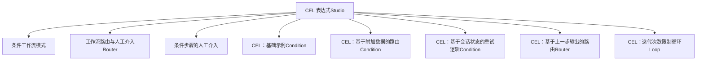
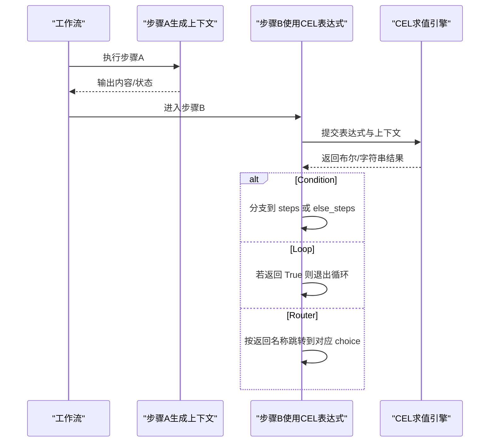
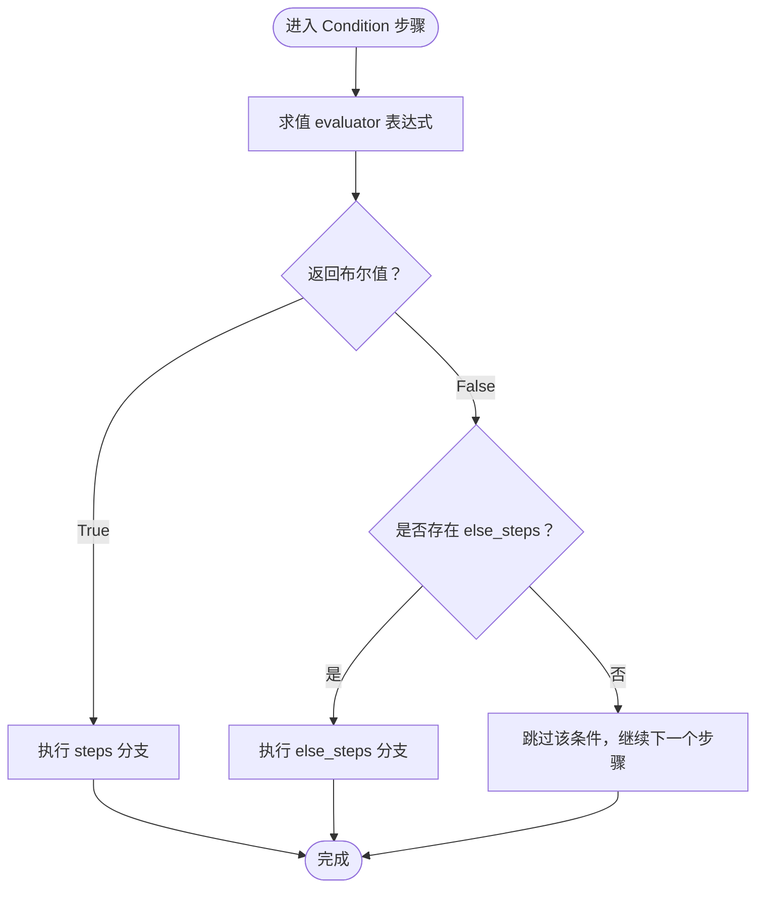
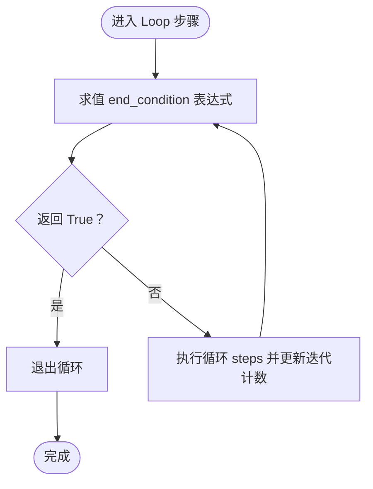
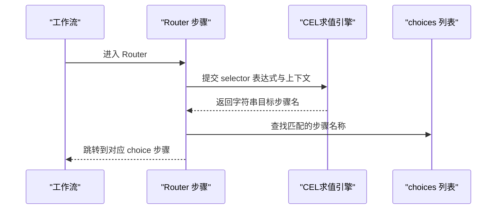
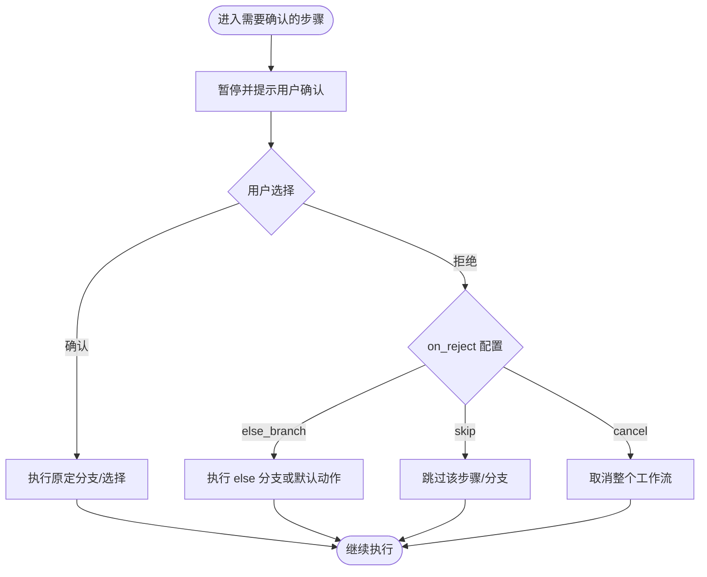
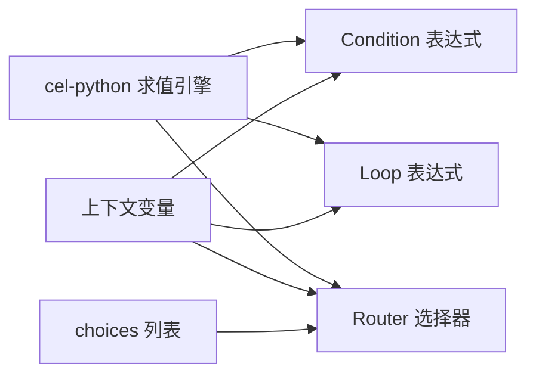

# CEL 表达式

<cite>
**本文引用的文件**
- [CEL 表达式（Studio）](file://agent-os/studio/cel-expressions.mdx)
- [条件工作流](file://workflows/workflow-patterns/conditional-workflow.mdx)
- [工作流路由与人工介入（Router）](file://workflows/hitl/router.mdx)
- [条件步骤的人工介入](file://workflows/hitl/condition.mdx)
- [CEL：基础示例](file://examples/workflows/cel-expressions/condition/cel-basic.mdx)
- [CEL：基于附加数据的路由](file://examples/workflows/cel-expressions/condition/cel-additional-data.mdx)
- [CEL：基于会话状态的重试逻辑](file://examples/workflows/cel-expressions/condition/cel-session-state.mdx)
- [CEL：基于上一步输出的路由](file://examples/workflows/cel-expressions/router/cel-previous-step-route.mdx)
- [CEL：迭代次数限制循环](file://examples/workflows/cel-expressions/loop/cel-iteration-limit.mdx)
</cite>

## 目录
1. [简介](#简介)
2. [项目结构](#项目结构)
3. [核心组件](#核心组件)
4. [架构总览](#架构总览)
5. [详细组件分析](#详细组件分析)
6. [依赖关系分析](#依赖关系分析)
7. [性能考量](#性能考量)
8. [故障排查指南](#故障排查指南)
9. [结论](#结论)
10. [附录](#附录)

## 简介
本篇文档系统化阐述 AgentOS Studio 中的 CEL（Common Expression Language）表达式能力，聚焦于在工作流中作为“求值器（evaluator）”“结束条件（end_condition）”“选择器（selector）”的使用方式。CEL 表达式以字符串形式存在，具备完全可序列化特性，既可在 Studio 中可视化编辑，也可持久化存储。本文覆盖：
- 表达式适用的三类步骤：Condition（条件）、Loop（循环）、Router（路由）
- 各步骤可用的上下文变量与返回类型要求
- 条件逻辑、动态配置与数据处理的实践范式
- 常见场景：工作流条件判断、团队路由决策、代理行为控制
- 编写指南、调试技巧与常见错误排查
- 丰富的表达式示例与实际应用路径

## 项目结构
围绕 CEL 的文档与示例主要分布在以下位置：
- Studio 文档：CEL 表达式概述、上下文变量、典型用法
- 工作流模式：条件分支与路由的通用说明
- 人工介入（HITL）：Router 与 Condition 的用户确认/拒绝流程
- 示例：Condition/Loop/Router 的可运行示例

图表来源
- [CEL 表达式（Studio）:1-272](file://agent-os/studio/cel-expressions.mdx#L1-L272)
- [条件工作流:1-37](file://workflows/workflow-patterns/conditional-workflow.mdx#L1-L37)
- [工作流路由与人工介入（Router）:142-184](file://workflows/hitl/router.mdx#L142-L184)
- [条件步骤的人工介入:26-107](file://workflows/hitl/condition.mdx#L26-L107)
- [CEL：基础示例:1-89](file://examples/workflows/cel-expressions/condition/cel-basic.mdx#L1-L89)
- [CEL：基于附加数据的路由:44-92](file://examples/workflows/cel-expressions/condition/cel-additional-data.mdx#L44-L92)
- [CEL：基于会话状态的重试逻辑:74-120](file://examples/workflows/cel-expressions/condition/cel-session-state.mdx#L74-L120)
- [CEL：基于上一步输出的路由:1-110](file://examples/workflows/cel-expressions/router/cel-previous-step-route.mdx#L1-L110)
- [CEL：迭代次数限制循环:1-79](file://examples/workflows/cel-expressions/loop/cel-iteration-limit.mdx#L1-L79)

章节来源
- [CEL 表达式（Studio）:1-272](file://agent-os/studio/cel-expressions.mdx#L1-L272)

## 核心组件
- 步骤类型与参数
  - Condition：evaluator 必须返回布尔值；True 执行 steps，False 执行 else_steps（若提供）
  - Loop：end_condition 必须返回布尔值；True 退出循环
  - Router：selector 必须返回字符串，表示从 choices 中选择的步骤名称
- 上下文变量（按步骤类型暴露）
  - Condition/Router：input、previous_step_content、previous_step_outputs、additional_data、session_state
  - Router：step_choices（choices 列表）
  - Loop：current_iteration、max_iterations、all_success、last_step_content、step_outputs

章节来源
- [CEL 表达式（Studio）:17-40](file://agent-os/studio/cel-expressions.mdx#L17-L40)

## 架构总览
CEL 表达式在工作流执行时，由步骤在各自上下文中解析表达式并依据返回值决定后续执行路径或退出条件。

图表来源
- [CEL 表达式（Studio）:17-40](file://agent-os/studio/cel-expressions.mdx#L17-L40)

## 详细组件分析

### Condition（条件）与 CEL 表达式
- 作用：根据输入、历史输出、附加数据或会话状态进行布尔判断，决定执行哪条分支
- 典型场景
  - 基于输入内容的路由（如关键词检测）
  - 基于上一步输出的分类路由（先分类再路由）
  - 基于附加数据的优先级路由
  - 基于会话状态的重试/回退策略

图表来源
- [CEL 表达式（Studio）:41-138](file://agent-os/studio/cel-expressions.mdx#L41-L138)
- [条件工作流:21-28](file://workflows/workflow-patterns/conditional-workflow.mdx#L21-L28)

章节来源
- [CEL 表达式（Studio）:41-138](file://agent-os/studio/cel-expressions.mdx#L41-L138)
- [条件工作流:21-28](file://workflows/workflow-patterns/conditional-workflow.mdx#L21-L28)
- [CEL：基础示例:44-75](file://examples/workflows/cel-expressions/condition/cel-basic.mdx#L44-L75)
- [CEL：基于附加数据的路由:44-79](file://examples/workflows/cel-expressions/condition/cel-additional-data.mdx#L44-L79)
- [CEL：基于会话状态的重试逻辑:74-107](file://examples/workflows/cel-expressions/condition/cel-session-state.mdx#L74-L107)

### Loop（循环）与 CEL 表达式
- 作用：通过 end_condition 决定是否退出循环，结合 current_iteration、max_iterations、all_success 等上下文变量实现灵活的循环控制
- 典型场景
  - 固定迭代上限（如 current_iteration 达到阈值）
  - 基于输出关键字的条件退出（如 last_step_content 包含特定词）
  - 复合条件（如 all_success 且达到最小迭代次数）

图表来源
- [CEL 表达式（Studio）:140-201](file://agent-os/studio/cel-expressions.mdx#L140-L201)
- [CEL：迭代次数限制循环:40-53](file://examples/workflows/cel-expressions/loop/cel-iteration-limit.mdx#L40-L53)

章节来源
- [CEL 表达式（Studio）:140-201](file://agent-os/studio/cel-expressions.mdx#L140-L201)
- [CEL：迭代次数限制循环:40-64](file://examples/workflows/cel-expressions/loop/cel-iteration-limit.mdx#L40-L64)

### Router（路由）与 CEL 表达式
- 作用：selector 返回一个字符串，匹配 choices 中某一步骤名称，从而动态选择下一步
- 典型场景
  - 基于会话状态选择处理风格
  - 基于输入内容进行二元或多路路由
  - 使用 step_choices 索引引用步骤名，避免硬编码
  - 结合上一步输出进行命名路由（通过 previous_step_outputs）

图表来源
- [CEL 表达式（Studio）:203-265](file://agent-os/studio/cel-expressions.mdx#L203-L265)
- [CEL：基于上一步输出的路由:65-84](file://examples/workflows/cel-expressions/router/cel-previous-step-route.mdx#L65-L84)

章节来源
- [CEL 表达式（Studio）:203-265](file://agent-os/studio/cel-expressions.mdx#L203-L265)
- [CEL：基于上一步输出的路由:65-96](file://examples/workflows/cel-expressions/router/cel-previous-step-route.mdx#L65-L96)

### 人工介入（HITL）与 CEL 的协作
- Router/HITL：支持用户对路由决策进行确认/拒绝，或在执行前暂停等待人工确认
- Condition/HITL：支持用户对分支选择进行确认/拒绝，并可配置拒绝后的动作（走 else 分支、跳过、取消）

图表来源
- [工作流路由与人工介入（Router）:142-184](file://workflows/hitl/router.mdx#L142-L184)
- [条件步骤的人工介入:26-107](file://workflows/hitl/condition.mdx#L26-L107)

章节来源
- [工作流路由与人工介入（Router）:142-184](file://workflows/hitl/router.mdx#L142-L184)
- [条件步骤的人工介入:26-107](file://workflows/hitl/condition.mdx#L26-L107)

## 依赖关系分析
- 组件耦合
  - Condition/Loop/Router 依赖 CEL 求值引擎对表达式进行解析与执行
  - 表达式依赖步骤上下文变量（input、previous_step_*、additional_data、session_state、step_choices 等）
  - Router 依赖 choices 列表的名称一致性
- 外部依赖
  - 需要安装 cel-python 以启用 CEL 表达式能力
  - 工作流运行时需正确传递上下文（如 session_state、additional_data）

图表来源
- [CEL 表达式（Studio）:11-13](file://agent-os/studio/cel-expressions.mdx#L11-L13)
- [CEL 表达式（Studio）:17-40](file://agent-os/studio/cel-expressions.mdx#L17-L40)

章节来源
- [CEL 表达式（Studio）:11-13](file://agent-os/studio/cel-expressions.mdx#L11-L13)
- [CEL 表达式（Studio）:17-40](file://agent-os/studio/cel-expressions.mdx#L17-L40)

## 性能考量
- 表达式复杂度控制：尽量使用简单布尔/字符串判断，避免在表达式中进行重型计算
- 上下文访问优化：仅访问必要的 previous_step_outputs/session_state 字段，减少不必要的跨步数据读取
- 循环边界：合理设置 max_iterations 与 end_condition，防止无限循环或过度迭代
- 可观测性：在关键节点打印/记录表达式输入与返回值，便于定位问题

## 故障排查指南
- 表达式未生效
  - 确认已安装 cel-python 且 CEL_AVAILABLE 为真
  - 确认表达式返回类型符合步骤要求（Condition/Loop 返回布尔；Router 返回字符串）
- 变量未定义
  - 检查当前步骤是否暴露该上下文变量（例如 Loop 不暴露 input/previous_step_*）
  - 对于 Router，确保 selector 返回的名称存在于 choices 中
- 路由不生效
  - 检查 ternary 表达式分支是否覆盖所有情况
  - 使用 step_choices 索引时，确保索引有效且 choices 长度足够
- 循环未退出
  - 检查 end_condition 是否受 current_iteration/all_success 等变量影响
  - 确保循环 steps 中有状态变化（如 last_step_content 更新），使退出条件可达成
- 人工介入（HITL）冲突
  - 当 requires_confirmation=True 时，evaluator/selector 将被忽略，用户决策优先
  - on_reject 配置会影响拒绝后的动作（else_branch/skip/cancel）

章节来源
- [CEL 表达式（Studio）:11-13](file://agent-os/studio/cel-expressions.mdx#L11-L13)
- [CEL 表达式（Studio）:17-40](file://agent-os/studio/cel-expressions.mdx#L17-L40)
- [条件步骤的人工介入:105-107](file://workflows/hitl/condition.mdx#L105-L107)
- [工作流路由与人工介入（Router）:142-184](file://workflows/hitl/router.mdx#L142-L184)

## 结论
CEL 表达式为 AgentOS Studio 的工作流提供了强大而灵活的动态控制能力。通过合理利用上下文变量与表达式返回类型约束，可以在不编写复杂代码的情况下实现条件分支、循环控制与路由选择。配合人工介入（HITL）机制，既能保证自动化效率，也能满足关键决策的人工把关需求。建议在实践中遵循“简单表达式、明确返回类型、清晰路由映射”的原则，并结合示例文件进行快速验证与迭代。

## 附录

### 表达式编写指南
- 优先使用字符串方法（如 contains）进行内容匹配
- 使用比较运算符（>, <, >=, <=, ==, !=）进行数值/布尔判断
- 使用三元运算符进行二选一路由
- 使用 step_choices 索引或 previous_step_outputs 映射进行动态选择
- 在 Loop 中结合 current_iteration、all_success、last_step_content 实现复合退出条件

章节来源
- [CEL 表达式（Studio）:41-265](file://agent-os/studio/cel-expressions.mdx#L41-L265)

### 实际应用场景与示例路径
- 基础条件路由（输入关键词检测）
  - [CEL：基础示例:44-75](file://examples/workflows/cel-expressions/condition/cel-basic.mdx#L44-L75)
- 基于附加数据的优先级路由
  - [CEL：基于附加数据的路由:44-79](file://examples/workflows/cel-expressions/condition/cel-additional-data.mdx#L44-L79)
- 基于会话状态的重试逻辑
  - [CEL：基于会话状态的重试逻辑:74-107](file://examples/workflows/cel-expressions/condition/cel-session-state.mdx#L74-L107)
- 基于上一步输出的多路路由
  - [CEL：基于上一步输出的路由:65-96](file://examples/workflows/cel-expressions/router/cel-previous-step-route.mdx#L65-L96)
- 循环退出条件（迭代次数限制）
  - [CEL：迭代次数限制循环:40-64](file://examples/workflows/cel-expressions/loop/cel-iteration-limit.mdx#L40-L64)