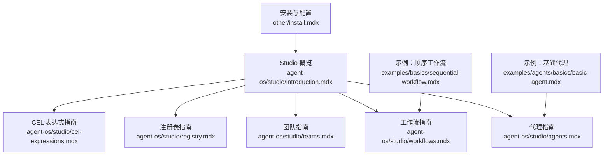
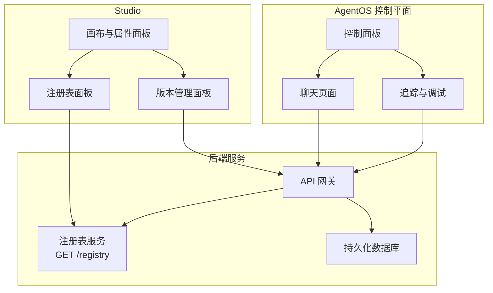
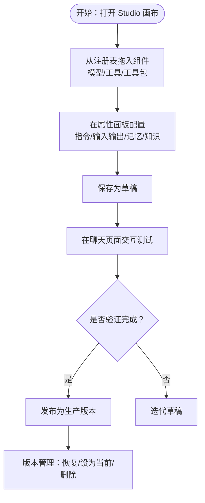
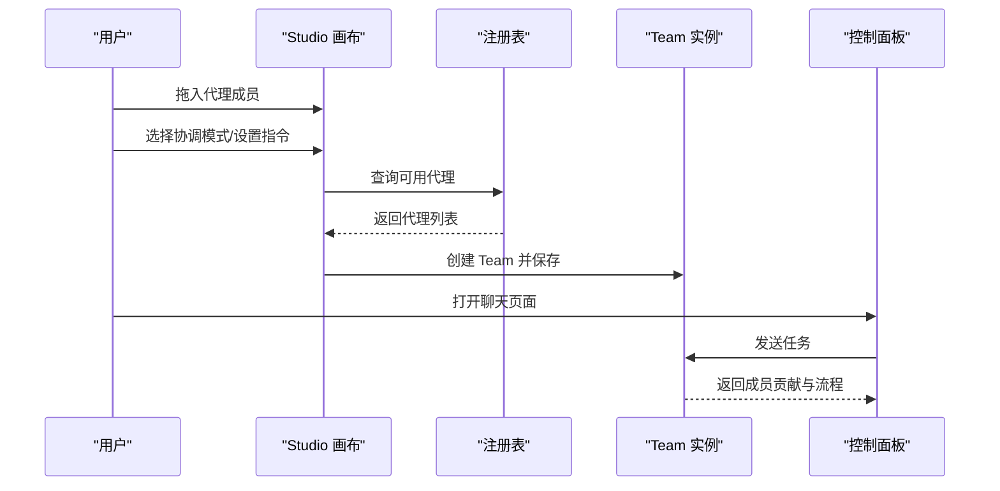
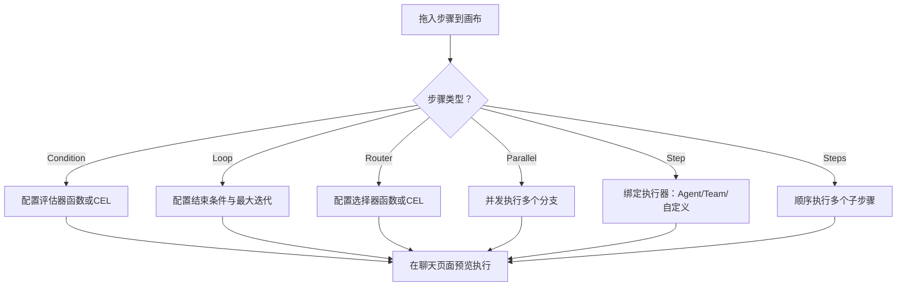
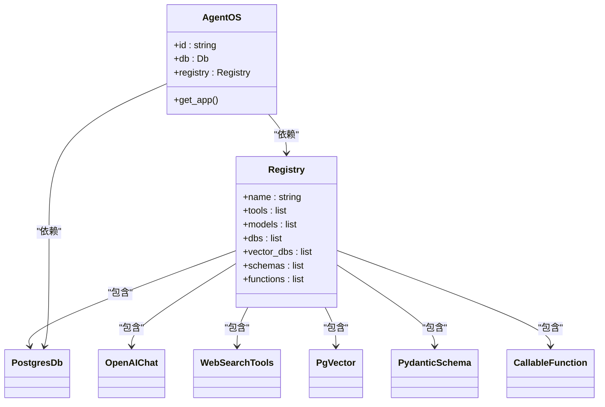
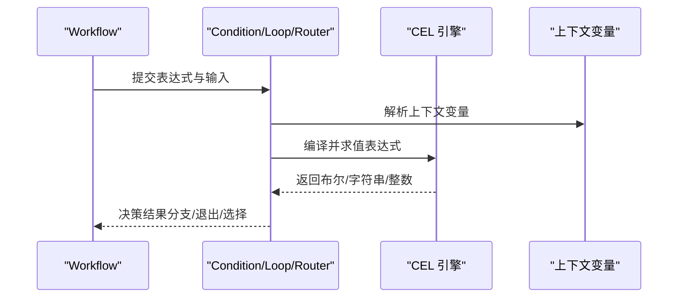
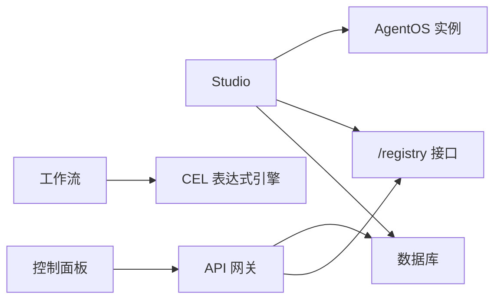

# Studio 开发工具

<cite>
**本文档引用的文件**
- [agent-os/studio/introduction.mdx](file://agent-os/studio/introduction.mdx)
- [agent-os/studio/agents.mdx](file://agent-os/studio/agents.mdx)
- [agent-os/studio/teams.mdx](file://agent-os/studio/teams.mdx)
- [agent-os/studio/workflows.mdx](file://agent-os/studio/workflows.mdx)
- [agent-os/studio/registry.mdx](file://agent-os/studio/registry.mdx)
- [agent-os/studio/cel-expressions.mdx](file://agent-os/studio/cel-expressions.mdx)
- [other/install.mdx](file://other/install.mdx)
- [examples/basics/sequential-workflow.mdx](file://examples/basics/sequential-workflow.mdx)
- [examples/agents/basics/basic-agent.mdx](file://examples/agents/basics/basic-agent.mdx)
</cite>

## 目录
1. [简介](#简介)
2. [项目结构](#项目结构)
3. [核心组件](#核心组件)
4. [架构总览](#架构总览)
5. [详细组件分析](#详细组件分析)
6. [依赖关系分析](#依赖关系分析)
7. [性能考虑](#性能考虑)
8. [故障排查指南](#故障排查指南)
9. [结论](#结论)
10. [附录](#附录)

## 简介
本文件面向 AgentOS Studio 可视化开发工具，系统性阐述其在构建代理（Agent）、团队（Team）与工作流（Workflow）方面的可视化编辑能力，包括拖拽式配置与实时预览；注册表（Registry）管理功能，涵盖组件的保存、加载与版本控制；CEL 表达式在条件逻辑与动态配置中的应用；安装与配置指南，以及与命令行工具的对比与选择建议；并提供可操作的开发工作流程示例。

## 项目结构
本仓库中与 Studio 相关的内容主要集中在 agent-os/studio 目录下，辅以其他模块的参考文档与示例。整体组织方式为“概念概览 + 组件指南 + 注册表 + 表达式 + 安装与示例”。

图表来源
- [agent-os/studio/introduction.mdx:1-103](file://agent-os/studio/introduction.mdx#L1-L103)
- [agent-os/studio/agents.mdx:1-66](file://agent-os/studio/agents.mdx#L1-L66)
- [agent-os/studio/teams.mdx:1-79](file://agent-os/studio/teams.mdx#L1-L79)
- [agent-os/studio/workflows.mdx:1-80](file://agent-os/studio/workflows.mdx#L1-L80)
- [agent-os/studio/registry.mdx:1-85](file://agent-os/studio/registry.mdx#L1-L85)
- [agent-os/studio/cel-expressions.mdx:1-272](file://agent-os/studio/cel-expressions.mdx#L1-L272)
- [other/install.mdx:1-56](file://other/install.mdx#L1-L56)
- [examples/basics/sequential-workflow.mdx:1-193](file://examples/basics/sequential-workflow.mdx#L1-L193)
- [examples/agents/basics/basic-agent.mdx:1-40](file://examples/agents/basics/basic-agent.mdx#L1-L40)

章节来源
- [agent-os/studio/introduction.mdx:1-103](file://agent-os/studio/introduction.mdx#L1-L103)
- [other/install.mdx:1-56](file://other/install.mdx#L1-L56)

## 核心组件
- 代理（Agent）：通过模型、工具、指令、结构化输入输出、记忆与知识库进行可视化构建，支持直接聊天、加入团队、在工作流中执行。
- 团队（Team）：多代理协作的可视化编排，支持协调模式（coordinate/route/collaborate），可从注册表拖入成员并配置领导指令与成功标准。
- 工作流（Workflow）：基于步骤的可视化设计，支持 Step、Steps、Condition、Loop、Router、Parallel 等类型，可嵌套组合；支持 CEL 表达式作为评估器、结束条件与选择器。
- 注册表（Registry）：集中管理非序列化组件（工具、模型、数据库、向量库、模式、函数），提供查询与分页接口，供 Studio 拖拽使用。
- 版本与生命周期：从构建草稿、测试、发布到版本管理（恢复、设为当前、删除）的完整闭环。

章节来源
- [agent-os/studio/agents.mdx:1-66](file://agent-os/studio/agents.mdx#L1-L66)
- [agent-os/studio/teams.mdx:1-79](file://agent-os/studio/teams.mdx#L1-L79)
- [agent-os/studio/workflows.mdx:1-80](file://agent-os/studio/workflows.mdx#L1-L80)
- [agent-os/studio/registry.mdx:1-85](file://agent-os/studio/registry.mdx#L1-L85)
- [agent-os/studio/introduction.mdx:51-93](file://agent-os/studio/introduction.mdx#L51-L93)

## 架构总览
Studio 作为 AgentOS 的可视化编辑器，连接运行中的 AgentOS 实例，并通过注册表填充可用组件。用户在画布上拖拽、连线、配置，保存为草稿或发布版本，随后可在控制面板中进行交互测试与调试。

图表来源
- [agent-os/studio/introduction.mdx:17-25](file://agent-os/studio/introduction.mdx#L17-L25)
- [agent-os/studio/registry.mdx:54-79](file://agent-os/studio/registry.mdx#L54-L79)

## 详细组件分析

### 代理（Agent）可视化编辑
- 构建入口：从注册表拖入模型、工具、工具包；在属性面板配置系统级指令、结构化输入输出模式、记忆与知识库。
- 使用方式：可直接在聊天页面与代理交互；可加入团队；可作为工作流步骤执行。
- 代码等价：Studio 构建的代理即为 SDK 中的 Agent 实例，便于迁移与扩展。

图表来源
- [agent-os/studio/agents.mdx:9-42](file://agent-os/studio/agents.mdx#L9-L42)
- [agent-os/studio/introduction.mdx:59-93](file://agent-os/studio/introduction.mdx#L59-L93)

章节来源
- [agent-os/studio/agents.mdx:1-66](file://agent-os/studio/agents.mdx#L1-L66)

### 团队（Team）可视化编排
- 成员组成：从注册表拖入多个代理作为成员。
- 协调模式：支持 coordinate（协调）、route（路由）、collaborate（协作）三种模式。
- 成功标准：定义任务完成条件，便于自动化与监控。
- 使用场景：可直接聊天、在工作流中作为步骤执行。

图表来源
- [agent-os/studio/teams.mdx:10-40](file://agent-os/studio/teams.mdx#L10-L40)
- [agent-os/studio/registry.mdx:54-79](file://agent-os/studio/registry.mdx#L54-L79)

章节来源
- [agent-os/studio/teams.mdx:1-79](file://agent-os/studio/teams.mdx#L1-L79)

### 工作流（Workflow）可视化设计
- 步骤类型：Step、Steps、Condition、Loop、Router、Parallel；可嵌套组合。
- 执行器：支持 Agent、Team 或自定义执行器。
- 复杂逻辑：Condition/Loop/Router 可使用 Python 函数或 CEL 表达式作为评估器、结束条件或选择器。
- 实时预览：在聊天页面交互式运行，查看每步结果与日志。

图表来源
- [agent-os/studio/workflows.mdx:8-73](file://agent-os/studio/workflows.mdx#L8-L73)
- [agent-os/studio/cel-expressions.mdx:15-40](file://agent-os/studio/cel-expressions.mdx#L15-L40)

章节来源
- [agent-os/studio/workflows.mdx:1-80](file://agent-os/studio/workflows.mdx#L1-L80)

### 注册表（Registry）管理
- 组件类型：工具、模型、数据库、向量库、模式、函数。
- API：提供 GET /registry 接口，支持按类型、名称过滤与分页。
- 元数据：不同组件返回类型特定元数据，便于 Studio 展示与选择。
- 数据库要求：Studio 需要数据库参数以保存与加载代理、团队与工作流。

图表来源
- [agent-os/studio/registry.mdx:9-41](file://agent-os/studio/registry.mdx#L9-L41)
- [agent-os/studio/introduction.mdx:22-49](file://agent-os/studio/introduction.mdx#L22-L49)

章节来源
- [agent-os/studio/registry.mdx:1-85](file://agent-os/studio/registry.mdx#L1-L85)

### CEL 表达式使用
- 支持范围：Condition（评估器）、Loop（结束条件）、Router（选择器）。
- 上下文变量：根据步骤类型暴露不同的上下文变量（如 input、previous_step_content、additional_data、session_state、step_choices、current_iteration 等）。
- 示例覆盖：输入内容路由、前一步输出路由、附加数据路由、会话状态路由、迭代次数与复合退出条件等。

图表来源
- [agent-os/studio/cel-expressions.mdx:15-40](file://agent-os/studio/cel-expressions.mdx#L15-L40)
- [agent-os/studio/workflows.mdx:33-64](file://agent-os/studio/workflows.mdx#L33-L64)

章节来源
- [agent-os/studio/cel-expressions.mdx:1-272](file://agent-os/studio/cel-expressions.mdx#L1-L272)

## 依赖关系分析
- Studio 依赖 AgentOS 实例与注册表服务，通过 GET /registry 获取可用组件。
- Studio 依赖数据库以持久化草稿与版本信息。
- 工作流复杂逻辑依赖 CEL 表达式引擎与上下文变量解析。
- 控制面板提供聊天、追踪与调试能力，支撑测试与验证。

图表来源
- [agent-os/studio/introduction.mdx:17-25](file://agent-os/studio/introduction.mdx#L17-L25)
- [agent-os/studio/registry.mdx:54-79](file://agent-os/studio/registry.mdx#L54-L79)

章节来源
- [agent-os/studio/introduction.mdx:17-25](file://agent-os/studio/introduction.mdx#L17-L25)
- [agent-os/studio/registry.mdx:54-79](file://agent-os/studio/registry.mdx#L54-L79)

## 性能考虑
- 草稿与版本管理：通过草稿与版本控制减少重复构建成本，提高迭代效率。
- 实时预览：在控制面板进行交互测试，避免离线调试导致的延迟。
- 组件复用：通过注册表统一管理组件，减少重复配置与部署成本。
- 复杂工作流优化：合理使用并行（Parallel）与条件（Condition）减少无效执行路径。

## 故障排查指南
- 测试阶段：在聊天页面与追踪中检查工具调用、模型响应与推理过程，启用调试模式获取详细日志。
- 版本回滚：利用版本历史恢复到之前的稳定版本，再逐步定位问题。
- 组件缺失：确认注册表中组件已正确注册且可被查询；检查过滤参数与分页限制。
- 数据库问题：确保数据库连接正常，草稿与版本信息可读写。

章节来源
- [agent-os/studio/introduction.mdx:63-74](file://agent-os/studio/introduction.mdx#L63-L74)
- [agent-os/studio/registry.mdx:54-79](file://agent-os/studio/registry.mdx#L54-L79)

## 结论
AgentOS Studio 将 AgentOS 的核心能力以可视化方式呈现，结合注册表与版本管理，形成从构建、测试到发布的完整闭环。通过 CEL 表达式与复杂工作流类型，Studio 能够满足从简单代理到复杂自动化系统的开发需求。配合控制面板的实时预览与调试能力，开发者可以高效地构建生产级智能体系统。

## 附录

### 安装与配置指南
- 建议使用虚拟环境安装 SDK 并升级 pip，确保依赖兼容。
- 在本地或云端部署 AgentOS 实例，准备数据库与注册表。
- 启动控制面板，打开 Studio 进行可视化构建。

章节来源
- [other/install.mdx:1-56](file://other/install.mdx#L1-L56)

### 与命令行工具的对比与选择建议
- 适合使用 Studio 的场景：
  - 快速原型与可视化编排，降低对代码的依赖。
  - 需要频繁调整与预览的迭代周期。
  - 团队协作中需要统一的可视化规范与版本管理。
- 适合使用命令行/SDK 的场景：
  - 对底层细节有强约束（如自定义执行器、复杂函数逻辑）。
  - 需要与现有 CI/CD 流水线深度集成。
  - 高度定制化的部署与运维需求。

### 实际开发工作流程示例
- 顺序工作流示例：展示三步研究流水线（数据收集 → 分析 → 报告撰写），强调步骤顺序与数据流转。
- 基础代理示例：快速创建一个最小可用代理并进行交互测试。

章节来源
- [examples/basics/sequential-workflow.mdx:1-193](file://examples/basics/sequential-workflow.mdx#L1-L193)
- [examples/agents/basics/basic-agent.mdx:1-40](file://examples/agents/basics/basic-agent.mdx#L1-L40)