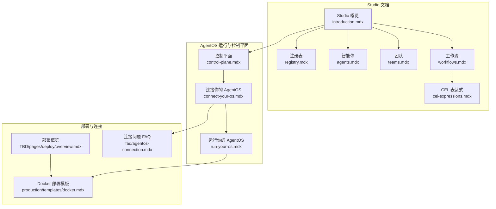
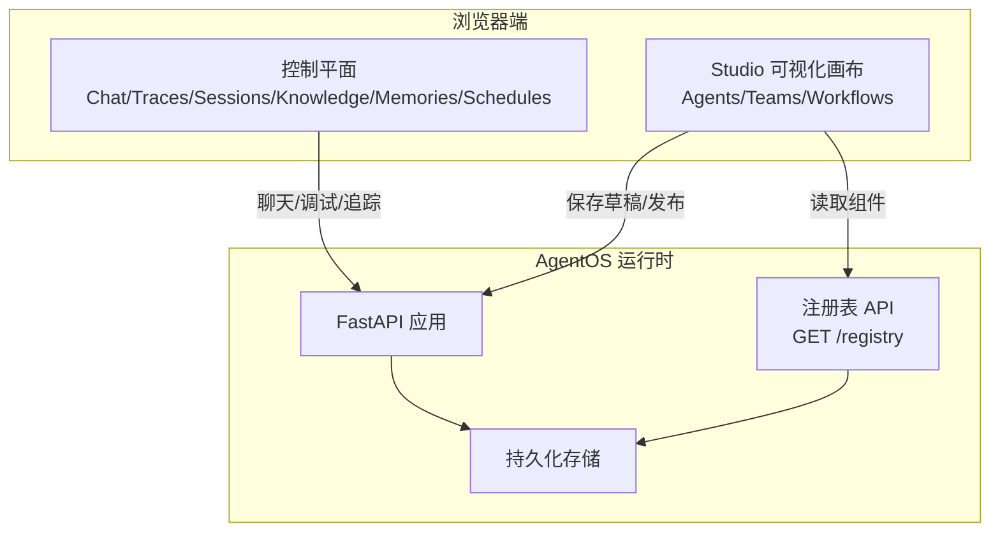
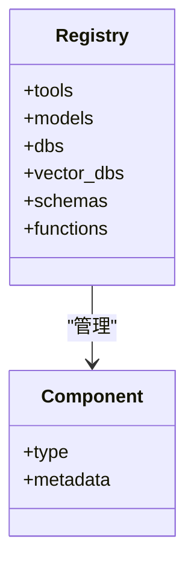
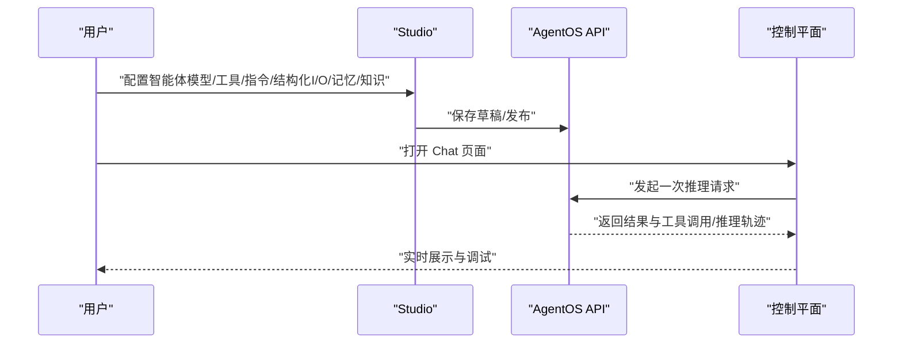
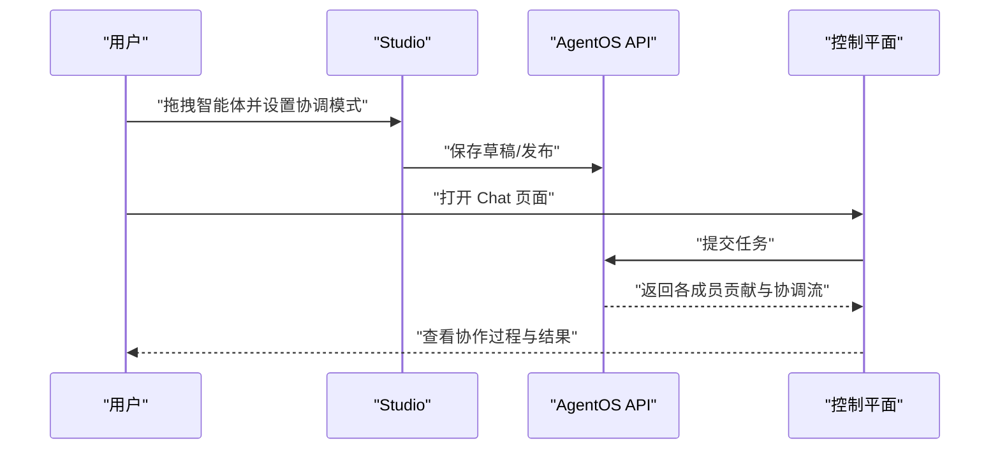
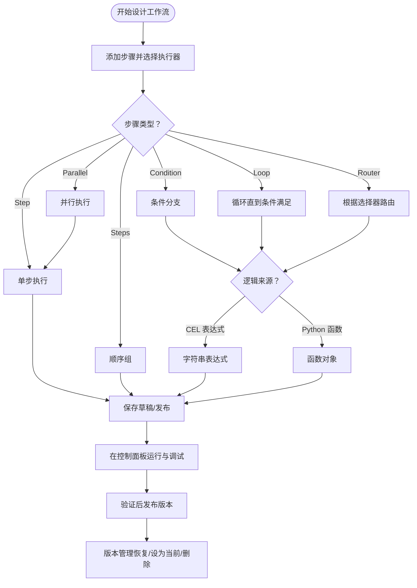
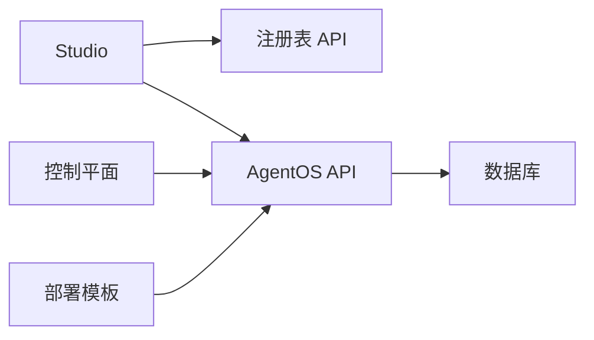

# Studio 概述

<cite>
**本文引用的文件**
- [agent-os/studio/introduction.mdx](file://agent-os/studio/introduction.mdx)
- [agent-os/studio/registry.mdx](file://agent-os/studio/registry.mdx)
- [agent-os/studio/agents.mdx](file://agent-os/studio/agents.mdx)
- [agent-os/studio/teams.mdx](file://agent-os/studio/teams.mdx)
- [agent-os/studio/workflows.mdx](file://agent-os/studio/workflows.mdx)
- [agent-os/studio/cel-expressions.mdx](file://agent-os/studio/cel-expressions.mdx)
- [agent-os/control-plane.mdx](file://agent-os/control-plane.mdx)
- [agent-os/connect-your-os.mdx](file://agent-os/connect-your-os.mdx)
- [agent-os/run-your-os.mdx](file://agent-os/run-your-os.mdx)
- [TBD/pages/deploy/overview.mdx](file://TBD/pages/deploy/overview.mdx)
- [production/templates/docker.mdx](file://production/templates/docker.mdx)
- [FAQ/agentos-connection.mdx](file://faq/agentos-connection.mdx)
</cite>

## 目录
1. [引言](#引言)
2. [项目结构](#项目结构)
3. [核心组件](#核心组件)
4. [架构总览](#架构总览)
5. [详细组件分析](#详细组件分析)
6. [依赖关系分析](#依赖关系分析)
7. [性能考量](#性能考量)
8. [故障排查指南](#故障排查指南)
9. [结论](#结论)
10. [附录](#附录)

## 引言
本概述面向使用 AgentOS Studio 进行可视化的智能体系统开发与交付的用户。文档从核心概念入手，解释 Studio 如何连接到运行中的 AgentOS 实例，并通过注册表（Registry）填充可用组件；随后梳理从“构建—保存草稿—测试—发布—版本管理”的完整开发生命周期；最后提供 Studio 与命令行工具的对比分析，帮助用户在不同场景下选择合适的开发方式，并给出可复用的工作流程示例与最佳实践。

## 项目结构
围绕 Studio 的相关文档主要分布在以下路径：
- agent-os/studio：Studio 的概念、组件与工作流说明
- agent-os：控制平面、连接与运行说明
- production/templates：容器化部署模板与连接指引
- TBD/pages/deploy：生产部署概览
- FAQ：常见连接问题与浏览器兼容性提示

图表来源
- [agent-os/studio/introduction.mdx:1-103](file://agent-os/studio/introduction.mdx#L1-L103)
- [agent-os/studio/registry.mdx:1-85](file://agent-os/studio/registry.mdx#L1-L85)
- [agent-os/studio/agents.mdx:1-66](file://agent-os/studio/agents.mdx#L1-L66)
- [agent-os/studio/teams.mdx:1-79](file://agent-os/studio/teams.mdx#L1-L79)
- [agent-os/studio/workflows.mdx:1-80](file://agent-os/studio/workflows.mdx#L1-L80)
- [agent-os/studio/cel-expressions.mdx:1-272](file://agent-os/studio/cel-expressions.mdx#L1-L272)
- [agent-os/control-plane.mdx:1-212](file://agent-os/control-plane.mdx#L1-L212)
- [agent-os/connect-your-os.mdx:1-41](file://agent-os/connect-your-os.mdx#L1-L41)
- [agent-os/run-your-os.mdx:69-82](file://agent-os/run-your-os.mdx#L69-L82)
- [TBD/pages/deploy/overview.mdx:1-27](file://TBD/pages/deploy/overview.mdx#L1-L27)
- [production/templates/docker.mdx:70-122](file://production/templates/docker.mdx#L70-L122)
- [faq/agentos-connection.mdx:1-40](file://faq/agentos-connection.mdx#L1-L40)

章节来源
- [agent-os/studio/introduction.mdx:1-103](file://agent-os/studio/introduction.mdx#L1-L103)
- [agent-os/studio/registry.mdx:1-85](file://agent-os/studio/registry.mdx#L1-L85)
- [agent-os/studio/agents.mdx:1-66](file://agent-os/studio/agents.mdx#L1-L66)
- [agent-os/studio/teams.mdx:1-79](file://agent-os/studio/teams.mdx#L1-L79)
- [agent-os/studio/workflows.mdx:1-80](file://agent-os/studio/workflows.mdx#L1-L80)
- [agent-os/studio/cel-expressions.mdx:1-272](file://agent-os/studio/cel-expressions.mdx#L1-L272)
- [agent-os/control-plane.mdx:1-212](file://agent-os/control-plane.mdx#L1-L212)
- [agent-os/connect-your-os.mdx:1-41](file://agent-os/connect-your-os.mdx#L1-L41)
- [agent-os/run-your-os.mdx:69-82](file://agent-os/run-your-os.mdx#L69-L82)
- [TBD/pages/deploy/overview.mdx:1-27](file://TBD/pages/deploy/overview.mdx#L1-L27)
- [production/templates/docker.mdx:70-122](file://production/templates/docker.mdx#L70-L122)
- [faq/agentos-connection.mdx:1-40](file://faq/agentos-connection.mdx#L1-L40)

## 核心组件
- 注册表（Registry）
  - 管理不可序列化组件（工具、模型、数据库、向量库、模式、函数），供 Studio 可视化拖拽与配置。
  - 提供统一的组件类型与元数据，支持过滤与分页查询。
- 智能体（Agents）
  - 在 Studio 中通过模型、工具、结构化输入输出、记忆、知识等进行编排，支持直接在控制面板聊天调试。
- 团队（Teams）
  - 多智能体协作，支持协调、路由、协作等模式，可在控制面板中观察成员交互与协调流。
- 工作流（Workflows）
  - 步骤化自动化流水线，支持条件、循环、路由器、并行等复杂控制流；可使用 CEL 表达式或函数实现逻辑分支。
- 控制平面（Control Plane）
  - 浏览器直连 AgentOS 运行时，提供聊天、追踪、会话、知识、内存、调度与成员管理等功能。

章节来源
- [agent-os/studio/registry.mdx:1-85](file://agent-os/studio/registry.mdx#L1-L85)
- [agent-os/studio/agents.mdx:1-66](file://agent-os/studio/agents.mdx#L1-L66)
- [agent-os/studio/teams.mdx:1-79](file://agent-os/studio/teams.mdx#L1-L79)
- [agent-os/studio/workflows.mdx:1-80](file://agent-os/studio/workflows.mdx#L1-L80)
- [agent-os/control-plane.mdx:1-212](file://agent-os/control-plane.mdx#L1-L212)

## 架构总览
Studio 作为可视化编辑器，连接到运行中的 AgentOS 实例，借助注册表提供可用组件清单，完成从“构建—保存草稿—测试—发布—版本管理”的闭环。

图表来源
- [agent-os/studio/introduction.mdx:17-25](file://agent-os/studio/introduction.mdx#L17-L25)
- [agent-os/studio/registry.mdx:54-85](file://agent-os/studio/registry.mdx#L54-L85)
- [agent-os/control-plane.mdx:1-212](file://agent-os/control-plane.mdx#L1-L212)
- [agent-os/run-your-os.mdx:69-82](file://agent-os/run-your-os.mdx#L69-L82)

## 详细组件分析

### 注册表（Registry）
- 组件类型与用途
  - 工具：工具包、函数或可调用对象
  - 模型：OpenAI、Anthropic 等模型提供方实例
  - 数据库：存储类实例（如 Postgres）
  - 向量库：知识库嵌入存储（如 PgVector）
  - 模式：Pydantic 模型定义结构化输入输出
  - 函数：用于评估、选择或执行的 Python 可调用对象
- 查询与元数据
  - 支持按类型、名称模糊匹配、分页查询
  - 响应包含各组件类型的特定元数据（如工具签名、模型提供商、数据库 ID、向量库集合/表名、JSON Schema、函数签名等）

图表来源
- [agent-os/studio/registry.mdx:29-41](file://agent-os/studio/registry.mdx#L29-L41)
- [agent-os/studio/registry.mdx:43-85](file://agent-os/studio/registry.mdx#L43-L85)

章节来源
- [agent-os/studio/registry.mdx:1-85](file://agent-os/studio/registry.mdx#L1-L85)

### 智能体（Agents）
- 构建要点
  - 选择已注册模型与工具
  - 配置系统级指令、结构化输入输出、记忆与知识
- 使用方式
  - 直接在控制面板聊天
  - 加入团队进行多智能体协作
  - 作为工作流步骤执行者
- 代码等价
  - Studio 中的智能体对应 SDK 的 Agent 类实例

图表来源
- [agent-os/studio/agents.mdx:34-42](file://agent-os/studio/agents.mdx#L34-L42)
- [agent-os/control-plane.mdx:22-73](file://agent-os/control-plane.mdx#L22-L73)

章节来源
- [agent-os/studio/agents.mdx:1-66](file://agent-os/studio/agents.mdx#L1-L66)

### 团队（Teams）
- 构建要点
  - 将多个智能体拖拽到画布，设置协调模式（协调/路由/协作）、团队级指令与成功标准
- 使用方式
  - 在控制面板聊天或作为工作流步骤执行者
- 代码等价
  - Studio 中的团队对应 SDK 的 Team 类实例

图表来源
- [agent-os/studio/teams.mdx:32-40](file://agent-os/studio/teams.mdx#L32-L40)
- [agent-os/control-plane.mdx:42-57](file://agent-os/control-plane.mdx#L42-L57)

章节来源
- [agent-os/studio/teams.mdx:1-79](file://agent-os/studio/teams.mdx#L1-L79)

### 工作流（Workflows）
- 步骤与执行器
  - 支持 Agent、Team、自定义执行器三类执行器
- 步骤类型
  - Step、Steps（顺序组）、Condition（条件分支）、Loop（循环）、Router（路由）、Parallel（并行）
- 逻辑表达
  - 支持 Python 函数或 CEL 表达式作为评估器、结束条件与选择器
- 调试与运行
  - 在控制面板交互式运行，查看每步结果与日志

图表来源
- [agent-os/studio/workflows.mdx:8-31](file://agent-os/studio/workflows.mdx#L8-L31)
- [agent-os/studio/workflows.mdx:59-73](file://agent-os/studio/workflows.mdx#L59-L73)
- [agent-os/studio/cel-expressions.mdx:15-40](file://agent-os/studio/cel-expressions.mdx#L15-L40)

章节来源
- [agent-os/studio/workflows.mdx:1-80](file://agent-os/studio/workflows.mdx#L1-L80)
- [agent-os/studio/cel-expressions.mdx:1-272](file://agent-os/studio/cel-expressions.mdx#L1-L272)

### 控制平面（Control Plane）
- 功能范围
  - 聊天界面：与智能体、团队、工作流交互
  - 追踪：树形/瀑布图查看推理与工具调用链路
  - 会话：按 session_id 聚合消息、工具调用、指标与摘要
  - 知识：管理知识库、嵌入状态与检索
  - 内存：查看/编辑/删除用户记忆
  - 调度：配置定时任务与监控历史
  - 成员管理：邀请与角色分配
- 连接特性
  - 浏览器直连 AgentOS 运行时，不上传数据至云端

章节来源
- [agent-os/control-plane.mdx:1-212](file://agent-os/control-plane.mdx#L1-L212)

## 依赖关系分析
- Studio 与 AgentOS 的耦合
  - Studio 通过注册表 API 获取组件清单，保存草稿与发布蓝图由 AgentOS API 承载
  - 控制平面直接访问 AgentOS 运行时，提供调试与观测能力
- 运行时与存储
  - AgentOS 以 FastAPI 应用形式暴露服务，持久化依赖数据库
- 部署与连接
  - 生产部署可通过容器化模板快速落地，本地开发通过命令行启动并连接控制平面

图表来源
- [agent-os/studio/introduction.mdx:17-25](file://agent-os/studio/introduction.mdx#L17-L25)
- [agent-os/studio/registry.mdx:54-85](file://agent-os/studio/registry.mdx#L54-L85)
- [agent-os/control-plane.mdx:16-21](file://agent-os/control-plane.mdx#L16-L21)
- [TBD/pages/deploy/overview.mdx:8-12](file://TBD/pages/deploy/overview.mdx#L8-L12)

章节来源
- [agent-os/studio/introduction.mdx:17-25](file://agent-os/studio/introduction.mdx#L17-L25)
- [agent-os/studio/registry.mdx:54-85](file://agent-os/studio/registry.mdx#L54-L85)
- [agent-os/control-plane.mdx:16-21](file://agent-os/control-plane.mdx#L16-L21)
- [TBD/pages/deploy/overview.mdx:8-12](file://TBD/pages/deploy/overview.mdx#L8-L12)

## 性能考量
- 追踪与可视化
  - 利用树形/瀑布图定位瓶颈，优化长尾工具调用与并发步骤
- 会话与知识
  - 合理拆分会话边界，避免单次会话过大；对知识库嵌入与检索策略进行容量规划
- 并行与循环
  - 在工作流中谨慎使用并行与循环，确保退出条件明确，避免无限循环与资源争用

## 故障排查指南
- 连接问题
  - 浏览器兼容性：Safari/Brave 对本地连接有严格限制，推荐使用 Chrome/Edge/Firefox
  - Brave 解决方案：临时关闭屏蔽或切换浏览器
- 本地连接
  - 确认 AgentOS 运行在本地端口并可访问，控制平面通过 os.agno.com 连接本地实例时需正确填写地址
- 部署验证
  - 容器化部署后，访问 http://localhost:8000/docs 验证 API 可用性，并在控制平面完成连接

章节来源
- [faq/agentos-connection.mdx:1-40](file://faq/agentos-connection.mdx#L1-L40)
- [agent-os/connect-your-os.mdx:24-41](file://agent-os/connect-your-os.mdx#L24-L41)
- [production/templates/docker.mdx:76-102](file://production/templates/docker.mdx#L76-L102)

## 结论
Studio 将 AgentOS 的能力以可视化方式呈现，结合注册表与控制平面，形成“所见即所得”的开发体验。通过草稿—测试—发布的闭环与版本管理，用户可以高效迭代并稳定交付智能体系统。对于需要更高定制度与批量操作的场景，命令行工具与部署模板提供了强大的补充能力。

## 附录

### 开发生命周期（从构建到版本管理）
- 构建
  - 在 Studio 中从注册表拖拽组件，配置模型、工具、指令、结构化 I/O、记忆与知识
- 保存草稿
  - 保存为草稿版本，便于后续测试与恢复
- 测试
  - 在控制面板的 Chat 页面交互测试，查看追踪与调试信息
- 发布
  - 验证后一键发布，生成可被 API 访问的版本
- 版本管理
  - 支持恢复旧版本、设为当前默认版本、删除不再使用的版本

章节来源
- [agent-os/studio/introduction.mdx:51-94](file://agent-os/studio/introduction.mdx#L51-L94)

### Studio 与命令行工具对比
- Studio 优势
  - 可视化拖拽、即时预览、控制面板内联调试
- 命令行/脚本优势
  - 更高的可重复性、可审计性与批处理能力；适合 CI/CD 与大规模部署
- 选择建议
  - 快速原型与交互测试优先 Studio；规模化部署与自动化运维优先命令行与模板

章节来源
- [agent-os/studio/introduction.mdx:17-25](file://agent-os/studio/introduction.mdx#L17-L25)
- [TBD/pages/deploy/overview.mdx:8-12](file://TBD/pages/deploy/overview.mdx#L8-L12)

### 实际工作流程示例（无代码）
- 快速搭建一个研究型智能体
  - 在注册表中准备模型与网络搜索工具
  - 在 Studio 中创建智能体，配置指令与结构化输出
  - 保存草稿并在控制面板聊天测试
  - 发布后通过 API 调用，或在控制面板持续调试
- 复杂工作流编排
  - 设计条件/循环/路由步骤，使用 CEL 表达式或函数控制逻辑
  - 在控制面板逐步运行并观察每步输出
  - 发布后纳入版本管理，按需回滚或设为当前版本

章节来源
- [agent-os/studio/agents.mdx:34-42](file://agent-os/studio/agents.mdx#L34-L42)
- [agent-os/studio/workflows.mdx:65-73](file://agent-os/studio/workflows.mdx#L65-L73)
- [agent-os/studio/cel-expressions.mdx:15-40](file://agent-os/studio/cel-expressions.mdx#L15-L40)