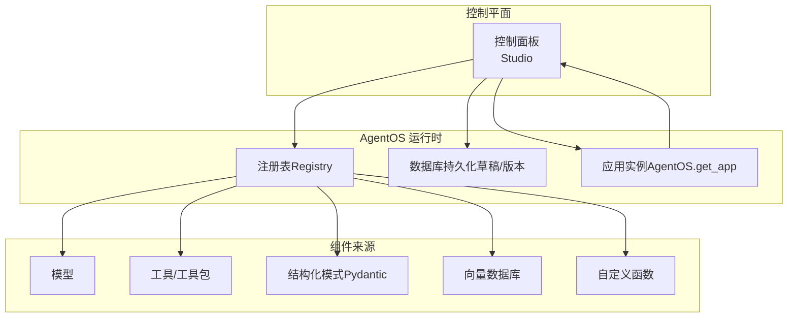
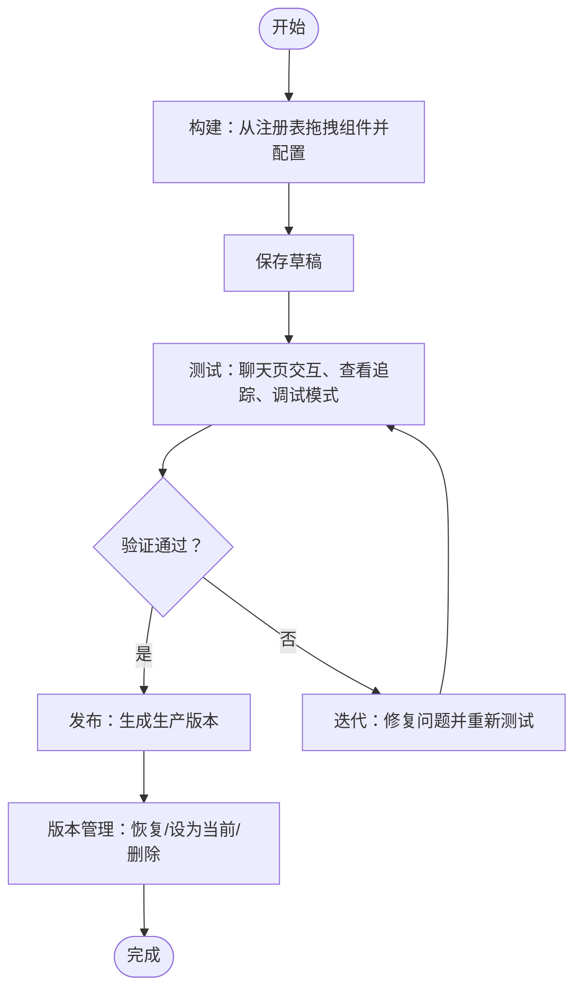
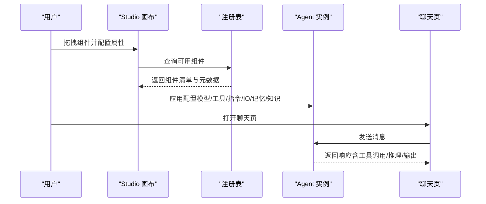
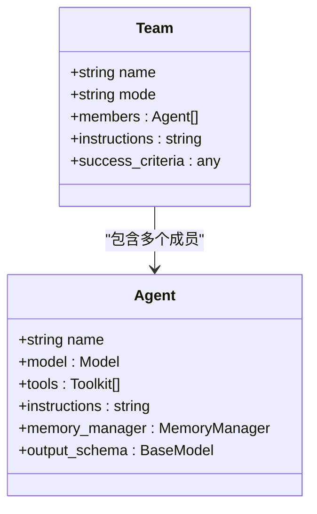
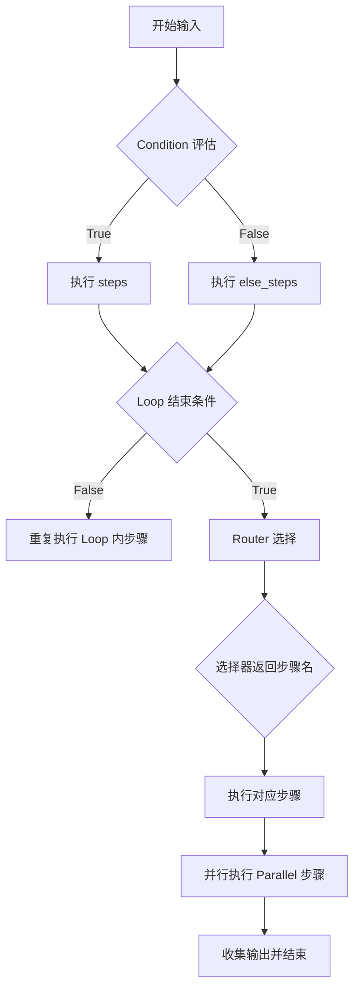
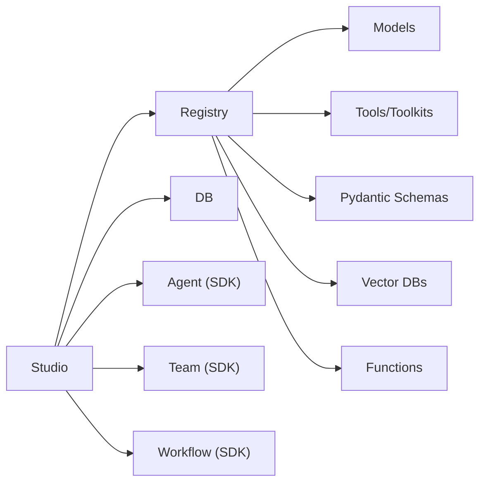

# 代理编辑器

<cite>
**本文引用的文件**
- [agent-os/studio/introduction.mdx](file://agent-os/studio/introduction.mdx)
- [agent-os/studio/agents.mdx](file://agent-os/studio/agents.mdx)
- [agent-os/studio/registry.mdx](file://agent-os/studio/registry.mdx)
- [agent-os/studio/workflows.mdx](file://agent-os/studio/workflows.mdx)
- [agent-os/studio/teams.mdx](file://agent-os/studio/teams.mdx)
- [agent-os/studio/cel-expressions.mdx](file://agent-os/studio/cel-expressions.mdx)
- [examples/basics/agent-with-memory.mdx](file://examples/basics/agent-with-memory.mdx)
- [examples/basics/agent-with-structured-output.mdx](file://examples/basics/agent-with-structured-output.mdx)
- [memory/best-practices.mdx](file://memory/best-practices.mdx)
- [faq/structured-outputs.mdx](file://faq/structured-outputs.mdx)
- [faq/switching-models.mdx](file://faq/switching-models.mdx)
- [faq/agentos-connection.mdx](file://faq/agentos-connection.mdx)
- [faq/rbac-auth-failed.mdx](file://faq/rbac-auth-failed.mdx)
</cite>

## 目录
1. [简介](#简介)
2. [项目结构](#项目结构)
3. [核心组件](#核心组件)
4. [架构总览](#架构总览)
5. [详细组件分析](#详细组件分析)
6. [依赖关系分析](#依赖关系分析)
7. [性能考量](#性能考量)
8. [故障排查指南](#故障排查指南)
9. [结论](#结论)
10. [附录](#附录)

## 简介
本文件面向使用 AgentOS Studio 的开发者与产品人员，系统化阐述如何在 Studio 中创建与配置代理（Agent）、团队（Team）与工作流（Workflow），涵盖模型选择、工具集成、指令设置、输入输出模式、记忆管理与推理设置等关键主题。同时提供可视化编辑器的拖拽式组件配置与实时预览说明，并总结代理开发的最佳实践、常见问题与解决方案。

## 项目结构
AgentOS Studio 是一个可视化编辑器，用于构建与编排代理、团队与工作流。其核心概念围绕“注册表（Registry）”展开：所有不可序列化的组件（如模型、工具、数据库、向量库、模式与函数）均通过注册表提供给 Studio 使用。Studio 连接运行中的 AgentOS 实例，基于注册表填充可用组件，在画布上进行拖拽式编排，支持保存草稿、测试、发布与版本管理。

图表来源
- [agent-os/studio/introduction.mdx:17-24](file://agent-os/studio/introduction.mdx#L17-L24)
- [agent-os/studio/registry.mdx:7-41](file://agent-os/studio/registry.mdx#L7-L41)

章节来源
- [agent-os/studio/introduction.mdx:1-103](file://agent-os/studio/introduction.mdx#L1-L103)
- [agent-os/studio/registry.mdx:1-85](file://agent-os/studio/registry.mdx#L1-L85)

## 核心组件
- 注册表（Registry）
  - 管理模型、工具、数据库、向量库、结构化模式与函数等非序列化组件，供 Studio 拖拽使用。
  - 提供查询接口，支持按类型、名称、分页过滤。
- 代理（Agent）
  - 可视化配置模型、工具、指令、结构化输入输出、记忆与知识库。
  - 支持切换到高级 JSON 配置编辑器以精细控制。
- 团队（Team）
  - 可视化编排多代理团队，设置成员、协调模式（coordinate/route/collaborate）与成功标准。
- 工作流（Workflow）
  - 可视化设计多步骤流程，支持条件、循环、路由、并行等复杂控制流；可使用 CEL 表达式或函数作为评估器/结束条件/选择器。

章节来源
- [agent-os/studio/agents.mdx:9-24](file://agent-os/studio/agents.mdx#L9-L24)
- [agent-os/studio/teams.mdx:10-23](file://agent-os/studio/teams.mdx#L10-L23)
- [agent-os/studio/workflows.mdx:8-31](file://agent-os/studio/workflows.mdx#L8-L31)
- [agent-os/studio/registry.mdx:43-84](file://agent-os/studio/registry.mdx#L43-L84)

## 架构总览
Studio 的开发生命周期从“构建”开始：从注册表拖拽组件，配置属性并连线；随后“保存草稿”，在控制面板的聊天页进行交互测试；验证后“发布”为生产版本；最后进入“版本管理”，可恢复、设为当前或删除旧版本。

图表来源
- [agent-os/studio/introduction.mdx:51-93](file://agent-os/studio/introduction.mdx#L51-L93)

章节来源
- [agent-os/studio/introduction.mdx:51-93](file://agent-os/studio/introduction.mdx#L51-L93)

## 详细组件分析

### 代理（Agent）配置与可视化编辑
- 组件来源与属性面板
  - 模型：从注册表中选择已注册的模型实例。
  - 工具：附加工具或工具包；支持 MCP 工具箱动态加载。
  - 指令：系统级指令，影响代理行为与推理。
  - 输入/输出模式：通过注册表中的结构化模式实现结构化输入输出。
  - 记忆：启用多轮对话的记忆能力。
  - 知识：附加知识库以支持检索增强生成（RAG）。
- 可视化编辑
  - 在画布上拖放组件，右侧属性面板即时配置。
  - 支持切换到高级 JSON 编辑器进行细粒度参数调整。
- 使用方式
  - 聊天页直接与代理交互。
  - 加入团队参与协作。
  - 作为工作流步骤执行自动化任务。

图表来源
- [agent-os/studio/agents.mdx:11-24](file://agent-os/studio/agents.mdx#L11-L24)
- [agent-os/studio/registry.mdx:54-78](file://agent-os/studio/registry.mdx#L54-L78)

章节来源
- [agent-os/studio/agents.mdx:9-66](file://agent-os/studio/agents.mdx#L9-L66)
- [agent-os/studio/registry.mdx:43-84](file://agent-os/studio/registry.mdx#L43-L84)

### 团队（Team）编排与可视化
- 成员与模式
  - 成员：从注册表拖入代理。
  - 协调模式：coordinate（协调）、route（路由）、collaborate（协作）。
  - 成功标准：定义任务完成条件。
- 使用场景
  - 聊天页直接与团队交互。
  - 作为工作流步骤执行复杂任务。

图表来源
- [agent-os/studio/teams.mdx:45-72](file://agent-os/studio/teams.mdx#L45-L72)

章节来源
- [agent-os/studio/teams.mdx:10-79](file://agent-os/studio/teams.mdx#L10-L79)

### 工作流（Workflow）设计与逻辑控制
- 步骤类型
  - Step：单个执行单元（代理/团队/自定义执行器）。
  - Steps：顺序执行的步骤组。
  - Condition：基于评估器或 CEL 表达式的分支。
  - Loop：基于结束条件的循环，支持最大迭代次数与复合条件。
  - Router：基于选择器或 CEL 表达式选择下一步骤。
  - Parallel：并发执行多个步骤。
- 复杂逻辑
  - 条件、循环、路由均可使用 Python 函数或 CEL 表达式；CEL 表达式具备可序列化、可编辑、可存储的优势。
- 保存与运行
  - 设计完成后保存至注册表，通过聊天页交互式运行，实时查看每步结果与日志。

图表来源
- [agent-os/studio/workflows.mdx:18-31](file://agent-os/studio/workflows.mdx#L18-L31)
- [agent-os/studio/cel-expressions.mdx:15-40](file://agent-os/studio/cel-expressions.mdx#L15-L40)

章节来源
- [agent-os/studio/workflows.mdx:8-80](file://agent-os/studio/workflows.mdx#L8-L80)
- [agent-os/studio/cel-expressions.mdx:15-272](file://agent-os/studio/cel-expressions.mdx#L15-L272)

### 输入输出模式与结构化输出
- 结构化输入/输出
  - 通过注册表提供的 Pydantic 模式实现结构化输入与输出，确保响应严格符合预期数据形状。
  - 当模型支持时优先使用“结构化输出”，否则可回退到 JSON 模式。
- 示例参考
  - 代理具备结构化输出能力的示例路径：[examples/basics/agent-with-structured-output.mdx:1-177](file://examples/basics/agent-with-structured-output.mdx#L1-L177)
  - FAQ 对结构化输出与 JSON 模式的对比与使用建议：[faq/structured-outputs.mdx:1-79](file://faq/structured-outputs.mdx#L1-L79)

章节来源
- [faq/structured-outputs.mdx:6-79](file://faq/structured-outputs.mdx#L6-L79)
- [examples/basics/agent-with-structured-output.mdx:1-177](file://examples/basics/agent-with-structured-output.mdx#L1-L177)

### 记忆管理与推理设置
- 记忆配置
  - 支持自动记忆（每次运行后更新）与代理驱动记忆（由代理在工具调用中决定是否存储/召回）两种模式。
  - 建议始终显式传入 user_id，避免默认值导致的数据混淆。
  - 长期应用需实施记忆修剪与增长监控，防止 token 消耗爆炸。
- 推理上下文
  - 可注入时间戳与历史会话，提升上下文完整性。
- 示例参考
  - 具备记忆能力的代理示例路径：[examples/basics/agent-with-memory.mdx:1-180](file://examples/basics/agent-with-memory.mdx#L1-L180)
  - 生产最佳实践与注意事项：[memory/best-practices.mdx:1-201](file://memory/best-practices.mdx#L1-L201)

章节来源
- [examples/basics/agent-with-memory.mdx:1-180](file://examples/basics/agent-with-memory.mdx#L1-L180)
- [memory/best-practices.mdx:1-201](file://memory/best-practices.mdx#L1-L201)

### 工具集成与 MCP 工具箱
- 工具来源
  - 注册表中的工具/工具包、自定义函数与脚本。
  - 支持 MCP 工具箱动态加载工具集，便于在运行时按需装配。
- 示例参考
  - MCP 工具箱示例路径：[examples/tools/mcp/mcp-toolbox-demo/agent.mdx:25-75](file://examples/tools/mcp/mcp-toolbox-demo/agent.mdx#L25-L75)

章节来源
- [agent-os/studio/registry.mdx:47-52](file://agent-os/studio/registry.mdx#L47-L52)
- [examples/tools/mcp/mcp-toolbox-demo/agent.mdx:25-75](file://examples/tools/mcp/mcp-toolbox-demo/agent.mdx#L25-L75)

### 模型选择与兼容性
- 同一提供商内切换更安全；跨提供商切换存在消息格式差异风险。
- 建议在同提供商内更换模型 ID，保持历史会话一致性。
- 示例参考
  - 模型切换示例与注意事项：[faq/switching-models.mdx:1-111](file://faq/switching-models.mdx#L1-L111)

章节来源
- [faq/switching-models.mdx:1-111](file://faq/switching-models.mdx#L1-L111)

## 依赖关系分析
- 组件耦合
  - Studio 依赖 AgentOS 的注册表与数据库，用于组件发现与持久化。
  - 代理/团队/工作流均为 SDK 原生对象的可视化映射，保证代码等价性。
- 外部依赖
  - 模型提供商、向量数据库、存储后端等均通过注册表抽象接入。
- 循环依赖
  - 无直接循环依赖；组件间通过注册表与运行时应用实例解耦。

图表来源
- [agent-os/studio/introduction.mdx:17-24](file://agent-os/studio/introduction.mdx#L17-L24)
- [agent-os/studio/registry.mdx:29-40](file://agent-os/studio/registry.mdx#L29-L40)

章节来源
- [agent-os/studio/introduction.mdx:17-24](file://agent-os/studio/introduction.mdx#L17-L24)
- [agent-os/studio/registry.mdx:29-40](file://agent-os/studio/registry.mdx#L29-L40)

## 性能考量
- 记忆成本控制
  - 默认采用自动记忆（update_memory_on_run=True），除非有特定需求采用代理驱动记忆。
  - 显式传入 user_id，避免默认用户导致的资源浪费。
  - 长期应用应实现记忆修剪与增长监控，防止 token 消耗爆炸。
- 模型切换
  - 同一提供商内切换更稳定；跨提供商切换需充分测试，避免消息格式不兼容导致的额外往返与失败重试。
- 结构化输出
  - 优先使用模型支持的结构化输出，减少后处理与校验开销；若不支持再考虑 JSON 模式。

章节来源
- [memory/best-practices.mdx:10-201](file://memory/best-practices.mdx#L10-L201)
- [faq/switching-models.mdx:6-13](file://faq/switching-models.mdx#L6-L13)
- [faq/structured-outputs.mdx:12-18](file://faq/structured-outputs.mdx#L12-L18)

## 故障排查指南
- 本地连接问题
  - 建议使用 Chrome 或 Edge 浏览器访问本地服务。
  - 若无法直连，可使用 ngrok 或 Cloudflare Tunnel 将本地端口暴露至公网。
- 授权失败（JWT 验证）
  - 若同时启用安全密钥与授权，授权（JWT 验证）优先于安全密钥。
  - 新版本可禁用授权或安全密钥，按需配置 JWT 验证密钥。
- 模型切换异常
  - 跨提供商切换可能导致消息格式不兼容，出现不可预测的结果。
  - 建议在同一提供商内切换模型 ID，并复用 session_id 保持上下文连续性。

章节来源
- [faq/agentos-connection.mdx:39-61](file://faq/agentos-connection.mdx#L39-L61)
- [faq/rbac-auth-failed.mdx:8-63](file://faq/rbac-auth-failed.mdx#L8-L63)
- [faq/switching-models.mdx:60-105](file://faq/switching-models.mdx#L60-L105)

## 结论
AgentOS Studio 通过注册表抽象与可视化画布，将模型、工具、数据库、模式与函数等组件有机整合，使开发者能够快速构建代理、团队与工作流。配合结构化输入输出、记忆管理与推理上下文注入，以及 CEL 表达式驱动的复杂控制流，Studio 能够覆盖从原型到生产的全生命周期。遵循最佳实践与故障排查建议，可显著提升系统的稳定性与可维护性。

## 附录
- 快速参考
  - 代理：模型/工具/指令/结构化 IO/记忆/知识
  - 团队：成员/协调模式/成功标准
  - 工作流：Step/Steps/Condition/Loop/Router/Parallel
  - 注册表：工具/模型/数据库/向量库/模式/函数
- 开发者资源
  - 代理参考与构建指南：[agent-os/studio/agents.mdx:61-66](file://agent-os/studio/agents.mdx#L61-L66)
  - 团队参考与构建指南：[agent-os/studio/teams.mdx:74-79](file://agent-os/studio/teams.mdx#L74-L79)
  - 工作流参考与构建指南：[agent-os/studio/workflows.mdx:74-80](file://agent-os/studio/workflows.mdx#L74-L80)
  - 注册表参考与 API：[agent-os/studio/registry.mdx:54-84](file://agent-os/studio/registry.mdx#L54-L84)
  - CEL 表达式参考：[agent-os/studio/cel-expressions.mdx:1-272](file://agent-os/studio/cel-expressions.mdx#L1-L272)