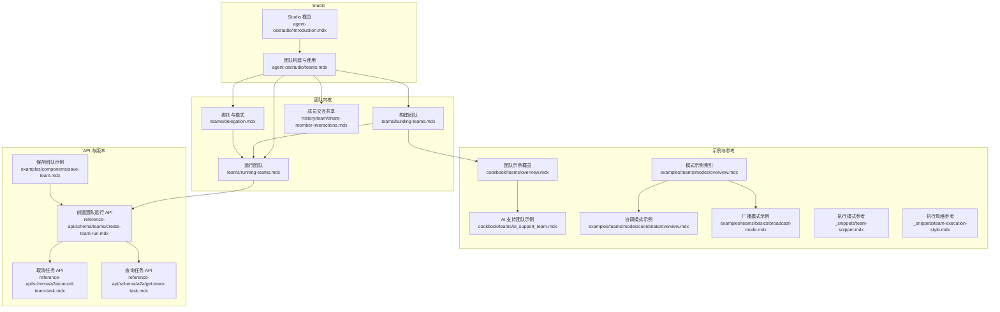
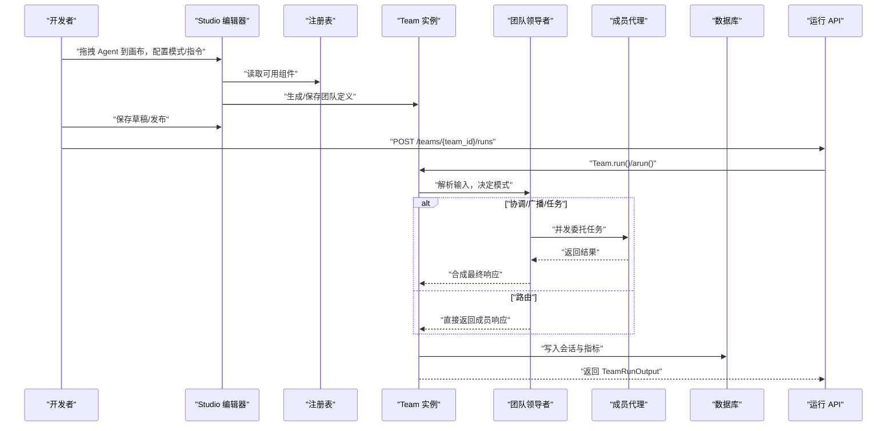
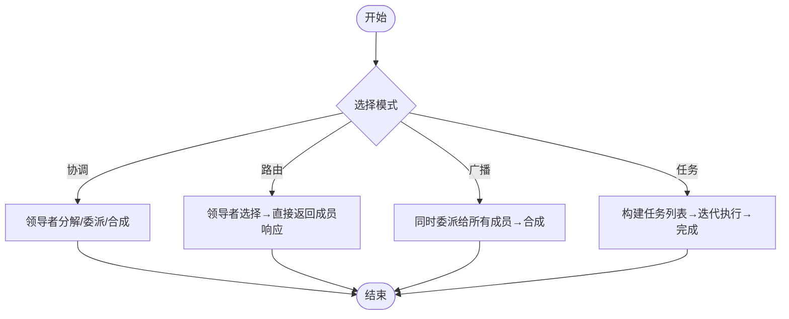
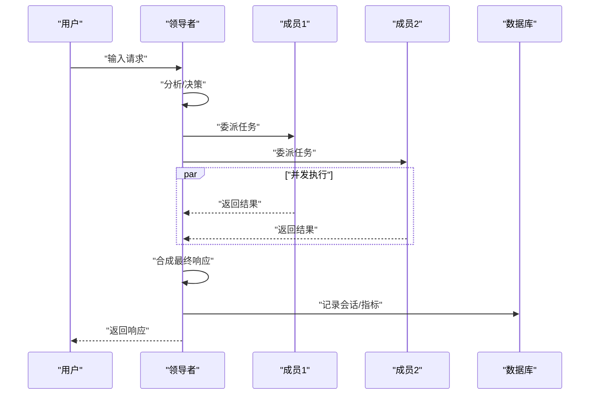
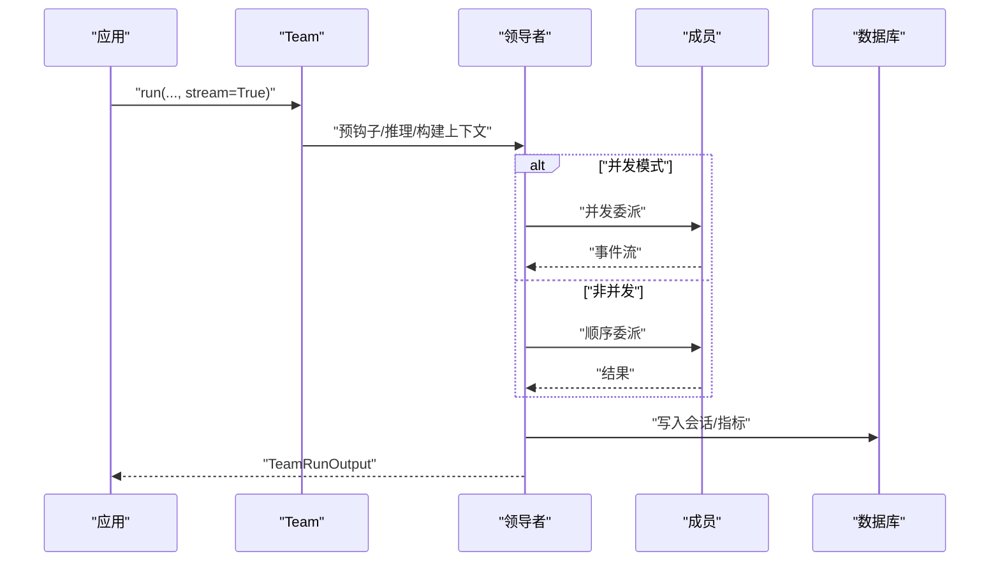
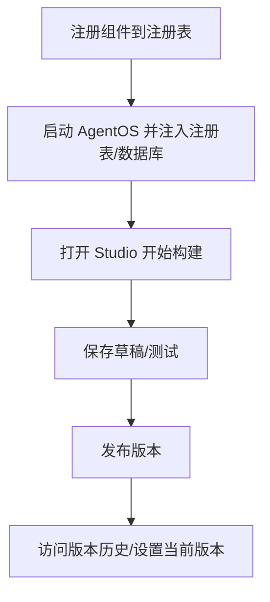
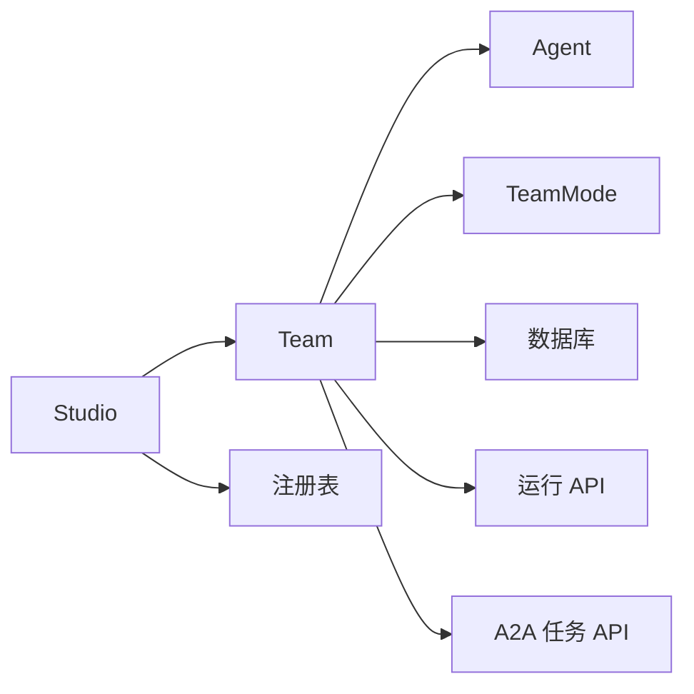

# 团队编辑器

<cite>
**本文引用的文件**
- [agent-os/studio/teams.mdx](file://agent-os/studio/teams.mdx)
- [teams/building-teams.mdx](file://teams/building-teams.mdx)
- [teams/running-teams.mdx](file://teams/running-teams.mdx)
- [teams/delegation.mdx](file://teams/delegation.mdx)
- [agent-os/studio/introduction.mdx](file://agent-os/studio/introduction.mdx)
- [_snippets/team-execution-style.mdx](file://_snippets/team-execution-style.mdx)
- [_snippets/team-snippet.mdx](file://_snippets/team-snippet.mdx)
- [cookbook/teams/overview.mdx](file://cookbook/teams/overview.mdx)
- [cookbook/teams/ai_support_team.mdx](file://cookbook/teams/ai_support_team.mdx)
- [history/team/share-member-interactions.mdx](file://history/team/share-member-interactions.mdx)
- [teams/debugging-teams.mdx](file://teams/debugging-teams.mdx)
- [reference/teams/team.mdx](file://reference/teams/team.mdx)
- [examples/teams/modes/overview.mdx](file://examples/teams/modes/overview.mdx)
- [examples/teams/modes/coordinate/overview.mdx](file://examples/teams/modes/coordinate/overview.mdx)
- [examples/teams/basics/broadcast-mode.mdx](file://examples/teams/basics/broadcast-mode.mdx)
- [examples/components/save-team.mdx](file://examples/components/save-team.mdx)
- [reference-api/schema/teams/create-team-run.mdx](file://reference-api/schema/teams/create-team-run.mdx)
- [reference-api/schema/a2a/cancel-team-task.mdx](file://reference-api/schema/a2a/cancel-team-task.mdx)
- [reference-api/schema/a2a/get-team-task.mdx](file://reference-api/schema/a2a/get-team-task.mdx)
</cite>

## 目录
1. [简介](#简介)
2. [项目结构](#项目结构)
3. [核心组件](#核心组件)
4. [架构总览](#架构总览)
5. [详细组件分析](#详细组件分析)
6. [依赖分析](#依赖分析)
7. [性能考虑](#性能考虑)
8. [故障排除指南](#故障排除指南)
9. [结论](#结论)
10. [附录](#附录)

## 简介
本文件面向 AgentOS Studio 团队编辑器，系统化阐述如何在 Studio 中构建与管理多代理团队，涵盖成员配置、协调模式与通信机制；详解团队的四种执行模式（广播、协调、路由、任务）及其适用场景；说明可视化编排能力（成员关系、消息传递、状态共享）；并提供最佳实践（角色分配、冲突解决策略、性能调优）、实际示例与故障排除建议。

## 项目结构
围绕“团队编辑器”的知识体系主要分布在以下模块：
- Studio 视觉化团队构建与使用：[agent-os/studio/teams.mdx](file://agent-os/studio/teams.mdx)
- 团队构建与运行：[teams/building-teams.mdx](file://teams/building-teams.mdx)、[teams/running-teams.mdx](file://teams/running-teams.mdx)
- 协调与委托：[teams/delegation.mdx](file://teams/delegation.mdx)
- Studio 概览与生命周期：[agent-os/studio/introduction.mdx](file://agent-os/studio/introduction.mdx)
- 执行模式参考与示例：[_snippets/team-snippet.mdx](file://_snippets/team-snippet.mdx)、[_snippets/team-execution-style.mdx](file://_snippets/team-execution-style.mdx)、[examples/teams/modes/overview.mdx](file://examples/teams/modes/overview.mdx)、[examples/teams/modes/coordinate/overview.mdx](file://examples/teams/modes/coordinate/overview.mdx)、[examples/teams/basics/broadcast-mode.mdx](file://examples/teams/basics/broadcast-mode.mdx)
- 实战案例：[cookbook/teams/overview.mdx](file://cookbook/teams/overview.mdx)、[cookbook/teams/ai_support_team.mdx](file://cookbook/teams/ai_support_team.mdx)
- 成员交互共享与调试：[history/team/share-member-interactions.mdx](file://history/team/share-member-interactions.mdx)、[teams/debugging-teams.mdx](file://teams/debugging-teams.mdx)
- API 与版本管理：[examples/components/save-team.mdx](file://examples/components/save-team.mdx)、[reference-api/schema/teams/create-team-run.mdx](file://reference-api/schema/teams/create-team-run.mdx)、[reference-api/schema/a2a/cancel-team-task.mdx](file://reference-api/schema/a2a/cancel-team-task.mdx)、[reference-api/schema/a2a/get-team-task.mdx](file://reference-api/schema/a2a/get-team-task.mdx)

**图表来源**
- [agent-os/studio/introduction.mdx](file://agent-os/studio/introduction.mdx)
- [agent-os/studio/teams.mdx](file://agent-os/studio/teams.mdx)
- [teams/building-teams.mdx](file://teams/building-teams.mdx)
- [teams/running-teams.mdx](file://teams/running-teams.mdx)
- [teams/delegation.mdx](file://teams/delegation.mdx)
- [history/team/share-member-interactions.mdx](file://history/team/share-member-interactions.mdx)
- [cookbook/teams/overview.mdx](file://cookbook/teams/overview.mdx)
- [cookbook/teams/ai_support_team.mdx](file://cookbook/teams/ai_support_team.mdx)
- [examples/teams/modes/overview.mdx](file://examples/teams/modes/overview.mdx)
- [examples/teams/modes/coordinate/overview.mdx](file://examples/teams/modes/coordinate/overview.mdx)
- [examples/teams/basics/broadcast-mode.mdx](file://examples/teams/basics/broadcast-mode.mdx)
- [examples/components/save-team.mdx](file://examples/components/save-team.mdx)
- [reference-api/schema/teams/create-team-run.mdx](file://reference-api/schema/teams/create-team-run.mdx)
- [reference-api/schema/a2a/cancel-team-task.mdx](file://reference-api/schema/a2a/cancel-team-task.mdx)
- [reference-api/schema/a2a/get-team-task.mdx](file://reference-api/schema/a2a/get-team-task.mdx)

**章节来源**
- [agent-os/studio/teams.mdx](file://agent-os/studio/teams.mdx)
- [agent-os/studio/introduction.mdx](file://agent-os/studio/introduction.mdx)

## 核心组件
- 团队（Team）
  - 负责成员编排、协调模式、推理、工具、知识、记忆、数据库持久化等。
  - 参考：[teams/building-teams.mdx](file://teams/building-teams.mdx)、[reference/teams/team.mdx](file://reference/teams/team.mdx)
- 成员（Agent）
  - 具备名称、角色、模型、工具、指令等；角色用于领导者的委托决策。
  - 参考：[teams/building-teams.mdx](file://teams/building-teams.mdx)
- 协调模式（Mode）
  - coordinate（默认）：分解工作、委托成员、合成结果。
  - route：路由到单一专家，直接返回成员响应。
  - broadcast：向所有成员同时委托，再合成。
  - tasks：迭代任务循环直至目标完成。
  - 参考：[_snippets/team-snippet.mdx](file://_snippets/team-snippet.mdx)、[_snippets/team-execution-style.mdx](file://_snippets/team-execution-style.mdx)
- 运行与输出（Team.run/arun）
  - 支持同步/异步、流式输出、事件流、暂停/恢复、取消、结构化输出等。
  - 参考：[teams/running-teams.mdx](file://teams/running-teams.mdx)
- 委托与选择
  - 领导者基于角色与输入进行成员选择；可禁用领导者任务构造或透传用户输入。
  - 参考：[teams/delegation.mdx](file://teams/delegation.mdx)
- 成员交互共享
  - 在同一请求中共享成员交互，避免重复工作，提升协同效率。
  - 参考：[history/team/share-member-interactions.mdx](file://history/team/share-member-interactions.mdx)
- Studio 可视化编排
  - 通过注册表拖拽成员、配置模式与指令、保存并运行。
  - 参考：[agent-os/studio/teams.mdx](file://agent-os/studio/teams.mdx)、[agent-os/studio/introduction.mdx](file://agent-os/studio/introduction.mdx)

**章节来源**
- [teams/building-teams.mdx](file://teams/building-teams.mdx)
- [teams/running-teams.mdx](file://teams/running-teams.mdx)
- [teams/delegation.mdx](file://teams/delegation.mdx)
- [history/team/share-member-interactions.mdx](file://history/team/share-member-interactions.mdx)
- [agent-os/studio/teams.mdx](file://agent-os/studio/teams.mdx)
- [_snippets/team-snippet.mdx](file://_snippets/team-snippet.mdx)
- [_snippets/team-execution-style.mdx](file://_snippets/team-execution-style.mdx)
- [reference/teams/team.mdx](file://reference/teams/team.mdx)

## 架构总览
下图展示 Studio 团队从“可视化构建”到“运行与追踪”的端到端流程，以及 API 与版本管理的接入点。

**图表来源**
- [agent-os/studio/teams.mdx](file://agent-os/studio/teams.mdx)
- [agent-os/studio/introduction.mdx](file://agent-os/studio/introduction.mdx)
- [teams/running-teams.mdx](file://teams/running-teams.mdx)
- [reference-api/schema/teams/create-team-run.mdx](file://reference-api/schema/teams/create-team-run.mdx)

## 详细组件分析

### 组件一：团队模式与执行风格
- 模式对比与适用场景
  - 协调（coordinate，默认）：适合需要分解、委派与合成的复杂任务，强调质量控制与上下文整合。
  - 路由（route）：适合专业分工明确、追求低延迟的场景，领导者仅做选择与透传。
  - 广播（broadcast）：适合并行收集多视角意见，再进行合成。
  - 任务（tasks）：适合多步骤、有依赖的目标，领导者维护任务列表直至完成。
- 执行风格参考
  - 各模式的典型执行路径与行为差异，便于快速选型与调试。

**图表来源**
- [_snippets/team-snippet.mdx](file://_snippets/team-snippet.mdx)
- [_snippets/team-execution-style.mdx](file://_snippets/team-execution-style.mdx)

**章节来源**
- [_snippets/team-snippet.mdx](file://_snippets/team-snippet.mdx)
- [_snippets/team-execution-style.mdx](file://_snippets/team-execution-style.mdx)
- [examples/teams/modes/overview.mdx](file://examples/teams/modes/overview.mdx)
- [examples/teams/modes/coordinate/overview.mdx](file://examples/teams/modes/coordinate/overview.mdx)
- [examples/teams/basics/broadcast-mode.mdx](file://examples/teams/basics/broadcast-mode.mdx)

### 组件二：委托与消息传递
- 委托流程
  - 接收输入→分析→选择成员→构造任务→并发执行→合成响应。
- 输入处理
  - 可禁用领导者任务构造，直接透传用户输入给成员；或启用结构化输入（Pydantic）。
- 成员交互共享
  - 同一次运行中共享成员交互，避免重复工作，增强一致性。

**图表来源**
- [teams/delegation.mdx](file://teams/delegation.mdx)
- [history/team/share-member-interactions.mdx](file://history/team/share-member-interactions.mdx)

**章节来源**
- [teams/delegation.mdx](file://teams/delegation.mdx)
- [history/team/share-member-interactions.mdx](file://history/team/share-member-interactions.mdx)

### 组件三：运行与输出
- 同步/异步执行
  - run()/arun()；异步支持并发成员执行。
- 流式输出
  - stream/stream_events 控制内容与内部事件流；tasks 模式不支持流式。
- 输出结构
  - TeamRunOutput 包含 content、messages、metrics、member_responses 等字段。
- 暂停/恢复与取消
  - 支持人类确认、外部执行暂停；可通过取消接口中断运行。

**图表来源**
- [teams/running-teams.mdx](file://teams/running-teams.mdx)
- [reference-api/schema/teams/create-team-run.mdx](file://reference-api/schema/teams/create-team-run.mdx)

**章节来源**
- [teams/running-teams.mdx](file://teams/running-teams.mdx)
- [reference-api/schema/teams/create-team-run.mdx](file://reference-api/schema/teams/create-team-run.mdx)
- [reference-api/schema/a2a/cancel-team-task.mdx](file://reference-api/schema/a2a/cancel-team-task.mdx)
- [reference-api/schema/a2a/get-team-task.mdx](file://reference-api/schema/a2a/get-team-task.mdx)

### 组件四：可视化编排与版本管理
- Studio 生命周期
  - 构建（拖拽/配置）、保存草稿、测试（聊天/追踪/调试）、发布、版本管理。
- 注册表与数据库
  - Studio 通过注册表填充可用组件，并需要数据库以保存/加载团队蓝图。
- 版本与 API
  - 发布后每个版本映射唯一 API 端点，可设置当前版本作为默认生产端点。

**图表来源**
- [agent-os/studio/introduction.mdx](file://agent-os/studio/introduction.mdx)
- [examples/components/save-team.mdx](file://examples/components/save-team.mdx)

**章节来源**
- [agent-os/studio/introduction.mdx](file://agent-os/studio/introduction.mdx)
- [examples/components/save-team.mdx](file://examples/components/save-team.mdx)

### 组件五：实战案例与最佳实践
- 内容与研究团队
  - 清晰的“研究员→写手”流水线，体现标准团队模式。
  - 参考：[cookbook/teams/overview.mdx](file://cookbook/teams/overview.mdx)
- AI 支持团队
  - 智能路由：问题分类→文档检索→升级/反馈集成；演示 respond_directly、determine_input_for_members 等高级配置。
  - 参考：[cookbook/teams/ai_support_team.mdx](file://cookbook/teams/ai_support_team.mdx)
- 广播模式示例
  - 多视角评审与风险提示，强调并行收集与合成。
  - 参考：[examples/teams/basics/broadcast-mode.mdx](file://examples/teams/basics/broadcast-mode.mdx)

**章节来源**
- [cookbook/teams/overview.mdx](file://cookbook/teams/overview.mdx)
- [cookbook/teams/ai_support_team.mdx](file://cookbook/teams/ai_support_team.mdx)
- [examples/teams/basics/broadcast-mode.mdx](file://examples/teams/basics/broadcast-mode.mdx)

## 依赖分析
- 组件耦合
  - Team 对 Agent 的依赖以“角色/ID”驱动委托；对模式的依赖以“模式枚举”解耦逻辑。
  - 数据库与注册表为 Studio 提供持久化与组件发现能力。
- 外部依赖
  - 模型、工具、知识库、向量数据库、Slack 等第三方服务通过注册表与工具集成。
- API 依赖
  - 运行 API 与 A2A 任务管理 API 提供统一入口与可观测性。

**图表来源**
- [teams/building-teams.mdx](file://teams/building-teams.mdx)
- [agent-os/studio/introduction.mdx](file://agent-os/studio/introduction.mdx)
- [reference-api/schema/teams/create-team-run.mdx](file://reference-api/schema/teams/create-team-run.mdx)
- [reference-api/schema/a2a/cancel-team-task.mdx](file://reference-api/schema/a2a/cancel-team-task.mdx)
- [reference-api/schema/a2a/get-team-task.mdx](file://reference-api/schema/a2a/get-team-task.mdx)

**章节来源**
- [teams/building-teams.mdx](file://teams/building-teams.mdx)
- [agent-os/studio/introduction.mdx](file://agent-os/studio/introduction.mdx)
- [reference-api/schema/teams/create-team-run.mdx](file://reference-api/schema/teams/create-team-run.mdx)
- [reference-api/schema/a2a/cancel-team-task.mdx](file://reference-api/schema/a2a/cancel-team-task.mdx)
- [reference-api/schema/a2a/get-team-task.mdx](file://reference-api/schema/a2a/get-team-task.mdx)

## 性能考虑
- 模式成本与延迟
  - 协调：较高（分解+合成），适合质量优先。
  - 路由：较低（仅选择），适合成本敏感与低延迟。
  - 广播：中等（合成），适合并行研究与多视角。
  - 任务：较高（规划+迭代），适合多步骤目标。
- 并发与流式
  - 异步执行可并行成员任务；流式在非 tasks 模式下可用，有助于前端实时反馈。
- 上下文与令牌
  - 控制上下文大小、减少合成冗余、合理拆分任务以降低令牌开销。

**章节来源**
- [teams/delegation.mdx](file://teams/delegation.mdx)
- [teams/running-teams.mdx](file://teams/running-teams.mdx)

## 故障排除指南
- 常见问题与排查要点
  - 成员未响应：检查工具调用与错误；开启 show_members_responses 查看各成员输出。
  - 错误的成员选择：确保角色清晰且不重叠；为领导者补充指令。
  - 执行缓慢：区分串行/并行；评估合成步骤与上下文长度。
  - 输出异常：检查合成步骤与成员响应；必要时引入后置钩子进行格式化与校验。
  - 无限委托循环：检查任务边界与完成条件；为 tasks 模式设置 max_iterations。
- 建议
  - 使用调试模式与追踪查看工具调用、推理与内存更新事件。
  - 在关键节点增加后置钩子进行输出规范化与合规性检查。

**章节来源**
- [teams/debugging-teams.mdx](file://teams/debugging-teams.mdx)
- [teams/running-teams.mdx](file://teams/running-teams.mdx)

## 结论
Studio 团队编辑器通过“可视化编排 + 模式化执行 + 统一 API”，帮助用户快速构建从简单到复杂的多代理系统。掌握成员角色设计、模式选型、流式与并发、以及调试与版本管理，是实现稳定、高效、可维护的团队系统的关键。

## 附录
- 快速参考
  - 模式对照表：[team-snippet.mdx](file://_snippets/team-snippet.mdx)
  - 执行风格对照表：[team-execution-style.mdx](file://_snippets/team-execution-style.mdx)
- 示例索引
  - 模式示例总览：[examples/teams/modes/overview.mdx](file://examples/teams/modes/overview.mdx)
  - 协调模式示例：[examples/teams/modes/coordinate/overview.mdx](file://examples/teams/modes/coordinate/overview.mdx)
  - 广播模式示例：[examples/teams/basics/broadcast-mode.mdx](file://examples/teams/basics/broadcast-mode.mdx)
- API 与版本
  - 创建团队运行：[create-team-run.mdx](file://reference-api/schema/teams/create-team-run.mdx)
  - 取消任务：[cancel-team-task.mdx](file://reference-api/schema/a2a/cancel-team-task.mdx)
  - 查询任务：[get-team-task.mdx](file://reference-api/schema/a2a/get-team-task.mdx)
  - 保存团队示例：[save-team.mdx](file://examples/components/save-team.mdx)