# 工作流编辑器

<cite>
**本文引用的文件**
- [工作流总览](file://workflows/overview.mdx)
- [构建工作流](file://workflows/building-workflows.mdx)
- [运行工作流](file://workflows/running-workflows.mdx)
- [后台执行](file://workflows/background-execution.mdx)
- [对话式工作流](file://workflows/conversational-workflows.mdx)
- [工作流模式总览](file://workflows/workflow-patterns/overview.mdx)
- [Studio 工作流](file://agent-os/studio/workflows.mdx)
- [Studio CEL 表达式](file://agent-os/studio/cel-expressions.mdx)
- [工作流取消](file://run-cancellation/workflow-cancel-run.mdx)
- [工作流错误处理](file://workflows/hitl/error-handling.mdx)
</cite>

## 目录
1. [简介](#简介)
2. [项目结构](#项目结构)
3. [核心组件](#核心组件)
4. [架构总览](#架构总览)
5. [详细组件分析](#详细组件分析)
6. [依赖关系分析](#依赖关系分析)
7. [性能考量](#性能考量)
8. [故障排查指南](#故障排查指南)
9. [结论](#结论)
10. [附录](#附录)

## 简介
本文件面向使用 AgentOS Studio 的用户与开发者，系统化阐述如何在 Studio 中设计“步骤化工作流”，涵盖条件分支、循环执行、路由器与并行处理等关键能力；详解可视化编排（拖拽、连线、参数配置）；解释执行控制机制（条件逻辑、错误处理、超时与取消）；并提供最佳实践与复杂工作流示例及调试技巧。

## 项目结构
围绕工作流编辑器与执行，仓库中与之直接相关的知识分布在以下位置：
- 工作流基础与模式：workflows/overview.mdx、workflows/workflow-patterns/overview.mdx
- 构建与运行：workflows/building-workflows.mdx、workflows/running-workflows.mdx、workflows/background-execution.mdx
- 对话式工作流：workflows/conversational-workflows.mdx
- Studio 可视化与表达式：agent-os/studio/workflows.mdx、agent-os/studio/cel-expressions.mdx
- 执行控制与取消：run-cancellation/workflow-cancel-run.mdx
- 错误处理与人工介入：workflows/hitl/error-handling.mdx

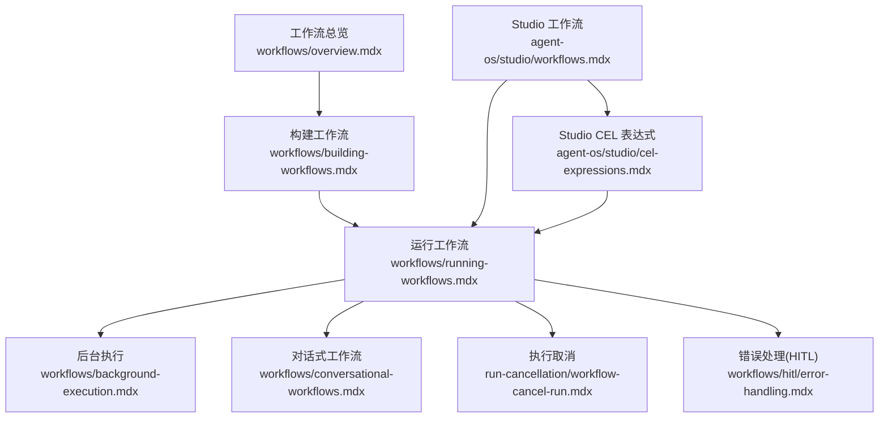

图表来源
- [工作流总览:1-102](file://workflows/overview.mdx#L1-L102)
- [构建工作流:1-59](file://workflows/building-workflows.mdx#L1-L59)
- [运行工作流:1-619](file://workflows/running-workflows.mdx#L1-L619)
- [后台执行:1-137](file://workflows/background-execution.mdx#L1-L137)
- [对话式工作流:1-160](file://workflows/conversational-workflows.mdx#L1-L160)
- [Studio 工作流:1-80](file://agent-os/studio/workflows.mdx#L1-L80)
- [Studio CEL 表达式:1-272](file://agent-os/studio/cel-expressions.mdx#L1-L272)
- [执行取消:89-126](file://run-cancellation/workflow-cancel-run.mdx#L89-L126)
- [错误处理:42-183](file://workflows/hitl/error-handling.mdx#L42-L183)

章节来源
- [工作流总览:1-102](file://workflows/overview.mdx#L1-L102)
- [构建工作流:1-59](file://workflows/building-workflows.mdx#L1-L59)
- [运行工作流:1-619](file://workflows/running-workflows.mdx#L1-L619)
- [后台执行:1-137](file://workflows/background-execution.mdx#L1-L137)
- [对话式工作流:1-160](file://workflows/conversational-workflows.mdx#L1-L160)
- [Studio 工作流:1-80](file://agent-os/studio/workflows.mdx#L1-L80)
- [Studio CEL 表达式:1-272](file://agent-os/studio/cel-expressions.mdx#L1-L272)
- [执行取消:89-126](file://run-cancellation/workflow-cancel-run.mdx#L89-L126)
- [错误处理:42-183](file://workflows/hitl/error-handling.mdx#L42-L183)

## 核心组件
- 步骤 Step：工作流的最小执行单元，封装一个执行器（Agent、Team 或自定义函数），确保职责单一、可组合。
- 条件 Condition：基于评估器或 CEL 表达式进行分支选择，决定执行哪条路径。
- 循环 Loop：重复执行一组步骤，支持迭代次数与输出关键字等退出条件。
- 路由 Router：根据选择器从候选步骤集中动态选择下一步。
- 并行 Parallel：并发执行多个步骤并将结果合并。
- 工作流 Workflow：顶层编排器，负责步骤序列、事件流、会话状态与持久化。

章节来源
- [构建工作流:9-32](file://workflows/building-workflows.mdx#L9-L32)
- [工作流总览:58-68](file://workflows/overview.mdx#L58-L68)

## 架构总览
下图展示 Studio 可视化设计到运行时执行的关键交互：

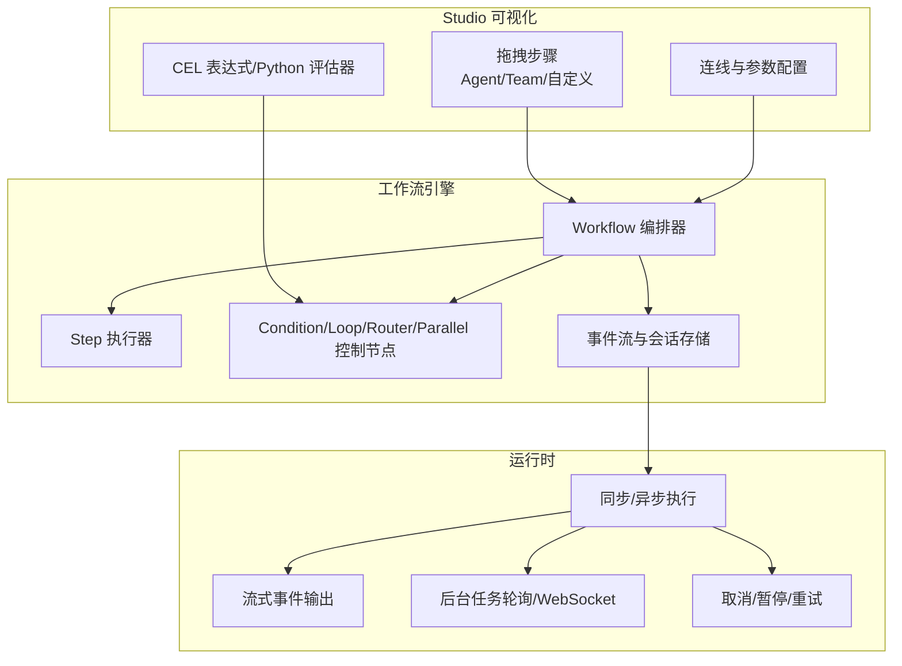

图表来源
- [Studio 工作流:6-31](file://agent-os/studio/workflows.mdx#L6-L31)
- [运行工作流:7-20](file://workflows/running-workflows.mdx#L7-L20)
- [后台执行:8-14](file://workflows/background-execution.mdx#L8-L14)
- [对话式工作流:14-22](file://workflows/conversational-workflows.mdx#L14-L22)

## 详细组件分析

### 组件一：Studio 可视化编排
- 拖拽创建步骤：从注册表选择 Agent、Team 或自定义执行器，放置到画布。
- 连线与分组：通过连线建立顺序依赖；使用 Steps 将多步骤组合为顺序块。
- 参数配置：在属性面板设置执行器类型、输入输出映射、CEL 表达式或 Python 函数。
- 复杂步骤：Condition/Loop/Router/Parallel 的逻辑参数（评估器/结束条件/选择器）可在 Studio 内编辑与保存。

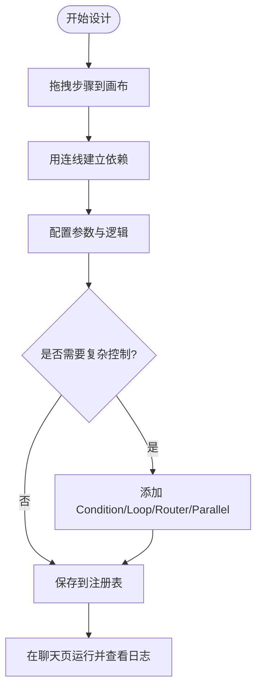

图表来源
- [Studio 工作流:6-31](file://agent-os/studio/workflows.mdx#L6-L31)
- [Studio CEL 表达式:7-9](file://agent-os/studio/cel-expressions.mdx#L7-L9)

章节来源
- [Studio 工作流:6-31](file://agent-os/studio/workflows.mdx#L6-L31)
- [Studio CEL 表达式:7-40](file://agent-os/studio/cel-expressions.mdx#L7-L40)

### 组件二：条件分支（Condition）
- 评估器：支持 Python 函数或 CEL 表达式，返回布尔值以决定走 steps 还是 else_steps。
- 上下文变量：input、previous_step_content、previous_step_outputs、additional_data、session_state 等。
- 典型场景：按输入内容路由、基于上一步输出分类、依据附加数据优先级、结合会话状态实现重试逻辑。

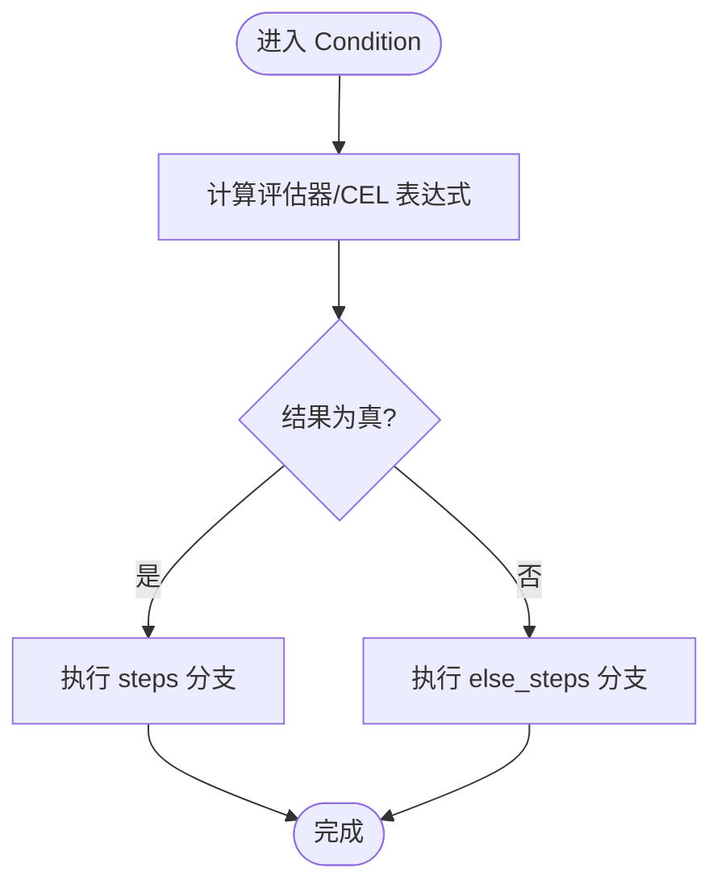

图表来源
- [Studio CEL 表达式:41-138](file://agent-os/studio/cel-expressions.mdx#L41-L138)

章节来源
- [Studio CEL 表达式:41-138](file://agent-os/studio/cel-expressions.mdx#L41-L138)

### 组件三：循环执行（Loop）
- 结束条件：支持 CEL 表达式或 Python 函数，返回布尔值决定是否退出循环。
- 上下文变量：current_iteration、max_iterations、all_success、last_step_content、step_outputs 等。
- 典型场景：限定最大迭代次数、检测最后一步输出关键字、复合退出条件（如多步全成功且达到最小迭代）。

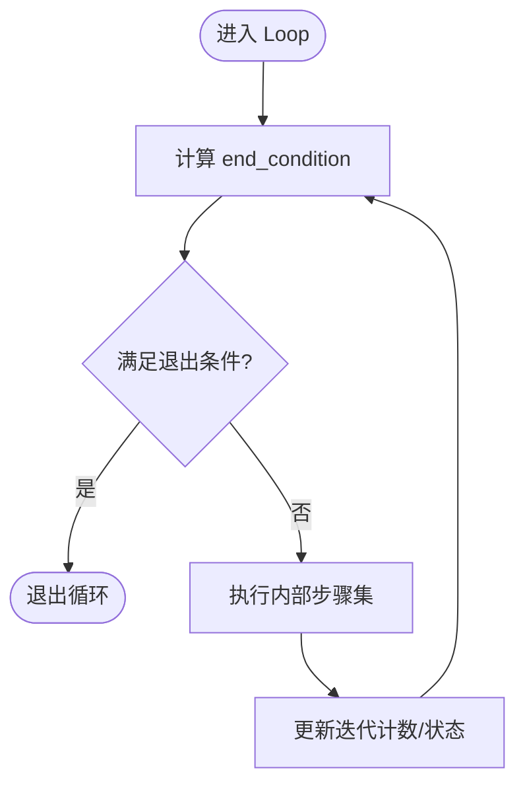

图表来源
- [Studio CEL 表达式:140-201](file://agent-os/studio/cel-expressions.mdx#L140-L201)

章节来源
- [Studio CEL 表达式:140-201](file://agent-os/studio/cel-expressions.mdx#L140-L201)

### 组件四：动态路由（Router）
- 选择器：返回字符串匹配 choices 中某一步骤名称，或使用 step_choices 下标索引。
- 上下文变量：input、session_state、step_choices 等。
- 典型场景：基于会话状态选择处理器风格、按输入特征进行二元/多元路由、使用索引避免硬编码名称。

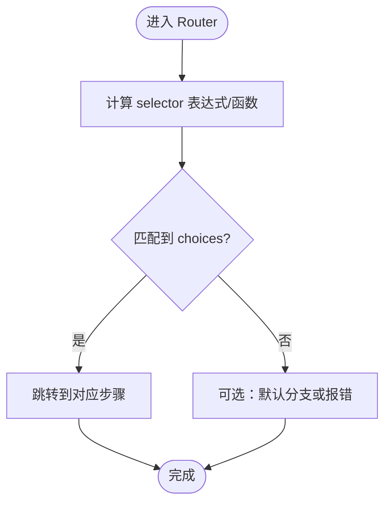

图表来源
- [Studio CEL 表达式:203-265](file://agent-os/studio/cel-expressions.mdx#L203-L265)

章节来源
- [Studio CEL 表达式:203-265](file://agent-os/studio/cel-expressions.mdx#L203-L265)

### 组件五：并行执行（Parallel）
- 并发执行多个子步骤，等待全部完成后合并输出。
- 适用于独立任务并行化，提升吞吐量。

```mermaid
sequenceDiagram
participant WF as "Workflow"
participant P as "Parallel"
participant S1 as "Step A"
participant S2 as "Step B"
participant S3 as "Step C"
WF->>P : 启动并行
par S1->>S1 : 执行
par S2->>S2 : 执行
par S3->>S3 : 执行
S1-->>P : 完成
S2-->>P : 完成
S3-->>P : 完成
P-->>WF : 汇总输出
```

图表来源
- [运行工作流:488-494](file://workflows/running-workflows.mdx#L488-L494)

章节来源
- [运行工作流:488-494](file://workflows/running-workflows.mdx#L488-L494)

### 组件六：对话式工作流（WorkflowAgent）
- 在工作流外层嵌入 WorkflowAgent，用于判断“直接回答历史”或“重新运行工作流”。
- 支持控制历史回看数量 num_history_runs，平衡上下文窗口与性能。
- 默认指令通常足够，除非有特殊回答偏好。

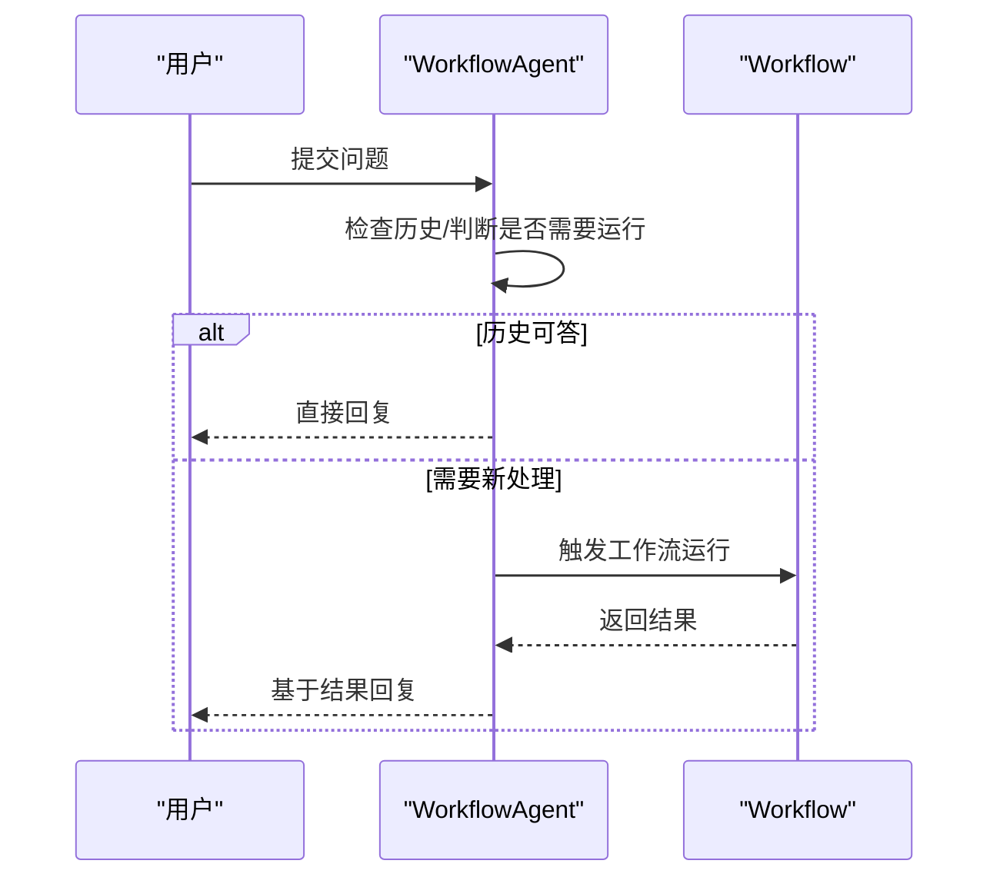

图表来源
- [对话式工作流:14-90](file://workflows/conversational-workflows.mdx#L14-L90)

章节来源
- [对话式工作流:14-90](file://workflows/conversational-workflows.mdx#L14-L90)

### 组件七：执行控制与事件流
- 同步/异步执行：Workflow.run()/Workflow.arun()。
- 流式事件：支持仅核心事件或全量事件，可过滤执行器事件。
- 存储事件：可配置存储所有事件或按类型过滤，便于审计与分析。

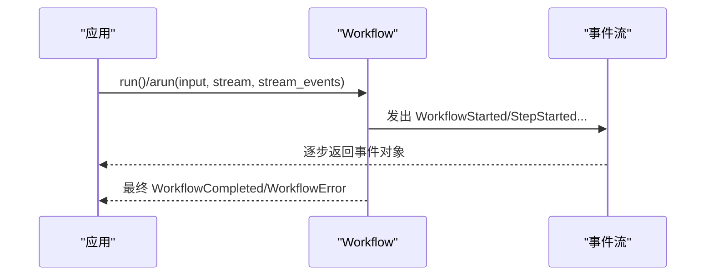

图表来源
- [运行工作流:462-525](file://workflows/running-workflows.mdx#L462-L525)

章节来源
- [运行工作流:462-525](file://workflows/running-workflows.mdx#L462-L525)

### 组件八：后台执行与轮询
- 使用 Workflow.arun(background=True) 启动非阻塞任务，返回 run_id。
- 轮询或 WebSocket 获取完成状态；可设置超时与重连策略。

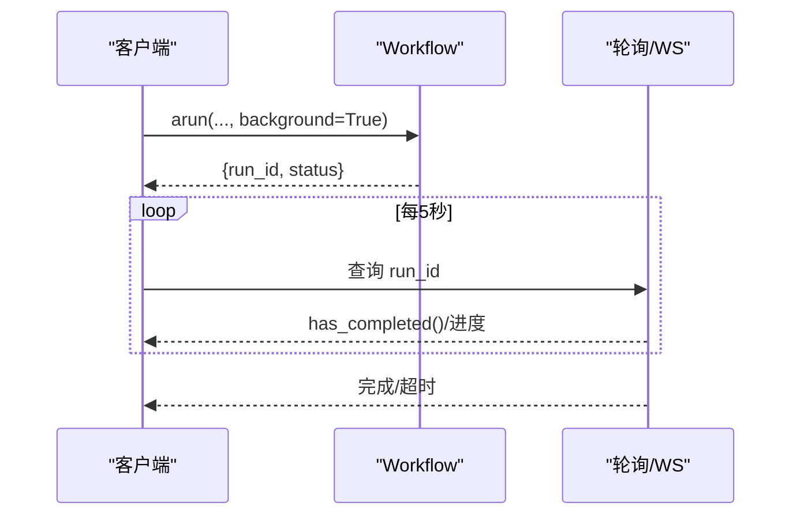

图表来源
- [后台执行:8-14](file://workflows/background-execution.mdx#L8-L14)
- [后台执行:83-127](file://workflows/background-execution.mdx#L83-L127)

章节来源
- [后台执行:8-14](file://workflows/background-execution.mdx#L8-L14)
- [后台执行:83-127](file://workflows/background-execution.mdx#L83-L127)

### 组件九：取消与中断
- 支持在运行中取消，取消后返回状态标记；可结合暂停与重试策略。
- 示例演示了延时取消与结果汇总流程。

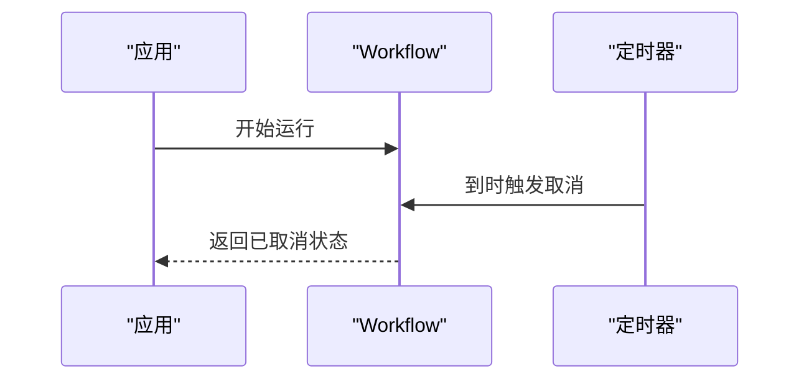

图表来源
- [执行取消:122-126](file://run-cancellation/workflow-cancel-run.mdx#L122-L126)

章节来源
- [执行取消:89-126](file://run-cancellation/workflow-cancel-run.mdx#L89-L126)

### 组件十：错误处理与人工介入（HITL）
- on_error 选项：fail（立即失败）、skip（跳过继续）、pause（暂停等待决策）。
- ErrorRequirement 提供 retry()/skip() 方法；可按错误类型定制重试策略。
- 支持在会话中继续运行并实时决策。

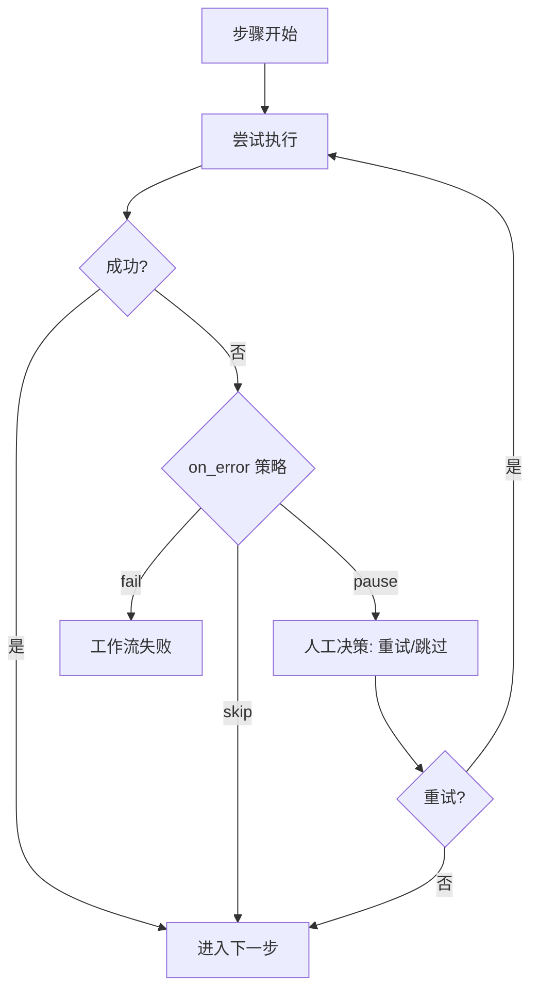

图表来源
- [错误处理:42-183](file://workflows/hitl/error-handling.mdx#L42-L183)

章节来源
- [错误处理:42-183](file://workflows/hitl/error-handling.mdx#L42-L183)

## 依赖关系分析
- Studio 工作流与 CEL 表达式为可视化与逻辑表达的基础，驱动运行时的条件/循环/路由。
- 运行时依赖事件流与会话存储，支撑流式输出、审计与调试。
- 后台执行与取消/暂停/重试共同构成完整的运行期控制闭环。

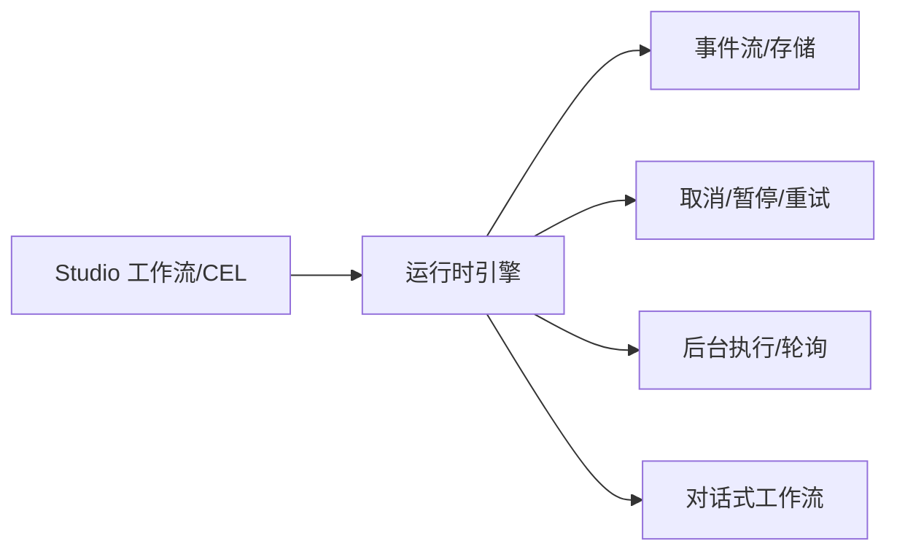

图表来源
- [Studio 工作流:6-31](file://agent-os/studio/workflows.mdx#L6-L31)
- [运行工作流:462-525](file://workflows/running-workflows.mdx#L462-L525)
- [后台执行:8-14](file://workflows/background-execution.mdx#L8-L14)
- [对话式工作流:14-22](file://workflows/conversational-workflows.mdx#L14-L22)
- [执行取消:89-126](file://run-cancellation/workflow-cancel-run.mdx#L89-L126)
- [错误处理:42-183](file://workflows/hitl/error-handling.mdx#L42-L183)

章节来源
- [Studio 工作流:6-31](file://agent-os/studio/workflows.mdx#L6-L31)
- [运行工作流:462-525](file://workflows/running-workflows.mdx#L462-L525)
- [后台执行:8-14](file://workflows/background-execution.mdx#L8-L14)
- [对话式工作流:14-22](file://workflows/conversational-workflows.mdx#L14-L22)
- [执行取消:89-126](file://run-cancellation/workflow-cancel-run.mdx#L89-L126)
- [错误处理:42-183](file://workflows/hitl/error-handling.mdx#L42-L183)

## 性能考量
- 并行化：对独立步骤使用 Parallel 提升吞吐；注意资源竞争与数据库锁。
- 事件存储：生产环境建议按需过滤事件类型，减少存储与解析开销。
- 超时与重试：为易波动的外部调用设置合理重试与超时；对网络限速场景采用退避策略。
- 会话状态：避免在 session_state 中存放过大对象；必要时拆分为轻量键值。
- 模型遥测：可通过配置关闭遥测以降低额外开销。

## 故障排查指南
- 事件追踪：启用事件存储并按需过滤，定位失败步骤与异常序列。
- 错误类型：区分超时、限流、无效输入与资源不可用，采取不同策略。
- 人工介入：在 pause 模式下逐个决策重试或跳过，结合日志快速修复。
- 取消与重连：后台执行若中断，使用 run_id 与 last_event_index 重连恢复事件流。

章节来源
- [运行工作流:527-598](file://workflows/running-workflows.mdx#L527-L598)
- [错误处理:154-178](file://workflows/hitl/error-handling.mdx#L154-L178)
- [执行取消:122-126](file://run-cancellation/workflow-cancel-run.mdx#L122-L126)

## 结论
通过 Studio 的可视化编排与 CEL 表达式，配合 Workflow 的条件、循环、路由与并行能力，可以高效构建可维护、可观测、可控的自动化流水线。结合后台执行、事件流与错误处理/HITL，可覆盖从开发到生产的全流程需求。

## 附录
- 实践清单
  - 设计前先拆分步骤，明确输入输出与边界。
  - 优先使用 CEL 表达式表达逻辑，便于可视化编辑与版本化。
  - 对关键路径启用事件存储与审计，保留必要的运行轨迹。
  - 对长耗时任务采用后台执行并设置合理的轮询/超时策略。
  - 对易失败步骤配置 on_error=pause，并制定重试/跳过策略。
  - 使用对话式工作流提升用户体验，合理设置历史回看数量。