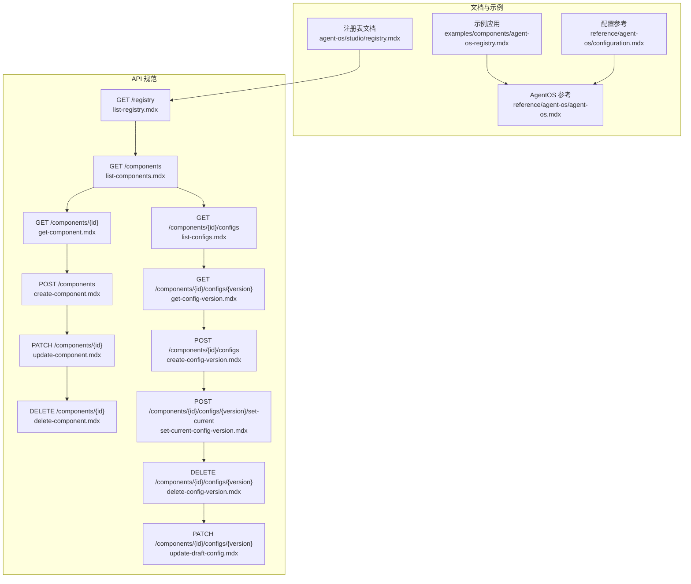
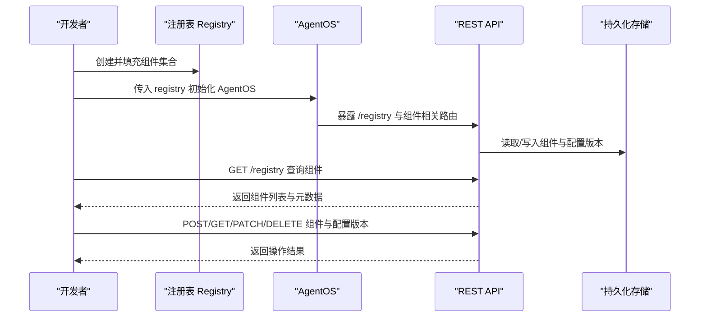
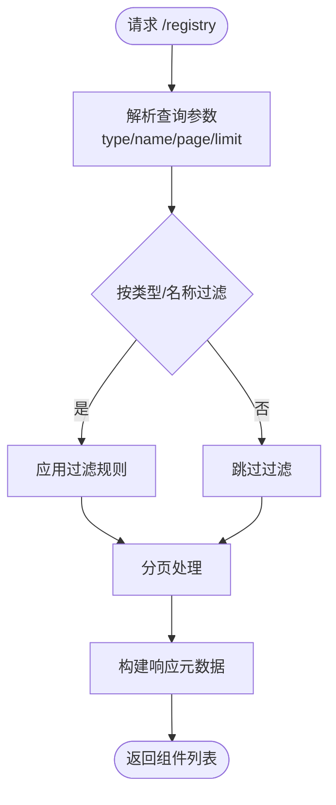
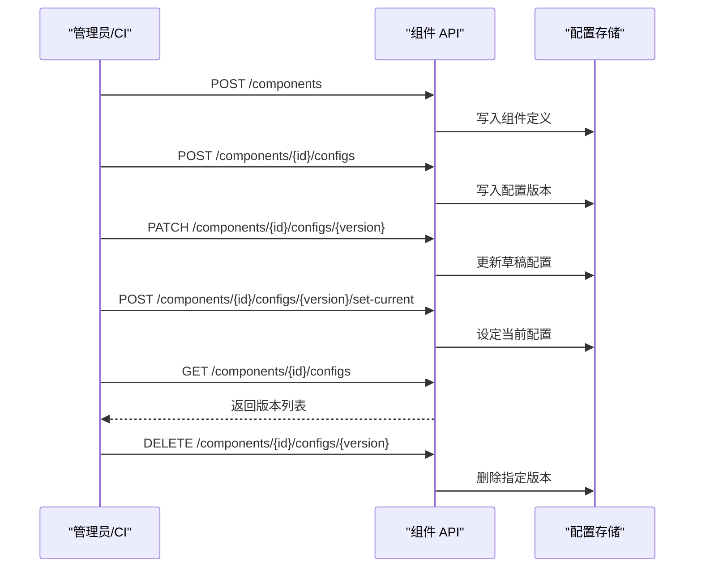
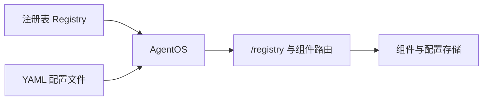

# 注册表管理

<cite>
**本文引用的文件**
- [agent-os/studio/registry.mdx](file://agent-os/studio/registry.mdx)
- [examples/components/agent-os-registry.mdx](file://examples/components/agent-os-registry.mdx)
- [reference/agent-os/agent-os.mdx](file://reference/agent-os/agent-os.mdx)
- [reference/agent-os/configuration.mdx](file://reference/agent-os/configuration.mdx)
- [reference-api/schema/registry/list-registry.mdx](file://reference-api/schema/registry/list-registry.mdx)
- [reference-api/schema/components/list-components.mdx](file://reference-api/schema/components/list-components.mdx)
- [reference-api/schema/components/get-component.mdx](file://reference-api/schema/components/get-component.mdx)
- [reference-api/schema/components/create-component.mdx](file://reference-api/schema/components/create-component.mdx)
- [reference-api/schema/components/update-component.mdx](file://reference-api/schema/components/update-component.mdx)
- [reference-api/schema/components/delete-component.mdx](file://reference-api/schema/components/delete-component.mdx)
- [reference-api/schema/components/list-configs.mdx](file://reference-api/schema/components/list-configs.mdx)
- [reference-api/schema/components/get-config-version.mdx](file://reference-api/schema/components/get-config-version.mdx)
- [reference-api/schema/components/create-config-version.mdx](file://reference-api/schema/components/create-config-version.mdx)
- [reference-api/schema/components/set-current-config-version.mdx](file://reference-api/schema/components/set-current-config-version.mdx)
- [reference-api/schema/components/delete-config-version.mdx](file://reference-api/schema/components/delete-config-version.mdx)
- [reference-api/schema/components/update-draft-config.mdx](file://reference-api/schema/components/update-draft-config.mdx)
</cite>

## 目录
1. [简介](#简介)
2. [项目结构](#项目结构)
3. [核心组件](#核心组件)
4. [架构总览](#架构总览)
5. [组件详解](#组件详解)
6. [依赖关系分析](#依赖关系分析)
7. [性能考量](#性能考量)
8. [故障排查指南](#故障排查指南)
9. [结论](#结论)
10. [附录](#附录)

## 简介
本章节系统化阐述 AgentOS Studio 的注册表（Registry）管理能力：统一管理非可序列化组件（工具、模型、数据库、向量库、数据模式、函数），支持通过 API 进行浏览、搜索与分页查询，并提供组件与配置版本的全生命周期管理。注册表是 Studio 组件生态的核心枢纽，确保组件在运行期可被稳定发现、加载与复用。

## 项目结构
围绕注册表的相关文档与示例分布在以下位置：
- 注册表使用与 API：agent-os/studio/registry.mdx
- 示例应用：examples/components/agent-os-registry.mdx
- AgentOS 核心参数与生命周期：reference/agent-os/agent-os.mdx
- 配置文件与页面级配置：reference/agent-os/configuration.mdx
- 注册表与组件 API 规范：reference-api/schema 下的 registry 与 components 子目录

图表来源
- [agent-os/studio/registry.mdx:1-85](file://agent-os/studio/registry.mdx#L1-L85)
- [examples/components/agent-os-registry.mdx:1-83](file://examples/components/agent-os-registry.mdx#L1-L83)
- [reference/agent-os/agent-os.mdx:1-100](file://reference/agent-os/agent-os.mdx#L1-L100)
- [reference/agent-os/configuration.mdx:1-83](file://reference/agent-os/configuration.mdx#L1-L83)
- [reference-api/schema/registry/list-registry.mdx:1-3](file://reference-api/schema/registry/list-registry.mdx#L1-L3)
- [reference-api/schema/components/list-components.mdx:1-3](file://reference-api/schema/components/list-components.mdx#L1-L3)
- [reference-api/schema/components/get-component.mdx:1-3](file://reference-api/schema/components/get-component.mdx#L1-L3)
- [reference-api/schema/components/create-component.mdx:1-3](file://reference-api/schema/components/create-component.mdx#L1-L3)
- [reference-api/schema/components/update-component.mdx:1-3](file://reference-api/schema/components/update-component.mdx#L1-L3)
- [reference-api/schema/components/delete-component.mdx:1-3](file://reference-api/schema/components/delete-component.mdx#L1-L3)
- [reference-api/schema/components/list-configs.mdx:1-3](file://reference-api/schema/components/list-configs.mdx#L1-L3)
- [reference-api/schema/components/get-config-version.mdx:1-3](file://reference-api/schema/components/get-config-version.mdx#L1-L3)
- [reference-api/schema/components/create-config-version.mdx:1-3](file://reference-api/schema/components/create-config-version.mdx#L1-L3)
- [reference-api/schema/components/set-current-config-version.mdx:1-3](file://reference-api/schema/components/set-current-config-version.mdx#L1-L3)
- [reference-api/schema/components/delete-config-version.mdx:1-3](file://reference-api/schema/components/delete-config-version.mdx#L1-L3)
- [reference-api/schema/components/update-draft-config.mdx:1-3](file://reference-api/schema/components/update-draft-config.mdx#L1-L3)

章节来源
- [agent-os/studio/registry.mdx:1-85](file://agent-os/studio/registry.mdx#L1-L85)
- [examples/components/agent-os-registry.mdx:1-83](file://examples/components/agent-os-registry.mdx#L1-L83)
- [reference/agent-os/agent-os.mdx:1-100](file://reference/agent-os/agent-os.mdx#L1-L100)
- [reference/agent-os/configuration.mdx:1-83](file://reference/agent-os/configuration.mdx#L1-L83)
- [reference-api/schema/registry/list-registry.mdx:1-3](file://reference-api/schema/registry/list-registry.mdx#L1-L3)
- [reference-api/schema/components/list-components.mdx:1-3](file://reference-api/schema/components/list-components.mdx#L1-L3)
- [reference-api/schema/components/get-component.mdx:1-3](file://reference-api/schema/components/get-component.mdx#L1-L3)
- [reference-api/schema/components/create-component.mdx:1-3](file://reference-api/schema/components/create-component.mdx#L1-L3)
- [reference-api/schema/components/update-component.mdx:1-3](file://reference-api/schema/components/update-component.mdx#L1-L3)
- [reference-api/schema/components/delete-component.mdx:1-3](file://reference-api/schema/components/delete-component.mdx#L1-L3)
- [reference-api/schema/components/list-configs.mdx:1-3](file://reference-api/schema/components/list-configs.mdx#L1-L3)
- [reference-api/schema/components/get-config-version.mdx:1-3](file://reference-api/schema/components/get-config-version.mdx#L1-L3)
- [reference-api/schema/components/create-config-version.mdx:1-3](file://reference-api/schema/components/create-config-version.mdx#L1-L3)
- [reference-api/schema/components/set-current-config-version.mdx:1-3](file://reference-api/schema/components/set-current-config-version.mdx#L1-L3)
- [reference-api/schema/components/delete-config-version.mdx:1-3](file://reference-api/schema/components/delete-config-version.mdx#L1-L3)
- [reference-api/schema/components/update-draft-config.mdx:1-3](file://reference-api/schema/components/update-draft-config.mdx#L1-L3)

## 核心组件
- 工具（Tools）：ToolKit 实例、函数对象或任意可调用对象
- 模型（Models）：模型提供商实例（如 OpenAI、Anthropic 等）
- 数据库（Databases）：存储用 BaseDb 实例
- 向量数据库（Vector DBs）：知识库用 VectorDb 实例
- 数据模式（Schemas）：用于结构化输入输出的 Pydantic BaseModel 子类
- 函数（Functions）：Python 可调用对象，作为工作流评估器、选择器或执行器

这些组件通过 Registry 聚合，并由 AgentOS 在运行时统一发现与加载。

章节来源
- [agent-os/studio/registry.mdx:43-53](file://agent-os/studio/registry.mdx#L43-L53)

## 架构总览
注册表在 AgentOS 中扮演“组件注册中心”的角色，负责：
- 统一注册与暴露组件
- 提供组件与配置版本的 REST API
- 支持按类型、名称过滤与分页
- 与 AgentOS 应用生命周期集成（get_app、serve、resync）

图表来源
- [agent-os/studio/registry.mdx:29-41](file://agent-os/studio/registry.mdx#L29-L41)
- [reference/agent-os/agent-os.mdx:73-100](file://reference/agent-os/agent-os.mdx#L73-L100)
- [reference-api/schema/registry/list-registry.mdx:1-3](file://reference-api/schema/registry/list-registry.mdx#L1-L3)
- [reference-api/schema/components/list-components.mdx:1-3](file://reference-api/schema/components/list-components.mdx#L1-L3)
- [reference-api/schema/components/create-component.mdx:1-3](file://reference-api/schema/components/create-component.mdx#L1-L3)
- [reference-api/schema/components/get-component.mdx:1-3](file://reference-api/schema/components/get-component.mdx#L1-L3)
- [reference-api/schema/components/update-component.mdx:1-3](file://reference-api/schema/components/update-component.mdx#L1-L3)
- [reference-api/schema/components/delete-component.mdx:1-3](file://reference-api/schema/components/delete-component.mdx#L1-L3)
- [reference-api/schema/components/list-configs.mdx:1-3](file://reference-api/schema/components/list-configs.mdx#L1-L3)
- [reference-api/schema/components/get-config-version.mdx:1-3](file://reference-api/schema/components/get-config-version.mdx#L1-L3)
- [reference-api/schema/components/create-config-version.mdx:1-3](file://reference-api/schema/components/create-config-version.mdx#L1-L3)
- [reference-api/schema/components/set-current-config-version.mdx:1-3](file://reference-api/schema/components/set-current-config-version.mdx#L1-L3)
- [reference-api/schema/components/delete-config-version.mdx:1-3](file://reference-api/schema/components/delete-config-version.mdx#L1-L3)
- [reference-api/schema/components/update-draft-config.mdx:1-3](file://reference-api/schema/components/update-draft-config.mdx#L1-L3)

## 组件详解

### 注册表 API 与查询
- 端点：GET /registry
- 支持参数：
  - component_type：按类型过滤（TOOL、MODEL、DB、VECTOR_DB、SCHEMA、FUNCTION）
  - name：按名称模糊匹配（不区分大小写）
  - page：页码，默认 1
  - limit：每页数量，默认 20，范围 1–100
- 响应元数据：不同组件类型返回特定字段（例如工具的 class_path/signature、模型的 provider/model_id、数据库的 db_id、向量库的 collection/table_name、模式的 JSON Schema、函数的 signature/parameters）

图表来源
- [agent-os/studio/registry.mdx:56-78](file://agent-os/studio/registry.mdx#L56-L78)

章节来源
- [agent-os/studio/registry.mdx:56-78](file://agent-os/studio/registry.mdx#L56-L78)

### 组件与配置版本管理
- 列出组件：GET /components
- 获取单个组件：GET /components/{id}
- 创建组件：POST /components
- 更新组件：PATCH /components/{id}
- 删除组件：DELETE /components/{id}
- 列出组件配置版本：GET /components/{id}/configs
- 获取指定配置版本：GET /components/{id}/configs/{version}
- 创建配置版本：POST /components/{id}/configs
- 设置当前配置版本：POST /components/{id}/configs/{version}/set-current
- 删除配置版本：DELETE /components/{id}/configs/{version}
- 更新草稿配置：PATCH /components/{id}/configs/{version}

图表来源
- [reference-api/schema/components/list-components.mdx:1-3](file://reference-api/schema/components/list-components.mdx#L1-L3)
- [reference-api/schema/components/get-component.mdx:1-3](file://reference-api/schema/components/get-component.mdx#L1-L3)
- [reference-api/schema/components/create-component.mdx:1-3](file://reference-api/schema/components/create-component.mdx#L1-L3)
- [reference-api/schema/components/update-component.mdx:1-3](file://reference-api/schema/components/update-component.mdx#L1-L3)
- [reference-api/schema/components/delete-component.mdx:1-3](file://reference-api/schema/components/delete-component.mdx#L1-L3)
- [reference-api/schema/components/list-configs.mdx:1-3](file://reference-api/schema/components/list-configs.mdx#L1-L3)
- [reference-api/schema/components/get-config-version.mdx:1-3](file://reference-api/schema/components/get-config-version.mdx#L1-L3)
- [reference-api/schema/components/create-config-version.mdx:1-3](file://reference-api/schema/components/create-config-version.mdx#L1-L3)
- [reference-api/schema/components/set-current-config-version.mdx:1-3](file://reference-api/schema/components/set-current-config-version.mdx#L1-L3)
- [reference-api/schema/components/delete-config-version.mdx:1-3](file://reference-api/schema/components/delete-config-version.mdx#L1-L3)
- [reference-api/schema/components/update-draft-config.mdx:1-3](file://reference-api/schema/components/update-draft-config.mdx#L1-L3)

章节来源
- [reference-api/schema/components/list-components.mdx:1-3](file://reference-api/schema/components/list-components.mdx#L1-L3)
- [reference-api/schema/components/get-component.mdx:1-3](file://reference-api/schema/components/get-component.mdx#L1-L3)
- [reference-api/schema/components/create-component.mdx:1-3](file://reference-api/schema/components/create-component.mdx#L1-L3)
- [reference-api/schema/components/update-component.mdx:1-3](file://reference-api/schema/components/update-component.mdx#L1-L3)
- [reference-api/schema/components/delete-component.mdx:1-3](file://reference-api/schema/components/delete-component.mdx#L1-L3)
- [reference-api/schema/components/list-configs.mdx:1-3](file://reference-api/schema/components/list-configs.mdx#L1-L3)
- [reference-api/schema/components/get-config-version.mdx:1-3](file://reference-api/schema/components/get-config-version.mdx#L1-L3)
- [reference-api/schema/components/create-config-version.mdx:1-3](file://reference-api/schema/components/create-config-version.mdx#L1-L3)
- [reference-api/schema/components/set-current-config-version.mdx:1-3](file://reference-api/schema/components/set-current-config-version.mdx#L1-L3)
- [reference-api/schema/components/delete-config-version.mdx:1-3](file://reference-api/schema/components/delete-config-version.mdx#L1-L3)
- [reference-api/schema/components/update-draft-config.mdx:1-3](file://reference-api/schema/components/update-draft-config.mdx#L1-L3)

### 使用示例与最佳实践
- 示例应用展示了如何创建 Registry 并将其注入 AgentOS，随后启动服务以提供注册表与组件 API。
- 最佳实践建议：
  - 统一命名规范：组件 id 采用清晰语义，避免冲突；配置版本采用语义化版本或时间戳前缀
  - 版本管理策略：先草稿后发布，变更走版本号递增；保留历史版本以便回滚
  - 性能优化：对高频查询启用分页与索引；缓存静态组件清单；限制单页数量
  - 安全与授权：结合 AgentOS 的授权配置，保护敏感组件与配置操作

章节来源
- [examples/components/agent-os-registry.mdx:1-83](file://examples/components/agent-os-registry.mdx#L1-L83)
- [reference/agent-os/agent-os.mdx:37-67](file://reference/agent-os/agent-os.mdx#L37-L67)

## 依赖关系分析
- 组件耦合
  - Registry 依赖于具体组件类型（工具、模型、数据库、向量库、模式、函数）
  - AgentOS 通过 registry 参数接入注册表，从而在运行时统一发现与加载
  - 组件 API 依赖持久化存储以维护组件与配置版本
- 外部依赖
  - AgentOS 提供 get_app/serve/resync 等生命周期方法，注册表与其紧密集成
  - 页面级配置（如知识、记忆、会话等）可通过 YAML 文件进行统一管理

图表来源
- [agent-os/studio/registry.mdx:29-41](file://agent-os/studio/registry.mdx#L29-L41)
- [reference/agent-os/agent-os.mdx:73-100](file://reference/agent-os/agent-os.mdx#L73-L100)
- [reference/agent-os/configuration.mdx:8-83](file://reference/agent-os/configuration.mdx#L8-L83)

章节来源
- [agent-os/studio/registry.mdx:29-41](file://agent-os/studio/registry.mdx#L29-L41)
- [reference/agent-os/agent-os.mdx:73-100](file://reference/agent-os/agent-os.mdx#L73-L100)
- [reference/agent-os/configuration.mdx:8-83](file://reference/agent-os/configuration.mdx#L8-L83)

## 性能考量
- 分页与过滤：合理设置 limit 与 page，避免一次性拉取大量组件
- 缓存策略：对只读组件清单与常用配置版本进行缓存
- 索引优化：在存储层为组件 id、名称、类型建立索引
- 并发访问：在高并发场景下，注意配置版本切换的原子性与一致性

## 故障排查指南
- 无法访问 /registry 或组件 API
  - 检查 AgentOS 是否正确初始化并注入了 registry
  - 确认服务已启动并通过 serve 暴露路由
- 查询无结果或过滤异常
  - 核对 component_type 与 name 参数是否符合预期
  - 检查分页参数是否合理（page、limit）
- 配置版本操作失败
  - 确认组件 id 与版本号存在且有效
  - 检查草稿版本是否已提交或删除
- 权限相关问题
  - 若启用了授权，确认 JWT 验证配置正确

章节来源
- [reference/agent-os/agent-os.mdx:81-100](file://reference/agent-os/agent-os.mdx#L81-L100)
- [agent-os/studio/registry.mdx:56-78](file://agent-os/studio/registry.mdx#L56-L78)

## 结论
注册表是 AgentOS Studio 组件生态的中枢，既承担组件的统一注册与发现职责，又提供完整的组件与配置版本管理 API。通过规范的命名与版本策略、合理的性能优化与安全配置，可以实现组件的高效治理与稳定运行。

## 附录
- 快速参考
  - 注册表端点：GET /registry
  - 组件管理：GET /components、GET /components/{id}、POST /components、PATCH /components/{id}、DELETE /components/{id}
  - 配置版本：GET /components/{id}/configs、GET /components/{id}/configs/{version}、POST /components/{id}/configs、PATCH /components/{id}/configs/{version}、POST /components/{id}/configs/{version}/set-current、DELETE /components/{id}/configs/{version}

章节来源
- [reference-api/schema/registry/list-registry.mdx:1-3](file://reference-api/schema/registry/list-registry.mdx#L1-L3)
- [reference-api/schema/components/list-components.mdx:1-3](file://reference-api/schema/components/list-components.mdx#L1-L3)
- [reference-api/schema/components/get-component.mdx:1-3](file://reference-api/schema/components/get-component.mdx#L1-L3)
- [reference-api/schema/components/create-component.mdx:1-3](file://reference-api/schema/components/create-component.mdx#L1-L3)
- [reference-api/schema/components/update-component.mdx:1-3](file://reference-api/schema/components/update-component.mdx#L1-L3)
- [reference-api/schema/components/delete-component.mdx:1-3](file://reference-api/schema/components/delete-component.mdx#L1-L3)
- [reference-api/schema/components/list-configs.mdx:1-3](file://reference-api/schema/components/list-configs.mdx#L1-L3)
- [reference-api/schema/components/get-config-version.mdx:1-3](file://reference-api/schema/components/get-config-version.mdx#L1-L3)
- [reference-api/schema/components/create-config-version.mdx:1-3](file://reference-api/schema/components/create-config-version.mdx#L1-L3)
- [reference-api/schema/components/set-current-config-version.mdx:1-3](file://reference-api/schema/components/set-current-config-version.mdx#L1-L3)
- [reference-api/schema/components/delete-config-version.mdx:1-3](file://reference-api/schema/components/delete-config-version.mdx#L1-L3)
- [reference-api/schema/components/update-draft-config.mdx:1-3](file://reference-api/schema/components/update-draft-config.mdx#L1-L3)