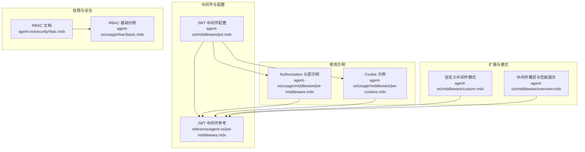
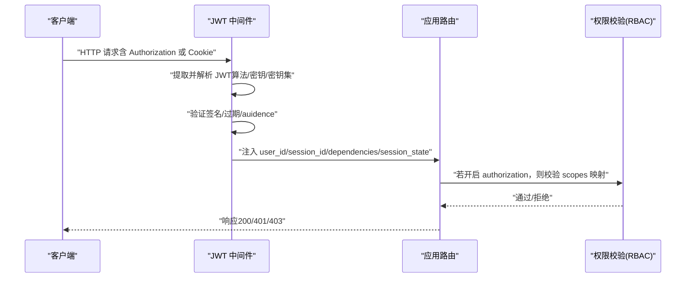
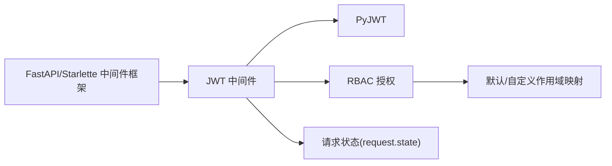

# JWT 中间件

<cite>
**本文引用的文件**
- [jwt.mdx](file://agent-os/middleware/jwt.mdx)
- [jwt-middleware.mdx](file://agent-os/usage/middleware/jwt-middleware.mdx)
- [jwt-cookies.mdx](file://agent-os/usage/middleware/jwt-cookies.mdx)
- [rbac.mdx](file://agent-os/security/rbac.mdx)
- [jwt-middleware.mdx](file://reference/agent-os/jwt-middleware.mdx)
- [custom.mdx](file://agent-os/middleware/custom.mdx)
- [overview.mdx](file://agent-os/middleware/overview.mdx)
- [basic.mdx](file://agent-os/usage/rbac/basic.mdx)
</cite>

## 目录
1. [简介](#简介)
2. [项目结构](#项目结构)
3. [核心组件](#核心组件)
4. [架构总览](#架构总览)
5. [详细组件分析](#详细组件分析)
6. [依赖关系分析](#依赖关系分析)
7. [性能考虑](#性能考虑)
8. [故障排查指南](#故障排查指南)
9. [结论](#结论)
10. [附录](#附录)

## 简介
本技术文档面向 AgentOS 的 JWT 中间件，系统性阐述其工作原理、认证与授权流程、配置方法、参数自动注入机制、路由排除策略、RBAC 集成以及常见问题与性能优化建议。读者可据此在 API 客户端或 Web 应用中安全地启用基于 JWT 的身份验证与细粒度权限控制，并通过 HTTP-only Cookie 或 Authorization 头部实现灵活的令牌提取方式。

## 项目结构
围绕 JWT 中间件的关键文档与示例分布如下：
- 中间件配置与使用：agent-os/middleware/jwt.mdx、reference/agent-os/jwt-middleware.mdx
- 使用示例（Authorization 头部与 Cookie）：agent-os/usage/middleware/jwt-middleware.mdx、agent-os/usage/middleware/jwt-cookies.mdx
- RBAC 权限模型与默认映射：agent-os/security/rbac.mdx、agent-os/usage/rbac/basic.mdx
- 自定义中间件模式：agent-os/middleware/custom.mdx
- 中间件概览与性能提示：agent-os/middleware/overview.mdx

图表来源
- [jwt.mdx:1-341](file://agent-os/middleware/jwt.mdx#L1-L341)
- [jwt-middleware.mdx:1-198](file://reference/agent-os/jwt-middleware.mdx#L1-L198)
- [jwt-middleware.mdx:1-174](file://agent-os/usage/middleware/jwt-middleware.mdx#L1-L174)
- [jwt-cookies.mdx:1-235](file://agent-os/usage/middleware/jwt-cookies.mdx#L1-L235)
- [rbac.mdx:1-410](file://agent-os/security/rbac.mdx#L1-L410)
- [basic.mdx:1-146](file://agent-os/usage/rbac/basic.mdx#L1-L146)
- [custom.mdx:1-249](file://agent-os/middleware/custom.mdx#L1-L249)
- [overview.mdx:65-97](file://agent-os/middleware/overview.mdx#L65-L97)

章节来源
- [jwt.mdx:1-341](file://agent-os/middleware/jwt.mdx#L1-L341)
- [jwt-middleware.mdx:1-198](file://reference/agent-os/jwt-middleware.mdx#L1-L198)

## 核心组件
- JWT 中间件：负责从请求中提取 JWT（支持 Authorization 头部、HTTP-only Cookie 或两者），进行签名验证、audience 校验、过期检查；并将 user_id、session_id、dependencies、session_state 等注入到请求状态与端点参数。
- RBAC 授权：当开启 authorization 时，依据 JWT 的 scopes claim 与默认/自定义映射，校验端点所需权限。
- TokenSource 枚举：控制令牌提取来源（HEADER、COOKIE、BOTH）。
- 请求状态存储：在 request.state 中保存认证状态、用户标识、会话标识、权限范围、audience、原始 token、依赖与会话状态等。

章节来源
- [jwt.mdx:14-35](file://agent-os/middleware/jwt.mdx#L14-L35)
- [jwt-middleware.mdx:165-181](file://reference/agent-os/jwt-middleware.mdx#L165-L181)
- [rbac.mdx:1-410](file://agent-os/security/rbac.mdx#L1-L410)

## 架构总览
JWT 中间件在 FastAPI/Starlette 层拦截请求，按配置从头部或 Cookie 提取令牌，执行验证与可选的 audience 校验，随后将关键 claims 注入到请求状态与端点参数，最后交由后续路由处理器执行业务逻辑。RBAC 在此过程中对 scopes 进行比对，不足则返回 403。

图表来源
- [jwt.mdx:158-174](file://agent-os/middleware/jwt.mdx#L158-L174)
- [rbac.mdx:149-255](file://agent-os/security/rbac.mdx#L149-L255)
- [jwt-middleware.mdx:165-181](file://reference/agent-os/jwt-middleware.mdx#L165-L181)

## 详细组件分析

### 认证与令牌提取
- 支持三种来源：
  - Authorization 头部：从 Authorization: Bearer <token> 提取。
  - HTTP-only Cookie：从指定 cookie 名称提取。
  - 双来源：优先头部，否则回退到 Cookie。
- 默认排除路径：根路径、健康检查、文档与 OpenAPI 元数据等，便于开发调试。
- 安全建议：使用强密钥/密钥集；启用 validate；启用 verify_audience 并匹配 AgentOS ID；Cookie 场景下设置 httponly、secure、samesite。

章节来源
- [jwt.mdx:38-83](file://agent-os/middleware/jwt.mdx#L38-L83)
- [jwt-middleware.mdx:40-59](file://reference/agent-os/jwt-middleware.mdx#L40-L59)
- [jwt-cookies.mdx:106-126](file://agent-os/usage/middleware/jwt-cookies.mdx#L106-L126)

### 参数自动注入（user_id、session_id、dependencies、session_state）
- user_id_claim、session_id_claim 指定从 JWT 中提取的键名，默认分别为 sub 与 session_id。
- dependencies_claims、session_state_claims 指定从 JWT 中抽取的自定义 claims，分别注入到依赖字典与会话状态字典，供工具与会话管理使用。
- 注入后可用于自动过滤会话、在运行代理时携带用户上下文、在工具调用中直接读取用户信息等。

章节来源
- [jwt.mdx:134-150](file://agent-os/middleware/jwt.mdx#L134-L150)
- [jwt-middleware.mdx:165-181](file://reference/agent-os/jwt-middleware.mdx#L165-L181)
- [jwt-middleware.mdx:28-47](file://agent-os/usage/middleware/jwt-middleware.mdx#L28-L47)

### TokenSource 与 Cookie 管理
- TokenSource.HEADER：适用于 API 客户端。
- TokenSource.COOKIE：适用于 Web 应用，需配合设置/清除 Cookie 的端点，并在中间件中排除这些端点以避免循环认证。
- Cookie 管理示例：设置 Cookie（httponly、secure、samesite）、清除 Cookie（登出）。

章节来源
- [jwt-cookies.mdx:58-104](file://agent-os/usage/middleware/jwt-cookies.mdx#L58-L104)
- [jwt-cookies.mdx:106-126](file://agent-os/usage/middleware/jwt-cookies.mdx#L106-L126)

### JWKS 文件支持
- 当使用 RS256 等非对称算法时，可通过 jwks_file 指向静态 JWKS 文件，按 kid 匹配公钥进行验签。
- 若未找到匹配 kid，则回退到 verification_keys（如提供）。

章节来源
- [jwt.mdx:85-132](file://agent-os/middleware/jwt.mdx#L85-L132)
- [jwt-middleware.mdx:118-145](file://reference/agent-os/jwt-middleware.mdx#L118-L145)

### RBAC 授权与作用域映射
- 开启 authorization 后，中间件读取 scopes claim，与默认/自定义映射进行比对。
- 默认映射覆盖系统、代理、团队、工作流、会话、记忆、知识、指标、评估等资源的动作权限。
- 自定义映射通过 scope_mappings 覆盖或新增特定端点所需的 scopes。
- 管理员权限：agent_os:admin 全量放行。

章节来源
- [rbac.mdx:149-255](file://agent-os/security/rbac.mdx#L149-L255)
- [rbac.mdx:257-282](file://agent-os/security/rbac.mdx#L257-L282)
- [rbac.mdx:286-326](file://agent-os/security/rbac.mdx#L286-L326)

### 路由排除与环境变量
- excluded_route_paths：可排除公共端点（如登录、注册、健康检查、文档等），避免无令牌也能访问。
- 环境变量：JWT_VERIFICATION_KEY、JWT_JWKS_FILE 等用于加载密钥与密钥集，减少硬编码风险。

章节来源
- [jwt.mdx:229-244](file://agent-os/middleware/jwt.mdx#L229-L244)
- [rbac.mdx:354-359](file://agent-os/security/rbac.mdx#L354-L359)

### 错误响应与安全特性
- 401 Unauthorized：缺失/无效令牌、过期、audience 不匹配。
- 403 Forbidden：权限不足（scopes 不满足）。
- 安全建议：启用 validate、verify_audience；Cookie 使用 httponly、secure、samesite。

章节来源
- [jwt-middleware.mdx:182-190](file://reference/agent-os/jwt-middleware.mdx#L182-L190)
- [rbac.mdx:367-373](file://agent-os/security/rbac.mdx#L367-L373)
- [jwt.mdx:152-174](file://agent-os/middleware/jwt.mdx#L152-L174)

## 依赖关系分析
JWT 中间件与以下模块存在耦合关系：
- FastAPI/Starlette 中间件框架：遵循 BaseHTTPMiddleware 模式，拦截请求与响应。
- PyJWT：用于解码与验证 JWT（签名、过期、audience）。
- RBAC 子系统：在 authorization 开启时，读取 scopes 并与默认/自定义映射比对。
- 请求状态：将认证结果与注入参数写入 request.state，供后续端点使用。

图表来源
- [jwt-middleware.mdx:1-14](file://reference/agent-os/jwt-middleware.mdx#L1-L14)
- [rbac.mdx:149-255](file://agent-os/security/rbac.mdx#L149-L255)

章节来源
- [jwt-middleware.mdx:1-14](file://reference/agent-os/jwt-middleware.mdx#L1-L14)
- [rbac.mdx:149-255](file://agent-os/security/rbac.mdx#L149-L255)

## 性能考虑
- 中间件层数增加会带来请求延迟，建议仅在必要端点启用 JWT 中间件，或通过 excluded_route_paths 排除静态资源与公开端点。
- 验签与 JWKS 查找可能带来额外开销，建议：
  - 使用缓存策略（如内存缓存最近使用的密钥）。
  - 尽量使用对称算法（HS256）以降低验签成本，或合理配置 JWKS 文件大小与 kid 匹配逻辑。
  - 在高并发场景下，确保密钥加载与验签过程线程安全。

章节来源
- [overview.mdx:81-83](file://agent-os/middleware/overview.mdx#L81-L83)

## 故障排查指南
- 401 未认证
  - 检查是否正确传递 Authorization 头或 Cookie。
  - 确认 verification_keys/jwks_file 是否正确配置且与算法匹配。
  - 核对 exp、iat、audience 是否有效。
- 403 权限不足
  - 检查 scopes claim 是否包含端点所需权限。
  - 确认默认/自定义映射是否覆盖该端点。
- Cookie 登录失败
  - 确认 Cookie 设置了 httponly、secure、samesite，并在浏览器中可用。
  - 排查 excluded_route_paths 是否遗漏了设置/清除 Cookie 的端点。
- Audience 校验失败
  - verify_audience 开启时，确保 token 的 aud 与 AgentOS ID 匹配，或提供自定义 audience。

章节来源
- [jwt-middleware.mdx:182-190](file://reference/agent-os/jwt-middleware.mdx#L182-L190)
- [rbac.mdx:367-373](file://agent-os/security/rbac.mdx#L367-L373)
- [jwt-cookies.mdx:106-126](file://agent-os/usage/middleware/jwt-cookies.mdx#L106-L126)

## 结论
JWT 中间件为 AgentOS 提供了统一的身份认证与授权入口，支持多种令牌提取方式、参数自动注入与细粒度 RBAC 控制。通过合理的配置（密钥/密钥集、audience 校验、排除路径、Cookie 安全标志）与最佳实践（生产启用验证、最小权限原则、缓存与性能优化），可在保证安全性的同时提升用户体验与系统稳定性。

## 附录

### 配置要点速查
- 基本验证：verification_keys、algorithm、validate。
- 令牌来源：token_source（HEADER/COOKIE/BOTH）、token_header_key、cookie_name。
- 参数注入：user_id_claim、session_id_claim、dependencies_claims、session_state_claims。
- 安全增强：verify_audience、audience、audience_claim。
- 授权控制：authorization、scope_mappings、admin_scope。
- 路由排除：excluded_route_paths。
- 环境变量：JWT_VERIFICATION_KEY、JWT_JWKS_FILE。

章节来源
- [jwt.mdx:245-288](file://agent-os/middleware/jwt.mdx#L245-L288)
- [jwt-middleware.mdx:15-39](file://reference/agent-os/jwt-middleware.mdx#L15-L39)

### 使用示例路径
- Authorization 头部示例：[示例代码:11-93](file://agent-os/usage/middleware/jwt-middleware.mdx#L11-L93)
- Cookie 示例：[示例代码:11-147](file://agent-os/usage/middleware/jwt-cookies.mdx#L11-L147)
- RBAC 基础示例：[示例代码:10-87](file://agent-os/usage/rbac/basic.mdx#L10-L87)

章节来源
- [jwt-middleware.mdx:1-174](file://agent-os/usage/middleware/jwt-middleware.mdx#L1-L174)
- [jwt-cookies.mdx:1-235](file://agent-os/usage/middleware/jwt-cookies.mdx#L1-L235)
- [basic.mdx:1-146](file://agent-os/usage/rbac/basic.mdx#L1-L146)