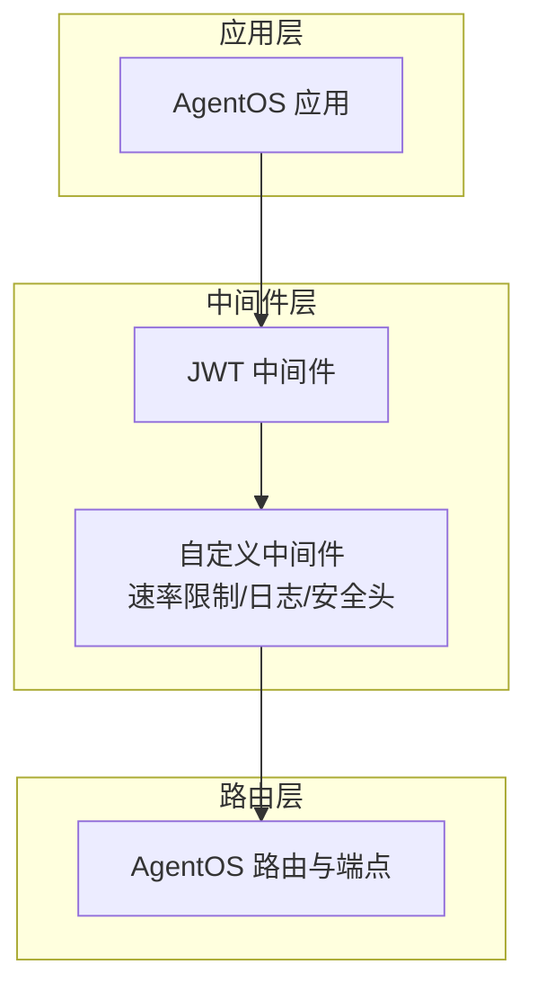
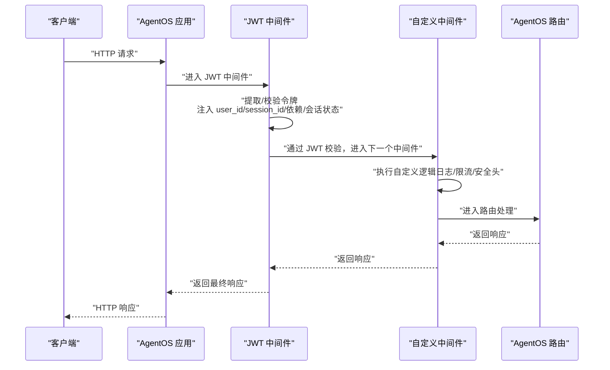
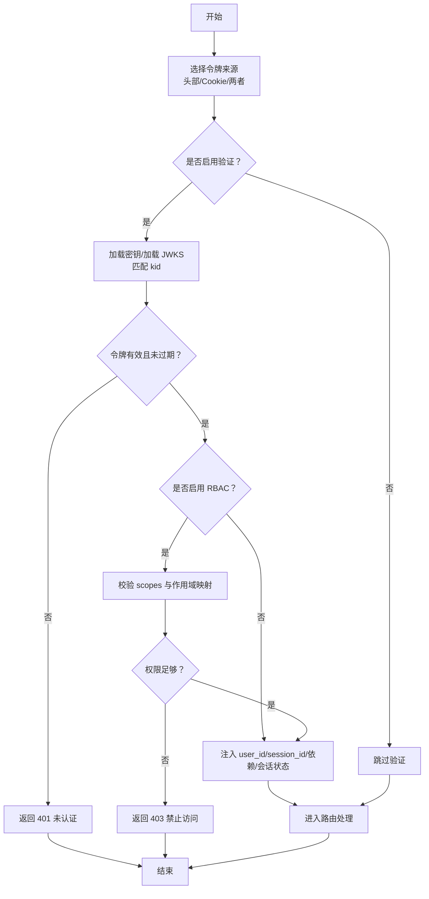
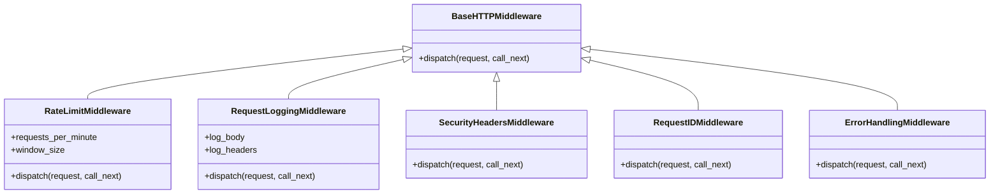
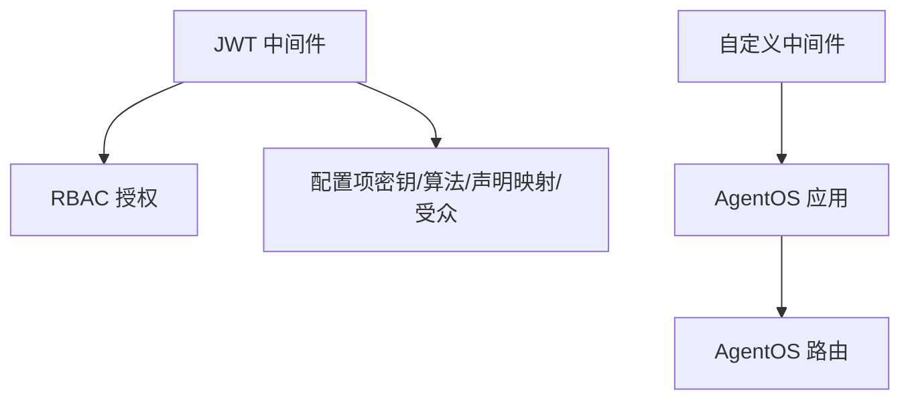

# 中间件系统

<cite>
**本文引用的文件**
- [中间件总览](file://agent-os/middleware/overview.mdx)
- [JWT 中间件](file://agent-os/middleware/jwt.mdx)
- [自定义中间件](file://agent-os/middleware/custom.mdx)
- [JWT 中间件参考](file://reference/agent-os/jwt-middleware.mdx)
- [JWT 使用示例（头部）](file://agent-os/usage/middleware/jwt-middleware.mdx)
- [JWT 使用示例（Cookie）](file://agent-os/usage/middleware/jwt-cookies.mdx)
- [自定义 FastAPI + JWT 示例](file://agent-os/usage/middleware/custom-fastapi-jwt.mdx)
- [自定义中间件示例（基础演示）](file://agent-os/usage/middleware/custom-middleware.mdx)
- [自定义中间件示例（完整演示）](file://examples/agent-os/middleware/agent-os-with-custom-middleware.mdx)
</cite>

## 目录
1. [简介](#简介)
2. [项目结构](#项目结构)
3. [核心组件](#核心组件)
4. [架构总览](#架构总览)
5. [详细组件分析](#详细组件分析)
6. [依赖分析](#依赖分析)
7. [性能考虑](#性能考虑)
8. [故障排查指南](#故障排查指南)
9. [结论](#结论)
10. [附录](#附录)

## 简介
本文件面向 AgentOS 的中间件系统，系统性介绍中间件的概念、作用与在 AgentOS 中的应用场景；深入讲解 JWT 中间件的配置与使用（含认证与授权），并提供自定义中间件的开发指南（创建、注册与配置）、执行顺序与链式调用机制；同时给出常见业务需求的实现思路（日志记录、请求验证、响应处理等），以及性能优化与错误处理的最佳实践。

## 项目结构
AgentOS 基于 FastAPI/Starlette，支持任意兼容中间件。官方提供内置 JWT 中间件用于认证与参数注入，并可结合 RBAC 进行细粒度授权控制。用户可按需添加自定义中间件以实现速率限制、请求日志、安全头、追踪 ID 等横切能力。

**章节来源**
- [中间件总览:12-14](file://agent-os/middleware/overview.mdx#L12-L14)

## 核心组件
- JWT 中间件：负责从请求中提取 JWT（支持头部或 Cookie），进行签名验证、过期检查、受众校验，并自动将用户标识、会话标识、依赖参数与会话状态注入到请求上下文与端点参数中；可选启用 RBAC，基于作用域映射进行授权校验。
- 自定义中间件：遵循 FastAPI/Starlette 的 BaseHTTPMiddleware 模式，可实现速率限制、请求/响应日志、安全头、请求 ID、异常处理等通用横切关注点。
- 执行顺序：中间件按“后添加先执行”的逆序链式调用，建议将安全类中间件置于外层，认证中间件次之，监控与业务逻辑中间件在内层。

**章节来源**
- [中间件总览:143-163](file://agent-os/middleware/overview.mdx#L143-L163)
- [JWT 中间件:14-17](file://agent-os/middleware/jwt.mdx#L14-L17)
- [自定义中间件:12-14](file://agent-os/middleware/custom.mdx#L12-L14)

## 架构总览
下图展示请求在中间件链中的流转过程，以及 JWT 中间件如何在进入路由前完成令牌解析与参数注入。

**图表来源**
- [中间件总览:143-163](file://agent-os/middleware/overview.mdx#L143-L163)
- [JWT 中间件:14-17](file://agent-os/middleware/jwt.mdx#L14-L17)

**章节来源**
- [中间件总览:143-163](file://agent-os/middleware/overview.mdx#L143-L163)

## 详细组件分析

### JWT 中间件
- 功能要点
  - 令牌来源：支持从 Authorization 头部或 HTTP-only Cookie 提取，亦可两者并用（头部优先）。
  - 验证策略：支持对称（HS256）与非对称（RS256）密钥；可使用静态密钥列表或 JWKS 文件动态匹配 kid。
  - 参数注入：自动将 user_id、session_id、dependencies、session_state 注入到端点参数与请求上下文。
  - 授权控制：可启用 RBAC，基于 scopes 声明与默认/自定义作用域映射进行权限校验；支持受众 aud 校验与管理员作用域。
  - 路由排除：可配置无需 JWT/RBAC 校验的路径（如健康检查、登录注册、公开接口等）。

- 关键配置项（节选）
  - 验证与算法：verification_keys、jwks_file、algorithm、validate
  - 令牌来源：token_source、token_header_key、cookie_name
  - 声明映射：user_id_claim、session_id_claim、scopes_claim、audience_claim、dependencies_claims、session_state_claims
  - 授权与受众：authorization、verify_audience、audience、scope_mappings、admin_scope
  - 排除路径：excluded_route_paths

- 典型使用场景
  - 头部令牌：适用于 API 客户端，Authorization: Bearer <token>。
  - Cookie 令牌：适用于 Web 应用，使用 HTTP-only Cookie 并开启安全标志（secure、sameSite）。
  - RBAC 授权：为不同资源/动作配置作用域映射，结合管理员作用域实现全站管理权限。
  - 排除公共路径：对 /health、/docs、/openapi.json 等路径免校验。

- 参考与示例
  - 基础配置与参数说明：[JWT 中间件参考:15-39](file://reference/agent-os/jwt-middleware.mdx#L15-L39)
  - 头部令牌示例：[JWT 使用示例（头部）:58-70](file://agent-os/usage/middleware/jwt-middleware.mdx#L58-L70)
  - Cookie 令牌示例：[JWT 使用示例（Cookie）:106-126](file://agent-os/usage/middleware/jwt-cookies.mdx#L106-L126)
  - 自定义 FastAPI + JWT：[自定义 FastAPI + JWT 示例:45-53](file://agent-os/usage/middleware/custom-fastapi-jwt.mdx#L45-L53)

**图表来源**
- [JWT 中间件:158-193](file://agent-os/middleware/jwt.mdx#L158-L193)
- [JWT 中间件参考:182-189](file://reference/agent-os/jwt-middleware.mdx#L182-L189)

**章节来源**
- [JWT 中间件:20-35](file://agent-os/middleware/jwt.mdx#L20-L35)
- [JWT 中间件:38-83](file://agent-os/middleware/jwt.mdx#L38-L83)
- [JWT 中间件:85-133](file://agent-os/middleware/jwt.mdx#L85-L133)
- [JWT 中间件:134-151](file://agent-os/middleware/jwt.mdx#L134-L151)
- [JWT 中间件:152-175](file://agent-os/middleware/jwt.mdx#L152-L175)
- [JWT 中间件:176-227](file://agent-os/middleware/jwt.mdx#L176-L227)
- [JWT 中间件:229-244](file://agent-os/middleware/jwt.mdx#L229-L244)
- [JWT 中间件参考:15-39](file://reference/agent-os/jwt-middleware.mdx#L15-L39)
- [JWT 中间件参考:182-189](file://reference/agent-os/jwt-middleware.mdx#L182-L189)

### 自定义中间件
- 创建模式：继承 BaseHTTPMiddleware，实现 dispatch(request, call_next) 方法，按需在进入下游或返回上游时插入逻辑。
- 常见用途：
  - 速率限制：基于滑动时间窗统计每 IP 的请求数，超限时返回 429。
  - 请求日志：记录方法、路径、客户端 IP、耗时、状态码，可选记录请求体与头部。
  - 安全头：统一注入安全相关响应头（如 X-Content-Type-Options、Strict-Transport-Security 等）。
  - 请求 ID：生成唯一请求 ID 并写入请求状态与响应头，便于跨服务追踪。
  - 异常处理：捕获下游异常，统一返回 JSON 错误响应。
- 注册方式：通过 app.add_middleware(YourMiddleware, ...) 添加，注意执行顺序。

- 参考与示例
  - 基础实现与示例代码：[自定义中间件:16-139](file://agent-os/middleware/custom.mdx#L16-L139)
  - 速率限制与日志示例（基础演示）：[自定义中间件示例（基础演示）:25-119](file://agent-os/usage/middleware/custom-middleware.mdx#L25-L119)
  - 速率限制与日志示例（完整演示）：[自定义中间件示例（完整演示）:34-128](file://examples/agent-os/middleware/agent-os-with-custom-middleware.mdx#L34-L128)

**图表来源**
- [自定义中间件:19-139](file://agent-os/middleware/custom.mdx#L19-L139)
- [自定义中间件示例（基础演示）:25-119](file://agent-os/usage/middleware/custom-middleware.mdx#L25-L119)
- [自定义中间件示例（完整演示）:34-128](file://examples/agent-os/middleware/agent-os-with-custom-middleware.mdx#L34-L128)

**章节来源**
- [自定义中间件:16-139](file://agent-os/middleware/custom.mdx#L16-L139)
- [自定义中间件示例（基础演示）:25-119](file://agent-os/usage/middleware/custom-middleware.mdx#L25-L119)
- [自定义中间件示例（完整演示）:34-128](file://examples/agent-os/middleware/agent-os-with-custom-middleware.mdx#L34-L128)

### 中间件执行顺序与链式调用
- 顺序规则：后添加的中间件先执行，形成“外层安全 -> 内层业务”的链式结构。
- 最佳实践顺序：
  1) 安全类中间件（CORS、安全头）
  2) 认证类中间件（JWT、会话校验）
  3) 监控类中间件（日志、指标）
  4) 业务类中间件（限流、缓存、参数转换）

- 示例流程图（示意）

**章节来源**
- [中间件总览:143-163](file://agent-os/middleware/overview.mdx#L143-L163)

## 依赖分析
- 组件耦合
  - JWT 中间件与 RBAC：当 authorization 启用时，依赖作用域映射与管理员作用域配置。
  - 自定义中间件：与下游路由解耦，仅通过 FastAPI 的请求/响应对象交互。
- 外部依赖
  - JWT 解析与验证：依赖 PyJWT 与密钥/密钥集配置。
  - FastAPI/Starlette：中间件实现遵循 BaseHTTPMiddleware 规范。

**图表来源**
- [JWT 中间件:176-227](file://agent-os/middleware/jwt.mdx#L176-L227)
- [JWT 中间件参考:15-39](file://reference/agent-os/jwt-middleware.mdx#L15-L39)

**章节来源**
- [JWT 中间件参考:15-39](file://reference/agent-os/jwt-middleware.mdx#L15-L39)

## 性能考虑
- 中间件数量与顺序：每增加一个中间件都会引入额外的序列化/反序列化与网络往返开销，建议合并相近职责的中间件，合理安排顺序。
- 速率限制与日志：滑动窗口计数与日志落盘可能带来 CPU 与 IO 压力，建议：
  - 使用内存队列（如 deque）并设置合理的窗口大小；
  - 日志按需开启（body/header），生产环境建议异步日志；
  - 对热点路径进行缓存与限流阈值调优。
- JWT 验证：优先使用 JWKS 缓存公钥，避免每次请求重复加载；对 HS256 密钥采用内存缓存；对 RS256 使用 kid 匹配减少无效验签尝试。
- 响应头注入：批量设置响应头的成本较低，但应避免在高频路径中进行复杂计算。

[本节为通用指导，不直接分析具体文件]

## 故障排查指南
- 401 未认证
  - 检查令牌是否存在、格式是否正确、是否过期。
  - 若使用 Cookie，请确认 httponly/secure/sameSite 设置与浏览器环境匹配。
  - 若启用受众校验，请确认 aud 或 audience 配置与令牌一致。
- 403 禁止访问
  - 检查 scopes 声明与作用域映射是否匹配；确认管理员作用域是否满足。
  - 检查 excluded_route_paths 是否误排除了需要保护的路径。
- 速率限制触发 429
  - 检查 requests_per_minute 与 window_size 配置；查看响应头 X-RateLimit-* 获取剩余配额与重置时间。
- 日志缺失或异常
  - 确认日志中间件已注册且 log_body/log_headers 开关符合预期；检查异常处理中间件是否吞掉错误信息。
- 请求 ID 未出现
  - 确认 RequestID 中间件已注册并在响应头中输出。

**章节来源**
- [JWT 中间件参考:182-189](file://reference/agent-os/jwt-middleware.mdx#L182-L189)
- [JWT 中间件:229-244](file://agent-os/middleware/jwt.mdx#L229-L244)
- [自定义中间件示例（基础演示）:240-247](file://agent-os/usage/middleware/custom-middleware.mdx#L240-L247)

## 结论
AgentOS 的中间件体系以 FastAPI/Starlette 为基础，提供了即插即用的 JWT 中间件与灵活的自定义中间件扩展能力。通过合理的中间件顺序与配置，可在保证安全性的同时兼顾可观测性与性能。JWT 中间件覆盖令牌提取、验证、受众校验与参数注入，并可无缝对接 RBAC 实现细粒度授权；自定义中间件则为速率限制、日志、安全头与异常处理等横切需求提供统一实现路径。

[本节为总结性内容，不直接分析具体文件]

## 附录

### 快速上手：在 AgentOS 中添加 JWT 中间件
- 在 AgentOS 应用中获取 app，然后添加 JWT 中间件并配置验证密钥、算法、声明映射与可选的 RBAC。
- 参考示例：
  - [JWT 中间件参考:61-90](file://reference/agent-os/jwt-middleware.mdx#L61-L90)
  - [JWT 使用示例（头部）:58-70](file://agent-os/usage/middleware/jwt-middleware.mdx#L58-L70)
  - [JWT 使用示例（Cookie）:106-126](file://agent-os/usage/middleware/jwt-cookies.mdx#L106-L126)

**章节来源**
- [JWT 中间件参考:61-90](file://reference/agent-os/jwt-middleware.mdx#L61-L90)
- [JWT 使用示例（头部）:58-70](file://agent-os/usage/middleware/jwt-middleware.mdx#L58-L70)
- [JWT 使用示例（Cookie）:106-126](file://agent-os/usage/middleware/jwt-cookies.mdx#L106-L126)

### 自定义中间件开发清单
- 明确职责：限流/日志/安全头/请求 ID/异常处理。
- 实现 dispatch：在进入下游与返回上游两个阶段插入逻辑。
- 注册顺序：根据最佳实践安排在外层安全、中间认证、内层监控与业务。
- 测试验证：构造边界条件（超限、异常、无令牌）并观察响应头与日志。

**章节来源**
- [自定义中间件:16-139](file://agent-os/middleware/custom.mdx#L16-L139)
- [中间件总览:158-163](file://agent-os/middleware/overview.mdx#L158-L163)