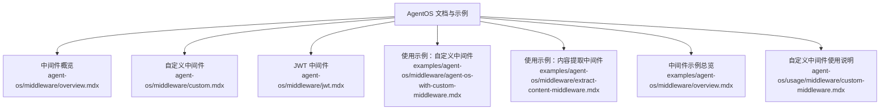
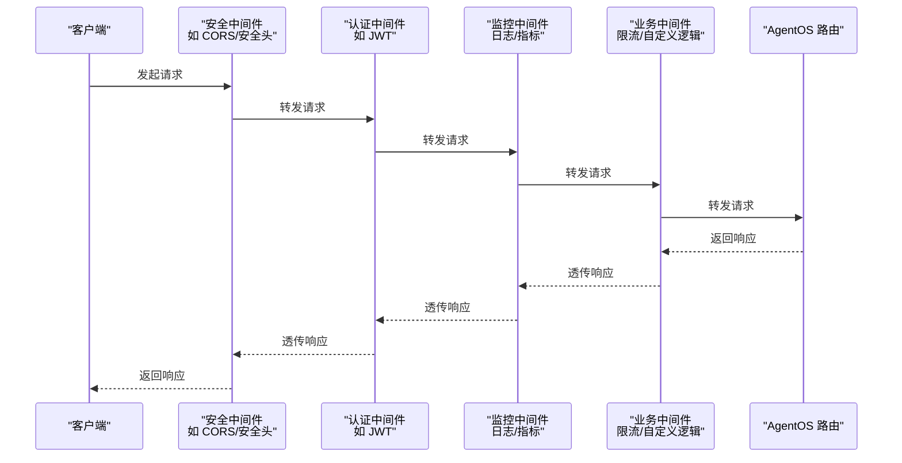
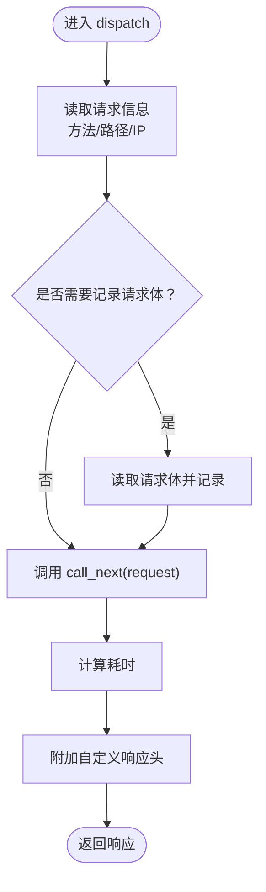
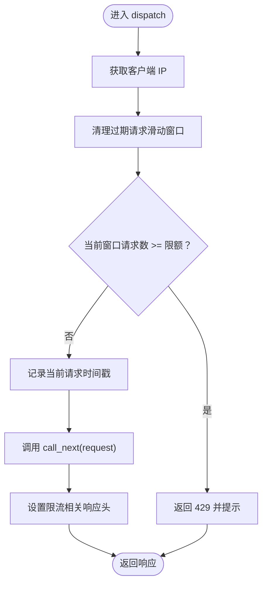
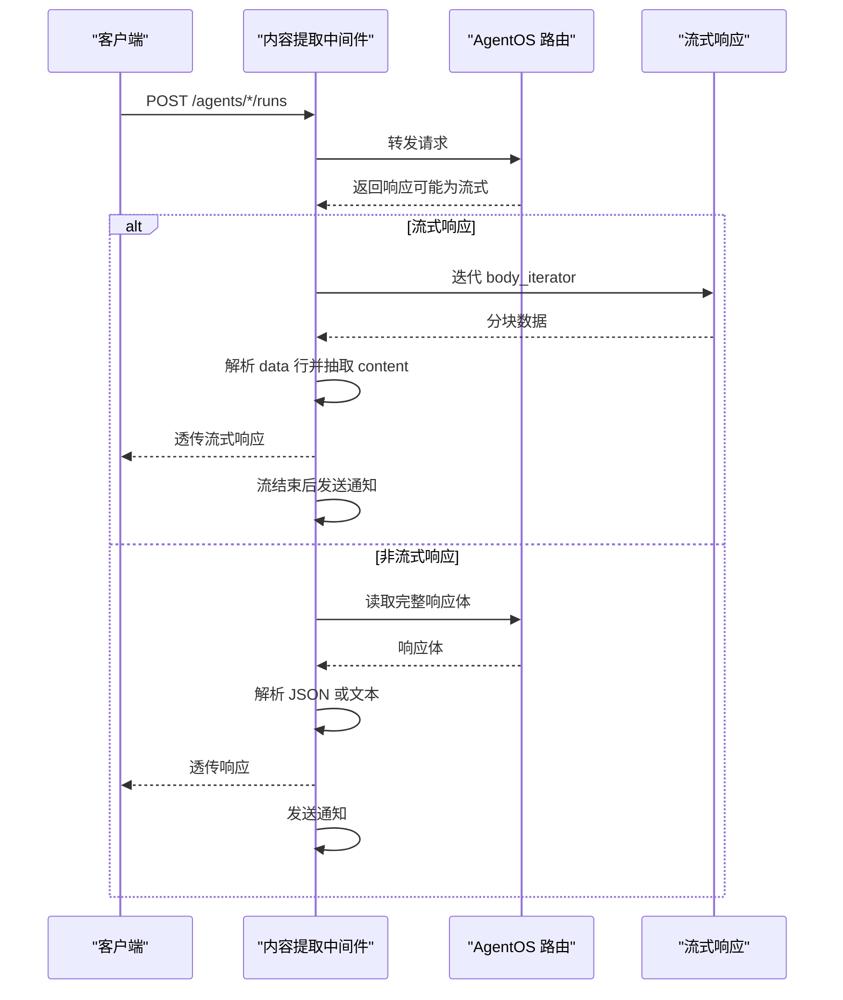
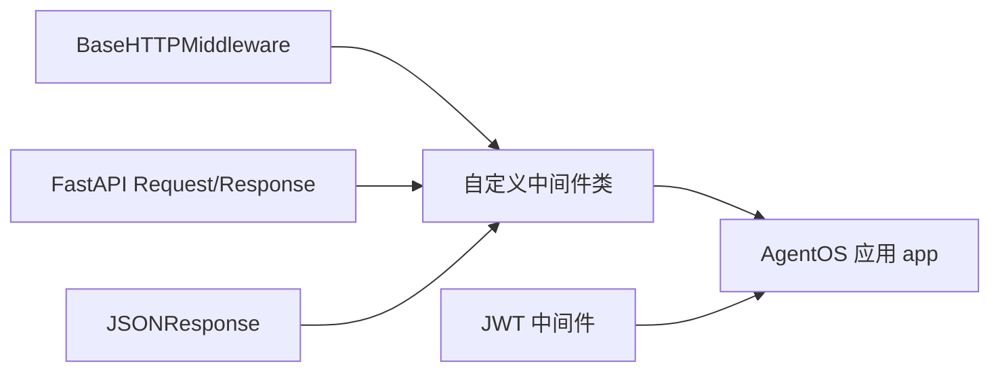

# 自定义中间件

<cite>
**本文引用的文件**
- [agent-os/middleware/custom.mdx](file://agent-os/middleware/custom.mdx)
- [agent-os/middleware/overview.mdx](file://agent-os/middleware/overview.mdx)
- [agent-os/middleware/jwt.mdx](file://agent-os/middleware/jwt.mdx)
- [agent-os/usage/middleware/custom-middleware.mdx](file://agent-os/usage/middleware/custom-middleware.mdx)
- [examples/agent-os/middleware/agent-os-with-custom-middleware.mdx](file://examples/agent-os/middleware/agent-os-with-custom-middleware.mdx)
- [examples/agent-os/middleware/extract-content-middleware.mdx](file://examples/agent-os/middleware/extract-content-middleware.mdx)
- [examples/agent-os/middleware/overview.mdx](file://examples/agent-os/middleware/overview.mdx)
</cite>

## 目录
1. [简介](#简介)
2. [项目结构](#项目结构)
3. [核心组件](#核心组件)
4. [架构总览](#架构总览)
5. [详细组件分析](#详细组件分析)
6. [依赖关系分析](#依赖关系分析)
7. [性能考量](#性能考量)
8. [故障排查指南](#故障排查指南)
9. [结论](#结论)
10. [附录](#附录)

## 简介
本指南面向希望在 AgentOS 中开发与集成自定义中间件的工程师，系统讲解如何基于 FastAPI/Starlette 的 BaseHTTPMiddleware 模式编写中间件，覆盖请求日志、速率限制、安全头、请求 ID、内容提取等常见场景，并说明中间件的执行顺序与最佳实践，以及在自定义 FastAPI 应用中与 AgentOS 集成的方法。文档中的所有代码示例均来自仓库现有示例与文档，避免凭空构造，便于直接对照实现。

## 项目结构
与中间件相关的内容主要分布在以下位置：
- AgentOS 中间件官方文档与示例：agent-os/middleware/*.mdx
- 使用示例：examples/agent-os/middleware/*.mdx
- 中间件使用说明与最佳实践：agent-os/usage/middleware/custom-middleware.mdx

图表来源
- [agent-os/middleware/overview.mdx:1-223](file://agent-os/middleware/overview.mdx#L1-L223)
- [agent-os/middleware/custom.mdx:1-249](file://agent-os/middleware/custom.mdx#L1-L249)
- [agent-os/middleware/jwt.mdx:1-341](file://agent-os/middleware/jwt.mdx#L1-L341)
- [examples/agent-os/middleware/agent-os-with-custom-middleware.mdx:1-213](file://examples/agent-os/middleware/agent-os-with-custom-middleware.mdx#L1-L213)
- [examples/agent-os/middleware/extract-content-middleware.mdx:1-211](file://examples/agent-os/middleware/extract-content-middleware.mdx#L1-L211)
- [examples/agent-os/middleware/overview.mdx:1-14](file://examples/agent-os/middleware/overview.mdx#L1-L14)
- [agent-os/usage/middleware/custom-middleware.mdx:1-282](file://agent-os/usage/middleware/custom-middleware.mdx#L1-L282)

章节来源
- [agent-os/middleware/overview.mdx:1-223](file://agent-os/middleware/overview.mdx#L1-L223)
- [examples/agent-os/middleware/overview.mdx:1-14](file://examples/agent-os/middleware/overview.mdx#L1-L14)

## 核心组件
- 基础模式：基于 BaseHTTPMiddleware 实现，通过重写 dispatch(request, call_next) 方法拦截请求与响应。
- 典型中间件类型：
  - 请求日志中间件：记录请求/响应信息、耗时、可选体与头。
  - 速率限制中间件：按 IP 维度进行滑动窗口限流并返回限流头。
  - 安全头中间件：统一注入安全响应头。
  - 请求 ID 中间件：生成并透传请求 ID。
  - 内容提取中间件：从流式或非流式响应中抽取内容，用于通知或后续处理。
- 集成方式：通过 app.add_middleware(...) 将中间件加入 AgentOS 应用。

章节来源
- [agent-os/middleware/custom.mdx:16-139](file://agent-os/middleware/custom.mdx#L16-L139)
- [agent-os/usage/middleware/custom-middleware.mdx:25-118](file://agent-os/usage/middleware/custom-middleware.mdx#L25-L118)
- [examples/agent-os/middleware/agent-os-with-custom-middleware.mdx:34-127](file://examples/agent-os/middleware/agent-os-with-custom-middleware.mdx#L34-L127)
- [examples/agent-os/middleware/extract-content-middleware.mdx:24-143](file://examples/agent-os/middleware/extract-content-middleware.mdx#L24-L143)

## 架构总览
下图展示了中间件在 AgentOS 应用中的典型执行顺序与职责分工。注意：中间件以“后加先执行”的反向顺序运行。

图表来源
- [agent-os/middleware/overview.mdx:143-162](file://agent-os/middleware/overview.mdx#L143-L162)

章节来源
- [agent-os/middleware/overview.mdx:143-162](file://agent-os/middleware/overview.mdx#L143-L162)

## 详细组件分析

### 基于 BaseHTTPMiddleware 的实现模式
- 继承 BaseHTTPMiddleware 并实现 dispatch(request, call_next)。
- 在 dispatch 中：
  - 可在调用 call_next(request) 前处理请求（如读取请求体、设置上下文）。
  - 在调用 call_next(request) 后处理响应（如注入头、统计耗时）。
- 错误处理：捕获异常并返回 JSONResponse，确保状态码与序列化正确。

章节来源
- [agent-os/middleware/custom.mdx:19-169](file://agent-os/middleware/custom.mdx#L19-L169)

### 请求日志中间件
- 功能要点：
  - 记录请求方法、路径、客户端 IP、耗时。
  - 可选记录请求头与请求体（仅对特定方法）。
  - 在响应中附加请求计数等自定义头。
- 适用场景：调试、审计、性能观测。

图表来源
- [agent-os/usage/middleware/custom-middleware.mdx:73-118](file://agent-os/usage/middleware/custom-middleware.mdx#L73-L118)
- [examples/agent-os/middleware/agent-os-with-custom-middleware.mdx:82-127](file://examples/agent-os/middleware/agent-os-with-custom-middleware.mdx#L82-L127)

章节来源
- [agent-os/usage/middleware/custom-middleware.mdx:73-118](file://agent-os/usage/middleware/custom-middleware.mdx#L73-L118)
- [examples/agent-os/middleware/agent-os-with-custom-middleware.mdx:82-127](file://examples/agent-os/middleware/agent-os-with-custom-middleware.mdx#L82-L127)

### 速率限制中间件
- 功能要点：
  - 按 IP 维度维护滑动时间窗内的请求队列。
  - 超限时返回 429，并附带限流相关头（最大请求数、剩余、重置时间）。
- 适用场景：防止滥用、保护后端资源。

图表来源
- [agent-os/usage/middleware/custom-middleware.mdx:25-70](file://agent-os/usage/middleware/custom-middleware.mdx#L25-L70)
- [examples/agent-os/middleware/agent-os-with-custom-middleware.mdx:34-79](file://examples/agent-os/middleware/agent-os-with-custom-middleware.mdx#L34-L79)

章节来源
- [agent-os/usage/middleware/custom-middleware.mdx:25-70](file://agent-os/usage/middleware/custom-middleware.mdx#L25-L70)
- [examples/agent-os/middleware/agent-os-with-custom-middleware.mdx:34-79](file://examples/agent-os/middleware/agent-os-with-custom-middleware.mdx#L34-L79)

### 安全头中间件
- 功能要点：在所有响应中注入常见安全头（如 X-Content-Type-Options、X-Frame-Options、Strict-Transport-Security 等）。
- 适用场景：提升应用安全性，减少常见攻击面。

章节来源
- [agent-os/middleware/custom.mdx:92-112](file://agent-os/middleware/custom.mdx#L92-L112)

### 请求 ID 中间件
- 功能要点：生成唯一请求 ID 并写入 request.state，同时在响应头中回传，便于跨服务追踪。
- 适用场景：分布式链路追踪、问题定位。

章节来源
- [agent-os/middleware/custom.mdx:114-137](file://agent-os/middleware/custom.mdx#L114-L137)

### 内容提取中间件（流式与非流式）
- 功能要点：
  - 识别 POST /runs 等关键端点。
  - 支持从流式 SSE 响应中解析 data 行，抽取 content 字段。
  - 对非流式响应读取完整 body 并进行通知或后续处理。
- 适用场景：将代理输出内容实时上报到外部系统或做二次加工。

图表来源
- [examples/agent-os/middleware/extract-content-middleware.mdx:24-143](file://examples/agent-os/middleware/extract-content-middleware.mdx#L24-L143)

章节来源
- [examples/agent-os/middleware/extract-content-middleware.mdx:24-143](file://examples/agent-os/middleware/extract-content-middleware.mdx#L24-L143)

### JWT 中间件（认证与 RBAC）
- 功能要点：
  - 从 Authorization 头或 Cookie 提取令牌，验证签名与过期。
  - 自动将 user_id、session_id、dependencies、session_state 注入到端点参数。
  - 支持 RBAC，校验 scopes 与所需权限。
- 适用场景：API 安全、细粒度授权控制。

章节来源
- [agent-os/middleware/jwt.mdx:12-34](file://agent-os/middleware/jwt.mdx#L12-L34)
- [agent-os/middleware/jwt.mdx:134-150](file://agent-os/middleware/jwt.mdx#L134-L150)
- [agent-os/middleware/jwt.mdx:176-226](file://agent-os/middleware/jwt.mdx#L176-L226)

## 依赖关系分析
- 中间件依赖：
  - BaseHTTPMiddleware：来自 starlette.middleware.base。
  - FastAPI Request/Response：用于读取请求与构造响应。
  - JSONResponse：用于错误响应的标准化。
- 中间件与 AgentOS 的耦合：
  - 通过 app.add_middleware(...) 注册，不侵入业务路由。
  - 可与 JWT 中间件配合实现认证与授权。

图表来源
- [agent-os/middleware/custom.mdx:28-169](file://agent-os/middleware/custom.mdx#L28-L169)
- [agent-os/usage/middleware/custom-middleware.mdx:20-22](file://agent-os/usage/middleware/custom-middleware.mdx#L20-L22)

章节来源
- [agent-os/middleware/custom.mdx:28-169](file://agent-os/middleware/custom.mdx#L28-L169)
- [agent-os/usage/middleware/custom-middleware.mdx:20-22](file://agent-os/usage/middleware/custom-middleware.mdx#L20-L22)

## 性能考量
- 执行顺序影响延迟：越靠外层的中间件越早执行，整体延迟叠加。
- 日志与体读取成本：开启请求体/头日志会增加 IO 与 CPU 开销。
- 限流算法复杂度：滑动窗口需维护队列，建议使用高效容器（如双端队列）。
- 流式响应处理：在流式场景中尽量惰性消费与解析，避免一次性缓冲大块数据。
- 建议：优先将轻量中间件置于外层，将昂贵操作（如数据库查询、外部调用）放在内层或异步化。

章节来源
- [agent-os/middleware/overview.mdx:81-83](file://agent-os/middleware/overview.mdx#L81-L83)
- [agent-os/usage/middleware/custom-middleware.mdx:224-276](file://agent-os/usage/middleware/custom-middleware.mdx#L224-L276)

## 故障排查指南
- 429 限流错误：检查 requests_per_minute 与 window_size 设置，确认响应头是否正确注入。
- 日志缺失：确认中间件注册顺序与日志级别；对于流式响应，注意在流结束后再输出。
- 安全头未生效：确认中间件在更外层注册，且未被后续中间件覆盖。
- 请求 ID 丢失：检查是否在 dispatch 中正确写入 request.state 并在响应头中回传。
- JWT 校验失败：核对 verification_keys/jwks_file、algorithm、audience 配置，以及 excluded_route_paths 是否误排除了目标路径。

章节来源
- [agent-os/usage/middleware/custom-middleware.mdx:240-274](file://agent-os/usage/middleware/custom-middleware.mdx#L240-L274)
- [agent-os/middleware/jwt.mdx:245-287](file://agent-os/middleware/jwt.mdx#L245-L287)

## 结论
通过遵循 BaseHTTPMiddleware 模式，结合 AgentOS 的 app.add_middleware(...) 接口，可以灵活地扩展认证、日志、限流、安全与内容提取等能力。合理安排中间件顺序与功能边界，既能满足安全与可观测性需求，又能控制性能开销。建议在开发阶段充分测试中间件组合效果，并在生产前进行压测与灰度验证。

## 附录

### 中间件执行顺序与最佳实践
- 执行顺序：后加先执行。建议顺序：
  1) 安全中间件（CORS、安全头）
  2) 认证中间件（JWT）
  3) 监控中间件（日志、指标）
  4) 业务中间件（限流、自定义逻辑）

章节来源
- [agent-os/middleware/overview.mdx:143-162](file://agent-os/middleware/overview.mdx#L143-L162)

### 在自定义 FastAPI 应用中集成中间件
- 获取应用实例：agent_os.get_app()
- 添加中间件：app.add_middleware(YourMiddleware, ...)
- 启动服务：agent_os.serve(...)

章节来源
- [agent-os/middleware/custom.mdx:176-222](file://agent-os/middleware/custom.mdx#L176-L222)
- [agent-os/usage/middleware/custom-middleware.mdx:138-165](file://agent-os/usage/middleware/custom-middleware.mdx#L138-L165)

### 示例清单与参考路径
- 自定义中间件示例（速率限制 + 请求日志）：[示例路径:1-213](file://examples/agent-os/middleware/agent-os-with-custom-middleware.mdx#L1-L213)
- 内容提取中间件（流式/非流式）：[示例路径:1-211](file://examples/agent-os/middleware/extract-content-middleware.mdx#L1-L211)
- 中间件使用说明（速率限制与日志）：[文档路径:1-282](file://agent-os/usage/middleware/custom-middleware.mdx#L1-L282)
- 中间件概览与最佳实践：[文档路径:1-223](file://agent-os/middleware/overview.mdx#L1-L223)
- JWT 中间件（认证与 RBAC）：[文档路径:1-341](file://agent-os/middleware/jwt.mdx#L1-L341)