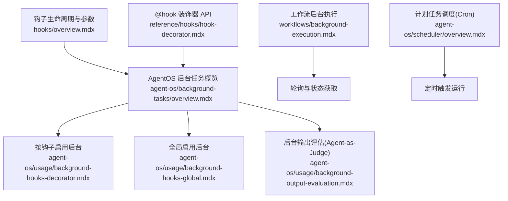
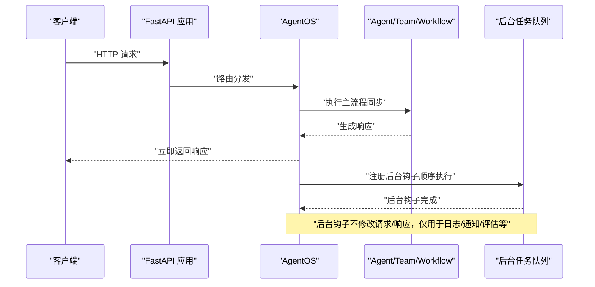
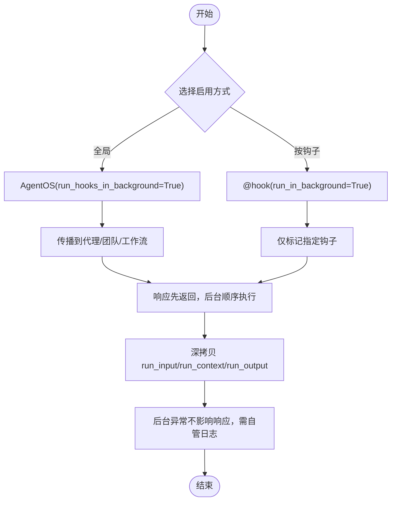
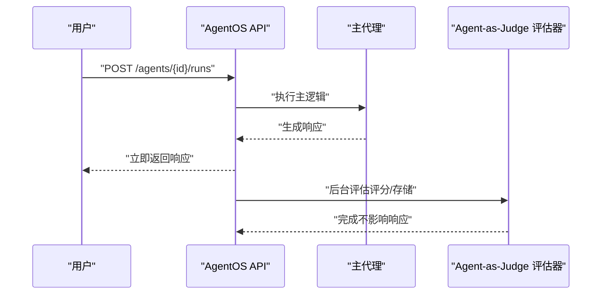
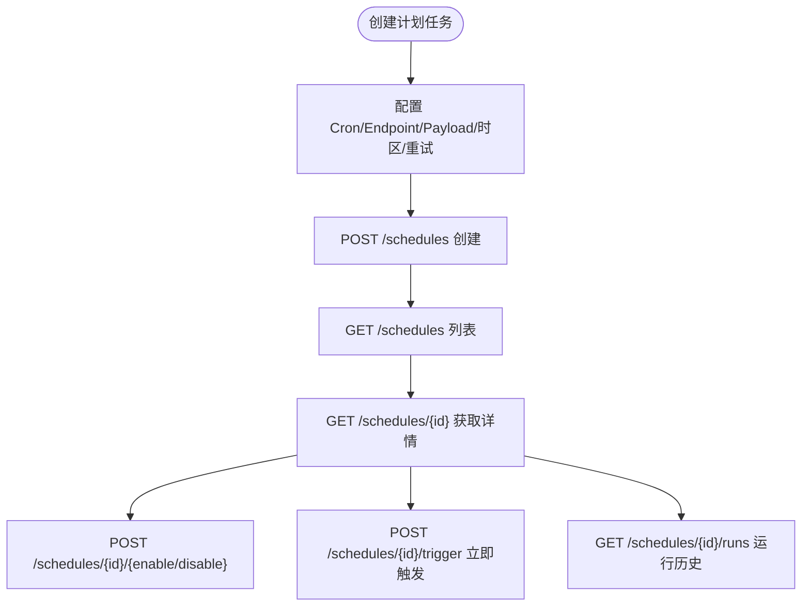
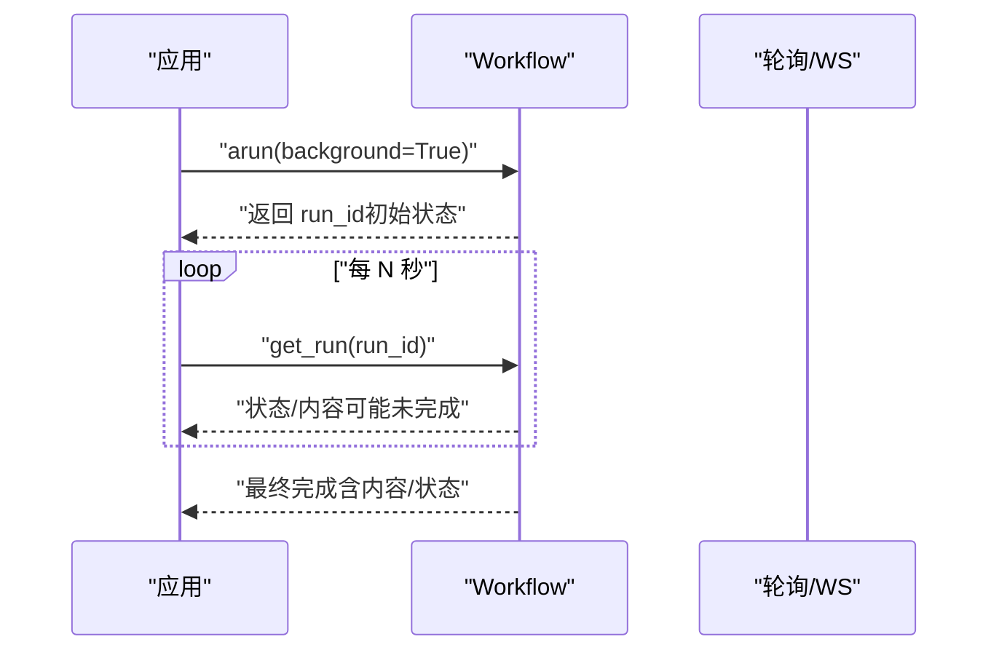
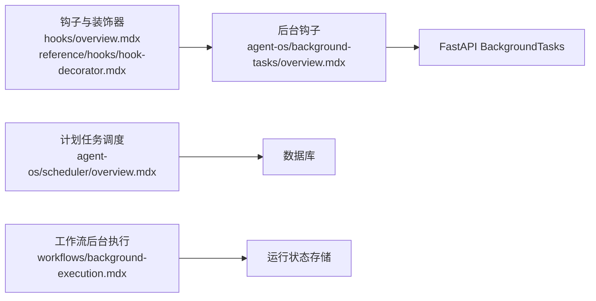

# 后台任务管理

<cite>
**本文引用的文件**
- [agent-os/background-tasks/overview.mdx](file://agent-os/background-tasks/overview.mdx)
- [agent-os/usage/background-hooks-decorator.mdx](file://agent-os/usage/background-hooks-decorator.mdx)
- [agent-os/usage/background-hooks-global.mdx](file://agent-os/usage/background-hooks-global.mdx)
- [agent-os/usage/background-output-evaluation.mdx](file://agent-os/usage/background-output-evaluation.mdx)
- [agent-os/scheduler/overview.mdx](file://agent-os/scheduler/overview.mdx)
- [workflows/background-execution.mdx](file://workflows/background-execution.mdx)
- [hooks/overview.mdx](file://hooks/overview.mdx)
- [reference/hooks/hook-decorator.mdx](file://reference/hooks/hook-decorator.mdx)
</cite>

## 目录
1. [简介](#简介)
2. [项目结构](#项目结构)
3. [核心组件](#核心组件)
4. [架构总览](#架构总览)
5. [详细组件分析](#详细组件分析)
6. [依赖关系分析](#依赖关系分析)
7. [性能考量](#性能考量)
8. [故障排查指南](#故障排查指南)
9. [结论](#结论)
10. [附录](#附录)

## 简介
本技术文档围绕 AgentOS 的后台任务管理展开，系统性阐述以下主题：
- 后台任务与后台钩子的概念及在 AgentOS 中的应用场景
- 后台钩子的两种启用方式：全局开关与装饰器细粒度控制
- 输出评估与自动化的后台任务示例（Agent-as-Judge）
- 任务调度与执行机制（基于 FastAPI BackgroundTasks 的顺序执行、数据隔离与错误处理）
- 后台任务与前台请求的协调与同步机制（响应先返回，后台再执行）
- 性能优化与错误处理最佳实践，以及监控与调试后台任务的方法

## 项目结构
与后台任务相关的核心文档分布在如下路径：
- agent-os/background-tasks/overview.mdx：后台钩子总体介绍与使用说明
- agent-os/usage/background-hooks-decorator.mdx：按钩子启用后台模式的示例
- agent-os/usage/background-hooks-global.mdx：全局启用后台钩子的示例
- agent-os/usage/background-output-evaluation.mdx：后台输出评估（Agent-as-Judge）示例
- agent-os/scheduler/overview.mdx：基于 Cron 的计划任务调度
- workflows/background-execution.mdx：工作流的异步后台执行与轮询
- hooks/overview.mdx：预钩子/后钩子生命周期与参数说明
- reference/hooks/hook-decorator.mdx：@hook 装饰器 API 参考

**图表来源**
- [agent-os/background-tasks/overview.mdx:1-168](file://agent-os/background-tasks/overview.mdx#L1-L168)
- [agent-os/usage/background-hooks-decorator.mdx:1-144](file://agent-os/usage/background-hooks-decorator.mdx#L1-L144)
- [agent-os/usage/background-hooks-global.mdx:1-140](file://agent-os/usage/background-hooks-global.mdx#L1-L140)
- [agent-os/usage/background-output-evaluation.mdx:1-160](file://agent-os/usage/background-output-evaluation.mdx#L1-L160)
- [workflows/background-execution.mdx:1-137](file://workflows/background-execution.mdx#L1-L137)
- [agent-os/scheduler/overview.mdx:1-105](file://agent-os/scheduler/overview.mdx#L1-L105)
- [hooks/overview.mdx:1-217](file://hooks/overview.mdx#L1-L217)
- [reference/hooks/hook-decorator.mdx:1-45](file://reference/hooks/hook-decorator.mdx#L1-L45)

**章节来源**
- [agent-os/background-tasks/overview.mdx:1-168](file://agent-os/background-tasks/overview.mdx#L1-L168)
- [agent-os/scheduler/overview.mdx:1-105](file://agent-os/scheduler/overview.mdx#L1-L105)

## 核心组件
- 后台钩子（Background Hooks）
  - 通过 AgentOS 全局开关或 @hook 装饰器，将钩子标记为后台执行
  - 默认同步执行会阻塞响应；后台执行在响应发送后再顺序执行
- 计划任务调度（Scheduler）
  - 基于 Cron 表达式，支持创建、查询、启用/禁用、手动触发与运行历史查看
- 工作流后台执行（Background Workflow Execution）
  - 使用异步 Workflow.arun(background=True) 启动后台运行，通过轮询或 WebSocket 获取结果
- 钩子生命周期与参数
  - 预钩子（Pre-hooks）：在模型上下文准备前执行，适合输入校验与安全防护
  - 后钩子（Post-hooks）：在响应生成后、返回前执行，适合输出校验与后处理

**章节来源**
- [agent-os/background-tasks/overview.mdx:102-136](file://agent-os/background-tasks/overview.mdx#L102-L136)
- [agent-os/scheduler/overview.mdx:35-104](file://agent-os/scheduler/overview.mdx#L35-L104)
- [workflows/background-execution.mdx:16-137](file://workflows/background-execution.mdx#L16-L137)
- [hooks/overview.mdx:25-167](file://hooks/overview.mdx#L25-L167)

## 架构总览
AgentOS 在 FastAPI 层面利用 BackgroundTasks 将钩子安排在响应发送之后顺序执行。后台钩子无法修改请求/响应，AgentOS 自动对 run_input、run_context、run_output 进行深拷贝以避免竞态。

**图表来源**
- [agent-os/background-tasks/overview.mdx:102-136](file://agent-os/background-tasks/overview.mdx#L102-L136)

**章节来源**
- [agent-os/background-tasks/overview.mdx:102-136](file://agent-os/background-tasks/overview.mdx#L102-L136)

## 详细组件分析

### 组件一：后台钩子（全局与按钩子）
- 全局启用
  - 在 AgentOS 初始化时设置 run_hooks_in_background=True，影响所有代理、团队与工作流中的钩子
  - 传播范围：所有已注册代理、团队及其成员代理、工作流及其步骤中的代理
- 按钩子启用
  - 使用 @hook(run_in_background=True) 对特定钩子进行细粒度控制
  - 适用于混合场景：关键钩子同步执行，非关键钩子后台执行
- 生命周期与参数
  - 预钩子：在模型上下文准备前执行，适合输入校验与安全检查
  - 后钩子：在响应生成后、返回前执行，适合输出校验与后处理
- 数据隔离与错误处理
  - AgentOS 自动深拷贝 run_input、run_context、run_output，避免并发修改
  - 后台异常不影响已发送的响应，需在钩子内做好日志与容错

**图表来源**
- [agent-os/background-tasks/overview.mdx:53-136](file://agent-os/background-tasks/overview.mdx#L53-L136)
- [agent-os/usage/background-hooks-decorator.mdx:81-142](file://agent-os/usage/background-hooks-decorator.mdx#L81-L142)
- [agent-os/usage/background-hooks-global.mdx:85-139](file://agent-os/usage/background-hooks-global.mdx#L85-L139)
- [reference/hooks/hook-decorator.mdx:14-34](file://reference/hooks/hook-decorator.mdx#L14-L34)

**章节来源**
- [agent-os/background-tasks/overview.mdx:53-136](file://agent-os/background-tasks/overview.mdx#L53-L136)
- [agent-os/usage/background-hooks-decorator.mdx:81-142](file://agent-os/usage/background-hooks-decorator.mdx#L81-L142)
- [agent-os/usage/background-hooks-global.mdx:85-139](file://agent-os/usage/background-hooks-global.mdx#L85-L139)
- [reference/hooks/hook-decorator.mdx:14-34](file://reference/hooks/hook-decorator.mdx#L14-L34)

### 组件二：后台输出评估（Agent-as-Judge）
- 背景
  - 使用 Agent-as-Judge 对主代理输出进行质量评估，不阻塞用户响应
  - 支持阈值、标准与附加规则，评估结果可存储并用于监控与告警
- 流程
  - 用户请求到达 → 主代理生成响应 → 立即返回响应给用户
  - 后台启动评估：评分、存储结果、可选触发告警
- 生产扩展
  - 数据库存储、告警回调、可观测性平台集成、A/B 测试、训练数据构建

**图表来源**
- [agent-os/usage/background-output-evaluation.mdx:19-140](file://agent-os/usage/background-output-evaluation.mdx#L19-L140)

**章节来源**
- [agent-os/usage/background-output-evaluation.mdx:19-140](file://agent-os/usage/background-output-evaluation.mdx#L19-L140)

### 组件三：计划任务调度（Cron）
- 功能
  - 安装可选组件后，通过 AgentOS 提供的调度器管理 Cron 任务
  - 支持创建、查询、启用/禁用、手动触发与运行历史查看
- 关键概念
  - Cron：标准 5 字段语法（分钟 小时 日 月 星期）
  - Endpoint：仅路径（如 /agents/greeter/runs），非完整 URL
  - 时区：IANA 时区字符串，默认 UTC
  - 重试：max_retries 与 retry_delay_seconds 控制失败重试
  - 运行历史：记录状态、耗时、输入/输出与错误
- API 摘要
  - 创建、列出、获取、更新、删除计划任务
  - 启用/禁用、立即触发、列出运行历史

**图表来源**
- [agent-os/scheduler/overview.mdx:35-96](file://agent-os/scheduler/overview.mdx#L35-L96)

**章节来源**
- [agent-os/scheduler/overview.mdx:1-105](file://agent-os/scheduler/overview.mdx#L1-L105)

### 组件四：工作流后台执行
- 背景
  - 使用 Workflow.arun(background=True) 启动后台执行，返回 WorkflowRunOutput 并携带 run_id
  - 通过轮询或 WebSocket 获取最终结果，适合长时间运行的多步骤任务
- 示例要点
  - 异步工作流使用 .arun(background=True)
  - 轮询使用 workflow.get_run(run_id)，判断 has_completed()
  - 可选使用 WebSocket 实现事件推送

**图表来源**
- [workflows/background-execution.mdx:83-127](file://workflows/background-execution.mdx#L83-L127)

**章节来源**
- [workflows/background-execution.mdx:16-137](file://workflows/background-execution.mdx#L16-L137)

### 组件五：钩子生命周期与参数
- 预钩子（Pre-hooks）
  - 触发时机：加载会话后、模型上下文准备前
  - 适用：输入校验、敏感信息过滤、数据预处理
  - 参数：run_input、agent、session、run_context、debug_mode（可选）
- 后钩子（Post-hooks）
  - 触发时机：响应生成后、返回前（流式响应中为每个片段后）
  - 适用：输出校验、合规过滤、元数据增强
  - 参数：run_output、agent、session、run_context、user_id（可选）、debug_mode（可选）

**章节来源**
- [hooks/overview.mdx:25-167](file://hooks/overview.mdx#L25-L167)

## 依赖关系分析
- 后台钩子依赖 AgentOS 的 FastAPI BackgroundTasks 机制实现“响应先返回，后台顺序执行”
- 计划任务调度依赖数据库持久化与轮询/触发机制
- 工作流后台执行依赖异步运行与状态存储
- 钩子装饰器与生命周期文档共同定义了后台钩子的可用性与限制

**图表来源**
- [agent-os/background-tasks/overview.mdx:102-136](file://agent-os/background-tasks/overview.mdx#L102-L136)
- [agent-os/scheduler/overview.mdx:35-104](file://agent-os/scheduler/overview.mdx#L35-L104)
- [workflows/background-execution.mdx:83-127](file://workflows/background-execution.mdx#L83-L127)
- [hooks/overview.mdx:25-167](file://hooks/overview.mdx#L25-L167)
- [reference/hooks/hook-decorator.mdx:14-34](file://reference/hooks/hook-decorator.mdx#L14-L34)

**章节来源**
- [agent-os/background-tasks/overview.mdx:102-136](file://agent-os/background-tasks/overview.mdx#L102-L136)
- [agent-os/scheduler/overview.mdx:35-104](file://agent-os/scheduler/overview.mdx#L35-L104)
- [workflows/background-execution.mdx:83-127](file://workflows/background-execution.mdx#L83-L127)
- [hooks/overview.mdx:25-167](file://hooks/overview.mdx#L25-L167)
- [reference/hooks/hook-decorator.mdx:14-34](file://reference/hooks/hook-decorator.mdx#L14-L34)

## 性能考量
- 响应延迟优化
  - 将非关键日志、分析、通知、外部 API 调用等移至后台，减少主流程阻塞
- 顺序执行与吞吐
  - 后台任务按顺序串行执行，避免并发竞争；若存在大量后台任务，建议拆分或限流
- 数据隔离
  - 使用深拷贝避免竞态，降低并发风险带来的性能抖动
- 资源管理
  - 合理设置外部服务超时与重试策略，避免后台任务成为资源瓶颈
- 调度与批处理
  - 对高频任务采用计划任务调度统一处理，减少瞬时峰值

[本节为通用指导，无需具体文件引用]

## 故障排查指南
- 后台钩子无效
  - 确认是否通过 AgentOS 启用（全局或装饰器），直接运行代理不会生效
- 后台异常未见日志
  - 后台异常不影响响应，需在钩子内部完善日志与告警
- 预钩子/后钩子修改无效
  - 后台模式下无法修改 run_input/run_output，应改为仅记录与上报
- 计划任务未触发
  - 检查 Cron 表达式、时区、Endpoint 是否正确，确认数据库连接与轮询间隔
- 工作流后台执行无结果
  - 确认使用 .arun(background=True) 返回 run_id，并正确轮询或订阅 WS

**章节来源**
- [agent-os/background-tasks/overview.mdx:108-136](file://agent-os/background-tasks/overview.mdx#L108-L136)
- [agent-os/scheduler/overview.mdx:73-104](file://agent-os/scheduler/overview.mdx#L73-L104)
- [workflows/background-execution.mdx:10-14](file://workflows/background-execution.mdx#L10-L14)

## 结论
AgentOS 的后台任务体系通过“响应先返回、后台顺序执行”的设计，在保证用户体验的同时，提供了灵活的非关键任务处理能力。结合计划任务调度与工作流后台执行，可覆盖从日常运营到复杂业务流程的多种场景。配合钩子生命周期与装饰器 API，开发者可在关键与非关键任务之间取得平衡，实现高可用、可观测、易维护的智能体系统。

[本节为总结性内容，无需具体文件引用]

## 附录
- 快速参考
  - 后台钩子启用方式：全局开关或 @hook(run_in_background=True)
  - 后台钩子限制：不能修改请求/响应，适合日志/通知/评估
  - 计划任务：Cron、Endpoint、时区、重试、运行历史
  - 工作流后台：.arun(background=True) + 轮询/WS
- 相关文档
  - 钩子生命周期与参数：hooks/overview.mdx
  - @hook 装饰器 API：reference/hooks/hook-decorator.mdx
  - 后台钩子示例：agent-os/usage/background-hooks-decorator.mdx、agent-os/usage/background-hooks-global.mdx
  - 后台输出评估：agent-os/usage/background-output-evaluation.mdx
  - 计划任务调度：agent-os/scheduler/overview.mdx
  - 工作流后台执行：workflows/background-execution.mdx

[本节为补充信息，无需具体文件引用]