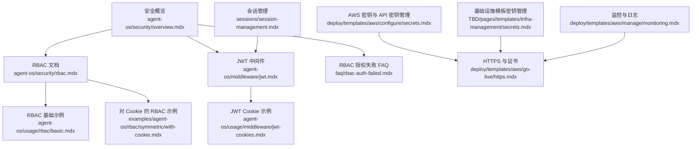
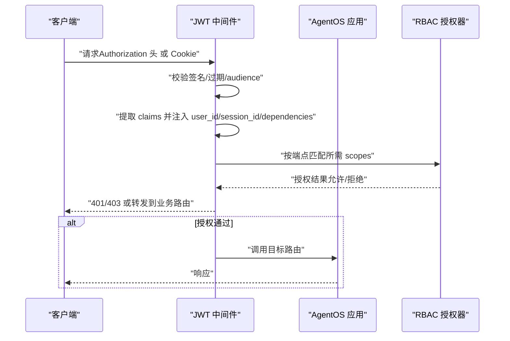
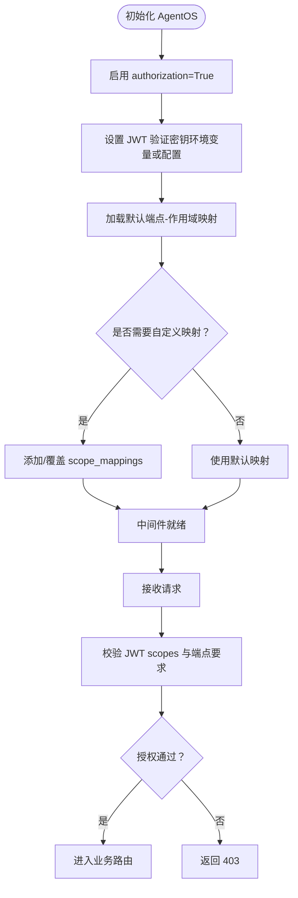
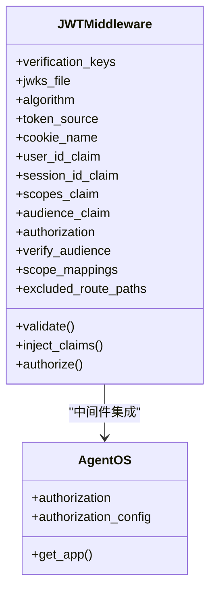
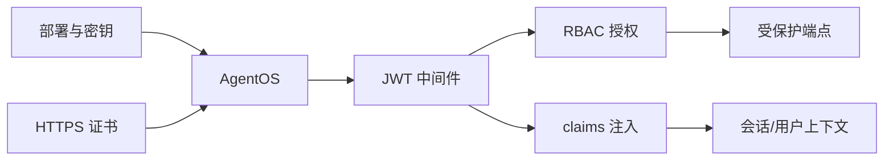

# 安全与权限控制

<cite>
**本文引用的文件**
- [agent-os/security/overview.mdx](file://agent-os/security/overview.mdx)
- [agent-os/security/rbac.mdx](file://agent-os/security/rbac.mdx)
- [agent-os/middleware/jwt.mdx](file://agent-os/middleware/jwt.mdx)
- [agent-os/usage/rbac/basic.mdx](file://agent-os/usage/rbac/basic.mdx)
- [examples/agent-os/rbac/symmetric/with-cookie.mdx](file://examples/agent-os/rbac/symmetric/with-cookie.mdx)
- [agent-os/usage/middleware/jwt-cookies.mdx](file://agent-os/usage/middleware/jwt-cookies.mdx)
- [faq/rbac-auth-failed.mdx](file://faq/rbac-auth-failed.mdx)
- [deploy/templates/aws/configure/secrets.mdx](file://deploy/templates/aws/configure/secrets.mdx)
- [deploy/templates/aws/configure/overview.mdx](file://deploy/templates/aws/configure/overview.mdx)
- [deploy/templates/aws/go-live/https.mdx](file://deploy/templates/aws/go-live/https.mdx)
- [deploy/templates/aws/manage/monitoring.mdx](file://deploy/templates/aws/manage/monitoring.mdx)
- [TBD/pages/templates/infra-management/secrets.mdx](file://TBD/pages/templates/infra-management/secrets.mdx)
- [sessions/session-management.mdx](file://sessions/session-management.mdx)
</cite>

## 目录
1. [简介](#简介)
2. [项目结构](#项目结构)
3. [核心组件](#核心组件)
4. [架构总览](#架构总览)
5. [详细组件分析](#详细组件分析)
6. [依赖关系分析](#依赖关系分析)
7. [性能考量](#性能考量)
8. [故障排查指南](#故障排查指南)
9. [结论](#结论)
10. [附录](#附录)

## 简介
本文件面向 AgentOS 的安全与权限控制，聚焦于基于角色的访问控制（RBAC）体系与 JWT 认证机制。内容覆盖授权配置（权限映射、作用域定义、用户管理）、API 认证（JWT 验证与会话管理）、安全最佳实践（敏感数据保护、访问控制策略、安全审计），并提供可复用的安全配置示例与常见问题的解决方案，帮助在不同部署环境（开发、测试、生产）中正确实施安全措施。

## 项目结构
围绕安全与权限控制的关键文档与示例分布如下：
- 安全概览与 RBAC 参考：agent-os/security
- JWT 中间件与参数注入：agent-os/middleware
- RBAC 基础示例与对 Cookie 的示例：agent-os/usage/rbac 与 examples/agent-os/rbac
- JWT Cookie 示例：agent-os/usage/middleware/jwt-cookies.mdx
- 常见问题（RBAC 授权失败）FAQ：faq/rbac-auth-failed.mdx
- 部署与密钥管理：deploy/templates/aws/configure/secrets.mdx、deploy/templates/aws/configure/overview.mdx、deploy/templates/aws/go-live/https.mdx、deploy/templates/aws/manage/monitoring.mdx
- 基础设施模板中的密钥管理：TBD/pages/templates/infra-management/secrets.mdx
- 会话管理与标识：sessions/session-management.mdx

**图表来源**
- [agent-os/security/overview.mdx:1-70](file://agent-os/security/overview.mdx#L1-L70)
- [agent-os/security/rbac.mdx:1-410](file://agent-os/security/rbac.mdx#L1-L410)
- [agent-os/middleware/jwt.mdx:1-341](file://agent-os/middleware/jwt.mdx#L1-L341)
- [agent-os/usage/rbac/basic.mdx:1-146](file://agent-os/usage/rbac/basic.mdx#L1-L146)
- [examples/agent-os/rbac/symmetric/with-cookie.mdx:1-217](file://examples/agent-os/rbac/symmetric/with-cookie.mdx#L1-L217)
- [agent-os/usage/middleware/jwt-cookies.mdx:1-234](file://agent-os/usage/middleware/jwt-cookies.mdx#L1-L234)
- [faq/rbac-auth-failed.mdx:1-69](file://faq/rbac-auth-failed.mdx#L1-L69)
- [deploy/templates/aws/configure/secrets.mdx:1-180](file://deploy/templates/aws/configure/secrets.mdx#L1-L180)
- [deploy/templates/aws/go-live/https.mdx:1-120](file://deploy/templates/aws/go-live/https.mdx#L1-L120)
- [deploy/templates/aws/manage/monitoring.mdx:1-67](file://deploy/templates/aws/manage/monitoring.mdx#L1-L67)
- [TBD/pages/templates/infra-management/secrets.mdx:1-73](file://TBD/pages/templates/infra-management/secrets.mdx#L1-L73)
- [sessions/session-management.mdx:1-189](file://sessions/session-management.mdx#L1-L189)

**章节来源**
- [agent-os/security/overview.mdx:1-70](file://agent-os/security/overview.mdx#L1-L70)
- [agent-os/security/rbac.mdx:1-410](file://agent-os/security/rbac.mdx#L1-L410)
- [agent-os/middleware/jwt.mdx:1-341](file://agent-os/middleware/jwt.mdx#L1-L341)

## 核心组件
- RBAC 授权引擎：基于 JWT 的 scopes 与默认/自定义端点映射进行细粒度授权。
- JWT 中间件：支持从 Authorization 头或 HTTP-only Cookie 提取令牌，执行签名验证、audience 校验、参数注入（user_id、session_id、dependencies 等）与 RBAC 检查。
- 会话管理：通过 session_id 与 user_id 关联用户会话，结合 RBAC 控制访问范围。
- 部署与密钥管理：本地与生产（AWS Secrets Manager）密钥存储与注入，HTTPS 证书与负载均衡配置，日志与监控。

**章节来源**
- [agent-os/security/rbac.mdx:149-255](file://agent-os/security/rbac.mdx#L149-L255)
- [agent-os/middleware/jwt.mdx:134-176](file://agent-os/middleware/jwt.mdx#L134-L176)
- [sessions/session-management.mdx:10-47](file://sessions/session-management.mdx#L10-L47)
- [deploy/templates/aws/configure/secrets.mdx:84-128](file://deploy/templates/aws/configure/secrets.mdx#L84-L128)

## 架构总览
下图展示了 AgentOS 在启用 RBAC 时的请求处理流程：客户端携带 JWT（头或 Cookie），中间件验证签名与 audience，并从 claims 注入用户与会话信息；随后根据端点与 scopes 进行授权判定，最终进入业务路由。

**图表来源**
- [agent-os/middleware/jwt.mdx:158-194](file://agent-os/middleware/jwt.mdx#L158-L194)
- [agent-os/security/rbac.mdx:367-373](file://agent-os/security/rbac.mdx#L367-L373)

## 详细组件分析

### RBAC 授权配置与作用域映射
- 作用域格式与层级：支持 resource:action、resource:<id>:action、resource:*:action、agent_os:admin 等。
- 默认端点映射：系统、Agent、Team、Workflow、Session、Memory、Knowledge、Metrics、Evals 等均对应明确的 scopes。
- 自定义映射：可通过 JWT 中间件的 scope_mappings 覆盖或扩展默认映射。
- 排除路由：如健康检查、文档等默认不参与 RBAC 检查。

**图表来源**
- [agent-os/security/rbac.mdx:257-284](file://agent-os/security/rbac.mdx#L257-L284)
- [agent-os/security/rbac.mdx:361-366](file://agent-os/security/rbac.mdx#L361-L366)

**章节来源**
- [agent-os/security/rbac.mdx:52-148](file://agent-os/security/rbac.mdx#L52-L148)
- [agent-os/security/rbac.mdx:149-255](file://agent-os/security/rbac.mdx#L149-L255)
- [agent-os/security/rbac.mdx:257-284](file://agent-os/security/rbac.mdx#L257-L284)
- [agent-os/security/rbac.mdx:361-366](file://agent-os/security/rbac.mdx#L361-L366)

### JWT 认证与会话管理
- 令牌来源：Authorization 头（Bearer）或 HTTP-only Cookie；支持同时使用（头优先）。
- 参数注入：自动注入 user_id、session_id、dependencies、session_state 到端点参数。
- 安全特性：签名验证、过期检查、audience 校验；Cookie 建议 httponly、secure、samesite=strict。
- 会话关联：结合 session_id 与 user_id 实现用户维度的资源访问控制与历史检索过滤。

**图表来源**
- [agent-os/middleware/jwt.mdx:24-35](file://agent-os/middleware/jwt.mdx#L24-L35)
- [agent-os/middleware/jwt.mdx:249-288](file://agent-os/middleware/jwt.mdx#L249-L288)

**章节来源**
- [agent-os/middleware/jwt.mdx:38-83](file://agent-os/middleware/jwt.mdx#L38-L83)
- [agent-os/middleware/jwt.mdx:134-176](file://agent-os/middleware/jwt.mdx#L134-L176)
- [agent-os/middleware/jwt.mdx:249-288](file://agent-os/middleware/jwt.mdx#L249-L288)
- [sessions/session-management.mdx:10-47](file://sessions/session-management.mdx#L10-L47)

### API 认证机制（JWT 验证与会话）
- 对称密钥（HS256）与非对称密钥（RS256/JWKS）两种模式，建议生产使用 RS256 + JWKS。
- 支持从环境变量或配置对象设置验证密钥；可指定 audience 校验。
- Cookie 模式：设置 httponly、secure、samesite 属性，配合排除路径（登录/登出）。

**章节来源**
- [agent-os/middleware/jwt.mdx:85-133](file://agent-os/middleware/jwt.mdx#L85-L133)
- [agent-os/usage/middleware/jwt-cookies.mdx:89-104](file://agent-os/usage/middleware/jwt-cookies.mdx#L89-L104)
- [examples/agent-os/rbac/symmetric/with-cookie.mdx:56-90](file://examples/agent-os/rbac/symmetric/with-cookie.mdx#L56-L90)

### 用户与会话管理
- 会话标识：session_id 自动生成或手动指定；可与 user_id 组合实现多用户会话隔离。
- 会话命名：支持手动命名与 AI 自动生成，便于 UI 展示与外部工单关联。
- 缓存策略：开发/测试可用内存缓存提升性能，但不建议用于生产。

**章节来源**
- [sessions/session-management.mdx:10-47](file://sessions/session-management.mdx#L10-L47)
- [sessions/session-management.mdx:81-139](file://sessions/session-management.mdx#L81-L139)
- [sessions/session-management.mdx:140-189](file://sessions/session-management.mdx#L140-L189)

### 安全最佳实践
- 敏感数据保护
  - 使用 HTTPS（ACM 证书 + 负载均衡重定向）。
  - 将密钥与凭据存储于 AWS Secrets Manager，避免硬编码。
  - Cookie 使用 httponly、secure、samesite=strict。
- 访问控制策略
  - 启用 authorization=True 并配置 JWKS/公钥。
  - 使用最小权限原则分配 scopes，避免授予 agent_os:admin。
  - 明确排除路由列表，仅对必要端点放行。
- 安全审计
  - 结合日志与监控（CloudWatch）观察异常请求与错误码。
  - 定期轮换密钥与凭据，分离 API 密钥与数据库凭据。

**章节来源**
- [deploy/templates/aws/go-live/https.mdx:1-120](file://deploy/templates/aws/go-live/https.mdx#L1-L120)
- [deploy/templates/aws/configure/secrets.mdx:84-128](file://deploy/templates/aws/configure/secrets.mdx#L84-L128)
- [agent-os/middleware/jwt.mdx:169-174](file://agent-os/middleware/jwt.mdx#L169-L174)
- [agent-os/security/rbac.mdx:361-366](file://agent-os/security/rbac.mdx#L361-L366)
- [deploy/templates/aws/manage/monitoring.mdx:1-67](file://deploy/templates/aws/manage/monitoring.mdx#L1-L67)

### 实际安全配置示例
- 基础 RBAC 示例（对称密钥 + 头部认证）
  - 初始化 AgentOS 时开启 authorization，并通过 AuthorizationConfig 设置 verification_keys 与算法。
  - 生成含 scopes 的 JWT 并通过 Authorization 头发送。
  - 参考：[agent-os/usage/rbac/basic.mdx:39-87](file://agent-os/usage/rbac/basic.mdx#L39-L87)
- Cookie 模式的 RBAC 示例
  - 设置登录接口写入 HTTP-only Cookie，中间件从 Cookie 提取令牌并排除登录/登出路径。
  - 参考：[examples/agent-os/rbac/symmetric/with-cookie.mdx:56-116](file://examples/agent-os/rbac/symmetric/with-cookie.mdx#L56-L116)
- JWT Cookie 使用示例
  - 包含设置/清除 Cookie 的端点与中间件配置，展示参数注入与依赖 claims。
  - 参考：[agent-os/usage/middleware/jwt-cookies.mdx:89-125](file://agent-os/usage/middleware/jwt-cookies.mdx#L89-L125)

**章节来源**
- [agent-os/usage/rbac/basic.mdx:39-87](file://agent-os/usage/rbac/basic.mdx#L39-L87)
- [examples/agent-os/rbac/symmetric/with-cookie.mdx:56-116](file://examples/agent-os/rbac/symmetric/with-cookie.mdx#L56-L116)
- [agent-os/usage/middleware/jwt-cookies.mdx:89-125](file://agent-os/usage/middleware/jwt-cookies.mdx#L89-L125)

## 依赖关系分析
- AgentOS 与 JWT 中间件：中间件作为应用级中间件集成，负责认证与授权前置处理。
- RBAC 与端点映射：默认映射由框架提供，可叠加自定义映射；冲突时以自定义为准。
- 会话与用户：claims 中的 user_id 与 session_id 用于过滤与注入，确保访问边界清晰。
- 部署与密钥：AWS Secrets Manager 与环境变量驱动密钥注入，HTTPS 保障传输安全。

**图表来源**
- [agent-os/middleware/jwt.mdx:176-226](file://agent-os/middleware/jwt.mdx#L176-L226)
- [agent-os/security/rbac.mdx:149-255](file://agent-os/security/rbac.mdx#L149-L255)
- [deploy/templates/aws/configure/secrets.mdx:84-128](file://deploy/templates/aws/configure/secrets.mdx#L84-L128)
- [deploy/templates/aws/go-live/https.mdx:57-101](file://deploy/templates/aws/go-live/https.mdx#L57-L101)

**章节来源**
- [agent-os/middleware/jwt.mdx:176-226](file://agent-os/middleware/jwt.mdx#L176-L226)
- [agent-os/security/rbac.mdx:149-255](file://agent-os/security/rbac.mdx#L149-L255)
- [deploy/templates/aws/configure/secrets.mdx:84-128](file://deploy/templates/aws/configure/secrets.mdx#L84-L128)
- [deploy/templates/aws/go-live/https.mdx:57-101](file://deploy/templates/aws/go-live/https.mdx#L57-L101)

## 性能考量
- 会话缓存：开发/测试阶段可启用内存缓存减少数据库往返，但不建议用于生产。
- 中间件开销：JWT 验证与 RBAC 检查为轻量操作，建议在高并发场景下结合连接池与异步路由优化整体吞吐。
- 密钥轮换：采用 JWKS 动态轮换密钥，避免频繁重启服务。

**章节来源**
- [sessions/session-management.mdx:140-189](file://sessions/session-management.mdx#L140-L189)
- [agent-os/middleware/jwt.mdx:85-102](file://agent-os/middleware/jwt.mdx#L85-L102)

## 故障排查指南
- RBAC 授权失败
  - 若同时启用安全密钥与授权，授权优先；根据版本选择关闭授权或切换到 JWT 验证。
  - 清理旧安全密钥环境变量，设置新的 JWT 验证密钥。
  - 参考：[faq/rbac-auth-failed.mdx:16-63](file://faq/rbac-auth-failed.mdx#L16-L63)
- 令牌无效/过期
  - 检查 exp/iat 是否正确，确认算法与密钥匹配。
  - 参考：[agent-os/middleware/jwt.mdx:158-161](file://agent-os/middleware/jwt.mdx#L158-L161)
- Cookie 登录/登出异常
  - 确认 Cookie 名称一致、httponly/secure/samesite 设置正确，排除路径包含登录/登出端点。
  - 参考：[examples/agent-os/rbac/symmetric/with-cookie.mdx:56-116](file://examples/agent-os/rbac/symmetric/with-cookie.mdx#L56-L116)
- 生产密钥未生效
  - 校验 AWS Secrets Manager 中密钥存在且值正确，必要时重新部署任务以刷新环境变量。
  - 参考：[deploy/templates/aws/configure/secrets.mdx:130-161](file://deploy/templates/aws/configure/secrets.mdx#L130-L161)
- HTTPS 不生效
  - 确认证书已签发、负载均衡监听器已创建并重定向 HTTP 至 HTTPS。
  - 参考：[deploy/templates/aws/go-live/https.mdx:57-101](file://deploy/templates/aws/go-live/https.mdx#L57-L101)

**章节来源**
- [faq/rbac-auth-failed.mdx:16-63](file://faq/rbac-auth-failed.mdx#L16-L63)
- [agent-os/middleware/jwt.mdx:158-161](file://agent-os/middleware/jwt.mdx#L158-L161)
- [examples/agent-os/rbac/symmetric/with-cookie.mdx:56-116](file://examples/agent-os/rbac/symmetric/with-cookie.mdx#L56-L116)
- [deploy/templates/aws/configure/secrets.mdx:130-161](file://deploy/templates/aws/configure/secrets.mdx#L130-L161)
- [deploy/templates/aws/go-live/https.mdx:57-101](file://deploy/templates/aws/go-live/https.mdx#L57-L101)

## 结论
AgentOS 的安全与权限控制以 JWT 为基础，通过 RBAC 实现细粒度授权，结合会话管理与部署层密钥治理形成完整闭环。建议在生产中采用 RS256/JWKS、HTTPS、严格的 Cookie 安全属性与最小权限原则，并通过监控与日志持续审计访问行为，确保系统安全稳定运行。

## 附录
- 开发/测试快速上手
  - 创建 AgentOS 并启用 authorization，设置 JWT 验证密钥，生成含 scopes 的 JWT 进行测试。
  - 参考：[agent-os/usage/rbac/basic.mdx:39-87](file://agent-os/usage/rbac/basic.mdx#L39-L87)
- 基础设施模板密钥管理
  - 本地使用 YAML 文件，生产使用 AWS Secrets Manager 注入。
  - 参考：[TBD/pages/templates/infra-management/secrets.mdx:1-73](file://TBD/pages/templates/infra-management/secrets.mdx#L1-L73)