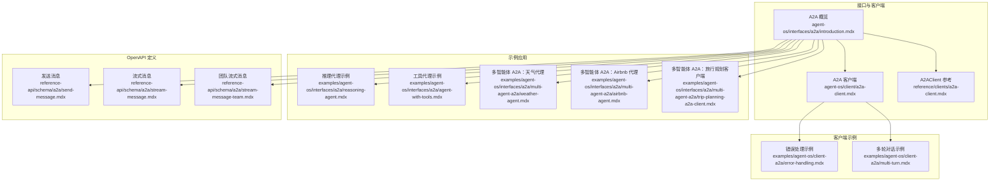
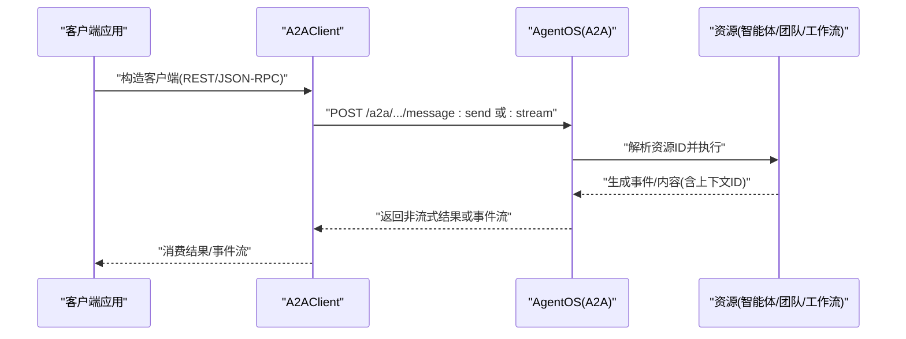
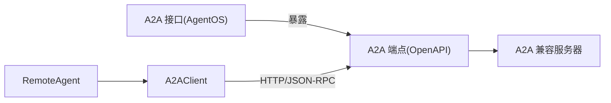

# A2A 接口

<cite>
**本文引用的文件**
- [A2A 概览](file://agent-os/interfaces/a2a/introduction.mdx)
- [A2A 客户端](file://agent-os/client/a2a-client.mdx)
- [A2AClient 参考](file://reference/clients/a2a-client.mdx)
- [多智能体 A2A：天气代理](file://examples/agent-os/interfaces/a2a/multi-agent-a2a/weather-agent.mdx)
- [多智能体 A2A：Airbnb 代理](file://examples/agent-os/interfaces/a2a/multi-agent-a2a/airbnb-agent.mdx)
- [多智能体 A2A：旅行规划客户端](file://examples/agent-os/interfaces/a2a/multi-agent-a2a/trip-planning-a2a-client.mdx)
- [推理代理示例](file://examples/agent-os/interfaces/a2a/reasoning-agent.mdx)
- [工具代理示例](file://examples/agent-os/interfaces/a2a/agent-with-tools.mdx)
- [A2A 错误处理示例](file://examples/agent-os/client-a2a/error-handling.mdx)
- [A2A 多轮对话示例](file://examples/agent-os/client-a2a/multi-turn.mdx)
- [A2A 发送消息（OpenAPI）](file://reference-api/schema/a2a/send-message.mdx)
- [A2A 流式消息（OpenAPI）](file://reference-api/schema/a2a/stream-message.mdx)
- [A2A 团队流式消息（OpenAPI）](file://reference-api/schema/a2a/stream-message-team.mdx)
</cite>

## 目录
1. [简介](#简介)
2. [项目结构](#项目结构)
3. [核心组件](#核心组件)
4. [架构总览](#架构总览)
5. [详细组件分析](#详细组件分析)
6. [依赖关系分析](#依赖关系分析)
7. [性能考虑](#性能考虑)
8. [故障排查指南](#故障排查指南)
9. [结论](#结论)
10. [附录](#附录)

## 简介
本文件面向希望在多智能体系统中集成 Agent-to-Agent（A2A）协议的开发者，系统性阐述 A2A 接口的工作原理、消息格式与传输机制，提供配置示例（认证、连接管理、消息路由）、最佳实践（序列化/反序列化、错误处理），并给出完整集成测试方法与参考路径。

A2A 是由 Google 提出的智能体间通信标准协议，旨在统一不同框架下的智能体发现、调用与协作方式。Agno 通过 AgentOS 的 A2A 接口，将智能体、团队与工作流以 A2A 兼容的方式暴露，既可被 Agno 客户端直连，也可与 Google ADK 等其他 A2A 兼容服务互通。

## 项目结构
围绕 A2A 的文档与示例主要分布在以下位置：
- 接口概览与端点定义：agent-os/interfaces/a2a/introduction.mdx
- 客户端使用与参数说明：agent-os/client/a2a-client.mdx、reference/clients/a2a-client.mdx
- 示例工程（多智能体协作、推理、工具代理等）：examples/agent-os/interfaces/a2a/*
- 客户端侧示例（错误处理、多轮对话）：examples/agent-os/client-a2a/*
- OpenAPI 端点定义：reference-api/schema/a2a/*

**图表来源**
- [A2A 概览:1-149](file://agent-os/interfaces/a2a/introduction.mdx#L1-L149)
- [A2A 客户端:1-62](file://agent-os/client/a2a-client.mdx#L1-L62)
- [A2AClient 参考:1-40](file://reference/clients/a2a-client.mdx#L1-L40)
- [推理代理示例:1-72](file://examples/agent-os/interfaces/a2a/reasoning-agent.mdx#L1-L72)
- [工具代理示例:1-82](file://examples/agent-os/interfaces/a2a/agent-with-tools.mdx#L1-L82)
- [多智能体 A2A：天气代理:1-79](file://examples/agent-os/interfaces/a2a/multi-agent-a2a/weather-agent.mdx#L1-L79)
- [多智能体 A2A：Airbnb 代理:1-78](file://examples/agent-os/interfaces/a2a/multi-agent-a2a/airbnb-agent.mdx#L1-L78)
- [多智能体 A2A：旅行规划客户端:123-146](file://examples/agent-os/interfaces/a2a/multi-agent-a2a/trip-planning-a2a-client.mdx#L123-L146)
- [A2A 错误处理示例:1-152](file://examples/agent-os/client-a2a/error-handling.mdx#L1-L152)
- [A2A 多轮对话示例:1-123](file://examples/agent-os/client-a2a/multi-turn.mdx#L1-L123)
- [A2A 发送消息（OpenAPI）:1-3](file://reference-api/schema/a2a/send-message.mdx#L1-L3)
- [A2A 流式消息（OpenAPI）:1-3](file://reference-api/schema/a2a/stream-message.mdx#L1-L3)
- [A2A 团队流式消息（OpenAPI）:1-3](file://reference-api/schema/a2a/stream-message-team.mdx#L1-L3)

**章节来源**
- [A2A 概览:1-149](file://agent-os/interfaces/a2a/introduction.mdx#L1-L149)
- [A2A 客户端:1-62](file://agent-os/client/a2a-client.mdx#L1-L62)
- [A2AClient 参考:1-40](file://reference/clients/a2a-client.mdx#L1-L40)

## 核心组件
- A2A 接口（AgentOS）
  - 通过在 AgentOS 中启用 A2A 接口，将指定的 Agent/Team/Workflow 以 A2A 兼容方式暴露。
  - 支持两种启用方式：全局开启或显式初始化后注入到 AgentOS。
- A2AClient（Python 客户端）
  - 提供异步访问任意 A2A 兼容服务器的能力，支持 REST 与 JSON-RPC 两种模式（Google ADK 使用 JSON-RPC）。
  - 支持非流式消息发送与实时流式响应。
- 远程代理（RemoteAgent）
  - 高层封装，便于以“本地代理”的方式调用远端 A2A 服务器上的智能体。
- OpenAPI 端点
  - 提供标准化的发送消息与流式消息端点，覆盖 Agent/Team/Workflow 三类资源。

**章节来源**
- [A2A 概览:17-60](file://agent-os/interfaces/a2a/introduction.mdx#L17-L60)
- [A2A 客户端:7-30](file://agent-os/client/a2a-client.mdx#L7-L30)
- [A2AClient 参考:22-28](file://reference/clients/a2a-client.mdx#L22-L28)
- [A2A 发送消息（OpenAPI）:1-3](file://reference-api/schema/a2a/send-message.mdx#L1-L3)
- [A2A 流式消息（OpenAPI）:1-3](file://reference-api/schema/a2a/stream-message.mdx#L1-L3)
- [A2A 团队流式消息（OpenAPI）:1-3](file://reference-api/schema/a2a/stream-message-team.mdx#L1-L3)

## 架构总览
下图展示了 A2A 在 Agno 中的端到端交互：客户端通过 A2AClient 调用 AgentOS 暴露的 A2A 端点；AgentOS 将请求路由至对应 Agent/Team/Workflow 并返回结果；支持非流式与流式两种响应模式。

**图表来源**
- [A2A 概览:63-107](file://agent-os/interfaces/a2a/introduction.mdx#L63-L107)
- [A2A 客户端:15-55](file://agent-os/client/a2a-client.mdx#L15-L55)
- [A2AClient 参考:30-40](file://reference/clients/a2a-client.mdx#L30-L40)

## 详细组件分析

### 组件一：A2A 接口（AgentOS）
- 启用方式
  - 全局启用：在创建 AgentOS 时传入 a2a_interface=True。
  - 显式初始化：创建 A2A 实例并将其加入 AgentOS 的 interfaces 列表。
- 暴露范围
  - 默认对所有 Agent/Team/Workflow 开放 A2A 端点。
  - 可通过构造函数参数限定仅暴露指定资源。
- 端点清单
  - Agent/Team/Workflow 均提供：
    - “发现卡片”端点：返回 A2A Agent Card。
    - 非流式消息端点：一次性返回结果。
    - 流式消息端点：事件流式返回中间态与最终结果。
- 注意事项
  - A2A 客户端通常期望单智能体服务器，因此推荐使用 /a2a/agents/{id}/ 作为基础 URL。

**章节来源**
- [A2A 概览:17-107](file://agent-os/interfaces/a2a/introduction.mdx#L17-L107)

### 组件二：A2AClient（Python 客户端）
- 功能特性
  - 异步发送消息、接收事件流。
  - 支持 REST 与 JSON-RPC 两种协议模式。
  - 参数化配置：base_url、timeout、protocol。
- 使用场景
  - 直连 Agno AgentOS 的 A2A 端点。
  - 连接 Google ADK（需选择 JSON-RPC 模式）。
- 流式处理
  - 逐事件消费内容片段，适合长输出与进度反馈。

**章节来源**
- [A2A 客户端:13-55](file://agent-os/client/a2a-client.mdx#L13-L55)
- [A2AClient 参考:22-40](file://reference/clients/a2a-client.mdx#L22-L40)

### 组件三：远程代理（RemoteAgent）
- 适用场景
  - 希望以本地代理风格调用远端 A2A 服务器的高级封装。
- 关键参数
  - base_url、agent_id、protocol=a2a。
- 优点
  - 降低客户端复杂度，提升开发体验。

**章节来源**
- [A2A 概览:126-141](file://agent-os/interfaces/a2a/introduction.mdx#L126-L141)

### 组件四：OpenAPI 端点
- 端点类型
  - 发送消息：/a2a/message/send
  - 流式消息：/a2a/message/stream
  - 团队流式消息：/a2a/teams/{id}/v1/message:stream
- 用途
  - 为 A2A 客户端提供标准化的 HTTP 接口，便于跨语言与跨框架互操作。

**章节来源**
- [A2A 发送消息（OpenAPI）:1-3](file://reference-api/schema/a2a/send-message.mdx#L1-L3)
- [A2A 流式消息（OpenAPI）:1-3](file://reference-api/schema/a2a/stream-message.mdx#L1-L3)
- [A2A 团队流式消息（OpenAPI）:1-3](file://reference-api/schema/a2a/stream-message-team.mdx#L1-L3)

### 组件五：示例工程（多智能体协作）
- 天气代理
  - 展示如何在 AgentOS 中启用 A2A，并通过 /a2a/agents/{id}/v1/message:send 与 :stream 访问。
- Airbnb 代理
  - 展示通过 MCP 工具接入外部服务，并以 A2A 形式对外提供能力。
- 旅行规划客户端
  - 展示多智能体协作的典型流程与端点使用方式。

**章节来源**
- [多智能体 A2A：天气代理:41-64](file://examples/agent-os/interfaces/a2a/multi-agent-a2a/weather-agent.mdx#L41-L64)
- [多智能体 A2A：Airbnb 代理:39-63](file://examples/agent-os/interfaces/a2a/multi-agent-a2a/airbnb-agent.mdx#L39-L63)
- [多智能体 A2A：旅行规划客户端:123-146](file://examples/agent-os/interfaces/a2a/multi-agent-a2a/trip-planning-a2a-client.mdx#L123-L146)

### 组件六：示例工程（推理与工具）
- 推理代理
  - 展示高阶模型与工具链结合的 A2A 集成方式。
- 工具代理
  - 展示如何在 AgentOS 中启用 A2A 并运行带工具的智能体。

**章节来源**
- [推理代理示例:37-57](file://examples/agent-os/interfaces/a2a/reasoning-agent.mdx#L37-L57)
- [工具代理示例:46-67](file://examples/agent-os/interfaces/a2a/agent-with-tools.mdx#L46-L67)

### 组件七：客户端侧示例（错误处理与多轮对话）
- 错误处理
  - 展示 HTTP 错误、连接失败、超时等常见异常的捕获与建议。
- 多轮对话
  - 展示如何复用 context_id 维持会话上下文，支持非流式与流式的多轮交互。

**章节来源**
- [A2A 错误处理示例:31-129](file://examples/agent-os/client-a2a/error-handling.mdx#L31-L129)
- [A2A 多轮对话示例:29-96](file://examples/agent-os/client-a2a/multi-turn.mdx#L29-L96)

## 依赖关系分析
- 组件耦合
  - A2A 接口依赖 AgentOS 运行时以暴露端点。
  - A2AClient 依赖 HTTP 客户端库进行请求与事件流消费。
  - RemoteAgent 依赖 A2AClient 以提供更高层的调用体验。
- 外部依赖
  - Google ADK（JSON-RPC 模式）。
  - OpenAPI 规范（端点契约）。

**图表来源**
- [A2A 概览:17-107](file://agent-os/interfaces/a2a/introduction.mdx#L17-L107)
- [A2A 客户端:15-41](file://agent-os/client/a2a-client.mdx#L15-L41)
- [A2AClient 参考:30-40](file://reference/clients/a2a-client.mdx#L30-L40)

**章节来源**
- [A2A 概览:17-107](file://agent-os/interfaces/a2a/introduction.mdx#L17-L107)
- [A2A 客户端:15-41](file://agent-os/client/a2a-client.mdx#L15-L41)
- [A2AClient 参考:30-40](file://reference/clients/a2a-client.mdx#L30-L40)

## 性能考虑
- 请求超时与重试
  - 合理设置 timeout，避免长时间阻塞；对临时性错误采用指数退避重试。
- 流式传输
  - 对长输出优先使用流式端点，减少首字节延迟与内存占用。
- 上下文管理
  - 正确传递 context_id，避免重复计算与状态丢失导致的额外开销。
- 资源隔离
  - 在多智能体协作中，按职责拆分 Agent/Team，避免单点过载。

## 故障排查指南
- 常见问题与定位
  - 404/资源不存在：检查资源 ID 是否正确、是否已通过 A2A 接口暴露。
  - 连接失败：确认服务器地址与端口、网络可达性、防火墙策略。
  - 超时：检查服务器性能、并发负载、网络延迟。
- 建议处理流程
  - 捕获 HTTPStatusError 与 RemoteServerUnavailableError。
  - 对应用级失败（如任务失败标记）进行日志记录与告警。
  - 提供用户提示与重试策略，必要时降级为非流式请求。

**章节来源**
- [A2A 错误处理示例:31-129](file://examples/agent-os/client-a2a/error-handling.mdx#L31-L129)

## 结论
A2A 接口为多智能体系统的直接通信与协作提供了标准化通道。通过 AgentOS 的 A2A 接口与 A2AClient/RemoteAgent 的配套能力，开发者可以快速构建跨框架、跨语言的智能体网络。建议在生产环境中重视错误处理、上下文管理与性能优化，并结合示例工程进行端到端验证。

## 附录

### A2A 端点一览（按资源类型）
- 智能体（Agent）
  - 发现卡片：/a2a/agents/{id}/.well-known/agent-card.json
  - 非流式消息：/a2a/agents/{id}/v1/message:send
  - 流式消息：/a2a/agents/{id}/v1/message:stream
- 团队（Team）
  - 发现卡片：/a2a/teams/{id}/.well-known/agent-card.json
  - 流式消息：/a2a/teams/{id}/v1/message:stream
- 工作流（Workflow）
  - 发现卡片：/a2a/workflows/{id}/.well-known/agent-card.json
  - 流式消息：/a2a/workflows/{id}/v1/message:stream

**章节来源**
- [A2A 概览:63-102](file://agent-os/interfaces/a2a/introduction.mdx#L63-L102)

### 配置与认证要点
- AgentOS 启用 A2A
  - 全局启用：a2a_interface=True
  - 显式初始化：A2A(agents=[...]) 注入 AgentOS
- 客户端参数
  - base_url：Agno 服务器需包含完整 A2A 路径；Google ADK 使用 JSON-RPC 模式
  - timeout：根据业务需求调整
  - protocol：REST 或 json-rpc
- 连接管理
  - 使用连接池与合理的超时策略
  - 对流式场景注意背压与缓冲区大小

**章节来源**
- [A2A 概览:17-60](file://agent-os/interfaces/a2a/introduction.mdx#L17-L60)
- [A2AClient 参考:22-28](file://reference/clients/a2a-client.mdx#L22-L28)

### 消息序列化与反序列化最佳实践
- 使用标准 JSON 结构承载消息与事件
- 事件字段建议包含：类型标识、内容片段、上下文 ID、完成标志
- 对流式事件进行增量拼接，确保最终一致性

### 集成测试方法
- 单元测试
  - 使用 HTTP 客户端模拟 A2A 请求，断言响应结构与状态码
- 端到端测试
  - 启动示例工程中的 AgentOS 服务，使用 A2AClient 发送消息与流式消息
  - 验证多轮对话上下文是否正确延续
- 错误场景测试
  - 404、连接失败、超时等异常分支的覆盖与告警

**章节来源**
- [A2A 错误处理示例:31-129](file://examples/agent-os/client-a2a/error-handling.mdx#L31-L129)
- [A2A 多轮对话示例:29-96](file://examples/agent-os/client-a2a/multi-turn.mdx#L29-L96)