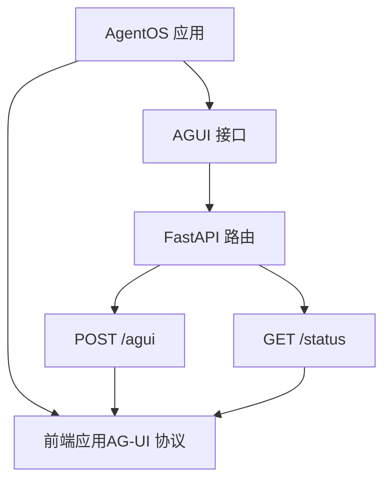
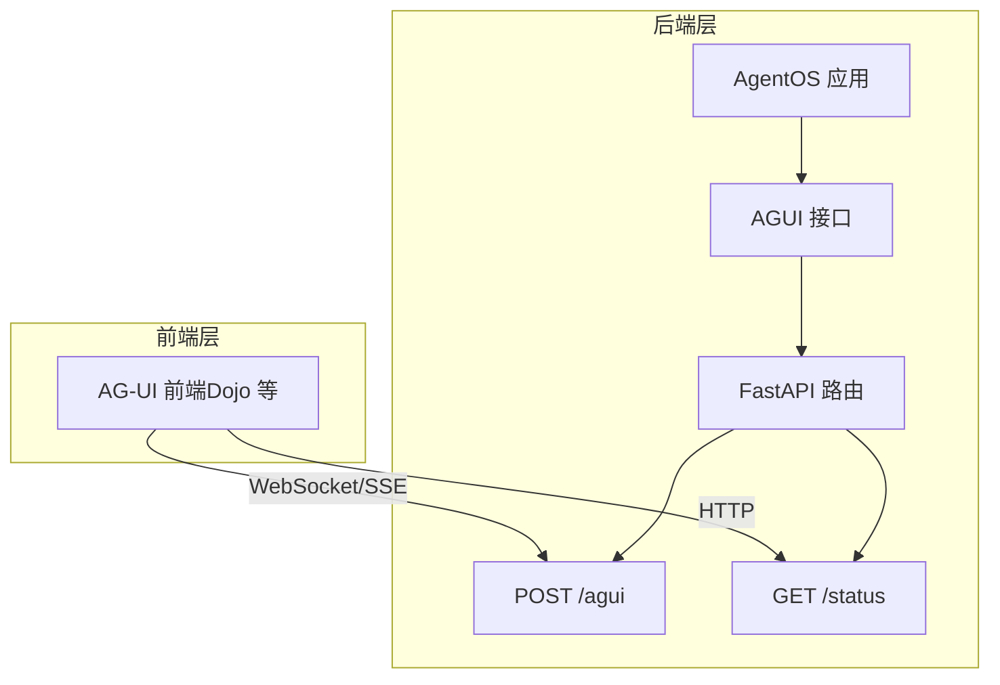
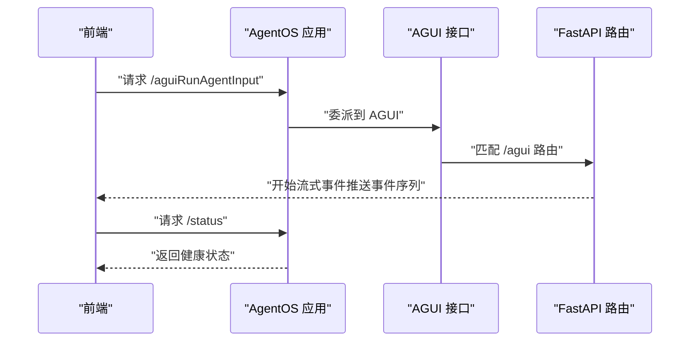
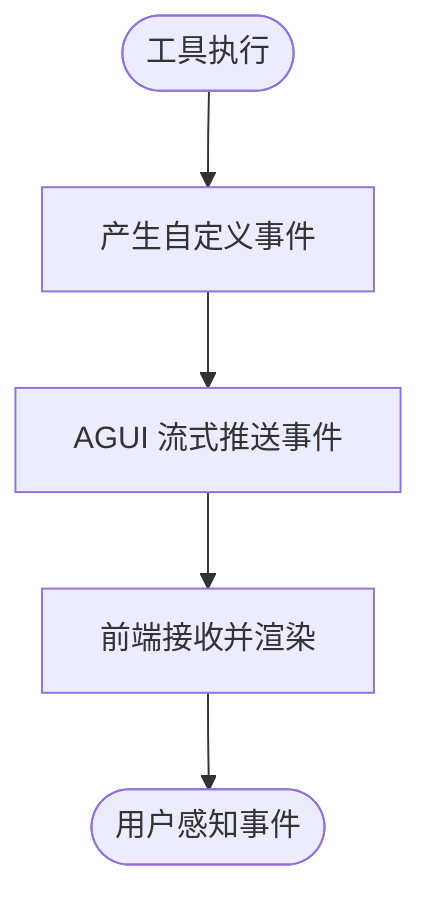
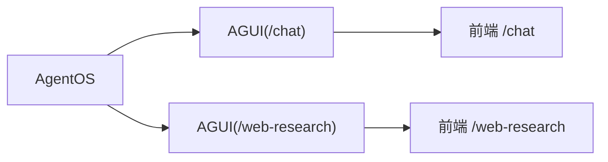
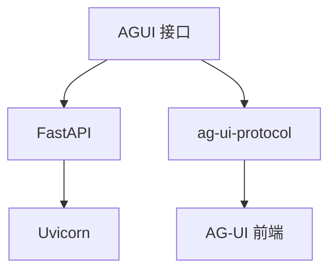

# AG-UI 接口

<cite>
**本文引用的文件**
- [agent-os/interfaces/ag-ui/introduction.mdx](file://agent-os/interfaces/ag-ui/introduction.mdx)
- [agent-os/usage/interfaces/ag-ui/basic.mdx](file://agent-os/usage/interfaces/ag-ui/basic.mdx)
- [examples/agent-os/interfaces/agui/multiple-instances.mdx](file://examples/agent-os/interfaces/agui/multiple-instances.mdx)
- [examples/agent-os/interfaces/agui/structured-output.mdx](file://examples/agent-os/interfaces/agui/structured-output.mdx)
- [reference-api/schema/agui/run-agent.mdx](file://reference-api/schema/agui/run-agent.mdx)
- [reference-api/schema/agui/get-status.mdx](file://reference-api/schema/agui/get-status.mdx)
</cite>

## 目录
1. [简介](#简介)
2. [项目结构](#项目结构)
3. [核心组件](#核心组件)
4. [架构总览](#架构总览)
5. [详细组件分析](#详细组件分析)
6. [依赖关系分析](#依赖关系分析)
7. [性能考量](#性能考量)
8. [故障排查指南](#故障排查指南)
9. [结论](#结论)
10. [附录](#附录)

## 简介
本文件为 AG-UI（Agent-User Interaction Protocol）前端集成接口的详细集成文档。AG-UI 标准化了智能代理与 Web 前端应用之间的交互方式，使前端可以以统一协议与后端代理进行实时消息交换与事件流式传输。通过 AgentOS 的 AGUI 接口，开发者可快速将单个代理或团队暴露为遵循 AG-UI 协议的服务端点，并配合 AG-UI 前端（如 Dojo）构建现代化的聊天界面与交互体验。

- 协议定位：面向前端的标准化交互协议，强调事件驱动与流式输出
- 适用场景：Web 聊天界面、多实例代理管理、结构化输出、自定义事件推送
- 与其他接口的关系：与 A2A、Slack、WhatsApp 等接口并列，但 AG-UI 专注于 Web 前端协议；与 AgentOS 集成，通过接口挂载路由并由 AgentOS 提供服务

## 项目结构
围绕 AG-UI 的文档与示例主要分布在以下位置：
- 接口介绍与使用说明：agent-os/interfaces/ag-ui/introduction.mdx
- 基础示例与运行步骤：agent-os/usage/interfaces/ag-ui/basic.mdx
- 多实例部署示例：examples/agent-os/interfaces/agui/multiple-instances.mdx
- 结构化输出示例：examples/agent-os/interfaces/agui/structured-output.mdx
- API 参考（OpenAPI 片段）：reference-api/schema/agui/*.mdx

图表来源
- [agent-os/interfaces/ag-ui/introduction.mdx:123-130](file://agent-os/interfaces/ag-ui/introduction.mdx#L123-L130)

章节来源
- [agent-os/interfaces/ag-ui/introduction.mdx:1-146](file://agent-os/interfaces/ag-ui/introduction.mdx#L1-L146)
- [agent-os/usage/interfaces/ag-ui/basic.mdx:1-72](file://agent-os/usage/interfaces/ag-ui/basic.mdx#L1-L72)

## 核心组件
- AGUI 接口：将 Agno Agent 或 Team 封装为符合 AG-UI 协议的 FastAPI 路由，提供标准端点与事件流
- AgentOS.serve：基于 Uvicorn 提供服务，自动挂载 AGUI 路由
- 前端集成：使用 AG-UI 前端（如 Dojo）消费后端事件流，实现聊天与交互

关键参数与方法
- 初始化参数
  - agent：可选，Agno Agent 实例
  - team：可选，Agno Team 实例
- 关键方法
  - get_router(use_async: bool = True)：返回 AG-UI 兼容的 FastAPI 路由器并挂载端点

章节来源
- [agent-os/interfaces/ag-ui/introduction.mdx:104-122](file://agent-os/interfaces/ag-ui/introduction.mdx#L104-L122)

## 架构总览
下图展示了 AG-UI 在整体系统中的位置与交互流程：

图表来源
- [agent-os/interfaces/ag-ui/introduction.mdx:123-130](file://agent-os/interfaces/ag-ui/introduction.mdx#L123-L130)

## 详细组件分析

### AGUI 接口与端点
- 端点说明
  - POST /agui：主入口，接收来自 ag-ui-protocol 的 RunAgentInput，流式返回 AG-UI 事件
  - GET /status：健康检查端点
- 路由挂载：AGUI 将上述端点挂载至其路由前缀（默认根路径）
- 服务启动：通过 AgentOS.serve 使用 Uvicorn 启动应用

图表来源
- [agent-os/interfaces/ag-ui/introduction.mdx:123-130](file://agent-os/interfaces/ag-ui/introduction.mdx#L123-L130)

章节来源
- [agent-os/interfaces/ag-ui/introduction.mdx:123-130](file://agent-os/interfaces/ag-ui/introduction.mdx#L123-L130)

### 自定义事件推送
- 工具中可产生自定义事件，AGUI 会将其转换为 AG-UI 自定义事件格式并实时推送到前端
- 示例：工具中抛出自定义事件类，yield 后返回结果，前端即可收到对应事件

图表来源
- [agent-os/interfaces/ag-ui/introduction.mdx:60-96](file://agent-os/interfaces/ag-ui/introduction.mdx#L60-L96)

章节来源
- [agent-os/interfaces/ag-ui/introduction.mdx:60-96](file://agent-os/interfaces/ag-ui/introduction.mdx#L60-L96)

### 多实例与前缀隔离
- 支持在同一 AgentOS 中注册多个 AGUI 实例，并通过不同前缀区分（如 /chat、/web-research）
- 便于在同一后端服务中托管多个代理或团队，满足多租户或多功能场景

图表来源
- [examples/agent-os/interfaces/agui/multiple-instances.mdx:44-51](file://examples/agent-os/interfaces/agui/multiple-instances.mdx#L44-L51)

章节来源
- [examples/agent-os/interfaces/agui/multiple-instances.mdx:1-81](file://examples/agent-os/interfaces/agui/multiple-instances.mdx#L1-L81)

### 结构化输出集成
- 通过为 Agent 指定输出模式（如 Pydantic 模型），AGUI 可将结构化输出以 AG-UI 事件形式推送至前端
- 适合需要规范化数据输出的场景（如抽取 JSON、表格等）

章节来源
- [examples/agent-os/interfaces/agui/structured-output.mdx:1-88](file://examples/agent-os/interfaces/agui/structured-output.mdx#L1-L88)

### 基础示例与运行步骤
- 后端：创建 Agent 与 AgentOS，注册 AGUI 接口，启动服务
- 前端：克隆 AG-UI 仓库，安装依赖，构建集成包，启动 Dojo，访问本地地址
- 环境变量：示例中需设置模型提供商密钥（如 OPENAI_API_KEY）

章节来源
- [agent-os/usage/interfaces/ag-ui/basic.mdx:1-72](file://agent-os/usage/interfaces/ag-ui/basic.mdx#L1-L72)

## 依赖关系分析
- 组件耦合
  - AGUI 依赖 AgentOS 提供的路由与服务能力
  - 前端依赖 AG-UI 协议规范，后端通过 AGUI 实现协议兼容
- 外部依赖
  - ag-ui-protocol：定义 RunAgentInput 与事件格式
  - FastAPI/Uvicorn：提供路由与服务
  - 前端（如 Dojo）：消费事件流并渲染界面

图表来源
- [agent-os/interfaces/ag-ui/introduction.mdx:104-130](file://agent-os/interfaces/ag-ui/introduction.mdx#L104-L130)

章节来源
- [agent-os/interfaces/ag-ui/introduction.mdx:104-130](file://agent-os/interfaces/ag-ui/introduction.mdx#L104-L130)

## 性能考量
- 事件流式传输：采用流式事件推送，降低前端等待时间，提升交互流畅度
- 多实例前缀隔离：通过前缀区分减少路由冲突，便于横向扩展
- 健康检查端点：/status 可用于监控与负载均衡判断
- 建议
  - 对长会话启用连接保活与断线重连策略
  - 控制事件粒度，避免过密事件导致前端渲染压力
  - 在高并发场景下合理配置 Uvicorn worker 数量

## 故障排查指南
- 无法连接后端
  - 确认 AgentOS 已通过 AgentOS.serve 启动，监听端口与主机配置正确
  - 检查 /status 是否返回健康状态
- 前端无法接收事件
  - 确认前端已按协议订阅 /agui 事件流
  - 检查网络与跨域配置
- 自定义事件未显示
  - 确认工具中确实 yield 了自定义事件类
  - 检查事件命名与序列化是否符合 AG-UI 规范
- 多实例冲突
  - 确认各 AGUI 实例使用不同前缀
  - 检查路由前缀与前端访问路径一致

章节来源
- [agent-os/interfaces/ag-ui/introduction.mdx:132-145](file://agent-os/interfaces/ag-ui/introduction.mdx#L132-L145)

## 结论
AG-UI 接口通过标准化的协议与简洁的集成方式，将 AgentOS 与 AG-UI 前端紧密连接，适用于构建现代化的 Web 交互体验。其事件驱动与流式传输特性，结合多实例与结构化输出能力，能够覆盖从基础聊天到复杂业务场景的多种需求。建议在生产环境中结合健康检查、断线重连与性能优化策略，确保稳定与高效。

## 附录

### API 定义（参考）
- POST /agui
  - 描述：主入口，接收 RunAgentInput 并流式返回 AG-UI 事件
  - 参考：[run-agent.mdx:1-3](file://reference-api/schema/agui/run-agent.mdx#L1-L3)
- GET /status
  - 描述：健康检查端点
  - 参考：[get-status.mdx](file://reference-api/schema/agui/get-status.mdx)

章节来源
- [reference-api/schema/agui/run-agent.mdx:1-3](file://reference-api/schema/agui/run-agent.mdx#L1-L3)
- [reference-api/schema/agui/get-status.mdx](file://reference-api/schema/agui/get-status.mdx)