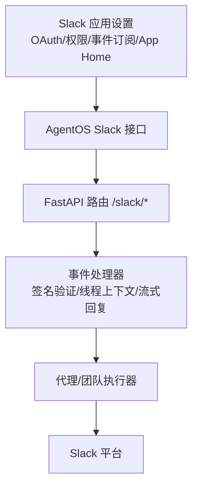
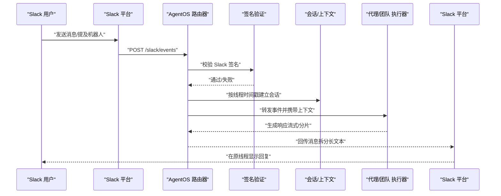
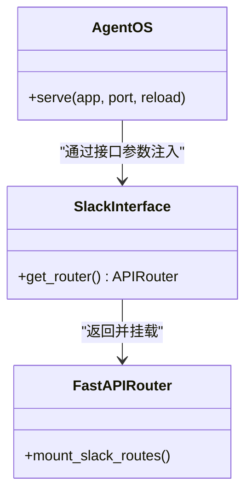
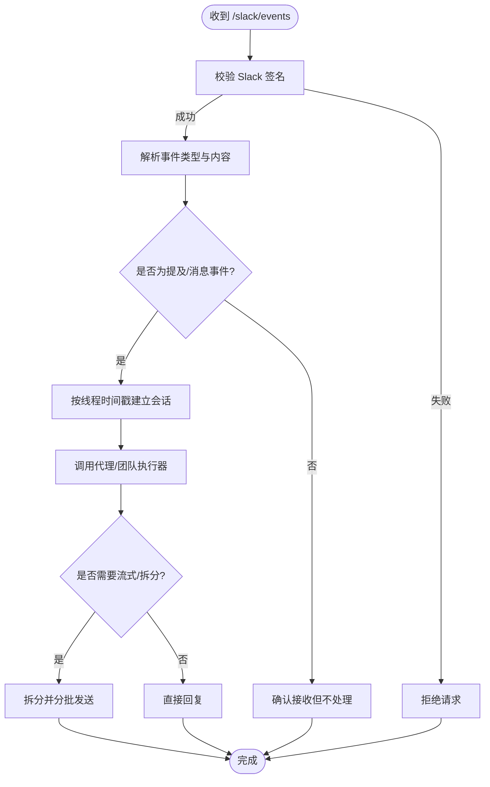
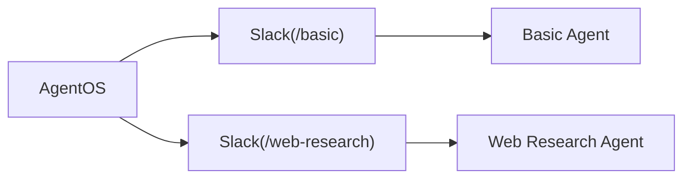
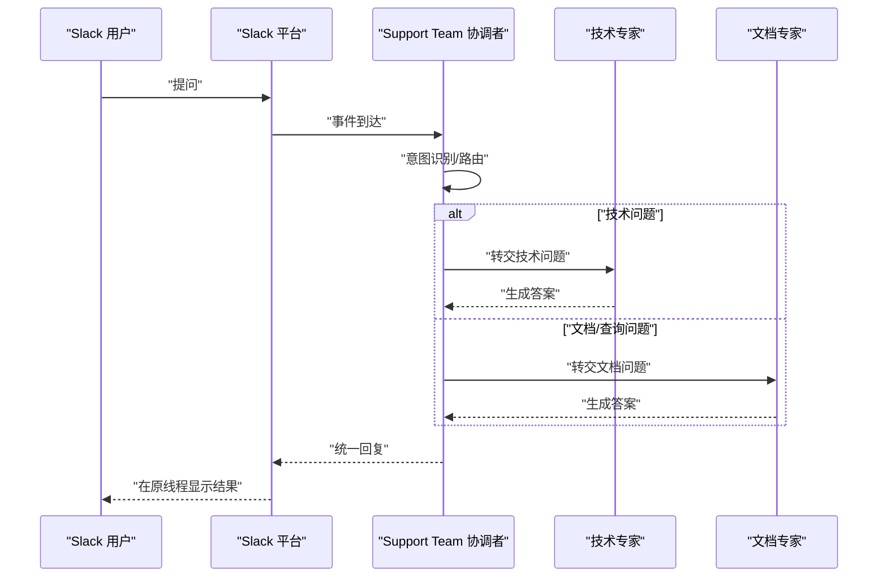
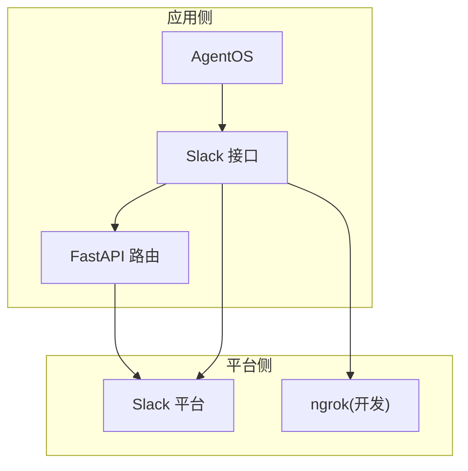

# Slack 接口

<cite>
**本文引用的文件**
- [setup-slack-app.mdx](file://TBD/snippets/setup-slack-app.mdx)
- [slack.mdx](file://production/interfaces/slack.mdx)
- [slack-events.mdx](file://reference-api/schema/slack/slack-events.mdx)
- [interfaces-overview.mdx](file://agent-os/interfaces/overview.mdx)
- [slack-introduction.mdx](file://agent-os/interfaces/slack/introduction.mdx)
- [multiple-instances.mdx](file://examples/agent-os/interfaces/slack/multiple-instances.mdx)
- [support-team.mdx](file://examples/agent-os/interfaces/slack/support-team.mdx)
- [agent-with-user-memory.mdx](file://examples/agent-os/interfaces/slack/agent-with-user-memory.mdx)
- [slack-tools.mdx](file://examples/tools/slack-tools.mdx)
</cite>

## 目录
1. [简介](#简介)
2. [项目结构](#项目结构)
3. [核心组件](#核心组件)
4. [架构总览](#架构总览)
5. [详细组件分析](#详细组件分析)
6. [依赖关系分析](#依赖关系分析)
7. [性能考量](#性能考量)
8. [故障排除指南](#故障排除指南)
9. [结论](#结论)
10. [附录](#附录)

## 简介
本指南面向希望将智能代理部署为 Slack 应用以支持团队协作的工程师与产品人员。文档覆盖从 Slack 应用创建、OAuth 认证配置、Bot 权限与事件订阅设置，到消息处理逻辑、命令解析机制、响应格式与多场景实战示例（个人助理、支持团队、多实例路由、Slack 工具调用）的完整流程。同时提供部署建议与常见问题排查方法，帮助快速落地。

## 项目结构
围绕 Slack 集成的关键文档与示例分布如下：
- 快速开始与配置：Slack 应用创建、OAuth 与权限、事件订阅、App Home、环境变量等步骤化指引
- 接口与服务端点：AgentOS 的 Slack 接口如何挂载 FastAPI 路由、事件验证、线程上下文与流式响应
- 示例与实战：单代理、多实例、支持团队、用户记忆、Slack 工具调用等
- API 规范：Slack 事件接口的 OpenAPI 定义入口

**章节来源**
- [setup-slack-app.mdx:1-92](file://TBD/snippets/setup-slack-app.mdx#L1-L92)
- [slack-introduction.mdx:1-57](file://agent-os/interfaces/slack/introduction.mdx#L1-L57)
- [interfaces-overview.mdx:43-67](file://agent-os/interfaces/overview.mdx#L43-L67)

## 核心组件
- Slack 接口（AgentOS）
  - 将 Agent/Team/Workflow 包装为可被 Slack 事件驱动的服务端点
  - 提供 FastAPI 路由挂载能力，内置签名验证、线程会话管理与流式响应
- AgentOS.serve
  - 基于 Uvicorn 启动 FastAPI 应用，暴露 Slack 事件端点
- 环境变量
  - SLACK_TOKEN（Bot 用户 OAuth Token）、SLACK_SIGNING_SECRET（应用签名密钥）
- 事件订阅
  - POST /slack/events；需在 Slack App 设置中启用并验证
- 会话与上下文
  - 使用线程时间戳作为会话 ID，确保每条线程独立上下文

**章节来源**
- [slack-introduction.mdx:68-99](file://agent-os/interfaces/slack/introduction.mdx#L68-L99)
- [interfaces-overview.mdx:52-67](file://agent-os/interfaces/overview.mdx#L52-L67)
- [slack.mdx:78-88](file://production/interfaces/slack.mdx#L78-L88)

## 架构总览
下图展示从 Slack 事件到代理执行再到响应返回的端到端流程：

**图表来源**
- [slack-introduction.mdx:80-86](file://agent-os/interfaces/slack/introduction.mdx#L80-L86)
- [slack-events.mdx:1-3](file://reference-api/schema/slack/slack-events.mdx#L1-L3)

**章节来源**
- [slack-introduction.mdx:80-86](file://agent-os/interfaces/slack/introduction.mdx#L80-L86)
- [slack-events.mdx:1-3](file://reference-api/schema/slack/slack-events.mdx#L1-L3)

## 详细组件分析

### 组件一：Slack 接口初始化与端点
- 初始化参数
  - 支持传入 agent/team/workflow 三类目标对象
  - 可选前缀（prefix）用于多实例部署时区分路由
- 关键方法
  - get_router：挂载 /slack 事件路由，返回 FastAPI 路由器
- 端点定义
  - POST /slack/events：统一处理 URL 验证、消息与提及事件；对长回复进行拆分并回流至原线程

**图表来源**
- [slack-introduction.mdx:68-75](file://agent-os/interfaces/slack/introduction.mdx#L68-L75)
- [interfaces-overview.mdx:52-67](file://agent-os/interfaces/overview.mdx#L52-L67)

**章节来源**
- [slack-introduction.mdx:68-75](file://agent-os/interfaces/slack/introduction.mdx#L68-L75)
- [interfaces-overview.mdx:52-67](file://agent-os/interfaces/overview.mdx#L52-L67)

### 组件二：消息处理与命令解析
- 事件类型
  - URL 验证（初次验证回调）
  - app_mention（被提及）
  - message.im（私信历史）
  - message.channels/message.groups（频道/群组消息）
- 解析与路由
  - 基于事件类型与内容进行解析
  - 对提及类事件可选择仅响应被提及的消息
- 上下文与会话
  - 使用线程时间戳作为会话 ID，保持每条线程独立上下文
- 响应策略
  - 流式输出，必要时拆分长文本，保证在原线程内回复

**图表来源**
- [slack-introduction.mdx:80-86](file://agent-os/interfaces/slack/introduction.mdx#L80-L86)

**章节来源**
- [slack-introduction.mdx:80-86](file://agent-os/interfaces/slack/introduction.mdx#L80-L86)

### 组件三：多实例与路由前缀
- 多实例场景
  - 通过为不同 Slack 实例设置不同的前缀（如 /basic、/web-research），在同一 AgentOS 中托管多个代理
- 配置要点
  - 每个实例绑定一个独立的 Agent/Team
  - 通过前缀隔离路由，便于分别授权与监控

**图表来源**
- [multiple-instances.mdx:46-52](file://examples/agent-os/interfaces/slack/multiple-instances.mdx#L46-L52)

**章节来源**
- [multiple-instances.mdx:46-52](file://examples/agent-os/interfaces/slack/multiple-instances.mdx#L46-L52)

### 组件四：支持团队与工作流
- 场景描述
  - 将多个专业代理组成团队，通过协调者路由不同类型的提问到对应专家
- 关键点
  - reply_to_mentions_only：仅响应被提及的消息，避免干扰频道日常讨论
  - 团队成员工具组合（如 Slack 工具、网络检索工具）

**图表来源**
- [support-team.mdx:81-89](file://examples/agent-os/interfaces/slack/support-team.mdx#L81-L89)

**章节来源**
- [support-team.mdx:81-89](file://examples/agent-os/interfaces/slack/support-team.mdx#L81-L89)

### 组件五：用户记忆与个性化交互
- 场景描述
  - 在 Slack 中扮演“个人 AI 朋友”，通过记忆管理收集用户偏好，提供更贴合的对话体验
- 关键点
  - 使用 MemoryManager 捕获用户信息
  - 结合 WebSearch 工具增强对话内容时效性
  - 通过指令引导个性化表达

**章节来源**
- [agent-with-user-memory.mdx:27-66](file://examples/agent-os/interfaces/slack/agent-with-user-memory.mdx#L27-L66)

### 组件六：Slack 工具调用
- 能力范围
  - 发送消息、列出频道、获取频道历史、上传/下载文件、搜索消息、获取线程详情、列出用户等
- 使用方式
  - 通过 SlackTools 工具集启用所需能力，或全量启用
  - 可与代理结合，实现“读取—决策—执行”的闭环

**章节来源**
- [slack-tools.mdx:19-56](file://examples/tools/slack-tools.mdx#L19-L56)

## 依赖关系分析
- 组件耦合
  - Slack 接口与 AgentOS 强耦合，通过接口参数注入实现解耦
  - 事件处理依赖 Slack SDK 的签名验证与消息解析
- 外部依赖
  - Slack 平台（OAuth、事件订阅、App Home）
  - ngrok（本地开发时的外网穿透）
  - 环境变量（SLACK_TOKEN、SLACK_SIGNING_SECRET）

**图表来源**
- [interfaces-overview.mdx:52-67](file://agent-os/interfaces/overview.mdx#L52-L67)
- [slack.mdx:90-103](file://production/interfaces/slack.mdx#L90-L103)

**章节来源**
- [interfaces-overview.mdx:52-67](file://agent-os/interfaces/overview.mdx#L52-L67)
- [slack.mdx:90-103](file://production/interfaces/slack.mdx#L90-L103)

## 性能考量
- 流式响应与长文本拆分
  - 对超长回复进行分片发送，降低单次响应延迟并提升用户体验
- 会话与上下文
  - 基于线程时间戳的会话模型减少跨线程干扰，提高并发下的稳定性
- 多实例部署
  - 通过前缀隔离路由，便于资源分配与独立扩展
- 事件订阅与验证
  - 严格签名验证与 URL 验证可避免无效流量进入后端，降低系统负载

[本节为通用指导，无需具体文件分析]

## 故障排除指南
- 环境变量未设置或值错误
  - 确认 SLACK_TOKEN 与 SLACK_SIGNING_SECRET 已正确导出
- 事件订阅未通过验证
  - 检查 ngrok 是否运行且路径指向 /slack/events；等待 Slack 平台验证
- 机器人未加入频道或无权限
  - 在频道中邀请机器人，并确保已安装应用且具备相应权限
- 响应异常或无回复
  - 查看应用日志中的签名失败或权限错误提示
- 多实例冲突
  - 确认各实例前缀唯一，避免路由冲突

**章节来源**
- [slack.mdx:90-103](file://production/interfaces/slack.mdx#L90-L103)
- [slack-introduction.mdx:94-99](file://agent-os/interfaces/slack/introduction.mdx#L94-L99)

## 结论
通过 AgentOS 的 Slack 接口，可以将智能代理无缝接入 Slack 生态，实现团队协作、知识检索、任务编排与个性化交互。结合多实例部署、团队编排与 Slack 工具集，可在不同业务场景下灵活扩展。建议在开发阶段使用 ngrok 进行验证，在生产阶段采用稳定域名与安全的事件订阅配置，并持续关注签名验证与权限变更。

[本节为总结性内容，无需具体文件分析]

## 附录

### A. Slack 应用创建与配置步骤
- 创建应用、配置 OAuth 作用域（app_mention、chat:write、im:* 等）、安装到工作区
- 设置环境变量（SLACK_TOKEN、SLACK_SIGNING_SECRET）
- 使用 ngrok 暴露本地服务，配置事件订阅路径 /slack/events
- 订阅 bot 事件（app_mention、message.im、message.channels、message.groups）
- 启用 App Home 的 Messages Tab 并允许从消息标签页发送命令与消息
- 重新安装应用以应用新权限

**章节来源**
- [setup-slack-app.mdx:11-89](file://TBD/snippets/setup-slack-app.mdx#L11-L89)

### B. API 规范与端点
- POST /slack/events：事件入口，负责签名验证、事件解析与响应回流

**章节来源**
- [slack-events.mdx:1-3](file://reference-api/schema/slack/slack-events.mdx#L1-L3)

### C. 示例与最佳实践
- 单代理基础示例：快速启动一个问答型代理
- 多实例示例：在同一 AgentOS 中托管多个代理，通过前缀区分
- 支持团队示例：将多个专业代理编排为团队，按意图路由
- 用户记忆示例：结合 MemoryManager 与工具，提供个性化交互
- Slack 工具示例：启用发送消息、列表、历史、搜索、线程、用户等能力

**章节来源**
- [slack.mdx:10-32](file://production/interfaces/slack.mdx#L10-L32)
- [multiple-instances.mdx:46-52](file://examples/agent-os/interfaces/slack/multiple-instances.mdx#L46-L52)
- [support-team.mdx:81-89](file://examples/agent-os/interfaces/slack/support-team.mdx#L81-L89)
- [agent-with-user-memory.mdx:62-66](file://examples/agent-os/interfaces/slack/agent-with-user-memory.mdx#L62-L66)
- [slack-tools.mdx:19-56](file://examples/tools/slack-tools.mdx#L19-L56)