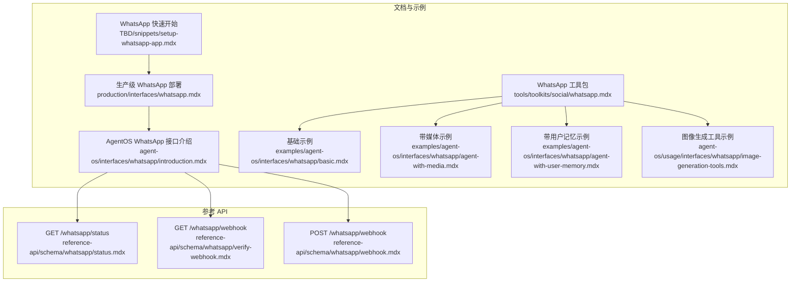
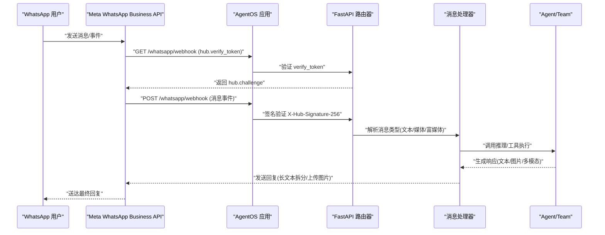
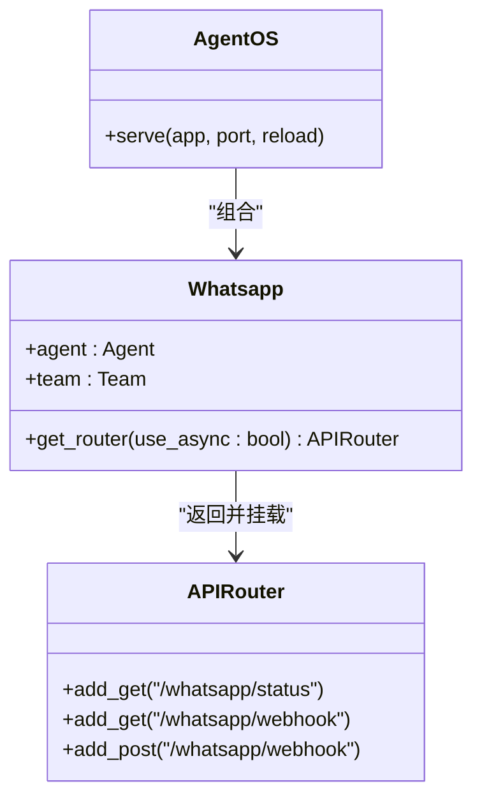
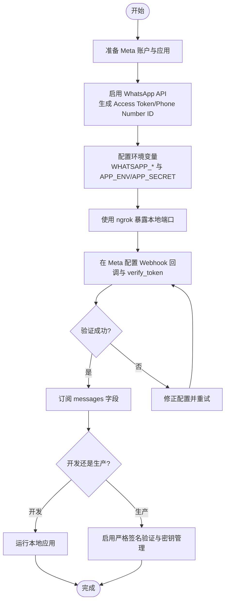
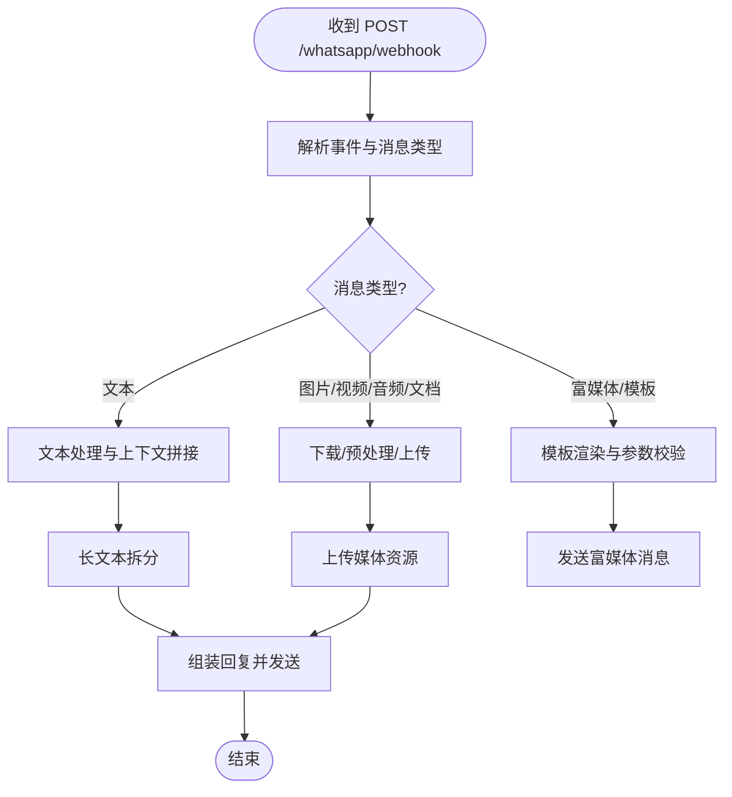
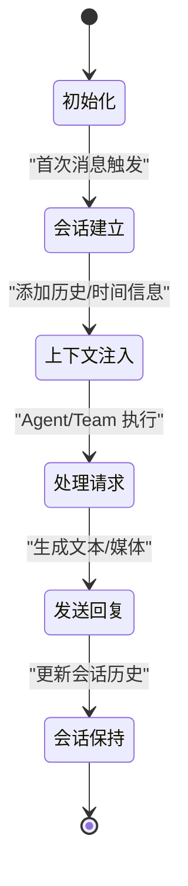
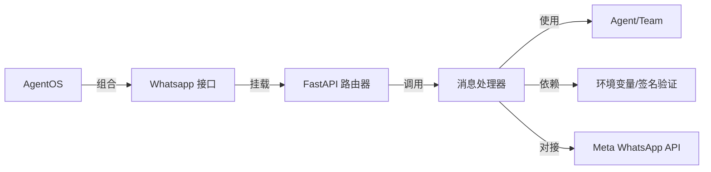

# WhatsApp 接口

<cite>
**本文引用的文件**
- [setup-whatsapp-app.mdx](file://TBD/snippets/setup-whatsapp-app.mdx)
- [whatsapp.mdx](file://production/interfaces/whatsapp.mdx)
- [whatsapp 工具包.mdx](file://tools/toolkits/social/whatsapp.mdx)
- [agent-os WhatsApp 接口介绍.mdx](file://agent-os/interfaces/whatsapp/introduction.mdx)
- [WhatsApp 基础示例.mdx](file://examples/agent-os/interfaces/whatsapp/basic.mdx)
- [带媒体的 WhatsApp 示例.mdx](file://examples/agent-os/interfaces/whatsapp/agent-with-media.mdx)
- [带用户记忆的 WhatsApp 示例.mdx](file://examples/agent-os/interfaces/whatsapp/agent-with-user-memory.mdx)
- [WhatsApp 图像生成工具示例.mdx](file://agent-os/usage/interfaces/whatsapp/image-generation-tools.mdx)
- [WhatsApp Webhook 验证接口定义.mdx](file://reference-api/schema/whatsapp/verify-webhook.mdx)
- [WhatsApp Webhook 接口定义.mdx](file://reference-api/schema/whatsapp/webhook.mdx)
- [WhatsApp 状态接口定义.mdx](file://reference-api/schema/whatsapp/status.mdx)
</cite>

## 目录
1. [简介](#简介)
2. [项目结构](#项目结构)
3. [核心组件](#核心组件)
4. [架构总览](#架构总览)
5. [详细组件分析](#详细组件分析)
6. [依赖关系分析](#依赖关系分析)
7. [性能考量](#性能考量)
8. [故障排查指南](#故障排查指南)
9. [结论](#结论)
10. [附录](#附录)

## 简介
本文件面向希望将智能代理通过 WhatsApp 服务直接暴露为消息交互渠道的开发者与产品团队。文档系统性说明了如何基于 AgentOS 的 WhatsApp 接口，结合 Twilio（Meta）WhatsApp Business API 完成从账户配置、认证与签名验证到 webhook 订阅与消息处理的全链路集成；并覆盖文本、多媒体与富媒体消息的处理逻辑、会话管理与上下文保持机制、部署要求、速率限制与合规性注意事项，以及完整的配置示例与常见问题解决方案。

## 项目结构
围绕 WhatsApp 接口的文档分布在多个模块：
- 快速开始与环境配置：TBD/snippets/setup-whatsapp-app.mdx、production/interfaces/whatsapp.mdx
- AgentOS WhatsApp 接口与端点：agent-os/interfaces/whatsapp/introduction.mdx 及其参考 API 定义
- 工具包与示例：tools/toolkits/social/whatsapp.mdx、examples/agent-os/interfaces/whatsapp/* 与 agent-os/usage/interfaces/whatsapp/*
- 参考 API：reference-api/schema/whatsapp/*

**图表来源**
- [setup-whatsapp-app.mdx:1-88](file://TBD/snippets/setup-whatsapp-app.mdx#L1-L88)
- [whatsapp.mdx:1-137](file://production/interfaces/whatsapp.mdx#L1-L137)
- [whatsapp 工具包.mdx:1-83](file://tools/toolkits/social/whatsapp.mdx#L1-L83)
- [agent-os WhatsApp 接口介绍.mdx:1-98](file://agent-os/interfaces/whatsapp/introduction.mdx#L1-L98)
- [WhatsApp 基础示例.mdx:1-69](file://examples/agent-os/interfaces/whatsapp/basic.mdx#L1-L69)
- [带媒体的 WhatsApp 示例.mdx:1-68](file://examples/agent-os/interfaces/whatsapp/agent-with-media.mdx#L1-L68)
- [带用户记忆的 WhatsApp 示例.mdx:1-93](file://examples/agent-os/interfaces/whatsapp/agent-with-user-memory.mdx#L1-L93)
- [WhatsApp 图像生成工具示例.mdx:1-51](file://agent-os/usage/interfaces/whatsapp/image-generation-tools.mdx#L1-L51)
- [WhatsApp 状态接口定义.mdx:1-3](file://reference-api/schema/whatsapp/status.mdx#L1-L3)
- [WhatsApp Webhook 验证接口定义.mdx:1-3](file://reference-api/schema/whatsapp/verify-webhook.mdx#L1-L3)
- [WhatsApp Webhook 接口定义.mdx:1-3](file://reference-api/schema/whatsapp/webhook.mdx#L1-L3)

**章节来源**
- [setup-whatsapp-app.mdx:1-88](file://TBD/snippets/setup-whatsapp-app.mdx#L1-L88)
- [whatsapp.mdx:1-137](file://production/interfaces/whatsapp.mdx#L1-L137)
- [agent-os WhatsApp 接口介绍.mdx:1-98](file://agent-os/interfaces/whatsapp/introduction.mdx#L1-L98)
- [whatsapp 工具包.mdx:1-83](file://tools/toolkits/social/whatsapp.mdx#L1-L83)

## 核心组件
- WhatsApp 接口（AgentOS）
  - 将 Agent 或 Team 包装为可通过 WhatsApp 访问的服务，挂载 FastAPI 路由，接收并处理消息事件，向用户回复文本、图片等。
  - 关键参数：agent 或 team 二选一；get_router(use_async: bool) 返回路由。
- 环境变量与配置
  - 必需：WHATSAPP_ACCESS_TOKEN、WHATSAPP_PHONE_NUMBER_ID、WHATSAPP_VERIFY_TOKEN
  - 生产可选：WHATSAPP_APP_SECRET、APP_ENV=production
- 参考 API 端点
  - GET /whatsapp/status：健康检查
  - GET /whatsapp/webhook：Webhook 验证（hub.challenge）
  - POST /whatsapp/webhook：接收消息与事件，进行签名验证、消息处理与回复

**章节来源**
- [agent-os WhatsApp 接口介绍.mdx:54-98](file://agent-os/interfaces/whatsapp/introduction.mdx#L54-L98)
- [WhatsApp 状态接口定义.mdx:1-3](file://reference-api/schema/whatsapp/status.mdx#L1-L3)
- [WhatsApp Webhook 验证接口定义.mdx:1-3](file://reference-api/schema/whatsapp/verify-webhook.mdx#L1-L3)
- [WhatsApp Webhook 接口定义.mdx:1-3](file://reference-api/schema/whatsapp/webhook.mdx#L1-L3)

## 架构总览
下图展示了从 WhatsApp 用户到 AgentOS 接口、再到代理执行与回复的整体流程，以及签名验证与消息处理的关键节点。

**图表来源**
- [agent-os WhatsApp 接口介绍.mdx:78-97](file://agent-os/interfaces/whatsapp/introduction.mdx#L78-L97)
- [WhatsApp Webhook 验证接口定义.mdx:1-3](file://reference-api/schema/whatsapp/verify-webhook.mdx#L1-L3)
- [WhatsApp Webhook 接口定义.mdx:1-3](file://reference-api/schema/whatsapp/webhook.mdx#L1-L3)

## 详细组件分析

### 组件一：AgentOS WhatsApp 接口
- 角色与职责
  - 暴露 /whatsapp 前缀下的健康检查、Webhook 验证与消息处理端点
  - 在开发模式下绕过或弱化签名验证，在生产模式下启用严格校验
  - 自动以用户的电话号码作为 user_id 与 session_id，确保会话与记忆按用户隔离
- 初始化与关键方法
  - 参数：agent 或 team（二选一）
  - 方法：get_router(use_async: bool) 返回 FastAPI 路由器并挂载端点
- 端点行为
  - GET /whatsapp/status：返回接口状态
  - GET /whatsapp/webhook：校验 verify_token，成功返回 hub.challenge
  - POST /whatsapp/webhook：校验签名，处理文本/图片/视频/音频/文档，拆分长文本、上传并发送生成图片，返回处理结果

**图表来源**
- [agent-os WhatsApp 接口介绍.mdx:54-98](file://agent-os/interfaces/whatsapp/introduction.mdx#L54-L98)

**章节来源**
- [agent-os WhatsApp 接口介绍.mdx:25-50](file://agent-os/interfaces/whatsapp/introduction.mdx#L25-L50)
- [agent-os WhatsApp 接口介绍.mdx:54-98](file://agent-os/interfaces/whatsapp/introduction.mdx#L54-L98)

### 组件二：Twilio（Meta）WhatsApp Business API 集成
- 账户与应用准备
  - Meta 开发者账号、业务账号、Facebook 账号
  - 创建应用、完成业务验证
- API 设置
  - 启用 WhatsApp API，生成 Access Token、复制 Phone Number ID 与 WhatsApp Business Account ID
  - 添加测试收件人（个人手机号）
- 环境变量
  - WHATSAPP_ACCESS_TOKEN、WHATSAPP_PHONE_NUMBER_ID、WHATSAPP_VERIFY_TOKEN
  - 生产环境：APP_ENV=production、WHATSAPP_APP_SECRET（来自 Meta App Basic 设置）
- Webhook 配置
  - 使用 ngrok 暴露本地端口（开发），构造回调 URL 并在 Meta 控制台配置 verify_token
  - 成功验证后订阅 messages 字段
- 本地开发与生产差异
  - 开发模式下签名验证可能弱化或绕过
  - 生产模式必须启用严格签名验证与密钥管理

**图表来源**
- [setup-whatsapp-app.mdx:1-88](file://TBD/snippets/setup-whatsapp-app.mdx#L1-L88)
- [whatsapp.mdx:38-127](file://production/interfaces/whatsapp.mdx#L38-L127)

**章节来源**
- [setup-whatsapp-app.mdx:1-88](file://TBD/snippets/setup-whatsapp-app.mdx#L1-L88)
- [whatsapp.mdx:38-127](file://production/interfaces/whatsapp.mdx#L38-L127)

### 组件三：消息处理与多模态支持
- 支持的消息类型
  - 文本消息：解析文本内容，交由 Agent/Team 处理
  - 多媒体消息：图片、视频、音频、文档等
  - 富媒体消息：模板消息、按钮、列表等（具体取决于 API 与客户端能力）
- 处理逻辑
  - 解析事件结构，识别消息类型
  - 对长文本进行拆分，避免超限
  - 对生成的图片进行上传与发送
  - 返回统一响应格式（如 processing/ignored），错误时返回 403/500
- 兼容性与合规
  - 首次推广需使用已批准的模板消息
  - 测试消息仅能发送给测试环境中注册的号码

**图表来源**
- [agent-os WhatsApp 接口介绍.mdx:91-97](file://agent-os/interfaces/whatsapp/introduction.mdx#L91-L97)
- [whatsapp 工具包.mdx:29-36](file://tools/toolkits/social/whatsapp.mdx#L29-L36)

**章节来源**
- [agent-os WhatsApp 接口介绍.mdx:91-97](file://agent-os/interfaces/whatsapp/introduction.mdx#L91-L97)
- [whatsapp 工具包.mdx:29-36](file://tools/toolkits/social/whatsapp.mdx#L29-L36)

### 组件四：会话管理与上下文保持
- 用户标识与会话绑定
  - 自动使用用户电话号码作为 user_id 与 session_id，确保单一会话对应一次对话
- 上下文注入
  - 可配置将历史运行与时间信息注入上下文，增强语境理解
- 存储与记忆
  - 可结合数据库与内存管理器持久化会话历史与记忆，支持跨轮次对话的一致性体验

**图表来源**
- [agent-os WhatsApp 接口介绍.mdx:19-23](file://agent-os/interfaces/whatsapp/introduction.mdx#L19-L23)
- [agent-os WhatsApp 接口介绍.mdx:78-97](file://agent-os/interfaces/whatsapp/introduction.mdx#L78-L97)

**章节来源**
- [agent-os WhatsApp 接口介绍.mdx:19-23](file://agent-os/interfaces/whatsapp/introduction.mdx#L19-L23)
- [agent-os WhatsApp 接口介绍.mdx:78-97](file://agent-os/interfaces/whatsapp/introduction.mdx#L78-L97)

### 组件五：示例与最佳实践
- 基础示例
  - 展示如何创建 Agent、接入 Whatsapp 接口并通过 AgentOS 提供服务
- 媒体与记忆示例
  - 结合数据库与内存管理器，演示带媒体与用户记忆的对话体验
- 图像生成工具示例
  - 使用 OpenAI 图像生成工具，展示多模态输出与回复流程

**章节来源**
- [WhatsApp 基础示例.mdx:1-69](file://examples/agent-os/interfaces/whatsapp/basic.mdx#L1-L69)
- [带媒体的 WhatsApp 示例.mdx:1-68](file://examples/agent-os/interfaces/whatsapp/agent-with-media.mdx#L1-L68)
- [带用户记忆的 WhatsApp 示例.mdx:40-93](file://examples/agent-os/interfaces/whatsapp/agent-with-user-memory.mdx#L40-L93)
- [WhatsApp 图像生成工具示例.mdx:1-51](file://agent-os/usage/interfaces/whatsapp/image-generation-tools.mdx#L1-L51)

## 依赖关系分析
- 组件耦合
  - AgentOS 通过 Whatsapp 接口组合 Agent/Team，并返回 FastAPI 路由器
  - 路由器挂载 /whatsapp/* 端点，依赖环境变量与签名验证
- 外部依赖
  - Meta WhatsApp Business API（Twilio/WhatsApp Cloud API）
  - ngrok（本地开发）
  - OpenAI 等模型与工具（用于图像生成等）

**图表来源**
- [agent-os WhatsApp 接口介绍.mdx:54-98](file://agent-os/interfaces/whatsapp/introduction.mdx#L54-L98)
- [whatsapp.mdx:38-127](file://production/interfaces/whatsapp.mdx#L38-L127)

**章节来源**
- [agent-os WhatsApp 接口介绍.mdx:54-98](file://agent-os/interfaces/whatsapp/introduction.mdx#L54-L98)
- [whatsapp.mdx:38-127](file://production/interfaces/whatsapp.mdx#L38-L127)

## 性能考量
- 消息吞吐与并发
  - 使用异步模式（use_async）提升并发处理能力
  - 对长文本进行拆分，减少单次发送失败风险
- 媒体处理
  - 对大体积图片/视频进行压缩与分片上传，降低网络与 API 调用成本
- 缓存与历史
  - 合理设置历史轮次与上下文长度，平衡性能与语境质量
- 部署与扩展
  - 生产环境启用严格签名验证与密钥轮换，配合负载均衡与自动扩缩容策略

## 故障排查指南
- Webhook 验证失败
  - 确认 verify_token 与回调 URL 配置一致
  - 开发模式下验证逻辑可能弱化，生产需设置 WHATSAPP_APP_SECRET
- 签名验证失败（403）
  - 检查 X-Hub-Signature-256 与 APP_ENV=production 的配置
  - 确保 ngrok 地址未变更且 Meta 控制台已同步更新
- 消息未送达或重复
  - 检查会话 ID 与 user_id 是否正确绑定
  - 核对历史注入与上下文长度，避免超限
- 首次推广受限
  - 使用已批准的模板消息，测试消息仅限测试号码
- 环境变量缺失
  - 确认 WHATSAPP_ACCESS_TOKEN、WHATSAPP_PHONE_NUMBER_ID、WHATSAPP_VERIFY_TOKEN 等均已设置

**章节来源**
- [agent-os WhatsApp 接口介绍.mdx:86-97](file://agent-os/interfaces/whatsapp/introduction.mdx#L86-L97)
- [setup-whatsapp-app.mdx:70-88](file://TBD/snippets/setup-whatsapp-app.mdx#L70-L88)
- [whatsapp 工具包.mdx:29-36](file://tools/toolkits/social/whatsapp.mdx#L29-L36)

## 结论
通过 AgentOS 的 WhatsApp 接口，开发者可以快速将智能代理以直接消息交互的方式提供给 WhatsApp 用户。结合 Twilio（Meta）WhatsApp Business API 的账户配置、认证与 webhook 管理，配合严格的签名验证与会话上下文保持机制，可在保证合规与安全的前提下，实现文本、多媒体与富媒体消息的稳定处理与高效回复。生产部署建议遵循速率限制与合规要求，持续优化性能与用户体验。

## 附录
- 快速配置清单
  - 准备 Meta 账户与应用，启用 WhatsApp API，生成 Access Token 与 Phone Number ID
  - 配置环境变量：WHATSAPP_ACCESS_TOKEN、WHATSAPP_PHONE_NUMBER_ID、WHATSAPP_VERIFY_TOKEN
  - 生产环境：APP_ENV=production、WHATSAPP_APP_SECRET
  - 使用 ngrok 暴露本地端口，配置回调 URL 与 verify_token，订阅 messages 字段
- 参考 API 端点
  - GET /whatsapp/status：健康检查
  - GET /whatsapp/webhook：Webhook 验证
  - POST /whatsapp/webhook：消息处理与回复

**章节来源**
- [setup-whatsapp-app.mdx:41-121](file://TBD/snippets/setup-whatsapp-app.mdx#L41-L121)
- [WhatsApp 状态接口定义.mdx:1-3](file://reference-api/schema/whatsapp/status.mdx#L1-L3)
- [WhatsApp Webhook 验证接口定义.mdx:1-3](file://reference-api/schema/whatsapp/verify-webhook.mdx#L1-L3)
- [WhatsApp Webhook 接口定义.mdx:1-3](file://reference-api/schema/whatsapp/webhook.mdx#L1-L3)