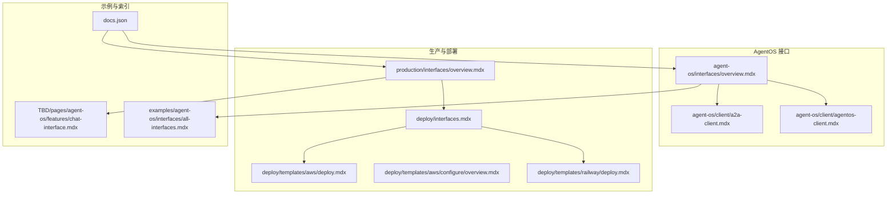
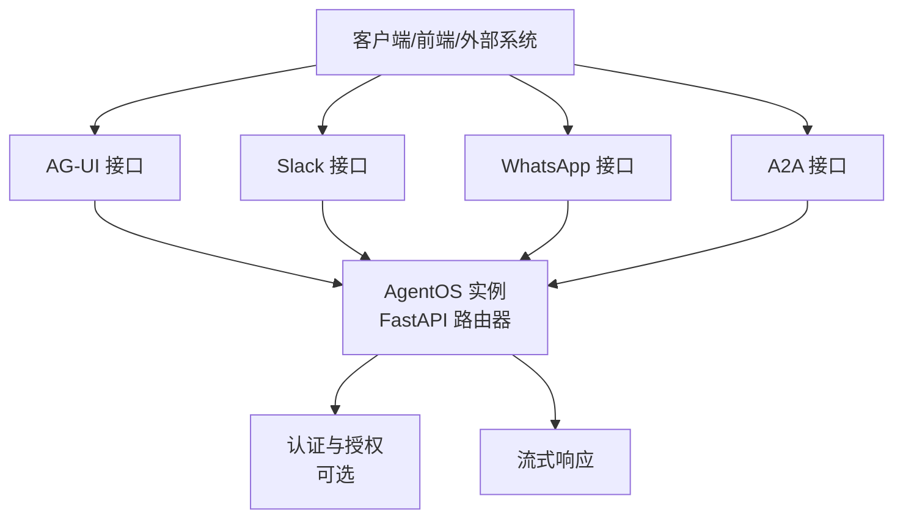
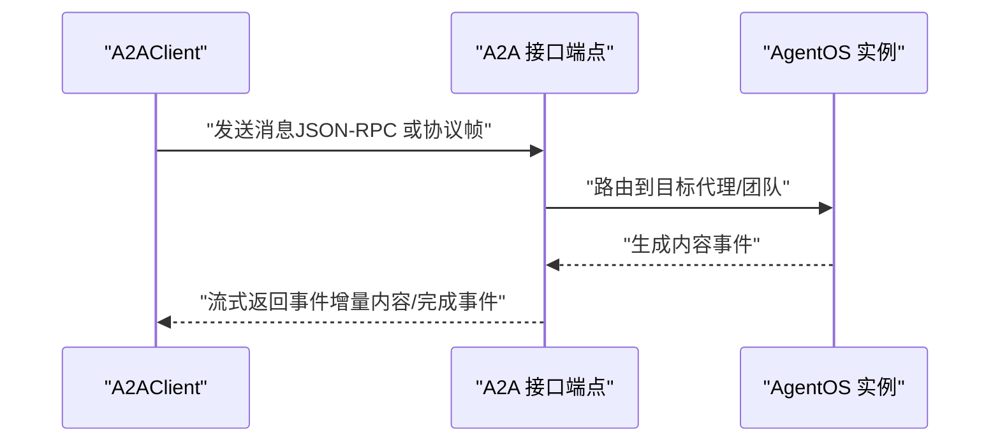
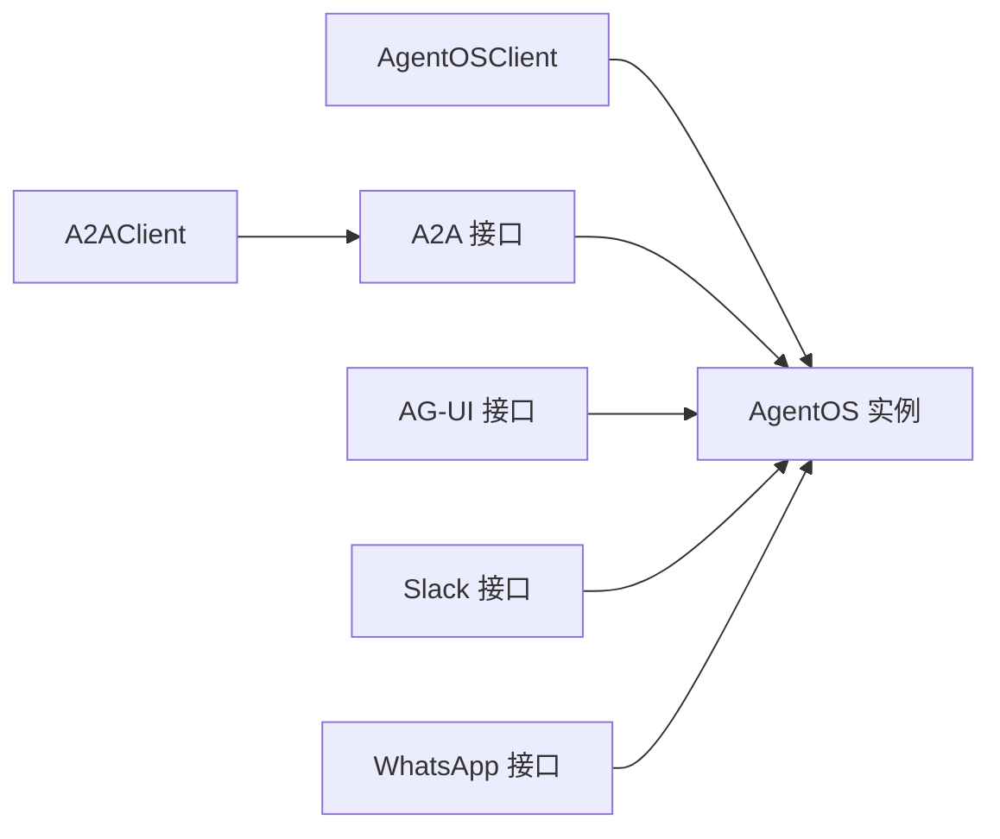

# 接口对比与选择

<cite>
**本文引用的文件**
- [agent-os/interfaces/overview.mdx](file://agent-os/interfaces/overview.mdx)
- [production/interfaces/overview.mdx](file://production/interfaces/overview.mdx)
- [deploy/interfaces.mdx](file://deploy/interfaces.mdx)
- [agent-os/client/a2a-client.mdx](file://agent-os/client/a2a-client.mdx)
- [agent-os/client/agentos-client.mdx](file://agent-os/client/agentos-client.mdx)
- [TBD/pages/agent-os/features/chat-interface.mdx](file://TBD/pages/agent-os/features/chat-interface.mdx)
- [examples/agent-os/interfaces/all-interfaces.mdx](file://examples/agent-os/interfaces/all-interfaces.mdx)
- [docs.json](file://docs.json)
- [FAQ：RBAC 认证失败](file://faq/rbac-auth-failed.mdx)
- [部署模板：AWS](file://deploy/templates/aws/deploy.mdx)
- [部署模板：AWS（配置）](file://deploy/templates/aws/configure/overview.mdx)
- [部署模板：Railway](file://deploy/templates/railway/deploy.mdx)
- [性能评估示例：数据库日志](file://examples/evals/performance/db-logging.mdx)
</cite>

## 目录
1. [引言](#引言)
2. [项目结构](#项目结构)
3. [核心组件](#核心组件)
4. [架构总览](#架构总览)
5. [详细组件分析](#详细组件分析)
6. [依赖关系分析](#依赖关系分析)
7. [性能考量](#性能考量)
8. [故障排查指南](#故障排查指南)
9. [结论](#结论)
10. [附录](#附录)

## 引言
本指南聚焦于 AG-UI、Slack、WhatsApp、A2A 等接口的对比与选择，帮助开发者基于项目需求在性能、安全性、部署复杂度与维护成本之间做出权衡，并提供接口组合使用与混合部署的最佳实践。文档中的技术要点与流程均来自仓库内现有文档与示例，避免臆造信息。

## 项目结构
围绕“接口”主题，相关知识分布在以下路径：
- AgentOS 层面的接口概览与用法说明
- 生产部署层面的接口卡片与入口
- 部署模板与安全配置
- 客户端示例与参考
- 性能评估与排障指引

图表来源
- [agent-os/interfaces/overview.mdx:1-68](file://agent-os/interfaces/overview.mdx#L1-L68)
- [production/interfaces/overview.mdx:1-35](file://production/interfaces/overview.mdx#L1-L35)
- [deploy/interfaces.mdx:1-38](file://deploy/interfaces.mdx#L1-L38)
- [agent-os/client/a2a-client.mdx:1-62](file://agent-os/client/a2a-client.mdx#L1-L62)
- [agent-os/client/agentos-client.mdx:1-120](file://agent-os/client/agentos-client.mdx#L1-L120)
- [deploy/templates/aws/deploy.mdx:1-51](file://deploy/templates/aws/deploy.mdx#L1-L51)
- [deploy/templates/aws/configure/overview.mdx:40-74](file://deploy/templates/aws/configure/overview.mdx#L40-L74)
- [deploy/templates/railway/deploy.mdx:1-51](file://deploy/templates/railway/deploy.mdx#L1-L51)
- [TBD/pages/agent-os/features/chat-interface.mdx:1-200](file://TBD/pages/agent-os/features/chat-interface.mdx#L1-L200)
- [examples/agent-os/interfaces/all-interfaces.mdx:1-200](file://examples/agent-os/interfaces/all-interfaces.mdx#L1-L200)
- [docs.json:4568-4598](file://docs.json#L4568-L4598)

章节来源
- [agent-os/interfaces/overview.mdx:1-68](file://agent-os/interfaces/overview.mdx#L1-L68)
- [production/interfaces/overview.mdx:1-35](file://production/interfaces/overview.mdx#L1-L35)
- [deploy/interfaces.mdx:1-38](file://deploy/interfaces.mdx#L1-L38)

## 核心组件
- AG-UI：面向前端的协议接口，用于连接到前端应用，支持会话与流式响应。
- Slack：作为 Slack 应用部署，支持消息与命令响应。
- WhatsApp：通过 WhatsApp Business 连接，支持直接消息交互。
- A2A：Agent-to-Agent 协议，支持跨系统互操作与流式通信。

这些接口以 FastAPI 路由形式挂载到 AgentOS 实例上，统一处理认证、请求校验、会话跟踪与响应流式输出。

章节来源
- [agent-os/interfaces/overview.mdx:8-68](file://agent-os/interfaces/overview.mdx#L8-L68)
- [production/interfaces/overview.mdx:8-31](file://production/interfaces/overview.mdx#L8-L31)

## 架构总览
下图展示了接口在 AgentOS 中的装配方式与典型调用链：

图表来源
- [agent-os/interfaces/overview.mdx:43-68](file://agent-os/interfaces/overview.mdx#L43-L68)
- [agent-os/client/agentos-client.mdx:61-74](file://agent-os/client/agentos-client.mdx#L61-L74)

## 详细组件分析

### AG-UI 接口
- 特点
  - 通过 AG-UI 协议连接前端应用，适合构建 Web 或桌面前端界面。
  - 支持会话管理与流式响应，便于实时对话体验。
- 适用场景
  - 需要自建或集成现有前端时；对响应实时性要求较高。
- 集成方式
  - 在 AgentOS 实例中添加 AG-UI 接口路由，即可暴露协议端点供前端调用。

章节来源
- [agent-os/interfaces/overview.mdx:12-21](file://agent-os/interfaces/overview.mdx#L12-L21)
- [agent-os/client/agentos-client.mdx:41-59](file://agent-os/client/agentos-client.mdx#L41-L59)

### Slack 接口
- 特点
  - 将代理部署为 Slack 应用，支持消息与命令响应，适合团队协作与自动化。
- 适用场景
  - 团队内部协作、自动化任务执行、Bot 功能集成。
- 集成方式
  - 在 AgentOS 实例中添加 Slack 接口路由，挂载协议端点。

章节来源
- [agent-os/interfaces/overview.mdx:20-26](file://agent-os/interfaces/overview.mdx#L20-L26)
- [production/interfaces/overview.mdx:10-16](file://production/interfaces/overview.mdx#L10-L16)

### WhatsApp 接口
- 特点
  - 通过 WhatsApp Business 连接，支持直接消息交互，适合客户服务与营销。
- 适用场景
  - 客户服务机器人、自动回复、营销活动。
- 集成方式
  - 在 AgentOS 实例中添加 WhatsApp 接口路由，挂载协议端点。

章节来源
- [agent-os/interfaces/overview.mdx:27-33](file://agent-os/interfaces/overview.mdx#L27-L33)
- [production/interfaces/overview.mdx:10-19](file://production/interfaces/overview.mdx#L10-L19)

### A2A 接口
- 特点
  - 基于 Agent-to-Agent 协议，支持跨系统互操作与流式通信，兼容多种 A2A 兼容服务器。
  - 提供客户端封装，支持 JSON-RPC 模式与流式事件。
- 适用场景
  - 多系统间智能体互联、第三方平台集成、跨域协作。
- 集成方式
  - 在 AgentOS 实例中启用 A2A 接口；通过 A2AClient 进行连接与流式通信。

图表来源
- [agent-os/client/a2a-client.mdx:13-62](file://agent-os/client/a2a-client.mdx#L13-L62)
- [agent-os/interfaces/overview.mdx:34-40](file://agent-os/interfaces/overview.mdx#L34-L40)

章节来源
- [agent-os/interfaces/overview.mdx:34-40](file://agent-os/interfaces/overview.mdx#L34-L40)
- [agent-os/client/a2a-client.mdx:1-62](file://agent-os/client/a2a-client.mdx#L1-L62)

## 依赖关系分析
- 组件耦合
  - 各接口均通过 FastAPI 路由挂载到同一 AgentOS 实例，彼此独立但共享认证与会话机制。
  - A2A 客户端与 AgentOS 客户端分别面向外部系统与前端，职责清晰。
- 外部依赖
  - 部署阶段依赖云平台（如 AWS、Railway）与容器编排；安全依赖 JWT 验证与密钥管理。
- 可能的循环依赖
  - 文档未显示接口间存在直接循环导入；接口通过统一路由器接入，避免循环耦合。

图表来源
- [agent-os/client/a2a-client.mdx:1-62](file://agent-os/client/a2a-client.mdx#L1-L62)
- [agent-os/client/agentos-client.mdx:1-120](file://agent-os/client/agentos-client.mdx#L1-L120)
- [agent-os/interfaces/overview.mdx:43-68](file://agent-os/interfaces/overview.mdx#L43-L68)

章节来源
- [agent-os/client/agentos-client.mdx:1-120](file://agent-os/client/agentos-client.mdx#L1-L120)
- [agent-os/interfaces/overview.mdx:43-68](file://agent-os/interfaces/overview.mdx#L43-L68)

## 性能考量
- 流式响应
  - AG-UI 与 A2A 均支持流式输出，有助于降低首字节延迟并提升用户体验。
- 评估方法
  - 可参考性能评估示例，结合数据库日志记录进行迭代优化。
- 成本估算（AWS）
  - 使用 ECS Fargate、RDS PostgreSQL、ALB 等组件，月度成本约在中等规模范围内，适合生产级部署。

章节来源
- [agent-os/client/agentos-client.mdx:41-59](file://agent-os/client/agentos-client.mdx#L41-L59)
- [agent-os/client/a2a-client.mdx:43-55](file://agent-os/client/a2a-client.mdx#L43-L55)
- [examples/evals/performance/db-logging.mdx:38-67](file://examples/evals/performance/db-logging.mdx#L38-L67)
- [deploy/templates/aws/deploy.mdx:33-44](file://deploy/templates/aws/deploy.mdx#L33-L44)

## 故障排查指南
- 认证冲突（RBAC/JWT）
  - 若出现认证冲突，优先采用 JWT 验证并关闭旧的安全密钥认证；确保控制面板开启授权并设置验证密钥。
- 部署问题（AWS）
  - ECR 登录令牌过期需重新认证；RDS 创建时间较长，需等待状态从“创建中”变为“可用”。

章节来源
- [FAQ：RBAC 认证失败:31-68](file://faq/rbac-auth-failed.mdx#L31-L68)
- [部署模板：AWS（配置）:46-74](file://deploy/templates/aws/configure/overview.mdx#L46-L74)
- [部署模板：AWS:326-342](file://deploy/templates/aws/deploy.mdx#L326-L342)

## 结论
- 选择建议
  - 需要前端直连：优先 AG-UI。
  - 团队协作与自动化：优先 Slack。
  - 客户服务与营销：优先 WhatsApp。
  - 跨系统互操作：优先 A2A。
- 组合与混合部署
  - 可在同一 AgentOS 实例上同时启用多个接口，实现多渠道覆盖；通过统一认证与会话管理保障一致性。
- 安全与成本
  - 强烈建议启用 JWT 授权；结合云平台模板与密钥管理工具，平衡安全与运维成本。

## 附录
- 快速参考
  - AG-UI：面向前端协议，支持流式与会话。
  - Slack：团队协作与命令响应。
  - WhatsApp：客户服务与自动回复。
  - A2A：跨系统互操作，支持 JSON-RPC 与流式事件。
- 示例与索引
  - 所有接口示例与导航索引可参考示例页面与文档索引文件。

章节来源
- [TBD/pages/agent-os/features/chat-interface.mdx:1-200](file://TBD/pages/agent-os/features/chat-interface.mdx#L1-L200)
- [examples/agent-os/interfaces/all-interfaces.mdx:1-200](file://examples/agent-os/interfaces/all-interfaces.mdx#L1-L200)
- [docs.json:4568-4598](file://docs.json#L4568-L4598)