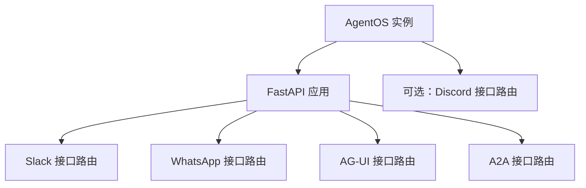
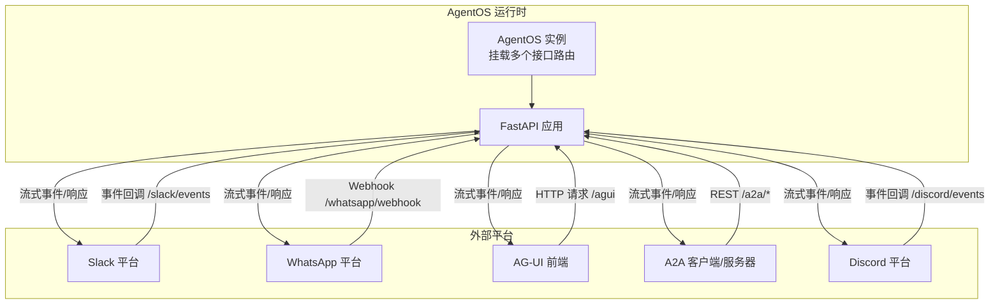
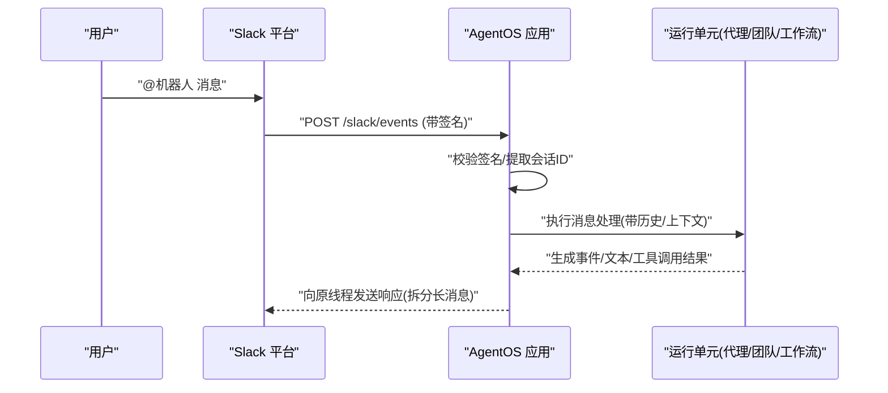
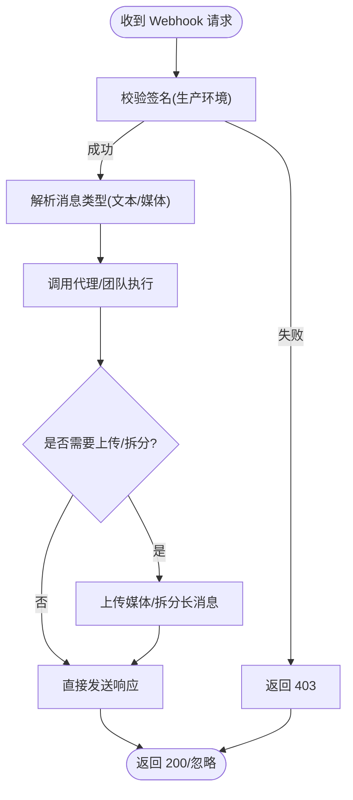
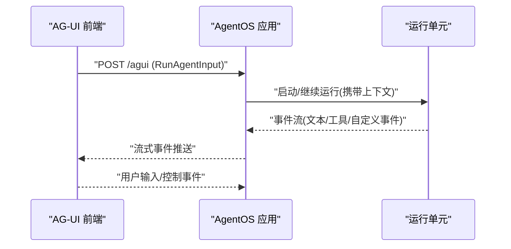
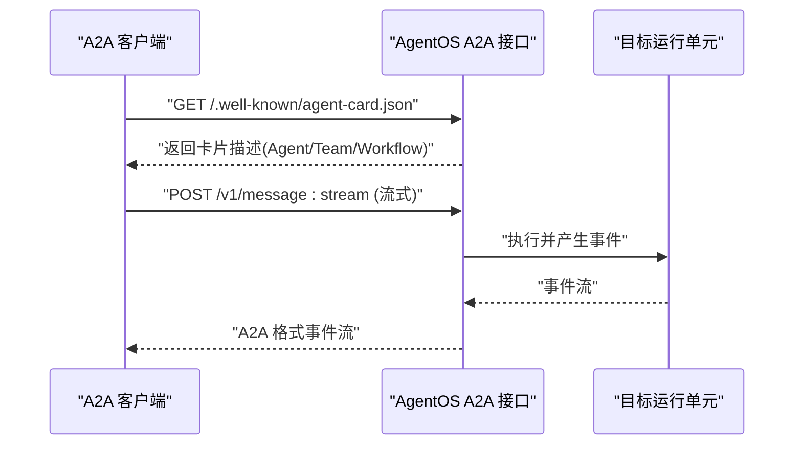
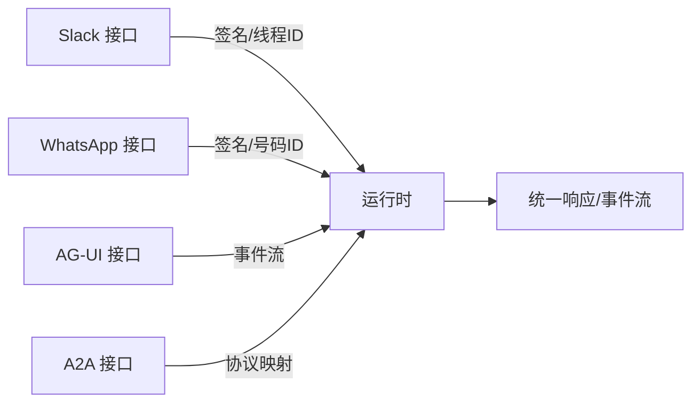

# 接口集成

<cite>
**本文引用的文件**
- [agent-os/interfaces/overview.mdx](file://agent-os/interfaces/overview.mdx)
- [agent-os/interfaces/slack/introduction.mdx](file://agent-os/interfaces/slack/introduction.mdx)
- [agent-os/interfaces/whatsapp/introduction.mdx](file://agent-os/interfaces/whatsapp/introduction.mdx)
- [agent-os/interfaces/ag-ui/introduction.mdx](file://agent-os/interfaces/ag-ui/introduction.mdx)
- [agent-os/interfaces/a2a/introduction.mdx](file://agent-os/interfaces/a2a/introduction.mdx)
</cite>

## 目录
1. [简介](#简介)
2. [项目结构](#项目结构)
3. [核心组件](#核心组件)
4. [架构总览](#架构总览)
5. [详细组件分析](#详细组件分析)
6. [依赖关系分析](#依赖关系分析)
7. [性能考量](#性能考量)
8. [故障排查指南](#故障排查指南)
9. [结论](#结论)
10. [附录](#附录)

## 简介
本文件面向需要在 AgentOS 中集成多种通信接口（Slack、Discord、WhatsApp、AG-UI、A2A）的开发者与架构师，系统性地说明各接口的定位、特点、适用场景、配置要点与实现方式。通过统一的 FastAPI 路由挂载机制，AgentOS 将不同协议封装为标准化的接口层，使同一 Agent/Team/Workflow 可同时暴露到多个平台，便于按需选择与组合。

## 项目结构
AgentOS 的接口能力集中在“agent-os/interfaces”目录下，每个子接口均提供独立的介绍文档，涵盖初始化参数、端点定义、认证与签名校验、会话与上下文管理、消息流式返回等关键主题。整体组织采用“概览 + 各接口独立文档”的分层结构，便于快速定位与查阅。

图表来源
- [agent-os/interfaces/overview.mdx:43-67](file://agent-os/interfaces/overview.mdx#L43-L67)

章节来源
- [agent-os/interfaces/overview.mdx:1-68](file://agent-os/interfaces/overview.mdx#L1-L68)

## 核心组件
- 统一挂载机制：所有接口以 FastAPI 路由形式挂载到 AgentOS 应用上，支持多接口并存。
- 协议适配器：每个接口负责处理目标平台的认证、事件/Webhook 校验、消息解析与回传、会话与上下文维护。
- 运行时服务：通过 AgentOS.serve 提供 Uvicorn 服务化部署，支持本地开发与生产环境。
- 多形态暴露：支持 Agent/Team/Workflow 三种运行单元的统一接入。

章节来源
- [agent-os/interfaces/overview.mdx:43-67](file://agent-os/interfaces/overview.mdx#L43-L67)

## 架构总览
下图展示了 AgentOS 如何通过接口层将内部运行单元暴露到外部平台。每个接口负责特定协议的请求入口、鉴权与签名验证、消息处理与流式响应。

图表来源
- [agent-os/interfaces/slack/introduction.mdx:76-86](file://agent-os/interfaces/slack/introduction.mdx#L76-L86)
- [agent-os/interfaces/whatsapp/introduction.mdx:78-97](file://agent-os/interfaces/whatsapp/introduction.mdx#L78-L97)
- [agent-os/interfaces/ag-ui/introduction.mdx:123-130](file://agent-os/interfaces/ag-ui/introduction.mdx#L123-L130)
- [agent-os/interfaces/a2a/introduction.mdx:63-102](file://agent-os/interfaces/a2a/introduction.mdx#L63-L102)

## 详细组件分析

### Slack 接口
- 定位与适用场景
  - 团队协作与即时沟通，适合需要在频道内进行 @ 提及或私信交互的场景。
- 初始化与配置
  - 必需环境变量：Slack Bot 访问令牌与签名密钥；本地开发建议使用 ngrok 暴露 /slack/events。
  - 关键参数：路由前缀、标签、是否仅回复提及。
- 端点与流程
  - /slack/events：接收 URL 校验、消息与应用提及事件；对每个线程使用 ts 作为会话 ID；长消息拆分发送。
- 测试步骤
  - 本地运行 + ngrok；邀请机器人至频道；@ 机器人或私信测试。

图表来源
- [agent-os/interfaces/slack/introduction.mdx:76-86](file://agent-os/interfaces/slack/introduction.mdx#L76-L86)

章节来源
- [agent-os/interfaces/slack/introduction.mdx:1-100](file://agent-os/interfaces/slack/introduction.mdx#L1-L100)

### WhatsApp 接口
- 定位与适用场景
  - 面向个人用户的直接消息交互，适合图文/音视频/文档等富媒体消息处理。
- 初始化与配置
  - 必需环境变量：访问令牌、号码 ID、校验令牌；生产环境可启用应用密钥与签名校验。
  - 用户手机号自动作为 user_id 与 session_id，确保会话隔离与历史管理。
- 端点与流程
  - GET /whatsapp/status：健康检查。
  - GET /whatsapp/webhook：校验 hub.challenge。
  - POST /whatsapp/webhook：接收消息并进行签名校验；处理文本/图片/视频/音频/文档；长消息拆分与生成图片上传后发送。
- 流程图

图表来源
- [agent-os/interfaces/whatsapp/introduction.mdx:78-97](file://agent-os/interfaces/whatsapp/introduction.mdx#L78-L97)

章节来源
- [agent-os/interfaces/whatsapp/introduction.mdx:1-98](file://agent-os/interfaces/whatsapp/introduction.mdx#L1-L98)

### AG-UI 接口
- 定位与适用场景
  - 通过 AG-UI 协议将 Agent/Team 暴露给前端应用，适合构建自定义交互界面与实时事件流。
- 初始化与配置
  - 安装 AG-UI 协议依赖；通过 AGUI 接口挂载 /agui 主入口与 /status 健康检查。
  - 支持自定义事件（工具中 yield 的事件将被自动转发到前端）。
- 端点与流程
  - POST /agui：接收 RunAgentInput，流式输出 AG-UI 事件。
  - GET /status：接口健康状态。
- 部署与联调
  - 后端使用 AgentOS.serve；前端使用 AG-UI 前端 SDK（如 Dojo）连接。

图表来源
- [agent-os/interfaces/ag-ui/introduction.mdx:123-130](file://agent-os/interfaces/ag-ui/introduction.mdx#L123-L130)

章节来源
- [agent-os/interfaces/ag-ui/introduction.mdx:1-146](file://agent-os/interfaces/ag-ui/introduction.mdx#L1-L146)

### A2A 接口
- 定位与适用场景
  - 基于 Google A2A 协议的智能体间通信，适合多智能体协作、编排与发现。
- 初始化与配置
  - 在 AgentOS 中开启 a2a_interface 或显式注入 A2A 接口，即可暴露所有可用 Agent/Team/Workflow。
  - 支持指定暴露范围（仅某些 Agent/Team/Workflow）。
- 端点与流程
  - 发现卡片：/.well-known/agent-card.json
  - 流式消息：/v1/message:stream
  - 非流式消息：/v1/message:send
  - 支持客户端直连或通过 RemoteAgent 使用更高层抽象。
- 选择建议
  - 若对接方严格遵循 A2A 协议且期望单一 Agent 暴露，可将基础 URL 指向 /a2a/agents/{id}。

图表来源
- [agent-os/interfaces/a2a/introduction.mdx:63-102](file://agent-os/interfaces/a2a/introduction.mdx#L63-L102)

章节来源
- [agent-os/interfaces/a2a/introduction.mdx:1-149](file://agent-os/interfaces/a2a/introduction.mdx#L1-L149)

### Discord 接口（概念性说明）
- 定位与适用场景
  - 与 Slack 类似，适用于 Discord 频道中的团队协作与消息交互。
- 典型特征
  - 通常通过 Webhook 或事件订阅接入；需要平台签名验证与消息拆分策略。
  - 会话与上下文管理可参考 Slack/WhatsApp 的实践。
- 注意
  - 本节为概念性说明，未直接分析具体源码文件。

## 依赖关系分析
- 组件耦合
  - 接口层与运行时解耦：接口仅负责协议适配与路由挂载，不侵入业务逻辑。
  - 多接口并存：同一 AgentOS 可同时挂载多个接口，互不影响。
- 外部依赖
  - Slack：Bot 令牌、签名密钥、ngrok（本地）。
  - WhatsApp：访问令牌、号码 ID、校验令牌、可选应用密钥（生产）。
  - AG-UI：协议 SDK、前端前端（如 Dojo）。
  - A2A：协议规范、客户端或 RemoteAgent 抽象。
- 潜在风险
  - 签名验证失败导致 403。
  - 会话 ID 设计不当导致跨用户上下文污染。
  - 长消息未拆分造成平台限制触发。

图表来源
- [agent-os/interfaces/slack/introduction.mdx:76-86](file://agent-os/interfaces/slack/introduction.mdx#L76-L86)
- [agent-os/interfaces/whatsapp/introduction.mdx:78-97](file://agent-os/interfaces/whatsapp/introduction.mdx#L78-L97)
- [agent-os/interfaces/ag-ui/introduction.mdx:123-130](file://agent-os/interfaces/ag-ui/introduction.mdx#L123-L130)
- [agent-os/interfaces/a2a/introduction.mdx:63-102](file://agent-os/interfaces/a2a/introduction.mdx#L63-L102)

## 性能考量
- 消息拆分与并发
  - 对长文本/长列表采取拆分策略，避免平台限制与超时。
  - 并发会话处理需注意资源上限与限流。
- 事件流式传输
  - AG-UI/A2A 采用事件流，减少轮询开销，提升交互体验。
- 缓存与上下文
  - 合理利用历史会话与上下文，避免重复计算；注意敏感信息清理。
- 部署与伸缩
  - 使用 Uvicorn 服务化部署，结合反向代理与负载均衡。

## 故障排查指南
- Slack
  - 核查令牌与签名密钥；确认 ngrok 与事件订阅路径；查看签名失败与权限错误日志。
- WhatsApp
  - 校验令牌与应用密钥；生产环境启用签名校验；关注 hub.challenge 返回值与 403/500 错误。
- AG-UI
  - 确认 /agui 与 /status 可访问；检查事件流是否中断；核对前端 SDK 版本与协议一致性。
- A2A
  - 校验发现卡片与消息端点可达；确认客户端基础 URL 与协议版本；排查事件流格式问题。

章节来源
- [agent-os/interfaces/slack/introduction.mdx:94-100](file://agent-os/interfaces/slack/introduction.mdx#L94-L100)
- [agent-os/interfaces/whatsapp/introduction.mdx:91-97](file://agent-os/interfaces/whatsapp/introduction.mdx#L91-L97)
- [agent-os/interfaces/ag-ui/introduction.mdx:123-130](file://agent-os/interfaces/ag-ui/introduction.mdx#L123-L130)
- [agent-os/interfaces/a2a/introduction.mdx:63-102](file://agent-os/interfaces/a2a/introduction.mdx#L63-L102)

## 结论
AgentOS 的接口层以统一的 FastAPI 路由机制实现了对 Slack、WhatsApp、AG-UI、A2A 等协议的标准化接入。开发者可根据业务场景选择单一或组合接口：Slack 适合团队协作，WhatsApp 适合个人消息，AG-UI 适合自定义前端，A2A 适合多智能体编排。通过明确的认证与签名校验、会话与上下文管理、以及事件流式响应，AgentOS 能够稳定支撑多平台、多形态的智能体对外服务能力。

## 附录
- 扩展与自定义接口开发建议
  - 保持最小接口面：仅暴露必要端点与参数。
  - 明确认证与签名：优先采用平台官方签名/令牌机制。
  - 会话与上下文：以用户标识与会话标识为核心，避免跨会话污染。
  - 事件流与错误码：统一事件格式与错误返回，便于前端与客户端消费。
  - 文档与示例：提供最小可运行示例与常见问题清单。