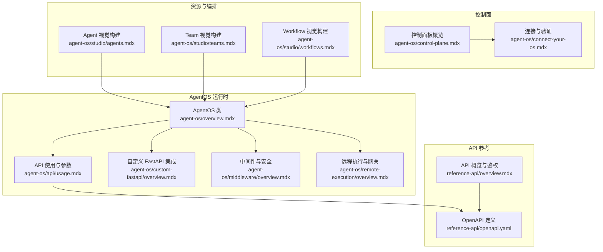
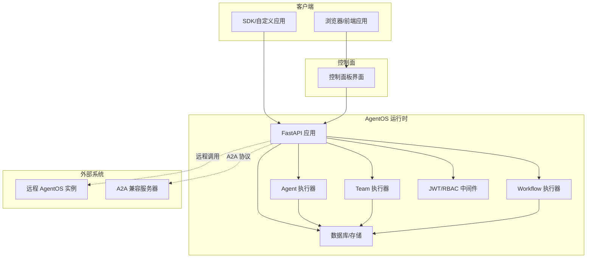
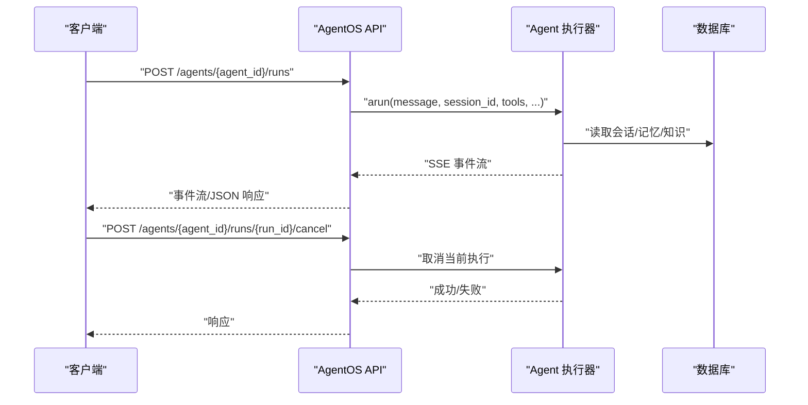
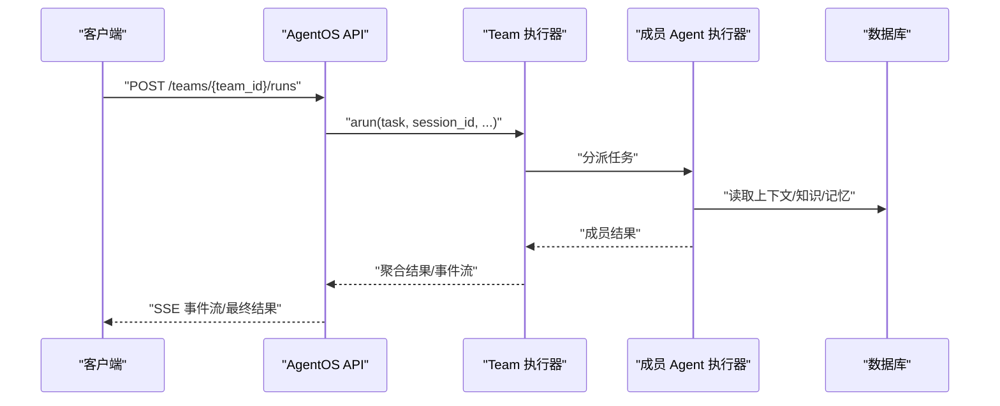
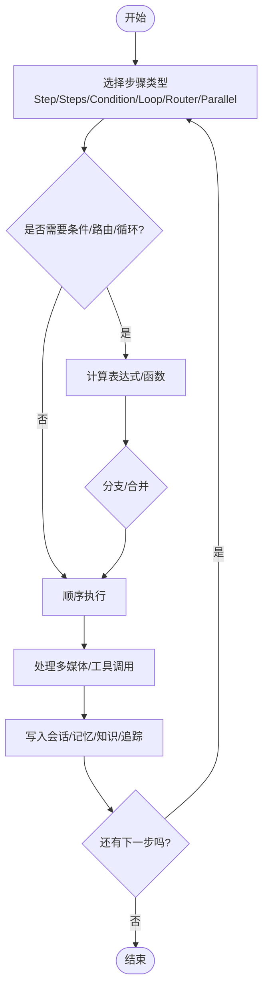
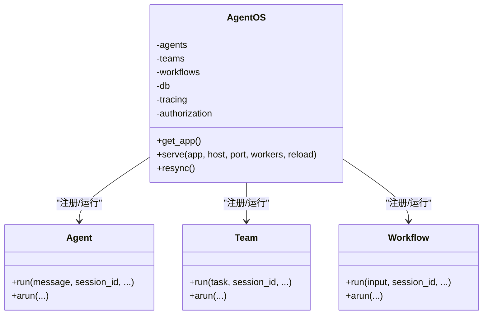
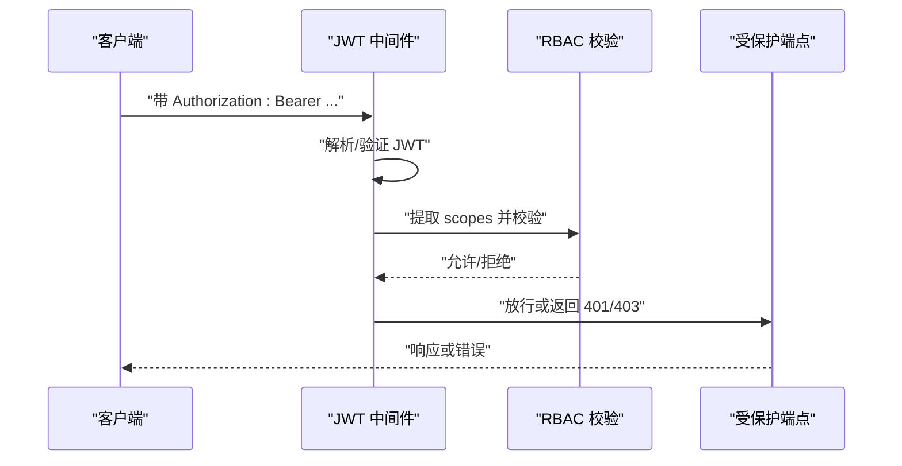
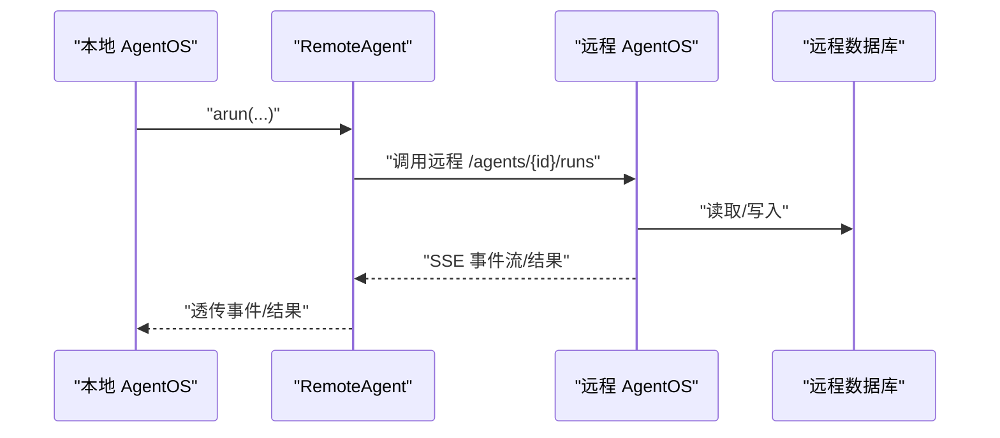
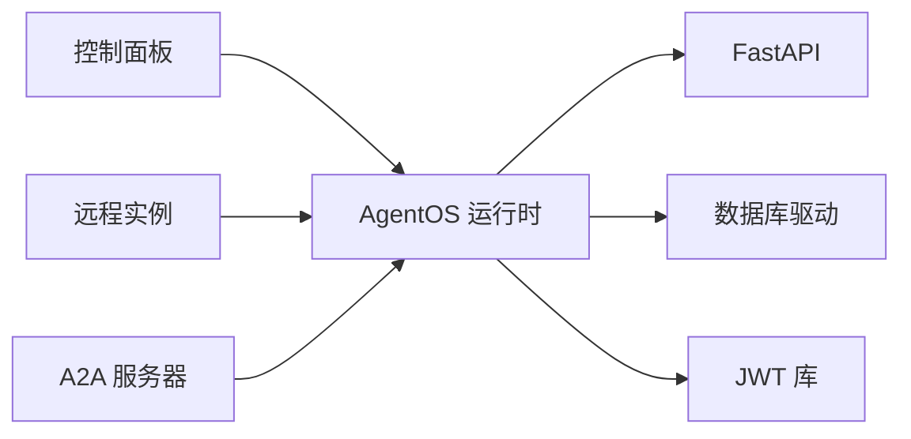

# 核心概念与架构

<cite>
**本文引用的文件**   
- [agent-os/introduction.mdx](file://agent-os/introduction.mdx)
- [agent-os/overview.mdx](file://agent-os/overview.mdx)
- [agent-os/run-your-os.mdx](file://agent-os/run-your-os.mdx)
- [agent-os/connect-your-os.mdx](file://agent-os/connect-your-os.mdx)
- [agent-os/studio/agents.mdx](file://agent-os/studio/agents.mdx)
- [agent-os/studio/teams.mdx](file://agent-os/studio/teams.mdx)
- [agent-os/studio/workflows.mdx](file://agent-os/studio/workflows.mdx)
- [agent-os/control-plane.mdx](file://agent-os/control-plane.mdx)
- [agent-os/security/rbac.mdx](file://agent-os/security/rbac.mdx)
- [agent-os/api/usage.mdx](file://agent-os/api/usage.mdx)
- [agent-os/custom-fastapi/overview.mdx](file://agent-os/custom-fastapi/overview.mdx)
- [agent-os/middleware/overview.mdx](file://agent-os/middleware/overview.mdx)
- [agent-os/remote-execution/overview.mdx](file://agent-os/remote-execution/overview.mdx)
- [reference-api/openapi.yaml](file://reference-api/openapi.yaml)
- [reference-api/overview.mdx](file://reference-api/overview.mdx)
</cite>

## 目录
1. [引言](#引言)
2. [项目结构](#项目结构)
3. [核心组件](#核心组件)
4. [架构总览](#架构总览)
5. [详细组件分析](#详细组件分析)
6. [依赖分析](#依赖分析)
7. [性能考虑](#性能考虑)
8. [故障排查指南](#故障排查指南)
9. [结论](#结论)
10. [附录](#附录)

## 引言
本文件面向希望理解并使用 AgentOS 的开发者与架构师，系统阐述 AgentOS 作为“智能代理系统生产运行时”的设计理念与架构原理。AgentOS 将开发环境中的代理（Agent）、团队（Team）与工作流（Workflow）统一到一个生产就绪的 API 平台，提供：
- 统一的生产 API：50+ 可直接使用的端点，支持 SSE 兼容的实时流式响应
- 数据主权：会话、记忆、知识与追踪均存储于用户数据库
- 请求隔离：避免用户、代理与会话之间的状态泄露
- 安全治理：基于 JWT 的 RBAC 权限控制与分层作用域
- 可观测性：追踪数据存于本地数据库，无第三方出站或供应商锁定
- 运维能力：可视化控制面板用于测试、监控与调试

AgentOS 由两部分组成：
- 运行时：基于 FastAPI 的服务，承载 Agent/Team/Workflow 的执行与 API 暴露
- 控制面：浏览器直连的 Web 界面，用于聊天、追踪、知识、会话与调度管理

[无章节来源：本节为总体概述，不直接分析具体文件]

## 项目结构
从仓库组织看，AgentOS 的文档围绕“运行时”“控制面”“API 参考”“安全与中间件”“远程执行”等维度展开。下图给出与本文相关的关键模块与文件映射。

**图表来源**
- [agent-os/overview.mdx:1-86](file://agent-os/overview.mdx#L1-L86)
- [agent-os/api/usage.mdx:1-111](file://agent-os/api/usage.mdx#L1-L111)
- [agent-os/custom-fastapi/overview.mdx:1-239](file://agent-os/custom-fastapi/overview.mdx#L1-L239)
- [agent-os/middleware/overview.mdx:1-223](file://agent-os/middleware/overview.mdx#L1-L223)
- [agent-os/remote-execution/overview.mdx:1-163](file://agent-os/remote-execution/overview.mdx#L1-L163)
- [agent-os/control-plane.mdx:1-212](file://agent-os/control-plane.mdx#L1-L212)
- [agent-os/connect-your-os.mdx:1-41](file://agent-os/connect-your-os.mdx#L1-L41)
- [agent-os/studio/agents.mdx:1-66](file://agent-os/studio/agents.mdx#L1-L66)
- [agent-os/studio/teams.mdx:1-79](file://agent-os/studio/teams.mdx#L1-L79)
- [agent-os/studio/workflows.mdx:1-80](file://agent-os/studio/workflows.mdx#L1-L80)
- [reference-api/openapi.yaml:1-800](file://reference-api/openapi.yaml#L1-L800)
- [reference-api/overview.mdx:1-74](file://reference-api/overview.mdx#L1-L74)

**章节来源**
- [agent-os/introduction.mdx:1-113](file://agent-os/introduction.mdx#L1-L113)
- [agent-os/overview.mdx:1-86](file://agent-os/overview.mdx#L1-L86)

## 核心组件
- Agent（代理）
  - 资源与职责：单智能体，负责接收消息、调用工具、访问知识库与记忆、生成输出
  - 编排方式：可通过 API 直接运行；也可在 Team 中被协调；或作为 Workflow 步骤执行
  - 可视化构建：通过 Studio 的“注册表”拖拽模型、工具、结构化输入输出进行配置
- Team（团队）
  - 资源与职责：多 Agent 协作，支持协调、路由、协作等模式；统一对外提供任务执行入口
  - 编排方式：通过 API 运行；在控制面板中可观测各成员贡献与协调流程
- Workflow（工作流）
  - 资源与职责：以步骤为基础的自动化流水线，支持顺序、条件、循环、并行、路由等组合
  - 编排方式：通过 Studio 可视化设计；支持 CEL 表达式或函数作为分支/选择逻辑
- AgentOS（运行时）
  - 资源与职责：将 Agent/Team/Workflow 注册为 API 服务，提供统一的生产 API、会话/记忆/知识/追踪持久化、安全与可观测性
  - 关键能力：get_app()/serve()、配置注入、生命周期管理、后台钩子、自动数据库初始化
- 控制面板（控制面）
  - 资源与职责：聊天、追踪树/瀑布图、会话管理、知识管理、内存管理、调度、成员管理
  - 连接方式：浏览器直连运行时，无第三方中转
- API 层（生产就绪）
  - 资源与职责：统一暴露 Agent/Team/Workflow 的运行、查询、取消、续跑等端点
  - 特性：SSE 流式输出、结构化输入输出、会话上下文、媒体文件上传、权限控制

**章节来源**
- [agent-os/studio/agents.mdx:1-66](file://agent-os/studio/agents.mdx#L1-L66)
- [agent-os/studio/teams.mdx:1-79](file://agent-os/studio/teams.mdx#L1-L79)
- [agent-os/studio/workflows.mdx:1-80](file://agent-os/studio/workflows.mdx#L1-L80)
- [agent-os/overview.mdx:10-86](file://agent-os/overview.mdx#L10-L86)
- [agent-os/control-plane.mdx:1-212](file://agent-os/control-plane.mdx#L1-L212)
- [reference-api/openapi.yaml:1-800](file://reference-api/openapi.yaml#L1-L800)

## 架构总览
AgentOS 的整体架构由“运行时 + 控制面 + API 层 + 安全与中间件 + 远程执行”构成。运行时基于 FastAPI，统一暴露 REST API，并通过控制面板提供可视化运维。安全通过 JWT + RBAC 实现，远程执行支持跨实例与 A2A 协议。

**图表来源**
- [agent-os/introduction.mdx:40-91](file://agent-os/introduction.mdx#L40-L91)
- [agent-os/custom-fastapi/overview.mdx:10-97](file://agent-os/custom-fastapi/overview.mdx#L10-L97)
- [agent-os/middleware/overview.mdx:42-74](file://agent-os/middleware/overview.mdx#L42-L74)
- [agent-os/remote-execution/overview.mdx:19-163](file://agent-os/remote-execution/overview.mdx#L19-L163)
- [reference-api/openapi.yaml:6-138](file://reference-api/openapi.yaml#L6-L138)

## 详细组件分析

### Agent 组件分析
- 设计要点
  - 可视化构建：通过 Studio 的注册表装配模型、工具、结构化 I/O
  - 代码等价：Studio 构建的 Agent 对应 SDK 的 Agent 类实例
  - 运行接口：通过 API 端点执行，支持流式与非流式、多媒体输入、会话上下文
- 关键端点
  - 列表与详情：获取 Agent 列表与配置
  - 创建运行：提交消息与参数，返回流式事件或结果
  - 查询运行：按会话过滤运行历史
  - 续跑/取消：在暂停或等待审批时继续执行
- 与运行时集成
  - AgentOS 将 Agent 注册为可运行资源，统一暴露到 FastAPI 应用

**图表来源**
- [reference-api/openapi.yaml:193-484](file://reference-api/openapi.yaml#L193-L484)
- [agent-os/api/usage.mdx:8-111](file://agent-os/api/usage.mdx#L8-L111)

**章节来源**
- [agent-os/studio/agents.mdx:9-66](file://agent-os/studio/agents.mdx#L9-L66)
- [reference-api/openapi.yaml:193-484](file://reference-api/openapi.yaml#L193-L484)
- [agent-os/api/usage.mdx:8-111](file://agent-os/api/usage.mdx#L8-L111)

### Team 组件分析
- 设计要点
  - 多 Agent 协作：支持 coordinate/route/collaborate 等模式
  - 可视化编排：在 Studio 中拖拽 Agent 组合团队
  - 运行接口：统一的 Team 运行端点，支持流式输出与会话上下文
- 关键端点
  - 创建 Team 运行：提交任务与参数
  - 列表与查询：按会话过滤运行历史
  - 续跑/取消：与 Agent 类似

**图表来源**
- [reference-api/openapi.yaml:703-776](file://reference-api/openapi.yaml#L703-L776)
- [agent-os/studio/teams.mdx:10-79](file://agent-os/studio/teams.mdx#L10-L79)

**章节来源**
- [agent-os/studio/teams.mdx:10-79](file://agent-os/studio/teams.mdx#L10-L79)
- [reference-api/openapi.yaml:703-776](file://reference-api/openapi.yaml#L703-L776)

### Workflow 组件分析
- 设计要点
  - 步骤类型：Step、Steps、Condition、Loop、Router、Parallel 等
  - 逻辑表达：支持 CEL 表达式或函数作为评估器/选择器
  - 可视化设计：在 Studio 中拖拽连接形成复杂自动化管线
- 关键端点
  - 创建 Workflow 运行：提交输入，按步骤顺序/并发执行
  - 列表与查询：按会话过滤运行历史
  - 续跑/取消：对挂起或运行中的步骤进行控制

**图表来源**
- [agent-os/studio/workflows.mdx:8-80](file://agent-os/studio/workflows.mdx#L8-L80)
- [reference-api/openapi.yaml:1-800](file://reference-api/openapi.yaml#L1-L800)

**章节来源**
- [agent-os/studio/workflows.mdx:8-80](file://agent-os/studio/workflows.mdx#L8-L80)
- [reference-api/openapi.yaml:1-800](file://reference-api/openapi.yaml#L1-L800)

### AgentOS 运行时与 API 设计
- 设计理念
  - 以最小代码将开发态的 Agent/Team/Workflow 转换为可部署的 API 服务
  - 统一的 FastAPI 应用，内置健康检查、配置查询、模型列表等核心端点
  - 支持自定义 FastAPI 应用与路由扩展，兼容现有业务系统
- 关键方法与参数
  - get_app()/serve()：快速启动与集成
  - tracing、db、knowledge、interfaces、authorization、cors 等参数
- 生产就绪特性
  - SSE 流式输出、结构化输入输出、会话上下文、媒体文件上传
  - 可选的安全密钥、JWT 验证、RBAC 权限映射
  - 自动数据库初始化与资源同步

**图表来源**
- [agent-os/overview.mdx:27-86](file://agent-os/overview.mdx#L27-L86)
- [agent-os/api/usage.mdx:8-111](file://agent-os/api/usage.mdx#L8-L111)

**章节来源**
- [agent-os/overview.mdx:10-86](file://agent-os/overview.mdx#L10-L86)
- [agent-os/api/usage.mdx:8-111](file://agent-os/api/usage.mdx#L8-L111)

### 安全与中间件（JWT + RBAC）
- 设计理念
  - 基于 JWT 的细粒度权限控制，支持全局管理员与按资源（Agent/Team/Workflow）授权
  - 默认端点与权限映射清晰，支持自定义映射与排除路由
- 关键能力
  - JWT 验证与声明提取（user_id、session_id、自定义 claims）
  - 权限范围格式：resource:action、resource:<id>:action、agent_os:admin
  - 中间件执行顺序影响请求处理链路，建议安全优先
- 配置方式
  - 初始化时启用 authorization 或通过中间件添加
  - 支持环境变量与配置对象两种方式

**图表来源**
- [agent-os/security/rbac.mdx:21-410](file://agent-os/security/rbac.mdx#L21-L410)
- [agent-os/middleware/overview.mdx:42-74](file://agent-os/middleware/overview.mdx#L42-L74)
- [reference-api/overview.mdx:9-22](file://reference-api/overview.mdx#L9-L22)

**章节来源**
- [agent-os/security/rbac.mdx:21-410](file://agent-os/security/rbac.mdx#L21-L410)
- [agent-os/middleware/overview.mdx:42-74](file://agent-os/middleware/overview.mdx#L42-L74)
- [reference-api/overview.mdx:9-22](file://reference-api/overview.mdx#L9-L22)

### 远程执行与网关模式
- 设计理念
  - 支持在不同 AgentOS 实例之间执行 Agent/Team/Workflow
  - 提供网关模式，统一聚合多个实例的能力
  - 支持 A2A 协议对接第三方 A2A 兼容服务
- 关键组件
  - RemoteAgent/RemoteTeam/RemoteWorkflow：远程执行封装
  - AgentOSClient/A2AClient：低层客户端直连任意端点
- 使用场景
  - 分布式架构、微服务拆分、统一 API 网关

**图表来源**
- [agent-os/remote-execution/overview.mdx:39-163](file://agent-os/remote-execution/overview.mdx#L39-L163)

**章节来源**
- [agent-os/remote-execution/overview.mdx:1-163](file://agent-os/remote-execution/overview.mdx#L1-L163)

## 依赖分析
- 组件耦合与内聚
  - AgentOS 对外暴露统一 API，内部通过执行器解耦 Agent/Team/Workflow
  - 中间件层独立于业务逻辑，便于替换与扩展
- 直接与间接依赖
  - 运行时依赖 FastAPI、数据库驱动、JWT 库
  - 控制面板依赖运行时提供的 API
  - 远程执行依赖网络可达与协议一致性
- 外部依赖与集成点
  - 数据库：PostgreSQL/SQLite/MongoDB 等
  - 认证：JWT/JWKS、可选安全密钥
  - 第三方协议：A2A（如 Google ADK）

**图表来源**
- [agent-os/custom-fastapi/overview.mdx:10-97](file://agent-os/custom-fastapi/overview.mdx#L10-L97)
- [agent-os/security/rbac.mdx:21-410](file://agent-os/security/rbac.mdx#L21-L410)
- [agent-os/remote-execution/overview.mdx:19-163](file://agent-os/remote-execution/overview.mdx#L19-L163)

**章节来源**
- [agent-os/custom-fastapi/overview.mdx:10-97](file://agent-os/custom-fastapi/overview.mdx#L10-L97)
- [agent-os/security/rbac.mdx:21-410](file://agent-os/security/rbac.mdx#L21-L410)
- [agent-os/remote-execution/overview.mdx:19-163](file://agent-os/remote-execution/overview.mdx#L19-L163)

## 性能考虑
- 中间件链路
  - 中间件按添加顺序逆序执行，建议将安全中间件置于更外层，减少后续处理开销
- 流式输出
  - SSE 流式响应降低首字节延迟，适合长耗时任务
- 数据库访问
  - 合理使用索引与连接池，避免在热路径上执行阻塞操作
- 远程执行
  - 网络抖动与超时重试策略需结合业务容忍度配置

[无章节来源：本节提供通用指导，不直接分析具体文件]

## 故障排查指南
- 连接与认证
  - 确认运行时已正确设置安全密钥或启用 JWT 验证
  - 校验 Authorization 头与 JWT 声明（scopes、aud、exp 等）
- 权限问题
  - 检查端点所需权限范围与令牌 scopes 是否匹配
  - 使用默认映射核对端点权限，必要时自定义映射
- 运行时问题
  - 使用 /health 与 /config 端点确认运行状态与配置
  - 查看控制面板中的追踪树/瀑布图定位瓶颈
- 远程执行
  - 校验远程实例可达性与协议一致性
  - 检查网关路由与超时配置

**章节来源**
- [reference-api/overview.mdx:9-22](file://reference-api/overview.mdx#L9-L22)
- [agent-os/security/rbac.mdx:361-373](file://agent-os/security/rbac.mdx#L361-L373)
- [agent-os/control-plane.mdx:74-109](file://agent-os/control-plane.mdx#L74-L109)

## 结论
AgentOS 将 Agent/Team/Workflow 统一到一个生产就绪的平台，通过 FastAPI 运行时、可视化控制面板与完善的 API 参考，实现从开发到生产的无缝衔接。其核心价值在于：
- 统一 API 与数据主权：所有会话、记忆、知识与追踪均在用户数据库
- 安全与治理：JWT + RBAC 提供细粒度权限控制
- 可观测性：追踪树/瀑布图帮助定位问题与优化性能
- 可扩展性：自定义 FastAPI、中间件、远程执行与网关模式满足多样化部署需求

[无章节来源：本节为总结，不直接分析具体文件]

## 附录
- 快速开始
  - 在本地运行最小 AgentOS 示例，参考“运行你的 AgentOS”
- 连接控制面板
  - 在浏览器中连接运行时，参考“连接你的 AgentOS”
- API 参考
  - 完整端点与鉴权说明，参考“AgentOS API 概览”

**章节来源**
- [agent-os/run-your-os.mdx:6-83](file://agent-os/run-your-os.mdx#L6-L83)
- [agent-os/connect-your-os.mdx:6-41](file://agent-os/connect-your-os.mdx#L6-L41)
- [reference-api/overview.mdx:1-74](file://reference-api/overview.mdx#L1-L74)