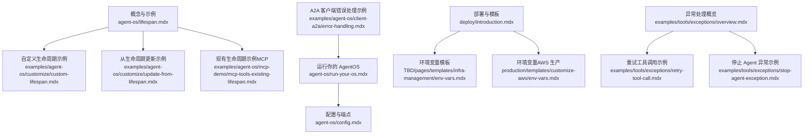
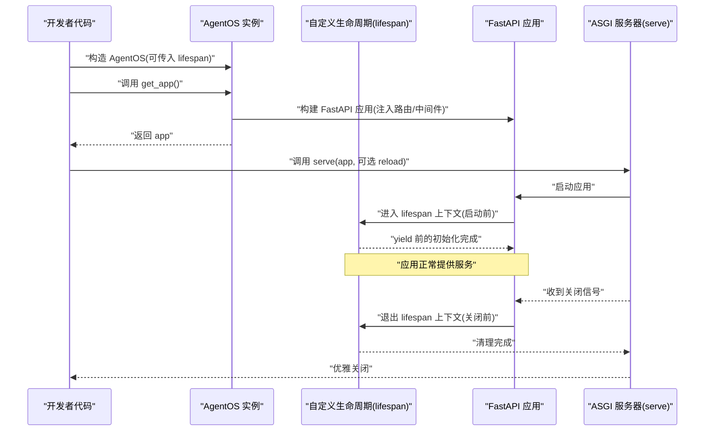
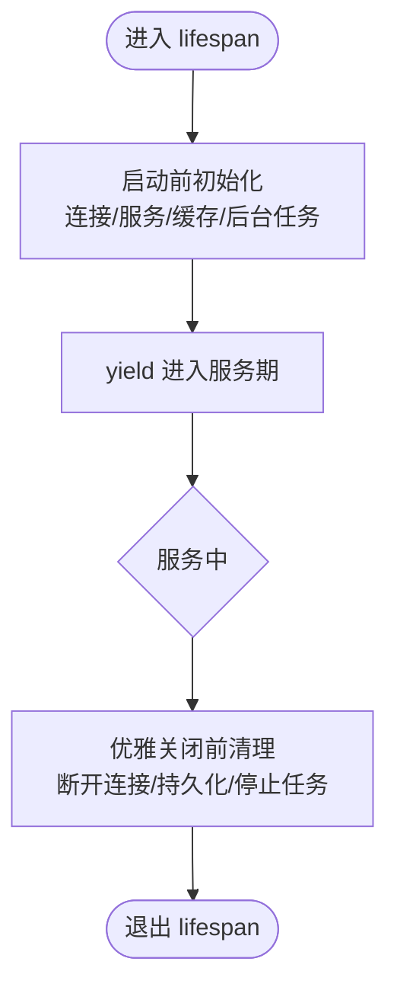
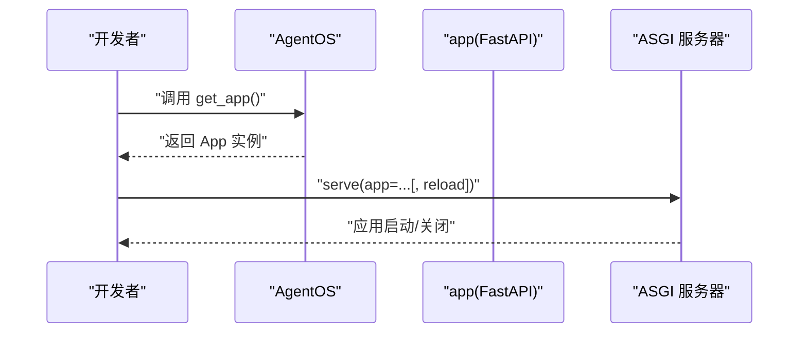
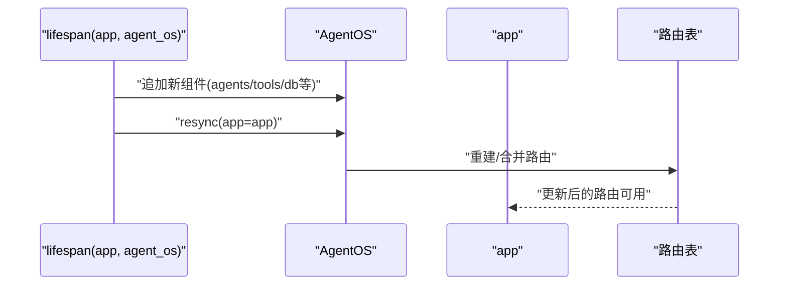

# 生命周期管理

<cite>
**本文引用的文件**
- [agent-os/lifespan.mdx](file://agent-os/lifespan.mdx)
- [examples/agent-os/customize/custom-lifespan.mdx](file://examples/agent-os/customize/custom-lifespan.mdx)
- [examples/agent-os/customize/update-from-lifespan.mdx](file://examples/agent-os/customize/update-from-lifespan.mdx)
- [examples/agent-os/mcp-demo/mcp-tools-existing-lifespan.mdx](file://examples/agent-os/mcp-demo/mcp-tools-existing-lifespan.mdx)
- [agent-os/run-your-os.mdx](file://agent-os/run-your-os.mdx)
- [agent-os/config.mdx](file://agent-os/config.mdx)
- [deploy/introduction.mdx](file://deploy/introduction.mdx)
- [TBD/pages/templates/infra-management/env-vars.mdx](file://TBD/pages/templates/infra-management/env-vars.mdx)
- [production/templates/customize-aws/env-vars.mdx](file://production/templates/customize-aws/env-vars.mdx)
- [examples/tools/exceptions/overview.mdx](file://examples/tools/exceptions/overview.mdx)
- [examples/tools/exceptions/retry-tool-call.mdx](file://examples/tools/exceptions/retry-tool-call.mdx)
- [examples/tools/exceptions/stop-agent-exception.mdx](file://examples/tools/exceptions/stop-agent-exception.mdx)
- [examples/agent-os/client-a2a/error-handling.mdx](file://examples/agent-os/client-a2a/error-handling.mdx)
</cite>

## 目录
1. [简介](#简介)
2. [项目结构](#项目结构)
3. [核心组件](#核心组件)
4. [架构总览](#架构总览)
5. [详细组件分析](#详细组件分析)
6. [依赖关系分析](#依赖关系分析)
7. [性能考量](#性能考量)
8. [故障排查指南](#故障排查指南)
9. [结论](#结论)
10. [附录](#附录)

## 简介
本技术文档围绕 AgentOS 的生命周期管理展开，系统阐述应用启动、运行时管理与优雅关闭的完整流程；详解 lifespan 参数的使用方法与自定义生命周期管理器的实现；解释 get_app() 与 serve() 方法的工作原理与适用场景；并提供不同部署环境（本地开发、测试、生产）的最佳实践，涵盖配置差异、异常处理与故障恢复策略，以及监控与日志记录的配置建议。

## 项目结构
与生命周期管理直接相关的知识主要分布在以下位置：
- 概念与示例：agent-os/lifespan.mdx、examples/agent-os/customize/custom-lifespan.mdx、examples/agent-os/customize/update-from-lifespan.mdx、examples/agent-os/mcp-demo/mcp-tools-existing-lifespan.mdx
- 应用运行与入口：agent-os/run-your-os.mdx
- 配置与端点：agent-os/config.mdx
- 部署与环境变量：deploy/introduction.mdx、TBD/pages/templates/infra-management/env-vars.mdx、production/templates/customize-aws/env-vars.mdx
- 异常处理与容错：examples/tools/exceptions/overview.mdx、examples/tools/exceptions/retry-tool-call.mdx、examples/tools/exceptions/stop-agent-exception.mdx、examples/agent-os/client-a2a/error-handling.mdx



**图表来源**
- [agent-os/lifespan.mdx:1-142](file://agent-os/lifespan.mdx#L1-L142)
- [examples/agent-os/customize/custom-lifespan.mdx:1-78](file://examples/agent-os/customize/custom-lifespan.mdx#L1-L78)
- [examples/agent-os/customize/update-from-lifespan.mdx:1-85](file://examples/agent-os/customize/update-from-lifespan.mdx#L1-L85)
- [examples/agent-os/mcp-demo/mcp-tools-existing-lifespan.mdx:60-88](file://examples/agent-os/mcp-demo/mcp-tools-existing-lifespan.mdx#L60-L88)
- [agent-os/run-your-os.mdx:1-83](file://agent-os/run-your-os.mdx#L1-L83)
- [agent-os/config.mdx:146-213](file://agent-os/config.mdx#L146-L213)
- [deploy/introduction.mdx:1-102](file://deploy/introduction.mdx#L1-L102)
- [TBD/pages/templates/infra-management/env-vars.mdx:1-51](file://TBD/pages/templates/infra-management/env-vars.mdx#L1-L51)
- [production/templates/customize-aws/env-vars.mdx:1-51](file://production/templates/customize-aws/env-vars.mdx#L1-L51)
- [examples/tools/exceptions/overview.mdx:1-13](file://examples/tools/exceptions/overview.mdx#L1-L13)
- [examples/tools/exceptions/retry-tool-call.mdx:41-82](file://examples/tools/exceptions/retry-tool-call.mdx#L41-L82)
- [examples/tools/exceptions/stop-agent-exception.mdx:44-79](file://examples/tools/exceptions/stop-agent-exception.mdx#L44-L79)
- [examples/agent-os/client-a2a/error-handling.mdx:48-151](file://examples/agent-os/client-a2a/error-handling.mdx#L48-L151)

**章节来源**
- [agent-os/lifespan.mdx:1-142](file://agent-os/lifespan.mdx#L1-L142)
- [agent-os/run-your-os.mdx:1-83](file://agent-os/run-your-os.mdx#L1-L83)
- [agent-os/config.mdx:146-213](file://agent-os/config.mdx#L146-L213)
- [deploy/introduction.mdx:1-102](file://deploy/introduction.mdx#L1-L102)
- [TBD/pages/templates/infra-management/env-vars.mdx:1-51](file://TBD/pages/templates/infra-management/env-vars.mdx#L1-L51)
- [production/templates/customize-aws/env-vars.mdx:1-51](file://production/templates/customize-aws/env-vars.mdx#L1-L51)
- [examples/tools/exceptions/overview.mdx:1-13](file://examples/tools/exceptions/overview.mdx#L1-L13)
- [examples/tools/exceptions/retry-tool-call.mdx:41-82](file://examples/tools/exceptions/retry-tool-call.mdx#L41-L82)
- [examples/tools/exceptions/stop-agent-exception.mdx:44-79](file://examples/tools/exceptions/stop-agent-exception.mdx#L44-L79)
- [examples/agent-os/client-a2a/error-handling.mdx:48-151](file://examples/agent-os/client-a2a/error-handling.mdx#L48-L151)

## 核心组件
- 自定义生命周期管理器（lifespan）
  - 通过 lifespan 参数传入一个异步上下文管理器，用于在 FastAPI 应用启动前与关闭前执行初始化与清理逻辑。
  - 可接收 app 实例，亦可接收 app 与 AgentOS 实例，以便在启动阶段动态更新 AgentOS 内容或进行资源同步。
- get_app()
  - 构建并返回 FastAPI 应用实例，该实例已整合 AgentOS 路由、中间件与生命周期钩子。
- serve()
  - 启动服务进程，支持指定应用模块路径与热重载等参数；在使用自定义 lifespan 时需谨慎使用热重载以避免重复初始化问题。

**章节来源**
- [agent-os/lifespan.mdx:9-36](file://agent-os/lifespan.mdx#L9-L36)
- [examples/agent-os/customize/custom-lifespan.mdx:35-46](file://examples/agent-os/customize/custom-lifespan.mdx#L35-L46)
- [examples/agent-os/customize/update-from-lifespan.mdx:42-52](file://examples/agent-os/customize/update-from-lifespan.mdx#L42-L52)
- [examples/agent-os/mcp-demo/mcp-tools-existing-lifespan.mdx:60-75](file://examples/agent-os/mcp-demo/mcp-tools-existing-lifespan.mdx#L60-L75)
- [agent-os/run-your-os.mdx:26-28](file://agent-os/run-your-os.mdx#L26-L28)

## 架构总览
下图展示了从代码到运行时的关键交互：lifespan 在 FastAPI 应用生命周期中插入启动与关闭逻辑；AgentOS 通过 get_app() 生成应用；serve() 将应用交付给 ASGI 服务器运行。



**图表来源**
- [agent-os/lifespan.mdx:25-36](file://agent-os/lifespan.mdx#L25-L36)
- [examples/agent-os/customize/custom-lifespan.mdx:49-63](file://examples/agent-os/customize/custom-lifespan.mdx#L49-L63)
- [examples/agent-os/mcp-demo/mcp-tools-existing-lifespan.mdx:66-75](file://examples/agent-os/mcp-demo/mcp-tools-existing-lifespan.mdx#L66-L75)

## 详细组件分析

### 组件 A：自定义生命周期管理器（lifespan）
- 功能要点
  - 启动前：初始化数据库连接、第三方服务、缓存、后台任务等。
  - 关闭前：释放连接、持久化数据、停止后台任务、清理临时资源。
  - 可选参数：接收 app 或同时接收 app 与 AgentOS 实例，便于在启动阶段动态更新 AgentOS 内容并重新同步路由。
- 使用建议
  - 使用异步上下文管理器装饰器，确保异步资源正确管理。
  - 在多实例或多应用场景中，避免重复初始化；必要时在 yield 前后分别进行幂等检查。
  - 若使用热重载，请遵循示例中的注意事项，避免重复注册或状态污染。



**图表来源**
- [agent-os/lifespan.mdx:37-45](file://agent-os/lifespan.mdx#L37-L45)
- [examples/agent-os/customize/custom-lifespan.mdx:35-39](file://examples/agent-os/customize/custom-lifespan.mdx#L35-L39)

**章节来源**
- [agent-os/lifespan.mdx:9-36](file://agent-os/lifespan.mdx#L9-L36)
- [examples/agent-os/customize/custom-lifespan.mdx:35-46](file://examples/agent-os/customize/custom-lifespan.mdx#L35-L46)
- [examples/agent-os/customize/update-from-lifespan.mdx:42-52](file://examples/agent-os/customize/update-from-lifespan.mdx#L42-L52)

### 组件 B：get_app() 与 serve() 的工作原理
- get_app()
  - 负责组装 FastAPI 应用，注入 AgentOS 路由、中间件与生命周期钩子，返回可直接运行的应用实例。
- serve()
  - 将应用交给 ASGI 服务器运行；支持指定应用模块路径（如模块名:对象名），并可启用热重载。
  - 注意：当使用自定义 lifespan 时，不建议开启热重载，以免导致重复初始化或状态异常。



**图表来源**
- [agent-os/run-your-os.mdx:26-28](file://agent-os/run-your-os.mdx#L26-L28)
- [examples/agent-os/customize/custom-lifespan.mdx:49-63](file://examples/agent-os/customize/custom-lifespan.mdx#L49-L63)
- [examples/agent-os/mcp-demo/mcp-tools-existing-lifespan.mdx:66-75](file://examples/agent-os/mcp-demo/mcp-tools-existing-lifespan.mdx#L66-L75)

**章节来源**
- [agent-os/run-your-os.mdx:26-28](file://agent-os/run-your-os.mdx#L26-L28)
- [examples/agent-os/customize/custom-lifespan.mdx:49-63](file://examples/agent-os/customize/custom-lifespan.mdx#L49-L63)
- [examples/agent-os/mcp-demo/mcp-tools-existing-lifespan.mdx:66-75](file://examples/agent-os/mcp-demo/mcp-tools-existing-lifespan.mdx#L66-L75)

### 组件 C：从生命周期动态更新 AgentOS
- 场景说明
  - 在启动阶段根据环境或外部条件动态添加组件（如 Agent、工具、数据库等），并在更新后重新同步路由。
- 实现要点
  - lifespan 函数可接收 AgentOS 实例与 app 实例，在启动前追加组件并调用 resync(app=app) 完成路由刷新。
  - 适用于需要按环境加载不同配置或延迟初始化某些组件的场景。



**图表来源**
- [examples/agent-os/customize/update-from-lifespan.mdx:42-52](file://examples/agent-os/customize/update-from-lifespan.mdx#L42-L52)
- [examples/agent-os/customize/update-from-lifespan.mdx:61-63](file://examples/agent-os/customize/update-from-lifespan.mdx#L61-L63)

**章节来源**
- [examples/agent-os/customize/update-from-lifespan.mdx:42-52](file://examples/agent-os/customize/update-from-lifespan.mdx#L42-L52)
- [examples/agent-os/customize/update-from-lifespan.mdx:61-63](file://examples/agent-os/customize/update-from-lifespan.mdx#L61-L63)

### 组件 D：不同部署环境下的生命周期管理最佳实践
- 本地开发
  - 使用热重载快速迭代；但若使用自定义 lifespan，应避免启用热重载，防止重复初始化。
  - 通过环境变量注入数据库连接、模型密钥等配置，确保本地与远程一致。
- 测试
  - 使用独立数据库与最小化组件集合，缩短启动时间；在 lifespan 中仅初始化必要资源。
  - 通过 /config 端点验证配置是否正确下发至前端控制平面。
- 生产
  - 使用托管平台（如 ECS、Railway、AWS）提供的健康检查与优雅停机信号；在 lifespan 中执行资源清理。
  - 通过环境变量集中管理密钥与数据库连接，避免硬编码；结合数据库迁移脚本在启动时自动执行。


**图表来源**
- [examples/agent-os/customize/custom-lifespan.mdx:62-63](file://examples/agent-os/customize/custom-lifespan.mdx#L62-L63)
- [examples/agent-os/mcp-demo/mcp-tools-existing-lifespan.mdx:73-74](file://examples/agent-os/mcp-demo/mcp-tools-existing-lifespan.mdx#L73-L74)
- [agent-os/config.mdx:146-213](file://agent-os/config.mdx#L146-L213)
- [TBD/pages/templates/infra-management/env-vars.mdx:7-26](file://TBD/pages/templates/infra-management/env-vars.mdx#L7-L26)
- [production/templates/customize-aws/env-vars.mdx:29-48](file://production/templates/customize-aws/env-vars.mdx#L29-L48)

**章节来源**
- [examples/agent-os/customize/custom-lifespan.mdx:62-63](file://examples/agent-os/customize/custom-lifespan.mdx#L62-L63)
- [examples/agent-os/mcp-demo/mcp-tools-existing-lifespan.mdx:73-74](file://examples/agent-os/mcp-demo/mcp-tools-existing-lifespan.mdx#L73-L74)
- [agent-os/config.mdx:146-213](file://agent-os/config.mdx#L146-L213)
- [TBD/pages/templates/infra-management/env-vars.mdx:7-26](file://TBD/pages/templates/infra-management/env-vars.mdx#L7-L26)
- [production/templates/customize-aws/env-vars.mdx:29-48](file://production/templates/customize-aws/env-vars.mdx#L29-L48)

## 依赖关系分析
- AgentOS 与 FastAPI
  - AgentOS 通过 get_app() 生成 FastAPI 应用，并将生命周期钩子注入其中。
- 生命周期与应用
  - 自定义 lifespan 包裹 FastAPI 应用的启动与关闭过程，确保资源在正确时机被初始化与释放。
- 部署模板与环境变量
  - 部署模板通过 env_vars/env_file 注入环境变量，使应用在不同环境中具备一致的配置行为。

```mermaid
graph LR
AgentOS["AgentOS"] --> |get_app()| FastAPI["FastAPI 应用"]
Lifespan["自定义生命周期"] --> |包裹| FastAPI
Templates["部署模板"] --> |env_vars/env_file| AgentOS
```

**图表来源**
- [agent-os/run-your-os.mdx:26-28](file://agent-os/run-your-os.mdx#L26-L28)
- [agent-os/lifespan.mdx:25-36](file://agent-os/lifespan.mdx#L25-L36)
- [TBD/pages/templates/infra-management/env-vars.mdx:7-26](file://TBD/pages/templates/infra-management/env-vars.mdx#L7-L26)

**章节来源**
- [agent-os/run-your-os.mdx:26-28](file://agent-os/run-your-os.mdx#L26-L28)
- [agent-os/lifespan.mdx:25-36](file://agent-os/lifespan.mdx#L25-L36)
- [TBD/pages/templates/infra-management/env-vars.mdx:7-26](file://TBD/pages/templates/infra-management/env-vars.mdx#L7-L26)

## 性能考量
- 启动阶段
  - 将耗时操作（如数据库连接、第三方服务探测）放在 lifespan 启动前执行，减少首次请求延迟。
  - 对于大型组件（如向量库、模型加载），考虑懒加载策略，仅在首次使用时初始化。
- 运行阶段
  - 使用连接池与缓存减少重复开销；对高频接口启用响应式缓存。
- 关闭阶段
  - 在 lifespan 关闭前批量提交未持久化的数据，避免丢失；确保后台任务有序退出。

## 故障排查指南
- 热重载与 lifespan 冲突
  - 当使用自定义 lifespan 时，避免启用热重载，防止重复初始化与状态异常。
- 健康检查与优雅停机
  - 在生产环境配置健康检查端点与优雅停机信号，确保容器编排系统能够安全地重启或扩缩容。
- 错误处理与重试
  - 对外部服务调用采用指数退避重试；对不可恢复错误设置明确的停止条件，避免无限循环。
  - 使用统一的客户端错误处理模式，区分网络错误、HTTP 错误与远端服务不可用错误。
- 日志与可观测性
  - 在 lifespan 启动与关闭阶段输出关键日志，便于定位启动失败与关闭异常。
  - 结合 /config 端点核对配置是否正确下发，辅助诊断运行时问题。

**章节来源**
- [examples/agent-os/customize/custom-lifespan.mdx:62-63](file://examples/agent-os/customize/custom-lifespan.mdx#L62-L63)
- [examples/agent-os/mcp-demo/mcp-tools-existing-lifespan.mdx:73-74](file://examples/agent-os/mcp-demo/mcp-tools-existing-lifespan.mdx#L73-L74)
- [examples/tools/exceptions/overview.mdx:7-13](file://examples/tools/exceptions/overview.mdx#L7-L13)
- [examples/tools/exceptions/retry-tool-call.mdx:41-82](file://examples/tools/exceptions/retry-tool-call.mdx#L41-L82)
- [examples/tools/exceptions/stop-agent-exception.mdx:44-79](file://examples/tools/exceptions/stop-agent-exception.mdx#L44-L79)
- [examples/agent-os/client-a2a/error-handling.mdx:48-151](file://examples/agent-os/client-a2a/error-handling.mdx#L48-L151)
- [agent-os/config.mdx:146-213](file://agent-os/config.mdx#L146-L213)

## 结论
通过合理使用 lifespan 参数与 get_app()/serve() 组合，可以实现对 AgentOS 应用启动、运行与关闭的精细化控制。在不同部署环境下，应依据本地开发、测试与生产的差异化需求调整资源配置与生命周期策略；配合完善的异常处理与可观测性方案，确保系统在复杂场景下的稳定性与可靠性。

## 附录
- 快速参考
  - 自定义生命周期：在 lifespan 中进行资源初始化与清理。
  - 获取应用：调用 get_app() 获取 FastAPI 应用实例。
  - 启动服务：调用 serve() 并传入 app 模块路径；谨慎使用热重载。
  - 配置校验：访问 /config 端点核对配置。
  - 环境变量：通过部署模板的 env_vars/env_file 注入配置。

**章节来源**
- [agent-os/lifespan.mdx:9-36](file://agent-os/lifespan.mdx#L9-L36)
- [agent-os/run-your-os.mdx:26-28](file://agent-os/run-your-os.mdx#L26-L28)
- [agent-os/config.mdx:146-213](file://agent-os/config.mdx#L146-L213)
- [TBD/pages/templates/infra-management/env-vars.mdx:7-26](file://TBD/pages/templates/infra-management/env-vars.mdx#L7-L26)
- [production/templates/customize-aws/env-vars.mdx:29-48](file://production/templates/customize-aws/env-vars.mdx#L29-L48)