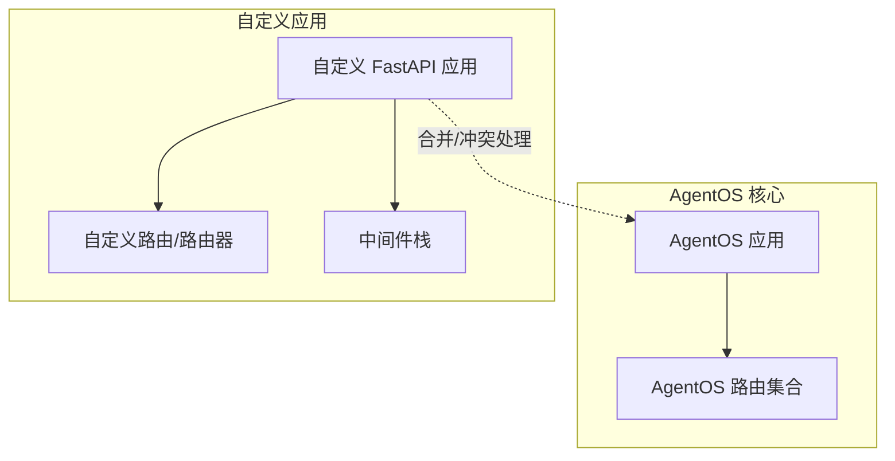
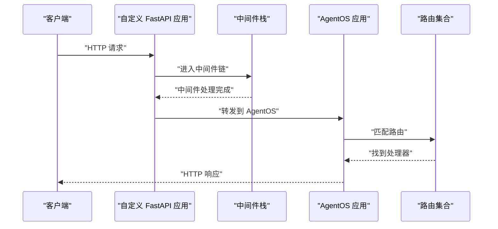
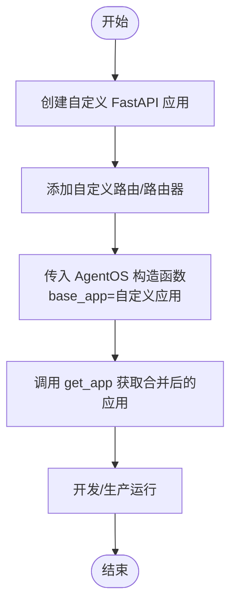
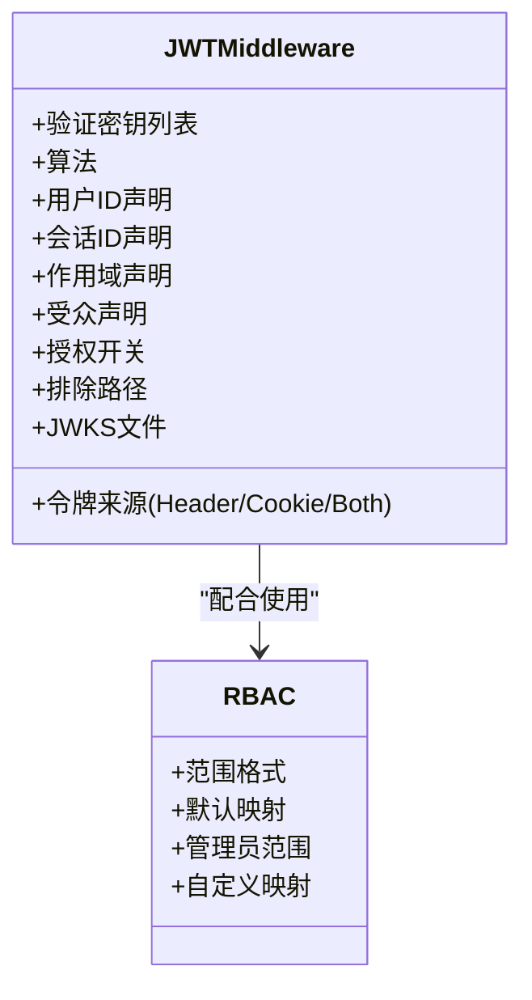
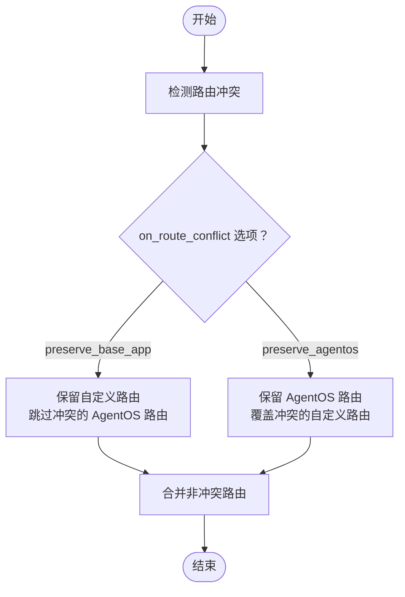
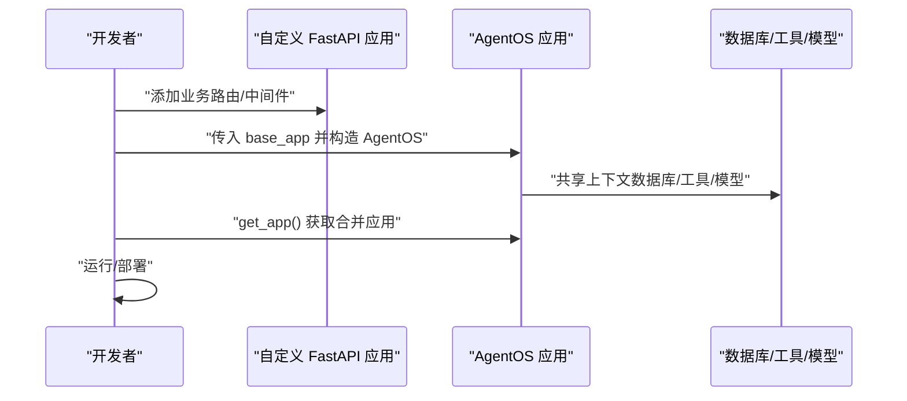
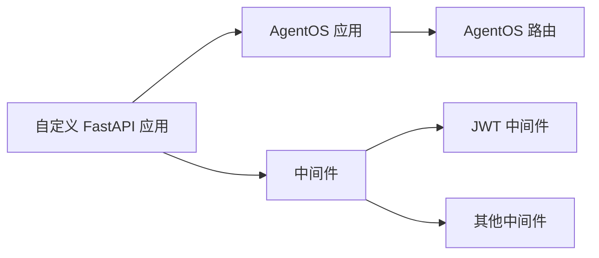

# 自定义 FastAPI 扩展

<cite>
**本文引用的文件**
- [自定义 FastAPI 概览](file://agent-os/custom-fastapi/overview.mdx)
- [覆盖路由](file://agent-os/custom-fastapi/override-routes.mdx)
- [中间件概览](file://agent-os/middleware/overview.mdx)
- [JWT 中间件](file://agent-os/middleware/jwt.mdx)
- [RBAC（基于角色的访问控制）](file://agent-os/security/rbac.mdx)
- [自定义 FastAPI + JWT 示例](file://agent-os/usage/middleware/custom-fastapi-jwt.mdx)
- [完整自定义 FastAPI 示例](file://agent-os/usage/custom-fastapi.mdx)
</cite>

## 目录
1. [简介](#简介)
2. [项目结构](#项目结构)
3. [核心组件](#核心组件)
4. [架构总览](#架构总览)
5. [详细组件分析](#详细组件分析)
6. [依赖关系分析](#依赖关系分析)
7. [性能考量](#性能考量)
8. [故障排查指南](#故障排查指南)
9. [结论](#结论)
10. [附录](#附录)

## 简介
本文件面向希望在 AgentOS 基础上构建自定义 FastAPI 应用的开发者，系统讲解如何：
- 将自定义 FastAPI 应用与 AgentOS 集成，添加自定义路由与路由器
- 使用中间件（如认证、日志、限流、安全头等）增强应用安全性与可观测性
- 在路由冲突时通过 on_route_conflict 参数选择保留自定义路由或保留 AgentOS 路由
- 与现有 AgentOS 功能无缝集成，确保不破坏核心能力
- 提供性能优化与安全最佳实践建议

## 项目结构
围绕“自定义 FastAPI 扩展”的知识主要分布在以下文档中：
- 自定义 FastAPI 概览：介绍如何传入自定义 FastAPI 实例、添加路由与路由器、运行方式与依赖注入
- 覆盖路由：说明当自定义路由与 AgentOS 路由冲突时的处理策略
- 中间件概览：介绍如何在 AgentOS 中添加 FastAPI/Starlette 兼容的中间件，并给出执行顺序与常见用例
- JWT 中间件：内置 JWT 认证与参数注入、RBAC 授权、Cookie/Header 取值、JWKS 支持等
- RBAC：权限范围与默认映射、管理员权限、错误响应与配置选项
- 示例：自定义 FastAPI + JWT 与完整自定义 FastAPI 示例

图表来源
- [自定义 FastAPI 概览:100-172](file://agent-os/custom-fastapi/overview.mdx#L100-L172)
- [覆盖路由:36-108](file://agent-os/custom-fastapi/override-routes.mdx#L36-L108)
- [中间件概览:42-83](file://agent-os/middleware/overview.mdx#L42-L83)

章节来源
- [自定义 FastAPI 概览:10-97](file://agent-os/custom-fastapi/overview.mdx#L10-L97)
- [覆盖路由:12-33](file://agent-os/custom-fastapi/override-routes.mdx#L12-L33)

## 核心组件
- 自定义 FastAPI 应用与路由
  - 通过 AgentOS 构造函数传入 base_app，即可将自定义路由与 AgentOS 路由合并
  - 可使用 FastAPI 路由器对相关端点进行分组管理
- 中间件体系
  - 支持任意 FastAPI/Starlette 中间件；内置 JWT 中间件用于认证、参数注入与 RBAC 授权
  - 中间件执行顺序遵循“后加先执行”，建议按“安全 → 认证 → 监控 → 业务逻辑”顺序组织
- 路由冲突处理
  - 通过 on_route_conflict 控制冲突时保留自定义路由还是保留 AgentOS 路由
  - 非冲突路由始终保留

章节来源
- [自定义 FastAPI 概览:100-172](file://agent-os/custom-fastapi/overview.mdx#L100-L172)
- [中间件概览:143-162](file://agent-os/middleware/overview.mdx#L143-L162)
- [覆盖路由:22-33](file://agent-os/custom-fastapi/override-routes.mdx#L22-L33)

## 架构总览
下图展示了自定义 FastAPI 应用与 AgentOS 的集成流程，以及中间件在请求链路中的位置。

图表来源
- [自定义 FastAPI 概览:10-97](file://agent-os/custom-fastapi/overview.mdx#L10-L97)
- [中间件概览:143-162](file://agent-os/middleware/overview.mdx#L143-L162)

## 详细组件分析

### 组件一：自定义 FastAPI 应用与路由
- 传入自定义应用
  - 将自定义 FastAPI 实例作为 base_app 传给 AgentOS 构造函数，AgentOS 会将其与自身路由合并
  - 合并后的应用可通过 get_app 获取
- 添加自定义路由与路由器
  - 可直接在 base_app 上注册路由
  - 更推荐使用路由器对相关端点进行分组，提升可维护性
- 运行方式
  - 开发阶段可用 FastAPI CLI
  - 生产环境可使用 Uvicorn/Gunicorn 等 ASGI 服务器

图表来源
- [自定义 FastAPI 概览:10-97](file://agent-os/custom-fastapi/overview.mdx#L10-L97)

章节来源
- [自定义 FastAPI 概览:10-97](file://agent-os/custom-fastapi/overview.mdx#L10-L97)
- [完整自定义 FastAPI 示例:10-80](file://agent-os/usage/custom-fastapi.mdx#L10-L80)

### 组件二：中间件集成与安全加固
- 中间件类型与用途
  - 认证：内置 JWT 中间件支持从 Header/Cookie 提取令牌、自动注入 user_id/session_id/dependencies/session_state
  - 授权：结合 RBAC，校验 scopes 与所需权限
  - 日志与监控：记录请求耗时、状态码等
  - 安全：统一设置安全响应头、CSRF/XSS 防护
- 执行顺序与最佳实践
  - 建议顺序：CORS/安全头 → JWT → 日志 → 限流/自定义业务中间件
- JWT 中间件关键特性
  - 支持 HS256/RS256 等算法，支持 JWKS 文件
  - 支持从 Header 或 Cookie 取令牌，支持排除特定路径
  - 支持自定义 scope 映射与管理员权限
- RBAC 权限模型
  - 范围格式：resource:action、resource:<id>:action、resource:*:action、agent_os:admin
  - 默认映射覆盖系统、代理、团队、工作流、会话、记忆、知识、指标、评估等端点
  - 可通过 scope_mappings 自定义或覆盖默认映射

图表来源
- [JWT 中间件:20-35](file://agent-os/middleware/jwt.mdx#L20-L35)
- [RBAC（基于角色的访问控制）:52-255](file://agent-os/security/rbac.mdx#L52-L255)

章节来源
- [中间件概览:42-83](file://agent-os/middleware/overview.mdx#L42-L83)
- [JWT 中间件:145-226](file://agent-os/middleware/jwt.mdx#L145-L226)
- [RBAC（基于角色的访问控制）:257-284](file://agent-os/security/rbac.mdx#L257-L284)

### 组件三：覆盖路由与冲突处理
- 冲突场景
  - 自定义应用与 AgentOS 同时定义相同路径的端点（如根路径 /、健康检查 /health）
- 处理策略
  - preserve_base_app：保留自定义路由，跳过冲突的 AgentOS 路由
  - preserve_agentos（默认）：保留 AgentOS 路由，覆盖冲突的自定义路由
- 使用建议
  - 当需要自定义首页、健康检查或自定义认证端点时，优先考虑保留自定义路由
  - 对于通用接口（如 /sessions），通常保留 AgentOS 路由更稳妥

图表来源
- [覆盖路由:22-33](file://agent-os/custom-fastapi/override-routes.mdx#L22-L33)

章节来源
- [覆盖路由:12-33](file://agent-os/custom-fastapi/override-routes.mdx#L12-L33)
- [覆盖路由:36-108](file://agent-os/custom-fastapi/override-routes.mdx#L36-L108)

### 组件四：与现有 AgentOS 功能的集成
- 路由访问与调试
  - 可通过 get_routes 获取 AgentOS 路由清单，便于调试与审计
- 与数据库、工具、模型等组件的协作
  - 自定义应用与 AgentOS 共享同一运行时上下文，可复用已配置的数据库、工具与模型
- 示例集成
  - 自定义 FastAPI + JWT：在自定义应用上启用 JWT 中间件，再叠加 AgentOS 能力，形成“自定义路由 + 保护的 AgentOS 接口”
  - 完整自定义 FastAPI：在 base_app 中添加业务路由，AgentOS 负责智能体、团队、工作流等接口

图表来源
- [自定义 FastAPI 概览:217-232](file://agent-os/custom-fastapi/overview.mdx#L217-L232)
- [自定义 FastAPI + JWT 示例:73-93](file://agent-os/usage/middleware/custom-fastapi-jwt.mdx#L73-L93)

章节来源
- [自定义 FastAPI 概览:217-232](file://agent-os/custom-fastapi/overview.mdx#L217-L232)
- [自定义 FastAPI + JWT 示例:73-93](file://agent-os/usage/middleware/custom-fastapi-jwt.mdx#L73-L93)
- [完整自定义 FastAPI 示例:10-80](file://agent-os/usage/custom-fastapi.mdx#L10-L80)

## 依赖关系分析
- 组件耦合
  - 自定义应用与 AgentOS 通过 base_app 合并，耦合度低，便于独立演进
  - 中间件与路由解耦，可按需组合
- 外部依赖
  - FastAPI/Starlette 中间件生态
  - JWT 验证库（PyJWT）、JWKS 文件
  - ASGI 服务器（Uvicorn/Gunicorn）

图表来源
- [中间件概览:12-14](file://agent-os/middleware/overview.mdx#L12-L14)
- [JWT 中间件:12-17](file://agent-os/middleware/jwt.mdx#L12-L17)

章节来源
- [中间件概览:12-14](file://agent-os/middleware/overview.mdx#L12-L14)
- [JWT 中间件:12-17](file://agent-os/middleware/jwt.mdx#L12-L17)

## 性能考量
- 中间件数量与顺序
  - 每增加一个中间件都会带来额外的请求延迟，建议仅保留必要中间件
  - 按“安全 → 认证 → 监控 → 业务逻辑”顺序添加，避免重复处理
- 路由合并与冲突
  - 合理使用 on_route_conflict，减少不必要的路由扫描与冲突处理开销
- 运行时选择
  - 开发阶段使用 FastAPI CLI，生产阶段使用高性能 ASGI 服务器（如多进程 + Uvicorn workers）

章节来源
- [中间件概览:81-83](file://agent-os/middleware/overview.mdx#L81-L83)
- [中间件概览:143-162](file://agent-os/middleware/overview.mdx#L143-L162)
- [自定义 FastAPI 概览:81-97](file://agent-os/custom-fastapi/overview.mdx#L81-L97)

## 故障排查指南
- 401 未认证
  - 检查是否正确配置 JWT 中间件、密钥与算法
  - 确认请求头 Authorization 或 Cookie 是否携带有效令牌
- 403 禁止访问
  - 检查 JWT scopes 是否包含所需权限
  - 核对 scope_mappings 与默认映射是否符合预期
- 路由冲突导致行为异常
  - 检查 on_route_conflict 设置，确认是否保留了期望的路由
  - 使用 get_routes 查看最终路由表，定位冲突点
- CORS 问题
  - 若自定义应用已配置 CORS，请确认允许的源包含控制面板域名
  - AgentOS 会在必要时更新 CORS 配置以兼容控制面板

章节来源
- [RBAC（基于角色的访问控制）:367-373](file://agent-os/security/rbac.mdx#L367-L373)
- [JWT 中间件:158-174](file://agent-os/middleware/jwt.mdx#L158-L174)
- [覆盖路由:31-33](file://agent-os/custom-fastapi/override-routes.mdx#L31-L33)
- [自定义 FastAPI 概览:38-43](file://agent-os/custom-fastapi/overview.mdx#L38-L43)

## 结论
通过将自定义 FastAPI 应用与 AgentOS 无缝集成，开发者可以在保持 AgentOS 核心能力的同时，灵活扩展业务路由、中间件与安全策略。合理使用 on_route_conflict、中间件顺序与 RBAC 权限模型，既能满足定制化需求，又能确保系统的安全性与稳定性。

## 附录
- 快速上手步骤
  - 创建自定义 FastAPI 应用并添加路由/路由器
  - 在应用上添加所需中间件（如 JWT、日志、限流）
  - 将应用传入 AgentOS 构造函数，获取合并后的应用并运行
- 参考示例
  - 自定义 FastAPI + JWT：演示登录、令牌发放与受保护的 AgentOS 接口
  - 完整自定义 FastAPI：展示如何在 base_app 中添加业务路由并与 AgentOS 路由共存

章节来源
- [自定义 FastAPI + JWT 示例:83-93](file://agent-os/usage/middleware/custom-fastapi-jwt.mdx#L83-L93)
- [完整自定义 FastAPI 示例:72-79](file://agent-os/usage/custom-fastapi.mdx#L72-L79)