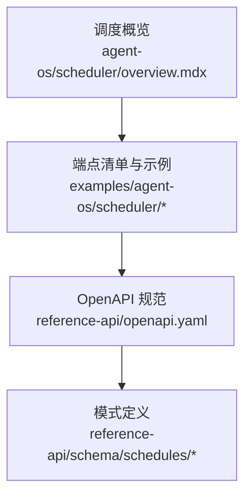
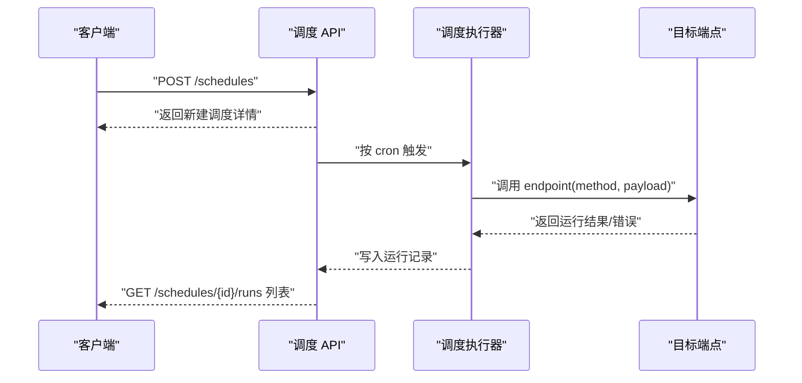
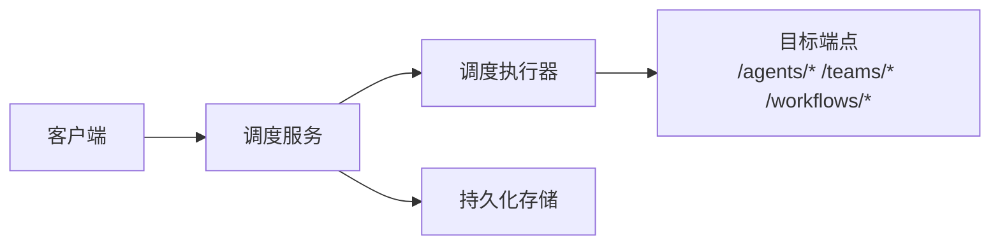

# REST API 调度

<cite>
**本文引用的文件**
- [agent-os/scheduler/overview.mdx](file://agent-os/scheduler/overview.mdx)
- [examples/agent-os/scheduler/schedule-management.mdx](file://examples/agent-os/scheduler/schedule-management.mdx)
- [examples/agent-os/scheduler/rest-api-schedules.mdx](file://examples/agent-os/scheduler/rest-api-schedules.mdx)
- [examples/agent-os/scheduler/team-workflow-schedules.mdx](file://examples/agent-os/scheduler/team-workflow-schedules.mdx)
- [reference-api/openapi.yaml](file://reference-api/openapi.yaml)
- [reference-api/schema/schedules/create-schedule.mdx](file://reference-api/schema/schedules/create-schedule.mdx)
- [reference-api/schema/schedules/list-schedules.mdx](file://reference-api/schema/schedules/list-schedules.mdx)
- [reference-api/schema/schedules/get-schedule.mdx](file://reference-api/schema/schedules/get-schedule.mdx)
- [reference-api/schema/schedules/update-schedule.mdx](file://reference-api/schema/schedules/update-schedule.mdx)
- [reference-api/schema/schedules/delete-schedule.mdx](file://reference-api/schema/schedules/delete-schedule.mdx)
- [reference-api/schema/schedules/enable-schedule.mdx](file://reference-api/schema/schedules/enable-schedule.mdx)
- [reference-api/schema/schedules/disable-schedule.mdx](file://reference-api/schema/schedules/disable-schedule.mdx)
- [reference-api/schema/schedules/trigger-schedule.mdx](file://reference-api/schema/schedules/trigger-schedule.mdx)
- [reference-api/schema/schedules/list-schedule-runs.mdx](file://reference-api/schema/schedules/list-schedule-runs.mdx)
- [reference-api/schema/schedules/get-schedule-run.mdx](file://reference-api/schema/schedules/get-schedule-run.mdx)
</cite>

## 目录
1. [简介](#简介)
2. [项目结构](#项目结构)
3. [核心组件](#核心组件)
4. [架构总览](#架构总览)
5. [详细组件分析](#详细组件分析)
6. [依赖分析](#依赖分析)
7. [性能考虑](#性能考虑)
8. [故障排查指南](#故障排查指南)
9. [结论](#结论)
10. [附录](#附录)

## 简介
本文件面向使用 AgentOS 调度能力的开发者，系统性梳理调度系统的 REST API，覆盖端点、请求/响应结构、认证与安全、错误处理、版本管理与迁移等主题，并提供从创建到删除的完整使用示例路径。

## 项目结构
调度相关文档与示例主要分布在以下位置：
- 调度概览与端点清单：agent-os/scheduler/overview.mdx
- Python 示例（HTTP 客户端调用）：examples/agent-os/scheduler/*.mdx
- OpenAPI 规范与模式：reference-api/openapi.yaml 及 reference-api/schema/schedules/*.mdx

**图表来源**
- [agent-os/scheduler/overview.mdx:83-96](file://agent-os/scheduler/overview.mdx#L83-L96)
- [examples/agent-os/scheduler/schedule-management.mdx:1-133](file://examples/agent-os/scheduler/schedule-management.mdx#L1-L133)
- [reference-api/openapi.yaml:7675-7961](file://reference-api/openapi.yaml#L7675-L7961)

**章节来源**
- [agent-os/scheduler/overview.mdx:83-96](file://agent-os/scheduler/overview.mdx#L83-L96)
- [examples/agent-os/scheduler/schedule-management.mdx:1-133](file://examples/agent-os/scheduler/schedule-management.mdx#L1-L133)
- [reference-api/openapi.yaml:7675-7961](file://reference-api/openapi.yaml#L7675-L7961)

## 核心组件
- 调度器服务：提供基于 cron 的计划任务执行、运行历史记录与管理。
- 控制平面：通过 UI 展示与操作调度配置、启停、手动触发与查看运行历史。
- REST API：统一的 HTTP 接口，支持对调度与运行进行全生命周期管理。

关键概念
- Cron 表达式：标准 5 字段语法（分钟 小时 月内日 月 周内日）
- Endpoint：仅路径（如 /agents/greeter/runs），非完整 URL
- 时区：IANA 时区字符串，默认 UTC
- 重试策略：max_retries 与 retry_delay_seconds 控制失败重试
- 运行历史：每次执行记录状态、时间、输入、输出与错误

**章节来源**
- [agent-os/scheduler/overview.mdx:73-82](file://agent-os/scheduler/overview.mdx#L73-L82)

## 架构总览
调度 API 的典型交互流程如下：

**图表来源**
- [agent-os/scheduler/overview.mdx:83-96](file://agent-os/scheduler/overview.mdx#L83-L96)
- [examples/agent-os/scheduler/rest-api-schedules.mdx:35-167](file://examples/agent-os/scheduler/rest-api-schedules.mdx#L35-L167)

## 详细组件分析

### 认证与安全
- 所有受保护端点均采用 HTTP Bearer Token 认证（Security Scheme: HTTPBearer）。调用前请确保在请求头中携带有效的 Authorization: Bearer <token>。
- 配置与健康检查等公开端点无需认证；调度相关端点需认证后方可访问。

**章节来源**
- [reference-api/openapi.yaml:137-138](file://reference-api/openapi.yaml#L137-L138)
- [reference-api/openapi.yaml:7675-7961](file://reference-api/openapi.yaml#L7675-L7961)

### 端点总览与使用场景
- 创建调度：POST /schedules
- 列表调度：GET /schedules
- 获取单个调度：GET /schedules/{schedule_id}
- 更新调度：PATCH /schedules/{schedule_id}
- 删除调度：DELETE /schedules/{schedule_id}
- 启用/禁用：POST /schedules/{schedule_id}/enable, POST /schedules/{schedule_id}/disable
- 手动触发：POST /schedules/{schedule_id}/trigger
- 查看运行历史：GET /schedules/{schedule_id}/runs
- 获取单次运行：GET /schedules/{schedule_id}/runs/{run_id}

以上端点在调度概览文档中有明确列表与图示说明。

**章节来源**
- [agent-os/scheduler/overview.mdx:83-96](file://agent-os/scheduler/overview.mdx#L83-L96)

### 数据模型与字段说明
以下为常用请求/响应字段的要点说明（以调度与运行为核心）：
- 调度对象（创建/更新/获取）
  - id: 调度唯一标识
  - name/description: 名称与描述
  - cron_expr: cron 表达式
  - endpoint: 目标端点路径（如 /agents/greeter/runs）
  - method: HTTP 方法（默认 POST）
  - payload: 请求体载荷（JSON）
  - timezone: 时区（默认 UTC）
  - max_retries/retry_delay_seconds: 失败重试次数与间隔秒数
  - enabled: 是否启用
  - next_run_at: 下次运行时间
- 运行对象（运行历史）
  - id: 运行唯一标识
  - status: 状态（如 PENDING/RUNNING/COMPLETED/ERROR）
  - attempt: 第几次尝试
  - triggered_at: 触发时间
  - started_at/ended_at: 开始/结束时间
  - input/output/error: 输入、输出与错误信息

上述字段与更多细节可参考 OpenAPI 模式文件与示例脚本。

**章节来源**
- [reference-api/schema/schedules/create-schedule.mdx:1-3](file://reference-api/schema/schedules/create-schedule.mdx#L1-L3)
- [reference-api/schema/schedules/list-schedules.mdx:1-3](file://reference-api/schema/schedules/list-schedules.mdx#L1-L3)
- [reference-api/schema/schedules/get-schedule.mdx:1-3](file://reference-api/schema/schedules/get-schedule.mdx#L1-L3)
- [reference-api/schema/schedules/update-schedule.mdx:1-3](file://reference-api/schema/schedules/update-schedule.mdx#L1-L3)
- [reference-api/schema/schedules/delete-schedule.mdx:1-3](file://reference-api/schema/schedules/delete-schedule.mdx#L1-L3)
- [reference-api/schema/schedules/enable-schedule.mdx:1-3](file://reference-api/schema/schedules/enable-schedule.mdx#L1-L3)
- [reference-api/schema/schedules/disable-schedule.mdx:1-3](file://reference-api/schema/schedules/disable-schedule.mdx#L1-L3)
- [reference-api/schema/schedules/trigger-schedule.mdx:1-3](file://reference-api/schema/schedules/trigger-schedule.mdx#L1-L3)
- [reference-api/schema/schedules/list-schedule-runs.mdx:1-3](file://reference-api/schema/schedules/list-schedule-runs.mdx#L1-L3)
- [reference-api/schema/schedules/get-schedule-run.mdx:1-3](file://reference-api/schema/schedules/get-schedule-run.mdx#L1-L3)

### API 使用示例（路径指引）
- 创建调度
  - curl 示例：见调度概览文档中的示例命令
  - Python 示例：见 schedule-management.mdx 中的 POST /schedules 调用
- 列表与查询
  - GET /schedules：见 schedule-management.mdx
  - GET /schedules/{id}：见 rest-api-schedules.mdx
- 更新与删除
  - PATCH /schedules/{id}：见 schedule-management.mdx
  - DELETE /schedules/{id}：见 schedule-management.mdx
- 启用/禁用与手动触发
  - POST /schedules/{id}/enable/disable：见 schedule-management.mdx
  - POST /schedules/{id}/trigger：见 rest-api-schedules.mdx
- 查看运行历史
  - GET /schedules/{id}/runs：见 rest-api-schedules.mdx
  - GET /schedules/{id}/runs/{run_id}：见 rest-api-schedules.mdx
- 团队与工作流调度
  - team-workflow-schedules.mdx 展示了针对团队与工作流的调度配置方式

**章节来源**
- [agent-os/scheduler/overview.mdx:39-52](file://agent-os/scheduler/overview.mdx#L39-L52)
- [examples/agent-os/scheduler/schedule-management.mdx:34-110](file://examples/agent-os/scheduler/schedule-management.mdx#L34-L110)
- [examples/agent-os/scheduler/rest-api-schedules.mdx:40-161](file://examples/agent-os/scheduler/rest-api-schedules.mdx#L40-L161)
- [examples/agent-os/scheduler/team-workflow-schedules.mdx:31-66](file://examples/agent-os/scheduler/team-workflow-schedules.mdx#L31-L66)

### 错误处理与调试
- 常见状态码
  - 200/201：成功创建或更新
  - 400：请求无效或参数缺失
  - 401：未认证或令牌无效
  - 404：资源不存在（如调度或运行）
  - 422：参数校验失败
  - 500：服务器内部错误
  - 503：触发返回服务不可用（例如执行器尚未就绪）
- 调试建议
  - 先确认认证头是否正确设置
  - 使用 GET /schedules/{id}/runs 查询最近运行记录定位问题
  - 对于手动触发 503，等待调度执行器启动后再试
  - 使用较小的 cron 表达式验证流程（如每 5 分钟）

**章节来源**
- [examples/agent-os/scheduler/rest-api-schedules.mdx:120-131](file://examples/agent-os/scheduler/rest-api-schedules.mdx#L120-L131)
- [examples/agent-os/scheduler/schedule-management.mdx:72-110](file://examples/agent-os/scheduler/schedule-management.mdx#L72-L110)

### 版本管理与迁移
- API 版本
  - 当前 OpenAPI 版本号：见 reference-api/openapi.yaml 的 info.version
- 迁移注意事项
  - 若未来版本变更字段或行为，请优先对照 OpenAPI YAML 的变更记录
  - 新增/弃用端点时，应同步更新客户端实现与集成逻辑
  - 建议在灰度环境中先行验证新版本行为

**章节来源**
- [reference-api/openapi.yaml:2-5](file://reference-api/openapi.yaml#L2-L5)

## 依赖分析
调度 API 的核心依赖关系如下：

- 客户端通过 HTTP 访问调度服务
- 调度服务根据 cron 表达式触发执行器
- 执行器调用具体目标端点（如 /agents/{id}/runs）
- 执行结果与元数据写入持久化存储，供查询与历史回溯

**图表来源**
- [agent-os/scheduler/overview.mdx:83-96](file://agent-os/scheduler/overview.mdx#L83-L96)
- [examples/agent-os/scheduler/team-workflow-schedules.mdx:31-66](file://examples/agent-os/scheduler/team-workflow-schedules.mdx#L31-L66)

**章节来源**
- [agent-os/scheduler/overview.mdx:83-96](file://agent-os/scheduler/overview.mdx#L83-L96)
- [examples/agent-os/scheduler/team-workflow-schedules.mdx:31-66](file://examples/agent-os/scheduler/team-workflow-schedules.mdx#L31-L66)

## 性能考虑
- cron 粒度与负载：合理设置 cron 表达式，避免高并发触发导致瞬时压力
- 重试策略：max_retries 与 retry_delay_seconds 应结合目标端点的稳定性调整
- 运行历史分页：列表运行历史时使用 limit/page 参数控制返回量
- 并发与限流：在网关或反向代理层配置速率限制，防止滥用

[本节为通用指导，不直接分析具体文件]

## 故障排查指南
- 无法认证
  - 确认 Authorization 头是否为 Bearer Token
  - 检查令牌有效期与权限范围
- 触发失败或 503
  - 等待调度执行器启动后重试
  - 检查目标端点是否可达
- 查询不到运行记录
  - 确认调度已启用且至少触发过一次
  - 使用 GET /schedules/{id}/runs 并传入 limit/page
- 删除后仍可查询
  - 确认 DELETE 返回 200/204，随后 GET 应返回 404

**章节来源**
- [examples/agent-os/scheduler/schedule-management.mdx:104-110](file://examples/agent-os/scheduler/schedule-management.mdx#L104-L110)
- [examples/agent-os/scheduler/rest-api-schedules.mdx:154-161](file://examples/agent-os/scheduler/rest-api-schedules.mdx#L154-L161)

## 结论
调度 REST API 提供了从创建、启停、手动触发到运行历史查询的完整闭环。配合 HTTP Bearer 认证与 OpenAPI 规范，可快速构建稳定可靠的自动化执行体系。建议在生产环境遵循重试策略、限流与监控最佳实践，并通过 OpenAPI 版本与迁移指引保障长期演进。

[本节为总结性内容，不直接分析具体文件]

## 附录

### 端点与方法速查
- POST /schedules：创建调度
- GET /schedules：列出调度
- GET /schedules/{schedule_id}：获取调度详情
- PATCH /schedules/{schedule_id}：更新调度
- DELETE /schedules/{schedule_id}：删除调度
- POST /schedules/{schedule_id}/enable：启用调度
- POST /schedules/{schedule_id}/disable：禁用调度
- POST /schedules/{schedule_id}/trigger：手动触发
- GET /schedules/{schedule_id}/runs：列出运行历史
- GET /schedules/{schedule_id}/runs/{run_id}：获取单次运行

**章节来源**
- [agent-os/scheduler/overview.mdx:83-96](file://agent-os/scheduler/overview.mdx#L83-L96)