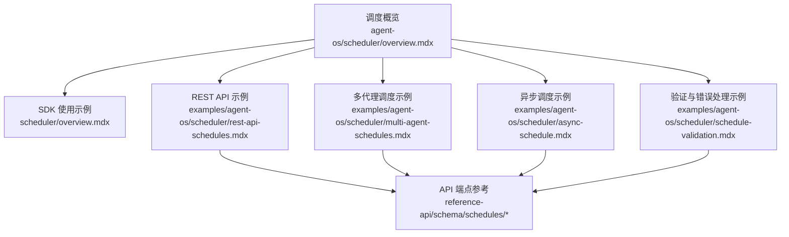
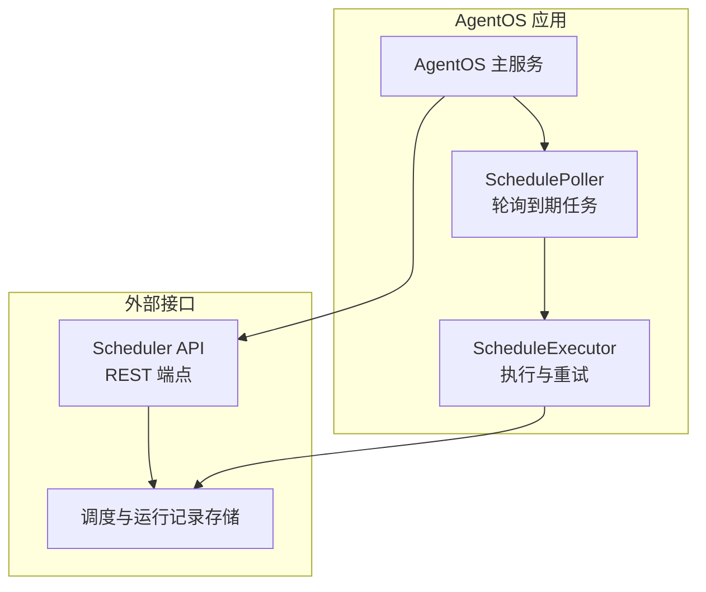
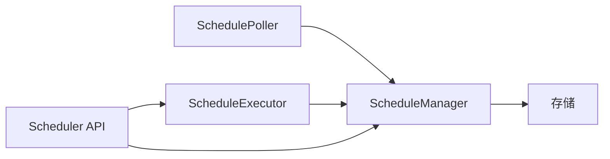

# 基础调度

<cite>
**本文引用的文件**
- [agent-os/scheduler/overview.mdx](file://agent-os/scheduler/overview.mdx)
- [scheduler/overview.mdx](file://scheduler/overview.mdx)
- [examples/agent-os/scheduler/basic-schedule.mdx](file://examples/agent-os/scheduler/basic-schedule.mdx)
- [examples/agent-os/scheduler/schedule-management.mdx](file://examples/agent-os/scheduler/schedule-management.mdx)
- [examples/agent-os/scheduler/rest-api-schedules.mdx](file://examples/agent-os/scheduler/rest-api-schedules.mdx)
- [examples/agent-os/scheduler/multi-agent-schedules.mdx](file://examples/agent-os/scheduler/multi-agent-schedules.mdx)
- [examples/agent-os/scheduler/async-schedule.mdx](file://examples/agent-os/scheduler/async-schedule.mdx)
- [examples/agent-os/scheduler/schedule-validation.mdx](file://examples/agent-os/scheduler/schedule-validation.mdx)
- [reference-api/schema/schedules/create-schedule.mdx](file://reference-api/schema/schedules/create-schedule.mdx)
- [reference-api/schema/schedules/list-schedules.mdx](file://reference-api/schema/schedules/list-schedules.mdx)
- [reference-api/schema/schedules/get-schedule.mdx](file://reference-api/schema/schedules/get-schedule.mdx)
- [reference-api/schema/schedules/update-schedule.mdx](file://reference-api/schema/schedules/update-schedule.mdx)
- [reference-api/schema/schedules/enable-schedule.mdx](file://reference-api/schema/schedules/enable-schedule.mdx)
- [reference-api/schema/schedules/disable-schedule.mdx](file://reference-api/schema/schedules/disable-schedule.mdx)
- [reference-api/schema/schedules/delete-schedule.mdx](file://reference-api/schema/schedules/delete-schedule.mdx)
- [reference-api/schema/schedules/trigger-schedule.mdx](file://reference-api/schema/schedules/trigger-schedule.mdx)
- [reference-api/schema/schedules/list-schedule-runs.mdx](file://reference-api/schema/schedules/list-schedule-runs.mdx)
</cite>

## 目录
1. [简介](#简介)
2. [项目结构](#项目结构)
3. [核心组件](#核心组件)
4. [架构总览](#架构总览)
5. [详细组件分析](#详细组件分析)
6. [依赖关系分析](#依赖关系分析)
7. [性能考量](#性能考量)
8. [故障排查指南](#故障排查指南)
9. [结论](#结论)
10. [附录](#附录)

## 简介
本篇“基础调度”文档面向需要在 AgentOS 中创建与管理定时任务（Cron 调度）的用户，覆盖从安装、配置到运行与维护的全流程。内容包括：
- 如何通过 SDK 与 REST API 创建与管理调度
- Cron 表达式语法与常见配置项说明
- 通过 API 与 UI 的创建示例
- 调度参数详解：时间间隔、执行命令、负载数据、重试与超时等
- 常见调度场景与最佳实践

## 项目结构
围绕调度功能的相关文档与示例主要分布在以下位置：
- 概览与使用说明：agent-os/scheduler/overview.mdx、scheduler/overview.mdx
- 示例：basic-schedule、schedule-management、rest-api-schedules、multi-agent-schedules、async-schedule、schedule-validation
- API 参考：reference-api/schema/schedules 下各端点的 OpenAPI 标记文件

**图表来源**
- [agent-os/scheduler/overview.mdx:1-105](file://agent-os/scheduler/overview.mdx#L1-L105)
- [scheduler/overview.mdx:1-121](file://scheduler/overview.mdx#L1-L121)
- [examples/agent-os/scheduler/rest-api-schedules.mdx:1-182](file://examples/agent-os/scheduler/rest-api-schedules.mdx#L1-L182)
- [examples/agent-os/scheduler/multi-agent-schedules.mdx:1-134](file://examples/agent-os/scheduler/multi-agent-schedules.mdx#L1-L134)
- [examples/agent-os/scheduler/async-schedule.mdx:1-99](file://examples/agent-os/scheduler/async-schedule.mdx#L1-L99)
- [examples/agent-os/scheduler/schedule-validation.mdx:1-115](file://examples/agent-os/scheduler/schedule-validation.mdx#L1-L115)
- [reference-api/schema/schedules/create-schedule.mdx:1-3](file://reference-api/schema/schedules/create-schedule.mdx#L1-L3)

**章节来源**
- [agent-os/scheduler/overview.mdx:1-105](file://agent-os/scheduler/overview.mdx#L1-L105)
- [scheduler/overview.mdx:1-121](file://scheduler/overview.mdx#L1-L121)

## 核心组件
- ScheduleManager：用于创建、查询、更新、启用/禁用、删除调度以及查看运行历史的 SDK 接口。
- SchedulePoller：按固定轮询间隔“认领”到期的调度并并发执行。
- ScheduleExecutor：调用调度目标端点、处理重试与写入运行记录。
- Scheduler API：提供 REST 端点以完成调度生命周期管理与手动触发。

关键行为与默认值（来自文档汇总）：
- Cron 格式：标准 5 字段语法（分钟 小时 月内日 月 星期），支持范围、步进与列表。
- Endpoint：仅路径（例如 /agents/greeter/runs），非完整 URL。
- Timezone：IANA 时区字符串，默认 UTC。
- 方法：GET/POST/PUT/PATCH/DELETE，默认 POST。
- 超时与重试：timeout_seconds 默认 3600；max_retries 默认 0；retry_delay_seconds 默认 60。
- 验证：SDK 抛出 ValueError，API 返回 422；重复名称可通过 if_exists 控制策略。

**章节来源**
- [agent-os/scheduler/overview.mdx:80-120](file://agent-os/scheduler/overview.mdx#L80-L120)
- [scheduler/overview.mdx:80-121](file://scheduler/overview.mdx#L80-L121)

## 架构总览
下图展示了调度系统在 AgentOS 中的运行方式：应用启动后启用调度轮询，SchedulePoller 定期检查到期任务，ScheduleExecutor 调用目标端点并记录运行结果。

**图表来源**
- [agent-os/scheduler/overview.mdx:80-120](file://agent-os/scheduler/overview.mdx#L80-L120)
- [scheduler/overview.mdx:80-121](file://scheduler/overview.mdx#L80-L121)

## 详细组件分析

### 1) Cron 表达式语法与配置
- 语法：标准 5 字段（分钟 小时 月内日 月 星期），支持以下特性：
  - 数值：精确时间点
  - 范围：如 9-17
  - 步进：如 */15（每 15 分钟）
  - 列表：如 1-5（周一至周五）
- 常见示例（来自示例与概览）：
  - 每 5 分钟：*/5 * * * *
  - 每小时整点：0 * * * *
  - 工作日 9-17 点：0 9-17 * * 1-5
  - 每月 1 日 午夜：0 0 1 * *

- 配置项要点：
  - cron_expr：Cron 表达式
  - timezone：时区（IANA）
  - method：HTTP 方法（GET/POST/PUT/PATCH/DELETE）
  - payload：请求负载（JSON）
  - max_retries、retry_delay_seconds、timeout_seconds：重试与超时控制

**章节来源**
- [agent-os/scheduler/overview.mdx:73-120](file://agent-os/scheduler/overview.mdx#L73-L120)
- [scheduler/overview.mdx:89-121](file://scheduler/overview.mdx#L89-L121)
- [examples/agent-os/scheduler/multi-agent-schedules.mdx:34-70](file://examples/agent-os/scheduler/multi-agent-schedules.mdx#L34-L70)

### 2) 通过 SDK 创建与管理调度
- SDK 入门示例展示了如何创建 ScheduleManager 并创建调度，包含 timezone、max_retries、retry_delay_seconds 等参数。
- 支持列出启用中的调度、禁用/启用、查看下次运行时间等操作。

**章节来源**
- [scheduler/overview.mdx:12-33](file://scheduler/overview.mdx#L12-L33)

### 3) 通过 REST API 创建与管理调度
- 端点清单（来自概览与参考）：
  - POST /schedules：创建
  - GET /schedules：列表
  - GET /schedules/{schedule_id}：详情
  - PATCH /schedules/{schedule_id}：更新
  - DELETE /schedules/{schedule_id}：删除
  - POST /schedules/{schedule_id}/enable：启用
  - POST /schedules/{schedule_id}/disable：禁用
  - POST /schedules/{schedule_id}/trigger：手动触发
  - GET /schedules/{schedule_id}/runs：运行历史

- 示例脚本演示了从创建到删除的完整流程，并包含更新、禁用/启用、手动触发与查看运行历史。

**章节来源**
- [agent-os/scheduler/overview.mdx:83-96](file://agent-os/scheduler/overview.mdx#L83-L96)
- [examples/agent-os/scheduler/schedule-management.mdx:34-110](file://examples/agent-os/scheduler/schedule-management.mdx#L34-L110)
- [examples/agent-os/scheduler/rest-api-schedules.mdx:35-167](file://examples/agent-os/scheduler/rest-api-schedules.mdx#L35-L167)

### 4) 通过 UI 创建调度
- 文档提供了 UI 截图与说明，展示在 AgentOS 控制面板中创建、编辑、启用/禁用、手动触发与查看运行历史的流程。

**章节来源**
- [agent-os/scheduler/overview.mdx:54-71](file://agent-os/scheduler/overview.mdx#L54-L71)

### 5) 多代理与复杂场景示例
- 多代理调度示例展示了不同代理使用不同的 Cron、时区与负载，并配置重试与超时，适合生产环境的可靠性需求。
- 异步调度示例展示了异步 SDK 操作（acreate/aupdate/aenable/adisable/aget_runs 等）。

**章节来源**
- [examples/agent-os/scheduler/multi-agent-schedules.mdx:32-72](file://examples/agent-os/scheduler/multi-agent-schedules.mdx#L32-L72)
- [examples/agent-os/scheduler/async-schedule.mdx:40-81](file://examples/agent-os/scheduler/async-schedule.mdx#L40-L81)

### 6) 调度参数详解与最佳实践
- 参数说明（默认值与取值范围来自概览）：
  - method：默认 POST，可选 GET/POST/PUT/PATCH/DELETE
  - timezone：默认 UTC，需为有效 IANA 时区
  - timeout_seconds：默认 3600，影响请求与轮询超时
  - max_retries：默认 0，失败后是否重试
  - retry_delay_seconds：默认 60，两次重试之间的延迟
- 最佳实践：
  - 对关键任务设置合理的 max_retries 与 retry_delay_seconds
  - 使用 timezone 明确业务时区，避免夏令时与跨时区问题
  - 在 payload 中传递最小必要信息，便于审计与调试
  - 对高频任务（如每分钟）谨慎设置超时与重试，避免资源争用

**章节来源**
- [agent-os/scheduler/overview.mdx:89-108](file://agent-os/scheduler/overview.mdx#L89-L108)
- [scheduler/overview.mdx:89-108](file://scheduler/overview.mdx#L89-L108)

### 7) Cron 验证与错误处理
- SDK 侧会校验 cron 与 timezone，非法输入抛出 ValueError；API 侧返回 422。
- 支持重复名称策略（raise/skip/update），便于幂等创建。
- 示例覆盖无效 cron、无效时区、重复名称、复杂表达式与方法自动大写化。

**章节来源**
- [examples/agent-os/scheduler/schedule-validation.mdx:27-101](file://examples/agent-os/scheduler/schedule-validation.mdx#L27-L101)
- [agent-os/scheduler/overview.mdx:105-106](file://agent-os/scheduler/overview.mdx#L105-L106)

### 8) API 请求与响应参考
- 各端点的 OpenAPI 标记文件可用于生成客户端或进行契约测试：
  - 创建：post /schedules
  - 列表：get /schedules
  - 详情：get /schedules/{schedule_id}
  - 更新：patch /schedules/{schedule_id}
  - 删除：delete /schedules/{schedule_id}
  - 启用：post /schedules/{schedule_id}/enable
  - 禁用：post /schedules/{schedule_id}/disable
  - 触发：post /schedules/{schedule_id}/trigger
  - 运行历史：get /schedules/{schedule_id}/runs

**章节来源**
- [reference-api/schema/schedules/create-schedule.mdx:1-3](file://reference-api/schema/schedules/create-schedule.mdx#L1-L3)
- [reference-api/schema/schedules/list-schedules.mdx:1-3](file://reference-api/schema/schedules/list-schedules.mdx#L1-L3)
- [reference-api/schema/schedules/get-schedule.mdx:1-3](file://reference-api/schema/schedules/get-schedule.mdx#L1-L3)
- [reference-api/schema/schedules/update-schedule.mdx:1-3](file://reference-api/schema/schedules/update-schedule.mdx#L1-L3)
- [reference-api/schema/schedules/enable-schedule.mdx:1-3](file://reference-api/schema/schedules/enable-schedule.mdx#L1-L3)
- [reference-api/schema/schedules/disable-schedule.mdx:1-3](file://reference-api/schema/schedules/disable-schedule.mdx#L1-L3)
- [reference-api/schema/schedules/delete-schedule.mdx:1-3](file://reference-api/schema/schedules/delete-schedule.mdx#L1-L3)
- [reference-api/schema/schedules/trigger-schedule.mdx:1-3](file://reference-api/schema/schedules/trigger-schedule.mdx#L1-L3)
- [reference-api/schema/schedules/list-schedule-runs.mdx:1-3](file://reference-api/schema/schedules/list-schedule-runs.mdx#L1-L3)

## 依赖关系分析
- 组件耦合：
  - ScheduleManager 与数据库交互，负责调度元数据与运行记录持久化
  - SchedulePoller 依赖 ScheduleManager 查询到期任务
  - ScheduleExecutor 依赖 HTTP 客户端调用目标端点
  - Scheduler API 作为入口，统一暴露 CRUD、启停、触发与历史查询
- 外部依赖：
  - 时区解析依赖 IANA 时区数据库
  - Cron 解析依赖标准库或第三方库（由实现决定）

**图表来源**
- [agent-os/scheduler/overview.mdx:80-120](file://agent-os/scheduler/overview.mdx#L80-L120)
- [scheduler/overview.mdx:80-121](file://scheduler/overview.mdx#L80-L121)

**章节来源**
- [agent-os/scheduler/overview.mdx:80-120](file://agent-os/scheduler/overview.mdx#L80-L120)
- [scheduler/overview.mdx:80-121](file://scheduler/overview.mdx#L80-L121)

## 性能考量
- 轮询间隔：根据任务数量与频率调整 scheduler_poll_interval，避免过密导致 CPU 压力。
- 并发执行：SchedulePoller 并发执行到期任务，注意目标端点的吞吐能力与限流策略。
- 超时与重试：合理设置 timeout_seconds 与 retry_delay_seconds，防止长时间阻塞与级联失败。
- 数据库压力：批量操作（如大量创建/删除）建议分批进行，避免一次性写入高峰。

## 故障排查指南
- 常见错误与定位：
  - 422 错误：Cron 或时区不合法（API 层）
  - ValueError：Cron 或时区不合法（SDK 层）
  - 重复名称：根据 if_exists 策略选择 raise/skip/update
- 排查步骤：
  - 使用 GET /schedules/{id} 核对 cron_expr、timezone、method、payload 是否正确
  - 使用 GET /schedules/{id}/runs 查看最近运行状态与错误信息
  - 手动触发 POST /schedules/{id}/trigger 验证端点可用性
  - 检查 AgentOS 日志与调度轮询间隔配置

**章节来源**
- [examples/agent-os/scheduler/schedule-validation.mdx:27-57](file://examples/agent-os/scheduler/schedule-validation.mdx#L27-L57)
- [examples/agent-os/scheduler/rest-api-schedules.mdx:120-131](file://examples/agent-os/scheduler/rest-api-schedules.mdx#L120-L131)

## 结论
通过 SDK 与 REST API，结合 AgentOS 的调度组件，用户可以快速构建稳定可靠的定时任务体系。建议在生产环境中：
- 明确时区与时钟同步策略
- 为关键任务配置重试与超时
- 使用 UI 与 API 双通道进行日常运维
- 借助运行历史与日志持续优化调度策略

## 附录

### A. 快速开始：通过 REST API 创建第一个调度
- 启动示例服务（来自示例）：
  - 使用示例脚本启动 AgentOS 服务
- 创建调度（来自示例）：
  - 使用 curl 或任意 HTTP 客户端向 POST /schedules 发送 JSON 负载，包含 name、cron_expr、endpoint、payload、timezone、max_retries、retry_delay_seconds 等字段

**章节来源**
- [examples/agent-os/scheduler/basic-schedule.mdx:21-28](file://examples/agent-os/scheduler/basic-schedule.mdx#L21-L28)
- [agent-os/scheduler/overview.mdx:39-52](file://agent-os/scheduler/overview.mdx#L39-L52)

### B. 常见调度场景与建议
- 每 5 分钟问候：*/5 * * * *，payload 包含问候语
- 每小时整点汇报：0 * * * *，携带统计摘要
- 工作日早间报告：0 9 * * 1-5，时区设为业务所在地区
- 每 15 分钟健康检查：*/15 * * * *，配置 max_retries 与 retry_delay_seconds 提升稳定性

**章节来源**
- [examples/agent-os/scheduler/multi-agent-schedules.mdx:34-70](file://examples/agent-os/scheduler/multi-agent-schedules.mdx#L34-L70)