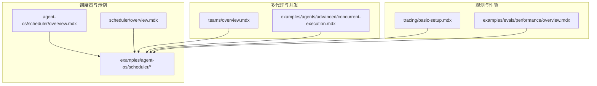
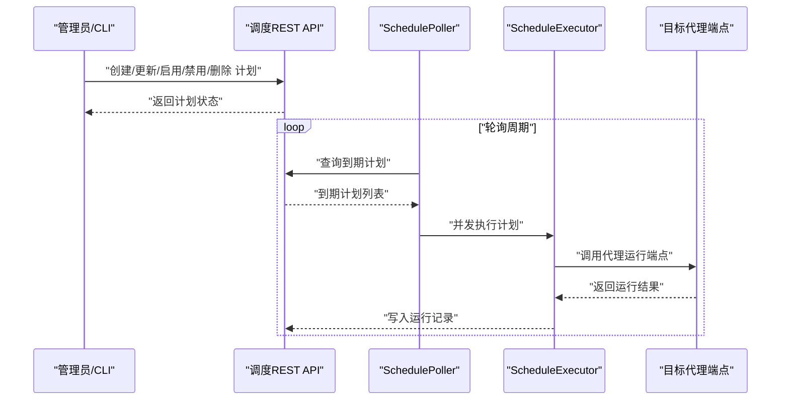
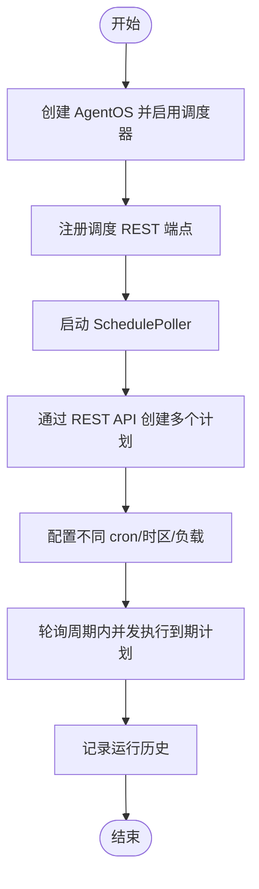
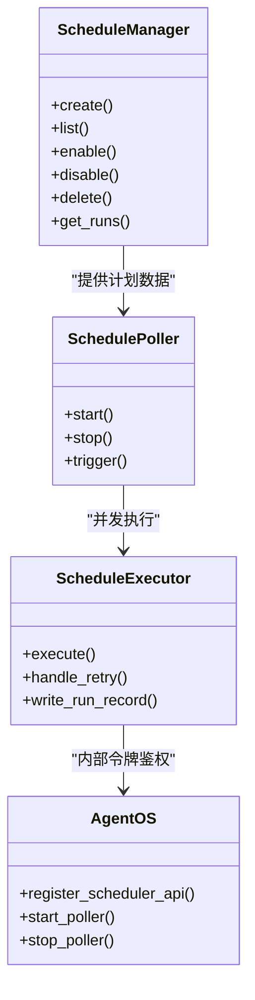
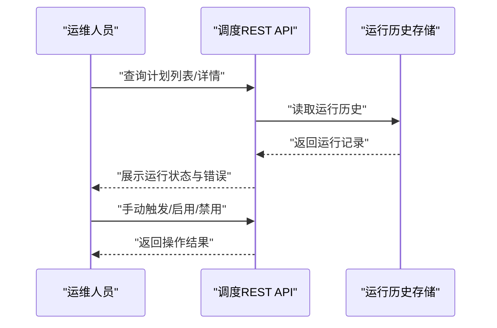

# 多代理调度

<cite>
**本文引用的文件**
- [agent-os/scheduler/overview.mdx](file://agent-os/scheduler/overview.mdx)
- [scheduler/overview.mdx](file://scheduler/overview.mdx)
- [examples/agent-os/scheduler/multi-agent-schedules.mdx](file://examples/agent-os/scheduler/multi-agent-schedules.mdx)
- [examples/agent-os/scheduler/scheduler-with-agentos.mdx](file://examples/agent-os/scheduler/scheduler-with-agentos.mdx)
- [examples/agent-os/scheduler/basic-schedule.mdx](file://examples/agent-os/scheduler/basic-schedule.mdx)
- [examples/agent-os/scheduler/schedule-management.mdx](file://examples/agent-os/scheduler/schedule-management.mdx)
- [examples/agent-os/scheduler/run-history.mdx](file://examples/agent-os/scheduler/run-history.mdx)
- [examples/agent-os/scheduler/schedule-validation.mdx](file://examples/agent-os/scheduler/schedule-validation.mdx)
- [examples/agent-os/scheduler/overview.mdx](file://examples/agent-os/scheduler/overview.mdx)
- [teams/overview.mdx](file://teams/overview.mdx)
- [examples/agents/advanced/concurrent-execution.mdx](file://examples/agents/advanced/concurrent-execution.mdx)
- [tracing/basic-setup.mdx](file://tracing/basic-setup.mdx)
- [examples/evals/performance/overview.mdx](file://examples/evals/performance/overview.mdx)
</cite>

## 目录
1. [简介](#简介)
2. [项目结构](#项目结构)
3. [核心组件](#核心组件)
4. [架构总览](#架构总览)
5. [详细组件分析](#详细组件分析)
6. [依赖关系分析](#依赖关系分析)
7. [性能考量](#性能考量)
8. [故障排查指南](#故障排查指南)
9. [结论](#结论)
10. [附录](#附录)

## 简介
本文件面向需要在多代理系统中进行定时调度的用户，系统性讲解如何通过 AgentOS 的调度器实现“多代理并发执行 + 协调 + 资源分配”的完整方案。内容涵盖：
- 多代理调度的配置与最佳实践
- 如何避免代理间冲突与竞争
- 运行状态跟踪与性能优化
- 复杂调度场景（如不同周期、时区、重试策略）的解决方案
- 常见问题与排障方法

## 项目结构
围绕多代理调度，仓库提供了从 SDK 到 AgentOS 集成、REST API 生命周期管理、运行历史查看、验证与错误处理等完整的示例与参考文档。

图示来源
- [agent-os/scheduler/overview.mdx](file://agent-os/scheduler/overview.mdx)
- [scheduler/overview.mdx](file://scheduler/overview.mdx)
- [examples/agent-os/scheduler/overview.mdx](file://examples/agent-os/scheduler/overview.mdx)
- [teams/overview.mdx](file://teams/overview.mdx)
- [examples/agents/advanced/concurrent-execution.mdx](file://examples/agents/advanced/concurrent-execution.mdx)
- [tracing/basic-setup.mdx](file://tracing/basic-setup.mdx)
- [examples/evals/performance/overview.mdx](file://examples/evals/performance/overview.mdx)

章节来源
- [agent-os/scheduler/overview.mdx](file://agent-os/scheduler/overview.mdx)
- [scheduler/overview.mdx](file://scheduler/overview.mdx)
- [examples/agent-os/scheduler/overview.mdx](file://examples/agent-os/scheduler/overview.mdx)

## 核心组件
- 调度管理器：负责创建、列出、更新、启用/禁用、删除计划以及查询运行历史。
- 轮询器：按固定间隔轮询到期计划并并发执行。
- 执行器：调用目标端点、处理重试、记录运行结果。
- REST API：提供计划生命周期管理与手动触发接口。
- AgentOS 集成：在应用启动时自动注册调度 REST 端点、启动轮询器，并生成内部服务令牌用于调度器与代理之间的鉴权。

章节来源
- [scheduler/overview.mdx](file://scheduler/overview.mdx)
- [agent-os/scheduler/overview.mdx](file://agent-os/scheduler/overview.mdx)

## 架构总览
下图展示了多代理调度在 AgentOS 中的整体交互流程：调度器通过 REST API 接收计划，轮询器发现到期计划后并发触发对应代理的运行端点，执行器负责请求转发、重试与运行记录写入。

图示来源
- [scheduler/overview.mdx](file://scheduler/overview.mdx)
- [examples/agent-os/scheduler/scheduler-with-agentos.mdx](file://examples/agent-os/scheduler/scheduler-with-agentos.mdx)

## 详细组件分析

### 多代理调度配置与最佳实践
- 不同代理、不同周期、时区与负载
  - 示例演示了三个不同角色的代理分别设置不同的 cron 表达式、时区与负载，以满足差异化业务节奏。
  - 参考路径：[多代理示例脚本](file://examples/agent-os/scheduler/multi-agent-schedules.mdx)
- AgentOS 内置轮询与鉴权
  - 在 AgentOS 中开启调度器后，自动注册 REST 端点、启动轮询器并在关闭时停止；内部服务令牌用于调度器与代理端点之间的鉴权。
  - 参考路径：[AgentOS 集成示例](file://examples/agent-os/scheduler/scheduler-with-agentos.mdx)
- 基础最小化示例
  - 启动一个带调度器的 AgentOS，随后通过 REST API 创建每 5 分钟触发一次的计划。
  - 参考路径：[基础调度示例](file://examples/agent-os/scheduler/basic-schedule.mdx)

图示来源
- [examples/agent-os/scheduler/scheduler-with-agentos.mdx](file://examples/agent-os/scheduler/scheduler-with-agentos.mdx)
- [examples/agent-os/scheduler/multi-agent-schedules.mdx](file://examples/agent-os/scheduler/multi-agent-schedules.mdx)
- [examples/agent-os/scheduler/basic-schedule.mdx](file://examples/agent-os/scheduler/basic-schedule.mdx)

章节来源
- [examples/agent-os/scheduler/multi-agent-schedules.mdx](file://examples/agent-os/scheduler/multi-agent-schedules.mdx)
- [examples/agent-os/scheduler/scheduler-with-agentos.mdx](file://examples/agent-os/scheduler/scheduler-with-agentos.mdx)
- [examples/agent-os/scheduler/basic-schedule.mdx](file://examples/agent-os/scheduler/basic-schedule.mdx)

### 代理间协调与资源分配
- 任务拆分与专业化
  - 团队模式鼓励将复杂任务拆分为多个专业代理，减少单体代理的上下文压力与成本。
  - 参考路径：[团队概述](file://teams/overview.mdx)
- 并发执行与隔离
  - 轮询器支持并发执行到期计划，避免代理间互相阻塞；建议为高负载代理预留独立资源或使用不同 cron 避免同时高峰。
  - 参考路径：[并发执行示例](file://examples/agents/advanced/concurrent-execution.mdx)
- 资源隔离与超时控制
  - 为每个计划配置合理的超时时间与重试参数，防止长耗时任务拖垮整体调度吞吐。
  - 参考字段：[调度字段定义](file://scheduler/overview.mdx)

图示来源
- [scheduler/overview.mdx](file://scheduler/overview.mdx)
- [examples/agent-os/scheduler/scheduler-with-agentos.mdx](file://examples/agent-os/scheduler/scheduler-with-agentos.mdx)

章节来源
- [teams/overview.mdx](file://teams/overview.mdx)
- [examples/agents/advanced/concurrent-execution.mdx](file://examples/agents/advanced/concurrent-execution.mdx)
- [scheduler/overview.mdx](file://scheduler/overview.mdx)

### 避免冲突与竞争
- 使用不重叠的 cron 时间窗
  - 将不同代理的触发时间错开，避免同一时刻大量并发请求导致资源争抢。
- 合理设置重试与超时
  - 对易失败的任务增加重试次数与延迟，同时设置超时避免长时间占用资源。
- 时区统一与本地化
  - 统一使用 IANA 时区字符串，确保跨地区部署的一致性。
- 参考路径：[调度验证与错误处理](file://examples/agent-os/scheduler/schedule-validation.mdx)

章节来源
- [examples/agent-os/scheduler/schedule-validation.mdx](file://examples/agent-os/scheduler/schedule-validation.mdx)
- [scheduler/overview.mdx](file://scheduler/overview.mdx)

### 监控与管理
- 运行历史与状态追踪
  - 通过运行历史接口查看每次尝试的状态、错误、耗时与会话信息，便于定位失败原因。
  - 参考路径：[运行历史示例](file://examples/agent-os/scheduler/run-history.mdx)
- 计划生命周期管理
  - 支持创建、列出、更新、启用/禁用、手动触发与删除，便于运维与应急处置。
  - 参考路径：[计划管理示例](file://examples/agent-os/scheduler/schedule-management.mdx)
- 观测与链路追踪
  - 结合链路追踪工具对调度与代理执行进行端到端观测，快速定位瓶颈。
  - 参考路径：[基础追踪设置](file://tracing/basic-setup.mdx)

图示来源
- [examples/agent-os/scheduler/schedule-management.mdx](file://examples/agent-os/scheduler/schedule-management.mdx)
- [examples/agent-os/scheduler/run-history.mdx](file://examples/agent-os/scheduler/run-history.mdx)

章节来源
- [examples/agent-os/scheduler/schedule-management.mdx](file://examples/agent-os/scheduler/schedule-management.mdx)
- [examples/agent-os/scheduler/run-history.mdx](file://examples/agent-os/scheduler/run-history.mdx)
- [tracing/basic-setup.mdx](file://tracing/basic-setup.mdx)

### 复杂调度场景与解决方案
- 多时区混合调度
  - 为不同地域代理设置本地时区，避免跨时区带来的执行偏差。
- 动态负载与弹性扩缩容
  - 通过调整计划数量与 cron 策略，配合外部资源编排实现弹性扩容。
- 失败恢复与幂等设计
  - 对代理端点进行幂等设计，结合重试与去重机制，保证重复触发不会产生副作用。
- 参考路径：[多代理示例](file://examples/agent-os/scheduler/multi-agent-schedules.mdx)

章节来源
- [examples/agent-os/scheduler/multi-agent-schedules.mdx](file://examples/agent-os/scheduler/multi-agent-schedules.mdx)

## 依赖关系分析
- 组件耦合
  - ScheduleManager 与 SchedulePoller 解耦，便于独立扩展与替换。
  - ScheduleExecutor 仅依赖 AgentOS 内部服务令牌与代理端点，降低对外部系统的耦合。
- 外部依赖
  - 数据库用于持久化计划与运行历史。
  - REST API 提供统一的外部接入面。
- 潜在循环依赖
  - 当前结构清晰，未见循环依赖迹象。

图示来源
- [scheduler/overview.mdx](file://scheduler/overview.mdx)
- [examples/agent-os/scheduler/scheduler-with-agentos.mdx](file://examples/agent-os/scheduler/scheduler-with-agentos.mdx)

章节来源
- [scheduler/overview.mdx](file://scheduler/overview.mdx)
- [examples/agent-os/scheduler/scheduler-with-agentos.mdx](file://examples/agent-os/scheduler/scheduler-with-agentos.mdx)

## 性能考量
- 并发策略
  - 轮询器并发执行到期计划，建议根据代理能力与资源上限合理配置并发度，避免过载。
- 超时与重试
  - 为每个计划设置合适的超时与重试参数，平衡可靠性与资源占用。
- 观测与评估
  - 使用性能评估工具对代理与团队执行进行基准测试与内存增长跟踪，持续优化。
  - 参考路径：[性能评估概览](file://examples/evals/performance/overview.mdx)

章节来源
- [scheduler/overview.mdx](file://scheduler/overview.mdx)
- [examples/evals/performance/overview.mdx](file://examples/evals/performance/overview.mdx)

## 故障排查指南
- 常见问题
  - 无效 cron 或时区：SDK 抛出异常，API 返回校验错误。
  - 重复计划名称：可通过覆盖策略解决。
  - 手动触发返回 503：表示执行器尚未就绪，稍后再试。
- 定位手段
  - 查看运行历史中的状态、错误码与错误信息。
  - 使用 REST API 获取计划详情与最近运行记录。
- 参考路径
  - [调度验证与错误处理](file://examples/agent-os/scheduler/schedule-validation.mdx)
  - [运行历史示例](file://examples/agent-os/scheduler/run-history.mdx)
  - [计划管理示例](file://examples/agent-os/scheduler/schedule-management.mdx)

章节来源
- [examples/agent-os/scheduler/schedule-validation.mdx](file://examples/agent-os/scheduler/schedule-validation.mdx)
- [examples/agent-os/scheduler/run-history.mdx](file://examples/agent-os/scheduler/run-history.mdx)
- [examples/agent-os/scheduler/schedule-management.mdx](file://examples/agent-os/scheduler/schedule-management.mdx)

## 结论
通过 AgentOS 调度器，可以以极低的集成成本实现“多代理并发调度 + 协调 + 资源分配”。关键在于：
- 明确任务拆分与专业化，合理规划不同代理的职责与时序
- 使用不重叠的 cron 时间窗与合理的重试/超时策略
- 借助运行历史与 REST API 实现可观测与可运维
- 结合链路追踪与性能评估持续优化

## 附录
- 快速上手
  - 启动带调度器的 AgentOS，创建第一个计划并观察运行历史。
  - 参考路径：[基础调度示例](file://examples/agent-os/scheduler/basic-schedule.mdx)
- 更多示例
  - 多代理调度、计划管理、运行历史、验证与错误处理等示例集合。
  - 参考路径：[调度示例索引](file://examples/agent-os/scheduler/overview.mdx)