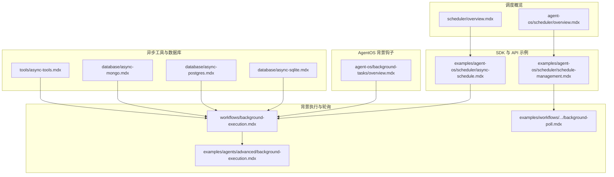
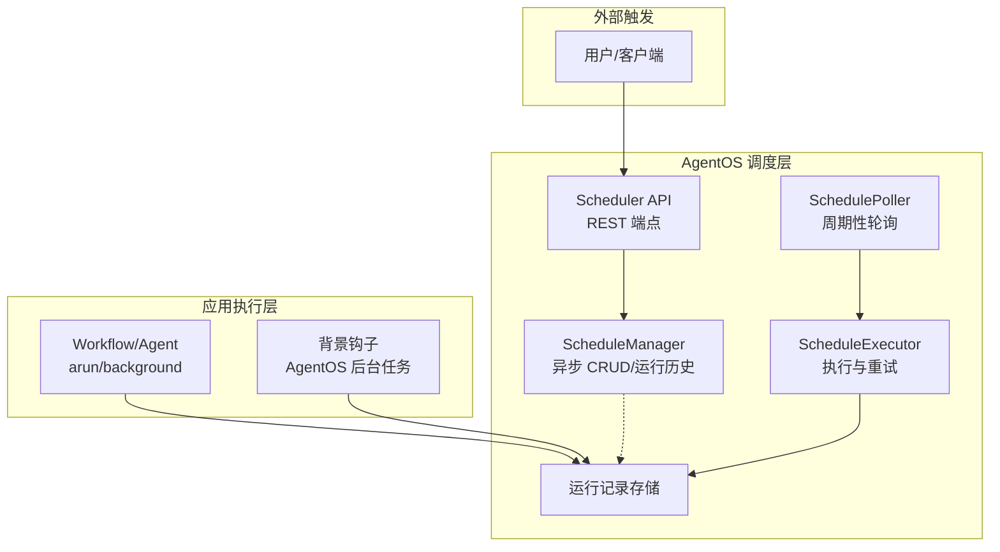
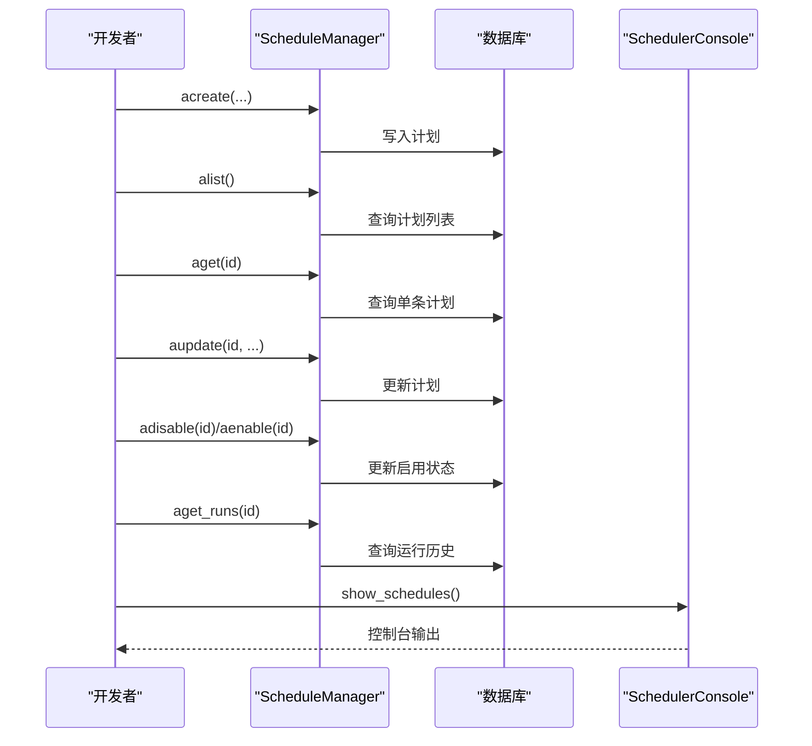
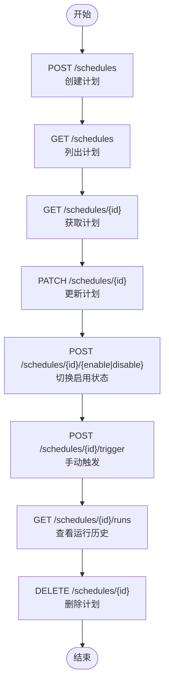
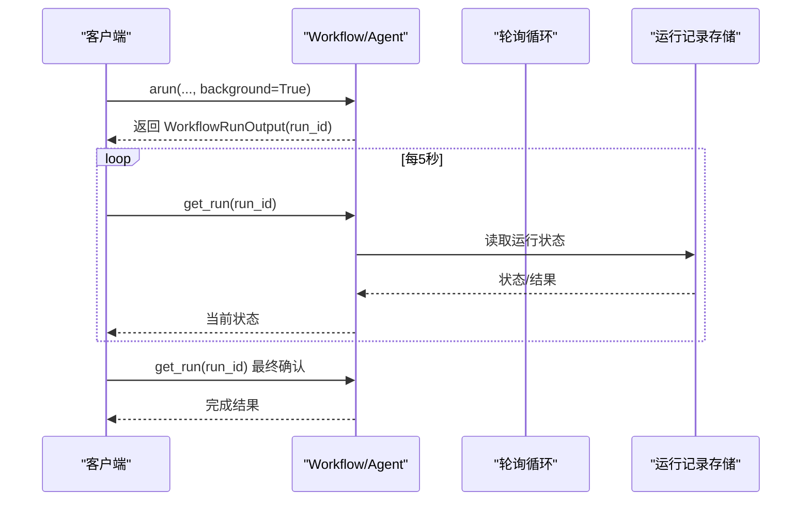
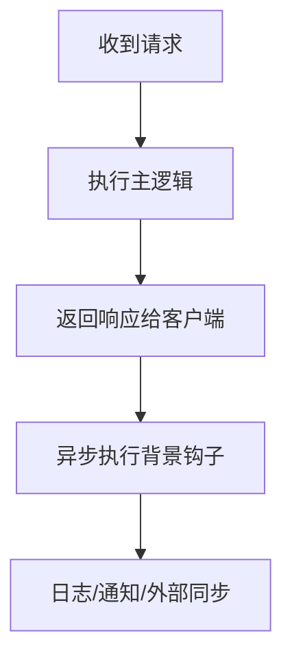
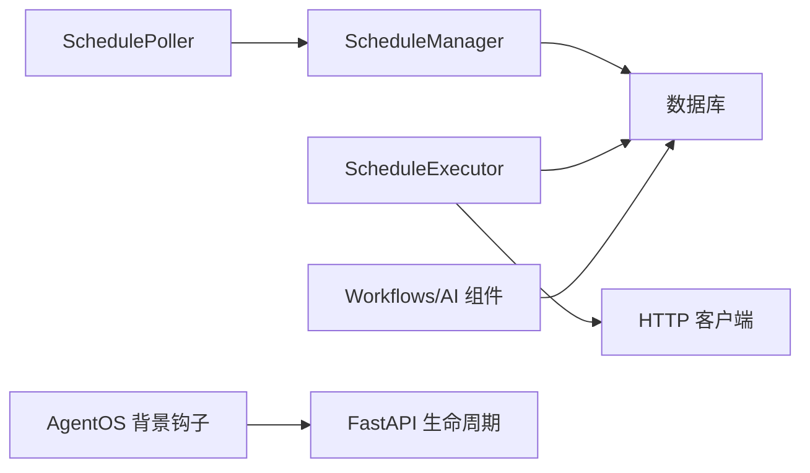

# 异步调度

<cite>
**本文引用的文件**
- [agent-os/scheduler/overview.mdx](file://agent-os/scheduler/overview.mdx)
- [scheduler/overview.mdx](file://scheduler/overview.mdx)
- [examples/agent-os/scheduler/async-schedule.mdx](file://examples/agent-os/scheduler/async-schedule.mdx)
- [examples/agent-os/scheduler/schedule-management.mdx](file://examples/agent-os/scheduler/schedule-management.mdx)
- [workflows/background-execution.mdx](file://workflows/background-execution.mdx)
- [examples/workflows/advanced-concepts/background-execution/background-poll.mdx](file://examples/workflows/advanced-concepts/background-execution/background-poll.mdx)
- [examples/agents/advanced/background-execution.mdx](file://examples/agents/advanced/background-execution.mdx)
- [agent-os/background-tasks/overview.mdx](file://agent-os/background-tasks/overview.mdx)
- [tools/async-tools.mdx](file://tools/async-tools.mdx)
- [database/async-mongo.mdx](file://database/async-mongo.mdx)
- [database/async-postgres.mdx](file://database/async-postgres.mdx)
- [database/async-sqlite.mdx](file://database/async-sqlite.mdx)
</cite>

## 目录
1. [简介](#简介)
2. [项目结构](#项目结构)
3. [核心组件](#核心组件)
4. [架构总览](#架构总览)
5. [详细组件分析](#详细组件分析)
6. [依赖关系分析](#依赖关系分析)
7. [性能考量](#性能考量)
8. [故障处理与重试](#故障处理与重试)
9. [结论](#结论)
10. [附录](#附录)

## 简介
本技术文档聚焦于异步调度能力，系统性阐述其工作原理、实现机制与最佳实践。异步调度在 AgentOS 中通过“计划任务”（Schedule）与“轮询执行器”（SchedulePoller/ScheduleExecutor）协同完成：以 Cron 表达式驱动任务触发，由轮询器周期性“认领”到期任务并发执行，并通过运行记录（Run）追踪状态、耗时、错误等信息。与同步调度相比，异步调度的优势在于：
- 非阻塞：任务执行不阻塞主请求线程，提升响应速度与吞吐量
- 可扩展：支持并发执行多个到期任务，充分利用系统资源
- 可观测：完善的运行历史记录便于审计与排障
- 可恢复：结合重试与超时策略，增强任务鲁棒性

## 项目结构
围绕异步调度的关键文档与示例分布如下：
- 概览与安装：scheduler/overview.mdx、agent-os/scheduler/overview.mdx
- SDK 使用与 API：examples/agent-os/scheduler/async-schedule.mdx、examples/agent-os/scheduler/schedule-management.mdx
- 运行与监控：examples/agent-os/scheduler/run-history.mdx（概念性）
- 背景执行与轮询：workflows/background-execution.mdx、examples/workflows/advanced-concepts/background-execution/background-poll.mdx、examples/agents/advanced/background-execution.mdx
- 背景钩子（AgentOS 层面的异步后处理）：agent-os/background-tasks/overview.mdx
- 异步工具与数据库：tools/async-tools.mdx、database/async-mongo.mdx、database/async-postgres.mdx、database/async-sqlite.mdx

图示来源
- [scheduler/overview.mdx:1-121](file://scheduler/overview.mdx#L1-L121)
- [agent-os/scheduler/overview.mdx:1-105](file://agent-os/scheduler/overview.mdx#L1-L105)
- [examples/agent-os/scheduler/async-schedule.mdx:1-100](file://examples/agent-os/scheduler/async-schedule.mdx#L1-L100)
- [examples/agent-os/scheduler/schedule-management.mdx:1-133](file://examples/agent-os/scheduler/schedule-management.mdx#L1-L133)
- [workflows/background-execution.mdx:1-137](file://workflows/background-execution.mdx#L1-L137)
- [examples/workflows/advanced-concepts/background-execution/background-poll.mdx:93-147](file://examples/workflows/advanced-concepts/background-execution/background-poll.mdx#L93-L147)
- [examples/agents/advanced/background-execution.mdx:171-213](file://examples/agents/advanced/background-execution.mdx#L171-L213)
- [agent-os/background-tasks/overview.mdx:1-168](file://agent-os/background-tasks/overview.mdx#L1-L168)
- [tools/async-tools.mdx:1-6](file://tools/async-tools.mdx#L1-L6)
- [database/async-mongo.mdx:1-52](file://database/async-mongo.mdx#L1-L52)
- [database/async-postgres.mdx:1-52](file://database/async-postgres.mdx#L1-L52)
- [database/async-sqlite.mdx:1-33](file://database/async-sqlite.mdx#L1-L33)

章节来源
- [scheduler/overview.mdx:1-121](file://scheduler/overview.mdx#L1-L121)
- [agent-os/scheduler/overview.mdx:1-105](file://agent-os/scheduler/overview.mdx#L1-L105)

## 核心组件
- 计划管理器（ScheduleManager）：提供异步 CRUD 与运行历史查询接口，支持启用/禁用、手动触发等操作。
- 轮询器（SchedulePoller）：按固定间隔扫描并“认领”到期任务，负责并发执行。
- 执行器（ScheduleExecutor）：实际调用目标端点、处理重试、写入运行记录。
- 调度 API：REST 接口用于生命周期管理与手动触发。
- AgentOS 背景钩子：在 API 响应返回后异步执行预/后置钩子，避免阻塞。

章节来源
- [scheduler/overview.mdx:80-109](file://scheduler/overview.mdx#L80-L109)
- [agent-os/scheduler/overview.mdx:83-96](file://agent-os/scheduler/overview.mdx#L83-L96)

## 架构总览
下图展示从“计划任务”到“执行与监控”的整体流程，涵盖异步调度与背景执行两种路径。

图示来源
- [scheduler/overview.mdx:80-109](file://scheduler/overview.mdx#L80-L109)
- [agent-os/scheduler/overview.mdx:83-96](file://agent-os/scheduler/overview.mdx#L83-L96)
- [workflows/background-execution.mdx:83-127](file://workflows/background-execution.mdx#L83-L127)
- [agent-os/background-tasks/overview.mdx:102-135](file://agent-os/background-tasks/overview.mdx#L102-L135)

## 详细组件分析

### 组件一：异步计划管理（ScheduleManager）
- 功能要点
  - 异步 CRUD：acreate、alist、aget、aupdate、adelete
  - 启用/禁用：aenable、adisable
  - 运行历史：aget_runs
  - 控制台展示：SchedulerConsole
- 典型流程
  - 创建计划 → 列表查询 → 获取详情 → 更新描述 → 禁用/启用 → 查看运行历史 → 清理

图示来源
- [examples/agent-os/scheduler/async-schedule.mdx:24-85](file://examples/agent-os/scheduler/async-schedule.mdx#L24-L85)
- [scheduler/overview.mdx:80-109](file://scheduler/overview.mdx#L80-L109)

章节来源
- [examples/agent-os/scheduler/async-schedule.mdx:1-100](file://examples/agent-os/scheduler/async-schedule.mdx#L1-L100)
- [scheduler/overview.mdx:80-109](file://scheduler/overview.mdx#L80-L109)

### 组件二：REST 管理与手动触发
- 支持的端点
  - 创建、列出、获取、更新、删除
  - 启用/禁用
  - 手动触发
  - 运行历史查询
- 关键字段
  - method、timezone、timeout_seconds、max_retries、retry_delay_seconds

图示来源
- [examples/agent-os/scheduler/schedule-management.mdx:34-110](file://examples/agent-os/scheduler/schedule-management.mdx#L34-L110)
- [scheduler/overview.mdx:89-98](file://scheduler/overview.mdx#L89-L98)

章节来源
- [examples/agent-os/scheduler/schedule-management.mdx:1-133](file://examples/agent-os/scheduler/schedule-management.mdx#L1-L133)
- [scheduler/overview.mdx:83-109](file://scheduler/overview.mdx#L83-L109)

### 组件三：后台执行与轮询（Workflows/AI 组件）
- 背景执行
  - 通过 arun(background=True) 启动非阻塞任务，返回 run_id
  - 使用 get_run(run_id) 轮询状态，直到完成或超时
- 适用场景
  - 长耗时任务、批量处理、多步骤研究等

图示来源
- [workflows/background-execution.mdx:83-127](file://workflows/background-execution.mdx#L83-L127)
- [examples/workflows/advanced-concepts/background-execution/background-poll.mdx:93-147](file://examples/workflows/advanced-concepts/background-execution/background-poll.mdx#L93-L147)
- [examples/agents/advanced/background-execution.mdx:171-213](file://examples/agents/advanced/background-execution.mdx#L171-L213)

章节来源
- [workflows/background-execution.mdx:1-137](file://workflows/background-execution.mdx#L1-L137)
- [examples/workflows/advanced-concepts/background-execution/background-poll.mdx:1-147](file://examples/workflows/advanced-concepts/background-execution/background-poll.mdx#L1-L147)
- [examples/agents/advanced/background-execution.mdx:1-213](file://examples/agents/advanced/background-execution.mdx#L1-L213)

### 组件四：AgentOS 背景钩子（异步后处理）
- 作用
  - 在 API 响应已返回后，异步执行预/后置钩子，避免阻塞
- 配置方式
  - 全局开关：run_hooks_in_background=True
  - 单钩子装饰器：@hook(run_in_background=True)
- 注意事项
  - 背景钩子不可修改请求/响应；适合日志、通知、外部同步等

图示来源
- [agent-os/background-tasks/overview.mdx:50-135](file://agent-os/background-tasks/overview.mdx#L50-L135)

章节来源
- [agent-os/background-tasks/overview.mdx:1-168](file://agent-os/background-tasks/overview.mdx#L1-L168)

### 组件五：异步工具与数据库
- 异步工具：支持定义异步工具函数，配合 Agent 执行
- 异步数据库：AsyncMongoDb、AsyncPostgresDb、AsyncSqliteDb 提供异步会话存储，降低 IO 阻塞

章节来源
- [tools/async-tools.mdx:1-6](file://tools/async-tools.mdx#L1-L6)
- [database/async-mongo.mdx:1-52](file://database/async-mongo.mdx#L1-L52)
- [database/async-postgres.mdx:1-52](file://database/async-postgres.mdx#L1-L52)
- [database/async-sqlite.mdx:1-33](file://database/async-sqlite.mdx#L1-L33)

## 依赖关系分析
- 组件耦合
  - ScheduleManager 与数据库持久化强相关，提供异步 CRUD 与运行历史查询
  - SchedulePoller 依赖 ScheduleManager 的查询/认领能力，再委派 ScheduleExecutor 执行
  - ScheduleExecutor 依赖网络调用与重试策略，最终写入运行记录
  - Workflows/AI 组件通过 arun/background 实现非阻塞执行，与运行记录存储交互
  - AgentOS 背景钩子独立于业务逻辑，仅在 FastAPI 生命周期内异步执行
- 外部依赖
  - 数据库：SQLite/MongoDB/PostgreSQL 的异步驱动
  - 网络：HTTP 客户端用于调用目标端点
  - 时区与 Cron 解析：IANA 时区与标准 5 场 Cron 语法

图示来源
- [scheduler/overview.mdx:80-109](file://scheduler/overview.mdx#L80-L109)
- [agent-os/background-tasks/overview.mdx:102-135](file://agent-os/background-tasks/overview.mdx#L102-L135)

章节来源
- [scheduler/overview.mdx:80-109](file://scheduler/overview.mdx#L80-L109)
- [agent-os/background-tasks/overview.mdx:102-135](file://agent-os/background-tasks/overview.mdx#L102-L135)

## 性能考量
- 并发控制
  - 轮询器按固定间隔扫描，避免过载；执行器并发处理到期任务，建议根据 CPU/IO 能力设置合理并发上限
- 资源管理
  - 异步数据库减少 IO 阻塞；异步工具降低工具调用等待时间
- 超时与重试
  - timeout_seconds 控制请求与轮询超时；max_retries 与 retry_delay_seconds 控制失败重试策略
- 观测与优化
  - 通过运行历史记录分析耗时与失败率，持续优化 Cron 表达式与任务粒度

章节来源
- [scheduler/overview.mdx:95-98](file://scheduler/overview.mdx#L95-L98)
- [agent-os/scheduler/overview.mdx:73-82](file://agent-os/scheduler/overview.mdx#L73-L82)

## 故障处理与重试
- 重试机制
  - max_retries 控制失败后的最大重试次数；retry_delay_seconds 控制重试间隔
- 超时控制
  - timeout_seconds 控制单次执行与轮询等待的最大时间
- 错误隔离
  - AgentOS 背景钩子异常不影响已返回的响应，需在钩子内部做好日志与降级
- 运行记录
  - 每次运行记录包含状态、尝试次数、时间戳、错误信息等，便于定位问题

章节来源
- [scheduler/overview.mdx:95-98](file://scheduler/overview.mdx#L95-L98)
- [agent-os/background-tasks/overview.mdx:123-135](file://agent-os/background-tasks/overview.mdx#L123-L135)

## 结论
异步调度通过“计划任务 + 轮询执行 + 运行记录”的组合，实现了高吞吐、可观测、可恢复的任务编排。与同步调度相比，异步调度显著降低了请求阻塞风险，提升了系统的整体可用性与扩展性。结合 AgentOS 背景钩子与异步工具/数据库，可在保证响应速度的同时，完成复杂的日志、通知与数据同步等非关键任务。

## 附录
- 快速上手
  - 安装：参考调度概览中的安装命令
  - 基础使用：参考 SDK 示例与 REST 管理示例
  - 背景执行：参考 Workflows 背景执行与轮询示例
  - AgentOS 背景钩子：参考 AgentOS 背景任务概览
- 参考链接
  - 调度概览与 API：[scheduler/overview.mdx](file://scheduler/overview.mdx)、[agent-os/scheduler/overview.mdx](file://agent-os/scheduler/overview.mdx)
  - 示例：[async-schedule.mdx](file://examples/agent-os/scheduler/async-schedule.mdx)、[schedule-management.mdx](file://examples/agent-os/scheduler/schedule-management.mdx)
  - 背景执行：[workflows/background-execution.mdx](file://workflows/background-execution.mdx)、[background-poll.mdx](file://examples/workflows/advanced-concepts/background-execution/background-poll.mdx)
  - 背景钩子：[agent-os/background-tasks/overview.mdx](file://agent-os/background-tasks/overview.mdx)
  - 异步工具与数据库：[tools/async-tools.mdx](file://tools/async-tools.mdx)、[async-mongo.mdx](file://database/async-mongo.mdx)、[async-postgres.mdx](file://database/async-postgres.mdx)、[async-sqlite.mdx](file://database/async-sqlite.mdx)