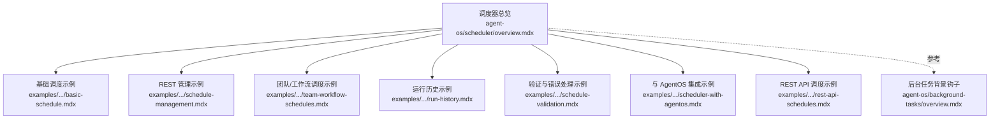
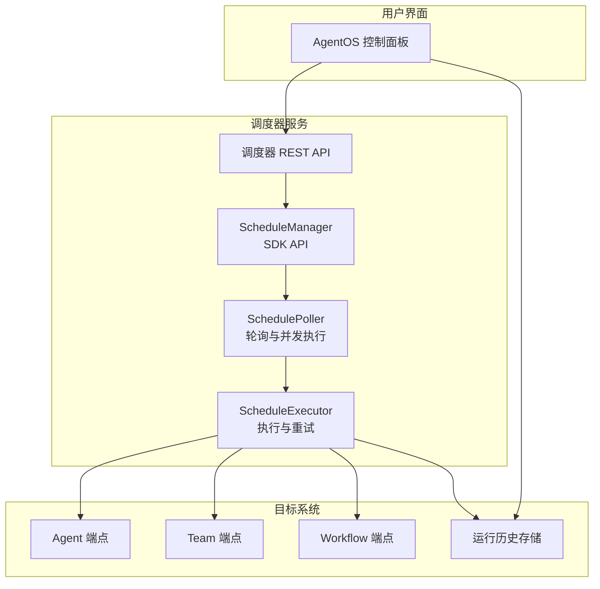
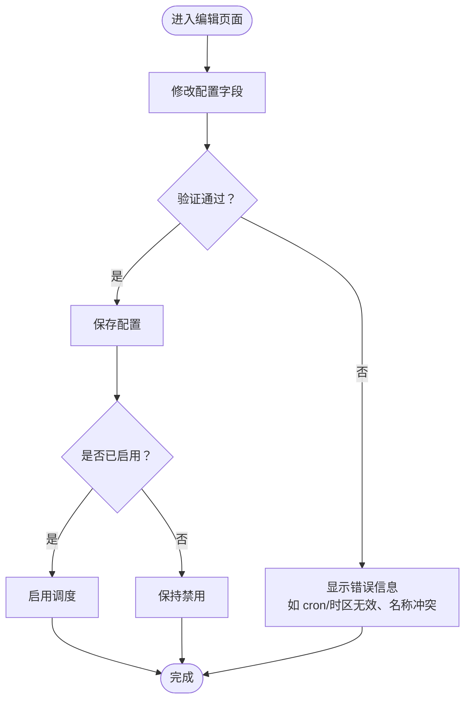
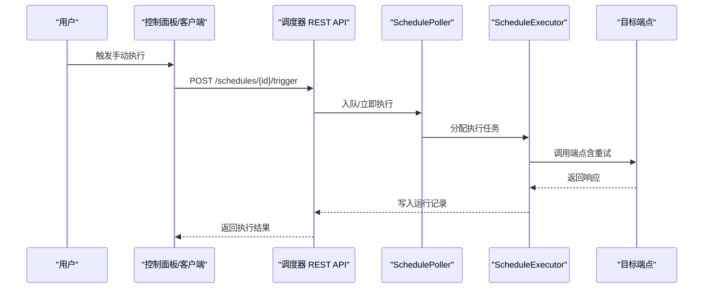
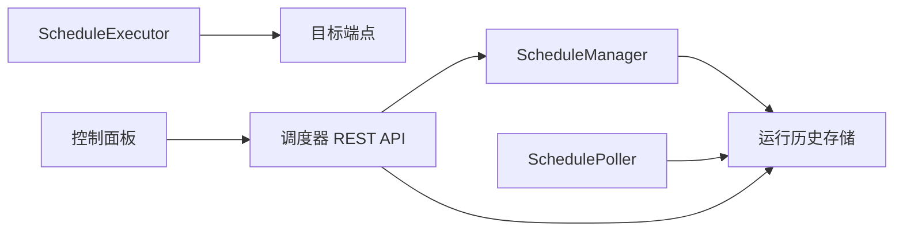

# 调度管理

<cite>
**本文引用的文件**
- [调度器总览](file://agent-os/scheduler/overview.mdx)
- [调度器示例：基础调度](file://examples/agent-os/scheduler/basic-schedule.mdx)
- [调度器示例：REST 管理](file://examples/agent-os/scheduler/schedule-management.mdx)
- [调度器示例：团队与工作流调度](file://examples/agent-os/scheduler/team-workflow-schedules.mdx)
- [调度器示例：运行历史](file://examples/agent-os/scheduler/run-history.mdx)
- [调度器示例：验证与错误处理](file://examples/agent-os/scheduler/schedule-validation.mdx)
- [调度器示例：与 AgentOS 集成](file://examples/agent-os/scheduler/scheduler-with-agentos.mdx)
- [调度器示例：REST API 调度](file://examples/agent-os/scheduler/rest-api-schedules.mdx)
- [背景钩子（后台任务）总览](file://agent-os/background-tasks/overview.mdx)
</cite>

## 目录
1. [简介](#简介)
2. [项目结构](#项目结构)
3. [核心组件](#核心组件)
4. [架构总览](#架构总览)
5. [详细组件分析](#详细组件分析)
6. [依赖关系分析](#依赖关系分析)
7. [性能考量](#性能考量)
8. [故障排查指南](#故障排查指南)
9. [结论](#结论)
10. [附录](#附录)

## 简介
本文件面向调度管理功能，基于 AgentOS 控制面板与调度器能力，提供从调度列表查看、配置编辑、启停控制到手动触发的完整操作说明；解释调度任务的验证机制与配置检查方法；说明运行历史的查看与分析；并给出监控、日志与故障诊断建议以及性能监控与资源使用管理要点。内容以仓库中“调度器”相关文档与示例为基础整理而成。

## 项目结构
围绕调度管理的相关文档与示例主要分布在以下路径：
- 调度器总览与 API：agent-os/scheduler/overview.mdx
- 示例：examples/agent-os/scheduler/*.mdx
- 后台任务（与调度执行后的非阻塞处理相关）：agent-os/background-tasks/overview.mdx

图表来源
- [调度器总览:1-121](file://agent-os/scheduler/overview.mdx#L1-L121)
- [调度器示例：基础调度:1-88](file://examples/agent-os/scheduler/basic-schedule.mdx#L1-L88)
- [调度器示例：REST 管理:1-133](file://examples/agent-os/scheduler/schedule-management.mdx#L1-L133)
- [调度器示例：团队与工作流调度:1-125](file://examples/agent-os/scheduler/team-workflow-schedules.mdx#L1-L125)
- [调度器示例：运行历史:1-138](file://examples/agent-os/scheduler/run-history.mdx#L1-L138)
- [调度器示例：验证与错误处理:1-116](file://examples/agent-os/scheduler/schedule-validation.mdx#L1-L116)
- [调度器示例：与 AgentOS 集成:1-89](file://examples/agent-os/scheduler/scheduler-with-agentos.mdx#L1-L89)
- [调度器示例：REST API 调度:112-131](file://examples/agent-os/scheduler/rest-api-schedules.mdx#L112-L131)
- [背景钩子（后台任务）总览:1-168](file://agent-os/background-tasks/overview.mdx#L1-L168)

章节来源
- [调度器总览:1-121](file://agent-os/scheduler/overview.mdx#L1-L121)

## 核心组件
- 调度器组件
  - ScheduleManager：用于创建、列出、更新、启用/禁用、删除调度以及查询运行历史的 SDK 接口。
  - SchedulePoller：按轮询间隔“认领到期调度并并发执行”的服务组件。
  - ScheduleExecutor：调用调度目标端点、处理重试、写入运行记录。
  - 调度器 API：提供调度生命周期与手动触发的 REST 端点。
- 控制面板与 UI
  - AgentOS 控制面板支持查看调度列表、详情与运行历史，并可直接进行编辑、启停与删除等操作。
- 运行历史与分析
  - 提供运行记录存储（状态、尝试次数、时间线、错误、输入输出等），并通过控制台工具进行富文本展示与分页查询。
- 验证与错误处理
  - 对 cron 表达式、时区、重复名称、HTTP 方法大小写等进行校验；非法输入在 SDK 抛出异常，在 API 返回 422。
- 与 AgentOS 集成
  - 在 AgentOS 中启用调度器后，自动注册 REST 端点、启动轮询器并在应用关闭时停止；内部服务令牌负责调度器与目标端点之间的认证。

章节来源
- [调度器总览:80-121](file://agent-os/scheduler/overview.mdx#L80-L121)

## 架构总览
下图展示了调度器在 AgentOS 中的整体交互流程：用户通过控制面板或 REST API 创建调度；调度器轮询器周期性发现到期调度并执行；执行器调用目标端点（Agent/Team/Workflow），处理重试并将运行记录写入数据库；控制面板展示运行历史并支持手动触发。

图表来源
- [调度器总览:80-121](file://agent-os/scheduler/overview.mdx#L80-L121)
- [调度器示例：REST 管理:34-110](file://examples/agent-os/scheduler/schedule-management.mdx#L34-L110)
- [调度器示例：运行历史:95-124](file://examples/agent-os/scheduler/run-history.mdx#L95-L124)

## 详细组件分析

### 组件一：调度列表查看与详情面板
- 操作入口
  - 在 AgentOS 控制面板中打开“调度”页面，即可看到调度列表与运行历史面板。
- 功能要点
  - 列表支持筛选、排序与查看详情。
  - 选中某条调度可查看其配置与运行历史。
- 建议
  - 使用“运行历史”面板快速定位最近失败或耗时较长的任务，结合“手动触发”进行验证。

章节来源
- [调度器总览:60-71](file://agent-os/scheduler/overview.mdx#L60-L71)

### 组件二：配置编辑与启停控制
- 编辑配置
  - 支持修改名称、cron 表达式、目标端点、HTTP 方法、时区、超时、最大重试次数与重试间隔等字段。
- 启停控制
  - 支持启用/禁用单个调度；禁用后不会被轮询器执行。
- 验证与检查
  - cron 与时区格式不合法会抛出异常或返回 422；重复名称可通过策略选择“抛错/跳过/覆盖”。

图表来源
- [调度器示例：验证与错误处理:28-86](file://examples/agent-os/scheduler/schedule-validation.mdx#L28-L86)
- [调度器示例：REST 管理:63-83](file://examples/agent-os/scheduler/schedule-management.mdx#L63-L83)

章节来源
- [调度器示例：验证与错误处理:28-102](file://examples/agent-os/scheduler/schedule-validation.mdx#L28-L102)
- [调度器示例：REST 管理:63-83](file://examples/agent-os/scheduler/schedule-management.mdx#L63-L83)

### 组件三：手动触发与运行历史
- 手动触发
  - 通过 REST API 或控制面板触发一次调度执行；若调度器执行器尚未就绪，可能返回 503。
- 运行历史
  - 每次执行记录状态、尝试次数、触发与完成时间、错误信息、关联 run_id/session_id 等。
  - 支持分页查询与富文本表格展示，便于分析成功率、失败原因与耗时趋势。

图表来源
- [调度器示例：REST 管理:85-101](file://examples/agent-os/scheduler/schedule-management.mdx#L85-L101)
- [调度器示例：REST API 调度:112-131](file://examples/agent-os/scheduler/rest-api-schedules.mdx#L112-L131)
- [调度器示例：运行历史:95-124](file://examples/agent-os/scheduler/run-history.mdx#L95-L124)

章节来源
- [调度器示例：REST 管理:85-111](file://examples/agent-os/scheduler/schedule-management.mdx#L85-L111)
- [调度器示例：REST API 调度:112-131](file://examples/agent-os/scheduler/rest-api-schedules.mdx#L112-L131)
- [调度器示例：运行历史:95-124](file://examples/agent-os/scheduler/run-history.mdx#L95-L124)

### 组件四：调度目标类型与负载差异
- 目标类型
  - Agent、Team、Workflow 的运行端点均可作为调度目标；也可对非运行端点发起 GET/其他方法请求（如健康检查）。
- 负载与超时
  - 不同目标的执行耗时与资源占用不同，应根据实际场景设置合适的 timeout_seconds、max_retries 与 retry_delay_seconds。

章节来源
- [调度器示例：团队与工作流调度:28-101](file://examples/agent-os/scheduler/team-workflow-schedules.mdx#L28-L101)

### 组件五：与 AgentOS 的集成与轮询
- 在 AgentOS 中启用调度器后：
  - 自动注册调度器 REST 端点；
  - 应用启动时自动启动 SchedulePoller，默认轮询间隔可配置；
  - 应用关闭时停止轮询；
  - 使用内部服务令牌保障调度器与目标端点之间的认证。
- 建议
  - 将调度器轮询间隔与业务负载匹配，避免过于频繁导致资源紧张。

章节来源
- [调度器示例：与 AgentOS 集成:43-57](file://examples/agent-os/scheduler/scheduler-with-agentos.mdx#L43-L57)
- [调度器总览:35-60](file://agent-os/scheduler/overview.mdx#L35-L60)

## 依赖关系分析
- 组件耦合
  - ScheduleManager 与 SchedulePoller/Executor 之间通过数据库中的调度与运行记录进行解耦。
  - 控制面板依赖调度器 REST API 与运行历史存储。
- 外部依赖
  - 目标端点（Agent/Team/Workflow）的可用性直接影响调度执行成功与否。
  - 时区与时钟同步影响 cron 到期判断的准确性。

图表来源
- [调度器总览:80-121](file://agent-os/scheduler/overview.mdx#L80-L121)
- [调度器示例：运行历史:95-124](file://examples/agent-os/scheduler/run-history.mdx#L95-L124)

章节来源
- [调度器总览:80-121](file://agent-os/scheduler/overview.mdx#L80-L121)

## 性能考量
- 轮询间隔与并发
  - 合理设置轮询间隔，避免过于频繁造成 CPU/IO 压力；并发执行数量需与目标端点吞吐能力匹配。
- 超时与重试
  - 为长耗时任务设置更长的 timeout_seconds；合理配置 max_retries 与 retry_delay_seconds，避免雪崩效应。
- 资源隔离
  - 对高负载目标（如工作流）单独规划调度策略，必要时拆分为多个低负载调度，降低峰值压力。
- 后台任务配合
  - 对于非关键的统计、通知等可在 AgentOS 中配置后台钩子，避免阻塞主执行路径。

章节来源
- [背景钩子（后台任务）总览:102-135](file://agent-os/background-tasks/overview.mdx#L102-L135)

## 故障排查指南
- 常见问题与定位
  - cron/时区无效：SDK 抛出异常，API 返回 422；请检查表达式与 IANA 时区字符串。
  - 重复名称：创建时抛出异常；可通过策略参数选择覆盖或跳过。
  - 目标端点不可用：手动触发返回 503 或执行失败；检查目标服务状态与网络连通性。
  - 执行超时：适当增加 timeout_seconds；检查目标端点性能瓶颈。
  - 重试失败：核对 max_retries 与 retry_delay_seconds 设置，关注错误日志。
- 工具与方法
  - 使用控制面板查看运行历史，定位失败与耗时异常的任务。
  - 通过 REST API 获取指定调度的运行记录，进行分页与统计分析。
  - 对非运行端点（如健康检查）使用 GET 方法进行探测，辅助排障。

章节来源
- [调度器示例：验证与错误处理:28-86](file://examples/agent-os/scheduler/schedule-validation.mdx#L28-L86)
- [调度器示例：REST 管理:85-111](file://examples/agent-os/scheduler/schedule-management.mdx#L85-L111)
- [调度器示例：REST API 调度:112-131](file://examples/agent-os/scheduler/rest-api-schedules.mdx#L112-L131)
- [调度器示例：运行历史:95-124](file://examples/agent-os/scheduler/run-history.mdx#L95-L124)

## 结论
调度管理通过“控制面板 + 调度器 REST API + ScheduleManager/SchedulePoller/ScheduleExecutor”的组合实现：既支持可视化操作（列表、详情、启停、删除），也支持程序化管理（创建、更新、手动触发、历史查询）。配合运行历史与验证机制，可有效保障调度任务的稳定性与可观测性；结合后台任务与合理的超时/重试策略，可进一步提升整体性能与可靠性。

## 附录
- 快速参考
  - 调度生命周期与手动触发的 REST 端点参见调度器总览。
  - 基础调度与与 AgentOS 集成示例可帮助快速上手。
  - 团队/工作流调度示例展示多目标场景下的配置差异。
  - 运行历史示例演示富文本展示与分页查询方法。
  - 验证示例涵盖常见错误场景与处理方式。

章节来源
- [调度器总览:83-121](file://agent-os/scheduler/overview.mdx#L83-L121)
- [调度器示例：基础调度:1-88](file://examples/agent-os/scheduler/basic-schedule.mdx#L1-L88)
- [调度器示例：与 AgentOS 集成:1-89](file://examples/agent-os/scheduler/scheduler-with-agentos.mdx#L1-L89)
- [调度器示例：团队与工作流调度:1-125](file://examples/agent-os/scheduler/team-workflow-schedules.mdx#L1-L125)
- [调度器示例：运行历史:1-138](file://examples/agent-os/scheduler/run-history.mdx#L1-L138)
- [调度器示例：验证与错误处理:1-116](file://examples/agent-os/scheduler/schedule-validation.mdx#L1-L116)