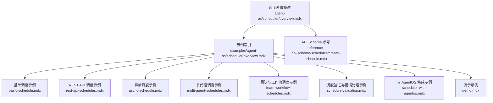
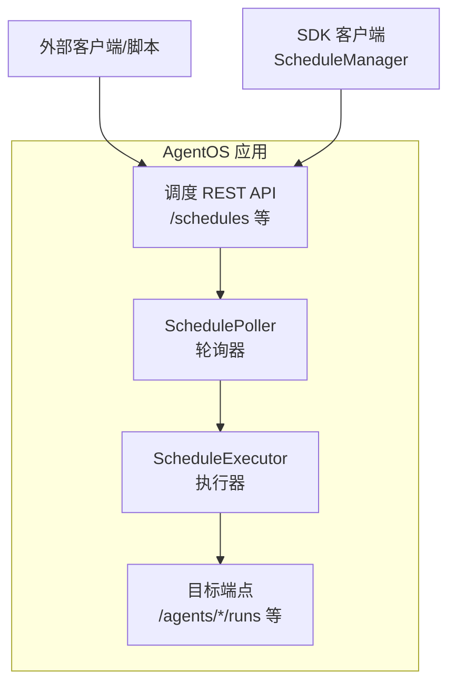
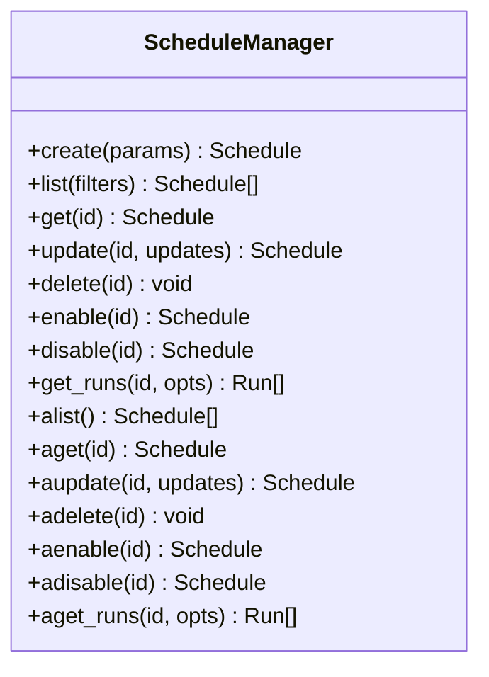
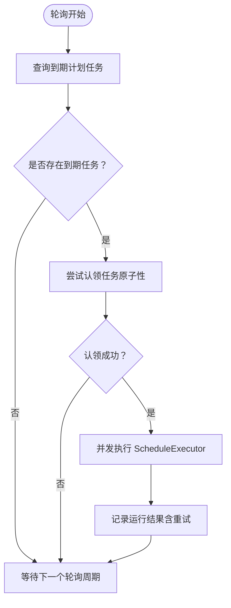
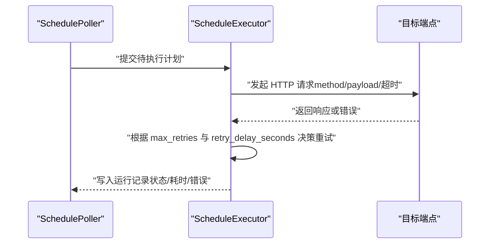
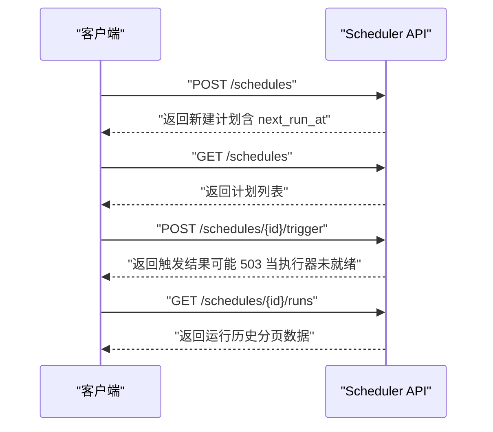
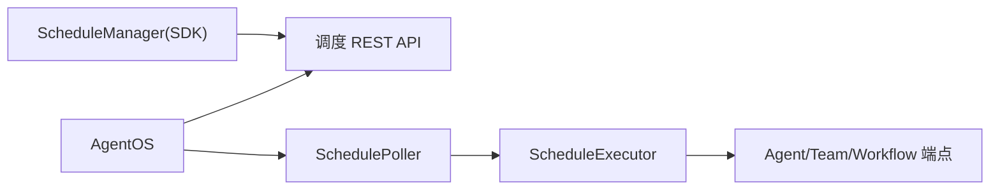

# 调度系统

<cite>
**本文引用的文件**   
- [agent-os/scheduler/概述.mdx](file://agent-os/scheduler/overview.mdx)
- [examples/agent-os/scheduler/概述.mdx](file://examples/agent-os/scheduler/overview.mdx)
- [examples/agent-os/scheduler/基础调度.mdx](file://examples/agent-os/scheduler/basic-schedule.mdx)
- [examples/agent-os/scheduler/REST-API调度.mdx](file://examples/agent-os/scheduler/rest-api-schedules.mdx)
- [examples/agent-os/scheduler/异步调度.mdx](file://examples/agent-os/scheduler/async-schedule.mdx)
- [examples/agent-os/scheduler/多代理调度.mdx](file://examples/agent-os/scheduler/multi-agent-schedules.mdx)
- [examples/agent-os/scheduler/团队与工作流调度.mdx](file://examples/agent-os/scheduler/team-workflow-schedules.mdx)
- [examples/agent-os/scheduler/调度验证与错误处理.mdx](file://examples/agent-os/scheduler/schedule-validation.mdx)
- [examples/agent-os/scheduler/与AgentOS集成.mdx](file://examples/agent-os/scheduler/scheduler-with-agentos.mdx)
- [examples/agent-os/scheduler/演示.mdx](file://examples/agent-os/scheduler/demo.mdx)
- [reference-api/schema/schedules/创建调度.mdx](file://reference-api/schema/schedules/create-schedule.mdx)
</cite>

## 目录
1. [简介](#简介)
2. [项目结构](#项目结构)
3. [核心组件](#核心组件)
4. [架构总览](#架构总览)
5. [详细组件分析](#详细组件分析)
6. [依赖关系分析](#依赖关系分析)
7. [性能考量](#性能考量)
8. [故障排查指南](#故障排查指南)
9. [结论](#结论)
10. [附录](#附录)

## 简介
本技术文档围绕 AgentOS 的调度系统展开，系统性阐述其设计原理、在 AgentOS 中的应用方式、定时任务的创建与管理（含同步与异步）、多代理与 REST API 调度示例、调度策略与优先级管理、性能优化与资源控制、监控与日志最佳实践，以及常见问题的解决方案。读者可据此快速理解并落地调度能力，支撑自动化 Agent 执行、团队与工作流编排、周期性任务与健康检查等场景。

## 项目结构
调度系统相关文档主要分布在以下位置：
- 概述与使用：agent-os/scheduler/overview.mdx
- 示例索引：examples/agent-os/scheduler/overview.mdx
- 基础调度示例：examples/agent-os/scheduler/basic-schedule.mdx
- REST API 调度示例：examples/agent-os/scheduler/rest-api-schedules.mdx
- 异步调度示例：examples/agent-os/scheduler/async-schedule.mdx
- 多代理调度示例：examples/agent-os/scheduler/multi-agent-schedules.mdx
- 团队与工作流调度示例：examples/agent-os/scheduler/team-workflow-schedules.mdx
- 调度验证与错误处理示例：examples/agent-os/scheduler/schedule-validation.mdx
- 与 AgentOS 集成示例：examples/agent-os/scheduler/scheduler-with-agentos.mdx
- 演示示例：examples/agent-os/scheduler/demo.mdx
- API Schema 参考：reference-api/schema/schedules/create-schedule.mdx

**图表来源**
- [agent-os/scheduler/概述.mdx:1-105](file://agent-os/scheduler/overview.mdx#L1-L105)
- [examples/agent-os/scheduler/概述.mdx:1-18](file://examples/agent-os/scheduler/overview.mdx#L1-L18)

**章节来源**
- [agent-os/scheduler/概述.mdx:1-105](file://agent-os/scheduler/overview.mdx#L1-L105)
- [examples/agent-os/scheduler/概述.mdx:1-18](file://examples/agent-os/scheduler/overview.mdx#L1-L18)

## 核心组件
调度系统由以下核心组件构成：
- ScheduleManager：SDK API，用于创建、查询、更新、启用/禁用、删除、查看运行历史等。
- SchedulePoller：按轮询间隔“认领”到期的计划任务并并发执行。
- ScheduleExecutor：调用目标端点（如 /agents/*/runs），处理重试与写入运行记录。
- Scheduler API：REST 端点，支持计划生命周期管理与手动触发。

关键字段与行为要点：
- Cron 表达式：标准 5 字段语法（分钟 小时 月内日 月 周内日）。
- 端点路径：仅路径部分（例如 /agents/greeter/runs），非完整 URL。
- 时区：IANA 时区字符串，默认 UTC。
- 重试：max_retries 与 retry_delay_seconds 控制失败重试。
- 运行历史：每次执行存储状态、耗时、输入输出与错误信息。
- HTTP 方法：默认 POST；支持 GET/POST/PUT/PATCH/DELETE。
- 超时：timeout_seconds 控制请求与轮询超时。
- 轮询间隔：scheduler_poll_interval（秒），默认 15。

**章节来源**
- [agent-os/scheduler/概述.mdx:80-98](file://agent-os/scheduler/overview.mdx#L80-L98)

## 架构总览
调度系统在 AgentOS 内部以“服务内嵌 + 外部 REST”的双通道协同工作：
- 在 AgentOS 中启用调度后，自动注册 /schedules REST 接口，并启动 SchedulePoller 自动轮询。
- 外部客户端可通过 REST API 或 SDK（ScheduleManager）创建与管理计划任务。
- ScheduleExecutor 负责调用目标端点，结合重试策略与运行记录，形成闭环。

**图表来源**
- [agent-os/scheduler/概述.mdx:80-87](file://agent-os/scheduler/overview.mdx#L80-L87)
- [examples/agent-os/scheduler/与AgentOS集成.mdx:43-57](file://examples/agent-os/scheduler/scheduler-with-agentos.mdx#L43-L57)

## 详细组件分析

### 组件一：ScheduleManager（SDK）
- 职责：提供 CRUD、启停、运行历史查询等能力；支持同步与异步 API。
- 典型操作：create/list/get/update/delete、enable/disable、get_runs。
- 异步 API：acreate/alist/aget/aupdate/adelete、aenable/adisable、aget_runs。

**图表来源**
- [agent-os/scheduler/概述.mdx:84-84](file://agent-os/scheduler/overview.mdx#L84-L84)
- [examples/agent-os/scheduler/异步调度.mdx:24-85](file://examples/agent-os/scheduler/async-schedule.mdx#L24-L85)

**章节来源**
- [agent-os/scheduler/概述.mdx:84-84](file://agent-os/scheduler/overview.mdx#L84-L84)
- [examples/agent-os/scheduler/异步调度.mdx:24-85](file://examples/agent-os/scheduler/async-schedule.mdx#L24-L85)

### 组件二：SchedulePoller（轮询器）
- 职责：按 scheduler_poll_interval 轮询，认领到期计划任务并并发执行。
- 关键点：并发执行、避免重复执行、幂等处理。

**图表来源**
- [agent-os/scheduler/概述.mdx:85-85](file://agent-os/scheduler/overview.mdx#L85-L85)

**章节来源**
- [agent-os/scheduler/概述.mdx:85-85](file://agent-os/scheduler/overview.mdx#L85-L85)

### 组件三：ScheduleExecutor（执行器）
- 职责：调用目标端点（HTTP 方法可配置），处理重试与运行记录。
- 关键点：超时控制、重试退避、错误归档、运行历史持久化。

**图表来源**
- [agent-os/scheduler/概述.mdx:86-86](file://agent-os/scheduler/overview.mdx#L86-L86)
- [examples/agent-os/scheduler/REST-API调度.mdx:118-131](file://examples/agent-os/scheduler/rest-api-schedules.mdx#L118-L131)

**章节来源**
- [agent-os/scheduler/概述.mdx:86-86](file://agent-os/scheduler/overview.mdx#L86-L86)
- [examples/agent-os/scheduler/REST-API调度.mdx:118-131](file://examples/agent-os/scheduler/rest-api-schedules.mdx#L118-L131)

### 组件四：Scheduler API（REST）
- 路径与方法：
  - 创建：POST /schedules
  - 列表：GET /schedules
  - 获取详情：GET /schedules/{schedule_id}
  - 更新：PATCH /schedules/{schedule_id}
  - 删除：DELETE /schedules/{schedule_id}
  - 启用/禁用：POST /schedules/{schedule_id}/enable, POST /schedules/{schedule_id}/disable
  - 手动触发：POST /schedules/{schedule_id}/trigger
  - 查看运行历史：GET /schedules/{schedule_id}/runs

**图表来源**
- [agent-os/scheduler/概述.mdx:87-95](file://agent-os/scheduler/overview.mdx#L87-L95)
- [examples/agent-os/scheduler/REST-API调度.mdx:35-167](file://examples/agent-os/scheduler/rest-api-schedules.mdx#L35-L167)

**章节来源**
- [agent-os/scheduler/概述.mdx:87-95](file://agent-os/scheduler/overview.mdx#L87-L95)
- [examples/agent-os/scheduler/REST-API调度.mdx:35-167](file://examples/agent-os/scheduler/rest-api-schedules.mdx#L35-L167)

## 依赖关系分析
- AgentOS 启用调度后，自动注册调度 REST 接口并启动轮询器。
- SDK（ScheduleManager）与 REST API 共享同一数据库后端，保证状态一致。
- 执行器通过内部服务令牌与 AgentOS 内部通信，确保跨组件认证与授权。

**图表来源**
- [examples/agent-os/scheduler/与AgentOS集成.mdx:43-57](file://examples/agent-os/scheduler/scheduler-with-agentos.mdx#L43-L57)
- [examples/agent-os/scheduler/演示.mdx:71-87](file://examples/agent-os/scheduler/demo.mdx#L71-L87)

**章节来源**
- [examples/agent-os/scheduler/与AgentOS集成.mdx:43-57](file://examples/agent-os/scheduler/scheduler-with-agentos.mdx#L43-L57)
- [examples/agent-os/scheduler/演示.mdx:71-87](file://examples/agent-os/scheduler/demo.mdx#L71-L87)

## 性能考量
- 轮询间隔权衡：scheduler_poll_interval 越短，到期任务响应越快但 CPU/IO 压力越大。默认 15 秒适合大多数场景。
- 并发执行：SchedulePoller 支持并发执行多个到期任务，建议根据目标端点吞吐与资源限制合理设置。
- 超时与重试：timeout_seconds 控制单次请求与轮询超时；max_retries 与 retry_delay_seconds 控制失败重试策略，避免雪崩。
- 数据库压力：运行历史频繁写入，建议对调度表与运行记录表进行索引优化（如按 schedule_id、状态、时间排序）。
- 端点性能：目标端点（如 /agents/*/runs）应具备限流与熔断能力，防止被大量定时任务压垮。

[本节为通用性能指导，不直接分析具体文件]

## 故障排查指南
- 触发返回 503：当执行器尚未就绪时会返回 503，稍后重试即可。
- 无法连接数据库：确认数据库连接参数与可用性；检查调度表与运行记录表存在且权限正确。
- 时区与 Cron 解析错误：确保 timezone 为有效 IANA 时区；Cron 表达式符合 5 字段规范。
- 重复名称冲突：同名计划在默认约束下会报错，需修改名称或使用更新模式。
- 方法大小写：method 会被自动大写化，确保使用 GET/POST/PUT/PATCH/DELETE。
- 运行历史为空：若尚未轮询到，等待下一个轮询周期或手动触发。

**章节来源**
- [examples/agent-os/scheduler/REST-API调度.mdx:120-131](file://examples/agent-os/scheduler/rest-api-schedules.mdx#L120-L131)
- [examples/agent-os/scheduler/调度验证与错误处理.mdx:31-57](file://examples/agent-os/scheduler/schedule-validation.mdx#L31-L57)

## 结论
AgentOS 调度系统以简洁的 SDK 与强大的 REST API 为核心，结合内置轮询器与执行器，实现了从计划创建、到期认领、并发执行到运行记录的全链路自动化。通过合理的轮询间隔、超时与重试策略、目标端点限流与数据库索引优化，可在高负载场景下保持稳定与高效。多代理、团队与工作流调度示例展示了调度在复杂场景中的扩展能力。

[本节为总结性内容，不直接分析具体文件]

## 附录

### 实际调度场景示例
- 基础调度：在 AgentOS 中启用调度，使用 REST API 创建每 5 分钟触发一次的 Agent 调度。
- 多代理调度：为研究、写作、监控三个 Agent 分别配置不同的 Cron、时区、负载与重试策略。
- 团队与工作流调度：针对 /teams/*/runs 与 /workflows/*/runs 端点创建调度，支持不同负载与超时。
- 异步调度：使用异步 API 进行批量 CRUD、启停与运行历史查询，配合控制台展示。
- 与 AgentOS 集成：在应用启动时自动注册调度接口并启动轮询器，内部服务令牌保障安全。

**章节来源**
- [examples/agent-os/scheduler/基础调度.mdx:31-71](file://examples/agent-os/scheduler/basic-schedule.mdx#L31-L71)
- [examples/agent-os/scheduler/多代理调度.mdx:34-71](file://examples/agent-os/scheduler/multi-agent-schedules.mdx#L34-L71)
- [examples/agent-os/scheduler/团队与工作流调度.mdx:33-66](file://examples/agent-os/scheduler/team-workflow-schedules.mdx#L33-L66)
- [examples/agent-os/scheduler/异步调度.mdx:31-81](file://examples/agent-os/scheduler/async-schedule.mdx#L31-L81)
- [examples/agent-os/scheduler/与AgentOS集成.mdx:43-74](file://examples/agent-os/scheduler/scheduler-with-agentos.mdx#L43-L74)

### 调度策略与优先级管理
- 策略维度：Cron 表达式决定触发频率与时区；HTTP 方法与负载决定执行强度；超时与重试决定可靠性。
- 优先级：当前实现未显式暴露优先级字段；可通过独立调度器实例、隔离数据库或端点限流实现软优先级。

**章节来源**
- [agent-os/scheduler/概述.mdx:89-98](file://agent-os/scheduler/overview.mdx#L89-L98)

### 监控与日志最佳实践
- 运行历史：定期导出 /schedules/{id}/runs 的分页数据，建立可视化看板。
- 关键指标：下次运行时间、执行成功率、平均耗时、重试次数、5xx 错误率。
- 日志：执行器日志记录请求参数、响应状态、重试间隔与最终结果；异常堆栈与上下文信息。
- 告警：对连续失败、超时、503 等异常设定阈值告警。

**章节来源**
- [agent-os/scheduler/概述.mdx:81-82](file://agent-os/scheduler/overview.mdx#L81-L82)