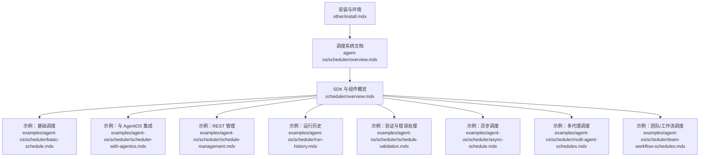
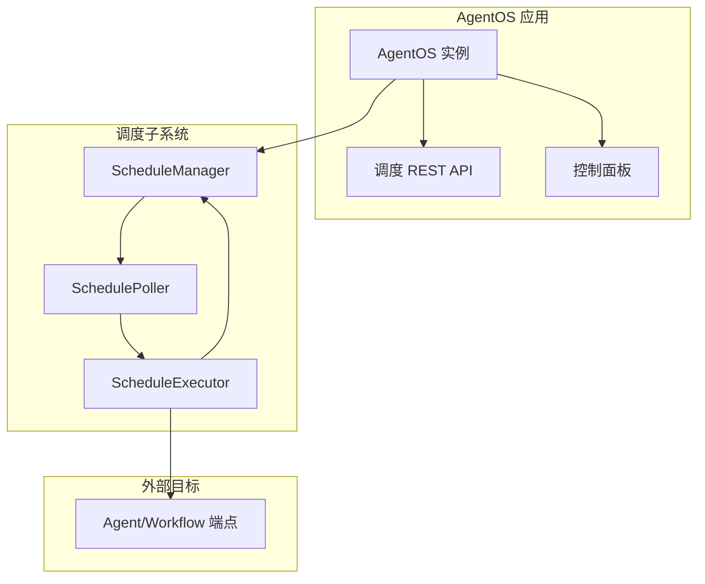
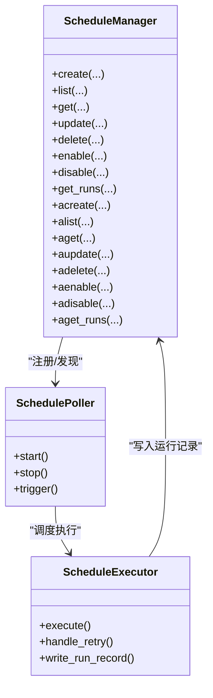
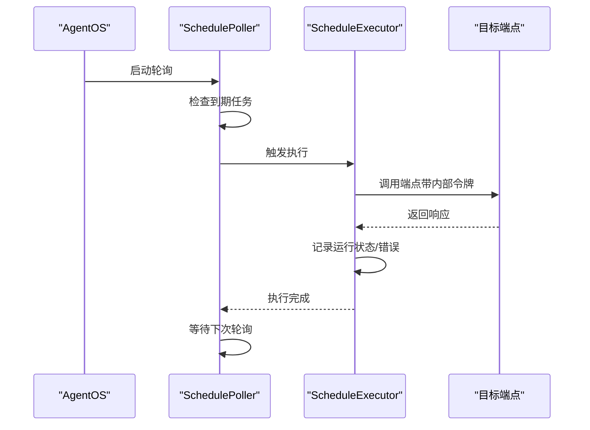
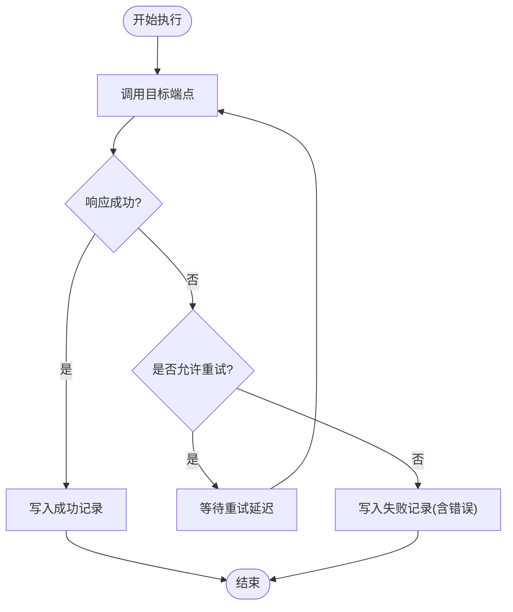
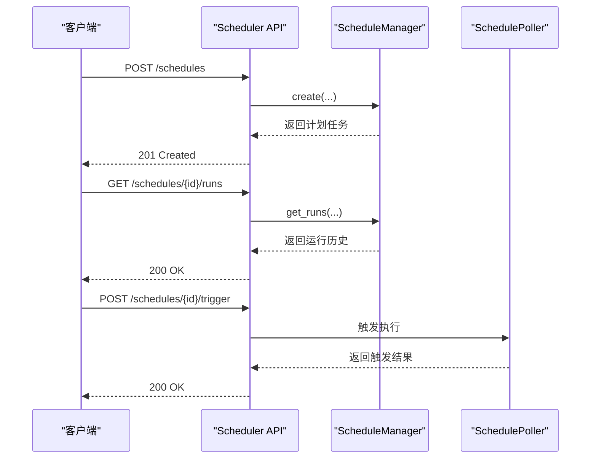
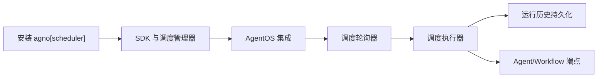

# 调度系统概述

<cite>
**本文引用的文件列表**
- [agent-os/scheduler/overview.mdx](file://agent-os/scheduler/overview.mdx)
- [scheduler/overview.mdx](file://scheduler/overview.mdx)
- [examples/agent-os/scheduler/basic-schedule.mdx](file://examples/agent-os/scheduler/basic-schedule.mdx)
- [examples/agent-os/scheduler/scheduler-with-agentos.mdx](file://examples/agent-os/scheduler/scheduler-with-agentos.mdx)
- [examples/agent-os/scheduler/schedule-management.mdx](file://examples/agent-os/scheduler/schedule-management.mdx)
- [examples/agent-os/scheduler/run-history.mdx](file://examples/agent-os/scheduler/run-history.mdx)
- [examples/agent-os/scheduler/schedule-validation.mdx](file://examples/agent-os/scheduler/schedule-validation.mdx)
- [examples/agent-os/scheduler/async-schedule.mdx](file://examples/agent-os/scheduler/async-schedule.mdx)
- [examples/agent-os/scheduler/multi-agent-schedules.mdx](file://examples/agent-os/scheduler/multi-agent-schedules.mdx)
- [examples/agent-os/scheduler/team-workflow-schedules.mdx](file://examples/agent-os/scheduler/team-workflow-schedules.mdx)
- [examples/agent-os/scheduler/overview.mdx](file://examples/agent-os/scheduler/overview.mdx)
- [other/install.mdx](file://other/install.mdx)
</cite>

## 目录
1. [简介](#简介)
2. [项目结构](#项目结构)
3. [核心组件](#核心组件)
4. [架构总览](#架构总览)
5. [详细组件分析](#详细组件分析)
6. [依赖关系分析](#依赖关系分析)
7. [性能考量](#性能考量)
8. [故障排查指南](#故障排查指南)
9. [结论](#结论)
10. [附录](#附录)

## 简介
本文件为 AgentOS 调度系统（Scheduler）的综合性概述文档，面向希望在 AgentOS 中实现定时任务执行与运行历史追踪的用户与开发者。调度系统提供基于 Cron 的计划任务能力，支持通过内置调度管理器与 REST API 创建、管理、触发与监控任务，并在 AgentOS 控制面板中可视化展示运行历史与配置详情。本文将从安装启用、关键概念、组件职责、工作流程与最佳实践等维度进行系统化阐述，为后续深入使用调度功能打下基础。

## 项目结构
调度系统相关内容主要分布在以下位置：
- 核心文档：agent-os/scheduler/overview.mdx 与 scheduler/overview.mdx
- 示例集合：examples/agent-os/scheduler/ 下包含多种使用场景与 API 演示
- 安装与环境：other/install.mdx 提供通用安装指引

图表来源
- [agent-os/scheduler/overview.mdx:1-105](file://agent-os/scheduler/overview.mdx#L1-L105)
- [scheduler/overview.mdx:1-121](file://scheduler/overview.mdx#L1-L121)
- [examples/agent-os/scheduler/overview.mdx:1-18](file://examples/agent-os/scheduler/overview.mdx#L1-L18)

章节来源
- [agent-os/scheduler/overview.mdx:1-105](file://agent-os/scheduler/overview.mdx#L1-L105)
- [scheduler/overview.mdx:1-121](file://scheduler/overview.mdx#L1-L121)
- [examples/agent-os/scheduler/overview.mdx:1-18](file://examples/agent-os/scheduler/overview.mdx#L1-L18)

## 核心组件
调度系统由以下核心组件构成，分别承担不同职责并协同工作：
- ScheduleManager（调度管理器）
  - 提供 SDK 接口用于创建、查询、更新、启用/禁用、删除计划任务以及查看运行历史
  - 支持同步与异步 CRUD 及运行历史查询
- SchedulePoller（调度轮询器）
  - 周期性检查到期的任务并并发执行
  - 默认轮询间隔可配置（如 15 秒）
- ScheduleExecutor（调度执行器）
  - 调用计划任务的目标端点，处理重试与失败回退
  - 记录每次运行的状态、时间戳、输入输出与错误信息
- Scheduler API（调度 REST API）
  - 对外暴露计划任务生命周期管理与手动触发接口
  - 与 AgentOS 内部服务令牌配合，保障调度器到目标端点的安全调用

章节来源
- [scheduler/overview.mdx:80-88](file://scheduler/overview.mdx#L80-L88)
- [scheduler/overview.mdx:89-98](file://scheduler/overview.mdx#L89-L98)
- [scheduler/overview.mdx:99-109](file://scheduler/overview.mdx#L99-L109)

## 架构总览
调度系统在 AgentOS 中以“内置调度管理器 + REST API + 控制面板”的形式提供完整闭环：用户通过 AgentOS 启用调度器，随后可通过 REST API 或控制面板创建计划任务；调度轮询器周期性发现到期任务并交由执行器调用目标端点；所有运行结果与状态被持久化并可在控制面板中查看。

图表来源
- [scheduler/overview.mdx:35-60](file://scheduler/overview.mdx#L35-L60)
- [scheduler/overview.mdx:80-88](file://scheduler/overview.mdx#L80-L88)

## 详细组件分析

### 组件一：ScheduleManager（调度管理器）
- 职责
  - 计划任务的创建、查询、更新、启用/禁用、删除
  - 运行历史的查询与分页
  - 支持同步与异步 API（acreate、alist、aget、aupdate、adelete、aenable、adisable、aget_runs）
- 关键行为
  - 支持重复名称策略（raise/skip/update）
  - 自动规范化请求方法（如小写 GET 自动转大写）
  - 与数据库交互持久化计划与运行记录

图表来源
- [scheduler/overview.mdx:80-88](file://scheduler/overview.mdx#L80-L88)

章节来源
- [scheduler/overview.mdx:80-88](file://scheduler/overview.mdx#L80-L88)
- [examples/agent-os/scheduler/schedule-validation.mdx:77-86](file://examples/agent-os/scheduler/schedule-validation.mdx#L77-L86)

### 组件二：SchedulePoller（调度轮询器）
- 职责
  - 在固定轮询间隔内扫描到期计划任务
  - 并发执行多个到期任务
- 关键行为
  - 默认轮询间隔可配置（如 15 秒）
  - 与 AgentOS 生命周期集成：启动时自动开始，关闭时停止
  - 与内部服务令牌配合，安全调用目标端点

图表来源
- [scheduler/overview.mdx:35-60](file://scheduler/overview.mdx#L35-L60)
- [examples/agent-os/scheduler/scheduler-with-agentos.mdx:43-57](file://examples/agent-os/scheduler/scheduler-with-agentos.mdx#L43-L57)

章节来源
- [scheduler/overview.mdx:35-60](file://scheduler/overview.mdx#L35-L60)
- [examples/agent-os/scheduler/scheduler-with-agentos.mdx:43-57](file://examples/agent-os/scheduler/scheduler-with-agentos.mdx#L43-L57)

### 组件三：ScheduleExecutor（调度执行器）
- 职责
  - 调用计划任务的目标端点
  - 处理重试与失败回退
  - 将每次运行的详细信息写入运行记录表
- 关键行为
  - 支持最大重试次数与重试延迟
  - 记录运行状态、尝试次数、时间戳、错误信息等

图表来源
- [scheduler/overview.mdx:99-109](file://scheduler/overview.mdx#L99-L109)

章节来源
- [scheduler/overview.mdx:99-109](file://scheduler/overview.mdx#L99-L109)

### 组件四：Scheduler API（调度 REST API）
- 职责
  - 对外提供计划任务的生命周期管理与手动触发接口
  - 与 AgentOS 控制面板集成，支持可视化管理
- 关键端点
  - 创建、列出、获取、更新、删除计划任务
  - 启用/禁用、立即触发
  - 查看运行历史（支持分页）

图表来源
- [agent-os/scheduler/overview.mdx:83-96](file://agent-os/scheduler/overview.mdx#L83-L96)
- [examples/agent-os/scheduler/schedule-management.mdx:34-101](file://examples/agent-os/scheduler/schedule-management.mdx#L34-L101)

章节来源
- [agent-os/scheduler/overview.mdx:83-96](file://agent-os/scheduler/overview.mdx#L83-L96)
- [examples/agent-os/scheduler/schedule-management.mdx:34-101](file://examples/agent-os/scheduler/schedule-management.mdx#L34-L101)

## 依赖关系分析
- 安装依赖
  - 使用调度功能需安装 agno 的调度扩展包
  - 建议在虚拟环境中安装以避免冲突
- AgentOS 集成
  - 通过在 AgentOS 初始化时设置 scheduler=True 启用调度轮询
  - 可配置轮询间隔（默认 15 秒），以及内部服务令牌等参数
- 数据库与持久化
  - 计划任务与运行历史均持久化存储，便于跨进程与重启后恢复
- 外部目标
  - 调度器通过内部服务令牌调用 Agent/Workflow 端点，确保安全

图表来源
- [scheduler/overview.mdx:8-10](file://scheduler/overview.mdx#L8-L10)
- [scheduler/overview.mdx:35-60](file://scheduler/overview.mdx#L35-L60)
- [other/install.mdx:28-36](file://other/install.mdx#L28-L36)

章节来源
- [scheduler/overview.mdx:8-10](file://scheduler/overview.mdx#L8-L10)
- [scheduler/overview.mdx:35-60](file://scheduler/overview.mdx#L35-L60)
- [other/install.mdx:28-36](file://other/install.mdx#L28-L36)

## 性能考量
- 轮询间隔
  - 默认轮询间隔为 15 秒，可根据任务频率与系统负载调整
  - 更短间隔会增加 CPU 与数据库压力，更长间隔可能影响任务及时性
- 并发执行
  - 轮询器支持并发执行多个到期任务，建议合理规划任务数量与资源
- 重试策略
  - 通过 max_retries 与 retry_delay_seconds 控制失败重试，避免雪崩效应
- 运行历史分页
  - 查询运行历史时建议使用分页参数，减少单次响应体积

章节来源
- [scheduler/overview.mdx:95-98](file://scheduler/overview.mdx#L95-L98)
- [scheduler/overview.mdx:99-109](file://scheduler/overview.mdx#L99-L109)

## 故障排查指南
- 常见问题与处理
  - 无效 Cron 表达式或时区：SDK 抛出 ValueError，API 返回 422
  - 重复计划名称：根据 if_exists 策略选择 raise/skip/update
  - 方法大小写：自动规范化为大写（如 GET）
  - 手动触发返回 503：表示执行器尚未就绪，稍后再试
- 运行历史分析
  - 使用 SchedulerConsole 展示富文本表格，支持分页与筛选
  - 通过 get_runs(limit, offset) 获取指定范围的运行记录
- 示例参考
  - 错误处理与验证：参考 schedule-validation 示例
  - 运行历史查看：参考 run-history 示例
  - REST 管理：参考 schedule-management 示例

章节来源
- [examples/agent-os/scheduler/schedule-validation.mdx:28-86](file://examples/agent-os/scheduler/schedule-validation.mdx#L28-L86)
- [examples/agent-os/scheduler/run-history.mdx:95-119](file://examples/agent-os/scheduler/run-history.mdx#L95-L119)
- [examples/agent-os/scheduler/schedule-management.mdx:85-110](file://examples/agent-os/scheduler/schedule-management.mdx#L85-L110)

## 结论
AgentOS 调度系统通过内置的调度管理器与 REST API，为定时任务提供了开箱即用的能力：从计划任务的创建、管理、触发到运行历史的可视化与分析，形成完整的闭环。结合 AgentOS 的控制面板与内部服务令牌机制，调度系统既保证了易用性，也兼顾了安全性与可观测性。建议在生产环境中根据业务负载合理配置轮询间隔与重试策略，并通过运行历史持续优化任务可靠性与性能。

## 附录
- 快速上手
  - 安装：pip install agno[scheduler]
  - 启用：在 AgentOS 初始化时设置 scheduler=True，并配置 scheduler_poll_interval
  - 创建计划：通过 REST API 或控制面板创建计划任务
  - 查看历史：在控制面板或使用 SDK 查询运行历史
- 相关示例
  - 基础调度：basic-schedule
  - 与 AgentOS 集成：scheduler-with-agentos
  - REST 管理：schedule-management
  - 运行历史：run-history
  - 验证与错误处理：schedule-validation
  - 异步调度：async-schedule
  - 多代理调度：multi-agent-schedules
  - 团队/工作流调度：team-workflow-schedules

章节来源
- [scheduler/overview.mdx:8-10](file://scheduler/overview.mdx#L8-L10)
- [scheduler/overview.mdx:35-60](file://scheduler/overview.mdx#L35-L60)
- [examples/agent-os/scheduler/overview.mdx:6-18](file://examples/agent-os/scheduler/overview.mdx#L6-L18)