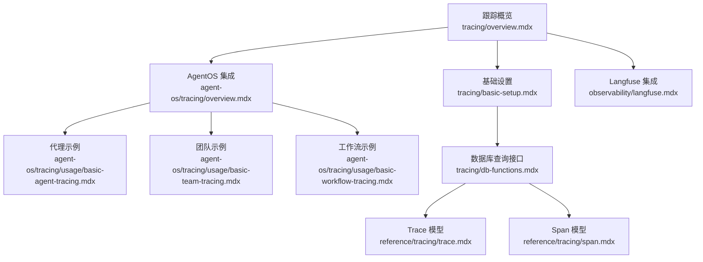
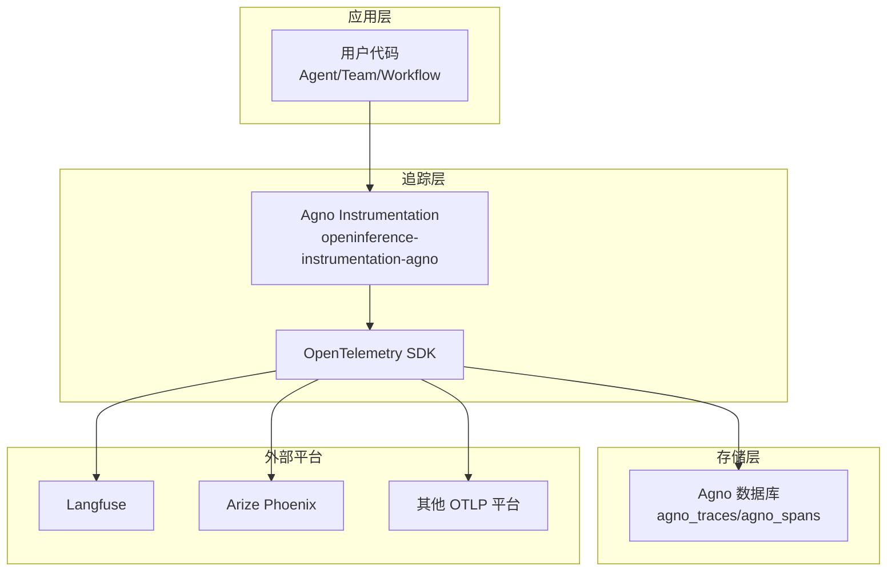
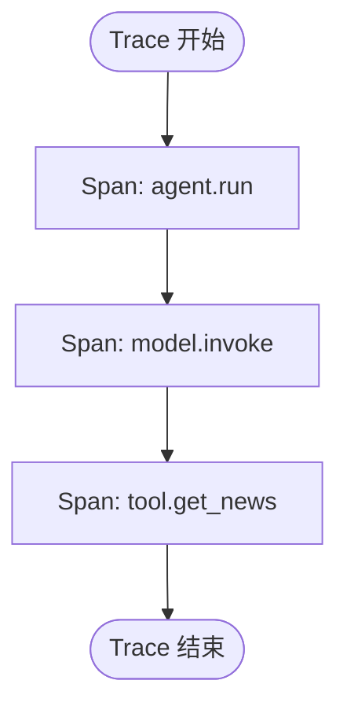
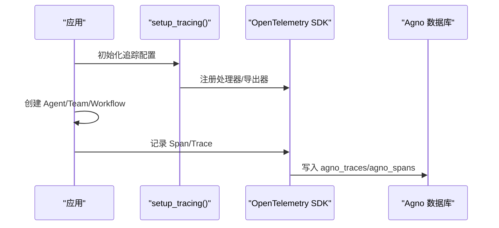
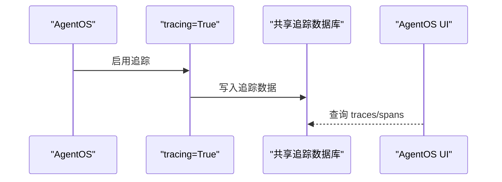
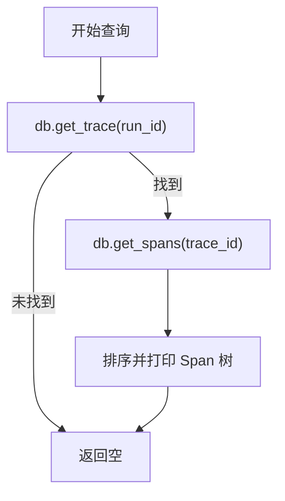
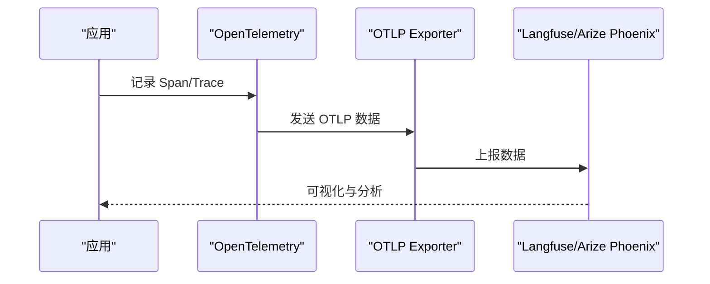
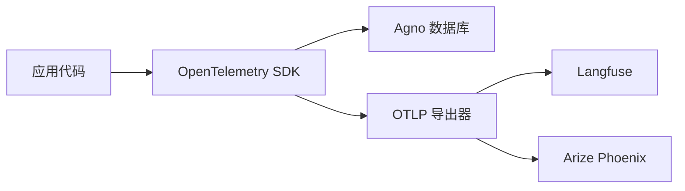
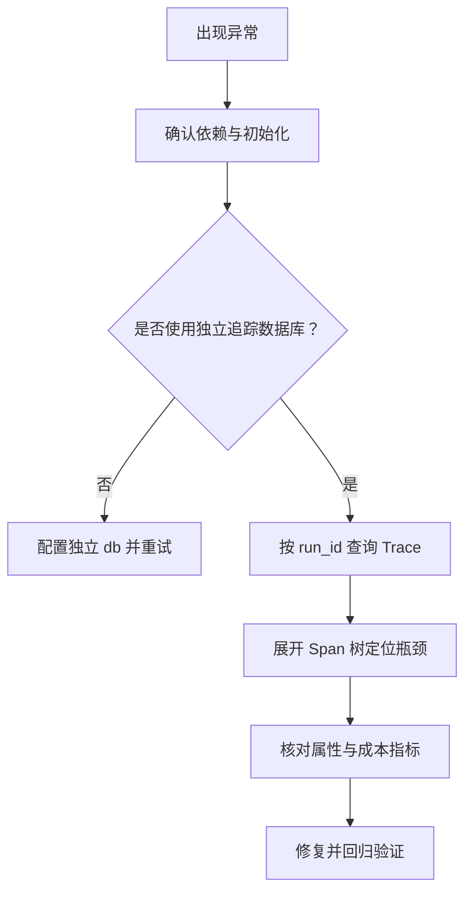

# 跟踪与监控

<cite>
**本文引用的文件**
- [agent-os/tracing/overview.mdx](file://agent-os/tracing/overview.mdx)
- [tracing/overview.mdx](file://tracing/overview.mdx)
- [tracing/basic-setup.mdx](file://tracing/basic-setup.mdx)
- [tracing/db-functions.mdx](file://tracing/db-functions.mdx)
- [agent-os/tracing/usage/basic-agent-tracing.mdx](file://agent-os/tracing/usage/basic-agent-tracing.mdx)
- [agent-os/tracing/usage/basic-team-tracing.mdx](file://agent-os/tracing/usage/basic-team-tracing.mdx)
- [agent-os/tracing/usage/basic-workflow-tracing.mdx](file://agent-os/tracing/usage/basic-workflow-tracing.mdx)
- [examples/agent-os/tracing/basic-agent-tracing.mdx](file://examples/agent-os/tracing/basic-agent-tracing.mdx)
- [examples/agent-os/tracing/basic-team-tracing.mdx](file://examples/agent-os/tracing/basic-team-tracing.mdx)
- [examples/agent-os/tracing/basic-workflow-tracing.mdx](file://examples/agent-os/tracing/basic-workflow-tracing.mdx)
- [reference/tracing/trace.mdx](file://reference/tracing/trace.mdx)
- [reference/tracing/span.mdx](file://reference/tracing/span.mdx)
- [observability/langfuse.mdx](file://observability/langfuse.mdx)
</cite>

## 目录
1. [简介](#简介)
2. [项目结构](#项目结构)
3. [核心组件](#核心组件)
4. [架构总览](#架构总览)
5. [详细组件分析](#详细组件分析)
6. [依赖分析](#依赖分析)
7. [性能考量](#性能考量)
8. [故障排查指南](#故障排查指南)
9. [结论](#结论)
10. [附录](#附录)

## 简介
本技术文档面向 AgentOS 的跟踪与监控体系，系统阐述基于 OpenTelemetry 的追踪设计与实现，涵盖 Trace（追踪）与 Span（跨度）的概念与关系；如何启用与配置跟踪功能（含数据库集成与性能权衡）；以及在代理、团队、工作流等组件上的跟踪示例与最佳实践。同时提供跟踪数据的采集、存储与查询方法，并给出与主流观测性平台（如 Langfuse、Arize Phoenix 等）的对接指引，最后总结故障诊断与性能优化的分析思路。

## 项目结构
围绕“跟踪与监控”，仓库中与之直接相关的内容主要分布在以下位置：
- 根级跟踪概览与快速入门：tracing/overview.mdx、tracing/basic-setup.mdx
- AgentOS 集成与多数据库场景：agent-os/tracing/overview.mdx、agent-os/tracing/usage/*.mdx
- 数据库查询与分析接口：tracing/db-functions.mdx
- 参考模型：reference/tracing/trace.mdx、reference/tracing/span.mdx
- 观测性平台集成：observability/langfuse.mdx 等

图表来源
- [tracing/overview.mdx:1-158](file://tracing/overview.mdx#L1-L158)
- [tracing/basic-setup.mdx:1-233](file://tracing/basic-setup.mdx#L1-L233)
- [agent-os/tracing/overview.mdx:1-184](file://agent-os/tracing/overview.mdx#L1-L184)
- [tracing/db-functions.mdx:1-149](file://tracing/db-functions.mdx#L1-L149)
- [reference/tracing/trace.mdx:1-77](file://reference/tracing/trace.mdx#L1-L77)
- [reference/tracing/span.mdx:1-124](file://reference/tracing/span.mdx#L1-L124)
- [observability/langfuse.mdx:1-133](file://observability/langfuse.mdx#L1-L133)

章节来源
- [tracing/overview.mdx:1-158](file://tracing/overview.mdx#L1-L158)
- [tracing/basic-setup.mdx:1-233](file://tracing/basic-setup.mdx#L1-L233)
- [agent-os/tracing/overview.mdx:1-184](file://agent-os/tracing/overview.mdx#L1-L184)
- [tracing/db-functions.mdx:1-149](file://tracing/db-functions.mdx#L1-L149)
- [reference/tracing/trace.mdx:1-77](file://reference/tracing/trace.mdx#L1-L77)
- [reference/tracing/span.mdx:1-124](file://reference/tracing/span.mdx#L1-L124)
- [observability/langfuse.mdx:1-133](file://observability/langfuse.mdx#L1-L133)

## 核心组件
- 追踪系统（OpenTelemetry + Agno 专用 Instrumentation）
  - 通过安装指定依赖包，系统自动对 Agent/Team/Workflow 的运行、模型调用、工具执行进行无侵入式采样与注入。
  - 支持两种启用方式：独立应用使用 setup_tracing()，或在 AgentOS 中通过 tracing=True 开启。
- 数据存储层
  - 追踪数据写入到 Agno 数据库（SQLite/PostgreSQL 等），默认生成两张表：agno_traces（高层信息）、agno_spans（具体操作）。
  - 建议使用独立的“追踪数据库”集中存放，便于跨组件查询与分析。
- 查询与分析接口
  - 提供便捷的数据库函数：db.get_trace()/get_traces() 获取 Trace；db.get_span()/get_spans() 获取 Span。
  - 支持按 run_id、session_id、agent/team/workflow_id、时间范围等过滤与分页。
- 模型对象
  - Trace：一次完整执行的聚合视图，包含状态、时长、关联实体等。
  - Span：单个操作单元，包含名称、父子层级、属性（如 token 数量）、事件等。

章节来源
- [tracing/overview.mdx:39-89](file://tracing/overview.mdx#L39-L89)
- [tracing/basic-setup.mdx:97-171](file://tracing/basic-setup.mdx#L97-L171)
- [tracing/db-functions.mdx:10-149](file://tracing/db-functions.mdx#L10-L149)
- [reference/tracing/trace.mdx:6-27](file://reference/tracing/trace.mdx#L6-L27)
- [reference/tracing/span.mdx:6-24](file://reference/tracing/span.mdx#L6-L24)

## 架构总览
下图展示了从应用代码到追踪数据落库与外部平台导出的整体流程。

图表来源
- [tracing/overview.mdx:17-17](file://tracing/overview.mdx#L17-L17)
- [observability/langfuse.mdx:6-133](file://observability/langfuse.mdx#L6-L133)

章节来源
- [tracing/overview.mdx:17-17](file://tracing/overview.mdx#L17-L17)
- [observability/langfuse.mdx:6-133](file://observability/langfuse.mdx#L6-L133)

## 详细组件分析

### 概念：Trace 与 Span
- Trace：一次完整的执行（从开始到结束），具有唯一 trace_id，用于将所有相关 Span 组织在一起。
- Span：Trace 内的一个具体操作（如 agent.run、model.invoke、tool 执行），形成父子层级，记录起止时间、状态、属性与事件等。

图表来源
- [tracing/overview.mdx:39-67](file://tracing/overview.mdx#L39-L67)
- [reference/tracing/span.mdx:25-35](file://reference/tracing/span.mdx#L25-L35)

章节来源
- [tracing/overview.mdx:39-67](file://tracing/overview.mdx#L39-L67)
- [reference/tracing/span.mdx:25-35](file://reference/tracing/span.mdx#L25-L35)

### 启用与配置（独立应用）
- 安装依赖：opentelemetry-api、opentelemetry-sdk、openinference-instrumentation-agno。
- 在应用启动阶段调用 setup_tracing(db=...)，即可对后续创建的 Agent/Team/Workflow 自动注入追踪。
- 推荐使用批量处理模式以降低数据库写入压力，并根据吞吐调整队列大小与导出间隔。

图表来源
- [tracing/basic-setup.mdx:21-95](file://tracing/basic-setup.mdx#L21-L95)
- [tracing/basic-setup.mdx:173-221](file://tracing/basic-setup.mdx#L173-L221)

章节来源
- [tracing/basic-setup.mdx:9-28](file://tracing/basic-setup.mdx#L9-L28)
- [tracing/basic-setup.mdx:21-95](file://tracing/basic-setup.mdx#L21-L95)
- [tracing/basic-setup.mdx:173-221](file://tracing/basic-setup.mdx#L173-L221)

### 在 AgentOS 中启用与多数据库场景
- AgentOS 中只需将 tracing=True 即可启用，系统会自动为所有注册的 Agent/Team/Workflow 注入追踪。
- 当存在多个 Agent/Team 使用各自数据库时，强烈建议提供一个独立的 db 参数作为“追踪数据库”，确保所有追踪数据集中存储，便于统一查询与分析。

图表来源
- [agent-os/tracing/overview.mdx:30-41](file://agent-os/tracing/overview.mdx#L30-L41)
- [agent-os/tracing/overview.mdx:137-182](file://agent-os/tracing/overview.mdx#L137-L182)

章节来源
- [agent-os/tracing/overview.mdx:28-41](file://agent-os/tracing/overview.mdx#L28-L41)
- [agent-os/tracing/overview.mdx:137-182](file://agent-os/tracing/overview.mdx#L137-L182)

### 数据库查询与分析接口
- Trace 查询
  - db.get_trace(trace_id|run_id)：按 trace_id 或 run_id 获取单条 Trace。
  - db.get_traces(...，支持按 agent_id、team_id、workflow_id、时间范围、分页等过滤。
- Span 查询
  - db.get_span(span_id)：按 span_id 获取单个 Span。
  - db.get_spans(trace_id|parent_span_id)：获取某个 Trace 下的所有 Span 或某个父 Span 的子 Span。
- 示例：按 run_id 获取 Trace 并打印其 Span 树，可用于定位耗时与错误节点。

图表来源
- [tracing/db-functions.mdx:12-74](file://tracing/db-functions.mdx#L12-L74)
- [tracing/db-functions.mdx:97-121](file://tracing/db-functions.mdx#L97-L121)
- [tracing/db-functions.mdx:122-142](file://tracing/db-functions.mdx#L122-L142)

章节来源
- [tracing/db-functions.mdx:10-149](file://tracing/db-functions.mdx#L10-L149)

### 代理、团队、工作流的跟踪示例与最佳实践
- 代理示例
  - 在 AgentOS 中仅需 tracing=True 即可捕获该代理的 run、模型调用与工具执行。
  - 示例路径：examples/agent-os/tracing/basic-agent-tracing.mdx
- 团队示例
  - tracing=True 同时覆盖团队内部成员的协作与各自 run。
  - 示例路径：examples/agent-os/tracing/basic-team-tracing.mdx
- 工作流示例
  - tracing=True 捕获步骤执行、条件判断、工具调用等全链路信息。
  - 示例路径：examples/agent-os/tracing/basic-workflow-tracing.mdx
- 最佳实践
  - 生产环境使用独立追踪数据库，避免与业务数据混存。
  - 使用批量处理模式，合理设置队列与导出间隔。
  - 对关键路径（模型调用、工具执行）建立基线时延与错误率指标。

章节来源
- [examples/agent-os/tracing/basic-agent-tracing.mdx:1-64](file://examples/agent-os/tracing/basic-agent-tracing.mdx#L1-L64)
- [examples/agent-os/tracing/basic-team-tracing.mdx:1-73](file://examples/agent-os/tracing/basic-team-tracing.mdx#L1-L73)
- [examples/agent-os/tracing/basic-workflow-tracing.mdx:1-133](file://examples/agent-os/tracing/basic-workflow-tracing.mdx#L1-L133)
- [agent-os/tracing/usage/basic-agent-tracing.mdx:1-75](file://agent-os/tracing/usage/basic-agent-tracing.mdx#L1-L75)
- [agent-os/tracing/usage/basic-team-tracing.mdx:1-85](file://agent-os/tracing/usage/basic-team-tracing.mdx#L1-L85)
- [agent-os/tracing/usage/basic-workflow-tracing.mdx:1-145](file://agent-os/tracing/usage/basic-workflow-tracing.mdx#L1-L145)

### 与主流观测性平台的集成
- Langfuse
  - 通过 OpenInference 或 OpenLIT 将 OpenTelemetry Span 导出至 Langfuse（OTLP）。
  - 需要设置公开/私有密钥与正确的 OTLP 端点（按区域选择）。
- Arize Phoenix
  - 作为 OTLP 兼容平台，可直接接收来自 OpenTelemetry 的导出数据，实现统一的模型与链路观测。
- 其他平台
  - 任何支持 OTLP 的平台均可接入，只需配置相应的端点与认证参数。

图表来源
- [observability/langfuse.mdx:34-133](file://observability/langfuse.mdx#L34-L133)

章节来源
- [observability/langfuse.mdx:6-133](file://observability/langfuse.mdx#L6-L133)

## 依赖分析
- 组件耦合
  - 应用层与追踪层通过 OpenTelemetry SDK 解耦；Agno Instrumentation 负责语义化标注与上下文传播。
  - 存储层与查询接口解耦于具体数据库类型，统一通过 db.get_* 函数访问。
- 外部依赖
  - OpenTelemetry 生态（SDK、导出器、处理器）
  - 平台侧 OTLP 端点与认证（Langfuse、Arize Phoenix 等）

图表来源
- [tracing/overview.mdx:17-17](file://tracing/overview.mdx#L17-L17)
- [observability/langfuse.mdx:34-133](file://observability/langfuse.mdx#L34-L133)

章节来源
- [tracing/overview.mdx:17-17](file://tracing/overview.mdx#L17-L17)
- [observability/langfuse.mdx:34-133](file://observability/langfuse.mdx#L34-L133)

## 性能考量
- 批量处理模式
  - 优点：降低数据库写入频率，减少 IO 抖动，提升整体吞吐。
  - 注意：内存缓冲可能带来短暂延迟与崩溃丢失风险，需结合业务容忍度配置队列与导出间隔。
- 简单处理模式
  - 优点：实时性强，无需内存缓冲。
  - 注意：写入更频繁，对数据库与应用性能影响更大。
- 建议
  - 生产优先批量模式，开发调试可用简单模式。
  - 结合业务峰值与 SLA，动态调整 max_queue_size、max_export_batch_size、schedule_delay_millis。

章节来源
- [tracing/basic-setup.mdx:173-221](file://tracing/basic-setup.mdx#L173-L221)

## 故障排查指南
- 常见问题
  - 未看到 Trace：确认已安装所需依赖并在应用启动阶段调用 setup_tracing() 或在 AgentOS 中设置 tracing=True。
  - 追踪分散：当各组件使用不同数据库时，务必传入独立 db 作为追踪数据库。
  - 查询不到数据：检查过滤条件（agent_id、时间范围、分页）是否正确。
- 分析方法
  - 以 run_id 为线索，先查 Trace，再查该 Trace 下的 Span 树，定位耗时与错误节点。
  - 利用 Span 属性（如 llm.token_count.*）评估成本与效率。
  - 对比不同 Agent/Team/Workflow 的 Trace 统计，识别异常模式。

图表来源
- [tracing/basic-setup.mdx:97-171](file://tracing/basic-setup.mdx#L97-L171)
- [tracing/db-functions.mdx:122-142](file://tracing/db-functions.mdx#L122-L142)
- [reference/tracing/span.mdx:36-55](file://reference/tracing/span.mdx#L36-L55)

章节来源
- [tracing/basic-setup.mdx:97-171](file://tracing/basic-setup.mdx#L97-L171)
- [tracing/db-functions.mdx:122-142](file://tracing/db-functions.mdx#L122-L142)
- [reference/tracing/span.mdx:36-55](file://reference/tracing/span.mdx#L36-L55)

## 结论
AgentOS 的跟踪与监控以 OpenTelemetry 为核心，提供零代码侵入的自动采样与存储能力。通过 Trace 与 Span 的清晰分层，配合独立追踪数据库与丰富的查询接口，既能满足日常调试与性能分析，也能与 Langfuse、Arize Phoenix 等平台无缝对接，构建完整的可观测性闭环。生产实践中应优先采用批量处理与独立追踪数据库策略，持续优化导出参数与查询维度，以获得稳定、可扩展且高价值的观测数据。

## 附录
- 快速上手清单
  - 安装依赖：opentelemetry-api、opentelemetry-sdk、openinference-instrumentation-agno。
  - 独立应用：调用 setup_tracing(db=...)；AgentOS：tracing=True。
  - 建议：使用独立追踪数据库，开启批量处理，按需导出至外部平台。
- 参考模型
  - Trace：包含 trace_id、name、status、duration_ms、start/end_time、关联实体等。
  - Span：包含 span_id、trace_id、parent_span_id、name、status_code/message、duration_ms、attributes、events、kind 等。

章节来源
- [reference/tracing/trace.mdx:6-27](file://reference/tracing/trace.mdx#L6-L27)
- [reference/tracing/span.mdx:6-24](file://reference/tracing/span.mdx#L6-L24)