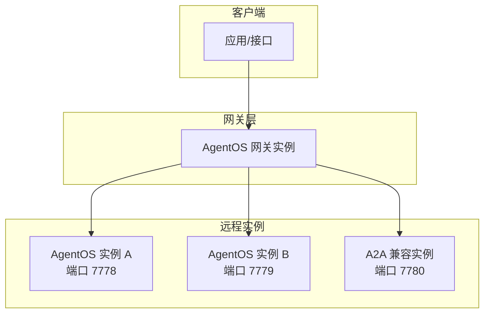
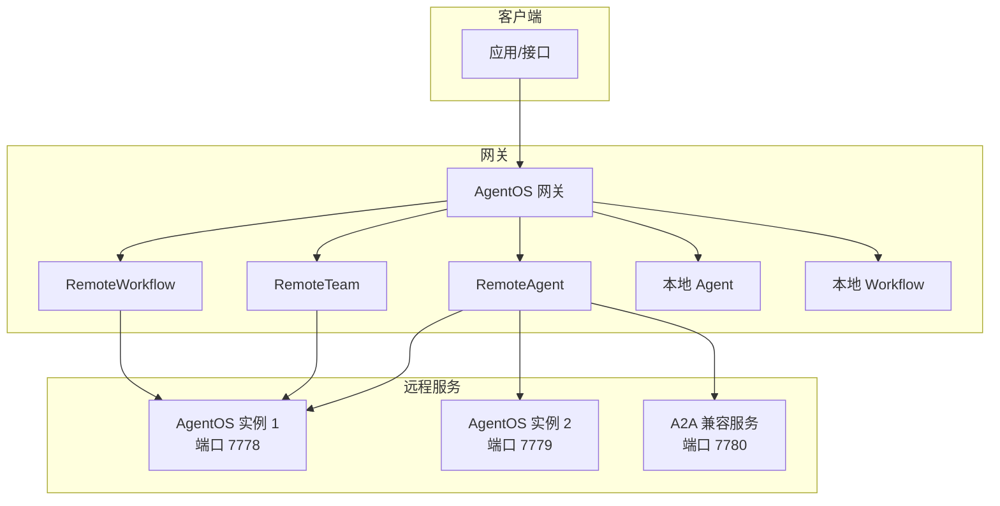
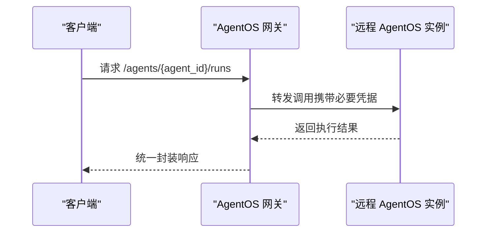
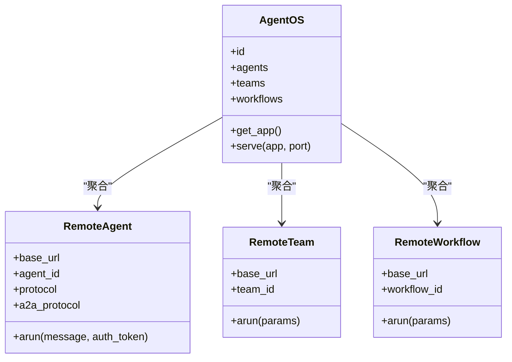
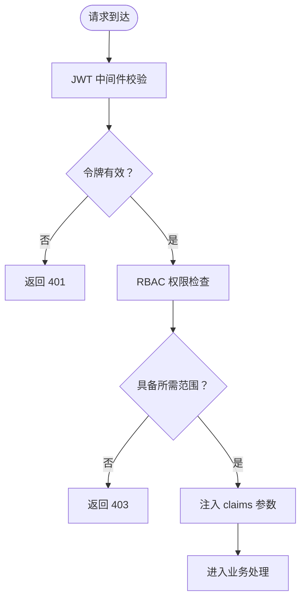
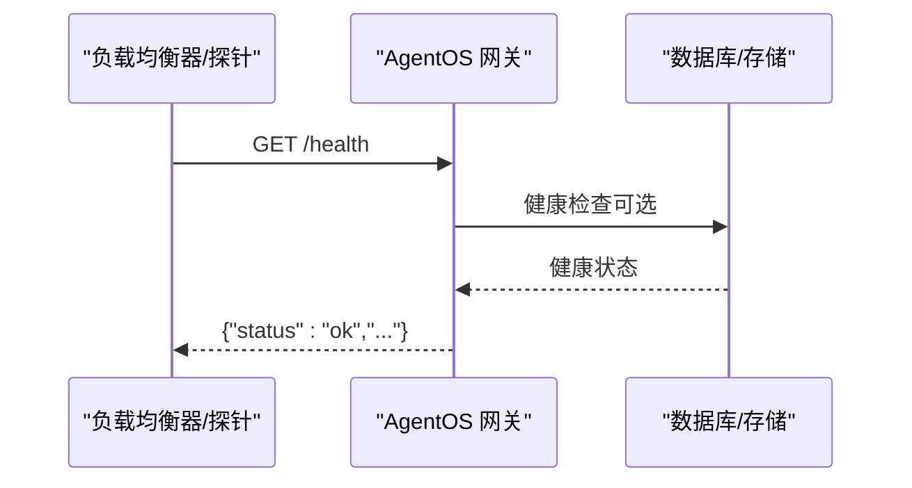
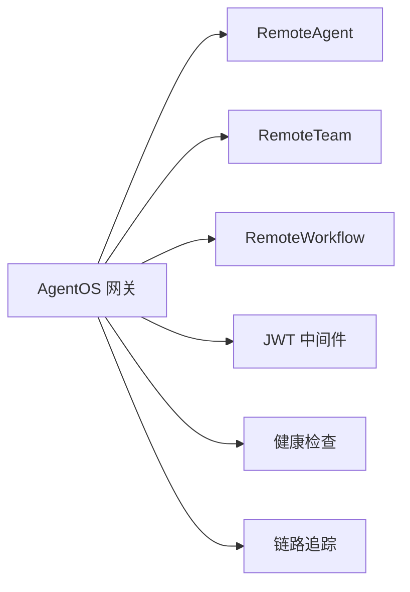

# 网关模式

<cite>
**本文引用的文件**
- [gateway.mdx](file://agent-os/remote-execution/gateway.mdx)
- [overview.mdx](file://agent-os/remote-execution/overview.mdx)
- [remote-agent.mdx](file://reference/agents/remote-agent.mdx)
- [agent-os-gateway.mdx](file://examples/agent-os/remote/agent-os-gateway.mdx)
- [security-overview.mdx](file://agent-os/security/overview.mdx)
- [rbac.mdx](file://agent-os/security/rbac.mdx)
- [jwt.mdx](file://agent-os/middleware/jwt.mdx)
- [deploy-introduction.mdx](file://deploy/introduction.mdx)
- [domain-https.mdx](file://production/templates/customize-aws/domain-https.mdx)
- [health-check.mdx](file://reference-api/schema/health/health-check.mdx)
- [custom-health-endpoint.mdx](file://examples/agent-os/customize/custom-health-endpoint.mdx)
- [tracing-overview.mdx](file://tracing/overview.mdx)
- [agent-os-tracing-overview.mdx](file://agent-os/tracing/overview.mdx)
</cite>

## 目录
1. [引言](#引言)
2. [项目结构](#项目结构)
3. [核心组件](#核心组件)
4. [架构总览](#架构总览)
5. [详细组件分析](#详细组件分析)
6. [依赖关系分析](#依赖关系分析)
7. [性能考量](#性能考量)
8. [故障排查指南](#故障排查指南)
9. [结论](#结论)
10. [附录](#附录)

## 引言
本文件围绕 AgentOS 的“网关模式”展开，系统性阐述如何通过统一 API 网关聚合多个 AgentOS 实例（本地与远程），并在此基础上实现分布式系统的统一入口、负载分发、微服务拆分与混合部署。文档同时覆盖认证授权、安全考虑、部署最佳实践与监控方案，帮助读者从概念到落地构建高可用、可扩展的分布式智能体基础设施。

## 项目结构
与网关模式直接相关的核心文档分布在以下路径：
- 远程执行与网关：agent-os/remote-execution/gateway.mdx、agent-os/remote-execution/overview.mdx
- 远程组件使用参考：reference/agents/remote-agent.mdx
- 端到端示例：examples/agent-os/remote/agent-os-gateway.mdx
- 安全与访问控制：agent-os/security/overview.mdx、agent-os/security/rbac.mdx、agent-os/middleware/jwt.mdx
- 部署与 HTTPS：deploy/introduction.mdx、production/templates/customize-aws/domain-https.mdx
- 健康检查与可观测性：reference-api/schema/health/health-check.mdx、examples/agent-os/customize/custom-health-endpoint.mdx、tracing/overview.mdx、agent-os/tracing/overview.mdx

图示来源
- [gateway.mdx:16-45](file://agent-os/remote-execution/gateway.mdx#L16-L45)
- [overview.mdx:41-121](file://agent-os/remote-execution/overview.mdx#L41-L121)

章节来源
- [gateway.mdx:1-174](file://agent-os/remote-execution/gateway.mdx#L1-L174)
- [overview.mdx:1-163](file://agent-os/remote-execution/overview.mdx#L1-L163)

## 核心组件
- 网关实例（AgentOS）：作为统一入口，聚合本地与远程的 Agent、Team、Workflow。
- 远程组件：
  - RemoteAgent：连接远程 AgentOS 或 A2A 兼容服务器。
  - RemoteTeam：连接远程团队。
  - RemoteWorkflow：连接远程工作流（当前不支持 WebSocket）。
- 安全中间件（JWT + RBAC）：提供令牌验证、参数注入与细粒度权限控制。
- 健康检查与可观测性：内置 /health 与自定义健康端点；链路追踪用于调试与性能分析。

章节来源
- [gateway.mdx:16-157](file://agent-os/remote-execution/gateway.mdx#L16-L157)
- [remote-agent.mdx:281-319](file://reference/agents/remote-agent.mdx#L281-L319)
- [rbac.mdx:21-45](file://agent-os/security/rbac.mdx#L21-L45)
- [jwt.mdx:20-35](file://agent-os/middleware/jwt.mdx#L20-L35)
- [health-check.mdx:1-3](file://reference-api/schema/health/health-check.mdx#L1-L3)

## 架构总览
下图展示了网关如何聚合多源 AgentOS 实例，并通过统一 API 暴露能力，同时保留本地组件与远程组件的混合部署能力。

图示来源
- [gateway.mdx:16-157](file://agent-os/remote-execution/gateway.mdx#L16-L157)
- [overview.mdx:93-121](file://agent-os/remote-execution/overview.mdx#L93-L121)
- [remote-agent.mdx:281-298](file://reference/agents/remote-agent.mdx#L281-L298)

## 详细组件分析

### 组件一：AgentOS 网关（统一入口）
- 职责：聚合本地与远程的 Agent、Team、Workflow，暴露统一 API。
- 关键点：
  - 支持混合部署：本地组件与远程组件共存于同一网关。
  - 协议兼容：RemoteAgent 可连接 AgentOS 协议或 A2A 协议（REST/JSON-RPC）。
  - 认证注意事项：若远程服务器启用授权，需放开 /config、/agents、/teams、/workflows 及其详情端点，否则网关功能受限。

图示来源
- [gateway.mdx:161-174](file://agent-os/remote-execution/gateway.mdx#L161-L174)
- [overview.mdx:93-121](file://agent-os/remote-execution/overview.mdx#L93-L121)

章节来源
- [gateway.mdx:16-157](file://agent-os/remote-execution/gateway.mdx#L16-L157)
- [overview.mdx:93-121](file://agent-os/remote-execution/overview.mdx#L93-L121)

### 组件二：远程组件（RemoteAgent/Team/Workflow）
- RemoteAgent：支持两种协议
  - AgentOS 协议：默认，连接标准 REST API。
  - A2A 协议：支持 REST 与 JSON-RPC（如 Google ADK）。
- RemoteTeam/RemoteWorkflow：用于远程团队与工作流的运行与编排。
- 注意事项：当前远程工作流不支持 WebSocket。

图示来源
- [gateway.mdx:20-45](file://agent-os/remote-execution/gateway.mdx#L20-L45)
- [remote-agent.mdx:273-298](file://reference/agents/remote-agent.mdx#L273-L298)

章节来源
- [remote-agent.mdx:273-319](file://reference/agents/remote-agent.mdx#L273-L319)
- [agent-os-gateway.mdx:1-198](file://examples/agent-os/remote/agent-os-gateway.mdx#L1-L198)

### 组件三：安全与访问控制（JWT + RBAC）
- 基础认证：开发环境可用，生产建议使用 RBAC。
- RBAC：基于 JWT 的细粒度授权，支持资源级与动作级权限。
- JWT 中间件：自动注入 user_id、session_id、dependencies 等参数，支持多种令牌来源（Header/Cookie/Both）。
- 授权配置：可通过 AuthorizationConfig 或环境变量配置公钥/JWKS 文件，支持自定义范围映射。

图示来源
- [rbac.mdx:328-373](file://agent-os/security/rbac.mdx#L328-L373)
- [jwt.mdx:152-194](file://agent-os/middleware/jwt.mdx#L152-L194)

章节来源
- [security-overview.mdx:14-53](file://agent-os/security/overview.mdx#L14-L53)
- [rbac.mdx:21-45](file://agent-os/security/rbac.mdx#L21-L45)
- [jwt.mdx:20-176](file://agent-os/middleware/jwt.mdx#L20-L176)

### 组件四：健康检查与可观测性
- 健康检查：内置 /health；可添加自定义健康端点。
- 可观测性：链路追踪（Tracing）记录一次完整执行的 Trace 与 Span，便于调试、性能分析与成本跟踪。

图示来源
- [health-check.mdx:1-3](file://reference-api/schema/health/health-check.mdx#L1-L3)
- [custom-health-endpoint.mdx:46-58](file://examples/agent-os/customize/custom-health-endpoint.mdx#L46-L58)

章节来源
- [health-check.mdx:1-3](file://reference-api/schema/health/health-check.mdx#L1-L3)
- [custom-health-endpoint.mdx:1-85](file://examples/agent-os/customize/custom-health-endpoint.mdx#L1-L85)
- [tracing-overview.mdx:23-59](file://tracing/overview.mdx#L23-L59)
- [agent-os-tracing-overview.mdx:163-182](file://agent-os/tracing/overview.mdx#L163-L182)

## 依赖关系分析
- 网关对远程实例的依赖：通过 RemoteAgent/Team/Workflow 间接依赖远程 REST/A2A 接口。
- 网关对安全中间件的依赖：通过 JWT 中间件实现统一认证与授权。
- 网关对健康检查与可观测性的依赖：内置 /health 与可选自定义健康端点；Tracing 提供链路追踪能力。

图示来源
- [gateway.mdx:16-157](file://agent-os/remote-execution/gateway.mdx#L16-L157)
- [jwt.mdx:20-35](file://agent-os/middleware/jwt.mdx#L20-L35)
- [health-check.mdx:1-3](file://reference-api/schema/health/health-check.mdx#L1-L3)
- [tracing-overview.mdx:23-59](file://tracing/overview.mdx#L23-L59)

章节来源
- [gateway.mdx:16-157](file://agent-os/remote-execution/gateway.mdx#L16-L157)
- [jwt.mdx:20-176](file://agent-os/middleware/jwt.mdx#L20-L176)

## 性能考量
- 负载分布：通过将不同类型的 Agent 分散至多个 AgentOS 实例，实现跨节点的负载分发。
- 连接与超时：合理设置远程调用的超时与重试策略，避免单点阻塞。
- 缓存与预热：对常用查询与检索类 Agent 进行缓存与预热，降低延迟。
- 并发与限流：结合网关侧并发限制与下游实例的限流策略，保障整体稳定性。
- 观测性：利用链路追踪定位瓶颈，结合指标与日志进行容量规划。

## 故障排查指南
- 认证问题
  - 现象：网关无法正确转发或返回 401/403。
  - 处理：确认远程实例的 /config、/agents、/teams、/workflows 及其详情端点未被强制保护；确保 JWT 正确传递且范围匹配。
- 远程不可达
  - 现象：调用远端 Agent/Team/Workflow 抛出“服务器不可用”错误。
  - 处理：检查网络连通性、端口开放情况与防火墙策略；确认远程实例已启动且健康。
- 健康检查失败
  - 现象：/health 返回异常或探针持续失败。
  - 处理：查看应用启动日志与数据库连接状态；确认自定义健康端点逻辑正确。
- HTTPS 与域名
  - 现象：HTTPS 不生效或证书未被加载。
  - 处理：确保 ACM 证书已签发并正确配置监听器；按模板更新监听器以实现 HTTP→HTTPS 跳转。

章节来源
- [gateway.mdx:161-174](file://agent-os/remote-execution/gateway.mdx#L161-L174)
- [rbac.mdx:367-373](file://agent-os/security/rbac.mdx#L367-L373)
- [domain-https.mdx:41-89](file://production/templates/customize-aws/domain-https.mdx#L41-L89)
- [custom-health-endpoint.mdx:46-58](file://examples/agent-os/customize/custom-health-endpoint.mdx#L46-L58)

## 结论
AgentOS 网关模式通过统一入口聚合本地与远程智能体能力，既满足微服务拆分与混合部署的需求，又保持了统一的 API 体验。配合 JWT + RBAC 的安全体系、完善的健康检查与可观测性，以及标准化的部署与 HTTPS 配置流程，可支撑从开发到生产的全生命周期需求。建议在生产中启用 RBAC、配置 HTTPS、完善健康检查与链路追踪，并制定合理的负载与故障转移策略。

## 附录
- 快速开始
  - 启动远程 AgentOS 实例与网关实例，使用客户端通过网关统一调用。
- 最佳实践
  - 使用 RBAC 控制访问范围；为远程实例配置必要的豁免端点；启用 HTTPS 并开启 HTTP→HTTPS 跳转；定期检查 /health 与链路追踪数据。
- 参考示例
  - 端到端网关示例：包含 AgentOS 协议、A2A 协议与本地组件的组合。

章节来源
- [overview.mdx:41-121](file://agent-os/remote-execution/overview.mdx#L41-L121)
- [agent-os-gateway.mdx:169-181](file://examples/agent-os/remote/agent-os-gateway.mdx#L169-L181)
- [deploy-introduction.mdx:11-101](file://deploy/introduction.mdx#L11-L101)