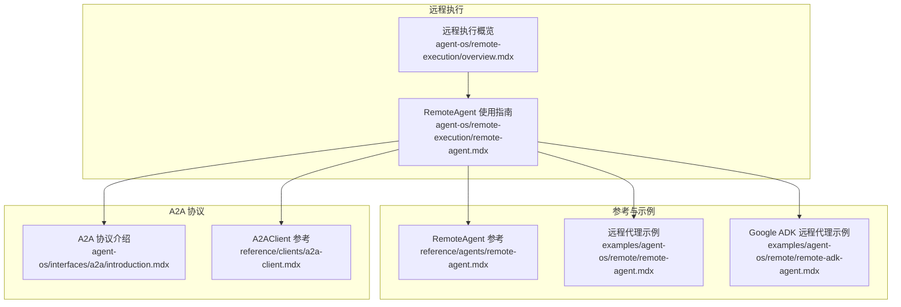
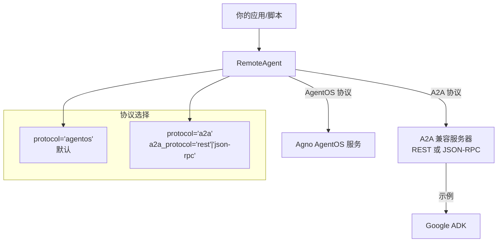
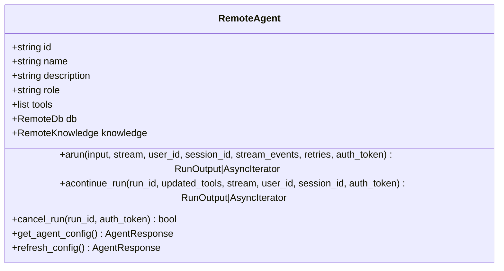
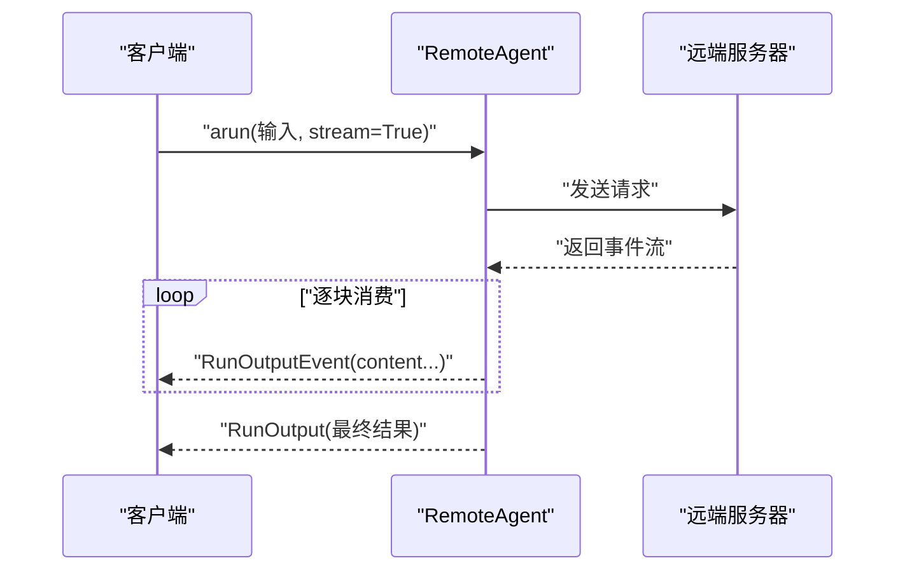
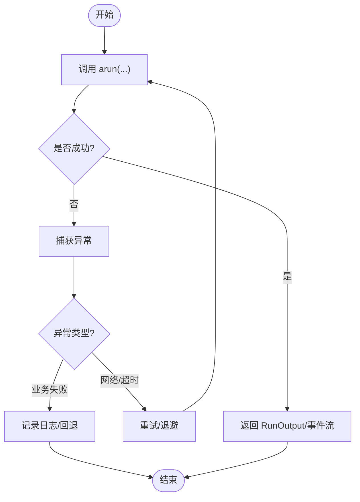
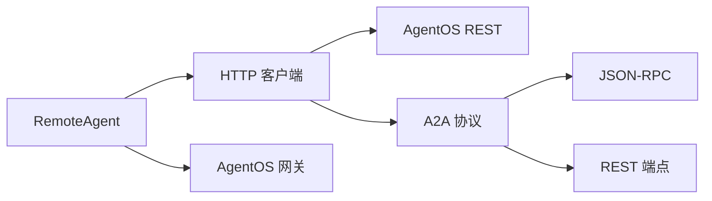

# 远程代理

<cite>
**本文引用的文件**
- [agent-os/remote-execution/remote-agent.mdx](file://agent-os/remote-execution/remote-agent.mdx)
- [reference/agents/remote-agent.mdx](file://reference/agents/remote-agent.mdx)
- [examples/agent-os/remote/remote-agent.mdx](file://examples/agent-os/remote/remote-agent.mdx)
- [examples/agent-os/remote/remote-adk-agent.mdx](file://examples/agent-os/remote/remote-adk-agent.mdx)
- [agent-os/interfaces/a2a/introduction.mdx](file://agent-os/interfaces/a2a/introduction.mdx)
- [reference/clients/a2a-client.mdx](file://reference/clients/a2a-client.mdx)
- [agent-os/remote-execution/overview.mdx](file://agent-os/remote-execution/overview.mdx)
- [agent-os/usage/remote-execution/remote-agent.mdx](file://agent-os/usage/remote-execution/remote-agent.mdx)
</cite>

## 目录
1. [简介](#简介)
2. [项目结构](#项目结构)
3. [核心组件](#核心组件)
4. [架构总览](#架构总览)
5. [详细组件分析](#详细组件分析)
6. [依赖关系分析](#依赖关系分析)
7. [性能考量](#性能考量)
8. [故障排除指南](#故障排除指南)
9. [结论](#结论)
10. [附录](#附录)

## 简介
本技术文档围绕远程代理（RemoteAgent）展开，系统性阐述其在分布式代理执行场景中的实现原理、配置方式与使用方法。内容覆盖以下要点：
- 代理 ID、基础 URL 与协议配置
- A2A 协议支持与 JSON-RPC 设置
- 同步与异步调用差异
- 错误处理与重试机制
- 实际代码示例路径与最佳实践
- 故障排除与常见问题

## 项目结构
与远程代理直接相关的文档主要分布在以下位置：
- 使用指南：agent-os/remote-execution/remote-agent.mdx、agent-os/usage/remote-execution/remote-agent.mdx
- 参考手册：reference/agents/remote-agent.mdx
- 示例：examples/agent-os/remote/remote-agent.mdx、examples/agent-os/remote/remote-adk-agent.mdx
- A2A 接口与协议：agent-os/interfaces/a2a/introduction.mdx、reference/clients/a2a-client.mdx
- 概览与快速入门：agent-os/remote-execution/overview.mdx

图表来源
- [agent-os/remote-execution/remote-agent.mdx:1-156](file://agent-os/remote-execution/remote-agent.mdx#L1-L156)
- [reference/agents/remote-agent.mdx:1-320](file://reference/agents/remote-agent.mdx#L1-L320)
- [examples/agent-os/remote/remote-agent.mdx:1-93](file://examples/agent-os/remote/remote-agent.mdx#L1-L93)
- [examples/agent-os/remote/remote-adk-agent.mdx:1-132](file://examples/agent-os/remote/remote-adk-agent.mdx#L1-L132)
- [agent-os/interfaces/a2a/introduction.mdx:1-149](file://agent-os/interfaces/a2a/introduction.mdx#L1-L149)
- [reference/clients/a2a-client.mdx:1-40](file://reference/clients/a2a-client.mdx#L1-L40)
- [agent-os/remote-execution/overview.mdx:1-163](file://agent-os/remote-execution/overview.mdx#L1-L163)

章节来源
- [agent-os/remote-execution/remote-agent.mdx:1-156](file://agent-os/remote-execution/remote-agent.mdx#L1-L156)
- [reference/agents/remote-agent.mdx:1-320](file://reference/agents/remote-agent.mdx#L1-L320)
- [examples/agent-os/remote/remote-agent.mdx:1-93](file://examples/agent-os/remote/remote-agent.mdx#L1-L93)
- [examples/agent-os/remote/remote-adk-agent.mdx:1-132](file://examples/agent-os/remote/remote-adk-agent.mdx#L1-L132)
- [agent-os/interfaces/a2a/introduction.mdx:1-149](file://agent-os/interfaces/a2a/introduction.mdx#L1-L149)
- [reference/clients/a2a-client.mdx:1-40](file://reference/clients/a2a-client.mdx#L1-L40)
- [agent-os/remote-execution/overview.mdx:1-163](file://agent-os/remote-execution/overview.mdx#L1-L163)

## 核心组件
- RemoteAgent：用于连接并调用远端 AgentOS 或 A2A 兼容服务器上的代理实例，提供与本地代理一致的接口。
- A2AClient：面向 A2A 协议的低层客户端，支持 REST 与 JSON-RPC 两种模式。
- AgentOS 客户端与网关：支持将多个远程代理聚合为统一入口。

章节来源
- [reference/agents/remote-agent.mdx:1-320](file://reference/agents/remote-agent.mdx#L1-L320)
- [reference/clients/a2a-client.mdx:1-40](file://reference/clients/a2a-client.mdx#L1-L40)
- [agent-os/remote-execution/overview.mdx:19-37](file://agent-os/remote-execution/overview.mdx#L19-L37)

## 架构总览
RemoteAgent 支持两类通信协议：
- AgentOS 协议：默认协议，适用于 Agno AgentOS REST API。
- A2A 协议：通过 REST 或 JSON-RPC 与 A2A 兼容服务器交互，典型如 Google ADK。

图表来源
- [reference/agents/remote-agent.mdx:31-41](file://reference/agents/remote-agent.mdx#L31-L41)
- [reference/agents/remote-agent.mdx:273-280](file://reference/agents/remote-agent.mdx#L273-L280)
- [agent-os/interfaces/a2a/introduction.mdx:109-141](file://agent-os/interfaces/a2a/introduction.mdx#L109-L141)
- [examples/agent-os/remote/remote-adk-agent.mdx:30-50](file://examples/agent-os/remote/remote-adk-agent.mdx#L30-L50)

章节来源
- [reference/agents/remote-agent.mdx:31-41](file://reference/agents/remote-agent.mdx#L31-L41)
- [reference/agents/remote-agent.mdx:273-280](file://reference/agents/remote-agent.mdx#L273-L280)
- [agent-os/interfaces/a2a/introduction.mdx:109-141](file://agent-os/interfaces/a2a/introduction.mdx#L109-L141)
- [examples/agent-os/remote/remote-adk-agent.mdx:30-50](file://examples/agent-os/remote/remote-adk-agent.mdx#L30-L50)

## 详细组件分析

### RemoteAgent 参数与属性
- 关键参数
  - base_url：远端服务器的基础地址（例如 http://localhost:7777）
  - agent_id：要调用的远端代理 ID
  - protocol：通信协议，可选 "agentos" 或 "a2a"
  - a2a_protocol：当 protocol="a2a" 时生效，可选 "rest" 或 "json-rpc"
  - timeout：请求超时（秒）
  - config_ttl：配置缓存 TTL（秒）

- 常用属性
  - id、name、description、role、tools、db、knowledge

- 方法
  - arun：异步执行代理；支持非流式与流式响应
  - acontinue_run：继续暂停的运行（工具结果）
  - cancel_run：取消运行
  - get_agent_config：获取最新配置
  - refresh_config：强制刷新配置缓存

章节来源
- [reference/agents/remote-agent.mdx:31-41](file://reference/agents/remote-agent.mdx#L31-L41)
- [reference/agents/remote-agent.mdx:42-104](file://reference/agents/remote-agent.mdx#L42-L104)
- [reference/agents/remote-agent.mdx:105-228](file://reference/agents/remote-agent.mdx#L105-L228)

### 异步与同步调用
- RemoteAgent 提供异步接口（arun、acontinue_run、cancel_run），适合高并发与流式场景。
- 同步调用可通过事件循环包装或在示例中以阻塞方式运行，但推荐在异步环境中使用异步接口以获得最佳性能与可观测性。

章节来源
- [reference/agents/remote-agent.mdx:107-189](file://reference/agents/remote-agent.mdx#L107-L189)
- [examples/agent-os/remote/remote-agent.mdx:23-54](file://examples/agent-os/remote/remote-agent.mdx#L23-L54)

### 配置与认证
- 基础配置：指定 base_url 与 agent_id 即可连接到远端代理。
- 认证：支持通过 auth_token 传递 JWT 令牌访问受保护的 AgentOS 实例。
- 配置缓存：config_ttl 控制配置缓存时间；可通过 get_agent_config 获取最新配置，或 refresh_config 强制刷新。

章节来源
- [agent-os/remote-execution/remote-agent.mdx:78-94](file://agent-os/remote-execution/remote-agent.mdx#L78-L94)
- [reference/agents/remote-agent.mdx:207-227](file://reference/agents/remote-agent.mdx#L207-L227)

### A2A 协议与 JSON-RPC 设置
- Agno A2A 服务器默认使用 REST 模式，可通过 protocol="a2a" 与 a2a_protocol="rest" 连接。
- Google ADK 使用 JSON-RPC，需设置 protocol="a2a" 且 a2a_protocol="json-rpc"。
- A2A 端点映射（示例）：/a2a/agents/{id}/v1/message:send 与 /a2a/agents/{id}/v1/message:stream。

章节来源
- [agent-os/remote-execution/remote-agent.mdx:114-149](file://agent-os/remote-execution/remote-agent.mdx#L114-L149)
- [reference/agents/remote-agent.mdx:229-271](file://reference/agents/remote-agent.mdx#L229-L271)
- [agent-os/interfaces/a2a/introduction.mdx:63-107](file://agent-os/interfaces/a2a/introduction.mdx#L63-L107)
- [reference/clients/a2a-client.mdx:22-29](file://reference/clients/a2a-client.mdx#L22-L29)

### 流式与事件流
- 非流式：arun 返回 RunOutput。
- 流式：arun(stream=True) 返回异步迭代器，逐块输出 RunOutputEvent。
- 事件流：结合 stream_events=True 可获取中间步骤事件，便于调试与可视化。

章节来源
- [reference/agents/remote-agent.mdx:107-154](file://reference/agents/remote-agent.mdx#L107-L154)
- [examples/agent-os/remote/remote-agent.mdx:39-54](file://examples/agent-os/remote/remote-agent.mdx#L39-L54)

### 实际代码示例（路径）
- 基本远程代理调用与流式输出
  - [examples/agent-os/remote/remote-agent.mdx:23-54](file://examples/agent-os/remote/remote-agent.mdx#L23-L54)
- 连接 Google ADK（JSON-RPC）
  - [examples/agent-os/remote/remote-adk-agent.mdx:31-49](file://examples/agent-os/remote/remote-adk-agent.mdx#L31-L49)
  - [examples/agent-os/remote/remote-adk-agent.mdx:52-71](file://examples/agent-os/remote/remote-adk-agent.mdx#L52-L71)
- 使用 RemoteAgent 的完整示例
  - [agent-os/usage/remote-execution/remote-agent.mdx:17-58](file://agent-os/usage/remote-execution/remote-agent.mdx#L17-L58)

章节来源
- [examples/agent-os/remote/remote-agent.mdx:23-54](file://examples/agent-os/remote/remote-agent.mdx#L23-L54)
- [examples/agent-os/remote/remote-adk-agent.mdx:31-49](file://examples/agent-os/remote/remote-adk-agent.mdx#L31-L49)
- [examples/agent-os/remote/remote-adk-agent.mdx:52-71](file://examples/agent-os/remote/remote-adk-agent.mdx#L52-L71)
- [agent-os/usage/remote-execution/remote-agent.mdx:17-58](file://agent-os/usage/remote-execution/remote-agent.mdx#L17-L58)

### 类图（RemoteAgent 关键接口）

图表来源
- [reference/agents/remote-agent.mdx:42-228](file://reference/agents/remote-agent.mdx#L42-L228)

### 调用序列图（异步执行与流式）

图表来源
- [reference/agents/remote-agent.mdx:107-154](file://reference/agents/remote-agent.mdx#L107-L154)
- [examples/agent-os/remote/remote-agent.mdx:39-54](file://examples/agent-os/remote/remote-agent.mdx#L39-L54)

### 处理流程图（错误处理与重试）

图表来源
- [reference/agents/remote-agent.mdx:299-319](file://reference/agents/remote-agent.mdx#L299-L319)

## 依赖关系分析
- RemoteAgent 依赖于底层 HTTP 客户端与协议栈（AgentOS REST 或 A2A JSON-RPC/REST）。
- A2AClient 提供对 A2A 协议的直接访问，RemoteAgent 在更高层封装了参数与流式处理。
- AgentOS 网关模式允许将多个 RemoteAgent 聚合为单一入口，便于统一调度与路由。

图表来源
- [reference/agents/remote-agent.mdx:273-297](file://reference/agents/remote-agent.mdx#L273-L297)
- [reference/clients/a2a-client.mdx:1-40](file://reference/clients/a2a-client.mdx#L1-L40)

章节来源
- [reference/agents/remote-agent.mdx:273-297](file://reference/agents/remote-agent.mdx#L273-L297)
- [reference/clients/a2a-client.mdx:1-40](file://reference/clients/a2a-client.mdx#L1-L40)

## 性能考量
- 异步优先：在高并发场景下使用异步接口（arun、acontinue_run）以提升吞吐量。
- 流式输出：启用 stream=True 可降低首字节延迟，改善用户体验。
- 超时与重试：合理设置 timeout 与 retries，避免长时间阻塞；对瞬时网络波动采用指数退避策略。
- 配置缓存：利用 config_ttl 缓存远端配置，减少重复查询开销。

## 故障排除指南
- 连接不可用
  - 现象：抛出“远程服务器不可用”类异常
  - 处理：检查 base_url 是否正确、目标服务是否启动、网络连通性
  - 参考：[agent-os/remote-execution/remote-agent.mdx:96-112](file://agent-os/remote-execution/remote-agent.mdx#L96-L112)
- 超时
  - 现象：请求在设定时间内未完成
  - 处理：增大 timeout 或优化远端服务性能
  - 参考：[reference/clients/a2a-client.mdx:22-29](file://reference/clients/a2a-client.mdx#L22-L29)
- 认证失败
  - 现象：需要 JWT 令牌访问受保护实例
  - 处理：在调用时传入 auth_token
  - 参考：[agent-os/remote-execution/remote-agent.mdx:78-94](file://agent-os/remote-execution/remote-agent.mdx#L78-L94)
- A2A 协议不匹配
  - 现象：连接 Google ADK 或其他 A2A 服务器失败
  - 处理：确保 protocol="a2a" 且 a2a_protocol="json-rpc"（如适用）
  - 参考：[examples/agent-os/remote/remote-adk-agent.mdx:36-41](file://examples/agent-os/remote/remote-adk-agent.mdx#L36-L41)

章节来源
- [agent-os/remote-execution/remote-agent.mdx:96-112](file://agent-os/remote-execution/remote-agent.mdx#L96-L112)
- [reference/clients/a2a-client.mdx:22-29](file://reference/clients/a2a-client.mdx#L22-L29)
- [examples/agent-os/remote/remote-adk-agent.mdx:36-41](file://examples/agent-os/remote/remote-adk-agent.mdx#L36-L41)

## 结论
RemoteAgent 将分布式代理执行抽象为本地一致的接口，既支持 Agno AgentOS 的原生 REST，也兼容 A2A 协议（REST/JSON-RPC）。通过合理的参数配置、异步与流式调用、以及完善的错误处理与重试策略，可在生产环境中稳定地构建跨服务的智能体编排体系。

## 附录
- 快速上手
  - 启动远端 AgentOS 服务并暴露一个代理实例
  - 在客户端使用 RemoteAgent 指向 base_url 与 agent_id
  - 如需连接 Google ADK，请设置 protocol="a2a" 且 a2a_protocol="json-rpc"
- 参考链接
  - [RemoteAgent 参考:1-320](file://reference/agents/remote-agent.mdx#L1-L320)
  - [A2A 协议介绍:1-149](file://agent-os/interfaces/a2a/introduction.mdx#L1-L149)
  - [A2AClient 参考:1-40](file://reference/clients/a2a-client.mdx#L1-L40)