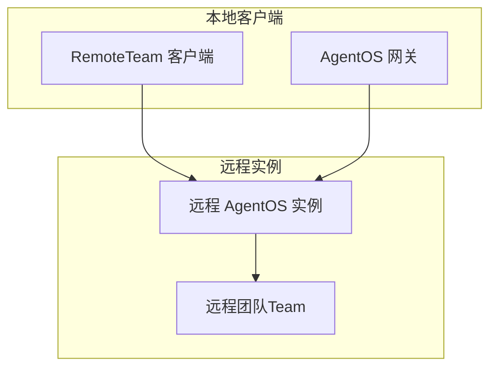
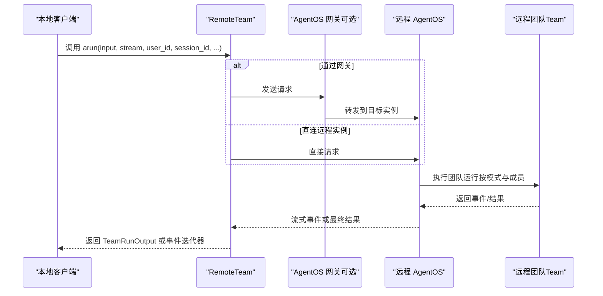
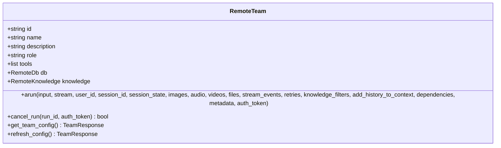
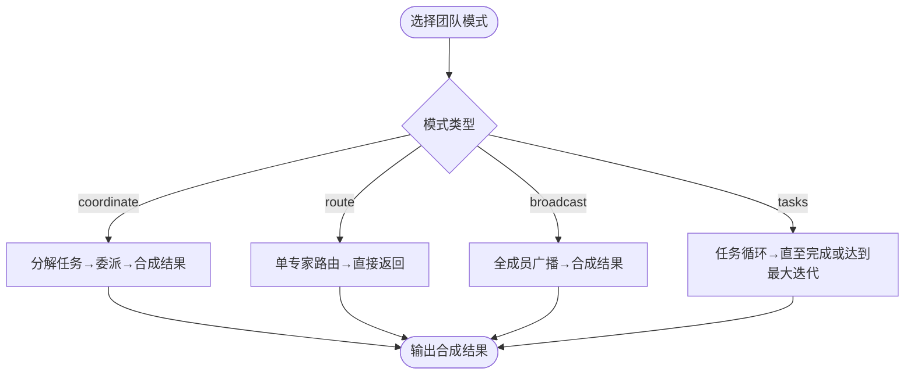
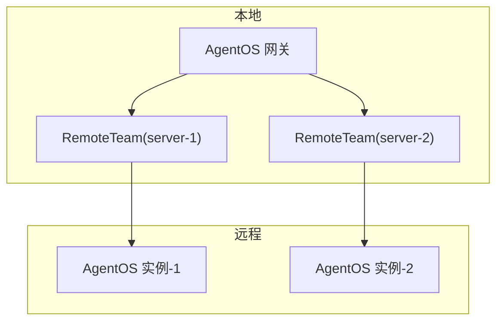
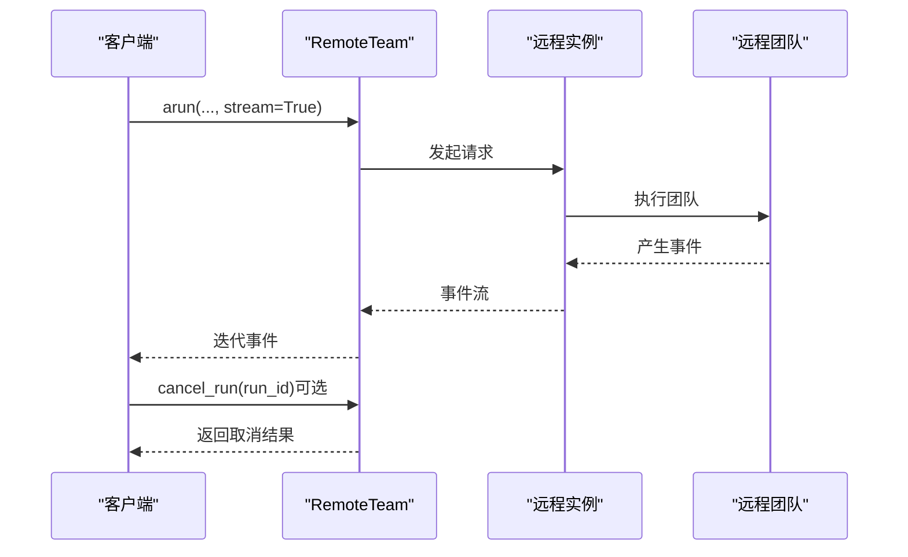
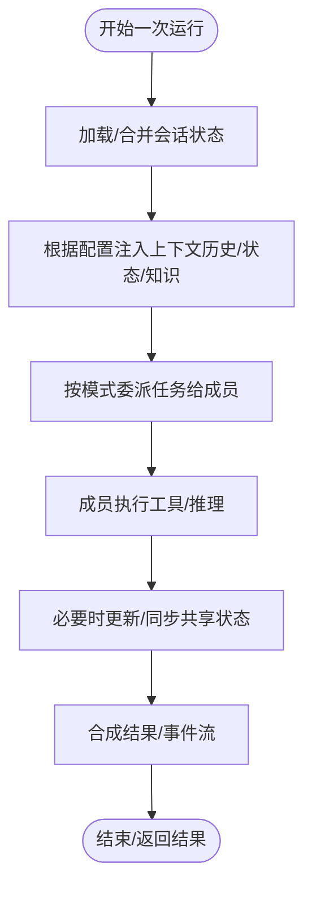
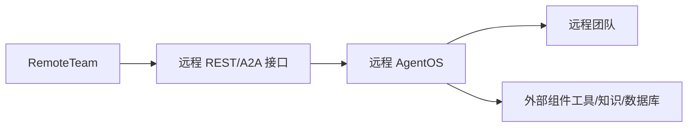

# 远程团队

<cite>
**本文引用的文件**
- [agent-os/remote-execution/remote-team.mdx](file://agent-os/remote-execution/remote-team.mdx)
- [reference/teams/remote-team.mdx](file://reference/teams/remote-team.mdx)
- [agent-os/remote-execution/gateway.mdx](file://agent-os/remote-execution/gateway.mdx)
- [agent-os/remote-execution/overview.mdx](file://agent-os/remote-execution/overview.mdx)
- [agent-os/usage/remote-execution/remote-team.mdx](file://agent-os/usage/remote-execution/remote-team.mdx)
- [agent-os/studio/teams.mdx](file://agent-os/studio/teams.mdx)
- [reference/teams/team.mdx](file://reference/teams/team.mdx)
- [_snippets/team-snippet.mdx](file://_snippets/team-snippet.mdx)
- [state/team/overview.mdx](file://state/team/overview.mdx)
- [examples/teams/run-control/remote-team.mdx](file://examples/teams/run-control/remote-team.mdx)
</cite>

## 目录
1. [简介](#简介)
2. [项目结构](#项目结构)
3. [核心组件](#核心组件)
4. [架构总览](#架构总览)
5. [详细组件分析](#详细组件分析)
6. [依赖关系分析](#依赖关系分析)
7. [性能考量](#性能考量)
8. [故障排查指南](#故障排查指南)
9. [结论](#结论)
10. [附录](#附录)

## 简介
本篇文档围绕“远程团队（RemoteTeam）”展开，系统阐述其在分布式多智能体场景中的实现原理与使用方法。内容涵盖：
- 团队 ID 与成员配置
- 远程执行参数与协议支持
- 配置访问与缓存策略
- 分布式执行与网关聚合
- 异步执行与流式响应
- 团队内部通信与状态同步机制
- 最佳实践与性能优化建议

## 项目结构
与“远程团队”相关的核心文档分布在以下位置：
- 使用与示例：agent-os/usage/remote-execution/remote-team.mdx、examples/teams/run-control/remote-team.mdx
- 参考与参数：reference/teams/remote-team.mdx、reference/teams/team.mdx
- 架构与网关：agent-os/remote-execution/gateway.mdx、agent-os/remote-execution/overview.mdx
- 模式与可视化：agent-os/studio/teams.mdx、_snippets/team-snippet.mdx
- 状态共享：state/team/overview.mdx

图表来源
- [agent-os/remote-execution/remote-team.mdx:13-31](file://agent-os/remote-execution/remote-team.mdx#L13-L31)
- [agent-os/remote-execution/gateway.mdx:16-45](file://agent-os/remote-execution/gateway.mdx#L16-L45)
- [agent-os/remote-execution/overview.mdx:19-37](file://agent-os/remote-execution/overview.mdx#L19-L37)

章节来源
- [agent-os/remote-execution/remote-team.mdx:1-163](file://agent-os/remote-execution/remote-team.mdx#L1-L163)
- [agent-os/remote-execution/gateway.mdx:1-174](file://agent-os/remote-execution/gateway.mdx#L1-L174)
- [agent-os/remote-execution/overview.mdx:1-163](file://agent-os/remote-execution/overview.mdx#L1-L163)

## 核心组件
- RemoteTeam：用于连接并执行远程 AgentOS 上的团队，提供与本地 Team 一致的异步运行接口，支持流式事件输出与取消执行。
- AgentOS 网关：可将多个远程团队聚合为统一入口，便于跨实例编排与负载分发。
- 协议支持：默认对接 AgentOS REST；也可通过 A2A 协议对接兼容服务器（REST 或 JSON-RPC）。

关键参数与能力要点
- 基础参数：base_url、team_id、timeout、config_ttl
- 运行参数：stream、user_id、session_id、session_state、images/audio/videos/files、stream_events、retries、knowledge_filters、add_history_to_context、dependencies、metadata、auth_token
- 方法：arun、cancel_run、get_team_config、refresh_config
- 属性：id、name、description、role、tools、db、knowledge

章节来源
- [reference/teams/remote-team.mdx:31-192](file://reference/teams/remote-team.mdx#L31-L192)
- [reference/teams/remote-team.mdx:105-192](file://reference/teams/remote-team.mdx#L105-L192)
- [agent-os/remote-execution/remote-team.mdx:13-163](file://agent-os/remote-execution/remote-team.mdx#L13-L163)

## 架构总览
RemoteTeam 的典型交互流程如下：

图表来源
- [agent-os/remote-execution/remote-team.mdx:13-31](file://agent-os/remote-execution/remote-team.mdx#L13-L31)
- [agent-os/remote-execution/gateway.mdx:16-45](file://agent-os/remote-execution/gateway.mdx#L16-L45)
- [reference/teams/remote-team.mdx:105-151](file://reference/teams/remote-team.mdx#L105-L151)

## 详细组件分析

### RemoteTeam 类与运行接口
- 接口一致性：RemoteTeam 提供与本地 Team 一致的异步运行接口，便于替换与集成。
- 流式响应：通过 stream=True 返回事件迭代器，事件类型包含内容事件与完成事件等。
- 取消执行：支持按 run_id 取消正在运行的任务。
- 配置访问：支持获取新鲜配置与强制刷新缓存配置。

图表来源
- [reference/teams/remote-team.mdx:40-192](file://reference/teams/remote-team.mdx#L40-L192)

章节来源
- [reference/teams/remote-team.mdx:105-192](file://reference/teams/remote-team.mdx#L105-L192)
- [agent-os/usage/remote-execution/remote-team.mdx:10-99](file://agent-os/usage/remote-execution/remote-team.mdx#L10-L99)

### 团队模式与成员配置
- 模式定义：支持协调（coordinate）、路由（route）、广播（broadcast）、任务循环（tasks）。模式会覆盖部分委托与直接返回的标志位。
- 成员配置：远程团队的成员信息由远端配置提供，可通过 get_team_config 获取最新成员列表与配置。
- 视觉构建：Studio 支持拖拽式团队构建，并可保存为 SDK 中 Team 的等价实例。

图表来源
- [_snippets/team-snippet.mdx:1-6](file://_snippets/team-snippet.mdx#L1-L6)
- [agent-os/studio/teams.mdx:10-79](file://agent-os/studio/teams.mdx#L10-L79)

章节来源
- [_snippets/team-snippet.mdx:1-6](file://_snippets/team-snippet.mdx#L1-L6)
- [agent-os/studio/teams.mdx:10-79](file://agent-os/studio/teams.mdx#L10-L79)
- [reference/teams/team.mdx:7-120](file://reference/teams/team.mdx#L7-L120)

### 协议与网关
- 协议支持：默认使用 AgentOS REST；也可通过 protocol="a2a" 连接 A2A 兼容服务器，支持 REST 与 JSON-RPC。
- 网关聚合：在本地 AgentOS 中注册多个 RemoteTeam，形成统一入口，便于跨实例编排与鉴权控制。

图表来源
- [agent-os/remote-execution/gateway.mdx:20-45](file://agent-os/remote-execution/gateway.mdx#L20-L45)
- [reference/teams/remote-team.mdx:194-238](file://reference/teams/remote-team.mdx#L194-L238)

章节来源
- [agent-os/remote-execution/gateway.mdx:16-174](file://agent-os/remote-execution/gateway.mdx#L16-L174)
- [reference/teams/remote-team.mdx:194-238](file://reference/teams/remote-team.mdx#L194-L238)

### 异步执行与流式响应
- 异步运行：arun 支持异步执行，适合高并发与长时任务。
- 流式事件：当 stream=True 时，返回事件迭代器，事件类型包含内容事件与完成事件等，可用于实时渲染与日志追踪。
- 取消执行：通过 cancel_run 按 run_id 取消运行，适用于超时或用户中断场景。

图表来源
- [reference/teams/remote-team.mdx:105-171](file://reference/teams/remote-team.mdx#L105-L171)
- [agent-os/usage/remote-execution/remote-team.mdx:32-59](file://agent-os/usage/remote-execution/remote-team.mdx#L32-L59)

章节来源
- [reference/teams/remote-team.mdx:105-171](file://reference/teams/remote-team.mdx#L105-L171)
- [agent-os/usage/remote-execution/remote-team.mdx:32-59](file://agent-os/usage/remote-execution/remote-team.mdx#L32-L59)

### 团队内部通信与状态同步
- 会话状态：支持 session_id、session_state 传入，结合 add_session_state_to_context 控制是否将状态注入上下文。
- 成员间交互：可通过 share_member_interactions 控制是否向已委派成员发送当前运行的交互记录。
- 历史与知识：支持将历史消息与知识检索结果加入上下文，增强推理与检索能力。
- 状态共享：团队级 session_state 在成员间共享与同步，便于跨成员协作。

图表来源
- [reference/teams/team.mdx:17-120](file://reference/teams/team.mdx#L17-L120)
- [state/team/overview.mdx:14-38](file://state/team/overview.mdx#L14-L38)

章节来源
- [reference/teams/team.mdx:17-120](file://reference/teams/team.mdx#L17-L120)
- [state/team/overview.mdx:14-38](file://state/team/overview.mdx#L14-L38)

## 依赖关系分析
- RemoteTeam 依赖远程 AgentOS 的 REST/A2A 接口，以及可选的鉴权令牌。
- 网关模式下，本地 AgentOS 将请求转发至远程实例，需确保远程实例开放必要的配置与资源查询端点。
- 团队运行依赖成员代理、工具、知识库与数据库等外部组件，这些组件位于远程实例中。

图表来源
- [agent-os/remote-execution/overview.mdx:19-37](file://agent-os/remote-execution/overview.mdx#L19-L37)
- [agent-os/remote-execution/gateway.mdx:161-173](file://agent-os/remote-execution/gateway.mdx#L161-L173)

章节来源
- [agent-os/remote-execution/overview.mdx:19-37](file://agent-os/remote-execution/overview.mdx#L19-L37)
- [agent-os/remote-execution/gateway.mdx:161-173](file://agent-os/remote-execution/gateway.mdx#L161-L173)

## 性能考量
- 超时与重试：合理设置 timeout 与 retries，避免长时间阻塞；对网络抖动与远端限流进行退避处理。
- 缓存配置：利用 config_ttl 缓存远程团队配置，减少频繁查询；必要时通过 refresh_config 强制刷新。
- 流式传输：启用 stream 以降低首字节延迟，提升用户体验；注意事件消费与背压控制。
- 并行与串行：广播模式可并行执行但合成阶段可能引入额外延迟；路由模式适合快速响应；任务循环模式适合复杂目标。
- 网关鉴权：在网关聚合多实例时，确保必要的端点未被过度保护，以免影响配置读取与发现。

## 故障排查指南
- 连接失败：检查 base_url 与网络可达性；确认远程实例已启动并监听指定端口。
- 认证错误：若远程实例启用鉴权，需在调用时提供 auth_token。
- 超时与取消：对长时任务设置合理 timeout；必要时通过 cancel_run 主动取消。
- 配置不一致：使用 get_team_config 获取最新配置；必要时调用 refresh_config 刷新缓存。
- 网关鉴权限制：如启用鉴权，确保远程实例开放 /config、/teams、/workflows 等端点以便网关正常工作。

章节来源
- [reference/teams/remote-team.mdx:263-283](file://reference/teams/remote-team.mdx#L263-L283)
- [agent-os/remote-execution/gateway.mdx:161-173](file://agent-os/remote-execution/gateway.mdx#L161-L173)

## 结论
RemoteTeam 为分布式多智能体协作提供了简洁而强大的远程执行能力。通过一致的接口设计、灵活的协议支持与完善的流式与取消机制，开发者可以轻松地将远程团队纳入本地应用。配合网关模式与团队模式，可在不同规模与复杂度的场景中实现高效、可扩展的协作系统。

## 附录
- 快速上手示例路径：[agent-os/usage/remote-execution/remote-team.mdx:10-99](file://agent-os/usage/remote-execution/remote-team.mdx#L10-L99)
- 完整 API 参考：[reference/teams/remote-team.mdx:1-284](file://reference/teams/remote-team.mdx#L1-L284)
- 网关与聚合：[agent-os/remote-execution/gateway.mdx:16-174](file://agent-os/remote-execution/gateway.mdx#L16-L174)
- 团队模式与可视化：[agent-os/studio/teams.mdx:10-79](file://agent-os/studio/teams.mdx#L10-L79)、[_snippets/team-snippet.mdx:1-6](file://_snippets/team-snippet.mdx#L1-L6)
- 团队运行参数详解：[reference/teams/team.mdx:7-120](file://reference/teams/team.mdx#L7-L120)
- 示例：远程团队运行控制与流式输出 [examples/teams/run-control/remote-team.mdx:10-76](file://examples/teams/run-control/remote-team.mdx#L10-L76)