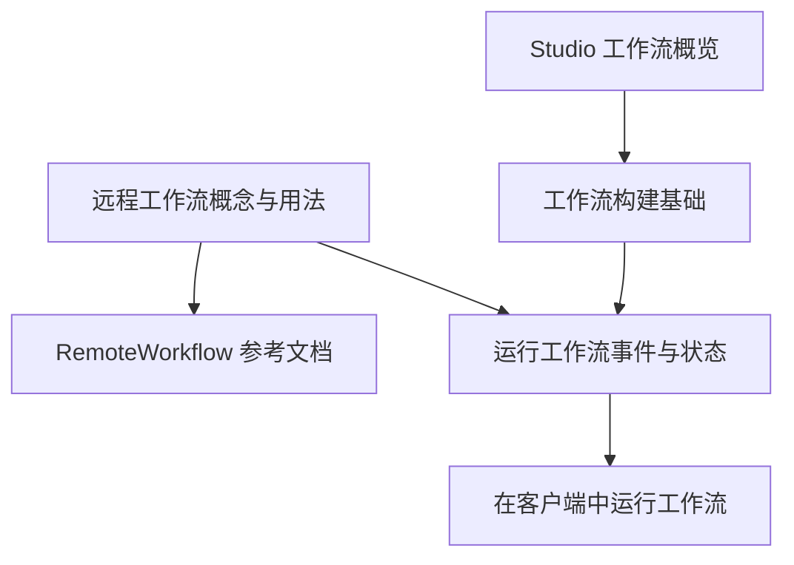
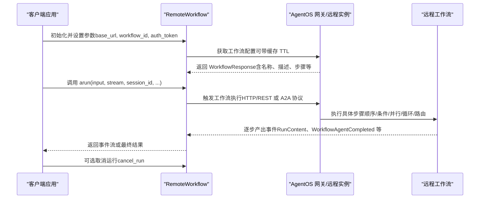
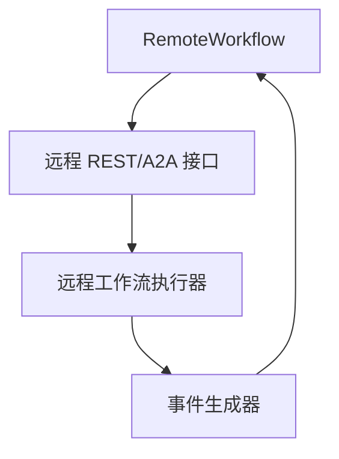

# 远程工作流

<cite>
**本文引用的文件**
- [远程工作流（概念与用法）](file://agent-os/remote-execution/remote-workflow.mdx)
- [RemoteWorkflow 参考文档](file://reference/workflows/remote-workflow.mdx)
- [运行工作流（事件与状态）](file://workflows/running-workflows.mdx)
- [在客户端中运行工作流](file://examples/agent-os/client/run-workflows.mdx)
- [工作流构建基础](file://workflows/building-workflows.mdx)
- [Studio 工作流概览](file://agent-os/studio/workflows.mdx)
</cite>

## 目录
1. [简介](#简介)
2. [项目结构](#项目结构)
3. [核心组件](#核心组件)
4. [架构总览](#架构总览)
5. [详细组件分析](#详细组件分析)
6. [依赖关系分析](#依赖关系分析)
7. [性能考量](#性能考量)
8. [故障排查指南](#故障排查指南)
9. [结论](#结论)
10. [附录](#附录)

## 简介
本技术文档围绕远程工作流 RemoteWorkflow 展开，系统阐述其在远程 AgentOS 实例上执行工作流的能力与使用方式。内容涵盖：
- 远程工作流的连接参数与配置项（如 base_url、workflow_id、超时与缓存 TTL）
- 步骤配置与工作流编排（顺序、条件、循环、并行、路由）
- 异步执行与事件流式输出（RunContent、WorkflowAgentCompleted 等事件）
- 工作流状态管理与进度跟踪（事件存储、事件过滤、运行标识）
- 认证与错误处理策略
- 复杂工作流设计模式与最佳实践

## 项目结构
以下图示展示了“远程工作流”在文档体系中的位置与关联模块：

**图表来源**
- [远程工作流（概念与用法）:1-185](file://agent-os/remote-execution/remote-workflow.mdx#L1-L185)
- [RemoteWorkflow 参考文档:1-260](file://reference/workflows/remote-workflow.mdx#L1-L260)
- [运行工作流（事件与状态）:1-619](file://workflows/running-workflows.mdx#L1-L619)
- [在客户端中运行工作流:1-123](file://examples/agent-os/client/run-workflows.mdx#L1-L123)
- [工作流构建基础:1-59](file://workflows/building-workflows.mdx#L1-L59)
- [Studio 工作流概览:1-80](file://agent-os/studio/workflows.mdx#L1-L80)

**章节来源**
- [远程工作流（概念与用法）:1-185](file://agent-os/remote-execution/remote-workflow.mdx#L1-L185)
- [RemoteWorkflow 参考文档:1-260](file://reference/workflows/remote-workflow.mdx#L1-L260)
- [运行工作流（事件与状态）:1-619](file://workflows/running-workflows.mdx#L1-L619)
- [在客户端中运行工作流:1-123](file://examples/agent-os/client/run-workflows.mdx#L1-L123)
- [工作流构建基础:1-59](file://workflows/building-workflows.mdx#L1-L59)
- [Studio 工作流概览:1-80](file://agent-os/studio/workflows.mdx#L1-L80)

## 核心组件
- RemoteWorkflow：用于连接远程 AgentOS 实例并执行已注册的工作流；支持非流式与流式响应、事件过滤、认证与取消运行等能力。
- 工作流（Workflow）：本地或远程工作流的执行载体，由 Step、Condition、Loop、Parallel、Router 等组合构成。
- 事件系统：通过 WorkflowRunOutputEvent/WorkflowRunOutput 提供事件流，便于实时跟踪状态与进度。

关键参数与属性（节选）：
- 基础连接：base_url、workflow_id、timeout、config_ttl
- 输入与上下文：input、additional_data、user_id、run_id、session_id、session_state、images/audio/videos/files
- 流式控制：stream、stream_events、stream_executor_events
- 认证与协议：auth_token、protocol（支持 agentos/a2a/rest 或 a2a/json-rpc）

**章节来源**
- [RemoteWorkflow 参考文档:31-122](file://reference/workflows/remote-workflow.mdx#L31-L122)
- [运行工作流（事件与状态）:462-525](file://workflows/running-workflows.mdx#L462-L525)

## 架构总览
下图展示了 RemoteWorkflow 在远程执行场景下的端到端交互流程：

**图表来源**
- [远程工作流（概念与用法）:13-180](file://agent-os/remote-execution/remote-workflow.mdx#L13-L180)
- [RemoteWorkflow 参考文档:77-140](file://reference/workflows/remote-workflow.mdx#L77-L140)
- [运行工作流（事件与状态）:462-525](file://workflows/running-workflows.mdx#L462-L525)

## 详细组件分析

### RemoteWorkflow 类与方法
- arun：异步执行远程工作流，支持非流式与流式两种返回形态；可传入用户/会话上下文、附加数据、认证令牌等。
- cancel_run：取消指定 run_id 的运行。
- get_workflow_config/refresh_config：获取或刷新远程工作流配置（含名称、描述、步骤等）。
- 属性：id/name/description/db 等，支持从远端配置缓存读取。

典型调用路径（示例片段路径，不直接展示代码）：
- [基本用法与参数说明:15-122](file://reference/workflows/remote-workflow.mdx#L15-L122)
- [A2A 协议与 REST/JSON-RPC 选项:164-191](file://reference/workflows/remote-workflow.mdx#L164-L191)
- [错误处理与注意事项（WebSocket 不支持）:233-259](file://reference/workflows/remote-workflow.mdx#L233-L259)

**章节来源**
- [RemoteWorkflow 参考文档:1-260](file://reference/workflows/remote-workflow.mdx#L1-L260)

### 工作流步骤与编排
- 步骤类型：Step、Steps、Condition、Loop、Router、Parallel
- 编排方式：顺序执行、条件分支、并行执行、循环迭代、动态路由
- 数据接口：StepInput/StepOutput 标准化输入输出，确保自定义函数与内置执行器的兼容性

参考示例（片段路径）：
- [构建块与可视化设计:9-32](file://workflows/building-workflows.mdx#L9-L32)
- [Studio 拖拽式工作流构建:8-31](file://agent-os/studio/workflows.mdx#L8-L31)
- [CEL 表达式与函数评估:59-63](file://agent-os/studio/workflows.mdx#L59-L63)

**章节来源**
- [工作流构建基础:1-59](file://workflows/building-workflows.mdx#L1-L59)
- [Studio 工作流概览:1-80](file://agent-os/studio/workflows.mdx#L1-L80)

### 异步执行与事件处理
- 非流式：返回 WorkflowRunOutput，包含最终 content 与状态信息
- 流式：返回 WorkflowRunOutputEvent 序列，事件类型覆盖工作流生命周期与内部步骤
- 典型事件：
  - RunContent：来自代理/团队的增量内容
  - WorkflowAgentCompleted：工作流或代理完成事件
  - WorkflowStarted/WorkflowCompleted/WorkflowError：工作流级事件
  - StepStarted/StepCompleted/StepError：步骤级事件
  - ParallelExecution/ConditionExecution/LoopExecution/RouterExecution：复合结构事件
- 事件存储与过滤：可通过 store_events 与 events_to_skip 控制事件持久化与噪声过滤

参考示例（片段路径）：
- [事件类型与过滤配置:462-558](file://workflows/running-workflows.mdx#L462-L558)
- [事件存储与审计用途:527-594](file://workflows/running-workflows.mdx#L527-L594)
- [客户端流式示例（RunContent/WorkflowAgentCompleted）:76-95](file://examples/agent-os/client/run-workflows.mdx#L76-L95)

**章节来源**
- [运行工作流（事件与状态）:1-619](file://workflows/running-workflows.mdx#L1-L619)
- [在客户端中运行工作流:1-123](file://examples/agent-os/client/run-workflows.mdx#L1-L123)

### 状态管理与进度跟踪
- 运行标识：run_id 支持跨会话追踪与取消
- 会话上下文：session_id/session_state 用于跨步骤状态共享
- 事件索引：事件序列可用于断点续跑与重连场景（参考长运行示例）
- 存储与检索：事件可写入会话数据库，便于审计与回放

参考示例（片段路径）：
- [运行标识与会话上下文:101-121](file://reference/workflows/remote-workflow.mdx#L101-L121)
- [事件存储与过滤配置:527-594](file://workflows/running-workflows.mdx#L527-L594)

**章节来源**
- [RemoteWorkflow 参考文档:101-121](file://reference/workflows/remote-workflow.mdx#L101-L121)
- [运行工作流（事件与状态）:527-594](file://workflows/running-workflows.mdx#L527-L594)

### 认证与安全
- 支持通过 auth_token 对远程实例进行认证
- A2A 协议支持多种后端（REST/JSON-RPC），便于与第三方系统互通

参考示例（片段路径）：
- [认证参数与示例:244-253](file://reference/workflows/remote-workflow.mdx#L244-L253)
- [A2A 协议选项:184-191](file://reference/workflows/remote-workflow.mdx#L184-L191)

**章节来源**
- [RemoteWorkflow 参考文档:164-191](file://reference/workflows/remote-workflow.mdx#L164-L191)
- [RemoteWorkflow 参考文档:244-253](file://reference/workflows/remote-workflow.mdx#L244-L253)

### 错误处理与降级
- 远程服务器不可达时抛出异常（如 RemoteServerUnavailableError），建议在调用侧捕获并执行降级逻辑
- 流式场景中注意网络中断与事件丢失，结合事件索引与重连策略

参考示例（片段路径）：
- [错误处理示例:233-242](file://reference/workflows/remote-workflow.mdx#L233-L242)
- [长运行与重连思路（事件索引）:76-95](file://examples/agent-os/client/run-workflows.mdx#L76-L95)

**章节来源**
- [RemoteWorkflow 参考文档:233-242](file://reference/workflows/remote-workflow.mdx#L233-L242)
- [在客户端中运行工作流:76-95](file://examples/agent-os/client/run-workflows.mdx#L76-L95)

## 依赖关系分析
- RemoteWorkflow 依赖远程 AgentOS 实例提供的 REST/A2A 接口
- 事件系统依赖 WorkflowRunOutputEvent/WorkflowRunOutput 的统一事件模型
- 工作流编排依赖本地/远程的 Workflow/Step/Condition/Loop/Parallel/Router 组件

**图表来源**
- [远程工作流（概念与用法）:1-185](file://agent-os/remote-execution/remote-workflow.mdx#L1-L185)
- [运行工作流（事件与状态）:462-525](file://workflows/running-workflows.mdx#L462-L525)

**章节来源**
- [远程工作流（概念与用法）:1-185](file://agent-os/remote-execution/remote-workflow.mdx#L1-L185)
- [运行工作流（事件与状态）:462-525](file://workflows/running-workflows.mdx#L462-L525)

## 性能考量
- 配置缓存：合理设置 config_ttl，避免频繁拉取远端配置
- 事件过滤：生产环境建议启用 events_to_skip，减少事件存储与传输开销
- 流式控制：根据需求选择 stream/stream_events/stream_executor_events，平衡实时性与性能
- 并行执行：在允许的范围内使用 Parallel 以缩短总耗时，但需关注资源竞争与幂等性
- 超时与重试：为远程请求设置合理的 timeout，并在客户端实现指数退避重试

## 故障排查指南
- 连接失败：检查 base_url 与网络可达性；确认远程实例已启动并暴露工作流
- 权限问题：确认 auth_token 正确且未过期；核对远程实例的鉴权策略
- 事件缺失：若使用 WebSocket（尚未支持），请改用 HTTP 流式；结合事件索引与重连策略
- 性能瓶颈：开启事件过滤与降低事件粒度；评估并行度与资源配额

**章节来源**
- [RemoteWorkflow 参考文档:255-259](file://reference/workflows/remote-workflow.mdx#L255-L259)
- [运行工作流（事件与状态）:527-594](file://workflows/running-workflows.mdx#L527-L594)

## 结论
RemoteWorkflow 为在分布式与多租户场景下复用复杂工作流提供了统一接口。通过标准化的参数、事件与状态管理机制，开发者可以快速集成远程工作流并在客户端实现高可用的异步执行与可观测性。配合 Studio 的可视化编排与本地 Workflow 的丰富构建块，能够覆盖从简单到复杂的各类自动化需求。

## 附录
- 快速开始示例（片段路径）
  - [基本用法与参数说明:15-29](file://reference/workflows/remote-workflow.mdx#L15-L29)
  - [流式响应示例:210-231](file://reference/workflows/remote-workflow.mdx#L210-L231)
  - [附加数据传递:59-78](file://reference/workflows/remote-workflow.mdx#L59-L78)
  - [配置访问与刷新:80-101](file://reference/workflows/remote-workflow.mdx#L80-L101)
  - [网关注册与服务化:192-208](file://reference/workflows/remote-workflow.mdx#L192-L208)
  - [A2A 协议示例:164-182](file://reference/workflows/remote-workflow.mdx#L164-L182)
  - [认证与错误处理:244-253](file://reference/workflows/remote-workflow.mdx#L244-L253)