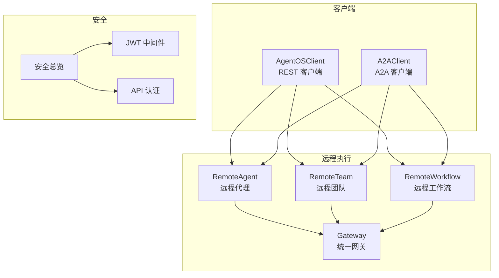
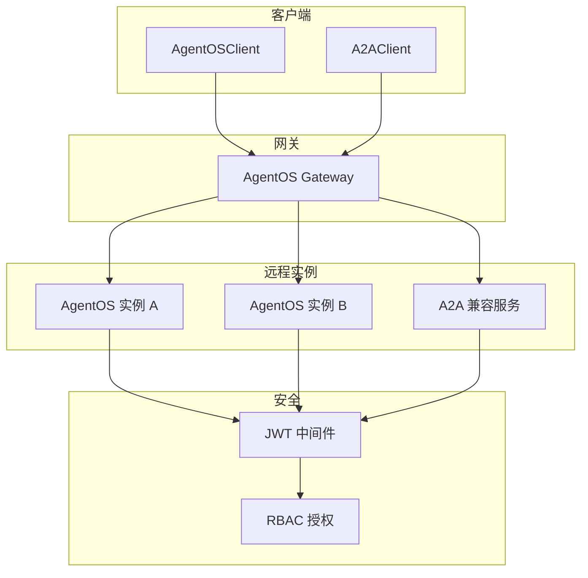
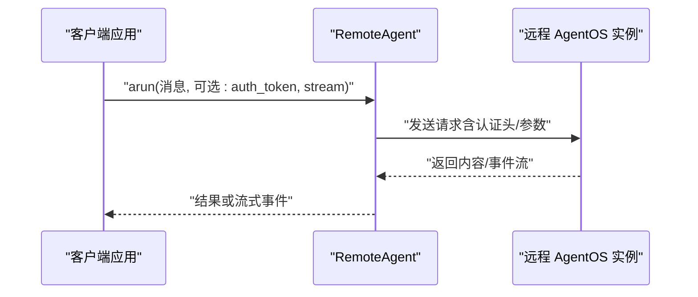
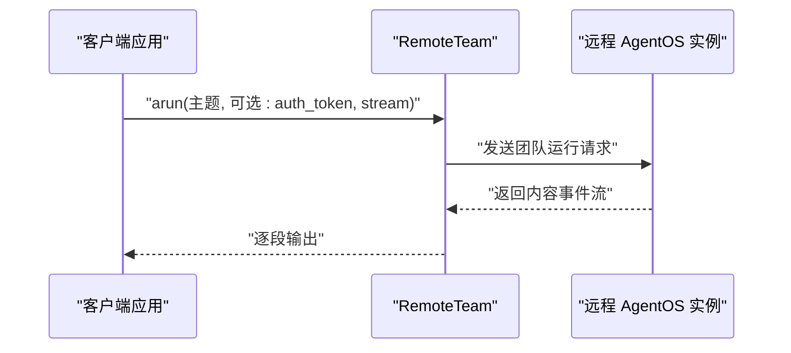
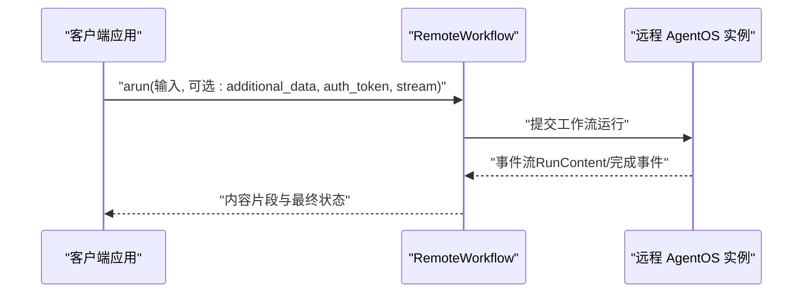
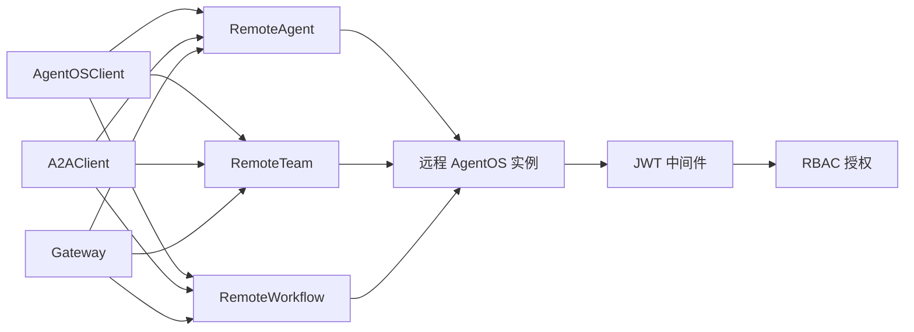

# 远程执行

<cite>
**本文引用的文件**
- [agent-os/remote-execution/overview.mdx](file://agent-os/remote-execution/overview.mdx)
- [agent-os/remote-execution/gateway.mdx](file://agent-os/remote-execution/gateway.mdx)
- [agent-os/remote-execution/remote-agent.mdx](file://agent-os/remote-execution/remote-agent.mdx)
- [agent-os/remote-execution/remote-team.mdx](file://agent-os/remote-execution/remote-team.mdx)
- [agent-os/remote-execution/remote-workflow.mdx](file://agent-os/remote-execution/remote-workflow.mdx)
- [agent-os/client/overview.mdx](file://agent-os/client/overview.mdx)
- [agent-os/client/agentos-client.mdx](file://agent-os/client/agentos-client.mdx)
- [agent-os/client/a2a-client.mdx](file://agent-os/client/a2a-client.mdx)
- [agent-os/security/overview.mdx](file://agent-os/security/overview.mdx)
- [agent-os/middleware/jwt.mdx](file://agent-os/middleware/jwt.mdx)
- [agent-os/api/authentication.mdx](file://agent-os/api/authentication.mdx)
- [agent-os/usage/remote-execution/remote-agent.mdx](file://agent-os/usage/remote-execution/remote-agent.mdx)
- [agent-os/usage/remote-execution/remote-team.mdx](file://agent-os/usage/remote-execution/remote-team.mdx)
</cite>

## 目录
1. [简介](#简介)
2. [项目结构](#项目结构)
3. [核心组件](#核心组件)
4. [架构总览](#架构总览)
5. [详细组件分析](#详细组件分析)
6. [依赖关系分析](#依赖关系分析)
7. [性能考量](#性能考量)
8. [故障排除指南](#故障排除指南)
9. [结论](#结论)
10. [附录](#附录)

## 简介
本章节概述 AgentOS 的远程执行能力，包括远程代理（RemoteAgent）、远程团队（RemoteTeam）、远程工作流（RemoteWorkflow）以及统一网关（Gateway）模式。通过远程执行，用户可以在不同服务器上部署专用的 AgentOS 实例，并在本地或另一个网关中以一致的方式调用这些资源，实现分布式与微服务化的智能体系统。

- 支持本地与远程混合编排：在同一网关中组合本地与远程的代理、团队与工作流。
- 统一入口：通过网关提供单一 API 入口，便于负载分发与跨实例协作。
- 跨框架兼容：支持 A2A 协议，可连接到其他 A2A 兼容的服务（如 Google ADK）。

**章节来源**
- [agent-os/remote-execution/overview.mdx:1-163](file://agent-os/remote-execution/overview.mdx#L1-L163)

## 项目结构
围绕远程执行的相关文档分布在以下位置：
- 远程执行概览与快速入门：agent-os/remote-execution/overview.mdx
- 网关模式与混合编排：agent-os/remote-execution/gateway.mdx
- 各远程组件使用指南：agent-os/remote-execution/remote-agent.mdx、remote-team.mdx、remote-workflow.mdx
- 客户端选择与使用：agent-os/client/overview.mdx、agentos-client.mdx、a2a-client.mdx
- 安全与认证：agent-os/security/overview.mdx、middleware/jwt.mdx、api/authentication.mdx
- 使用示例：agent-os/usage/remote-execution/remote-agent.mdx、remote-team.mdx

**图表来源**
- [agent-os/remote-execution/overview.mdx:19-37](file://agent-os/remote-execution/overview.mdx#L19-L37)
- [agent-os/client/overview.mdx:9-18](file://agent-os/client/overview.mdx#L9-L18)
- [agent-os/security/overview.mdx:7-13](file://agent-os/security/overview.mdx#L7-L13)

**章节来源**
- [agent-os/remote-execution/overview.mdx:19-37](file://agent-os/remote-execution/overview.mdx#L19-L37)
- [agent-os/client/overview.mdx:9-18](file://agent-os/client/overview.mdx#L9-L18)
- [agent-os/security/overview.mdx:7-13](file://agent-os/security/overview.mdx#L7-L13)

## 核心组件
- RemoteAgent：在远程 AgentOS 上运行单个代理，支持同步与流式响应、配置缓存与刷新、认证与错误处理、A2A 协议互通。
- RemoteTeam：在远程 AgentOS 上运行团队，支持成员协调、流式输出、配置访问与刷新、认证与错误处理、A2A 协议互通。
- RemoteWorkflow：在远程 AgentOS 上运行工作流，支持步骤事件流、附加数据传递、配置访问与刷新、认证与错误处理、A2A 协议互通。
- AgentOSClient：面向 AgentOS 的 REST 客户端，支持运行代理/团队/工作流、会话管理、知识检索、记忆操作与追踪。
- A2AClient：面向任意 A2A 兼容服务的客户端，支持跨框架通信（如 Google ADK）。
- Gateway：将多个远程 AgentOS 实例聚合为统一入口，支持本地与远程混合编排；需注意授权保护下的端点放行要求。

**章节来源**
- [agent-os/remote-execution/remote-agent.mdx:1-156](file://agent-os/remote-execution/remote-agent.mdx#L1-L156)
- [agent-os/remote-execution/remote-team.mdx:1-163](file://agent-os/remote-execution/remote-team.mdx#L1-L163)
- [agent-os/remote-execution/remote-workflow.mdx:1-185](file://agent-os/remote-execution/remote-workflow.mdx#L1-L185)
- [agent-os/client/agentos-client.mdx:1-120](file://agent-os/client/agentos-client.mdx#L1-L120)
- [agent-os/client/a2a-client.mdx:1-62](file://agent-os/client/a2a-client.mdx#L1-L62)
- [agent-os/remote-execution/gateway.mdx:16-45](file://agent-os/remote-execution/gateway.mdx#L16-L45)

## 架构总览
下图展示了远程执行的整体架构：客户端（AgentOSClient/A2AClient）通过 REST 或 A2A 协议访问远程 AgentOS；网关（Gateway）聚合多个远程实例，提供统一入口；安全层由 JWT 中间件与 RBAC 提供认证与授权保障。

**图表来源**
- [agent-os/client/overview.mdx:11-17](file://agent-os/client/overview.mdx#L11-L17)
- [agent-os/remote-execution/gateway.mdx:7-14](file://agent-os/remote-execution/gateway.mdx#L7-L14)
- [agent-os/security/overview.mdx:7-13](file://agent-os/security/overview.mdx#L7-L13)

## 详细组件分析

### RemoteAgent 分析
- 功能要点
  - 连接远程代理并执行 arun，支持同步与流式响应。
  - 配置缓存与刷新：name/description/tools 等缓存属性，以及 get_agent_config 与 refresh_config。
  - 认证：支持 auth_token 参数传入 JWT。
  - 错误处理：捕获远程服务器不可达等异常。
  - A2A 协议：支持通过 protocol="a2a" 与 a2a_protocol 指定协议（如 REST 或 JSON-RPC）。
- 关键流程（调用序列）

**图表来源**
- [agent-os/remote-execution/remote-agent.mdx:15-31](file://agent-os/remote-execution/remote-agent.mdx#L15-L31)
- [agent-os/remote-execution/remote-agent.mdx:33-51](file://agent-os/remote-execution/remote-agent.mdx#L33-L51)
- [agent-os/remote-execution/remote-agent.mdx:78-94](file://agent-os/remote-execution/remote-agent.mdx#L78-L94)
- [agent-os/remote-execution/remote-agent.mdx:114-149](file://agent-os/remote-execution/remote-agent.mdx#L114-L149)

**章节来源**
- [agent-os/remote-execution/remote-agent.mdx:13-31](file://agent-os/remote-execution/remote-agent.mdx#L13-L31)
- [agent-os/remote-execution/remote-agent.mdx:33-76](file://agent-os/remote-execution/remote-agent.mdx#L33-L76)
- [agent-os/remote-execution/remote-agent.mdx:78-113](file://agent-os/remote-execution/remote-agent.mdx#L78-L113)
- [agent-os/remote-execution/remote-agent.mdx:114-149](file://agent-os/remote-execution/remote-agent.mdx#L114-L149)

### RemoteTeam 分析
- 功能要点
  - 运行远程团队，支持流式输出与配置访问。
  - 在网关中注册远程团队，实现多实例聚合。
  - 认证与错误处理同 RemoteAgent。
  - A2A 协议支持。
- 关键流程（调用序列）

**图表来源**
- [agent-os/remote-execution/remote-team.mdx:15-31](file://agent-os/remote-execution/remote-team.mdx#L15-L31)
- [agent-os/remote-execution/remote-team.mdx:33-53](file://agent-os/remote-execution/remote-team.mdx#L33-L53)
- [agent-os/remote-execution/remote-team.mdx:55-77](file://agent-os/remote-execution/remote-team.mdx#L55-L77)
- [agent-os/remote-execution/remote-team.mdx:80-97](file://agent-os/remote-execution/remote-team.mdx#L80-L97)

**章节来源**
- [agent-os/remote-execution/remote-team.mdx:13-31](file://agent-os/remote-execution/remote-team.mdx#L13-L31)
- [agent-os/remote-execution/remote-team.mdx:33-78](file://agent-os/remote-execution/remote-team.mdx#L33-L78)
- [agent-os/remote-execution/remote-team.mdx:80-97](file://agent-os/remote-execution/remote-team.mdx#L80-L97)
- [agent-os/remote-execution/remote-team.mdx:99-133](file://agent-os/remote-execution/remote-team.mdx#L99-L133)
- [agent-os/remote-execution/remote-team.mdx:135-157](file://agent-os/remote-execution/remote-team.mdx#L135-L157)

### RemoteWorkflow 分析
- 功能要点
  - 运行远程工作流，支持流式事件（RunContent、WorkflowAgentCompleted 等）。
  - 传递附加数据 additional_data。
  - 配置访问与刷新。
  - 在网关中注册远程工作流。
  - 认证与错误处理。
  - A2A 协议支持。
- 关键流程（调用序列）

**图表来源**
- [agent-os/remote-execution/remote-workflow.mdx:15-32](file://agent-os/remote-execution/remote-workflow.mdx#L15-L32)
- [agent-os/remote-execution/remote-workflow.mdx:34-57](file://agent-os/remote-execution/remote-workflow.mdx#L34-L57)
- [agent-os/remote-execution/remote-workflow.mdx:59-78](file://agent-os/remote-execution/remote-workflow.mdx#L59-L78)
- [agent-os/remote-execution/remote-workflow.mdx:80-101](file://agent-os/remote-execution/remote-workflow.mdx#L80-L101)
- [agent-os/remote-execution/remote-workflow.mdx:103-120](file://agent-os/remote-execution/remote-workflow.mdx#L103-L120)
- [agent-os/remote-execution/remote-workflow.mdx:122-138](file://agent-os/remote-execution/remote-workflow.mdx#L122-L138)
- [agent-os/remote-execution/remote-workflow.mdx:158-180](file://agent-os/remote-execution/remote-workflow.mdx#L158-L180)

**章节来源**
- [agent-os/remote-execution/remote-workflow.mdx:13-32](file://agent-os/remote-execution/remote-workflow.mdx#L13-L32)
- [agent-os/remote-execution/remote-workflow.mdx:34-78](file://agent-os/remote-execution/remote-workflow.mdx#L34-L78)
- [agent-os/remote-execution/remote-workflow.mdx:80-101](file://agent-os/remote-execution/remote-workflow.mdx#L80-L101)
- [agent-os/remote-execution/remote-workflow.mdx:103-120](file://agent-os/remote-execution/remote-workflow.mdx#L103-L120)
- [agent-os/remote-execution/remote-workflow.mdx:122-138](file://agent-os/remote-execution/remote-workflow.mdx#L122-L138)
- [agent-os/remote-execution/remote-workflow.mdx:158-180](file://agent-os/remote-execution/remote-workflow.mdx#L158-L180)

### 网关模式（Gateway）
- 作用
  - 将多个远程 AgentOS 实例聚合为统一入口，支持本地与远程混合编排。
  - 常见用例：统一 API、负载分发、微服务化、混合部署。
- 注意事项
  - 若远端启用了授权保护，需要放行以下端点以便网关正常工作：
    - /config
    - /agents
    - /agents/{agent_id}
    - /teams
    - /teams/{team_id}
    - /workflows
    - /workflows/{workflow_id}

**章节来源**
- [agent-os/remote-execution/gateway.mdx:7-14](file://agent-os/remote-execution/gateway.mdx#L7-L14)
- [agent-os/remote-execution/gateway.mdx:16-45](file://agent-os/remote-execution/gateway.mdx#L16-L45)
- [agent-os/remote-execution/gateway.mdx:47-89](file://agent-os/remote-execution/gateway.mdx#L47-L89)
- [agent-os/remote-execution/gateway.mdx:91-157](file://agent-os/remote-execution/gateway.mdx#L91-L157)
- [agent-os/remote-execution/gateway.mdx:161-173](file://agent-os/remote-execution/gateway.mdx#L161-L173)

### 客户端选择与使用
- AgentOSClient：面向 AgentOS 的 REST 客户端，支持运行代理/团队/工作流、会话管理、知识检索、记忆操作与追踪。
- A2AClient：面向任意 A2A 兼容服务的客户端，支持跨框架通信（如 Google ADK），可指定协议（REST/JSON-RPC）。
- 选择建议
  - 需要完整 AgentOS 能力：优先 AgentOSClient。
  - 需要跨框架或 A2A 互通：优先 A2AClient。

**章节来源**
- [agent-os/client/overview.mdx:20-26](file://agent-os/client/overview.mdx#L20-L26)
- [agent-os/client/agentos-client.mdx:15-39](file://agent-os/client/agentos-client.mdx#L15-L39)
- [agent-os/client/a2a-client.mdx:13-31](file://agent-os/client/a2a-client.mdx#L13-L31)
- [agent-os/client/a2a-client.mdx:32-42](file://agent-os/client/a2a-client.mdx#L32-L42)

## 依赖关系分析
- 组件耦合
  - RemoteAgent/RemoteTeam/RemoteWorkflow 依赖远程 AgentOS 实例提供的 REST/A2A 接口。
  - Gateway 将多个远程实例聚合，形成对上层的一致接口。
  - 客户端（AgentOSClient/A2AClient）作为上层调用方，解耦于具体后端实现。
- 外部依赖
  - A2A 协议：用于与非 Agno 的 A2A 兼容服务互通。
  - JWT 中间件与 RBAC：用于认证与授权控制。

**图表来源**
- [agent-os/client/overview.mdx:11-17](file://agent-os/client/overview.mdx#L11-L17)
- [agent-os/remote-execution/gateway.mdx:16-45](file://agent-os/remote-execution/gateway.mdx#L16-L45)
- [agent-os/security/overview.mdx:7-13](file://agent-os/security/overview.mdx#L7-L13)

**章节来源**
- [agent-os/client/overview.mdx:11-17](file://agent-os/client/overview.mdx#L11-L17)
- [agent-os/remote-execution/gateway.mdx:16-45](file://agent-os/remote-execution/gateway.mdx#L16-L45)
- [agent-os/security/overview.mdx:7-13](file://agent-os/security/overview.mdx#L7-L13)

## 性能考量
- 网络延迟与带宽
  - 远程执行引入网络往返时间，流式响应可改善交互体验但可能增加带宽占用。
- 并发与连接数
  - 多实例并发调用时，需关注远端实例的并发处理能力与限流策略。
- 序列化与传输开销
  - 大对象或长文本的传输会放大延迟，建议在必要时进行压缩或分片。
- 缓存与复用
  - 利用 RemoteAgent/Team/Workflow 的配置缓存与刷新机制，减少重复查询。
- 安全中间件开销
  - JWT 验证与 RBAC 授权会带来额外延迟，建议在生产环境合理配置密钥与算法。

[本节为通用指导，不直接分析具体文件]

## 故障排除指南
- 连接失败
  - 确认 base_url 正确且可达；检查防火墙与反向代理设置。
  - 对于网关：确保远端已放行 /config、/agents、/agents/{agent_id}、/teams、/teams/{team_id}、/workflows、/workflows/{workflow_id} 等端点。
- 认证失败
  - RBAC：确保 JWT 包含正确的 aud 与 scopes，并匹配 AgentOS 的 ID 与权限范围。
  - JWT 中间件：确认验证密钥、算法与 audience 设置正确。
- 流式输出问题
  - 确保远端实例支持流式输出；客户端侧正确处理事件类型。
- A2A 协议不兼容
  - 明确远端使用的协议（REST/JSON-RPC），并在客户端正确配置 protocol 与 a2a_protocol。

**章节来源**
- [agent-os/remote-execution/gateway.mdx:161-173](file://agent-os/remote-execution/gateway.mdx#L161-L173)
- [agent-os/api/authentication.mdx:10-61](file://agent-os/api/authentication.mdx#L10-L61)
- [agent-os/middleware/jwt.mdx:152-176](file://agent-os/middleware/jwt.mdx#L152-L176)
- [agent-os/remote-execution/remote-agent.mdx:96-112](file://agent-os/remote-execution/remote-agent.mdx#L96-L112)
- [agent-os/remote-execution/remote-team.mdx:117-133](file://agent-os/remote-execution/remote-team.mdx#L117-L133)
- [agent-os/remote-execution/remote-workflow.mdx:140-156](file://agent-os/remote-execution/remote-workflow.mdx#L140-L156)

## 结论
AgentOS 的远程执行提供了灵活的分布式与微服务化能力：通过 RemoteAgent/Team/Workflow 与 Gateway，可在多实例之间无缝编排；借助 AgentOSClient/A2AClient 与 A2A 协议，既可对接 Agno 生态，也可与第三方 A2A 兼容服务互通；配合 JWT 中间件与 RBAC，可实现细粒度的认证与授权。在生产环境中，应重点关注网络延迟、并发与安全中间件带来的性能影响，并按需优化配置与协议选择。

[本节为总结性内容，不直接分析具体文件]

## 附录

### 快速开始（示例路径）
- 远程代理示例：[agent-os/usage/remote-execution/remote-agent.mdx](file://agent-os/usage/remote-execution/remote-agent.mdx)
- 远程团队示例：[agent-os/usage/remote-execution/remote-team.mdx](file://agent-os/usage/remote-execution/remote-team.mdx)
- 网关示例：[agent-os/remote-execution/gateway.mdx](file://agent-os/remote-execution/gateway.mdx)

**章节来源**
- [agent-os/usage/remote-execution/remote-agent.mdx:8-99](file://agent-os/usage/remote-execution/remote-agent.mdx#L8-L99)
- [agent-os/usage/remote-execution/remote-team.mdx:8-99](file://agent-os/usage/remote-execution/remote-team.mdx#L8-L99)
- [agent-os/remote-execution/gateway.mdx:16-45](file://agent-os/remote-execution/gateway.mdx#L16-L45)