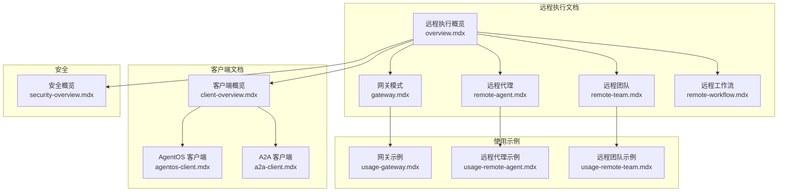
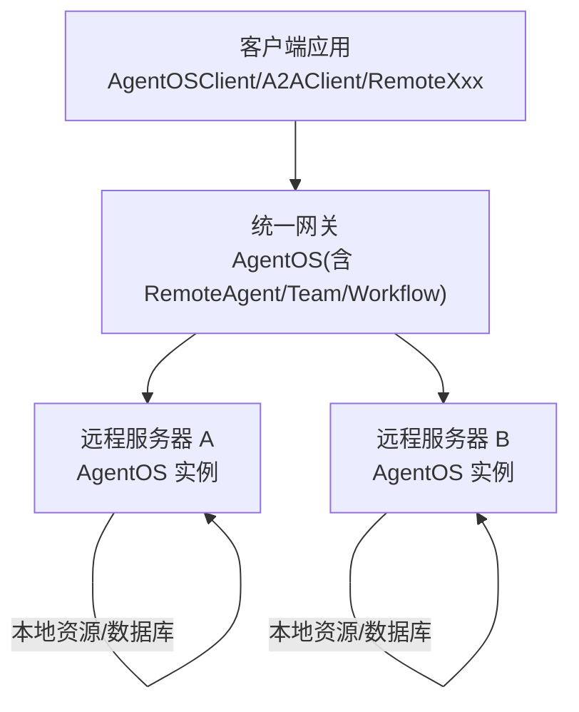
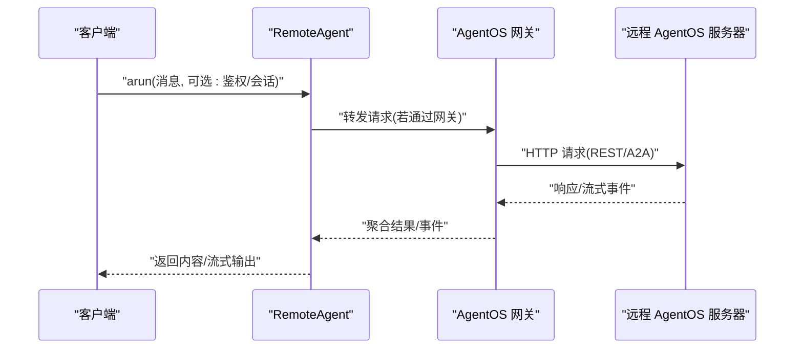
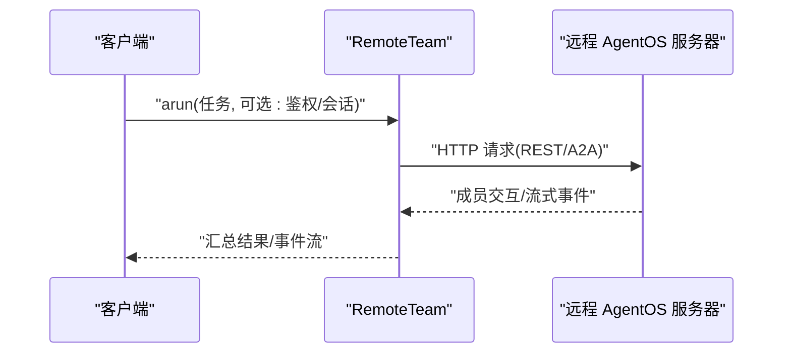
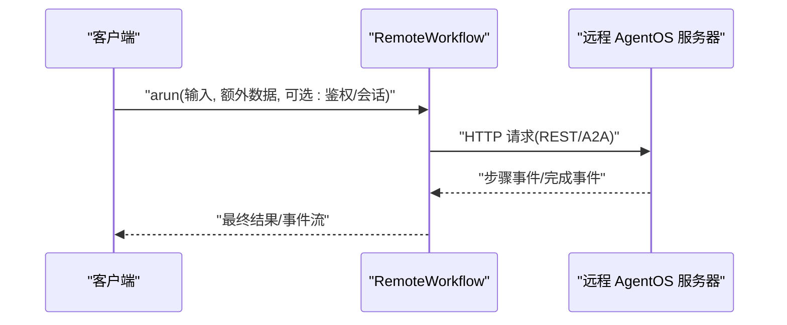
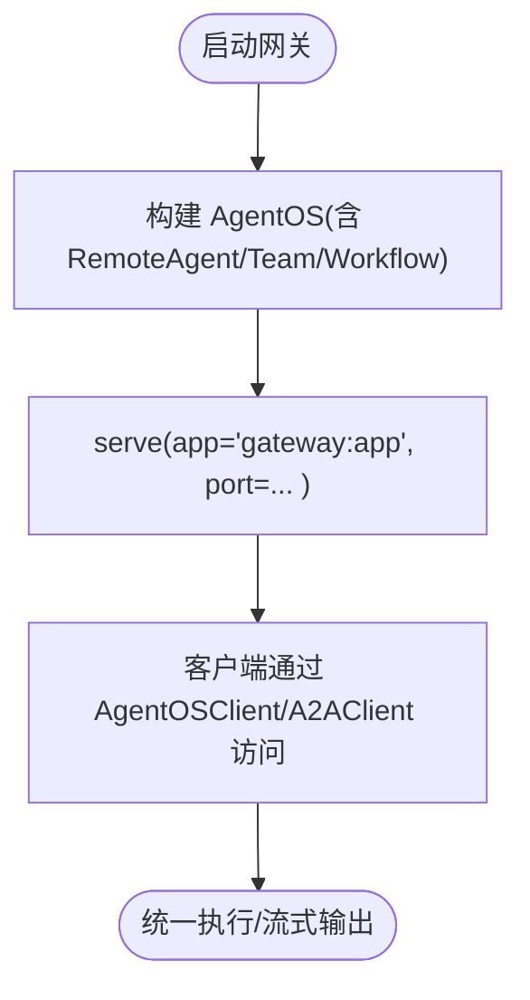
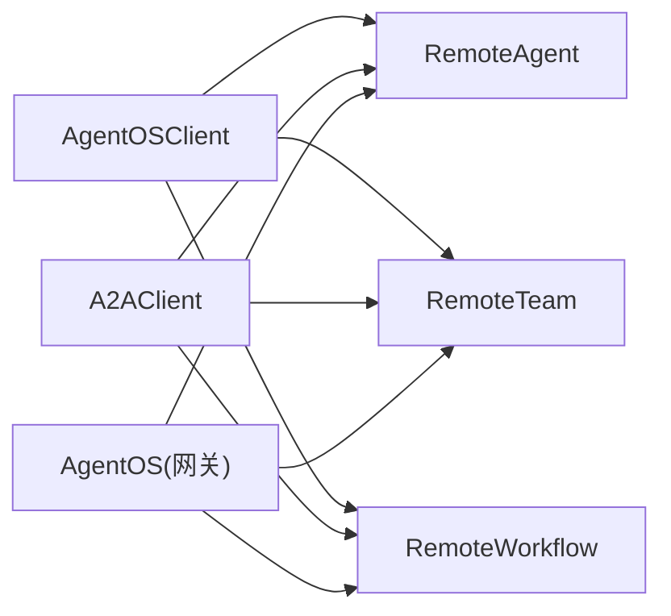

# 远程执行概述

<cite>
**本文引用的文件**
- [overview.mdx](file://agent-os/remote-execution/overview.mdx)
- [gateway.mdx](file://agent-os/remote-execution/gateway.mdx)
- [remote-agent.mdx](file://agent-os/remote-execution/remote-agent.mdx)
- [remote-team.mdx](file://agent-os/remote-execution/remote-team.mdx)
- [remote-workflow.mdx](file://agent-os/remote-execution/remote-workflow.mdx)
- [client-overview.mdx](file://agent-os/client/overview.mdx)
- [agentos-client.mdx](file://agent-os/client/agentos-client.mdx)
- [a2a-client.mdx](file://agent-os/client/a2a-client.mdx)
- [security-overview.mdx](file://agent-os/security/overview.mdx)
- [usage-gateway.mdx](file://agent-os/usage/remote-execution/gateway.mdx)
- [usage-remote-agent.mdx](file://agent-os/usage/remote-execution/remote-agent.mdx)
- [usage-remote-team.mdx](file://agent-os/usage/remote-execution/remote-team.mdx)
</cite>

## 目录
1. [简介](#简介)
2. [项目结构](#项目结构)
3. [核心组件](#核心组件)
4. [架构总览](#架构总览)
5. [详细组件分析](#详细组件分析)
6. [依赖关系分析](#依赖关系分析)
7. [性能考量](#性能考量)
8. [故障排查指南](#故障排查指南)
9. [结论](#结论)
10. [附录](#附录)

## 简介
本篇文档系统性介绍 AgentOS 的远程执行能力，涵盖核心概念、架构设计与应用场景。重点阐述分布式架构、微服务分解与网关模式的优势；对比远程执行与本地执行的差异及选择标准；提供从服务器设置、客户端连接到网关创建的完整快速开始指南；说明与 A2A 兼容服务器（如 Google ADK）的连接方法；并总结最佳实践与性能优化建议。

## 项目结构
围绕远程执行的相关文档主要分布在以下路径：
- agent-os/remote-execution：远程执行概览、网关模式、远程代理/团队/工作流的使用说明
- agent-os/client：客户端概览与两类客户端（AgentOSClient、A2AClient）的使用说明
- agent-os/usage/remote-execution：远程执行的端到端使用示例（含服务器与网关）
- agent-os/security：安全机制（基础认证与 RBAC），影响远程执行的安全配置

**图表来源**
- [overview.mdx:1-163](file://agent-os/remote-execution/overview.mdx#L1-L163)
- [gateway.mdx:1-174](file://agent-os/remote-execution/gateway.mdx#L1-L174)
- [remote-agent.mdx:1-156](file://agent-os/remote-execution/remote-agent.mdx#L1-L156)
- [remote-team.mdx:1-163](file://agent-os/remote-execution/remote-team.mdx#L1-L163)
- [remote-workflow.mdx:1-185](file://agent-os/remote-execution/remote-workflow.mdx#L1-L185)
- [client-overview.mdx:1-59](file://agent-os/client/overview.mdx#L1-L59)
- [agentos-client.mdx:1-120](file://agent-os/client/agentos-client.mdx#L1-L120)
- [a2a-client.mdx:1-62](file://agent-os/client/a2a-client.mdx#L1-L62)
- [security-overview.mdx:1-70](file://agent-os/security/overview.mdx#L1-L70)
- [usage-gateway.mdx:1-146](file://agent-os/usage/remote-execution/gateway.mdx#L1-L146)
- [usage-remote-agent.mdx:1-99](file://agent-os/usage/remote-execution/remote-agent.mdx#L1-L99)
- [usage-remote-team.mdx:1-99](file://agent-os/usage/remote-execution/remote-team.mdx#L1-L99)

**章节来源**
- [overview.mdx:1-163](file://agent-os/remote-execution/overview.mdx#L1-L163)
- [client-overview.mdx:1-59](file://agent-os/client/overview.mdx#L1-L59)

## 核心组件
- 远程代理（RemoteAgent）：在远程 AgentOS 实例上执行单个智能体，支持流式响应、配置访问、鉴权与错误处理，并可经由 A2A 协议对接其他框架。
- 远程团队（RemoteTeam）：在远程 AgentOS 实例上执行多智能体团队，支持成员配置、流式事件与 A2A 协议。
- 远程工作流（RemoteWorkflow）：在远程 AgentOS 实例上执行多步骤工作流，支持额外数据传递、流式事件与 A2A 协议。
- AgentOS 客户端（AgentOSClient）：面向 AgentOS 实例的低层客户端，支持运行智能体/团队/工作流、会话管理、知识检索、内存与追踪等全量功能。
- A2A 客户端（A2AClient）：面向任意 A2A 兼容服务器的客户端，支持跨框架通信（如 Google ADK）。

**章节来源**
- [overview.mdx:19-37](file://agent-os/remote-execution/overview.mdx#L19-L37)
- [remote-agent.mdx:1-156](file://agent-os/remote-execution/remote-agent.mdx#L1-L156)
- [remote-team.mdx:1-163](file://agent-os/remote-execution/remote-team.mdx#L1-L163)
- [remote-workflow.mdx:1-185](file://agent-os/remote-execution/remote-workflow.mdx#L1-L185)
- [agentos-client.mdx:1-120](file://agent-os/client/agentos-client.mdx#L1-L120)
- [a2a-client.mdx:1-62](file://agent-os/client/a2a-client.mdx#L1-L62)

## 架构总览
远程执行通过“远程实例 + 网关 + 客户端”的组合实现统一入口与弹性扩展。典型拓扑如下：

优势说明
- 分布式架构：将专用智能体部署在不同服务器，按需扩展与隔离。
- 微服务分解：将复杂团队/工作流拆分为独立服务，提升可维护性与复用性。
- 网关模式：提供单一入口，统一会话、鉴权与可观测性，简化客户端接入。

**图表来源**
- [gateway.mdx:7-14](file://agent-os/remote-execution/gateway.mdx#L7-L14)
- [overview.mdx:9-11](file://agent-os/remote-execution/overview.mdx#L9-L11)

## 详细组件分析

### 远程代理（RemoteAgent）
- 功能要点
  - 在远程 AgentOS 上以本地体验执行智能体
  - 支持流式响应、配置缓存与刷新、鉴权参数与异常处理
  - 可通过 A2A 协议对接其他框架（如 Google ADK）
- 使用场景
  - 跨服务器调用专用智能体
  - 将本地应用与远端智能体集成
- 关键流程（调用序列）

**图表来源**
- [remote-agent.mdx:15-31](file://agent-os/remote-execution/remote-agent.mdx#L15-L31)
- [remote-agent.mdx:37-51](file://agent-os/remote-execution/remote-agent.mdx#L37-L51)
- [remote-agent.mdx:80-94](file://agent-os/remote-execution/remote-agent.mdx#L80-L94)

**章节来源**
- [remote-agent.mdx:1-156](file://agent-os/remote-execution/remote-agent.mdx#L1-L156)

### 远程团队（RemoteTeam）
- 功能要点
  - 执行远程团队，支持成员配置与流式事件
  - 可注册至网关统一暴露
  - 支持鉴权与异常处理
- 关键流程（调用序列）

**图表来源**
- [remote-team.mdx:15-31](file://agent-os/remote-execution/remote-team.mdx#L15-L31)
- [remote-team.mdx:37-53](file://agent-os/remote-execution/remote-team.mdx#L37-L53)

**章节来源**
- [remote-team.mdx:1-163](file://agent-os/remote-execution/remote-team.mdx#L1-L163)

### 远程工作流（RemoteWorkflow）
- 功能要点
  - 执行远程工作流，支持额外数据传递与流式事件
  - 可注册至网关统一暴露
  - 支持鉴权与异常处理
- 关键流程（调用序列）

**图表来源**
- [remote-workflow.mdx:15-32](file://agent-os/remote-execution/remote-workflow.mdx#L15-L32)
- [remote-workflow.mdx:39-57](file://agent-os/remote-execution/remote-workflow.mdx#L39-L57)

**章节来源**
- [remote-workflow.mdx:1-185](file://agent-os/remote-execution/remote-workflow.mdx#L1-L185)

### 网关模式（Gateway Pattern）
- 作用
  - 将多个远程 AgentOS 实例聚合为统一 API 入口
  - 支持混合本地与远程组件
  - 提供统一鉴权与可观测性
- 关键流程（部署与调用）

**图表来源**
- [gateway.mdx:18-45](file://agent-os/remote-execution/gateway.mdx#L18-L45)
- [gateway.mdx:95-157](file://agent-os/remote-execution/gateway.mdx#L95-L157)

**章节来源**
- [gateway.mdx:1-174](file://agent-os/remote-execution/gateway.mdx#L1-L174)

### 客户端与协议
- AgentOS 客户端（AgentOSClient）
  - 适合连接到具备完整功能的 AgentOS 实例（会话、知识、记忆、追踪等）
  - 支持运行智能体/团队/工作流、流式响应与鉴权
- A2A 客户端（A2AClient）
  - 适合跨框架通信（如 Google ADK），支持 REST 与 JSON-RPC 模式
  - 可直接对接 A2A 接口或兼容服务器
- 选择标准
  - 若仅需与 AgentOS 交互且需要全量功能，优先 AgentOSClient
  - 若需要跨框架互操作或对接第三方 A2A 服务器，使用 A2AClient

**章节来源**
- [client-overview.mdx:20-26](file://agent-os/client/overview.mdx#L20-L26)
- [agentos-client.mdx:15-39](file://agent-os/client/agentos-client.mdx#L15-L39)
- [a2a-client.mdx:13-42](file://agent-os/client/a2a-client.mdx#L13-L42)

## 依赖关系分析
- 组件耦合
  - RemoteAgent/Team/Workflow 依赖远程 AgentOS 实例或 A2A 接口
  - 网关通过组合 RemoteXxx 实现统一入口，降低客户端复杂度
  - 客户端（AgentOSClient/A2AClient）与远程实例解耦，便于替换与扩展
- 外部依赖
  - A2A 协议（https://a2a-protocol.org/）作为跨框架通信标准
  - 安全中间件（基础认证/RBAC）影响远程访问控制与网关行为

**图表来源**
- [client-overview.mdx:11-18](file://agent-os/client/overview.mdx#L11-L18)
- [overview.mdx:19-37](file://agent-os/remote-execution/overview.mdx#L19-L37)
- [gateway.mdx:20-45](file://agent-os/remote-execution/gateway.mdx#L20-L45)

**章节来源**
- [client-overview.mdx:1-59](file://agent-os/client/overview.mdx#L1-L59)
- [overview.mdx:1-163](file://agent-os/remote-execution/overview.mdx#L1-L163)

## 性能考量
- 网络延迟与带宽
  - 远程调用引入网络往返时间，应尽量减少不必要的往返与冗余数据传输
  - 对长文本或大模型输出，优先采用流式响应以改善用户体验
- 并发与连接池
  - 合理复用客户端连接，避免频繁建立/销毁连接
  - 在高并发场景下，建议对远程实例进行水平扩展与负载均衡
- 缓存与配置
  - 利用 RemoteXxx 的配置缓存与手动刷新机制，减少重复查询
  - 网关侧可缓存远程实例元信息，降低发现与路由开销
- 数据库与存储
  - 将本地与远程组件的数据库/存储就近部署，减少跨地域访问
- 流式处理
  - 在需要实时反馈的场景启用流式输出，缩短首字节时间

[本节为通用指导，不直接分析具体文件]

## 故障排查指南
- 常见问题
  - 连接失败/超时：检查远程实例地址、端口与网络连通性
  - 鉴权失败：确认令牌有效、权限范围正确，或关闭保护端点以满足网关需求
  - 网关功能受限：当远程实例启用授权且所有端点受保护时，网关部分功能可能不可用，需放行特定端点
- 错误处理
  - 使用 RemoteXxx 的异常类型捕获远程服务器不可用等错误，实现降级与重试
  - 客户端侧记录请求与响应上下文，便于定位问题
- 安全相关
  - 开发环境可用基础认证；生产环境推荐 RBAC 并配置正确的 JWT 验证密钥
  - 确保网关与远程实例的鉴权策略一致或相互兼容

**章节来源**
- [remote-agent.mdx:96-112](file://agent-os/remote-execution/remote-agent.mdx#L96-L112)
- [remote-team.mdx:117-133](file://agent-os/remote-execution/remote-team.mdx#L117-L133)
- [remote-workflow.mdx:140-156](file://agent-os/remote-execution/remote-workflow.mdx#L140-L156)
- [gateway.mdx:161-174](file://agent-os/remote-execution/gateway.mdx#L161-L174)
- [security-overview.mdx:14-53](file://agent-os/security/overview.mdx#L14-L53)

## 结论
AgentOS 的远程执行通过 RemoteXxx 与网关模式，实现了分布式、微服务化的智能体编排。结合 AgentOSClient 与 A2AClient，既能满足本地全功能集成，也能实现跨框架互操作。配合安全机制与性能优化策略，可在保证安全性的同时获得良好的扩展性与用户体验。

[本节为总结性内容，不直接分析具体文件]

## 附录

### 快速开始：服务器设置 → 客户端连接 → 网关创建
- 服务器设置
  - 创建并运行一个包含智能体/团队/工作流的 AgentOS 实例，对外提供 REST/A2A 接口
  - 示例参考：[远程服务器示例:10-57](file://agent-os/usage/remote-execution/gateway.mdx#L10-L57)
- 客户端连接
  - 使用 AgentOSClient 或 A2AClient 进行连接与调用
  - 示例参考：[AgentOS 客户端:15-39](file://agent-os/client/agentos-client.mdx#L15-L39)、[A2A 客户端:13-42](file://agent-os/client/a2a-client.mdx#L13-L42)
- 网关创建
  - 在网关中注册 RemoteAgent/Team/Workflow，统一暴露为单一入口
  - 示例参考：[网关示例:59-83](file://agent-os/usage/remote-execution/gateway.mdx#L59-L83)

**章节来源**
- [overview.mdx:39-124](file://agent-os/remote-execution/overview.mdx#L39-L124)
- [usage-gateway.mdx:10-141](file://agent-os/usage/remote-execution/gateway.mdx#L10-L141)
- [agentos-client.mdx:15-39](file://agent-os/client/agentos-client.mdx#L15-L39)
- [a2a-client.mdx:13-42](file://agent-os/client/a2a-client.mdx#L13-L42)

### 与 A2A 兼容服务器的连接方法
- 连接至任意 A2A 兼容服务器（如 Google ADK）
  - 使用 A2AClient，指定服务器地址与协议（REST 或 JSON-RPC）
  - 示例参考：[A2A 客户端:32-42](file://agent-os/client/a2a-client.mdx#L32-L42)
- 远程组件直连 A2A
  - RemoteAgent/Team/Workflow 支持通过 protocol=a2a 与 a2a_protocol 指定协议
  - 示例参考：[远程代理 A2A:114-149](file://agent-os/remote-execution/remote-agent.mdx#L114-L149)、[远程团队 A2A:135-157](file://agent-os/remote-execution/remote-team.mdx#L135-L157)、[远程工作流 A2A:158-180](file://agent-os/remote-execution/remote-workflow.mdx#L158-L180)

**章节来源**
- [a2a-client.mdx:1-62](file://agent-os/client/a2a-client.mdx#L1-L62)
- [remote-agent.mdx:114-149](file://agent-os/remote-execution/remote-agent.mdx#L114-L149)
- [remote-team.mdx:135-157](file://agent-os/remote-execution/remote-team.mdx#L135-L157)
- [remote-workflow.mdx:158-180](file://agent-os/remote-execution/remote-workflow.mdx#L158-L180)

### 本地 vs 远程：选择标准
- 选择本地执行
  - 低延迟、强隐私、简单部署、无需网络
- 选择远程执行
  - 弹性扩展、资源隔离、跨域协作、统一网关
- 选择依据
  - 性能要求、安全与合规、运维成本、团队规模与组织边界

[本节为通用指导，不直接分析具体文件]